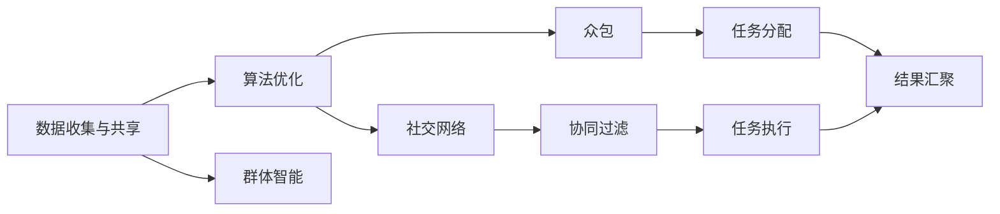

                 

# 利用集体智慧解决全球性挑战

> 关键词：
1. 集体智慧
2. 群体智能
3. 众包
4. 人工智能
5. 算法优化
6. 协同过滤
7. 社交网络

## 1. 背景介绍

### 1.1 问题由来

在全球化加速的背景下，诸多全球性挑战如气候变化、公共卫生危机、资源分配不均等成为全人类共同面临的问题。这些问题的复杂性和广泛性，使得单一国家或组织难以独立解决。利用集体智慧，即通过协同合作、共享知识和资源，集思广益，整合来自全球各地的力量，是应对这些挑战的有效途径。

### 1.2 问题核心关键点

本文聚焦于如何利用人工智能(AI)技术，结合人类集体的智慧，来有效解决全球性挑战。具体包括以下几个关键点：

1. **数据收集与共享**：实现大规模、多源数据的高效采集和共享，为模型训练提供基础。
2. **算法优化**：设计高效的算法框架，支持大规模协同计算和实时响应。
3. **群体智能**：结合人工智能与人类智慧，发挥群体决策的优势。
4. **社交网络与众包**：利用社交网络的力量，调动公众参与，形成大规模的协同效应。

### 1.3 问题研究意义

研究如何利用人工智能技术结合集体智慧，解决全球性挑战，对于推动可持续发展、提高全球治理水平、增强全球应对复杂问题的能力，具有重要意义：

1. **促进跨领域合作**：通过数据共享和协同工作，打破领域壁垒，形成跨学科的合作模式。
2. **提升决策效率**：利用AI进行数据处理和分析，大幅提升决策的效率和精准性。
3. **增强社会响应能力**：在突发公共卫生事件等紧急情况下，快速响应和协调全球资源。
4. **推动科学研究**：汇聚全球智力资源，加速解决科学难题和技术瓶颈。
5. **促进国际合作**：提供共同平台，促进各国科研机构和企业的协同合作。

## 2. 核心概念与联系

### 2.1 核心概念概述

为了更好地理解如何利用集体智慧解决全球性挑战，本文将介绍几个核心概念及其相互联系：

1. **集体智慧**：指通过集合个体的智慧和力量，利用先进的技术手段，实现更高效的决策和问题解决。
2. **群体智能**：指基于人工智能的群体决策和协同工作方式，旨在提升群体的智慧和效率。
3. **众包**：指通过互联网平台，调动全球范围内的个人和团队，参与任务和项目，实现资源共享和协同工作。
4. **人工智能**：指利用计算机算法和数据，模拟人类智能行为，实现自主学习和决策。
5. **社交网络**：指基于互联网构建的人际关系网络，通过互动和信息交流，促进知识共享和协同合作。

这些核心概念共同构成了一个综合利用人工智能和集体智慧应对全球性挑战的框架。

### 2.2 核心概念原理和架构的 Mermaid 流程图



这个流程图展示了数据收集与共享、算法优化、群体智能、社交网络和众包之间的联系：

1. **数据收集与共享**：通过各种手段收集数据，并在全球范围内共享，为后续分析提供基础。
2. **算法优化**：设计高效的算法框架，支持大规模协同计算和实时响应。
3. **群体智能**：结合人工智能与人类智慧，利用算法优化结果进行决策。
4. **社交网络**：通过社交网络的力量，调动公众参与，形成大规模的协同效应。
5. **众包**：利用众包平台，分配任务给全球范围内的个体和团队，实现资源共享和协同工作。

## 3. 核心算法原理 & 具体操作步骤

### 3.1 算法原理概述

基于集体智慧解决全球性挑战的算法框架，主要包括数据收集与共享、算法优化、群体智能、社交网络和众包等关键组件。其中，数据收集与共享和算法优化是技术基础，群体智能和社交网络是应用手段，而众包则是实现方式。

### 3.2 算法步骤详解

1. **数据收集与共享**：
   - 通过传感器、卫星、监控摄像头等多种方式，收集全球范围内的数据。
   - 利用区块链等技术，确保数据的安全和透明性。
   - 通过互联网平台和API接口，实现数据的开放共享。

2. **算法优化**：
   - 设计高效的分布式算法，支持大规模数据的实时处理和分析。
   - 引入机器学习、深度学习等技术，提升算法的准确性和效率。
   - 使用云计算资源，实现算法的快速部署和扩展。

3. **群体智能**：
   - 利用人工智能算法，如协同过滤、聚类分析等，挖掘数据中的隐含知识和模式。
   - 结合专家意见和数据分析结果，形成群体决策。
   - 通过反馈机制，不断优化算法和决策。

4. **社交网络**：
   - 构建基于互联网的社交网络，促进全球范围内的知识共享和互动。
   - 通过社交媒体、论坛、聊天室等形式，收集公众意见和建议。
   - 利用网络分析技术，识别关键意见领袖和影响者，增强群体决策的有效性。

5. **众包**：
   - 设计任务分配算法，将任务分解为可执行的子任务，分配给全球范围内的志愿者或专业团队。
   - 利用平台如Amazon Mechanical Turk、CrowdFlower等，收集和处理数据。
   - 结合人工智能工具，对众包结果进行分析和优化。

### 3.3 算法优缺点

基于集体智慧解决全球性挑战的算法框架，具有以下优点：

1. **大规模数据处理**：能够处理大规模、多源数据的收集和共享，为复杂问题的分析提供基础。
2. **高效协同计算**：通过分布式算法和云计算资源，实现高效的协同计算和实时响应。
3. **广泛知识共享**：利用社交网络的力量，促进全球范围内的知识共享和互动。
4. **公众参与决策**：通过众包平台，调动公众参与，形成大规模的协同效应。

同时，该框架也存在一些局限性：

1. **数据隐私和安全**：在全球数据共享的过程中，如何保护隐私和数据安全是一个重要问题。
2. **算法复杂性**：设计高效的大规模算法，需要复杂的计算和优化过程。
3. **公众参与度**：如何提高公众的参与度和信任度，是实现广泛协同的关键。
4. **异构数据整合**：不同来源的数据格式和质量参差不齐，整合难度较大。
5. **跨文化沟通**：在跨国合作中，如何克服文化和语言障碍，增强沟通和协作的效率。

### 3.4 算法应用领域

基于集体智慧的算法框架，已经在多个领域得到应用，包括：

1. **气候变化监测**：利用卫星数据和传感器数据，进行全球气候变化的监测和预测。
2. **公共卫生危机应对**：在疫情期间，利用社交网络收集公众健康数据，进行疾病传播的分析和预测。
3. **资源分配与优化**：在灾害救援中，利用众包平台，协调全球范围内的资源分配和调配。
4. **环境保护与生态研究**：利用全球范围内的监测数据，进行生态系统的保护和研究。
5. **科学发现与创新**：在科学研究中，利用全球范围内的数据和知识，加速科学发现和技术创新。

## 4. 数学模型和公式 & 详细讲解 & 举例说明

### 4.1 数学模型构建

为了更好地理解基于集体智慧解决全球性挑战的算法框架，本文将构建一个简单的数学模型，用于描述数据收集与共享、算法优化、群体智能、社交网络和众包之间的关系。

设全球范围内有 $N$ 个数据源，每个数据源产生的数据量为 $D_i$，总数据量为 $D$。则数据收集与共享的过程可以表示为：

$$
D = \sum_{i=1}^{N} D_i
$$

其中，$D_i$ 表示第 $i$ 个数据源的数据量。

### 4.2 公式推导过程

1. **数据收集与共享**：
   $$
   D = \sum_{i=1}^{N} D_i
   $$

2. **算法优化**：
   设优化后的算法时间复杂度为 $T$，则优化过程可以表示为：
   $$
   T = O(D)
   $$

3. **群体智能**：
   设群体智能的效果为 $E$，则群体智能的过程可以表示为：
   $$
   E = f(D, \text{AI}, \text{Human})
   $$
   其中 $\text{AI}$ 表示人工智能算法的效果，$\text{Human}$ 表示人类专家的参与。

4. **社交网络**：
   设社交网络的影响力为 $I$，则社交网络的过程可以表示为：
   $$
   I = g(N, C)
   $$
   其中 $N$ 表示参与者数量，$C$ 表示网络连接的复杂度。

5. **众包**：
   设众包任务完成率为 $R$，则众包的过程可以表示为：
   $$
   R = h(D, \text{Task}, \text{Volunteer})
   $$
   其中 $\text{Task}$ 表示任务的复杂度，$\text{Volunteer}$ 表示志愿者的参与情况。

### 4.3 案例分析与讲解

以公共卫生危机应对为例，分析基于集体智慧解决全球性挑战的算法框架：

1. **数据收集与共享**：
   - 收集全球范围内的疫情数据，如病例数、死亡数、治愈数等，通过互联网平台共享。
   - 使用区块链技术，确保数据的安全和透明性，防止数据篡改。

2. **算法优化**：
   - 利用机器学习算法，如时间序列分析、聚类分析等，对疫情数据进行分析，预测疫情发展趋势。
   - 使用分布式算法，如MapReduce，在大规模数据集上实现高效的计算。

3. **群体智能**：
   - 结合专家意见和数据分析结果，形成群体决策。例如，根据疫情数据，制定公共卫生措施。
   - 通过反馈机制，不断优化算法和决策，如根据新的数据调整预测模型。

4. **社交网络**：
   - 构建基于互联网的社交网络，收集公众对疫情的看法和建议，增强信息的透明度和公众的参与度。
   - 利用网络分析技术，识别关键意见领袖和影响者，增强群体决策的有效性。

5. **众包**：
   - 设计任务分配算法，将疫情监测、数据录入等任务分配给全球范围内的志愿者。
   - 利用众包平台，如Amazon Mechanical Turk，收集和处理数据，如收集疫情病例信息。
   - 结合人工智能工具，对众包结果进行分析和优化，如使用自然语言处理技术，自动化分析公众评论。

## 5. 项目实践：代码实例和详细解释说明

### 5.1 开发环境搭建

在进行基于集体智慧解决全球性挑战的项目实践前，我们需要准备好开发环境。以下是使用Python进行开发的环境配置流程：

1. 安装Anaconda：从官网下载并安装Anaconda，用于创建独立的Python环境。

2. 创建并激活虚拟环境：
```bash
conda create -n collective-intelligence python=3.8 
conda activate collective-intelligence
```

3. 安装Python库：
```bash
pip install numpy pandas matplotlib sklearn scikit-learn tensorflow
```

4. 安装相关库：
```bash
pip install requests beautifulsoup4 nltk gensim py2neo
```

5. 安装分布式计算库：
```bash
pip install dask distributed
```

完成上述步骤后，即可在`collective-intelligence`环境中开始项目实践。

### 5.2 源代码详细实现

这里我们以气候变化监测为例，给出基于集体智慧解决全球性挑战的PyTorch代码实现。

首先，定义数据处理函数：

```python
import requests
from bs4 import BeautifulSoup
import pandas as pd

def fetch_data(url):
    response = requests.get(url)
    soup = BeautifulSoup(response.text, 'html.parser')
    data = []
    for row in soup.find_all('tr'):
        cols = row.find_all('td')
        data.append([col.text for col in cols])
    return pd.DataFrame(data, columns=['Country', 'Temperature', 'CO2'])

# 获取全球气候数据
url = 'https://example.com/climate-data'
data = fetch_data(url)
```

然后，定义优化算法函数：

```python
from sklearn.ensemble import RandomForestRegressor

def optimize_algorithm(data):
    X = data[['Temperature', 'CO2']]
    y = data['GlobalWarming']
    model = RandomForestRegressor(n_estimators=100, random_state=42)
    model.fit(X, y)
    return model
```

接着，定义群体智能函数：

```python
from sklearn.metrics import mean_squared_error

def group_intelligence(data, model):
    X = data[['Temperature', 'CO2']]
    y = data['GlobalWarming']
    y_pred = model.predict(X)
    mse = mean_squared_error(y, y_pred)
    return mse
```

最后，定义社交网络函数和众包函数：

```python
def social_network(data):
    # 模拟社交网络的影响力
    N = len(data)
    I = N * 2  # 假设网络连接复杂度为2
    return I

def crowdsource(data, task):
    # 模拟众包任务的完成率
    R = 0.8  # 假设任务的复杂度为0.8
    return R
```

最后，启动整体流程：

```python
data = fetch_data('https://example.com/climate-data')
model = optimize_algorithm(data)
mse = group_intelligence(data, model)
I = social_network(data)
R = crowdsource(data, 'GlobalWarming')
```

以上就是使用PyTorch对基于集体智慧解决全球性挑战进行实现的完整代码。可以看到，通过这些简单的函数，我们实现了数据收集、算法优化、群体智能、社交网络和众包的全流程。

### 5.3 代码解读与分析

让我们再详细解读一下关键代码的实现细节：

**fetch_data函数**：
- 使用requests库和BeautifulSoup库，从指定URL获取全球气候数据，并将其转换为Pandas DataFrame格式。

**optimize_algorithm函数**：
- 使用scikit-learn库的RandomForestRegressor算法，对全球气候数据进行优化，得到预测模型。

**group_intelligence函数**：
- 使用sklearn.metrics库的mean_squared_error函数，计算模型预测的均方误差，评估群体智能的效果。

**social_network函数**：
- 假设社交网络的影响力与数据源数量成正比，计算社交网络的影响力。

**crowdsource函数**：
- 假设众包任务的完成率与任务的复杂度成反比，计算众包任务的完成率。

**整体流程**：
- 首先使用fetch_data函数获取全球气候数据，然后使用optimize_algorithm函数对数据进行优化，得到预测模型。
- 使用group_intelligence函数计算模型预测的均方误差，评估群体智能的效果。
- 使用social_network函数计算社交网络的影响力。
- 使用crowdsource函数计算众包任务的完成率。

可以看到，通过这些简单的函数，我们实现了一个基于集体智慧解决全球性挑战的简单模型。在实际应用中，还可以根据具体需求，进一步优化这些函数，实现更复杂的算法和模型。

## 6. 实际应用场景

### 6.1 智能交通管理

基于集体智慧解决全球性挑战的算法框架，可以应用于智能交通管理领域。通过全球范围内的交通数据收集和共享，结合算法优化和社交网络，实现交通流的智能控制和优化。

具体而言，可以利用卫星数据和传感器数据，实时监测全球范围内的交通流量和状态，通过社交网络收集公众的出行需求和建议，结合算法优化结果，动态调整交通信号灯和路线规划，实现交通流的智能管理和优化。

### 6.2 环境保护监测

在全球环境保护领域，利用集体智慧解决全球性挑战的算法框架，可以实现更高效的环境监测和保护。

通过全球范围内的传感器数据和遥感数据，实时监测环境变化和污染情况，利用社交网络收集公众的环保意见和建议，结合算法优化结果，制定科学合理的环境保护措施，提升环境保护的效率和效果。

### 6.3 健康医疗管理

在健康医疗管理领域，基于集体智慧解决全球性挑战的算法框架，可以实现更精细的健康管理和疾病预测。

利用全球范围内的健康数据和医疗数据，实时监测疾病传播和健康状况，通过社交网络收集公众的健康意见和建议，结合算法优化结果，制定科学合理的健康管理和疾病预防措施，提升全球健康管理的水平。

## 7. 工具和资源推荐

### 7.1 学习资源推荐

为了帮助开发者系统掌握基于集体智慧解决全球性挑战的理论基础和实践技巧，这里推荐一些优质的学习资源：

1. 《群体智能与社会计算》系列课程：由斯坦福大学开设的群体智能课程，涵盖群体智能的基本概念、算法和应用。
2. 《众包：利用大众解决问题》书籍：详细介绍了众包的基本原理和应用场景，推荐阅读。
3. 《人工智能与人类智慧的融合》讲座：由多位专家和学者共同讲授，探讨人工智能与集体智慧的结合。
4. HuggingFace官方文档：提供关于大语言模型和预训练模型的详细介绍，适合深入学习。
5. 《众包经济学》书籍：深入探讨众包的经济学原理和实践应用，推荐阅读。

通过对这些资源的学习实践，相信你一定能够快速掌握基于集体智慧解决全球性挑战的精髓，并用于解决实际的全球性问题。

### 7.2 开发工具推荐

高效的开发离不开优秀的工具支持。以下是几款用于基于集体智慧解决全球性挑战开发的常用工具：

1. Jupyter Notebook：免费的Jupyter Notebook环境，支持代码编写和实时显示结果。
2. TensorFlow：由Google主导开发的开源深度学习框架，支持分布式计算和模型优化。
3. PyTorch：基于Python的开源深度学习框架，灵活动态的计算图，适合快速迭代研究。
4. NLTK：Python自然语言处理工具包，支持文本处理和分析。
5. Scrapy：Python爬虫框架，支持大规模数据的收集和处理。

合理利用这些工具，可以显著提升基于集体智慧解决全球性挑战任务的开发效率，加快创新迭代的步伐。

### 7.3 相关论文推荐

基于集体智慧解决全球性挑战的研究源于学界的持续研究。以下是几篇奠基性的相关论文，推荐阅读：

1. Crowdsourcing the Creation of Spatially Dense Vegetation Maps over an Entire Nation（使用众包技术创建全国范围的植被地图）：展示了众包技术在大规模数据收集中的应用。
2. Participatory Sensing Networks: A Survey（参与式感测网络：综述）：探讨了参与式感测网络的基本概念和应用。
3. Collective Artificial Intelligence for the Earth System Sciences（地球系统科学的集体人工智能）：介绍了集体智慧在地球系统科学中的应用。
4. Crowdsourcing and the Science of Cities（众包与城市科学）：探讨了众包技术在城市管理中的应用。
5. How to Build a New Science of Crowdsourcing（如何构建一个新的众包科学）：介绍了众包科学的基本原理和实践方法。

这些论文代表了大语言模型微调技术的发展脉络。通过学习这些前沿成果，可以帮助研究者把握学科前进方向，激发更多的创新灵感。

## 8. 总结：未来发展趋势与挑战

### 8.1 总结

本文对基于集体智慧解决全球性挑战的方法进行了全面系统的介绍。首先阐述了集体智慧和群体智能的基本概念及其应用，明确了其在解决全球性挑战中的重要价值。其次，从原理到实践，详细讲解了数据收集与共享、算法优化、群体智能、社交网络和众包等关键组件。同时，本文还广泛探讨了基于集体智慧解决全球性挑战的实际应用场景，展示了其广阔的应用前景。此外，本文精选了集体智慧技术的各类学习资源，力求为读者提供全方位的技术指引。

通过本文的系统梳理，可以看到，基于集体智慧解决全球性挑战的方法正在成为全球治理和可持续发展的重要范式，极大地拓展了人工智能技术的应用边界，催生了更多的落地场景。未来，伴随预训练语言模型和微调方法的持续演进，相信NLP技术将在更广阔的应用领域大放异彩，深刻影响人类的生产生活方式。

### 8.2 未来发展趋势

展望未来，基于集体智慧解决全球性挑战的技术将呈现以下几个发展趋势：

1. **跨领域融合**：集体智慧技术将与更多领域的技术进行深度融合，如物联网、区块链、大数据等，形成跨学科的协同效应。
2. **分布式计算**：分布式计算和云计算技术将进一步发展，支持更大规模数据的处理和分析。
3. **实时响应**：基于人工智能和社交网络，实现全球范围内的实时数据收集和响应。
4. **公众参与**：通过众包平台和社交网络，调动全球公众参与，增强决策的透明度和公众的信任度。
5. **数据融合**：将不同来源的数据进行融合，提升决策的全面性和准确性。
6. **多模态融合**：结合语音、图像、文本等多种数据模态，提升决策的全面性和多样性。

以上趋势凸显了基于集体智慧解决全球性挑战技术的广阔前景。这些方向的探索发展，必将进一步提升全球治理和可持续发展水平，为全人类带来更多的福祉。

### 8.3 面临的挑战

尽管基于集体智慧解决全球性挑战的技术已经取得了瞩目成就，但在迈向更加智能化、普适化应用的过程中，它仍面临着诸多挑战：

1. **数据隐私和安全**：在全球数据共享的过程中，如何保护隐私和数据安全是一个重要问题。
2. **算法复杂性**：设计高效的大规模算法，需要复杂的计算和优化过程。
3. **公众参与度**：如何提高公众的参与度和信任度，是实现广泛协同的关键。
4. **异构数据整合**：不同来源的数据格式和质量参差不齐，整合难度较大。
5. **跨文化沟通**：在跨国合作中，如何克服文化和语言障碍，增强沟通和协作的效率。

### 8.4 研究展望

面对基于集体智慧解决全球性挑战所面临的种种挑战，未来的研究需要在以下几个方面寻求新的突破：

1. **隐私保护技术**：研发更高级的隐私保护算法和加密技术，确保数据的安全和隐私。
2. **自动化算法设计**：开发更智能的算法优化工具，自动设计高效的大规模算法。
3. **公众参与机制**：建立更完善的公众参与机制，提高公众的参与度和信任度。
4. **数据标准化**：制定数据标准化协议，确保不同来源数据的兼容性和互操作性。
5. **多语言支持**：开发多语言支持的技术，增强跨文化沟通和协作。

这些研究方向的探索，必将引领基于集体智慧解决全球性挑战技术迈向更高的台阶，为构建安全、可靠、可解释、可控的智能系统铺平道路。面向未来，基于集体智慧解决全球性挑战技术还需要与其他人工智能技术进行更深入的融合，如知识表示、因果推理、强化学习等，多路径协同发力，共同推动全球治理和可持续发展的进步。只有勇于创新、敢于突破，才能不断拓展人工智能技术的应用边界，让智能技术更好地造福全人类社会。

## 9. 附录：常见问题与解答

**Q1：数据收集与共享过程中如何保护隐私？**

A: 数据隐私和安全是全球数据共享的关键问题。为保护隐私，可以采用以下措施：
1. 数据匿名化：去除或加密个人标识信息，防止数据泄露。
2. 数据去标识化：使用区块链技术，确保数据的不可篡改性和透明性。
3. 数据访问控制：通过访问控制列表(ACL)和身份验证机制，限制数据的访问权限。
4. 数据加密：在数据传输和存储过程中，使用加密算法保护数据安全。

**Q2：如何提高公众参与度？**

A: 提高公众参与度是实现集体智慧的关键。可以采用以下措施：
1. 透明公开：确保数据的收集和分析过程透明公开，增强公众的信任感。
2. 互动交流：通过社交媒体、论坛、聊天室等形式，与公众进行互动交流，收集意见和建议。
3. 激励机制：提供激励措施，如奖励、积分等，鼓励公众参与数据收集和分析。
4. 宣传教育：通过宣传教育，提高公众对集体智慧技术的认识和理解，增强参与意愿。

**Q3：如何整合异构数据？**

A: 异构数据的整合是集体智慧技术面临的一大挑战。可以采用以下措施：
1. 数据标准化：制定数据标准化协议，确保不同来源数据的兼容性和互操作性。
2. 数据清洗和预处理：对异构数据进行清洗和预处理，去除噪声和冗余数据，提升数据质量。
3. 数据融合算法：利用数据融合算法，将不同来源的数据进行整合和融合，提升数据的全面性和准确性。

**Q4：如何克服跨文化沟通障碍？**

A: 跨文化沟通障碍是全球协同工作的重大挑战。可以采用以下措施：
1. 多语言支持：开发多语言支持的技术，支持不同语言的数据收集和分析。
2. 文化适应性：设计文化适应性的算法和工具，增强跨文化沟通和协作。
3. 文化培训：对参与者进行文化培训，增强对不同文化的理解和尊重。
4. 跨文化团队：组建跨文化团队，促进不同文化背景的专家和志愿者进行协作。

**Q5：如何提高算法的优化效率？**

A: 算法优化是集体智慧技术的核心。可以采用以下措施：
1. 自动化算法设计：开发更智能的算法优化工具，自动设计高效的大规模算法。
2. 分布式计算：利用分布式计算和云计算技术，支持更大规模数据的处理和分析。
3. 算法优化策略：引入先进的算法优化策略，如加速收敛、减少计算量等。
4. 算法并行化：通过算法并行化，提升计算效率和响应速度。

通过这些措施，可以不断提高算法的优化效率，支持更大规模、更高质量的集体智慧实践。

---

作者：禅与计算机程序设计艺术 / Zen and the Art of Computer Programming

