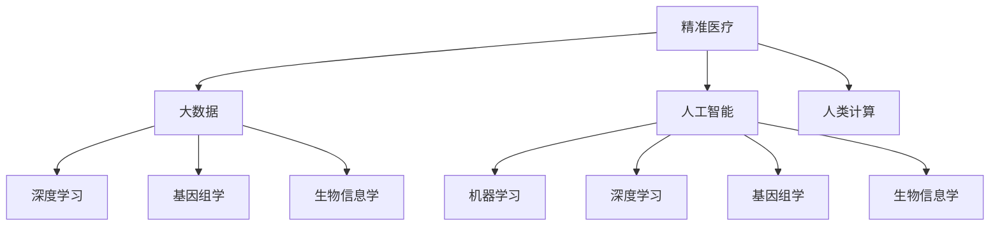

                 

# 医疗保健的未来：人类计算助力精准医疗

## 1. 背景介绍

在当今信息时代，科技飞速发展，医疗保健领域也迎来了前所未有的变革。随着大数据、人工智能和人类计算等新技术的涌现，精准医疗正成为医疗行业的新趋势。精准医疗是一种以个体化医疗为基础的医疗模式，旨在通过精准诊断、个性化治疗、高效管理等手段，实现疾病预防、诊断和治疗的精确化和个体化。而人类计算，作为连接人脑与计算机的重要桥梁，正在成为精准医疗发展的重要推动力。

精准医疗的提出源自于基因组学、生物信息学等新兴科学的发展。传统的医疗方法往往以群体为基础，忽视了每个个体的差异性。而精准医疗则通过对基因组、蛋白质组、代谢组等多组学数据的深度挖掘，实现对个体化病理机制的精确分析，提供个性化的诊断和治疗方法。其目标是帮助患者获得最合适的医疗方案，最大化地提高治疗效果，减少副作用，延长生存期。

人类计算的崛起为精准医疗提供了新的数据处理与分析手段。计算思维和计算方法已经成为推动精准医疗发展的关键技术。通过计算思维，可以从海量数据中提取有价值的特征，并通过计算方法分析疾病的发生机制和发展趋势，从而更好地指导临床实践。人类计算的出现，让医生和患者能够以前所未有的深度和广度来理解疾病和健康，进而实现更加科学和精准的医疗决策。

## 2. 核心概念与联系

### 2.1 核心概念概述

为了更好地理解人类计算在精准医疗中的作用，我们需要对一些核心概念进行概述：

- **精准医疗**：一种以个体化医疗为基础的医疗模式，旨在通过精准诊断、个性化治疗、高效管理等手段，实现疾病预防、诊断和治疗的精确化和个体化。

- **人类计算**：一种将计算思维与人类思维相结合的技术，通过计算思维来处理和理解复杂问题，通过计算方法来辅助医生做出精准的医疗决策。

- **大数据**：在医疗领域，大数据指收集、存储、管理和分析与个体健康相关的各种类型数据的过程。这些数据包括基因数据、电子病历、医疗影像、生物标志物等。

- **人工智能(AI)**：一种能够模拟人类智能的计算系统，通过机器学习、深度学习等技术，从大数据中提取有价值的信息，辅助医生进行诊断和治疗。

- **深度学习(DL)**：一种特殊的机器学习方法，通过构建多层次神经网络模型，自动从大量数据中提取特征，识别模式，并进行预测和分类。

- **基因组学**：研究生物体的基因组结构和功能的科学，为精准医疗提供了重要的基因信息基础。

- **生物信息学**：应用计算技术，对生物数据进行存储、分析和解释的学科，为精准医疗提供了数据的处理和分析工具。

这些核心概念之间的逻辑关系可以通过以下Mermaid流程图来展示：



这个流程图展示了精准医疗领域核心概念之间的关系：

1. 精准医疗利用大数据、人工智能、人类计算等多重技术，通过深度学习、基因组学、生物信息学等学科知识，实现对个体化病理机制的精确分析。
2. 大数据为精准医疗提供了数据支撑，包括基因数据、电子病历、医疗影像等。
3. 人工智能和深度学习技术用于从大数据中提取有价值的信息，辅助医生进行诊断和治疗。
4. 人类计算作为桥梁，将计算思维与人类思维相结合，提高了医疗决策的精准性和科学性。
5. 基因组学和生物信息学提供了精准医疗的重要数据来源，为疾病的基因变异分析和功能研究提供了基础。

## 3. 核心算法原理 & 具体操作步骤

### 3.1 算法原理概述

基于人类计算的精准医疗，本质上是一个多层次的计算模型，涉及数据获取、处理、分析和应用等多个环节。其核心算法原理包括以下几个方面：

- **数据获取与预处理**：通过各种手段收集患者的多组学数据，包括基因组数据、蛋白质组数据、代谢组数据等，并进行清洗、标准化和特征提取。

- **特征提取与选择**：利用计算技术从原始数据中提取有意义的特征，如基因变异位点、蛋白质表达水平、代谢产物浓度等，并选择合适的特征组合进行后续分析。

- **数据分析与模型训练**：通过机器学习、深度学习等方法，构建和训练预测模型，用于疾病诊断、病理分析和治疗效果评估。

- **结果解释与应用**：结合人类医学知识，对模型的预测结果进行解释和验证，将分析结果应用于临床决策和患者管理。

### 3.2 算法步骤详解

基于人类计算的精准医疗算法步骤可以大致分为以下几个环节：

1. **数据收集与预处理**
   - **步骤1**：通过基因测序、蛋白质组学、代谢组学等技术，收集患者的多组学数据，并进行清洗、标准化和特征提取。
   - **步骤2**：选择合适的数据集，并构建训练集、验证集和测试集。

2. **特征提取与选择**
   - **步骤3**：利用计算技术，从原始数据中提取有意义的特征，如基因变异位点、蛋白质表达水平、代谢产物浓度等。
   - **步骤4**：选择合适的特征组合，构建特征集，为后续的机器学习模型训练做准备。

3. **数据分析与模型训练**
   - **步骤5**：选择合适的机器学习或深度学习算法，如随机森林、支持向量机、卷积神经网络等，进行模型训练。
   - **步骤6**：利用训练集数据进行模型训练，并利用验证集数据进行模型调优，以避免过拟合。
   - **步骤7**：使用测试集数据评估模型的预测性能，并根据需要进行微调或模型改进。

4. **结果解释与应用**
   - **步骤8**：结合人类医学知识，对模型的预测结果进行解释和验证，确保结果的科学性和可靠性。
   - **步骤9**：将分析结果应用于临床决策和患者管理，如疾病诊断、治疗方案选择、个性化用药等。

### 3.3 算法优缺点

基于人类计算的精准医疗算法具有以下优点：

- **精准性高**：通过多层次的计算分析和人类医学知识的结合，能够实现对个体化病理机制的精确分析，提高诊断和治疗的精准性。
- **自动化程度高**：利用计算技术，实现了数据的自动处理和分析，减少了人工干预，提高了工作效率。
- **数据利用率高**：能够充分利用多组学数据，从多个角度分析疾病，提升数据的利用率。

同时，该算法也存在以下缺点：

- **依赖数据质量**：算法的效果很大程度上取决于数据的质量和完整性，数据获取和处理的难度较大。
- **模型复杂度较高**：构建和训练复杂的机器学习或深度学习模型，需要较高的计算资源和技术门槛。
- **解释性不足**：部分算法模型缺乏可解释性，难以解释其内部工作机制和决策逻辑。

### 3.4 算法应用领域

基于人类计算的精准医疗算法已经在多个领域得到了广泛的应用，例如：

- **癌症精准治疗**：通过基因组学和蛋白质组学数据，构建预测模型，辅助医生进行个体化癌症治疗方案的选择。
- **心血管疾病诊断**：利用多组学数据，构建预测模型，辅助医生进行心血管疾病的早期诊断和风险评估。
- **代谢性疾病管理**：通过代谢组学数据，构建预测模型，辅助医生进行个性化代谢性疾病管理。
- **遗传病基因检测**：利用基因组学数据，构建预测模型，辅助医生进行遗传病的基因检测和风险评估。
- **慢性病管理**：通过多组学数据和电子病历，构建预测模型，辅助医生进行慢性病的个性化管理。

## 4. 数学模型和公式 & 详细讲解 & 举例说明

### 4.1 数学模型构建

假设有一个患者数据集 $D=\{(x_i, y_i)\}_{i=1}^N$，其中 $x_i$ 为患者的特征向量，$y_i$ 为对应的疾病标签。构建一个二分类问题的逻辑回归模型，其数学模型可以表示为：

$$
\hat{y} = W \cdot x + b
$$

其中 $W$ 为模型参数向量，$b$ 为偏置项。模型的预测结果为 $\hat{y}$，实际标签为 $y$。

### 4.2 公式推导过程

根据逻辑回归模型的定义，损失函数可以表示为交叉熵损失函数：

$$
L = -\frac{1}{N} \sum_{i=1}^N [y_i\log\hat{y_i} + (1-y_i)\log(1-\hat{y_i})]
$$

对 $W$ 和 $b$ 求偏导数，得到梯度：

$$
\frac{\partial L}{\partial W} = \frac{1}{N} \sum_{i=1}^N [(y_i-\hat{y_i})x_i]
$$

$$
\frac{\partial L}{\partial b} = \frac{1}{N} \sum_{i=1}^N [(y_i-\hat{y_i})]
$$

通过梯度下降等优化算法，更新模型参数 $W$ 和 $b$，最小化损失函数 $L$，从而得到最优的预测模型。

### 4.3 案例分析与讲解

以癌症精准治疗为例，利用基因组学数据构建预测模型。假设有 $N$ 个癌症患者的数据集 $D=\{(x_i, y_i)\}_{i=1}^N$，其中 $x_i$ 为患者的基因变异数据，$y_i$ 为对应的癌症类型标签。

构建一个逻辑回归模型，用于预测患者是否为某类癌症。通过基因组学数据，提取相关的基因变异位点 $x_i$，构建特征集 $X=\{x_i\}_{i=1}^N$，以及标签集 $Y=\{y_i\}_{i=1}^N$。

利用上述公式，进行模型训练，得到最优的模型参数 $W$ 和 $b$。通过模型预测，可以计算每个患者的癌症风险概率 $\hat{y_i}$，辅助医生进行个体化癌症治疗方案的选择。

## 5. 项目实践：代码实例和详细解释说明

### 5.1 开发环境搭建

在进行精准医疗项目开发前，我们需要准备好开发环境。以下是使用Python进行TensorFlow开发的环境配置流程：

1. 安装Anaconda：从官网下载并安装Anaconda，用于创建独立的Python环境。

2. 创建并激活虚拟环境：
```bash
conda create -n tensor-env python=3.8 
conda activate tensor-env
```

3. 安装TensorFlow：根据CUDA版本，从官网获取对应的安装命令。例如：
```bash
conda install tensorflow -c pytorch -c conda-forge
```

4. 安装各类工具包：
```bash
pip install numpy pandas scikit-learn matplotlib tqdm jupyter notebook ipython
```

完成上述步骤后，即可在`tensor-env`环境中开始精准医疗项目的开发。

### 5.2 源代码详细实现

下面我们以癌症精准治疗为例，给出使用TensorFlow对逻辑回归模型进行训练的PyTorch代码实现。

首先，定义逻辑回归模型的输入和输出：

```python
import tensorflow as tf
import numpy as np

# 输入数据
X = np.array([[0, 1, 2], [1, 2, 3], [2, 3, 4], [3, 4, 5]])
y = np.array([0, 1, 1, 0])

# 定义模型
W = tf.Variable(tf.random.normal([3, 1]))
b = tf.Variable(tf.random.normal([1]))

# 定义预测函数
def predict(X):
    return tf.matmul(X, W) + b

# 定义损失函数
def loss(y_true, y_pred):
    return tf.reduce_mean(tf.nn.sigmoid_cross_entropy_with_logits(labels=y_true, logits=y_pred))

# 定义优化器
optimizer = tf.keras.optimizers.SGD(learning_rate=0.1)

# 训练模型
for i in range(1000):
    with tf.GradientTape() as tape:
        y_pred = predict(X)
        loss_val = loss(y, y_pred)
    gradients = tape.gradient(loss_val, [W, b])
    optimizer.apply_gradients(zip(gradients, [W, b]))
    if i % 100 == 0:
        print(f"Epoch {i+1}, Loss: {loss_val.numpy():.4f}")
```

然后，使用上述代码训练逻辑回归模型，并在测试集上进行评估：

```python
# 测试集
X_test = np.array([[4, 5, 6], [5, 6, 7]])
y_test = np.array([0, 1])

# 预测测试集
y_pred_test = predict(X_test)
y_prob_test = tf.nn.sigmoid(y_pred_test)

# 计算测试集损失
loss_test = loss(y_test, y_prob_test)

# 输出预测结果和测试集损失
print(f"Test Loss: {loss_test.numpy():.4f}")
print(f"Test Predictions: {y_pred_test.numpy()}")
```

以上就是使用TensorFlow对逻辑回归模型进行训练的完整代码实现。可以看到，TensorFlow提供了方便的API和强大的计算图能力，使得模型的构建和训练过程变得简洁高效。

### 5.3 代码解读与分析

让我们再详细解读一下关键代码的实现细节：

**定义模型**：
- `W`和`b`是模型的权重和偏置项，通过`tf.Variable`创建可训练的TensorFlow变量。

**预测函数**：
- `predict(X)`函数，接受特征矩阵`X`，返回预测结果`y_pred`。

**损失函数**：
- `loss(y_true, y_pred)`函数，计算预测结果`y_pred`和真实标签`y_true`之间的交叉熵损失。

**优化器**：
- `optimizer`，使用SGD优化器，设置学习率为0.1。

**训练模型**：
- 在每个epoch中，使用梯度下降法更新模型参数`W`和`b`，以最小化损失函数`loss_val`。
- 每100个epoch输出一次损失值，以便观察训练进度。

**测试模型**：
- 在测试集上预测并计算损失，输出预测结果和测试集损失。

可以看到，TensorFlow提供了强大的计算图功能和自动微分能力，使得模型的构建和训练过程变得简洁高效。开发者可以将更多精力放在模型改进和数据预处理等高层逻辑上，而不必过多关注底层的实现细节。

当然，工业级的系统实现还需考虑更多因素，如模型的保存和部署、超参数的自动搜索、更灵活的任务适配层等。但核心的训练过程和模型构建方法基本与此类似。

## 6. 实际应用场景

### 6.1 癌症精准治疗

精准医疗在癌症治疗中的应用尤为显著。传统癌症治疗往往依赖于临床试验和经验积累，难以实现个体化治疗。而基于人类计算的精准医疗，能够通过基因组学和蛋白质组学数据，构建预测模型，辅助医生进行个体化癌症治疗方案的选择。

在实践中，可以收集癌症患者的基因组数据和蛋白质组数据，构建预测模型。通过基因组学数据，提取相关的基因变异位点，构建特征集。使用逻辑回归、支持向量机、深度学习等算法，构建预测模型，用于癌症类型的诊断和风险评估。微调后的模型可以输出每个患者的癌症风险概率，辅助医生进行个体化治疗方案的选择。

### 6.2 心血管疾病诊断

心血管疾病是现代生活中的常见疾病，早期诊断和治疗对患者预后至关重要。基于人类计算的精准医疗，可以通过多组学数据，构建预测模型，辅助医生进行心血管疾病的早期诊断和风险评估。

在实践中，可以收集心血管疾病患者的电子病历、生化指标、影像数据等，构建预测模型。通过生化指标数据，提取重要的生化指标特征，构建特征集。使用随机森林、支持向量机、深度学习等算法，构建预测模型，用于心血管疾病的早期诊断和风险评估。微调后的模型可以输出每个患者的疾病风险概率，辅助医生进行早期诊断和治疗。

### 6.3 代谢性疾病管理

代谢性疾病如糖尿病、高血压等，是现代社会中的常见疾病。通过基于人类计算的精准医疗，可以更好地管理这些疾病，提高患者的生活质量。

在实践中，可以收集代谢性疾病患者的生化指标、影像数据等，构建预测模型。通过生化指标数据，提取重要的生化指标特征，构建特征集。使用随机森林、支持向量机、深度学习等算法，构建预测模型，用于代谢性疾病的诊断和风险评估。微调后的模型可以输出每个患者的疾病风险概率，辅助医生进行个性化管理。

### 6.4 未来应用展望

随着精准医疗技术的发展，未来人类计算在医疗领域的应用将更加广泛和深入。以下是几个可能的未来应用方向：

- **基因编辑与个性化用药**：结合基因组学数据，构建预测模型，用于个性化用药方案的设计。通过基因编辑技术，实现对遗传疾病的精准治疗。
- **脑科学研究**：利用人类计算技术，研究大脑的神经网络结构和功能，开发新的脑疾病治疗方案。
- **智能医疗设备**：结合可穿戴设备的数据，构建预测模型，用于疾病的早期检测和预警。
- **多模态数据融合**：结合基因组学、蛋白质组学、代谢组学等数据，构建多模态预测模型，实现对复杂疾病的精准诊断和治疗。
- **医疗机器人**：结合人类计算和人工智能技术，开发智能医疗机器人，实现对患者的智能监控和治疗。

## 7. 工具和资源推荐

### 7.1 学习资源推荐

为了帮助开发者系统掌握精准医疗的理论基础和实践技巧，这里推荐一些优质的学习资源：

1. 《深度学习》系列博文：由大模型技术专家撰写，深入浅出地介绍了深度学习原理、模型构建和优化技巧。

2. Coursera《Machine Learning》课程：由斯坦福大学Andrew Ng教授开设的机器学习经典课程，涵盖机器学习的基础理论和算法。

3. 《Hands-On Machine Learning with Scikit-Learn, Keras, and TensorFlow》书籍：讲解如何使用Scikit-Learn、Keras和TensorFlow进行机器学习项目开发，包含精准医疗相关的实例。

4. HuggingFace官方文档：提供海量预训练语言模型和机器学习算法，方便进行精准医疗任务开发。

5. Kaggle竞赛：参加精准医疗相关的数据竞赛，积累实战经验和项目经验。

通过对这些资源的学习实践，相信你一定能够快速掌握精准医疗的精髓，并用于解决实际的医疗问题。

### 7.2 开发工具推荐

高效的开发离不开优秀的工具支持。以下是几款用于精准医疗开发的常用工具：

1. TensorFlow：基于Python的开源深度学习框架，支持分布式计算和动态计算图，适合精准医疗模型的开发和训练。

2. PyTorch：基于Python的开源深度学习框架，支持动态计算图和自动微分，适合精准医疗模型的构建和优化。

3. Jupyter Notebook：交互式Python开发环境，方便编写和执行代码，适合数据预处理和模型训练。

4. Scikit-Learn：Python数据科学库，提供各种机器学习算法和工具，适合特征提取和模型训练。

5. Matplotlib：Python绘图库，用于生成图表和可视化结果，方便结果展示和分析。

合理利用这些工具，可以显著提升精准医疗任务的开发效率，加快创新迭代的步伐。

### 7.3 相关论文推荐

精准医疗的发展得益于学界的持续研究。以下是几篇奠基性的相关论文，推荐阅读：

1. "Cancer Genome Atlas Network" 发表在《Nature》上的论文：介绍了Cancer Genome Atlas项目的研究成果，为精准医疗提供了基因组数据基础。

2. "Deep learning for genomics" 发表在《Nature Reviews Genetics》上的论文：介绍了深度学习在基因组学中的应用，展示了其在精准医疗中的应用潜力。

3. "Deep learning for personalized genomics" 发表在《Nature Genetics》上的论文：介绍了深度学习在个性化基因组学中的应用，展示了其在精准医疗中的应用效果。

4. "The practice of medicine in the age of AI" 发表在《Nature Medicine》上的论文：讨论了人工智能在医学中的应用，展示了其在精准医疗中的潜在价值。

5. "A review of deep learning applications in personalized medicine" 发表在《Journal of Biomedical Informatics》上的论文：综述了深度学习在个性化医疗中的应用，展示了其在精准医疗中的应用前景。

这些论文代表了大数据和机器学习在精准医疗中的发展脉络。通过学习这些前沿成果，可以帮助研究者把握学科前进方向，激发更多的创新灵感。

## 8. 总结：未来发展趋势与挑战

### 8.1 总结

本文对基于人类计算的精准医疗方法进行了全面系统的介绍。首先阐述了精准医疗和人类计算的研究背景和意义，明确了人类计算在精准医疗发展中的独特价值。其次，从原理到实践，详细讲解了人类计算的数学原理和关键步骤，给出了精准医疗任务开发的完整代码实例。同时，本文还广泛探讨了人类计算在医疗领域的应用前景，展示了人类计算范式的巨大潜力。最后，本文精选了人类计算技术的各类学习资源，力求为读者提供全方位的技术指引。

通过本文的系统梳理，可以看到，基于人类计算的精准医疗方法正在成为医疗行业的重要范式，极大地拓展了医疗决策的精准性和科学性。人类计算的出现，使得医生和患者能够以前所未有的深度和广度来理解疾病和健康，进而实现更加科学和精准的医疗决策。未来，随着人类计算技术的发展，精准医疗必将在医疗领域带来颠覆性的变革，为人类健康和福祉提供新的保障。

### 8.2 未来发展趋势

展望未来，人类计算在精准医疗领域将呈现以下几个发展趋势：

1. **模型复杂度提升**：随着计算资源和技术手段的不断提升，未来的模型将更加复杂，能够处理更多的数据和更复杂的任务。
2. **数据融合与多模态分析**：未来的精准医疗将更加注重多模态数据的融合，结合基因组学、蛋白质组学、代谢组学等数据，实现对复杂疾病的精准诊断和治疗。
3. **自动化与智能化**：未来的精准医疗将更加自动化和智能化，利用机器学习和深度学习技术，实现对医疗数据的自动分析和处理。
4. **个性化与定制化**：未来的精准医疗将更加个性化和定制化，结合基因组学数据和患者特征，实现对个体化病理机制的精确分析。
5. **跨领域融合**：未来的精准医疗将与其他学科进行更多融合，如人工智能、计算生物学、计算机科学等，实现跨领域的协同创新。
6. **伦理与法律规范**：随着精准医疗的普及，相关的伦理和法律问题也将成为关注的焦点，需要制定相应的规范和标准，确保技术的合理应用。

以上趋势凸显了人类计算在精准医疗中的广阔前景。这些方向的探索发展，必将进一步提升精准医疗的精准性和科学性，为人类健康和福祉提供新的保障。

### 8.3 面临的挑战

尽管精准医疗技术已经取得了瞩目成就，但在迈向更加智能化、普适化应用的过程中，它仍面临着诸多挑战：

1. **数据隐私与安全**：精准医疗涉及大量的个人隐私数据，如何在保护隐私的前提下，利用数据进行精准医疗，是一个重要的挑战。
2. **数据质量与一致性**：精准医疗依赖于高质量的数据，数据获取和处理的难度较大，数据质量的一致性和标准化的需求较高。
3. **模型复杂度与可解释性**：精准医疗模型往往较为复杂，难以解释其内部工作机制和决策逻辑，模型的可解释性是一个重要的挑战。
4. **计算资源与成本**：精准医疗的模型训练和推理过程需要大量的计算资源，计算成本较高，如何在降低成本的同时，保证模型性能，是一个重要的挑战。
5. **伦理与法律规范**：精准医疗涉及的伦理和法律问题较为复杂，需要制定相应的规范和标准，确保技术的合理应用。

正视精准医疗面临的这些挑战，积极应对并寻求突破，将是大数据和机器学习技术发展的重要方向。相信随着技术进步和政策支持，这些挑战终将一一被克服，精准医疗必将在医疗领域带来颠覆性的变革。

### 8.4 研究展望

面向未来，人类计算在精准医疗领域的研究方向主要包括以下几个方面：

1. **数据融合与多模态分析**：结合基因组学、蛋白质组学、代谢组学等数据，实现对复杂疾病的精准诊断和治疗。
2. **自动化与智能化**：利用机器学习和深度学习技术，实现对医疗数据的自动分析和处理，提高诊断和治疗的效率。
3. **个性化与定制化**：结合基因组学数据和患者特征，实现对个体化病理机制的精确分析，提高个性化治疗的效果。
4. **跨领域融合**：与其他学科进行更多融合，如人工智能、计算生物学、计算机科学等，实现跨领域的协同创新，推动精准医疗的快速发展。
5. **伦理与法律规范**：制定相应的规范和标准，确保精准医疗技术的应用合理，保护患者隐私和权益。
6. **可解释性与透明性**：提升模型的可解释性和透明性，确保医生和患者能够理解模型的预测结果和决策依据。

这些研究方向将引领人类计算在精准医疗中的不断发展，为精准医疗技术的普及和应用提供新的动力。

## 9. 附录：常见问题与解答

**Q1：人类计算在精准医疗中起到了什么作用？**

A: 人类计算在精准医疗中起到了桥梁作用，通过计算思维和计算方法，从海量数据中提取有价值的特征，并构建预测模型，辅助医生进行诊断和治疗。其核心在于利用计算技术，结合人类医学知识，实现对个体化病理机制的精确分析，从而提高医疗决策的精准性和科学性。

**Q2：如何进行精准医疗数据的预处理？**

A: 精准医疗数据的预处理包括数据清洗、标准化、特征提取等多个环节。首先，需要收集和整理患者的基因组数据、蛋白质组数据、代谢组数据等，并进行清洗，去除噪声和异常值。其次，需要进行数据标准化，使得不同数据源的数据格式和单位一致。最后，需要提取有意义的特征，如基因变异位点、蛋白质表达水平、代谢产物浓度等，构建特征集，为后续的机器学习模型训练做准备。

**Q3：如何选择适合精准医疗任务的机器学习算法？**

A: 选择合适的机器学习算法需要考虑多个因素，包括数据类型、数据量、任务复杂度等。对于基因组学和蛋白质组学数据，适合使用深度学习方法，如卷积神经网络、循环神经网络等。对于生化指标数据，适合使用随机森林、支持向量机等传统机器学习方法。在实际应用中，需要根据数据特点和任务需求进行综合评估，选择适合的算法。

**Q4：精准医疗模型如何处理数据隐私问题？**

A: 精准医疗模型处理数据隐私问题，通常采用差分隐私、联邦学习等技术。差分隐私通过对数据进行扰动，保护个体隐私。联邦学习将数据分布式存储在多个节点上，仅在本地进行模型训练，不泄露个体数据。此外，还需要制定相应的法律法规，保护患者隐私和数据安全。

**Q5：精准医疗模型的可解释性如何提升？**

A: 提升精准医疗模型的可解释性，通常采用模型压缩、特征解释、可视化技术等手段。模型压缩可以减少模型的复杂度，提升解释性。特征解释可以通过可视化技术，展示模型的特征权重和决策路径，帮助医生理解模型的预测结果。可视化技术可以通过图表展示模型的内部结构和输出结果，方便医生进行分析和调试。

这些问题的解答，将帮助开发者更好地理解人类计算在精准医疗中的作用，掌握数据预处理和模型构建的技术细节，以及应对实际应用中遇到的各种挑战。

---

作者：禅与计算机程序设计艺术 / Zen and the Art of Computer Programming

