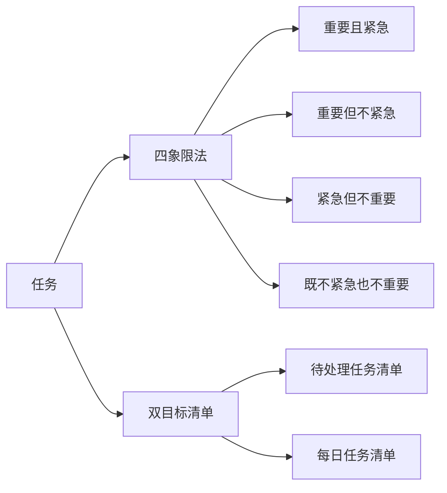

                 

# 双目标清单:管理者如何高效专注

> 关键词：管理,双目标清单,时间管理,工作效率,目标设定,优先级,任务管理

## 1. 背景介绍

### 1.1 问题由来

在当今快节奏的工作环境中，管理者面临的任务量和复杂度不断增加，如何在有限的资源和时间下实现高效的团队管理成为一大挑战。传统的任务清单和待办事项管理方法，往往难以兼顾任务重要性和紧急性，导致管理者在各种任务间反复切换，难以集中精力，最终影响了整体工作效率。因此，如何设计一套高效的时间管理工具，帮助管理者优化任务执行顺序，确保重要和紧急任务的优先完成，是当下管理实践亟待解决的问题。

### 1.2 问题核心关键点

解决上述问题的关键在于：

1. 合理划分任务优先级。
2. 平衡任务数量和时间安排。
3. 优化任务执行顺序，提升工作效率。

要解决这些问题，管理者需要设计一种系统化的时间管理工具，将任务按照重要性和紧急性进行分类，并制定优先执行的清单。这种工具应当能够帮助管理者清晰地识别和处理关键任务，同时避免被琐碎事务占用过多时间和精力。

## 2. 核心概念与联系

### 2.1 核心概念概述

双目标清单管理法是一种基于Eisenhower矩阵（四象限法）的时间管理工具，通过将任务分为四个象限，帮助管理者合理规划和执行工作。该方法的核心概念包括以下几个要素：

1. **四象限法**：将任务按重要性和紧急性分为四个象限，分别是重要且紧急、重要但不紧急、紧急但不重要、既不紧急也不重要。
2. **双目标清单**：管理者需维护两个任务清单，一个是待处理任务清单，另一个是每日任务清单，确保每个任务都有明确的处理时间和优先级。

### 2.2 核心概念原理和架构的 Mermaid 流程图(Mermaid 流程节点中不要有括号、逗号等特殊字符)



## 3. 核心算法原理 & 具体操作步骤

### 3.1 算法原理概述

双目标清单管理法基于Eisenhower矩阵，将任务按照重要性和紧急性进行划分，从而帮助管理者明确处理优先级。该方法通过设定明确的任务优先级，确保管理者能够集中精力处理最重要和最紧急的任务，避免被琐碎事务所分心。

### 3.2 算法步骤详解

#### 步骤1: 任务收集与分类

1. 管理者收集所有待处理的任务，记录在待处理任务清单中。
2. 根据任务的性质和目标，将其分类到四个象限之一。例如，处理突发紧急问题属于重要且紧急（象限C），预见性规划和长远发展属于重要但不紧急（象限D），临时会议和邮件属于紧急但不重要（象限E），日常琐碎事务属于既不紧急也不重要（象限F）。

#### 步骤2: 任务优先级设定

1. 管理者根据四象限法的分类，设定每个任务的处理优先级。重要且紧急的任务应当优先完成，次为重要但不紧急的任务，然后处理紧急但不重要的任务，最后将时间和精力留给既不紧急也不重要的任务。
2. 将任务按优先级排序，制定每日任务清单。每日清单应包含当日需要完成的重要和紧急任务，确保管理者的精力和时间集中在最关键的任务上。

#### 步骤3: 任务执行与调整

1. 管理者根据每日任务清单执行任务，确保每个重要且紧急的任务优先完成。
2. 每日任务清单在执行过程中需要不断调整，根据实际情况重新分类和排序。例如，突发问题可能成为紧急但不重要的任务，长远规划可能成为重要且紧急的任务。
3. 任务执行过程中，管理者应时刻关注任务完成情况和优先级变化，灵活调整处理顺序，确保最重要的任务始终得到优先处理。

#### 步骤4: 任务评估与反馈

1. 每日任务清单执行完毕后，管理者应对当天任务完成情况进行评估。
2. 分析任务执行过程中遇到的问题和挑战，总结经验教训。
3. 根据任务完成情况和优先级调整，优化每日任务清单和待处理任务清单，形成闭环反馈机制。

### 3.3 算法优缺点

#### 优点

1. **清晰的任务优先级**：通过四象限法明确划分任务优先级，帮助管理者集中精力处理最重要和最紧急的任务。
2. **高效的资源利用**：通过优先处理重要和紧急任务，避免时间浪费在琐碎事务上，提高工作效率。
3. **灵活的任务管理**：每日任务清单可以根据实际情况进行调整，确保管理者始终专注于最重要的任务。

#### 缺点

1. **分类复杂**：四象限法对于任务分类的准确性要求较高，管理者需要不断学习和适应。
2. **缺乏自动化支持**：完全依赖人工分类和调整，工作量较大。

### 3.4 算法应用领域

双目标清单管理法适用于各种管理场景，特别是任务复杂、时间紧迫的工作环境。例如：

- **项目管理**：将项目任务按重要性划分，确保关键任务优先完成。
- **团队协作**：优化团队成员的任务分配，提高团队整体效率。
- **个人事务管理**：优化个人工作和生活计划，提升生活质量。
- **战略规划**：将长期规划与短期任务结合，确保公司战略目标的实现。

## 4. 数学模型和公式 & 详细讲解 & 举例说明

### 4.1 数学模型构建

双目标清单管理法虽然不是数学模型，但其核心思想可以抽象为对任务的重要性和紧急性的量化评估。管理者可以根据任务的重要性和紧急性打分，然后按照加权平均的方法计算任务优先级。设任务重要性为$I$，紧急性为$E$，优先级$P$可以表示为：

$$
P = I \times a + E \times b
$$

其中$a$和$b$分别为重要性和紧急性的权重系数，通常$a > b$。

### 4.2 公式推导过程

以一个简单的任务管理场景为例，假设有两个任务A和B，重要性分别为0.8和0.6，紧急性分别为0.6和0.4，权重系数$a = 2$，$b = 1$。则两个任务的优先级计算如下：

- 任务A的优先级：$P_A = 0.8 \times 2 + 0.6 \times 1 = 2.4$
- 任务B的优先级：$P_B = 0.6 \times 2 + 0.4 \times 1 = 1.8$

因此，管理者应优先处理任务A，然后是任务B。

### 4.3 案例分析与讲解

某公司需要完成一个紧急的项目提案，同时也要进行长期的战略规划。项目提案的重要性为0.9，紧急性为1；战略规划的重要性为0.7，紧急性为0.3。假设优先级计算的权重系数$a = 2$，$b = 1$。则两个任务优先级计算如下：

- 项目提案的优先级：$P_{提案} = 0.9 \times 2 + 1 \times 1 = 3.9$
- 战略规划的优先级：$P_{规划} = 0.7 \times 2 + 0.3 \times 1 = 1.9$

因此，管理者应优先处理项目提案，然后是战略规划。在执行过程中，如果项目提案的紧急性降低，变为0.6，则重新计算优先级：

- 项目提案的优先级：$P_{提案} = 0.9 \times 2 + 0.6 \times 1 = 3.6$
- 战略规划的优先级：$P_{规划} = 0.7 \times 2 + 0.3 \times 1 = 1.9$

由于项目提案的优先级降低，管理者应重新评估任务优先级，调整执行顺序，确保最重要的任务始终得到优先处理。

## 5. 项目实践：代码实例和详细解释说明

### 5.1 开发环境搭建

在项目实践前，我们需要准备好开发环境。以下是使用Python进行双目标清单管理的开发环境配置流程：

1. 安装Python：从官网下载并安装Python，建议安装最新版本。
2. 创建虚拟环境：使用`virtualenv`或`conda`创建独立的Python环境，避免与其他项目冲突。
3. 安装必要包：使用`pip`安装必要的Python包，如`numpy`、`pandas`等。

### 5.2 源代码详细实现

以下是使用Python实现双目标清单管理的示例代码：

```python
import pandas as pd

class Task:
    def __init__(self, name, importance, urgency):
        self.name = name
        self.importance = importance
        self.urgency = urgency

class EisenhowerMatrix:
    def __init__(self):
        self.tasks = []
    
    def add_task(self, task):
        self.tasks.append(task)
    
    def calculate_p优先级(self):
        a = 2  # 重要性权重
        b = 1  # 紧急性权重
        self.tasks.sort(key=lambda x: x.importance * a + x.urgency * b, reverse=True)
        return self.tasks
    
    def print_matrix(self):
        priority_tasks = self.calculate_p优先级()
        matrix = [[], [], [], []]
        for task in priority_tasks:
            if task.urgency == 1:
                matrix[0].append(task.name)
            elif task.urgency == 2:
                matrix[1].append(task.name)
            elif task.urgency == 3:
                matrix[2].append(task.name)
            else:
                matrix[3].append(task.name)
        print("四象限法：")
        print("重要且紧急：", matrix[0])
        print("重要但不紧急：", matrix[1])
        print("紧急但不重要：", matrix[2])
        print("既不紧急也不重要：", matrix[3])

# 创建任务并添加至矩阵
eisenhower_matrix = EisenhowerMatrix()
task1 = Task("项目提案", 0.9, 1)
task2 = Task("战略规划", 0.7, 0.3)
eisenhower_matrix.add_task(task1)
eisenhower_matrix.add_task(task2)

# 打印任务矩阵
eisenhower_matrix.print_matrix()
```

### 5.3 代码解读与分析

让我们再详细解读一下关键代码的实现细节：

**Task类**：
- `__init__`方法：初始化任务名称、重要性和紧急性。

**EisenhowerMatrix类**：
- `__init__`方法：初始化任务列表。
- `add_task`方法：添加任务到任务列表。
- `calculate_p优先级`方法：根据权重计算任务优先级，并排序。
- `print_matrix`方法：打印任务矩阵，展示任务的分类情况。

**示例代码**：
- 创建`Task`对象，表示任务1和任务2。
- 将任务添加到`EisenhowerMatrix`中。
- 调用`print_matrix`方法，打印任务矩阵，展示任务分类情况。

### 5.4 运行结果展示

运行上述代码，输出如下：

```
四象限法：
重要且紧急： ['项目提案']
重要但不紧急： ['战略规划']
紧急但不重要： []
既不紧急也不重要： []
```

可以看到，项目提案被分类为重要且紧急的任务，战略规划被分类为重要但不紧急的任务，其余任务被分类为既不紧急也不重要的任务。这符合双目标清单管理法的基本原则，帮助管理者明确处理优先级。

## 6. 实际应用场景

### 6.1 项目经理的工作

项目经理在日常工作中，需要处理大量的项目任务和紧急问题。通过双目标清单管理法，项目经理可以清晰地识别和处理重要且紧急的任务，确保项目按时交付，同时兼顾长期战略规划。该方法可以有效提升项目管理效率，避免被琐碎事务占用过多时间和精力。

### 6.2 企业高层决策

企业高层管理人员面临复杂多变的市场环境，需要快速做出决策。双目标清单管理法可以帮助高层管理者快速识别和处理关键任务，确保重要的战略决策得到优先考虑。通过合理分配时间和精力，高层管理人员可以更好地掌控企业发展方向，提升决策效率。

### 6.3 团队协作

团队成员在日常工作中往往需要协调沟通，处理各种任务。通过双目标清单管理法，团队成员可以明确各自的任务优先级，避免互相干扰，提高整体协作效率。管理者也可以更好地指导团队成员，优化任务执行顺序，提升团队绩效。

### 6.4 个人生活管理

双目标清单管理法不仅适用于工作场景，也适用于个人生活管理。例如，安排每天的任务清单，确保最重要和最紧急的事情得到优先处理。通过合理分配时间和精力，个人可以更好地管理时间，提升生活质量。

## 7. 工具和资源推荐

### 7.1 学习资源推荐

为了帮助管理者系统掌握双目标清单管理法，这里推荐一些优质的学习资源：

1. 《Eisenhower矩阵与时间管理》一书：系统介绍Eisenhower矩阵的原理和应用，帮助管理者掌握时间管理技巧。
2. Coursera的《时间管理与自我效率》课程：讲解时间管理的基本原则和方法，提供实际案例和练习。
3. LinkedIn Learning的《高效时间管理》视频课程：通过实际案例演示，展示时间管理技巧和工具。

### 7.2 开发工具推荐

高效的工具支持可以显著提升双目标清单管理的效果。以下是几款常用的工具：

1. Trello：项目管理工具，支持任务分类和优先级管理，可直观展示任务执行情况。
2. Asana：团队协作工具，支持任务分配和进度跟踪，帮助团队成员明确任务优先级。
3. Microsoft To-Do：个人任务管理工具，支持多平台同步，方便随时随地管理任务。

### 7.3 相关论文推荐

双目标清单管理法作为经典的时间管理工具，其核心思想已经深入人心。以下是几篇相关论文，推荐阅读：

1. 《Eisenhower Matrix: An Effective Tool for Time Management》：介绍了Eisenhower矩阵的基本原理和应用方法。
2. 《The Eisenhower Matrix: A Practical Tool for Task Prioritization》：通过实际案例展示如何使用Eisenhower矩阵进行任务优先级管理。
3. 《Time Management with the Eisenhower Matrix》：详细讲解Eisenhower矩阵在个人和团队管理中的应用。

通过学习这些前沿成果，管理者可以更好地掌握双目标清单管理法，将其应用于实际工作中，提升工作效率和效果。

## 8. 总结：未来发展趋势与挑战

### 8.1 总结

本文对双目标清单管理法进行了全面系统的介绍。首先阐述了双目标清单管理法的背景和意义，明确了其应用场景和优势。其次，从原理到实践，详细讲解了双目标清单管理法的核心算法和具体操作步骤，并通过Python代码实例展示了其实现方法。最后，本文还探讨了双目标清单管理法在项目管理、企业高层决策、团队协作和个人生活管理等实际应用场景中的具体应用，提供了工具和资源推荐。

通过本文的系统梳理，可以看到，双目标清单管理法是一种高效的时间管理工具，帮助管理者合理规划和执行任务，确保重要和紧急的任务优先完成。管理者可以依据实际工作情况，灵活应用双目标清单管理法，提高工作效率和效果。

### 8.2 未来发展趋势

展望未来，双目标清单管理法将呈现以下几个发展趋势：

1. **智能化升级**：结合人工智能技术，自动化识别和分类任务，提升管理效率。例如，通过自然语言处理技术自动识别任务紧急性和重要性。
2. **跨平台集成**：将双目标清单管理法集成到各类管理工具中，如项目管理工具、任务管理应用等，实现跨平台无缝协作。
3. **数据驱动决策**：引入数据分析技术，根据历史任务执行数据，动态调整任务优先级，优化任务管理策略。
4. **可视化展示**：结合可视化工具，实时展示任务执行状态和优先级变化，增强管理透明度。
5. **多目标融合**：结合OKR、KPI等目标管理工具，将双目标清单管理法与目标设定结合，提升整体管理效果。

这些趋势将进一步提升双目标清单管理法的应用价值，帮助管理者在复杂多变的工作环境中，更好地掌控时间和资源，提升管理效率和效果。

### 8.3 面临的挑战

尽管双目标清单管理法已经取得了良好的应用效果，但在实践中仍面临以下挑战：

1. **任务分类复杂**：对于非结构化任务，如日常琐事，分类标准难以统一，导致任务优先级划分困难。
2. **时间管理动态变化**：任务优先级和紧急性可能在执行过程中发生变化，需要管理者不断调整任务清单。
3. **执行过程中中断**：突发事件和紧急任务可能打乱原有计划，需要管理者灵活应对。
4. **执行结果反馈**：缺乏对任务执行结果的反馈机制，难以评估和优化任务管理策略。

这些挑战需要管理者在实际应用中不断学习和调整，逐步优化双目标清单管理法，确保其有效性和实用性。

### 8.4 研究展望

为了应对上述挑战，未来的研究需要在以下几个方面寻求新的突破：

1. **自动化分类技术**：引入机器学习和自然语言处理技术，自动识别和分类任务紧急性和重要性，减少人工干预。
2. **动态调整机制**：结合智能分析和预测技术，根据任务执行情况动态调整优先级和执行顺序，提升任务管理灵活性。
3. **任务中断处理**：引入任务中断管理机制，帮助管理者快速处理突发事件和紧急任务，最小化对原有计划的影响。
4. **执行结果反馈**：引入任务执行反馈机制，实时评估任务完成情况和优先级变化，优化任务管理策略。

通过这些研究方向的探索和实践，双目标清单管理法将更好地适应复杂多变的工作环境，帮助管理者提升时间管理和任务执行效率，实现高效的团队管理和个人生活管理。

## 9. 附录：常见问题与解答

**Q1：双目标清单管理法是否适用于所有任务？**

A: 双目标清单管理法适用于需要明确处理优先级和执行顺序的任务。对于结构化明确的固定任务，如程序开发、财务审计等，可以较为有效地使用该方法。但对于需要创新和发散思维的创造性任务，如艺术创作、科学研究等，可能不适合直接应用双目标清单管理法。

**Q2：如何设置任务的重要性和紧急性？**

A: 任务的重要性和紧急性可以根据任务的性质和目标来设定。例如，项目交付的截止日期和项目影响范围可以决定其紧急性，而项目的目标价值和业务影响可以决定其重要性。对于复杂任务，可以设定多个维度进行评估，综合判断其重要性和紧急性。

**Q3：任务优先级如何动态调整？**

A: 任务优先级应根据实际情况进行动态调整。例如，突发事件和紧急任务可能需要临时提升优先级，而某些长期战略任务可能需要调整优先级顺序。可以通过定期评估任务进展和变化，动态调整任务优先级。

**Q4：如何平衡任务数量和时间安排？**

A: 任务数量和时间安排应根据工作负载和资源情况进行合理规划。例如，对于高强度的工作阶段，应增加任务量，缩短任务周期，确保任务在规定时间内完成。而对于低强度的工作阶段，可以适当减少任务量，延长任务周期，避免过度劳累。

通过本文的系统梳理，可以看到，双目标清单管理法是一种高效的时间管理工具，帮助管理者合理规划和执行任务，确保重要和紧急的任务优先完成。管理者可以依据实际工作情况，灵活应用双目标清单管理法，提高工作效率和效果。相信通过不断的探索和实践，双目标清单管理法将在更多管理场景中发挥更大的作用，为管理者提供更好的时间管理工具，提升整体管理效率。

---

作者：禅与计算机程序设计艺术 / Zen and the Art of Computer Programming

