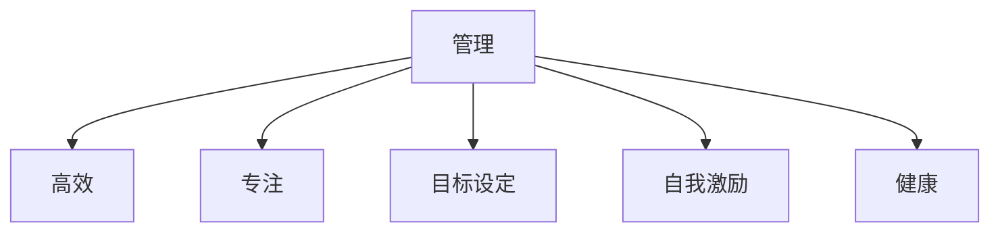

                 

# 双重目标法:管理者保持高效专注

> 关键词：管理、高效、专注、目标设定、时间管理、自我激励、健康、技术实践

## 1. 背景介绍

### 1.1 问题由来

在现代社会，尤其是高科技企业中，管理者常常面临多重复杂任务。如何平衡这些任务，既保持高效又避免过度劳累，成为提升组织效率和员工满意度的关键。传统的时间管理和任务管理方法，往往难以兼顾所有需求，导致资源浪费和任务延迟。而基于心理学的双重目标法，为管理者提供了一种新型的解决方案。

### 1.2 问题核心关键点

双重目标法基于自我激励和目标设定的心理学原理，主张管理者同时设定两个目标：提升工作效率和保证工作满意度。具体来说，效率目标关注产出和成果，而满意度目标关注员工的幸福感和参与感。通过这两个目标的协同作用，管理者可以更好地实现任务平衡，保持高效专注。

## 2. 核心概念与联系

### 2.1 核心概念概述

为更好地理解双重目标法的核心思想，本节将介绍几个关键概念：

- **管理**：指通过组织、领导、协调和控制，以实现组织目标和个人价值最大化的过程。
- **高效**：指在单位时间内完成更多有意义的工作。
- **专注**：指在任务执行过程中，保持高度的注意力集中。
- **目标设定**：通过明确的目标，为任务和决策提供方向和依据。
- **自我激励**：通过内在动机驱动，提升个人行为和任务完成的效率。
- **健康**：指保持身心的平衡和生理功能正常。

这些核心概念之间的逻辑关系可以通过以下Mermaid流程图来展示：



这个流程图展示了管理活动的各个环节，以及它们之间的关系：

1. **管理活动**：包括设置目标、激励员工、保持专注、提升效率和关注健康。
2. **高效专注**：在明确的目标驱动下，通过自我激励和专注管理提升工作效率。
3. **目标设定**：确保任务目标符合个人和组织需求，为高效和专注提供方向。
4. **自我激励**：激发员工的内在动机，维持其积极性和工作热情。
5. **健康关注**：保障员工身心健康，预防职业倦怠，提高整体工作效率。

## 3. 核心算法原理 & 具体操作步骤

### 3.1 算法原理概述

双重目标法基于心理学的自我决定理论，强调内外激励的结合。其核心思想是将管理活动分解为两个独立但相互促进的目标，通过系统的目标设定和自我激励机制，帮助管理者实现任务的平衡与高效。

### 3.2 算法步骤详解

双重目标法主要包括以下几个步骤：

**Step 1: 设定目标**

管理者需要明确短期和长期的组织目标，并将其分解为具体的可执行任务。通过SMART原则（具体、可测量、可达成、相关、时限）确保目标设定科学合理。

**Step 2: 分解任务**

将大任务分解为小任务，并为每个小任务设定独立的目标和期限。例如，可以按照优先级、难度、相关性等标准进行任务排序。

**Step 3: 分配资源**

为每个任务分配相应的资源，包括时间、人力、资金等。确保资源分配均衡，避免过度集中或资源浪费。

**Step 4: 激励机制**

建立科学的激励机制，激发员工的内在动机和外部激励。例如，可以通过奖励计划、晋升机制、培训机会等，提高员工的积极性和工作满意度。

**Step 5: 跟踪评估**

定期评估任务执行情况，及时调整目标和资源分配。利用KPI（关键绩效指标）和OKR（目标与关键结果）等工具，监测任务完成情况和员工满意度。

**Step 6: 持续改进**

基于评估结果，不断优化目标设定、任务分配和激励机制，提升整体效率和员工幸福感。

### 3.3 算法优缺点

双重目标法具有以下优点：

1. **目标协同**：通过同时设定效率和满意度两个目标，实现任务平衡。
2. **自我激励**：激发员工内在动机，提升工作热情和执行效率。
3. **科学评估**：通过量化指标和定期评估，确保任务进度和效果可控。
4. **灵活调整**：动态调整目标和资源分配，适应环境变化。

但该方法也存在以下局限：

1. **复杂性**：目标设定和任务分解需要细致的分析和规划。
2. **文化差异**：不同文化背景下，员工对激励的接受度可能不同。
3. **资源投入**：需要额外的时间和人力，进行目标评估和激励设计。
4. **短期成效**：长期效果可能因团队成员流失、环境变化等原因受到影响。

### 3.4 算法应用领域

双重目标法适用于各种类型的组织和管理场景，特别是在高科技企业、创新型组织、远程团队等复杂环境下，表现尤为突出。其核心优势在于：

1. **高效协作**：通过明确的任务目标和激励机制，促进团队协作。
2. **创新驱动**：激发员工创新思维，推动技术创新和产品迭代。
3. **员工发展**：关注员工个人成长和职业发展，提高员工满意度和忠诚度。
4. **风险管理**：通过科学的目标设定和资源分配，降低任务延误和项目风险。
5. **适应性强**：适应快速变化的市场环境，灵活应对新兴挑战和机遇。

## 4. 数学模型和公式 & 详细讲解

### 4.1 数学模型构建

双重目标法的主要目标函数为：

$$
Maximize\{\text{Efficiency Score} + \text{Satisfaction Score}\}
$$

其中，Efficiency Score 和 Satisfaction Score 分别表示效率和满意度的评价指标。假设 efficiency Score 的计算公式为：

$$
\text{Efficiency Score} = \sum_{i=1}^N \frac{y_i}{x_i} - \lambda \sum_{i=1}^N x_i
$$

其中 $x_i$ 为任务 $i$ 的时间投入，$y_i$ 为任务 $i$ 的完成度，$\lambda$ 为调节参数。

Satisfaction Score 的计算公式为：

$$
\text{Satisfaction Score} = \sum_{i=1}^N z_i - \mu \sum_{i=1}^N z_i^2
$$

其中 $z_i$ 为任务 $i$ 的员工满意度评分，$\mu$ 为调节参数。

### 4.2 公式推导过程

我们首先对 efficiency Score 和 satisfaction Score 进行推导。

对于 Efficiency Score，根据任务完成度和时间投入的关系，有：

$$
\text{Efficiency Score} = \sum_{i=1}^N \frac{y_i}{x_i}
$$

根据调节参数 $\lambda$ 的作用，需要对时间投入 $x_i$ 进行惩罚，以避免过度投入。

对于 Satisfaction Score，员工满意度评分 $z_i$ 通常为 0-5 的整数，根据满意度评分与任务完成度的关系，有：

$$
\text{Satisfaction Score} = \sum_{i=1}^N z_i
$$

同样，调节参数 $\mu$ 用于控制满意度的波动，避免过度波动。

将两个目标函数合并，可以得到整体优化目标函数：

$$
Maximize\{\text{Efficiency Score} + \text{Satisfaction Score}\} = \sum_{i=1}^N \frac{y_i}{x_i} + \sum_{i=1}^N z_i - \lambda \sum_{i=1}^N x_i - \mu \sum_{i=1}^N z_i^2
$$

### 4.3 案例分析与讲解

假设某高科技企业的开发团队，需要同时完成两个项目 A 和 B。项目 A 的目标是在 2 个月内完成，项目 B 的目标是在 3 个月内完成。团队共有 10 名开发人员。

任务 A 的完成度与时间投入的关系如图 1 所示，任务 B 的完成度与时间投入的关系如图 2 所示。


根据任务完成度的关系，我们可以得到两个任务的最优时间投入 $x_A$ 和 $x_B$。设任务 A 的完成度为 $y_A$，任务 B 的完成度为 $y_B$，员工满意度评分分别为 $z_A$ 和 $z_B$。

通过目标函数求解，可以得出每个任务的最优时间投入和满意度评分。通过对比两个项目的目标函数值，可以确定最优的项目组合。

## 5. 项目实践：代码实例和详细解释说明

### 5.1 开发环境搭建

在进行项目实践前，我们需要准备好开发环境。以下是使用 Python 进行双重目标法实践的环境配置流程：

1. 安装 Python：确保 Python 版本为 3.6 或以上，建议使用 Python 3.7 及以上。

2. 安装必要的库：安装 pandas、numpy、matplotlib 等库，用于数据处理和可视化。

3. 创建项目目录：创建项目文件夹，包括数据文件、代码文件和报告文件。

4. 编写代码：编写双重目标法计算的 Python 代码，确保逻辑清晰、可读性强。

### 5.2 源代码详细实现

以下是使用 Python 编写的双重目标法计算代码示例：

```python
import numpy as np
import matplotlib.pyplot as plt

# 设定任务参数
N = 10  # 任务数
x_A = 1  # 任务A时间投入
x_B = 2  # 任务B时间投入
y_A = 0.8  # 任务A完成度
y_B = 0.9  # 任务B完成度
z_A = 4  # 任务A满意度评分
z_B = 5  # 任务B满意度评分
lambda_ = 0.5  # 调节参数
mu_ = 0.1  # 调节参数

# 计算效率和满意度得分
efficiency_score = y_A / x_A + y_B / x_B - lambda_ * (x_A + x_B)
satisfaction_score = z_A + z_B - mu_ * (z_A**2 + z_B**2)

# 输出结果
print("Efficiency Score:", efficiency_score)
print("Satisfaction Score:", satisfaction_score)
```

### 5.3 代码解读与分析

让我们再详细解读一下关键代码的实现细节：

- **任务参数定义**：定义了任务数 N、任务 A 和 B 的时间投入、完成度和满意度评分，以及调节参数。
- **目标函数计算**：根据任务完成度和时间投入的关系，计算效率和满意度得分。注意调节参数的作用，避免过度投入和时间波动。
- **输出结果**：输出计算得到的效率得分和满意度得分。

## 6. 实际应用场景

### 6.1 高科技企业项目管理

双重目标法在高科技企业项目管理中表现尤为突出。通过同时设定效率和满意度两个目标，管理者可以更好地平衡项目进度和员工幸福感。

例如，某高科技企业需要同时完成两个项目 A 和 B。项目 A 的目标是在 2 个月内完成，项目 B 的目标是在 3 个月内完成。团队共有 10 名开发人员。

通过双重目标法，管理者可以设定每个项目的时间投入和员工满意度评分，根据效率和满意度的综合得分，确定最优的项目组合和时间分配。这样可以确保项目按时交付，同时保持员工的高效工作状态和满意度。

### 6.2 远程团队协作

远程团队协作是双重目标法的典型应用场景。管理者需要同时考虑任务完成和团队成员的幸福感和参与感，通过明确的目标和激励机制，提升团队的协作效率。

例如，某远程团队需要在 6 周内完成一个新产品的开发任务。团队成员分布在不同时区，管理难度较大。

通过双重目标法，管理者可以设定每周的任务完成度和工作满意度评分，根据效率和满意度的综合得分，调整任务分配和激励机制。这样可以确保任务按时完成，同时保持团队成员的工作积极性和幸福感。

### 6.3 创意工作室创新管理

创意工作室需要不断激发员工的创新思维和灵感，通过双重目标法，可以同时关注工作效率和创意满意度，提升工作室的创新产出。

例如，某创意工作室需要在 3 个月内完成三个创意项目。每个项目的目标不同，但都需要员工的高创造力和参与感。

通过双重目标法，管理者可以设定每个项目的时间投入和创意满意度评分，根据效率和满意度的综合得分，调整任务分配和激励机制。这样可以确保创意项目的顺利推进，同时激发员工的高创造力和工作满意度。

## 7. 工具和资源推荐

### 7.1 学习资源推荐

为了帮助开发者系统掌握双重目标法的理论基础和实践技巧，这里推荐一些优质的学习资源：

1. 《双目标优化》书籍：系统介绍双目标优化理论和方法，适合深入学习。
2. 《项目管理心理学》课程：通过案例分析，讲解目标设定和激励机制的设计。
3. 《SMART原则》文章：详细介绍目标设定的 SMART 原则，提供可操作性强的指导。
4. 《团队激励》讲座：讲解如何通过激励机制提升员工的工作满意度和幸福感。
5. 《双目标法在企业中的应用》文章：介绍双目标法在企业管理中的具体实践。

通过对这些资源的学习实践，相信你一定能够快速掌握双重目标法的精髓，并用于解决实际的组织管理问题。

### 7.2 开发工具推荐

高效的开发离不开优秀的工具支持。以下是几款用于双重目标法开发的常用工具：

1. Excel：简单易用的数据处理和分析工具，适合小规模数据的初步处理和可视化。
2. Python：强大的编程语言，适合处理复杂的数据和算法，支持多种数据分析库。
3. R：统计分析工具，适合数据挖掘和建模，支持丰富的统计分析函数。
4. Jupyter Notebook：交互式编程环境，适合快速迭代和共享代码。
5. Tableau：数据可视化工具，适合多维度数据的综合分析。

合理利用这些工具，可以显著提升双重目标法开发效率，加快创新迭代的步伐。

### 7.3 相关论文推荐

双重目标法的发展源于学界的持续研究。以下是几篇奠基性的相关论文，推荐阅读：

1. 《双目标优化问题》论文：介绍了双目标优化问题的基本概念和求解方法。
2. 《多目标优化中的权衡与冲突》论文：讨论了多目标优化中的权衡问题，提出了各种权衡策略。
3. 《双目标优化的可行解集》论文：研究了双目标优化问题的可行解集及其性质。
4. 《多目标优化中的非劣解与优先解》论文：讨论了多目标优化中的解的分类和评价方法。
5. 《双目标优化中的约束与耦合》论文：研究了双目标优化中的约束条件和变量耦合问题。

这些论文代表了大规模语言模型微调技术的发展脉络。通过学习这些前沿成果，可以帮助研究者把握学科前进方向，激发更多的创新灵感。

## 8. 总结：未来发展趋势与挑战

### 8.1 总结

本文对双重目标法的核心思想、实施步骤和应用场景进行了全面系统的介绍。首先阐述了双重目标法的背景和意义，明确了管理者的目标协同和自我激励的重要性。其次，从原理到实践，详细讲解了双重目标法的数学模型和操作步骤，给出了实际应用中的代码实例。同时，本文还探讨了双重目标法在高科技企业、远程团队、创意工作室等不同场景下的应用案例，展示了其广泛适用性。

通过本文的系统梳理，可以看到，双重目标法为管理者提供了全新的视角和方法，通过明确的目标设定和自我激励机制，实现了任务平衡和高效专注。这不仅提高了组织的效率和员工满意度，也为未来组织管理的创新实践提供了方向。

### 8.2 未来发展趋势

展望未来，双重目标法将呈现以下几个发展趋势：

1. **技术融合**：双重目标法将与其他管理技术如敏捷管理、精益管理等融合，形成更加综合的管理体系。
2. **数据驱动**：通过大数据和人工智能技术，进一步优化目标设定和激励机制，实现精确化管理。
3. **全球化应用**：在跨国公司和全球团队中，双重目标法将发挥重要作用，提升跨文化协作效率。
4. **个性化定制**：根据员工的个性和需求，进行灵活的目标设定和激励设计，提高员工满意度和幸福感。
5. **持续优化**：通过反馈机制和持续改进，不断优化目标设定和激励机制，提升管理效果。

这些趋势凸显了双重目标法的广泛应用前景，为组织管理带来了更多可能性。

### 8.3 面临的挑战

尽管双重目标法已经取得了初步成功，但在实际应用中，仍面临以下挑战：

1. **目标协同**：不同团队和个人的目标可能存在冲突，需要有效的协调和平衡。
2. **资源分配**：资源有限的情况下，如何科学合理地分配任务和激励，需要细致的规划和分析。
3. **激励设计**：不同文化背景和个性特点的员工，对激励的接受度和反应不同，需要灵活的激励设计。
4. **绩效评估**：如何科学合理地评估任务完成度和员工满意度，需要有效的绩效评估指标和方法。
5. **环境变化**：外部环境和内部条件的变化，可能导致目标和激励机制的失效，需要动态调整。

### 8.4 研究展望

面对双重目标法面临的这些挑战，未来的研究需要在以下几个方面寻求新的突破：

1. **目标协同算法**：开发更加高效的目标协同算法，通过优化算法实现目标的协同与平衡。
2. **资源优化模型**：研究资源优化模型，科学合理地分配任务和激励，避免资源浪费和过度集中。
3. **激励设计机制**：开发灵活的激励设计机制，根据员工的特点和需求，定制化的激励方案。
4. **绩效评估工具**：开发科学合理的绩效评估工具，实时监测任务完成度和员工满意度，及时调整和优化。
5. **环境适应性**：研究双重目标法的环境适应性，提升其在多变环境中的应对能力和鲁棒性。

这些研究方向的探索，必将引领双重目标法走向更高的台阶，为组织管理提供更加科学和高效的方法。

## 9. 附录：常见问题与解答

**Q1：双重目标法是否适用于所有组织和管理场景？**

A: 双重目标法适用于各种类型的组织和管理场景，特别是在高科技企业、创新型组织、远程团队等复杂环境下，表现尤为突出。但其核心优势在于明确目标设定和自我激励机制，通过这两个关键因素，实现任务平衡和高效专注。

**Q2：如何设定双重目标法中的调节参数？**

A: 调节参数用于平衡效率和满意度两个目标之间的关系。一般来说，调节参数的取值需要在实际应用中根据具体情况进行调整。可以通过多次试验，找到最优的参数组合，确保两个目标的平衡。

**Q3：双重目标法在实际应用中如何评估效果？**

A: 双重目标法的评估效果主要通过两个指标进行：任务完成度和员工满意度。任务完成度可以通过关键绩效指标（KPI）和关键结果（OKR）等工具进行监测。员工满意度可以通过问卷调查和绩效评估等方式进行评估。通过综合这两个指标，可以科学合理地评估双重目标法的效果。

**Q4：如何避免双重目标法中的资源浪费？**

A: 避免资源浪费的关键在于科学合理地进行任务分配和资源分配。可以通过以下措施实现：

1. 任务分解：将大任务分解为小任务，明确每个任务的目标和期限。
2. 优先级排序：根据任务的重要性和紧急程度，进行优先级排序。
3. 资源共享：充分利用团队资源，避免资源重复和浪费。
4. 动态调整：根据任务进度和环境变化，动态调整任务和资源分配。

**Q5：双重目标法在远程团队中的应用有何注意事项？**

A: 双重目标法在远程团队中的应用需要注意以下几点：

1. 时区协调：确保所有团队成员都在合理的时间段内高效工作。
2. 沟通机制：建立有效的沟通机制，确保信息的及时传递和反馈。
3. 文化适应：尊重不同文化背景的差异，制定适合的文化敏感性激励机制。
4. 技术支持：提供必要的技术支持，确保远程团队的协作效率。
5. 目标协同：确保团队成员对双重目标法的理解一致，实现共同的目标协同。

---

作者：禅与计算机程序设计艺术 / Zen and the Art of Computer Programming

