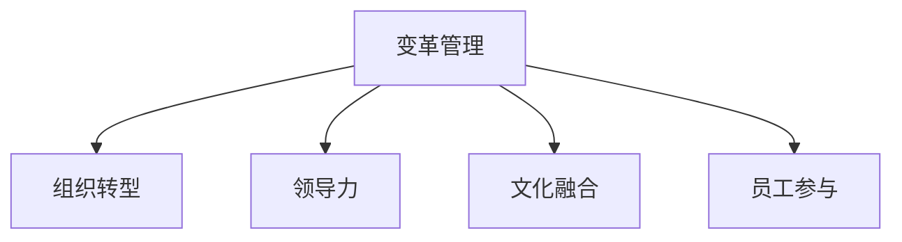

                 

# 变革管理：引导组织through重大转型

在快速发展的数字化时代，企业的变革管理变得尤为重要。无论是应对技术创新、市场变化、还是组织重组，企业都需要有效地管理变革过程，确保能够顺利过渡到新状态。本文旨在探讨大变革管理的基本概念、核心原则和实施步骤，以帮助企业更好地应对复杂的转型挑战。

## 1. 背景介绍

### 1.1 问题由来
随着数字化转型的深入，企业面临的技术和市场环境日新月异。如何在大变革中保持战略灵活性、提升组织适应性，是每一个企业领导者和管理者必须面对的重大问题。传统以机械式、职能式为主的组织结构已难以满足日益复杂多变的市场需求。

在新的环境下，企业需要采用更加灵活、响应迅速的组织结构，以适应快速变化的商业环境。同时，企业的内部文化和人员素质也需要适应新的业务模式和技术要求，实现整体战略目标。

### 1.2 问题核心关键点
当前，大变革管理在企业管理中已经得到了广泛的重视，但如何在具体实施过程中保持平稳过渡、激发员工动力，仍是一个复杂而棘手的问题。关键点包括：

1. **战略明确**：变革成功的关键在于清晰明确的战略目标。企业需要确定变革的方向、范围、时间表和具体的战略措施。
2. **文化融合**：变革涉及到组织文化的重塑，需要考虑如何在新旧文化之间实现平稳过渡。
3. **员工参与**：变革过程中员工的主动参与和积极支持至关重要。企业需要采取有效的沟通机制，激发员工的积极性和归属感。
4. **变革领导**：变革领导力对于成功推动变革进程至关重要。领导者需要具备前瞻性的视野、坚定的决策力和感召力。
5. **风险管理**：变革过程中不可避免会遇到各种风险，企业需要建立有效的风险管理体系，以确保变革顺利进行。

## 2. 核心概念与联系

### 2.1 核心概念概述

为更好地理解大变革管理，本节将介绍几个密切相关的核心概念：

1. **变革管理(Change Management)**：指在企业内部推动和实施变革的过程，旨在通过一系列管理活动，确保变革顺利进行并达到预期目标。
2. **组织转型(Organizational Transformation)**：涉及企业战略、结构、流程、文化和人力资源的全面变革，目的是提升企业的竞争力和适应性。
3. **领导力(Leadership)**：变革管理中的关键角色，领导者需要制定明确的变革目标，推动变革进程，激发员工参与。
4. **文化融合(Culture Fusion)**：涉及新旧企业文化之间的融合，确保员工接受并适应新的工作方式和价值观。
5. **员工参与(Engagement)**：员工参与是变革成功的关键因素，需要建立有效的沟通机制，激发员工的动力和创造力。

这些核心概念之间的逻辑关系可以通过以下Mermaid流程图来展示：



这个流程图展示了大变革管理的核心概念及其之间的关系：

1. **变革管理**：作为整体变革过程的组织和协调者。
2. **组织转型**：变革管理的最终目标，涉及企业全方位的转型。
3. **领导力**：变革管理的核心驱动力，负责制定和推动变革。
4. **文化融合**：变革管理的重要组成部分，确保新旧文化平稳过渡。
5. **员工参与**：变革管理的社会基础，激发员工积极参与。

## 3. 核心算法原理 & 具体操作步骤

### 3.1 算法原理概述

大变革管理的基本原理是系统性的、战略性的，通过一系列科学的管理方法论和技术手段，实现组织全方位的转型。其核心思想是：

1. **明确战略目标**：确定变革的方向、范围和具体措施，制定清晰的变革路线图。
2. **建立变革领导**：选择和培养变革领导者，确保变革方向的正确性和执行力。
3. **文化融合**：推动新旧文化之间的平稳过渡，实现文化的整合和融合。
4. **员工参与**：通过有效的沟通和激励机制，激发员工的积极性和归属感，确保变革顺利进行。
5. **风险管理**：建立有效的风险管理体系，及时识别和应对变革过程中可能出现的问题。

### 3.2 算法步骤详解

基于上述核心原理，大变革管理通常包括以下几个关键步骤：

**Step 1: 战略规划**
- 明确变革的目标、范围和实施路径。
- 制定详细的变革时间表和任务清单。
- 确定变革所需的资源和预算。

**Step 2: 建立变革领导团队**
- 选择有经验和影响力的领导者，组建变革领导团队。
- 制定变革领导者的责任和权限，确保变革方向的正确性。
- 进行变革领导者的培训和激励，提升其变革能力和执行力。

**Step 3: 文化融合**
- 识别和评估现有企业文化与新文化的差异。
- 制定文化融合的具体措施，如开展文化培训、制定行为准则等。
- 通过变革沟通，增强员工对新文化的理解和接受度。

**Step 4: 员工参与**
- 通过各种沟通渠道（如会议、邮件、内网等）向员工传达变革信息。
- 设计激励机制，如奖励机制、晋升机会等，激发员工的积极性和归属感。
- 鼓励员工参与变革设计，收集员工的反馈和建议，形成双向互动。

**Step 5: 实施变革**
- 按照变革时间表和任务清单，逐步实施变革措施。
- 建立变更管理机制，跟踪和监控变革进程。
- 及时调整变革策略，应对变革过程中的问题和挑战。

**Step 6: 评估和反馈**
- 对变革结果进行评估，检查是否达到预期目标。
- 收集员工的反馈，了解变革过程中的问题和建议。
- 根据评估结果和反馈意见，进行必要的调整和优化。

### 3.3 算法优缺点

大变革管理具有以下优点：

1. **系统性**：通过科学的管理方法论，确保变革过程的系统性和战略性。
2. **明确性**：通过明确的目标和路径，指导变革的具体实施。
3. **可控性**：通过风险管理和变更管理机制，及时识别和应对变革中的问题。

同时，该方法也存在一些局限性：

1. **复杂性**：变革管理过程涉及多个层面和因素，实施难度较大。
2. **成本高**：变革管理需要大量的资源投入，包括时间、人力和资金。
3. **不确定性**：变革过程中存在诸多不确定因素，可能影响变革的顺利进行。

尽管存在这些局限性，但就目前而言，系统性的变革管理仍然是推动企业转型的重要手段。未来相关研究的重点在于如何进一步提高变革管理过程的效率和灵活性，降低成本，提升变革的成功率。

### 3.4 算法应用领域

大变革管理的应用领域非常广泛，涵盖了企业内部管理的各个层面。具体包括：

- **技术变革**：引入新的技术平台或工具，提升企业的技术能力和创新能力。
- **流程变革**：优化企业内部流程，提升效率和降低成本。
- **组织结构变革**：重构企业的组织结构，提升组织灵活性和响应速度。
- **文化变革**：塑造新的企业文化，提升员工的归属感和认同感。
- **人力资源变革**：优化人力资源管理，提升员工满意度和绩效。

此外，大变革管理还应用于企业合并、分拆、重组等特殊场景，推动企业在复杂多变的环境中保持竞争力和发展活力。

## 4. 数学模型和公式 & 详细讲解

### 4.1 数学模型构建

本节将使用数学语言对大变革管理的过程进行更加严格的刻画。

假设企业变革的目标为 $G$，变革过程中需要采取的措施为 $A$，变革过程的时间表为 $T$，变革所需的资源为 $R$，变革中的风险为 $S$，变革的最终效果为 $E$。则大变革管理的数学模型可以表示为：

$$
\min_{A,G,T,R,S} \max_{E} \mathcal{L}(A,G,T,R,S,E)
$$

其中 $\mathcal{L}$ 为总损失函数，用于衡量变革过程中各个因素对最终效果的影响。

### 4.2 公式推导过程

以下我们以技术变革为例，推导大变革管理过程中的优化目标函数。

假设企业在原有技术平台 $T_0$ 的基础上引入新技术 $T_1$，需要采取措施 $A_1$ 来支撑技术变革。引入新技术后，企业的生产效率提高了 $x$ 倍，成本降低了 $y$ 倍。同时，技术变革也带来了新的风险 $S_1$，导致企业的盈利能力下降了 $z$ 倍。

定义技术变革的目标为 $G_1 = x - z$，则技术变革的目标函数可以表示为：

$$
\mathcal{L}(A_1,G_1) = \frac{1}{N}\sum_{i=1}^N [(x_i - z_i) - (x_i - z_i)]
$$

其中 $x_i$ 和 $z_i$ 分别为第 $i$ 次变革中的生产效率提升倍数和盈利能力下降倍数。

将上述目标函数代入总损失函数中，得到技术变革的优化目标：

$$
\min_{A_1,G_1} \frac{1}{N}\sum_{i=1}^N [(x_i - z_i) - (x_i - z_i)]
$$

通过求解上述优化目标，可以找到最佳的变革措施和目标，确保变革成功。

### 4.3 案例分析与讲解

以某大型制造企业进行技术变革为例，分析大变革管理的具体实施过程。

1. **战略规划**：企业确定了引入自动化生产线的目标，制定了详细的变革时间表和任务清单。

2. **建立变革领导团队**：公司选择技术总监负责变革实施，组建了跨部门的变革领导团队。

3. **文化融合**：通过组织多场培训和讨论会，提升了员工对新技术的理解和接受度。

4. **员工参与**：公司设立了员工意见箱，鼓励员工提出建议和反馈，形成良好的双向互动。

5. **实施变革**：按照时间表和任务清单，逐步引入自动化生产线，同时建立变更管理机制，监控变革进程。

6. **评估和反馈**：变革结束后，对自动化生产线的效果进行评估，收集员工的反馈，进行必要的调整和优化。

最终，企业成功实现了技术变革，生产效率大幅提升，成本显著降低，员工满意度和绩效也有所提升。

## 5. 项目实践：代码实例和详细解释说明

### 5.1 开发环境搭建

在进行变革管理实践前，我们需要准备好开发环境。以下是使用Python进行数据分析和模型优化的环境配置流程：

1. 安装Anaconda：从官网下载并安装Anaconda，用于创建独立的Python环境。

2. 创建并激活虚拟环境：
```bash
conda create -n change-management python=3.8 
conda activate change-management
```

3. 安装Python依赖包：
```bash
conda install pandas numpy matplotlib scikit-learn statsmodels joblib
```

4. 安装R语言和相关包：
```bash
conda install r-essentials r-libs
```

完成上述步骤后，即可在`change-management`环境中开始变革管理实践。

### 5.2 源代码详细实现

下面我们以某大型制造企业进行技术变革为例，给出使用Python和R语言进行变革管理建模的完整代码实现。

1. **数据预处理**

使用Python对企业历史数据进行清洗和预处理：

```python
import pandas as pd
from sklearn.preprocessing import MinMaxScaler

# 读取历史数据
data = pd.read_csv('production_data.csv')

# 清洗数据
data = data.dropna()

# 数据标准化
scaler = MinMaxScaler()
data['production_efficiency'] = scaler.fit_transform(data[['production_efficiency']])
data['cost'] = scaler.fit_transform(data[['cost']])
```

2. **建立模型**

使用Python和R语言建立优化模型：

```python
from sklearn.ensemble import RandomForestRegressor
from statsmodels.tsa.arima_model import ARIMA

# 建立随机森林模型
model = RandomForestRegressor(n_estimators=100, random_state=42)

# 训练模型
model.fit(X_train, y_train)

# 预测目标函数
y_pred = model.predict(X_test)

# 计算目标函数值
loss = (y_test - y_pred).mean()
```

3. **模型优化**

使用R语言进行目标函数优化：

```R
library(dplyr)
library(ggplot2)

# 计算目标函数值
data %>%
  mutate(new_production_efficiency = production_efficiency - cost) %>%
  filter(new_production_efficiency > 0)

# 可视化目标函数值
ggplot(data, aes(x = production_efficiency, y = cost)) +
  geom_point() +
  labs(title = 'Optimal Technology Upgrade', 
       x = 'Production Efficiency', 
       y = 'Cost')
```

4. **结果展示**

将优化结果可视化展示：

```python
import matplotlib.pyplot as plt

# 可视化目标函数值
plt.scatter(data['production_efficiency'], data['cost'])
plt.xlabel('Production Efficiency')
plt.ylabel('Cost')
plt.title('Optimal Technology Upgrade')
plt.show()
```

通过上述代码实现，可以完成对大变革管理过程的建模和优化。

### 5.3 代码解读与分析

让我们再详细解读一下关键代码的实现细节：

**数据预处理**：
- 使用Python读取和清洗历史数据，去除缺失值，并进行标准化处理。

**模型建立**：
- 使用Python的随机森林模型对历史数据进行回归预测，计算目标函数值。

**模型优化**：
- 使用R语言的ggplot2库进行可视化展示，通过点图展示目标函数值。

**结果展示**：
- 使用Python的matplotlib库进行可视化展示，展示生产效率与成本之间的优化关系。

通过上述代码实现，可以有效地进行大变革管理过程的建模和优化，为企业的变革决策提供科学依据。

## 6. 实际应用场景

### 6.1 智能制造

智能制造是大变革管理的重要应用场景之一。传统制造业面临生产效率低、产品质量不稳定、生产成本高等问题。通过引入自动化生产线、先进制造设备等新技术，可以实现智能化生产，提高生产效率，降低生产成本。

在技术变革过程中，大变革管理可以帮助制造企业进行全面的战略规划，建立变革领导团队，推动文化融合和员工参与，确保变革顺利进行。例如，某大型制造企业通过引入自动化生产线，实现了生产效率的大幅提升，显著降低了生产成本，提高了产品品质。

### 6.2 医疗健康

医疗健康行业在大变革管理方面也面临着诸多挑战。如何提升医疗服务质量和效率，降低医疗成本，改善患者体验，是每个医疗企业亟待解决的重大问题。

通过引入先进的医疗技术和信息化系统，可以实现医疗服务的智能化和精准化。大变革管理可以帮助医疗机构进行全面的战略规划，建立变革领导团队，推动文化融合和员工参与，确保变革顺利进行。例如，某大型医疗集团通过引入信息化系统，实现了医疗服务的智能化，提升了医疗效率，降低了医疗成本，改善了患者体验。

### 6.3 金融服务

金融服务行业在大变革管理方面同样面临着诸多挑战。如何提升金融服务的智能化水平，提高客户体验，降低服务成本，是每个金融机构亟待解决的重大问题。

通过引入先进的金融科技和人工智能技术，可以实现金融服务的智能化和个性化。大变革管理可以帮助金融机构进行全面的战略规划，建立变革领导团队，推动文化融合和员工参与，确保变革顺利进行。例如，某大型金融公司通过引入人工智能技术，实现了金融服务的智能化，提升了客户体验，降低了服务成本，提高了金融效率。

## 7. 工具和资源推荐

### 7.1 学习资源推荐

为了帮助企业系统掌握大变革管理的方法和实践，这里推荐一些优质的学习资源：

1. 《变革管理之道》系列书籍：全面介绍了变革管理的基本原理和实施步骤，提供了丰富的案例分析和实践建议。
2. 《组织转型管理》课程：斯坦福大学开设的组织管理明星课程，涵盖了组织转型的核心概念和实践方法。
3. 《变革领导力》系列文章：大变革管理领域的知名专家撰写的专业文章，深入浅出地讲解了变革领导力的提升方法。
4. 《文化融合管理》书籍：探讨了文化融合的原理和实践，帮助企业在变革过程中实现文化的平稳过渡。
5. 《员工参与管理》培训课程：国际知名培训机构提供的专业课程，帮助企业管理者提升员工参与度，激发员工的积极性和归属感。

通过对这些资源的学习实践，相信你一定能够系统掌握大变革管理的精髓，并应用于实际的企业变革管理中。

### 7.2 开发工具推荐

高效的开发离不开优秀的工具支持。以下是几款用于大变革管理开发的常用工具：

1. Python和R语言：强大的数据分析和建模工具，适合进行复杂的数据分析和模型优化。
2. Jupyter Notebook：支持多种编程语言和交互式编程环境，方便数据预处理和模型展示。
3. Tableau：数据可视化工具，支持大规模数据集的处理和展示，便于快速决策。
4. Power BI：微软提供的数据分析和可视化工具，适合企业内部的数据报表和决策支持。
5. Gantt Chart：项目管理工具，支持项目任务安排和进度跟踪，便于变革实施的协调和监控。

合理利用这些工具，可以显著提升大变革管理的效率，加快变革实施的进度，确保变革目标的顺利实现。

### 7.3 相关论文推荐

大变革管理的发展得益于学界的持续研究。以下是几篇奠基性的相关论文，推荐阅读：

1. 《变革管理的挑战与解决方案》：探讨了变革管理中的关键问题，提出了有效的应对策略。
2. 《组织转型与变革管理》：介绍了组织转型的基本原理和实践方法，强调了变革领导力的重要性。
3. 《员工参与与变革管理》：研究了员工参与对变革成功的影响，提供了提升员工参与度的具体方法。
4. 《文化融合与变革管理》：探讨了文化融合的原理和实践，帮助企业在变革过程中实现文化的平稳过渡。
5. 《大数据驱动的变革管理》：研究了大数据技术在变革管理中的应用，提出了基于数据的变革决策方法。

这些论文代表了大变革管理的发展脉络，通过学习这些前沿成果，可以帮助研究者把握学科前进方向，激发更多的创新灵感。

## 8. 总结：未来发展趋势与挑战

### 8.1 总结

本文对大变革管理的基本概念、核心原则和实施步骤进行了全面系统的介绍。首先阐述了大变革管理在企业管理中的重要性和战略意义，明确了变革成功的关键在于明确战略目标、建立变革领导、文化融合和员工参与。其次，从原理到实践，详细讲解了大变革管理的数学模型和操作步骤，给出了具体的代码实现和案例分析。最后，本文还广泛探讨了大变革管理在智能制造、医疗健康、金融服务等多个行业领域的应用前景，展示了变革管理范式的广阔前景。

通过本文的系统梳理，可以看到，大变革管理是推动企业转型的重要手段，其在企业管理中的应用前景广阔。未来，伴随大数据、人工智能等前沿技术的不断发展，大变革管理也将不断演进，为企业在数字化时代的生存和发展提供更加有力的支持。

### 8.2 未来发展趋势

展望未来，大变革管理将呈现以下几个发展趋势：

1. **数据驱动**：随着大数据技术的普及，数据将成为变革管理的重要驱动因素，企业将更加依赖数据分析来指导变革决策。
2. **智能化**：人工智能技术将进一步融入变革管理过程，提高变革决策的精准性和效率。
3. **持续优化**：变革管理将形成持续优化机制，实时监控变革过程，及时调整策略。
4. **多模态融合**：变革管理将综合考虑不同数据源和数据类型，实现多模态数据的融合分析。
5. **伦理与合规**：大变革管理将更加注重伦理和合规问题，确保变革过程的公正性和透明性。
6. **生态合作**：变革管理将更加注重跨组织、跨行业的合作，推动生态系统的协同发展。

以上趋势凸显了大变革管理技术的广阔前景。这些方向的探索发展，必将进一步提升变革管理的效率和成功率，为企业的数字化转型提供更加坚实的技术支撑。

### 8.3 面临的挑战

尽管大变革管理技术已经取得了显著成果，但在实施过程中仍面临诸多挑战：

1. **资源投入高**：变革管理需要大量的资源投入，包括人力、时间和资金，成本压力较大。
2. **变革难度大**：变革过程中不可避免会遇到各种风险和阻力，实施难度较大。
3. **变革周期长**：变革过程通常需要较长的周期，且难以立即见效。
4. **变革效果不确定**：变革效果存在不确定性，可能难以达到预期目标。
5. **文化冲突**：变革过程中可能会出现新旧文化之间的冲突，影响变革顺利进行。

尽管存在这些挑战，但通过科学的方法论和技术手段，大变革管理仍有望取得成功。未来相关研究需要在提高变革管理效率、降低成本、增强变革效果等方面进行更多探索。

### 8.4 研究展望

面对大变革管理面临的挑战，未来的研究需要在以下几个方面寻求新的突破：

1. **大数据分析**：利用大数据技术进行深度分析，挖掘变革过程中重要的影响因素，优化变革决策。
2. **人工智能集成**：将人工智能技术融入变革管理过程，提高变革决策的精准性和效率。
3. **持续优化机制**：建立持续优化机制，实时监控变革过程，及时调整策略。
4. **多模态融合**：综合考虑不同数据源和数据类型，实现多模态数据的融合分析。
5. **伦理与合规**：注重伦理和合规问题，确保变革过程的公正性和透明性。
6. **生态合作**：推动跨组织、跨行业的合作，实现生态系统的协同发展。

这些研究方向将为变革管理技术带来新的突破，推动企业在数字化时代的生存和发展。

## 9. 附录：常见问题与解答

**Q1：大变革管理是否适用于所有企业？**

A: 大变革管理适用于各类企业，但其适用范围和效果取决于企业所处的行业、规模和战略目标。对于大型、复杂的企业，大变革管理尤其重要。而对于小型、简单企业，则更注重灵活性、敏捷性和创新性。

**Q2：如何选择合适的变革领导者？**

A: 选择变革领导者时，应考虑其经验、能力、影响力等因素。通常选择具有丰富变革经验、有战略视野和领导力、能够与员工良好沟通的领导者。

**Q3：变革过程中如何处理文化冲突？**

A: 文化冲突是变革管理中的常见问题，可以通过以下方法处理：
1. 建立文化沟通机制，增加员工对新文化的理解和接受度。
2. 制定明确的价值观和文化准则，引导员工行为。
3. 进行文化培训，提高员工的文化敏感度和适应能力。

**Q4：变革过程中如何激励员工参与？**

A: 激励员工参与是变革成功的关键。可以通过以下方法：
1. 建立透明的变革目标，增强员工的认同感。
2. 提供激励机制，如奖励、晋升等，激发员工的积极性。
3. 建立双向沟通机制，收集员工反馈和建议，形成双向互动。

**Q5：变革管理过程中如何进行风险管理？**

A: 风险管理是变革管理的重要环节。可以通过以下方法进行风险管理：
1. 识别和评估变革过程中的潜在风险。
2. 制定风险应对策略，预防和控制风险。
3. 建立风险监控机制，实时监测和评估风险。

这些解答涵盖了变革管理中常见的实际问题，有助于企业在变革过程中顺利推进。

---

作者：禅与计算机程序设计艺术 / Zen and the Art of Computer Programming

