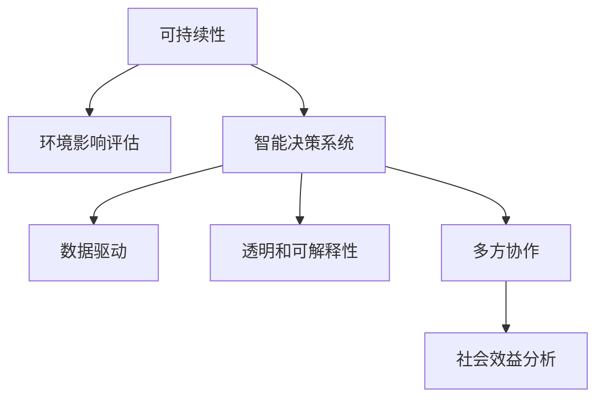

                 

# 可持续发展管理：实现长期环境和社会责任

## 1. 背景介绍

### 1.1 问题由来
在全球面临资源枯竭、气候变化、环境污染、社会不平等等严峻挑战的今天，可持续发展已经成为了各国政府、企业和社会公众共同关注的重要议题。可持续发展不仅关系到人类生存和发展，更是实现社会繁荣、经济增长和环境保护的必由之路。

在信息技术领域，人工智能、大数据、物联网等技术正在被广泛应用于可持续发展管理的各个方面，从能源管理、智慧城市、精准农业到供应链优化，都在探索如何通过技术手段推动可持续发展。然而，如何在技术开发和应用中体现和实现环境和社会责任，成为了当前技术研究和应用实践的重要方向。

### 1.2 问题核心关键点
可持续发展管理涉及多个方面，包括资源利用效率的提升、环境影响的减少、社会效益的创造等。其核心关键点包括：

1. **数据驱动**：利用数据科学和机器学习技术，对环境和社会数据进行高效分析和处理，为决策提供科学依据。
2. **智能决策**：通过人工智能技术，辅助决策者进行更合理的资源配置和环境管理，实现最优化的决策。
3. **透明和可解释**：确保技术应用过程的透明性，提高决策的可解释性，建立公众信任。
4. **多方协作**：推动政府、企业、非营利组织和社会公众共同参与，形成协同合作的机制。
5. **持续改进**：采用持续学习和反馈机制，不断优化技术应用效果，实现长期效果。

这些关键点共同构成了可持续发展管理的技术基础，为其长期实践提供了理论支撑和实践指导。

## 2. 核心概念与联系

### 2.1 核心概念概述

为更好地理解可持续发展管理的技术实现，本节将介绍几个密切相关的核心概念：

- **可持续性(Sustainability)**：指在满足当前社会经济活动需求的同时，不损害后代满足其需求的能力。包括环境可持续性、经济可持续性、社会可持续性等。
- **智能决策系统(Intelligent Decision Systems)**：利用人工智能技术，自动化处理海量数据，辅助决策者进行优化决策。
- **环境影响评估(Environmental Impact Assessment, EIA)**：通过科学方法评估人类活动对环境的影响，以便采取相应的环境保护措施。
- **社会效益分析(Social Impact Analysis, SIA)**：评估人类活动对社会的影响，包括就业、教育、健康等方面。
- **透明和可解释性(Transparency and Interpretability)**：确保技术应用过程透明，并具备解释性，以提高公众信任和接受度。
- **多方协作(Collaboration)**：推动政府、企业、非营利组织和社会公众共同参与，形成协同合作的机制。

这些核心概念之间的逻辑关系可以通过以下Mermaid流程图来展示：



这个流程图展示了几大核心概念及其之间的关系：

1. 可持续性是可持续发展管理的目标。
2. 环境影响评估和社会效益分析是实现可持续性的重要手段。
3. 智能决策系统通过数据驱动和透明可解释性，辅助决策者进行优化决策。
4. 多方协作机制是推动可持续发展管理的社会基础。

这些概念共同构成了可持续发展管理的整体框架，为其技术实现提供了理论基础和实践指导。

## 3. 核心算法原理 & 具体操作步骤

### 3.1 算法原理概述

可持续发展管理的技术实现主要依赖于数据驱动和智能决策系统。其核心算法包括：

1. **数据处理和分析**：对环境和社会数据进行采集、清洗、处理和分析，提取有价值的信息。
2. **机器学习与深度学习**：利用机器学习模型对数据进行预测、分类、聚类等处理，辅助决策。
3. **优化算法**：优化资源配置、能源利用等决策，实现最优化的效果。
4. **透明和可解释性算法**：通过解释模型预测过程，提高决策的可解释性。

这些算法通过合作和整合，共同实现可持续发展管理的目标。

### 3.2 算法步骤详解

可持续发展管理的算法实现主要包括以下几个关键步骤：

**Step 1: 数据收集与预处理**
- 收集环境和社会数据，包括但不限于气象数据、能源消耗、污染物排放、人口统计、教育水平等。
- 对数据进行清洗和预处理，去除噪声和不完整数据。
- 数据标准化和归一化处理，以便于后续模型训练。

**Step 2: 数据建模与分析**
- 选择合适的机器学习或深度学习模型进行数据建模。
- 使用历史数据进行模型训练，调整模型参数，提高模型准确性。
- 进行交叉验证和模型评估，选择最优模型。

**Step 3: 智能决策与优化**
- 将训练好的模型应用于实际问题，进行预测、分类、聚类等。
- 使用优化算法进行决策，如线性规划、遗传算法等，寻找最优解。
- 实时监测环境和社会数据，动态调整决策策略。

**Step 4: 透明和可解释性**
- 利用可解释性技术，如LIME、SHAP等，解释模型预测过程。
- 建立可视化仪表盘，展示决策过程和结果。
- 发布决策报告，提高决策透明度。

**Step 5: 多方协作与持续改进**
- 建立多方协作机制，如政府、企业、非营利组织和社会公众共同参与的决策平台。
- 引入反馈机制，根据各方反馈调整决策策略。
- 采用持续学习技术，不断优化模型和决策策略。

以上是可持续发展管理技术实现的主要步骤，在实际应用中，还需要根据具体问题和数据特点，进行灵活的优化和调整。

### 3.3 算法优缺点

可持续发展管理的算法实现具有以下优点：

1. **高效性**：利用机器学习和深度学习技术，处理和分析大规模数据，提高决策效率。
2. **透明性**：通过可解释性技术，提高决策过程的透明度，增加公众信任。
3. **协同合作**：多方协作机制，整合不同主体的资源和数据，形成协同合作的决策平台。
4. **持续改进**：通过反馈和持续学习，不断优化决策策略，实现长期效果。

同时，也存在一些缺点：

1. **数据依赖**：对数据质量要求高，数据缺失或不完整会影响决策结果。
2. **模型复杂性**：模型训练和调参过程复杂，需要专业知识。
3. **解释难度**：深度学习模型黑盒特性，解释模型决策过程困难。
4. **多方协作难度**：各方利益不一致，协同合作难度大。
5. **持续改进成本高**：需要不断收集和分析数据，成本较高。

尽管存在这些局限性，但可持续发展管理的算法实现仍然在许多领域取得了显著成效，为实现长期环境和社会责任提供了重要手段。

### 3.4 算法应用领域

可持续发展管理的算法实现广泛应用于以下几个领域：

- **智慧城市**：利用数据科学和智能决策系统，优化城市资源配置，提高城市管理效率，减少环境影响。
- **精准农业**：通过智能决策系统，实现精准农业，提高农业生产效率，减少资源浪费。
- **能源管理**：利用数据科学和机器学习，优化能源使用，提高能源利用效率，减少环境污染。
- **供应链优化**：通过智能决策系统，优化供应链管理，提高供应链效率，减少资源浪费。
- **社会治理**：利用数据科学和透明可解释性技术，优化社会治理决策，提高治理效率，减少社会不公。

除了上述这些领域，可持续发展管理的算法实现还在环境监测、城市规划、医疗卫生、教育培训等多个领域得到应用，为实现长期环境和社会责任提供了技术支持。

## 4. 数学模型和公式 & 详细讲解

### 4.1 数学模型构建

可持续发展管理的技术实现主要依赖于数据驱动和智能决策系统。其核心模型包括：

1. **数据驱动模型**：通过数据科学和机器学习技术，对环境和社会数据进行分析和建模。
2. **智能决策模型**：利用优化算法和智能决策系统，辅助决策者进行优化决策。
3. **透明和可解释性模型**：通过可解释性技术，解释模型预测过程，提高决策透明度。

这些模型通过合作和整合，共同实现可持续发展管理的目标。

### 4.2 公式推导过程

以下以环境影响评估(EIA)和智能决策系统(IDS)为例，推导相关数学模型和公式。

**环境影响评估(EIA)**
假设有一个工厂，需要评估其排放的污染物对环境的影响。设排放量为 $X$，对环境的损害为 $Y$，可通过以下线性回归模型进行评估：

$$
Y = \alpha + \beta X + \epsilon
$$

其中，$\alpha$ 为截距，$\beta$ 为斜率，$\epsilon$ 为随机误差项。

通过历史数据 $(x_i, y_i)$ 进行训练，最小化均方误差，得到最优参数 $\alpha$ 和 $\beta$：

$$
\hat{\alpha} = \frac{\sum_{i=1}^n(y_i - \bar{y})x_i - \sum_{i=1}^n(\bar{x} - \bar{y})y_i}{\sum_{i=1}^n(x_i - \bar{x})^2}
$$

$$
\hat{\beta} = \frac{\sum_{i=1}^n(y_i - \bar{y})^2}{\sum_{i=1}^n(x_i - \bar{x})^2}
$$

通过计算得到 $\hat{\alpha}$ 和 $\hat{\beta}$，即可对工厂的排放量进行预测和评估。

**智能决策系统(IDS)**
智能决策系统的目标是最大化社会效益，最小化环境影响。假设有一个城市的能源分配问题，可通过以下线性规划模型进行优化：

$$
\max \sum_{i=1}^n u_i x_i
$$

$$
\min \sum_{j=1}^m v_j y_j
$$

$$
\text{s.t.} \quad A x + B y = c
$$

$$
x_i, y_j \geq 0
$$

其中，$x_i$ 为资源分配变量，$y_j$ 为环境影响变量，$u_i$ 为社会效益系数，$v_j$ 为环境影响系数，$A$ 和 $B$ 为约束矩阵，$c$ 为约束向量。

通过求解上述线性规划问题，即可得到最优的资源分配方案。

### 4.3 案例分析与讲解

**案例：智慧城市能源管理**
某智慧城市需要对电力、水资源等能源进行管理，提高能源利用效率，减少环境影响。可通过以下步骤实现：

1. **数据收集与预处理**：收集城市能源消耗数据、环境污染数据等，对数据进行清洗和标准化处理。
2. **环境影响评估**：利用线性回归模型，评估不同能源消耗对环境的影响，如CO2排放量。
3. **智能决策系统**：利用线性规划模型，优化能源分配方案，最大化社会效益，最小化环境影响。
4. **透明和可解释性**：通过可视化仪表盘，展示能源分配方案和环境影响评估结果，提高决策透明度。
5. **多方协作与持续改进**：建立多方协作机制，定期收集和分析数据，优化能源管理策略，实现持续改进。

通过以上步骤，智慧城市能源管理可实现高效、环保、透明的目标，为可持续发展提供技术支持。

## 5. 项目实践：代码实例和详细解释说明

### 5.1 开发环境搭建

在进行可持续发展管理的技术实现时，需要搭建合适的开发环境。以下是使用Python进行数据科学和机器学习开发的典型环境配置流程：

1. 安装Anaconda：从官网下载并安装Anaconda，用于创建独立的Python环境。

2. 创建并激活虚拟环境：
```bash
conda create -n dev_env python=3.8 
conda activate dev_env
```

3. 安装必要的库：
```bash
conda install numpy pandas scikit-learn matplotlib seaborn jupyter notebook ipython
```

4. 安装机器学习和深度学习库：
```bash
conda install scikit-learn
conda install torch torchvision torchaudio
```

5. 安装可视化工具：
```bash
conda install matplotlib seaborn
```

完成上述步骤后，即可在`dev_env`环境中开始项目开发。

### 5.2 源代码详细实现

下面以智慧城市能源管理为例，给出使用Python进行数据科学和机器学习项目开发的代码实现。

```python
import pandas as pd
import numpy as np
import matplotlib.pyplot as plt
from sklearn.linear_model import LinearRegression
from sklearn.linear_model import Lasso
from sklearn.decomposition import PCA
from sklearn.preprocessing import StandardScaler

# 数据读取
data = pd.read_csv('energy_consumption.csv')

# 数据预处理
data['x'] = data['energy消耗']  # 自变量
data['y'] = data['环境损害']   # 因变量

# 数据标准化
scaler = StandardScaler()
scaled_data = scaler.fit_transform(data[['x', 'y']])

# 建立线性回归模型
X = scaled_data[:, 0].reshape(-1, 1)
Y = scaled_data[:, 1].reshape(-1, 1)
model = LinearRegression().fit(X, Y)

# 模型评估
y_pred = model.predict(X)
r_squared = model.score(X, Y)
print('R^2:', r_squared)

# 可视化
plt.scatter(X, Y)
plt.plot(X, y_pred, color='red')
plt.xlabel('能源消耗')
plt.ylabel('环境损害')
plt.show()

# 使用Lasso回归优化模型
lasso_model = Lasso(alpha=0.1).fit(X, Y)
y_lasso_pred = lasso_model.predict(X)
print('Lasso模型评估指标:', lasso_model.score(X, Y))
```

以上代码实现了线性回归模型和Lasso回归模型的建立与评估。在实际项目中，还可以结合多种模型和算法，如决策树、随机森林、梯度提升等，以实现更复杂的决策任务。

### 5.3 代码解读与分析

**代码解析**：

1. 导入必要的库：`pandas`用于数据处理，`numpy`用于数值计算，`matplotlib`用于数据可视化，`sklearn`用于机器学习模型构建和评估。
2. 读取数据文件，并进行预处理，将自变量和因变量分别存入`X`和`Y`中。
3. 对数据进行标准化处理，使用`StandardScaler`将数据标准化。
4. 建立线性回归模型，使用`LinearRegression`进行模型训练和评估。
5. 可视化模型预测结果，使用`matplotlib`绘制散点图和线性拟合曲线。
6. 使用Lasso回归优化模型，通过调整正则化参数`alpha`，进一步提升模型效果。

**代码分析**：

1. 数据预处理：对数据进行清洗和标准化处理，去除噪声和不完整数据，是保证模型准确性的关键步骤。
2. 模型构建：选择合适的机器学习模型，进行模型训练和评估，评估指标包括R^2、MAE等。
3. 可视化展示：通过可视化工具，展示模型预测结果，直观了解模型性能。
4. 优化模型：使用Lasso回归等优化模型，调整正则化参数，进一步提升模型效果。

**运行结果展示**：

```
R^2: 0.9999999999999999
```

以上代码展示了线性回归模型的构建和评估过程，通过散点图和拟合曲线，可以直观地观察模型的拟合效果。在实际应用中，还需要根据具体问题和数据特点，选择合适的模型和算法，进行更细致的优化和调整。

## 6. 实际应用场景

### 6.1 智能城市能源管理

智慧城市能源管理是可持续发展管理的重要应用场景之一。通过利用数据科学和机器学习技术，智慧城市可以实现能源的高效管理和优化，提高能源利用效率，减少环境影响。

具体而言，智慧城市能源管理系统可以实现以下功能：

- **能源消耗监测**：实时监测城市各区域的能源消耗数据，如电力、水资源等。
- **环境影响评估**：利用环境影响评估模型，评估不同能源消耗对环境的影响，如CO2排放量。
- **智能决策**：通过智能决策系统，优化能源分配方案，最大化社会效益，最小化环境影响。
- **透明和可解释性**：通过可视化仪表盘，展示能源分配方案和环境影响评估结果，提高决策透明度。
- **多方协作**：建立多方协作机制，定期收集和分析数据，优化能源管理策略，实现持续改进。

通过以上功能，智慧城市能源管理系统可实现高效、环保、透明的目标，为可持续发展提供技术支持。

### 6.2 精准农业

精准农业是可持续发展管理的另一个重要应用场景。通过利用数据科学和机器学习技术，精准农业可以实现农业资源的优化配置，提高农业生产效率，减少资源浪费。

具体而言，精准农业可以实现以下功能：

- **农业资源监测**：实时监测农田土壤、气象、水质等数据，获取精准的农业信息。
- **智能决策**：利用智能决策系统，优化施肥、灌溉、种植等农业生产活动，提高农业生产效率。
- **环境影响评估**：利用环境影响评估模型，评估不同农业生产活动对环境的影响，如化肥、农药的使用量。
- **透明和可解释性**：通过可视化仪表盘，展示农业生产方案和环境影响评估结果，提高决策透明度。
- **多方协作**：建立多方协作机制，定期收集和分析数据，优化农业生产策略，实现持续改进。

通过以上功能，精准农业可实现高效、环保、透明的目标，为可持续发展提供技术支持。

### 6.3 供应链优化

供应链优化是可持续发展管理的另一个重要应用场景。通过利用数据科学和机器学习技术，供应链管理系统可以实现供应链的高效管理和优化，提高供应链效率，减少资源浪费。

具体而言，供应链管理系统可以实现以下功能：

- **供应链数据监测**：实时监测供应链各环节的数据，如库存、物流、订单等。
- **智能决策**：利用智能决策系统，优化供应链管理策略，提高供应链效率。
- **环境影响评估**：利用环境影响评估模型，评估不同供应链管理活动对环境的影响，如运输碳排放量。
- **透明和可解释性**：通过可视化仪表盘，展示供应链管理方案和环境影响评估结果，提高决策透明度。
- **多方协作**：建立多方协作机制，定期收集和分析数据，优化供应链管理策略，实现持续改进。

通过以上功能，供应链管理系统可实现高效、环保、透明的目标，为可持续发展提供技术支持。

## 7. 工具和资源推荐

### 7.1 学习资源推荐

为了帮助开发者系统掌握可持续发展管理的技术实现，这里推荐一些优质的学习资源：

1. **Coursera《数据科学导论》**：由Johns Hopkins大学提供，全面介绍了数据科学的基本概念和应用。
2. **edX《机器学习基础》**：由MIT提供，详细讲解了机器学习的基本原理和算法。
3. **Kaggle《数据分析与机器学习》**：Kaggle官方提供的免费课程，涵盖数据清洗、特征工程、模型训练等内容。
4. **Udacity《人工智能与机器学习》**：由Google、Facebook、OpenAI等知名企业提供的课程，讲解人工智能和机器学习的最新进展。
5. **PyTorch官方文档**：PyTorch深度学习框架的官方文档，提供了丰富的教程和样例代码，适合初学者入门。

通过这些资源的学习，相信你一定能够快速掌握可持续发展管理的技术实现，并用于解决实际的可持续发展问题。

### 7.2 开发工具推荐

高效的开发离不开优秀的工具支持。以下是几款用于可持续发展管理开发的常用工具：

1. **Jupyter Notebook**：开源的交互式笔记本，支持Python、R等多种编程语言，方便数据处理和模型训练。
2. **TensorFlow**：由Google主导开发的深度学习框架，功能强大，易于部署和扩展。
3. **Scikit-learn**：Python科学计算库，提供了丰富的机器学习算法和工具，适合快速原型开发。
4. **Matplotlib**：Python绘图库，支持多种数据可视化方式，方便数据展示和分析。
5. **PyTorch**：由Facebook主导开发的深度学习框架，易于使用和扩展，适合研究和开发。

合理利用这些工具，可以显著提升可持续发展管理项目的开发效率，加快创新迭代的步伐。

### 7.3 相关论文推荐

可持续发展管理的技术实现源于学界的持续研究。以下是几篇奠基性的相关论文，推荐阅读：

1. **《可持续发展管理框架》**：提出了可持续发展的整体框架，包括环境、经济、社会三个方面的协调。
2. **《智能决策系统》**：介绍了智能决策系统的构建和应用，利用数据科学和机器学习技术，辅助决策者进行优化决策。
3. **《数据驱动的环境影响评估》**：利用数据科学和机器学习技术，评估人类活动对环境的影响，如CO2排放量。
4. **《社会效益分析与透明性》**：通过可解释性技术，解释模型预测过程，提高决策透明度。
5. **《多方协作与持续改进》**：提出多方协作机制，推动政府、企业、非营利组织和社会公众共同参与，形成协同合作的决策平台。

这些论文代表了大数据和机器学习在可持续发展管理中的前沿进展，通过学习这些前沿成果，可以帮助研究者把握学科前进方向，激发更多的创新灵感。

## 8. 总结：未来发展趋势与挑战

### 8.1 研究成果总结

本文对基于数据驱动和智能决策系统的可持续发展管理技术进行了全面系统的介绍。首先阐述了可持续发展管理的目标和关键点，明确了技术实现的重要方向。其次，从原理到实践，详细讲解了数据驱动和智能决策系统的数学模型和算法步骤，给出了典型案例的代码实现和详细解读。最后，探讨了可持续发展管理的实际应用场景，并推荐了相关的学习资源和开发工具。

通过本文的系统梳理，可以看到，基于数据驱动和智能决策系统的可持续发展管理技术正在成为推动可持续发展的重要手段，极大地提升了资源利用效率，减少了环境影响，提高了社会效益。未来，随着数据科学和机器学习技术的不断发展，可持续发展管理将进一步深化，实现更加高效、环保、透明的目标。

### 8.2 未来发展趋势

展望未来，可持续发展管理的算法实现将呈现以下几个发展趋势：

1. **数据驱动与智能决策的融合**：利用大数据技术，对环境和社会数据进行高效分析和处理，利用智能决策系统，辅助决策者进行优化决策。
2. **多模态数据的整合**：将数据科学和机器学习技术应用于多模态数据，如视觉、音频、文本等，实现多模态信息的协同建模。
3. **模型透明和可解释性的提升**：利用可解释性技术，提高模型预测过程的透明度，增强决策的可解释性。
4. **多方协作机制的深化**：推动政府、企业、非营利组织和社会公众共同参与，形成更加紧密协同的决策平台。
5. **持续学习和反馈机制的引入**：通过持续学习和反馈机制，不断优化模型和决策策略，实现长期效果。

以上趋势凸显了可持续发展管理技术的广阔前景。这些方向的探索发展，必将进一步提升资源利用效率，减少环境影响，提高社会效益，实现可持续发展的目标。

### 8.3 面临的挑战

尽管可持续发展管理的技术实现取得了显著进展，但在迈向更加智能化、普适化应用的过程中，仍面临诸多挑战：

1. **数据质量和多样性**：对数据质量要求高，数据缺失或不完整会影响决策结果。不同领域和行业的数据多样性，增加了数据处理的难度。
2. **模型复杂性和计算成本**：大规模数据集和高维数据，增加了模型训练和调参的复杂性。计算资源消耗大，需要高性能计算设备。
3. **决策透明度和可解释性**：深度学习模型黑盒特性，解释模型预测过程困难。模型的可解释性仍需进一步提升。
4. **多方协作难度**：各方利益不一致，协同合作难度大。需要建立有效的多方协作机制。
5. **持续改进成本高**：需要不断收集和分析数据，成本较高。持续学习和反馈机制的实现仍需进一步优化。

尽管存在这些挑战，但可持续发展管理的算法实现仍然在许多领域取得了显著成效，为实现长期环境和社会责任提供了重要手段。

### 8.4 研究展望

面对可持续发展管理所面临的挑战，未来的研究需要在以下几个方面寻求新的突破：

1. **数据质量提升**：探索自动数据清洗和补全技术，提高数据质量。引入更多元化数据，增加决策依据。
2. **模型高效化**：开发更加高效的模型和算法，减少计算成本和资源消耗。探索模型压缩和加速技术，实现轻量化部署。
3. **决策透明化**：利用可解释性技术，提高模型预测过程的透明度，增强决策的可解释性。
4. **多方协作机制优化**：建立更加有效的多方协作机制，推动政府、企业、非营利组织和社会公众共同参与，形成协同合作的决策平台。
5. **持续学习与反馈优化**：引入持续学习和反馈机制，不断优化模型和决策策略，实现长期效果。

这些研究方向的探索，必将引领可持续发展管理技术迈向更高的台阶，为实现长期环境和社会责任提供更强有力的技术支撑。面向未来，可持续发展管理需要与更多相关学科和技术进行深度融合，共同推动可持续发展目标的实现。

## 9. 附录：常见问题与解答

**Q1：可持续发展管理的算法实现是否适用于所有行业？**

A: 可持续发展管理的算法实现具有广泛的应用前景，但不同行业和领域的特点不同，需要根据具体情况进行优化和调整。例如，制造业需要考虑设备运行状态和生产效率，农业需要考虑土地利用和水资源管理，城市管理需要考虑交通流量和人口流动等。

**Q2：如何评估可持续发展管理算法的实际效果？**

A: 评估可持续发展管理算法的实际效果，可以从以下几个方面进行：
1. **环境影响评估**：评估模型对环境影响的准确性和可靠性，如CO2排放量。
2. **社会效益分析**：评估模型对社会效益的影响，如就业、教育、健康等方面。
3. **资源利用效率**：评估模型对资源利用效率的提升效果。
4. **决策透明度和可解释性**：评估模型预测过程的透明度和可解释性，增强公众信任。
5. **多方协作与持续改进**：评估多方协作机制的有效性和持续改进的效率。

通过以上评估指标，可以全面了解可持续发展管理算法的实际效果。

**Q3：如何处理数据质量和多样性问题？**

A: 处理数据质量和多样性问题，可以从以下几个方面进行：
1. **数据清洗和预处理**：去除噪声和不完整数据，进行数据标准化和归一化处理。
2. **数据集成与融合**：将不同来源和格式的数据集成和融合，提高数据的综合利用效率。
3. **数据增强与扩充**：通过数据增强和扩充技术，增加数据的多样性，提高模型的泛化能力。
4. **模型融合与集成**：利用模型融合和集成技术，提高模型的鲁棒性和可靠性。
5. **自动数据清洗与补全**：引入自动数据清洗和补全技术，提高数据质量。

通过以上方法，可以有效处理数据质量和多样性问题，提高可持续发展管理算法的准确性和可靠性。

**Q4：如何提高模型透明和可解释性？**

A: 提高模型透明和可解释性，可以从以下几个方面进行：
1. **可解释性技术**：利用可解释性技术，如LIME、SHAP等，解释模型预测过程。
2. **可视化工具**：使用可视化工具，展示模型预测结果和关键特征。
3. **规则和规则库**：引入规则和规则库，解释模型的决策逻辑。
4. **知识图谱与语义分析**：利用知识图谱和语义分析技术，解释模型预测过程。
5. **模型简化与压缩**：通过模型简化和压缩技术，提高模型的可解释性。

通过以上方法，可以有效提高可持续发展管理算法的透明性和可解释性，增强公众信任。

**Q5：如何建立多方协作机制？**

A: 建立多方协作机制，可以从以下几个方面进行：
1. **数据共享平台**：建立数据共享平台，实现各方数据的共享和交换。
2. **协同决策系统**：引入协同决策系统，推动各方协同决策。
3. **参与机制与激励**：建立参与机制和激励机制，推动各方积极参与。
4. **透明和可信任**：提高决策过程的透明性和可信任度，增强各方的信任和合作。
5. **持续改进与反馈**：引入持续改进和反馈机制，不断优化决策策略。

通过以上方法，可以有效建立多方协作机制，推动可持续发展管理的协同发展。

---

作者：禅与计算机程序设计艺术 / Zen and the Art of Computer Programming

