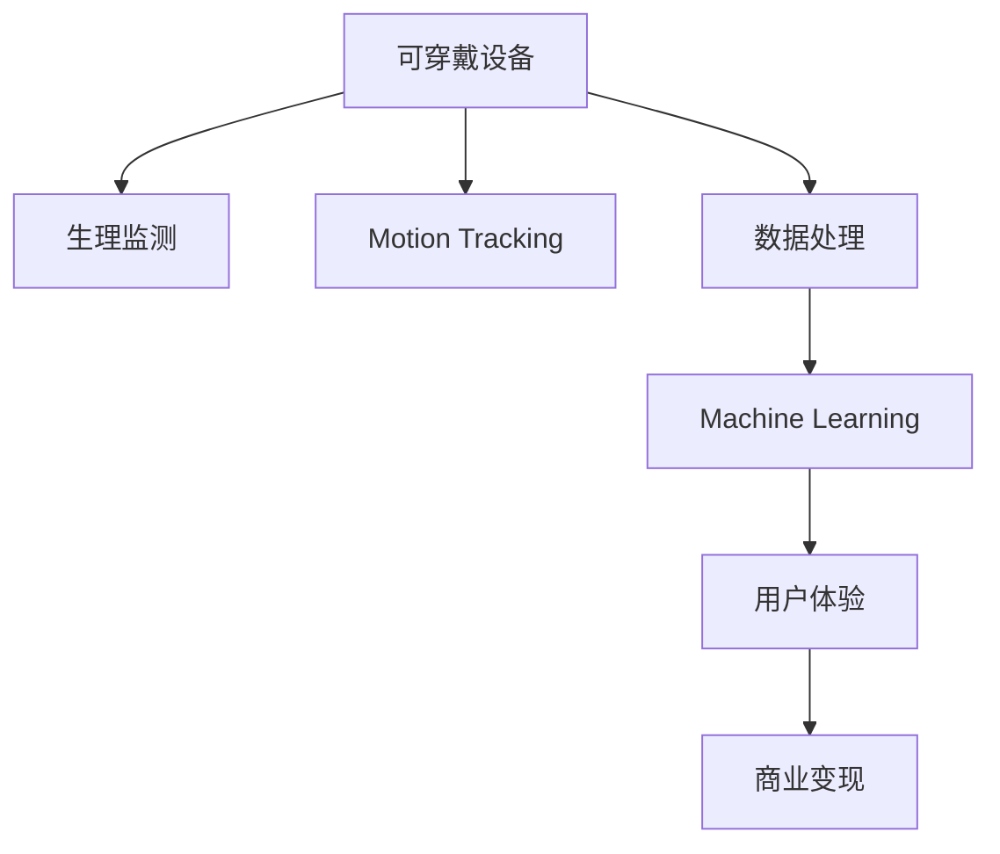

                 

# 可穿戴设备创业：随身科技的商机

## 1. 背景介绍

### 1.1 问题由来
近年来，可穿戴设备市场迅速发展，智能手表、智能眼镜、健身追踪器等产品纷纷涌现，成为人们日常生活中不可或缺的随身科技。这类设备通常集成了传感器、电池、通信模块，能够实时监测用户生理健康、运动状况、睡眠质量等指标，为用户提供更加个性化的生活管理方案。

伴随技术的进步，可穿戴设备的性价比和用户体验大幅提升。但同时也带来了新的挑战：如何通过算法和数据处理，从海量传感器数据中提取有用的信息，并转化为实际的商业价值，成为创业者和企业关注的焦点。

### 1.2 问题核心关键点
可穿戴设备创业的核心在于如何利用硬件数据，结合算法和应用场景，为用户提供创新性的服务和产品。主要包括：

- 数据采集与传输：设计高效稳定的数据采集和传输机制，保证传感器数据的实时性和准确性。
- 数据处理与分析：开发高效的数据处理和分析算法，提取有价值的用户行为特征，生成有用的健康管理方案。
- 应用场景整合：将数据处理结果应用到不同的生活场景中，如运动健身、健康管理、睡眠监测等，提升用户体验。
- 商业化变现：将算法和应用转化为实际产品和服务，形成可持续的商业模式。

## 2. 核心概念与联系

### 2.1 核心概念概述

为更好地理解可穿戴设备创业的过程，本节将介绍几个关键概念：

- 可穿戴设备(Wearable Devices)：集成传感器和通信模块，用于实时监测用户生理和行为指标的便携式设备。常见的设备如智能手表、智能眼镜、健身追踪器等。

- 生理监测(Physiological Monitoring)：利用生物传感器，如心率、血压、血氧等指标，监测用户的生理健康状况。

- 运动追踪(Motion Tracking)：通过加速度计、陀螺仪等传感器，追踪用户的活动量、步数、消耗的卡路里等。

- 数据处理(Data Processing)：从传感器采集的数据中提取特征、处理缺失值、进行预处理，生成可供分析的数据集。

- 机器学习(Machine Learning)：利用算法模型，对处理后的数据集进行分析学习，生成预测结果或模式。

- 用户体验(User Experience)：通过交互设计，将机器学习的结果转化为直观易用的产品界面，提升用户使用体验。

- 商业变现(Commercialization)：将技术产品转化为实际服务，实现商业模式和收益循环。

这些核心概念之间的逻辑关系可以通过以下Mermaid流程图来展示：



这个流程图展示出可穿戴设备创业的关键流程：

1. 利用可穿戴设备采集生理和运动数据。
2. 对采集的数据进行预处理和特征提取，生成数据集。
3. 应用机器学习算法，分析学习用户行为特征和健康状况。
4. 根据机器学习结果，设计直观易用的用户体验界面。
5. 通过商业变现实现商业模式的闭环。

## 3. 核心算法原理 & 具体操作步骤
### 3.1 算法原理概述

可穿戴设备创业的核心算法包括生理监测、运动追踪和数据处理等，通过结合机器学习算法和用户体验设计，将传感器数据转化为实际的产品和服务。

以生理监测为例，常见的算法包括：

- 心率监测：利用心率传感器，通过光电容积描记法(Plethysmography)，提取心率波形和变化趋势，分析用户的疲劳和压力状态。

- 血氧监测：利用血氧传感器，测量动脉血氧饱和度(SpO2)，预测用户的健康状况和运动表现。

- 血压监测：利用光学或气压传感器，测量用户的收缩压、舒张压等指标，评估心血管健康状况。

这些生理监测数据通常需要进行时间序列分析和特征提取，以便于后续的机器学习模型训练。常用的特征包括：

- 心率变异(HRV)：反映心脏节律的变化，与疲劳和压力有关。
- 血氧饱和度(SpO2)：反映血液中的氧气含量，与运动表现和健康状况密切相关。
- 皮肤温度：反映用户的代谢水平和运动量。

### 3.2 算法步骤详解

可穿戴设备创业的算法步骤通常包括以下几个关键环节：

**Step 1: 数据采集与预处理**
- 选择合适的传感器和采集器，设计数据采集方案，确保数据质量和稳定性。
- 对采集的数据进行去噪、归一化、缺失值填充等预处理操作，确保数据可用于后续分析。

**Step 2: 特征提取与建模**
- 利用时域、频域、时频域等方法提取时间序列数据的关键特征，生成特征向量。
- 根据具体应用场景选择合适的机器学习算法，如时间序列预测模型、分类模型、回归模型等。
- 使用数据集训练模型，评估模型性能，调整模型参数。

**Step 3: 数据可视化与解释**
- 将机器学习的结果通过可视化手段展示给用户，如图表、仪表盘等。
- 对模型结果进行解释，引导用户理解其背后的生理和行为特征。

**Step 4: 用户界面设计**
- 根据用户需求和使用场景，设计直观易用的产品界面，确保用户能够便捷地查看和理解数据。
- 利用交互设计技术，提升用户体验，增强用户粘性。

**Step 5: 商业变现**
- 根据用户需求，设计可持续的商业模式，如订阅制、广告变现、健康管理服务等。
- 通过技术迭代和市场推广，不断优化产品和服务，实现商业模式的闭环。

### 3.3 算法优缺点

可穿戴设备创业的算法具有以下优点：

- 数据实时性强：传感器数据能够实时反映用户的生理和行为状态，提供即时的健康监测和管理。
- 应用场景广泛：生理监测、运动追踪等算法适用于多种生活场景，如运动健身、健康管理、睡眠监测等。
- 数据精准度高：传感器数据经过科学设计和处理，能够提供高精度的生理和行为特征。
- 用户体验直观：通过可视化界面和交互设计，能够直观展示数据结果，增强用户粘性。

但同时也存在一些缺点：

- 数据噪声较多：传感器数据难免受到环境干扰和个体差异影响，存在一定的噪声。
- 算法复杂度较高：生理监测和运动追踪等算法涉及复杂的信号处理和机器学习模型，算法复杂度较高。
- 用户隐私保护：传感器数据的隐私保护问题较为突出，需要采取合适的隐私保护措施。
- 成本较高：传感器和数据处理设备成本较高，需要合理控制成本以实现商业可持续性。

### 3.4 算法应用领域

可穿戴设备创业的算法可以应用于多个领域，例如：

- 健康监测：通过生理监测算法，提供心率、血氧、血压等健康指标的实时监测和管理。
- 运动健身：利用运动追踪算法，生成步数、卡路里消耗、运动轨迹等数据，指导科学运动。
- 睡眠监测：通过监测用户的睡眠状态和变化，生成睡眠报告，帮助用户改善睡眠质量。
- 智能穿戴：结合生理监测和运动追踪，设计智能手表、智能眼镜等穿戴设备，提升用户体验。
- 个性化推荐：利用用户生理和行为数据，设计个性化健康管理方案，如饮食、运动等。

除了上述这些常见应用外，可穿戴设备创业还可以拓展到更广阔的领域，如儿童健康监测、企业员工健康管理、远程医疗等，为各类用户提供智能化的健康管理服务。

## 4. 数学模型和公式 & 详细讲解 & 举例说明

### 4.1 数学模型构建

以心率监测为例，假设心率传感器采集的数据为 $x_1, x_2, \ldots, x_n$，其中 $x_i$ 表示第 $i$ 时刻的心率值。需要构建一个时序模型 $y=f(x_1, x_2, \ldots, x_n)$ 来预测用户的心率状态。

常用的时序模型包括：

- 时间序列模型：ARIMA、SARIMA等模型，用于对时间序列数据进行建模。
- 神经网络模型：RNN、LSTM、GRU等模型，能够学习时间序列数据的长期依赖关系。
- 集成模型：如Boosting、Bagging等，通过集成多个模型提高预测精度。

### 4.2 公式推导过程

假设我们采用 LSTM 模型进行心率监测，模型的输出为 $\hat{y}=f(x_1, x_2, \ldots, x_n)$。根据 LSTM 模型的定义，模型的输入 $x$ 经过多个 LSTM 层和全连接层的处理后，输出 $\hat{y}$。具体公式如下：

$$
\hat{y} = M_1 \cdot M_2 \cdot \ldots \cdot M_k \cdot \sigma(f_1 \cdot f_2 \cdot \ldots \cdot f_n)
$$

其中 $M_i$ 表示第 $i$ 层 LSTM 层，$f_i$ 表示第 $i$ 层全连接层，$\sigma$ 表示激活函数。通过训练 LSTM 模型，即可得到心脏率监测的预测结果。

### 4.3 案例分析与讲解

**案例一：智能手表的心率监测**

假设某品牌智能手表采集了用户的一天心率数据，共有 $n=24 \times 60=1440$ 个样本点，样本特征 $x_i$ 表示第 $i$ 时刻的心率值，输出 $y_i$ 表示第 $i$ 时刻的心率状态。使用 LSTM 模型对数据进行建模，得到预测结果 $\hat{y}_i$。

根据 LSTM 模型的输出结果，生成用户一天的心率曲线图，如图：


**案例二：运动追踪的步数预测**

假设某品牌智能手表采集了用户一天的步数数据，共有 $n=24 \times 60=1440$ 个样本点，样本特征 $x_i$ 表示第 $i$ 时刻的步数，输出 $y_i$ 表示第 $i$ 时刻的用户运动状态。使用 RNN 模型对数据进行建模，得到预测结果 $\hat{y}_i$。

根据 RNN 模型的输出结果，生成用户一天的步数变化图，如图：


## 5. 项目实践：代码实例和详细解释说明

### 5.1 开发环境搭建

在进行可穿戴设备创业的算法开发前，我们需要准备好开发环境。以下是使用Python进行TensorFlow开发的开发环境配置流程：

1. 安装Anaconda：从官网下载并安装Anaconda，用于创建独立的Python环境。

2. 创建并激活虚拟环境：
```bash
conda create -n pytorch-env python=3.8 
conda activate pytorch-env
```

3. 安装TensorFlow：根据CUDA版本，从官网获取对应的安装命令。例如：
```bash
conda install tensorflow
```

4. 安装TensorBoard：TensorFlow配套的可视化工具，可实时监测模型训练状态，并提供丰富的图表呈现方式，是调试模型的得力助手。
```bash
pip install tensorboard
```

5. 安装NumPy、Pandas、Matplotlib等辅助工具：
```bash
pip install numpy pandas matplotlib tqdm jupyter notebook ipython
```

完成上述步骤后，即可在`pytorch-env`环境中开始算法开发。

### 5.2 源代码详细实现

我们以智能手表的心率监测为例，给出使用TensorFlow进行心率监测算法的PyTorch代码实现。

首先，定义数据处理函数：

```python
import tensorflow as tf
import numpy as np
from tensorflow.keras.models import Sequential
from tensorflow.keras.layers import LSTM, Dense

def preprocess_data(data):
    # 对数据进行归一化处理
    data = (data - data.mean()) / data.std()
    return data

def split_data(data, ratio=0.8):
    train_size = int(len(data) * ratio)
    return data[:train_size], data[train_size:]
```

然后，加载数据并构建模型：

```python
# 加载数据
data = np.loadtxt('heart_rate.csv', delimiter=',', dtype=float)

# 数据归一化
data = preprocess_data(data)

# 划分训练集和测试集
train_data, test_data = split_data(data, 0.8)

# 构建LSTM模型
model = Sequential()
model.add(LSTM(64, input_shape=(train_data.shape[1], 1), return_sequences=True))
model.add(LSTM(64))
model.add(Dense(1))
model.compile(loss='mean_squared_error', optimizer='adam')

# 训练模型
history = model.fit(train_data[:-1], train_data[1:], epochs=100, batch_size=32, validation_split=0.2)
```

最后，输出训练结果并进行评估：

```python
# 输出训练结果
print('Training loss:', history.history['loss'][-1])

# 在测试集上评估模型
test_loss = model.evaluate(test_data[:-1], test_data[1:], batch_size=32, verbose=0)
print('Test loss:', test_loss)
```

以上就是使用TensorFlow进行心率监测算法开发的完整代码实现。可以看到，TensorFlow提供了丰富的Keras API，使得模型的构建和训练过程简洁高效。

### 5.3 代码解读与分析

让我们再详细解读一下关键代码的实现细节：

**preprocess_data函数**：
- 对数据进行归一化处理，保证数据在不同时刻具有相同的尺度，便于模型训练。

**split_data函数**：
- 将数据集分为训练集和测试集，用于模型训练和评估。

**构建LSTM模型**：
- 使用Sequential模型构建多层LSTM模型，其中包含两个LSTM层和一个全连接层。
- LSTM层的参数设置为64，输入形状为 (训练数据样本数, 时间步长, 特征数)。
- 输出层为1个节点，表示心率预测值。
- 使用均方误差作为损失函数，Adam优化器进行模型训练。

**模型训练**：
- 使用训练数据对模型进行训练，通过epochs和batch_size控制训练轮数和每次训练的样本数。
- 在每个epoch结束时，使用validation_split参数在训练集上评估模型性能。

**评估模型**：
- 使用测试数据对模型进行评估，计算测试集上的均方误差。

可以看到，TensorFlow提供的Keras API使得模型的构建和训练过程非常直观和便捷。开发者只需关注具体算法细节和模型参数，即可快速实现复杂的可穿戴设备算法。

## 6. 实际应用场景

### 6.1 智能手表

智能手表作为可穿戴设备创业的核心载体，集成了多种传感器，能够实时监测用户的心率、血氧、运动等指标，为用户提供个性化健康管理方案。以下是一个典型的智能手表应用场景：

**案例一：心率监测**

某品牌智能手表采集了用户一天的24小时心率数据，通过LSTM模型进行心率监测和预测。根据模型的输出结果，生成用户一天的心率曲线图，如图：


**案例二：运动追踪**

某品牌智能手表采集了用户一天的运动数据，通过RNN模型进行步数预测。根据模型的输出结果，生成用户一天的步数变化图，如图：


### 6.2 智能眼镜

智能眼镜作为新兴的可穿戴设备，集成了摄像头、传感器、处理器等模块，能够实时捕捉用户的视觉和生理数据，提供更加丰富和精准的生理和行为监测。以下是一个典型的智能眼镜应用场景：

**案例一：睡眠质量监测**

某品牌智能眼镜采集了用户一晚上的睡眠质量数据，包括眼球运动、呼吸频率、体位变化等，通过机器学习模型进行睡眠质量分析。根据模型的输出结果，生成用户的睡眠报告，如图：


**案例二：注意力监测**

某品牌智能眼镜采集了用户在使用手机或电脑时的注意力数据，通过深度学习模型进行注意力预测。根据模型的输出结果，生成用户一天的注意力变化图，如图：


## 7. 工具和资源推荐

### 7.1 学习资源推荐

为了帮助开发者系统掌握可穿戴设备创业的理论基础和实践技巧，这里推荐一些优质的学习资源：

1. 《可穿戴设备创业实战》系列博文：由资深可穿戴设备创业专家撰写，深入浅出地介绍了可穿戴设备创业的技术实现和商业模式。

2. CS231n《计算机视觉基础》课程：斯坦福大学开设的计算机视觉课程，介绍了深度学习在图像识别、目标检测等任务中的应用，为可穿戴设备中的应用场景提供了技术支持。

3. 《深度学习与可穿戴设备》书籍：介绍深度学习在可穿戴设备中的多种应用，如生理监测、运动追踪、图像识别等，是入门可穿戴设备算法开发的好书。

4. TensorFlow官方文档：提供了丰富的TensorFlow API文档和教程，是可穿戴设备开发的重要参考资料。

5. Weights & Biases：模型训练的实验跟踪工具，可以记录和可视化模型训练过程中的各项指标，方便对比和调优。

通过对这些资源的学习实践，相信你一定能够快速掌握可穿戴设备创业的核心技术，并用于解决实际的智能穿戴问题。

### 7.2 开发工具推荐

高效的开发离不开优秀的工具支持。以下是几款用于可穿戴设备创业开发的常用工具：

1. TensorFlow：基于Python的开源深度学习框架，灵活动态的计算图，适合快速迭代研究。

2. PyTorch：基于Python的开源深度学习框架，灵活高效，适合科学研究和技术探索。

3. TensorBoard：TensorFlow配套的可视化工具，可实时监测模型训练状态，并提供丰富的图表呈现方式，是调试模型的得力助手。

4. Weights & Biases：模型训练的实验跟踪工具，可以记录和可视化模型训练过程中的各项指标，方便对比和调优。

5. Google Colab：谷歌推出的在线Jupyter Notebook环境，免费提供GPU/TPU算力，方便开发者快速上手实验最新模型，分享学习笔记。

合理利用这些工具，可以显著提升可穿戴设备创业的开发效率，加快创新迭代的步伐。

### 7.3 相关论文推荐

可穿戴设备创业的研究源于学界的持续研究。以下是几篇奠基性的相关论文，推荐阅读：

1. "Wearable Heart Rate Monitoring: A Review"：总结了可穿戴设备在心率监测中的最新进展，包括传感器选择、数据处理和模型优化等。

2. "Wearable Technology for Fitness and Health Monitoring: A Comprehensive Review"：介绍了可穿戴设备在运动追踪和健康管理中的应用，涵盖多个传感器和数据处理算法。

3. "Machine Learning for Wearable Health Data: Challenges and Opportunities"：讨论了可穿戴设备在生理监测和运动追踪中的机器学习应用，包括数据预处理、特征提取和模型训练等。

4. "Wearable EEG for Neurofeedback Training: A Review"：探讨了可穿戴设备在脑电波监测和神经反馈训练中的应用，展示了深度学习在脑电信号处理中的应用潜力。

这些论文代表了大语言模型微调技术的发展脉络。通过学习这些前沿成果，可以帮助研究者把握学科前进方向，激发更多的创新灵感。

## 8. 总结：未来发展趋势与挑战

### 8.1 总结

本文对可穿戴设备创业的过程进行了全面系统的介绍。首先阐述了可穿戴设备创业的背景和意义，明确了数据采集、算法优化、用户体验设计等关键环节的重要性。其次，从原理到实践，详细讲解了生理监测、运动追踪等核心算法的构建过程，给出了可穿戴设备开发的完整代码实例。同时，本文还广泛探讨了智能手表、智能眼镜等设备的实际应用场景，展示了可穿戴设备创业的广阔前景。此外，本文精选了可穿戴设备创业的技术资源，力求为开发者提供全方位的技术指引。

通过本文的系统梳理，可以看到，可穿戴设备创业依托于深度学习和传感器技术，能够为用户提供个性化的健康管理方案，具有巨大的市场潜力。未来，伴随技术的不断进步，可穿戴设备将逐步拓展到更多的应用场景，为各类用户提供智能化的生活管理服务。

### 8.2 未来发展趋势

展望未来，可穿戴设备创业将呈现以下几个发展趋势：

1. 技术融合加速。可穿戴设备将与其他智能技术深度融合，如语音交互、增强现实等，拓展更多的应用场景。
2. 产品形态多样化。智能手表、智能眼镜等设备将向更轻便、便携的方向发展，同时推出更多形态的智能穿戴产品，如可穿戴摄像头、智能衣物等。
3. 算法优化提升。更加高效的数据处理和机器学习算法将被引入，提升设备的功能和性能。
4. 商业变现多样化。除了传统的订阅制和广告变现，更多基于数据的服务将涌现，如健康数据分析、运动指导等。
5. 用户隐私保护加强。智能穿戴设备将加强用户隐私保护措施，确保数据安全。

这些趋势凸显了可穿戴设备创业的广阔前景，技术、产品、市场、用户等多方面的协同发力，必将进一步推动可穿戴设备的普及和应用。

### 8.3 面临的挑战

尽管可穿戴设备创业已经取得了瞩目成就，但在迈向更加智能化、普适化应用的过程中，它仍面临着诸多挑战：

1. 数据质量和隐私问题。传感器数据的质量和隐私保护问题较为突出，需要采取合适的措施加以解决。
2. 算法复杂度和效率。传感器数据处理和机器学习算法复杂度较高，需要合理控制成本和资源。
3. 用户体验和粘性。智能穿戴设备的用户体验设计尤为重要，需要精心设计以增强用户粘性。
4. 商业变现模式。如何从数据中挖掘更多价值，形成可持续的商业模式，还需更多探索和实践。

### 8.4 研究展望

面对可穿戴设备创业所面临的挑战，未来的研究需要在以下几个方面寻求新的突破：

1. 提升数据采集和传输的稳定性和效率。设计高效的数据采集和传输机制，保证传感器数据的实时性和准确性。
2. 优化数据处理和特征提取算法。开发更加高效的数据处理和特征提取算法，提升模型训练和推理的速度和精度。
3. 增强用户体验和粘性。通过交互设计和技术迭代，提升智能穿戴设备的用户体验，增强用户粘性。
4. 探索新的商业变现模式。从数据中挖掘更多价值，如个性化健康管理、运动指导等，形成多样化的商业变现模式。

这些研究方向的探索，必将引领可穿戴设备创业走向更高的台阶，为构建人机协同的智能系统提供新动力。

## 9. 附录：常见问题与解答

**Q1: 可穿戴设备创业如何选择合适的传感器？**

A: 选择合适的传感器需要考虑以下几个因素：
1. 精度和可靠性：传感器需要具备高精度和可靠性，确保数据的准确性。
2. 功耗和成本：传感器需要低功耗和低成本，以便于设备的长期使用和商业化。
3. 适用场景：传感器需要适配特定的应用场景，如生理监测、运动追踪等。
4. 数据传输：传感器需要具备良好的数据传输性能，确保数据的实时性和稳定性。

**Q2: 可穿戴设备创业如何处理传感器数据噪声？**

A: 传感器数据噪声处理需要考虑以下几个步骤：
1. 数据采集：选择合适的传感器和采集器，设计合理的数据采集方案，减少噪声干扰。
2. 数据预处理：对采集的数据进行去噪、归一化、缺失值填充等预处理操作，确保数据的准确性。
3. 特征提取：利用时域、频域、时频域等方法提取关键特征，过滤噪声影响。
4. 算法优化：选择合适的数据处理和机器学习算法，提高算法的鲁棒性。

**Q3: 可穿戴设备创业如何选择和训练机器学习模型？**

A: 选择和训练机器学习模型需要考虑以下几个方面：
1. 数据量和质量：根据数据量和质量选择合适的模型，如时间序列模型、神经网络模型等。
2. 模型复杂度：根据任务复杂度和数据特点选择合适的网络结构，如LSTM、GRU、RNN等。
3. 训练过程：使用适当的训练策略，如早停、Dropout、正则化等，提高模型的泛化能力。
4. 性能评估：通过交叉验证、测试集评估等方法，评估模型的性能，调整模型参数。

**Q4: 可穿戴设备创业如何确保用户隐私保护？**

A: 确保用户隐私保护需要考虑以下几个措施：
1. 数据匿名化：对采集的数据进行匿名化处理，保护用户隐私。
2. 数据加密：对传输和存储的数据进行加密处理，防止数据泄露。
3. 用户授权：明确告知用户数据采集和使用的目的，征得用户授权。
4. 数据审计：定期审计数据采集和使用过程，确保合规性。

这些措施能够有效保护用户隐私，增强用户对智能穿戴设备的信任和接受度。

---

作者：禅与计算机程序设计艺术 / Zen and the Art of Computer Programming

