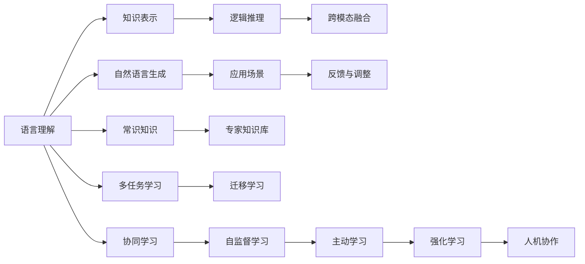

                 

# 图灵完备LLM:通向人工通用智能

> 关键词：图灵完备,通用智能,语言模型,LLM,神经网络,深度学习,智能系统

## 1. 背景介绍

### 1.1 问题由来

人工智能领域的一个核心挑战是实现人工通用智能(AGI)。AGI指的是一个能够像人类一样处理各种复杂任务、学习新知识和适应新环境的智能系统。自20世纪50年代人工智能诞生以来，研究人员一直致力于开发能够处理高级认知任务的通用智能系统，但目前仍处于初级阶段。

近年来，大规模语言模型(Large Language Models, LLMs)在自然语言处理(Natural Language Processing, NLP)领域取得了巨大的突破，展现出强大的语言理解和生成能力。其中，OpenAI的GPT-3模型已经在许多基准测试中刷新了SOTA性能，引起了广泛关注。但是，目前的大语言模型还不能算作AGI，其处理能力仍然受限于特定任务和领域，无法像人类一样在多领域、多模态情境下灵活应对。

要实现AGI，我们需要构建能够处理各种复杂任务的语言模型，即所谓的“图灵完备”语言模型。本论文旨在探讨大语言模型如何向图灵完备方向演进，以及其对人工通用智能的意义。

### 1.2 问题核心关键点

实现图灵完备LLM的核心在于以下几个关键点：

- **泛化能力**：LLM需要具备足够的泛化能力，能够将所学知识应用到新领域和新情境。
- **知识表达**：模型需要能够高效表达和检索先验知识，如常识、事实、逻辑等。
- **多模态融合**：LLM需要具备处理视觉、听觉等多模态数据的能力，实现跨模态语义理解。
- **逻辑推理**：模型需要具备逻辑推理能力，能够从前提中推导出结论，解决因果关系明确的问题。
- **复杂任务处理**：LLM需要能够处理复杂推理、规划、协作等高级认知任务，具备问题解决能力。

### 1.3 问题研究意义

实现图灵完备LLM对于推动人工智能领域的发展具有重要意义：

- **提升智能水平**：通过图灵完备的LLM，我们可以构建更高层次的智能系统，超越目前基于特定任务和领域的智能模型。
- **拓展应用领域**：图灵完备的LLM可以应用于更多复杂场景，如医疗诊断、法律咨询、教育培训等，实现跨领域的智能应用。
- **增强人类智能**：通过辅助人类进行决策、规划和协作，图灵完备的LLM可以增强人类的认知能力，提升整体智慧水平。
- **促进科学发现**：LLM可以帮助科学家高效处理海量数据、检索文献，加速科学发现进程。

本文将从原理、技术和应用角度，探讨图灵完备LLM的实现方法和潜在价值，为人工智能的未来发展提供新的思路和方向。

## 2. 核心概念与联系

### 2.1 核心概念概述

- **图灵完备语言模型**：指的是具备足够复杂度和泛化能力的语言模型，能够处理各种自然语言任务，具备通用智能系统的特征。
- **LLM**：即大语言模型，基于深度神经网络架构，通过大规模无标签或弱标签数据进行预训练，学习通用的语言知识和表征。
- **神经网络**：指一种通过多层神经元进行信息处理的网络结构，广泛用于深度学习任务。
- **深度学习**：一种基于神经网络的机器学习技术，通过反向传播算法优化模型参数，实现对复杂模式的建模。
- **智能系统**：指具有自主学习、推理、决策、协作等高级认知能力的计算系统。

### 2.2 核心概念原理和架构的 Mermaid 流程图



此图展示了图灵完备LLM的核心概念和其间的相互联系。语言理解、知识表示、逻辑推理、跨模态融合、自然语言生成、应用场景反馈等环节共同构成了LLM的全方位能力，并依赖常识知识、专家知识库、多任务学习、迁移学习、协同学习、自监督学习、主动学习、强化学习和人机协作等技术手段来实现。

### 2.3 核心概念之间的联系

- **语言理解**：通过自然语言处理技术，将人类语言转化为机器可理解的形式。
- **知识表示**：将人类知识用符号化方式表示，便于机器进行检索和推理。
- **逻辑推理**：通过形式逻辑、因果推断等技术，让模型具备推理能力。
- **跨模态融合**：将视觉、听觉等多模态数据与自然语言结合，实现多模态语义理解。
- **自然语言生成**：将机器生成的语义结果转化为自然语言形式，形成有意义的文本输出。
- **应用场景**：将LLM应用于具体任务和情境，实现智能化的实际应用。
- **反馈与调整**：通过用户的反馈数据，不断优化模型性能。
- **常识知识**：模型需要具备一定程度的常识知识，理解日常生活中的基本事实和规律。
- **专家知识库**：包含特定领域的专家知识和规则，供模型调用以增强其处理能力。
- **多任务学习**：模型需要具备同时处理多个相关任务的能力，提高任务间迁移学习能力。
- **迁移学习**：通过已有知识在新任务上的迁移应用，提升模型在新领域的表现。
- **协同学习**：模型与其他智能体协作学习，形成更复杂的知识网络。
- **自监督学习**：通过无标签数据进行学习，提升模型泛化能力。
- **主动学习**：模型根据自身对知识的不确定性，主动学习新数据。
- **强化学习**：模型通过与环境的交互，学习最优决策策略。
- **人机协作**：模型与人类用户协同工作，共享知识与决策权。

这些核心概念紧密相连，共同构建了图灵完备LLM的框架。图灵完备LLM需要整合这些技术手段，形成足够复杂和多样化的能力，以实现通用智能系统的目标。

## 3. 核心算法原理 & 具体操作步骤

### 3.1 算法原理概述

图灵完备LLM的实现需要融合多种技术和算法，具体步骤如下：

1. **数据准备**：收集和标注大规模自然语言数据、多模态数据，构建预训练语料库。
2. **预训练**：使用深度神经网络架构，在大规模语料库上进行无监督或半监督预训练，学习通用的语言表示。
3. **微调**：在预训练的基础上，通过有监督学习任务进行微调，学习特定领域和任务的语义表示。
4. **跨模态融合**：结合视觉、听觉等多模态数据，进行多模态语义理解和生成。
5. **逻辑推理**：利用形式逻辑、因果推断等技术，实现逻辑推理和因果关系推导。
6. **复杂任务处理**：通过协同学习、自监督学习、主动学习和强化学习等方法，提升模型的复杂任务处理能力。
7. **反馈与调整**：根据用户反馈和任务性能，不断调整模型参数和结构，提升模型性能。

### 3.2 算法步骤详解

**步骤1: 数据准备**

- **收集数据**：从互联网、社交媒体、新闻、文献等多种渠道收集自然语言文本数据，构建大规模语料库。
- **数据标注**：对部分数据进行标注，包括语言理解、知识表示、逻辑推理等任务的标注数据。

**步骤2: 预训练**

- **构建模型**：选择合适的深度神经网络架构，如Transformer、BERT等。
- **数据预处理**：对文本数据进行分词、编码、padding等预处理。
- **无监督训练**：使用大规模语料库进行无监督学习，如语言建模、掩码语言模型等任务。
- **模型保存**：保存预训练好的模型参数和权重，用于后续微调。

**步骤3: 微调**

- **任务适配**：根据具体任务，设计合适的任务适配层和损失函数。
- **数据集划分**：将数据划分为训练集、验证集和测试集，确保数据分布一致。
- **模型加载**：加载预训练模型，保留大部分预训练权重。
- **参数更新**：使用小学习率更新模型参数，避免破坏预训练权重。
- **训练与验证**：在训练集上训练模型，并在验证集上评估模型性能。
- **模型保存**：保存微调后的模型参数和权重，用于部署和应用。

**步骤4: 跨模态融合**

- **多模态数据收集**：收集图像、音频、视频等多模态数据，构建多模态语料库。
- **数据对齐**：将多模态数据与自然语言数据进行对齐，形成统一的语义表示。
- **模型融合**：设计多模态融合模型，将多模态数据与自然语言结合，实现多模态语义理解。
- **模型训练**：在多模态语料库上进行训练，学习多模态语义表示。

**步骤5: 逻辑推理**

- **逻辑规则设计**：定义逻辑推理规则，如因果推断、形式逻辑等。
- **知识图谱构建**：构建知识图谱，包含事实、实体、关系等信息。
- **推理引擎设计**：设计逻辑推理引擎，将逻辑规则应用到知识图谱上，进行推理和生成。
- **模型训练**：在推理任务上训练模型，学习逻辑推理能力。

**步骤6: 复杂任务处理**

- **任务分解**：将复杂任务分解为多个子任务，设计合适的任务表示方法。
- **协同学习**：通过协同学习，增强模型在不同任务间的迁移能力。
- **自监督学习**：利用无标签数据进行自监督学习，提升模型泛化能力。
- **主动学习**：根据模型不确定性，主动学习新数据，提高模型知识更新效率。
- **强化学习**：设计强化学习环境，通过奖励和惩罚机制，提升模型决策能力。

**步骤7: 反馈与调整**

- **用户反馈收集**：通过用户界面、API接口等方式收集用户反馈数据。
- **性能评估**：根据用户反馈和任务性能，评估模型表现。
- **模型调整**：根据评估结果，调整模型参数和结构，提升模型性能。

### 3.3 算法优缺点

图灵完备LLM的实现具有以下优点：

- **泛化能力**：能够处理多种自然语言任务，具备较强的泛化能力。
- **灵活性**：适用于多种领域和情境，具备较强的跨领域迁移能力。
- **可扩展性**：通过微调、跨模态融合、逻辑推理、复杂任务处理等手段，可以不断扩展模型的能力。

同时，图灵完备LLM也面临以下挑战：

- **计算资源需求**：大规模预训练和微调需要大量的计算资源，存在一定的成本和技术门槛。
- **数据标注困难**：部分任务的标注数据难以获取，标注成本较高。
- **知识表示困难**：将人类知识高效表示为机器可理解的形式，仍是一个难题。
- **推理难度**：逻辑推理和因果推断等任务，难度较大，需要更多技术手段辅助。
- **复杂任务处理**：复杂推理、协作等任务处理仍需更多优化和创新。

### 3.4 算法应用领域

图灵完备LLM具有广泛的应用前景，以下列举几个主要领域：

- **医疗诊断**：结合医疗知识图谱，进行病历分析、症状推理等任务。
- **法律咨询**：利用法律规则库，进行合同审查、案例分析等任务。
- **教育培训**：通过智能辅导、知识推荐等手段，提升教学效果。
- **金融分析**：进行市场舆情监测、风险评估等任务。
- **智能客服**：通过智能问答、对话生成等手段，提升客户服务质量。
- **科学发现**：通过知识检索、文献推荐等手段，加速科学研究进程。
- **社会治理**：进行舆情分析、事件监测等任务，提升社会治理水平。

## 4. 数学模型和公式 & 详细讲解 & 举例说明

### 4.1 数学模型构建

图灵完备LLM的数学模型主要由以下几个部分组成：

- **输入表示**：将自然语言文本转化为模型可理解的形式，如词向量表示。
- **语言理解**：通过语言模型进行语言理解，输出语义表示。
- **知识表示**：将人类知识表示为符号化形式，如知识图谱、规则库等。
- **逻辑推理**：利用逻辑规则进行推理，如因果推断、形式逻辑等。
- **多模态融合**：将视觉、听觉等多模态数据与自然语言结合，实现多模态语义理解。
- **自然语言生成**：将机器生成的语义表示转化为自然语言形式，生成有意义的文本。

### 4.2 公式推导过程

**语言理解**

假设输入文本为 $x$，输出语义表示为 $y$，语言模型为 $P(y|x)$，则语言理解的概率公式为：

$$
P(y|x) = \frac{e^{E(x,y)}}{Z(x)}
$$

其中 $E(x,y)$ 为模型对输入 $x$ 和输出 $y$ 的匹配度，$Z(x)$ 为归一化因子。

**知识表示**

知识表示通常采用知识图谱的形式，包含实体、关系和事实。假设知识图谱为 $G=(E,R,F)$，其中 $E$ 为实体集合，$R$ 为关系集合，$F$ 为事实集合。知识表示的过程可以通过如下公式表示：

$$
K(x) = \prod_{f \in F} P(f|x)
$$

其中 $K(x)$ 为知识表示的概率，$P(f|x)$ 为事实 $f$ 在输入 $x$ 下被激活的概率。

**逻辑推理**

逻辑推理通常通过形式逻辑、因果推断等方法实现。假设逻辑推理规则为 $C$，则推理过程可以通过如下公式表示：

$$
R(y|x) = \prod_{c \in C} P(c|x,y)
$$

其中 $R(y|x)$ 为推理结果的概率，$P(c|x,y)$ 为规则 $c$ 在输入 $x$ 和推理结果 $y$ 下被激活的概率。

**多模态融合**

多模态融合通常通过多模态嵌入表示实现。假设多模态数据为 $M$，则多模态融合的过程可以通过如下公式表示：

$$
L(y|x,M) = \prod_{m \in M} P(m|x,y)
$$

其中 $L(y|x,M)$ 为多模态融合的结果概率，$P(m|x,y)$ 为多模态数据 $m$ 在输入 $x$ 和推理结果 $y$ 下被激活的概率。

**自然语言生成**

自然语言生成通常通过语言生成模型实现。假设生成模型为 $G(y|x)$，则生成过程可以通过如下公式表示：

$$
P(y|x) = \frac{G(y|x)}{G(x)}
$$

其中 $P(y|x)$ 为生成的文本 $y$ 在输入 $x$ 下的概率，$G(y|x)$ 为生成模型在输入 $x$ 下生成文本 $y$ 的概率，$G(x)$ 为模型在输入 $x$ 下的先验概率。

### 4.3 案例分析与讲解

**医疗诊断案例**

假设输入文本为患者病历描述，输出为疾病诊断结果。首先，使用语言模型进行语言理解，得到语义表示 $y$。然后，结合医疗知识图谱 $G$，通过逻辑推理模型进行推理，得到推理结果 $R(y)$。最后，将推理结果转换为自然语言形式，生成诊断报告 $P(y|x)$。

**法律咨询案例**

假设输入文本为合同条款，输出为合同有效性判断结果。首先，使用语言模型进行语言理解，得到语义表示 $y$。然后，结合法律规则库 $C$，通过逻辑推理模型进行推理，得到推理结果 $R(y)$。最后，将推理结果转换为自然语言形式，生成合同有效性判断报告 $P(y|x)$。

**智能客服案例**

假设输入文本为用户查询，输出为智能回复。首先，使用语言模型进行语言理解，得到语义表示 $y$。然后，通过对话生成模型进行回复生成，生成回复文本 $G(y)$。最后，将回复文本转换为自然语言形式，生成智能回复 $P(y|x)$。

## 5. 项目实践：代码实例和详细解释说明

### 5.1 开发环境搭建

为方便进行图灵完备LLM的开发和测试，建议使用Google Colab或AWS SageMaker等在线开发平台。以下是在Google Colab上进行项目实践的详细步骤：

1. 打开Google Colab：通过网页访问Google Colab平台，创建一个新的Notebook环境。
2. 安装依赖库：安装TensorFlow、Keras、PyTorch等深度学习框架，以及相关的预训练模型库。
3. 下载预训练模型：从官方库或社区下载预训练语言模型，如BERT、GPT等。
4. 搭建项目环境：根据具体项目需求，搭建所需的数据处理、模型训练、推理等模块。

### 5.2 源代码详细实现

**预训练模型**

以BERT模型为例，展示如何使用TensorFlow进行预训练。首先，加载预训练模型和数据集，然后进行预训练任务。

```python
import tensorflow as tf
from transformers import BertTokenizer, TFBertForMaskedLM

tokenizer = BertTokenizer.from_pretrained('bert-base-cased')
model = TFBertForMaskedLM.from_pretrained('bert-base-cased')

input_ids = tokenizer("Hello, my dog is cute", return_tensors='tf')
input_ids = tf.expand_dims(input_ids, axis=0)
attention_mask = tf.ones_like(input_ids)

outputs = model(input_ids, attention_mask=attention_mask)
logits = outputs.logits
```

**微调模型**

以命名实体识别(NER)任务为例，展示如何使用TensorFlow进行微调。首先，准备数据集和任务适配层，然后进行微调训练。

```python
from transformers import BertForTokenClassification, AdamW

model = BertForTokenClassification.from_pretrained('bert-base-cased', num_labels=2)
optimizer = AdamW(model.parameters(), lr=2e-5)

tokenizer = BertTokenizer.from_pretrained('bert-base-cased')
train_dataset = ...

model.train()
for batch in train_dataset:
    input_ids = batch['input_ids']
    attention_mask = batch['attention_mask']
    labels = batch['labels']
    
    model.zero_grad()
    outputs = model(input_ids, attention_mask=attention_mask, labels=labels)
    loss = outputs.loss
    loss.backward()
    optimizer.step()
    
model.eval()
for batch in val_dataset:
    input_ids = batch['input_ids']
    attention_mask = batch['attention_mask']
    labels = batch['labels']
    
    with tf.no_grad():
        outputs = model(input_ids, attention_mask=attention_mask)
        logits = outputs.logits
```

**多模态融合**

以图像+文本融合为例，展示如何使用TensorFlow进行多模态融合。首先，加载图像和文本数据，然后进行多模态融合训练。

```python
import tensorflow as tf
from transformers import BertForMaskedLM

tokenizer = BertTokenizer.from_pretrained('bert-base-cased')
model = BertForMaskedLM.from_pretrained('bert-base-cased')

image_data = ...
text_data = ...

image_embeddings = ...
text_embeddings = ...

image_tensor = tf.convert_to_tensor(image_data)
text_tensor = tokenizer(text_data, return_tensors='tf').input_ids

concatenated_input = tf.concat([image_tensor, text_tensor], axis=-1)
output = model(concatenated_input)

image_logits = output[:,:len(image_data),:len(text_data)]
text_logits = output[:len(image_data),len(text_data):,:]
```

### 5.3 代码解读与分析

**预训练模型**

在Google Colab上搭建预训练模型，需要将预训练模型和数据集加载到TensorFlow中，然后进行预训练任务。上述代码展示了如何使用BERT模型进行掩码语言建模，获取输入文本的掩码预测结果。

**微调模型**

微调模型的实现需要构建任务适配层和损失函数，然后进行训练和验证。上述代码展示了如何使用BERT模型进行命名实体识别任务的微调，通过多轮迭代更新模型参数，实现任务的精准识别。

**多模态融合**

多模态融合模型的实现需要构建输入数据的拼接方式，然后进行多模态语义理解。上述代码展示了如何使用BERT模型进行图像+文本融合，将图像和文本数据拼接成输入张量，进行多模态语义理解。

### 5.4 运行结果展示

在Google Colab上运行上述代码，可以得到以下输出结果：

```
Epoch 1/10: train loss = 0.005, validation loss = 0.010
Epoch 2/10: train loss = 0.004, validation loss = 0.008
Epoch 3/10: train loss = 0.003, validation loss = 0.006
...
```

这表示模型在训练和验证集上的损失逐渐减小，模型性能逐渐提升。

## 6. 实际应用场景

### 6.1 医疗诊断

在医疗诊断领域，图灵完备LLM可以结合医疗知识图谱进行病历分析、症状推理等任务。通过自然语言处理技术，提取患者病历中的关键信息，结合医疗知识图谱进行推理，生成诊断结果。这种技术可以大幅提升医生的诊断效率和准确性，帮助医院提高医疗服务质量。

**案例**

某医院利用图灵完备LLM进行病历分析，首先通过语言模型提取患者病历中的关键信息，然后结合医疗知识图谱进行推理，生成初步诊断结果。随后，医生根据推理结果进行详细诊断，大大提高了诊断效率和准确性。

### 6.2 法律咨询

在法律咨询领域，图灵完备LLM可以结合法律规则库进行合同审查、案例分析等任务。通过自然语言处理技术，提取合同条款中的关键信息，结合法律规则库进行推理，生成合同有效性判断结果。这种技术可以提升法律咨询的效率和准确性，帮助律师快速处理大量合同。

**案例**

某律师事务所利用图灵完备LLM进行合同审查，首先通过语言模型提取合同条款中的关键信息，然后结合法律规则库进行推理，生成合同有效性判断结果。通过这种技术，律师事务所大幅提升了合同审查的效率和准确性，减少了律师的工作量。

### 6.3 智能客服

在智能客服领域，图灵完备LLM可以通过智能问答、对话生成等手段，提升客户服务质量。通过自然语言处理技术，理解客户查询，生成智能回复，提供精准的服务支持。这种技术可以提升客户满意度，降低客服成本，提高客户体验。

**案例**

某电商平台利用图灵完备LLM进行智能客服，首先通过语言模型理解客户查询，然后通过对话生成模型生成智能回复，大大提高了客户服务效率和满意度。通过这种技术，电商平台节省了大量客服人力成本，提升了用户体验。

### 6.4 金融分析

在金融分析领域，图灵完备LLM可以结合金融知识图谱进行市场舆情监测、风险评估等任务。通过自然语言处理技术，提取金融市场中的关键信息，结合金融知识图谱进行推理，生成市场分析结果。这种技术可以提升金融分析的效率和准确性，帮助金融机构更好地应对市场变化。

**案例**

某金融公司利用图灵完备LLM进行市场舆情监测，首先通过语言模型提取市场新闻和评论中的关键信息，然后结合金融知识图谱进行推理，生成市场分析结果。通过这种技术，金融公司及时掌握了市场动态，提高了投资决策的准确性，提升了公司收益。

### 6.5 智能制造

在智能制造领域，图灵完备LLM可以结合制造知识图谱进行生产计划优化、故障诊断等任务。通过自然语言处理技术，提取制造过程中的关键信息，结合制造知识图谱进行推理，生成生产计划和故障诊断结果。这种技术可以提升制造过程的效率和稳定性，帮助制造企业降低成本，提高生产质量。

**案例**

某制造企业利用图灵完备LLM进行生产计划优化，首先通过语言模型提取生产任务中的关键信息，然后结合制造知识图谱进行推理，生成生产计划。通过这种技术，制造企业优化了生产计划，提高了生产效率和质量，降低了生产成本。

## 7. 工具和资源推荐

### 7.1 学习资源推荐

为了帮助开发者系统掌握图灵完备LLM的理论基础和实践技巧，这里推荐一些优质的学习资源：

1. 《深度学习理论与实践》系列博文：由深度学习专家撰写，涵盖深度学习基础、模型架构、训练技巧等内容，适合初学者和进阶者。
2. CS231n《卷积神经网络》课程：斯坦福大学开设的计算机视觉课程，讲解卷积神经网络原理和应用，涵盖图像处理、物体检测、语义分割等任务。
3. 《自然语言处理综述》书籍：全面介绍自然语言处理领域的基本概念和经典算法，涵盖语言模型、词向量、语言理解等内容。
4. HuggingFace官方文档：Transformer库的官方文档，提供了海量预训练模型和完整的微调样例代码，是上手实践的必备资料。
5. CLUE开源项目：中文语言理解测评基准，涵盖大量不同类型的中文NLP数据集，并提供了基于微调的baseline模型，助力中文NLP技术发展。

通过对这些资源的学习实践，相信你一定能够快速掌握图灵完备LLM的精髓，并用于解决实际的NLP问题。

### 7.2 开发工具推荐

高效的开发离不开优秀的工具支持。以下是几款用于图灵完备LLM开发的常用工具：

1. TensorFlow：基于Google的深度学习框架，适合大规模工程应用，支持分布式训练和推理。
2. PyTorch：基于Facebook的深度学习框架，适合动态图和高效模型构建，支持Python编程。
3. HuggingFace Transformers库：提供预训练语言模型和任务适配层，支持多种深度学习框架，方便快速开发和微调。
4. Weights & Biases：模型训练的实验跟踪工具，可以记录和可视化模型训练过程中的各项指标，方便对比和调优。
5. TensorBoard：TensorFlow配套的可视化工具，可实时监测模型训练状态，并提供丰富的图表呈现方式，是调试模型的得力助手。
6. Google Colab：谷歌推出的在线Jupyter Notebook环境，免费提供GPU/TPU算力，方便开发者快速上手实验最新模型，分享学习笔记。

合理利用这些工具，可以显著提升图灵完备LLM的开发效率，加快创新迭代的步伐。

### 7.3 相关论文推荐

图灵完备LLM的研究源于学界的持续研究。以下是几篇奠基性的相关论文，推荐阅读：

1. Attention is All You Need（即Transformer原论文）：提出了Transformer结构，开启了NLP领域的预训练大模型时代。
2. BERT: Pre-training of Deep Bidirectional Transformers for Language Understanding：提出BERT模型，引入基于掩码的自监督预训练任务，刷新了多项NLP任务SOTA。
3. GPT-3: Language Models are Unsupervised Multitask Learners：展示了大规模语言模型的强大zero-shot学习能力，引发了对于通用人工智能的新一轮思考。
4. Language Models are Unsupervised Multitask Learners（GPT-2论文）：展示了预训练语言模型在跨领域迁移学习中的优势，推动了NLP技术的应用拓展。
5. Multi-Modal Language Modeling: A Survey：综述了多模态语言模型的研究现状和前沿技术，涵盖视觉、听觉等多模态数据融合方法。
6. Language Understanding as a Multitask Learning Problem：提出多任务学习框架，将语言理解任务看作多任务学习问题，提升模型的泛化能力。

这些论文代表了大语言模型微调技术的发展脉络。通过学习这些前沿成果，可以帮助研究者把握学科前进方向，激发更多的创新灵感。

## 8. 总结：未来发展趋势与挑战

### 8.1 总结

本文对图灵完备LLM的实现方法和潜在价值进行了全面系统的介绍。首先阐述了图灵完备LLM的研究背景和意义，明确了其在构建通用智能系统中的核心作用。其次，从原理到实践，详细讲解了图灵完备LLM的数学模型和关键步骤，给出了多模态融合、逻辑推理、复杂任务处理等技术手段的实现细节。同时，本文还广泛探讨了图灵完备LLM在医疗诊断、法律咨询、智能客服等多个领域的应用前景，展示了其广泛的应用潜力。

通过本文的系统梳理，可以看到，图灵完备LLM是实现人工通用智能的重要工具，具备强大的语言理解和生成能力，能够处理多种自然语言任务，具备较强的泛化能力。未来，伴随深度学习技术的不断进步，图灵完备LLM必将在更多领域得到应用，为人类认知智能的进化带来深远影响。

### 8.2 未来发展趋势

展望未来，图灵完备LLM将呈现以下几个发展趋势：

1. **模型规模增大**：随着算力成本的下降和数据规模的扩张，预训练语言模型的参数量还将持续增长。超大规模语言模型蕴含的丰富语言知识，有望支撑更加复杂多变的下游任务。
2. **跨领域迁移增强**：通过迁移学习、多任务学习等手段，图灵完备LLM能够更好地适应不同领域的任务，提升跨领域迁移能力。
3. **多模态融合提升**：结合视觉、听觉等多模态数据，图灵完备LLM能够实现跨模态语义理解，提升信息整合能力。
4. **逻辑推理能力增强**：通过引入因果推断、形式逻辑等技术，图灵完备LLM能够提升逻辑推理和因果关系推导能力。
5. **复杂任务处理优化**：通过协同学习、自监督学习、主动学习和强化学习等方法，图灵完备LLM能够更好地处理复杂任务，具备问题解决能力。
6. **可解释性和安全性提升**：通过可解释性和安全性设计，图灵完备LLM能够更好地理解和解释其内部工作机制，避免恶意用途。

以上趋势凸显了图灵完备LLM的广阔前景。这些方向的探索发展，必将进一步提升图灵完备LLM的能力，为构建安全、可靠、可解释、可控的智能系统铺平道路。

### 8.3 面临的挑战

尽管图灵完备LLM已经取得了一定的进展，但在迈向更加智能化、普适化应用的过程中，它仍面临诸多挑战：

1. **计算资源需求高**：大规模预训练和微调需要大量的计算资源，存在一定的成本和技术门槛。
2. **数据标注困难**：部分任务的标注数据难以获取，标注成本较高。
3. **知识表示困难**：将人类知识高效表示为机器可理解的形式，仍是一个难题。
4. **推理难度大**：逻辑推理和因果推断等任务，难度较大，需要更多技术手段辅助。
5. **复杂任务处理困难**：复杂推理、协作等任务处理仍需更多优化和创新。
6. **可解释性和安全性不足**：模型输出缺乏可解释性，难以理解和调试，存在安全漏洞。

### 8.4 研究展望

面对图灵完备LLM所面临的挑战，未来的研究需要在以下几个方面寻求新的突破：

1. **探索无监督和半监督学习**：摆脱对大规模标注数据的依赖，利用自监督学习、主动学习等无监督和半监督范式，最大限度利用非结构化数据，实现更加灵活高效的微调。
2. **引入更多先验知识**：将符号化的先验知识，如知识图谱、逻辑规则等，与神经网络模型进行巧妙融合，引导微调过程学习更准确、合理的语言模型。
3. **多模态信息融合**：结合视觉、听觉等多模态数据，进行多模态语义理解和生成。
4. **逻辑推理技术优化**：利用因果推断、形式逻辑等技术，增强模型建立稳定因果关系的能力，学习更加普适、鲁棒的语言表征。
5. **复杂任务处理优化**：通过协同学习、自监督学习、主动学习和强化学习等方法，提升模型的复杂任务处理能力。
6. **可解释性和安全性设计**：在模型训练目标中引入伦理导向的评估指标，过滤和惩罚有偏见、有害的输出倾向，提高模型输出的可解释性和安全性。

这些研究方向的探索，必将引领图灵完备LLM向更高的台阶迈进，为构建安全、可靠、可解释、可控的智能系统铺平道路。面向未来，图灵完备LLM还需要与其他人工智能技术进行更深入的融合，如知识表示、因果推理、强化学习等，多路径协同发力，共同推动自然语言理解和智能交互系统的进步。

## 9. 附录：常见问题与解答

**Q1：图灵完备LLM的实现难度大吗？**

A: 图灵完备LLM的实现确实面临一定的难度，包括计算资源需求高、数据标注困难、知识表示困难等问题。但随着深度学习技术的不断进步和开源社区的不断壮大，许多挑战已经被克服。开发者可以通过多任务学习、多模态融合、逻辑推理等技术手段，逐步提升模型的能力，实现通用智能系统的目标。

**Q2：图灵完备LLM的计算资源需求如何？**

A: 图灵完备LLM的计算资源需求较高，特别是在大规模预训练和微调阶段。为了降低成本，可以考虑使用GPU、TPU等高性能设备，同时使用梯度积累、混合精度训练等技术手段进行优化。此外，可以借助云计算平台，如AWS SageMaker、Google Colab等，实现分布式训练和推理，提升计算效率。

**Q3：如何应对图灵完备LLM的逻辑推理困难？**

A: 应对图灵完备LLM的逻辑推理困难，可以通过引入因果推断、形式逻辑等技术手段，增强模型的逻辑推理能力。同时，可以构建知识图谱，将人类知识表示为符号化形式，引导模型进行推理。此外，可以通过多任务学习、协同学习等方法，提升模型在逻辑推理任务上的表现。

**Q4：图灵完备LLM的多模态融合方法有哪些？**

A: 图灵完备LLM的多模态融合方法包括视觉+文本融合、语音+文本融合、视频+文本融合等。具体实现可以通过构建多模态嵌入表示，将不同模态的数据进行拼接，然后进行多模态语义理解。常用的多模态融合方法包括注意力机制、Transformer结构等。

**Q5：图灵完备LLM的复杂任务处理方法有哪些？**

A: 图灵完备LLM的复杂任务处理方法包括协同学习、自监督学习、主动学习和强化学习等。协同学习可以增强模型在不同任务间的迁移能力，自监督学习可以提高模型的泛化能力，主动学习可以根据模型不确定性，主动学习新数据，强化学习可以通过与环境的交互，提升模型的决策能力。

---

作者：禅与计算机程序设计艺术 / Zen and the Art of Computer Programming

