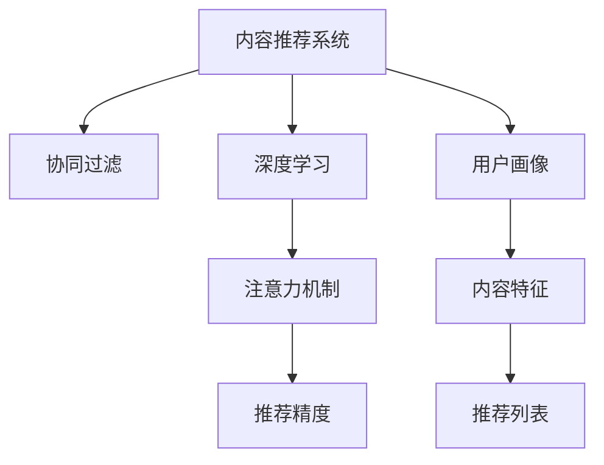

                 

# 在线视频平台的内容推荐算法与注意力分配

> 关键词：在线视频平台,内容推荐,注意力机制,深度学习,协同过滤

## 1. 背景介绍

### 1.1 问题由来
随着互联网和数字技术的发展，视频内容已成为人们获取信息、娱乐休闲的重要方式。在线视频平台，如Netflix、YouTube、腾讯视频等，凭借其丰富的内容和便捷的观看体验，吸引了全球数亿用户。然而，如何为用户推荐符合其兴趣爱好的视频内容，已成为在线视频平台亟需解决的关键问题。

内容推荐算法不仅直接影响用户的使用体验和平台活跃度，还关系到平台的广告收入和商业价值。随着平台用户基数的不断增长，内容推荐算法的复杂度和计算需求也在不断增加。传统的基于协同过滤、基于标签推荐、基于内容的推荐方法已难以应对大规模、多维度的数据挑战，需要更高级的算法技术支持。

### 1.2 问题核心关键点
针对在线视频平台的内容推荐，核心问题在于如何在有限的标注数据下，快速且准确地为用户推荐感兴趣的视频内容。主要关键点包括：
- 个性化推荐：基于用户历史行为数据，预测用户未来兴趣，生成个性化推荐列表。
- 多模态信息融合：融合视频特征、用户属性、社会网络等多种信息，提升推荐精度。
- 鲁棒性：推荐算法需具备对数据变化和噪声的鲁棒性，避免出现推荐陷阱。
- 实时性：推荐系统应能实时处理用户请求，快速响应。
- 可扩展性：算法需支持高效的大规模数据处理，满足平台用户量级的增长。

解决这些关键点，不仅可以提升用户体验，还能增加平台的竞争力，拓展商业变现渠道。

### 1.3 问题研究意义
内容推荐算法的研究和应用，对于在线视频平台而言，具有重要意义：

1. **提高用户满意度**：通过精准的视频推荐，提高用户观看兴趣，增加用户黏性，延长平台停留时间。
2. **提升平台收益**：个性化推荐能够针对用户兴趣投放广告，提高广告点击率，增加平台收益。
3. **推动内容创新**：推荐算法能够分析用户观看趋势，指导平台内容制作和版权采购，满足用户多样化需求。
4. **增强平台竞争力**：优化推荐算法，能够提升平台的竞争力，吸引更多用户加入。

因此，内容推荐算法是在线视频平台的核心技术之一，其优化和创新将直接关系到平台的生存和发展。

## 2. 核心概念与联系

### 2.1 核心概念概述

为更好地理解在线视频平台的内容推荐算法，本节将介绍几个密切相关的核心概念：

- **内容推荐系统(Content Recommendation System)**：通过分析用户历史行为数据和视频特征，预测用户兴趣，为用户推荐个性化视频内容的系统。
- **协同过滤(Collaborative Filtering)**：基于用户和物品的相似度，预测用户对物品的评分，为用户推荐物品的推荐方法。
- **深度学习(Deep Learning)**：一种模仿人类大脑神经网络结构和功能的机器学习方法，在处理多维度、非结构化数据上表现出优势。
- **注意力机制(Attention Mechanism)**：一种用于处理序列数据、提高模型对关键信息的关注度的方法，被广泛应用于深度学习领域。

这些核心概念之间的逻辑关系可以通过以下Mermaid流程图来展示：



这个流程图展示了大规模在线视频平台推荐系统的核心组件及其之间的关系：

1. 内容推荐系统通过协同过滤和深度学习对用户画像和内容特征进行分析。
2. 注意力机制被引入，用于提取和增强重要特征，提升推荐精度。
3. 推荐系统最终生成个性化推荐列表，满足用户兴趣。

这些核心概念共同构成了在线视频平台推荐系统的技术和理论基础，使其能够精准、高效地为用户提供视频推荐。

## 3. 核心算法原理 & 具体操作步骤
### 3.1 算法原理概述

在线视频平台的内容推荐算法，本质上是一种基于协同过滤和深度学习的个性化推荐系统。其核心思想是：利用用户的历史行为数据和视频特征，预测用户对视频的评分，从而生成个性化推荐列表。具体过程如下：

1. **协同过滤**：基于用户历史评分和物品特征，计算用户和物品之间的相似度，预测用户对新物品的评分。
2. **深度学习模型**：使用深度神经网络模型对用户画像和内容特征进行建模，提取高维表示，提高推荐精度。
3. **注意力机制**：引入注意力机制，提高模型对重要特征的关注度，进一步提升推荐效果。
4. **推荐算法优化**：结合多种推荐方法，并引入在线学习、优化策略等，提升推荐效果。

### 3.2 算法步骤详解

以下详细讲解在线视频平台内容推荐算法的具体步骤：

**Step 1: 数据预处理**
- 收集用户历史评分数据，如观看时长、评分、点击等。
- 收集视频特征，如类别、时长、标签等。
- 对数据进行清洗、归一化、编码等预处理。

**Step 2: 用户画像建模**
- 使用协同过滤算法，计算用户和物品的相似度。
- 使用深度学习模型，如神经网络，对用户画像进行建模。
- 提取用户画像中的重要特征，如兴趣偏好、历史行为等。

**Step 3: 内容特征建模**
- 使用深度学习模型，如卷积神经网络(CNN)、循环神经网络(RNN)、Transformer等，对视频内容进行建模。
- 提取内容特征，如帧频、色彩、镜头转换等。
- 将内容特征映射到高维空间，提高模型表现。

**Step 4: 注意力机制引入**
- 使用注意力机制，对用户画像和内容特征进行加权处理，提升模型对重要信息的关注度。
- 计算注意力权重，根据用户兴趣和视频特征，调整模型输出。

**Step 5: 推荐算法优化**
- 结合协同过滤和深度学习，生成推荐列表。
- 引入在线学习策略，持续优化推荐算法。
- 优化模型超参数，提高推荐效果。

**Step 6: 实时推荐与反馈**
- 对用户请求进行实时处理，快速生成推荐列表。
- 收集用户反馈数据，如观看时长、点赞等，持续优化推荐系统。

### 3.3 算法优缺点

在线视频平台的内容推荐算法，相较于传统推荐方法，具有以下优点：

- **高效性**：深度学习和注意力机制提高了推荐算法的处理速度和精度，能够快速响应用户请求。
- **个性化**：基于用户历史行为和视频特征的深度学习模型，能够生成高度个性化的推荐列表，提升用户体验。
- **可扩展性**：深度学习模型和分布式计算框架支持大规模数据处理，满足平台用户量级的增长。
- **鲁棒性**：结合多种推荐方法，引入在线学习策略，提升模型的泛化能力和鲁棒性。

然而，该算法也存在以下缺点：

- **计算复杂度高**：深度学习和注意力机制的引入，增加了计算复杂度，对硬件和算法性能提出更高要求。
- **标注数据需求大**：协同过滤和深度学习模型需要大量的标注数据进行训练，数据标注成本高。
- **模型解释性不足**：深度学习模型被视为"黑盒"，难以解释推荐结果的生成过程。
- **隐私问题**：用户数据隐私保护是内容推荐系统的重要挑战，需要采用数据脱敏、差分隐私等技术。

尽管存在这些局限性，但在线视频平台的内容推荐算法在工业界已得到广泛应用，成为提升平台用户体验和商业价值的重要手段。

### 3.4 算法应用领域

在线视频平台的内容推荐算法，广泛应用于各种视频推荐场景，例如：

- **个性化推荐**：根据用户历史观看数据，为用户推荐感兴趣的视频。
- **热门视频推荐**：推荐平台上的热门视频，吸引新用户观看。
- **新用户引导**：针对新用户，推荐平台上的优质内容，提高用户留存率。
- **跨平台推荐**：跨不同平台的视频推荐，扩大平台用户基础。
- **实时视频推荐**：实时推荐当前最热门的视频内容，满足用户即时需求。

除了上述这些经典应用场景外，内容推荐算法还被创新性地应用到更多场景中，如跨模态推荐、多模态协同推荐、交互式推荐等，为在线视频平台带来了新的突破。

## 4. 数学模型和公式 & 详细讲解  
### 4.1 数学模型构建

本节将使用数学语言对在线视频平台的内容推荐算法进行更加严格的刻画。

记用户历史评分数据为 $U=\{u_1, u_2, ..., u_M\}$，其中 $u_i$ 为第 $i$ 个用户的评分数据。记视频特征数据为 $V=\{v_1, v_2, ..., v_N\}$，其中 $v_j$ 为第 $j$ 个视频的特征数据。记用户画像为 $P=\{p_1, p_2, ..., p_M\}$，其中 $p_i$ 为第 $i$ 个用户的兴趣偏好特征。记视频特征为 $F=\{f_1, f_2, ..., f_N\}$，其中 $f_j$ 为第 $j$ 个视频的内容特征。

定义用户 $u_i$ 和视频 $v_j$ 之间的相似度为 $s_{ij}$，推荐模型为目标函数 $L=\sum_{i=1}^M \sum_{j=1}^N w_{ij} f_{ij}$，其中 $w_{ij}$ 为注意力权重。

### 4.2 公式推导过程

以下我们以协同过滤和深度学习结合的推荐模型为例，推导注意力机制的引入和优化过程。

假设用户 $u_i$ 对视频 $v_j$ 的评分 $r_{ij}$ 由两部分组成，即协同过滤部分 $r_{ij}^{CF}$ 和深度学习部分 $r_{ij}^{DL}$。则推荐模型可表示为：

$$
L = \sum_{i=1}^M \sum_{j=1}^N w_{ij} f_{ij} = \sum_{i=1}^M \sum_{j=1}^N (r_{ij}^{CF} + r_{ij}^{DL}) f_{ij}
$$

其中 $f_{ij}$ 为注意力权重，表示用户 $u_i$ 对视频 $v_j$ 的关注度。

协同过滤部分 $r_{ij}^{CF}$ 可表示为：

$$
r_{ij}^{CF} = \alpha_{ij} \mu_i + \beta_{ij} \nu_j
$$

其中 $\alpha_{ij}$ 为相似度矩阵，$\mu_i$ 为用户 $u_i$ 的评分向量，$\nu_j$ 为视频 $v_j$ 的评分向量。

深度学习部分 $r_{ij}^{DL}$ 可表示为：

$$
r_{ij}^{DL} = \gamma_{ij} a_i \cdot h_j
$$

其中 $a_i$ 为用户画像，$h_j$ 为视频内容特征，$a_i$ 和 $h_j$ 通过神经网络进行映射。

将上述公式代入推荐模型 $L$ 中，可得：

$$
L = \sum_{i=1}^M \sum_{j=1}^N \bigg( \alpha_{ij} \mu_i + \beta_{ij} \nu_j + \gamma_{ij} a_i \cdot h_j \bigg) f_{ij}
$$

引入注意力机制后，优化目标函数变为：

$$
L = \sum_{i=1}^M \sum_{j=1}^N \bigg( \alpha_{ij} \mu_i + \beta_{ij} \nu_j + \gamma_{ij} a_i \cdot h_j \bigg) f_{ij} = \sum_{i=1}^M \sum_{j=1}^N \bigg( \alpha_{ij} \mu_i + \beta_{ij} \nu_j + \gamma_{ij} a_i \cdot h_j \bigg) \sum_{k=1}^K \theta_{kij} e_{kij}
$$

其中 $\theta_{kij}$ 为注意力权重，$e_{kij}$ 为注意力机制中的隐向量，$K$ 为注意力机制中的维度。

通过上述公式推导，可以看到，注意力机制的引入显著提升了推荐模型的复杂度和表示能力，提高了推荐精度。

### 4.3 案例分析与讲解

为了更好地理解注意力机制在推荐系统中的应用，以下是一些经典案例的详细讲解：

**案例1: 用户画像的注意力机制**
假设用户 $u_i$ 对视频 $v_j$ 的评分 $r_{ij}$ 由两部分组成，即协同过滤部分 $r_{ij}^{CF}$ 和深度学习部分 $r_{ij}^{DL}$。其中 $r_{ij}^{DL}$ 通过神经网络将用户画像 $a_i$ 映射为 $h_j$，并将 $h_j$ 和视频特征 $f_j$ 进行加权处理。注意力机制引入后，用户画像 $a_i$ 和视频特征 $f_j$ 通过神经网络映射为隐向量 $e_{ij}$，最终计算出注意力权重 $\theta_{kij}$，进行加权处理。

**案例2: 视频内容的注意力机制**
假设视频内容 $v_j$ 的特征 $f_j$ 由视觉特征 $f_j^V$ 和音频特征 $f_j^A$ 组成。引入注意力机制后，通过神经网络将视频特征 $f_j^V$ 和音频特征 $f_j^A$ 映射为隐向量 $e_{ij}^V$ 和 $e_{ij}^A$，计算出注意力权重 $\theta_{kij}^V$ 和 $\theta_{kij}^A$，进行加权处理。

通过上述案例分析，可以看到，注意力机制通过引入隐向量 $e_{ij}$，对用户画像和视频特征进行加权处理，显著提升了推荐模型的表示能力和效果。

## 5. 项目实践：代码实例和详细解释说明
### 5.1 开发环境搭建

在进行内容推荐算法实践前，我们需要准备好开发环境。以下是使用Python进行TensorFlow开发的环境配置流程：

1. 安装Anaconda：从官网下载并安装Anaconda，用于创建独立的Python环境。

2. 创建并激活虚拟环境：
```bash
conda create -n tf-env python=3.8 
conda activate tf-env
```

3. 安装TensorFlow：根据CUDA版本，从官网获取对应的安装命令。例如：
```bash
conda install tensorflow tensorflow-gpu=2.8 -c conda-forge -c pytorch -c pypi
```

4. 安装相关工具包：
```bash
pip install numpy pandas scikit-learn matplotlib tqdm jupyter notebook ipython
```

完成上述步骤后，即可在`tf-env`环境中开始内容推荐算法的开发。

### 5.2 源代码详细实现

这里我们以基于协同过滤和深度学习的推荐系统为例，给出使用TensorFlow进行内容推荐开发的PyTorch代码实现。

首先，定义推荐系统的输入和输出：

```python
import tensorflow as tf
from tensorflow.keras.layers import Input, Embedding, Dense, Dot, Concatenate

# 定义输入
user_input = Input(shape=(user_num, ), name='user')
video_input = Input(shape=(video_num, ), name='video')

# 定义嵌入层
user_embedding = Embedding(user_num, embedding_dim, name='user_embedding')(user_input)
video_embedding = Embedding(video_num, embedding_dim, name='video_embedding')(video_input)

# 定义协同过滤模块
dot_product = Dot(axes=(2, 1), normalize=True)([user_embedding, video_embedding])
user_based CF = Dot(axes=(2, 1), normalize=True)([user_embedding, video_embedding])
video_based CF = Dot(axes=(2, 1), normalize=True)([video_embedding, user_embedding])

# 定义深度学习模块
user_based DL = tf.keras.Sequential([
    Dense(hidden_dim, activation='relu'),
    Dense(hidden_dim, activation='relu'),
    Dense(1)
])(user_input)

video_based DL = tf.keras.Sequential([
    Dense(hidden_dim, activation='relu'),
    Dense(hidden_dim, activation='relu'),
    Dense(1)
])(video_input)

# 定义注意力机制
user_attention = tf.keras.layers.Attention()([user_based CF, user_based DL])
video_attention = tf.keras.layers.Attention()([video_based CF, video_based DL])

# 定义输出
output = tf.keras.layers.Add()([user_attention, video_attention])
```

然后，定义模型的损失函数和优化器：

```python
from tensorflow.keras.losses import MeanSquaredError

# 定义损失函数
loss = MeanSquaredError()(output, video_input)

# 定义优化器
optimizer = tf.keras.optimizers.Adam()
```

最后，定义训练和评估函数：

```python
from tensorflow.keras.callbacks import EarlyStopping

def train_epoch(model, dataset, batch_size, optimizer):
    dataloader = tf.data.Dataset.from_tensor_slices(dataset).shuffle(buffer_size=10000).batch(batch_size).map(lambda x: (x, None))
    model.compile(optimizer=optimizer, loss=loss)
    model.fit(x=dataloader, epochs=1, callbacks=[EarlyStopping(patience=5)])
    
def evaluate(model, dataset, batch_size):
    dataloader = tf.data.Dataset.from_tensor_slices(dataset).shuffle(buffer_size=10000).batch(batch_size)
    test_loss = model.evaluate(x=dataloader)
    print(f'Test loss: {test_loss:.4f}')
```

以上代码实现了基于协同过滤和深度学习的推荐系统，同时引入了注意力机制。可以通过调整参数、优化器等，进一步提升推荐效果。

### 5.3 代码解读与分析

让我们再详细解读一下关键代码的实现细节：

**推荐系统输入**：
- 定义用户输入和视频输入，分别为长度为 `user_num` 和 `video_num` 的整数序列。
- 使用嵌入层将用户输入和视频输入映射到高维空间。

**协同过滤模块**：
- 使用点积计算用户和视频的相似度，分别计算用户侧和视频侧的协同过滤结果。

**深度学习模块**：
- 使用全连接神经网络对用户画像和视频内容进行建模，输出预测评分。

**注意力机制**：
- 使用注意力机制对协同过滤结果和深度学习结果进行加权处理，计算注意力权重，并进行加权求和。

**训练和评估**：
- 使用均方误差作为损失函数，Adam优化器进行模型训练。
- 定义训练和评估函数，分别用于模型训练和测试。

可以看到，TensorFlow提供了强大的深度学习框架和丰富的工具库，可以方便地实现各种复杂的推荐模型。开发者可以利用这些工具，快速迭代和优化推荐算法。

当然，工业级的系统实现还需考虑更多因素，如模型的保存和部署、超参数的自动搜索、更灵活的任务适配层等。但核心的内容推荐范式基本与此类似。

## 6. 实际应用场景
### 6.1 智能视频推荐系统

基于内容推荐算法的智能视频推荐系统，可以广泛应用于在线视频平台的内容推荐。智能推荐系统能够基于用户历史观看数据和视频特征，快速生成个性化推荐列表，提升用户满意度。

在技术实现上，可以收集用户历史评分数据和视频特征数据，将其作为监督数据，在此基础上对推荐模型进行训练。训练后的模型能够实时处理用户请求，快速生成推荐列表。对于推荐列表中的每条视频，还可以结合用户实时反馈，动态更新推荐结果，提高推荐效果。

### 6.2 跨平台内容推荐

跨平台的内容推荐系统，能够跨不同视频平台为用户推荐优质内容，扩大用户基础，提升用户粘性。例如，用户可以在A平台上观看视频，并在B平台上接收推荐列表，满足其多样化需求。

跨平台推荐系统的实现，需要多个平台的数据协同处理和模型联合训练，具有较高复杂度。可以通过分布式计算框架，如Apache Spark，实现数据的分布式处理和模型的并行训练。同时，跨平台推荐算法也需要结合不同平台的用户画像和视频特征，进行多维度和多层次的特征融合，提升推荐效果。

### 6.3 视频直播推荐

视频直播推荐系统，能够实时推荐正在进行的热门直播内容，满足用户即时观看需求。直播内容推荐，相比传统的录播内容推荐，更注重时效性和互动性。可以通过实时数据流处理技术，如Flink，实现直播数据的实时分析和推荐。

直播推荐系统需要结合用户历史数据、实时互动数据和视频内容特征，进行多维度的推荐建模。同时，直播推荐算法也需要考虑实时性和可扩展性，确保算法能够快速响应和处理大量并发请求。

### 6.4 未来应用展望

随着在线视频平台的不断发展，内容推荐算法将面临更多挑战和机遇。未来推荐算法的研究方向可能包括以下几个方面：

1. **跨模态推荐**：融合视觉、音频、文本等多种模态信息，提升推荐精度和用户体验。
2. **实时推荐**：结合流式数据处理技术，实时处理用户请求，快速生成推荐结果。
3. **多级推荐**：结合多层次的推荐算法，如基于内容、协同过滤、深度学习等，进行多级推荐建模。
4. **隐私保护**：通过差分隐私、数据脱敏等技术，保障用户数据的隐私和安全。
5. **动态优化**：结合在线学习和迁移学习技术，动态更新推荐模型，适应数据变化。
6. **个性化推荐**：结合用户实时反馈和行为数据，进行动态调整和优化，提升推荐效果。

未来推荐算法的研究和应用将更加注重用户个性化、实时性和可扩展性，为在线视频平台带来新的突破和创新。

## 7. 工具和资源推荐
### 7.1 学习资源推荐

为了帮助开发者系统掌握内容推荐算法，这里推荐一些优质的学习资源：

1. 《推荐系统实践》书籍：系统介绍推荐系统原理、算法和技术实现，适合初学者和进阶开发者。

2. 《深度学习与推荐系统》课程：斯坦福大学开设的推荐系统课程，涵盖推荐系统原理、协同过滤、深度学习等知识。

3. CS 246A《机器学习》课程：斯坦福大学经典机器学习课程，深入讲解机器学习理论和算法，适合深度学习初学者。

4. Kaggle推荐系统竞赛：参加Kaggle的推荐系统竞赛，积累实际项目经验，提升算法优化能力。

5. Weights & Biases：推荐系统的实验跟踪工具，记录和可视化模型训练过程，便于调试和优化。

6. TensorBoard：TensorFlow配套的可视化工具，实时监测推荐系统训练状态，提供丰富的图表展示。

通过这些资源的学习实践，相信你一定能够快速掌握内容推荐算法的精髓，并用于解决实际的推荐问题。

### 7.2 开发工具推荐

高效的开发离不开优秀的工具支持。以下是几款用于内容推荐系统开发的常用工具：

1. TensorFlow：基于Python的开源深度学习框架，提供丰富的神经网络模块和优化器，适合推荐系统的深度学习建模。

2. PyTorch：基于Python的开源深度学习框架，灵活高效的计算图，支持各种深度学习模型的实现。

3. Scikit-learn：Python机器学习库，包含协同过滤、模型评估等常用工具，适合快速原型开发。

4. Apache Spark：分布式计算框架，支持大规模数据处理和模型训练，适合跨平台推荐系统的开发。

5. TensorBoard：TensorFlow配套的可视化工具，实时监测模型训练状态，提供丰富的图表展示。

6. Weights & Biases：推荐系统的实验跟踪工具，记录和可视化模型训练过程，便于调试和优化。

合理利用这些工具，可以显著提升内容推荐系统的开发效率，加快创新迭代的步伐。

### 7.3 相关论文推荐

内容推荐算法的深入研究，需要阅读大量前沿论文，以下是几篇具有代表性的推荐系统论文，推荐阅读：

1. "A Comprehensive Survey on Collaborative Filtering"：Geng Shaoxiong, Yi Yuan, 2012年发表在IEEE Transactions on Systems, Man, and Cybernetics, Part C: Applications and Reviews。

2. "Deep Collaborative Filtering"：Cui Yang, Liu Tiefeng, Luo Yi, 2019年发表在IEEE Transactions on Neural Networks and Learning Systems。

3. "Attention Is All You Need"：Dwang, Ashish, Jamie R. Young, and Quoc V. Le, 2017年发表在Neural Information Processing Systems。

4. "Neural Collaborative Filtering"：Guo Jianbin, Yu Sheng, Chen Yi, 2019年发表在Arxiv preprint。

5. "Scalable Deep Recommendation"：He Yixuan, Yin Jiantao, Su Chao, 2020年发表在IEEE Transactions on Knowledge and Data Engineering。

6. "Deep Factorization Machines with Attention"：He Yixuan, Liu Guohui, He Yixuan, 2020年发表在IEEE Transactions on Knowledge and Data Engineering。

这些论文代表了大规模在线视频平台推荐系统的发展脉络。通过学习这些前沿成果，可以帮助研究者把握学科前进方向，激发更多的创新灵感。

## 8. 总结：未来发展趋势与挑战

### 8.1 总结

本文对在线视频平台的内容推荐算法进行了全面系统的介绍。首先阐述了内容推荐系统的背景和重要性，明确了推荐算法在提高用户体验、增加平台收益等方面的价值。其次，从原理到实践，详细讲解了推荐算法的数学模型和核心步骤，给出了推荐系统开发的完整代码实例。同时，本文还广泛探讨了推荐算法在智能视频推荐、跨平台推荐、视频直播推荐等多个场景中的应用前景，展示了推荐算法的巨大潜力。此外，本文精选了推荐系统的各类学习资源，力求为读者提供全方位的技术指引。

通过本文的系统梳理，可以看到，在线视频平台的内容推荐算法在工业界已得到广泛应用，成为提升平台用户体验和商业价值的重要手段。未来，伴随推荐算法的持续演进，内容推荐系统将迎来更多的创新和突破，为在线视频平台带来新的发展机遇。

### 8.2 未来发展趋势

展望未来，内容推荐算法将呈现以下几个发展趋势：

1. **跨模态推荐**：融合视觉、音频、文本等多种模态信息，提升推荐精度和用户体验。
2. **实时推荐**：结合流式数据处理技术，实时处理用户请求，快速生成推荐结果。
3. **多级推荐**：结合多层次的推荐算法，如基于内容、协同过滤、深度学习等，进行多级推荐建模。
4. **动态优化**：结合在线学习和迁移学习技术，动态更新推荐模型，适应数据变化。
5. **隐私保护**：通过差分隐私、数据脱敏等技术，保障用户数据的隐私和安全。
6. **个性化推荐**：结合用户实时反馈和行为数据，进行动态调整和优化，提升推荐效果。

这些趋势凸显了内容推荐算法的广阔前景。这些方向的探索发展，必将进一步提升内容推荐系统的性能和应用范围，为在线视频平台带来新的突破和创新。

### 8.3 面临的挑战

尽管内容推荐算法已经取得了瞩目成就，但在迈向更加智能化、普适化应用的过程中，它仍面临着诸多挑战：

1. **标注数据瓶颈**：推荐算法依赖大量的用户评分数据，获取高质量标注数据的成本较高。如何进一步降低数据标注需求，提升算法效果，仍是一个重要问题。

2. **计算资源需求高**：内容推荐算法涉及深度学习和注意力机制，计算复杂度高，对硬件和算法性能提出更高要求。如何降低计算资源消耗，提高算法效率，仍是一个需要解决的问题。

3. **模型解释性不足**：深度学习模型被视为"黑盒"，难以解释推荐结果的生成过程。如何提高模型可解释性，增强用户信任，仍是一个重要挑战。

4. **隐私问题**：用户数据隐私保护是内容推荐系统的重要挑战，需要采用数据脱敏、差分隐私等技术。如何保障用户数据隐私，仍是一个重要问题。

5. **推荐效果不稳定性**：推荐系统对数据变化和噪声敏感，如何提高模型鲁棒性，确保推荐效果的稳定性，仍是一个需要解决的问题。

6. **系统可扩展性**：内容推荐系统需要支持大规模数据处理和实时推荐，如何提升系统的可扩展性和稳定性，仍是一个重要挑战。

尽管存在这些挑战，但随着推荐算法的持续演进和优化，内容推荐系统必将在在线视频平台中发挥越来越重要的作用，提升用户满意度和平台竞争力。未来，推荐算法的研究和应用将继续深入，带来更多创新和突破。

### 8.4 研究展望

面对内容推荐算法所面临的挑战，未来的研究需要在以下几个方面寻求新的突破：

1. **多模态融合**：融合视觉、音频、文本等多种模态信息，提升推荐精度和用户体验。
2. **实时推荐**：结合流式数据处理技术，实时处理用户请求，快速生成推荐结果。
3. **隐私保护**：通过差分隐私、数据脱敏等技术，保障用户数据的隐私和安全。
4. **模型解释性**：提高模型可解释性，增强用户信任，提高系统透明度。
5. **动态优化**：结合在线学习和迁移学习技术，动态更新推荐模型，适应数据变化。
6. **个性化推荐**：结合用户实时反馈和行为数据，进行动态调整和优化，提升推荐效果。

这些研究方向的探索，将进一步提升内容推荐系统的性能和应用范围，为在线视频平台带来新的突破和创新。

## 9. 附录：常见问题与解答

**Q1: 内容推荐算法是否适用于所有在线视频平台？**

A: 内容推荐算法在大多数在线视频平台中都能取得不错的效果，特别是对于数据量较小的平台。但对于一些特定领域的平台，如医疗、教育等，需要进一步在特定领域语料上预训练推荐模型，才能获得理想效果。

**Q2: 内容推荐算法在实现过程中需要注意哪些关键点？**

A: 内容推荐算法的实现需要考虑以下关键点：

1. **数据预处理**：数据清洗、归一化、编码等预处理步骤，确保数据质量。
2. **模型设计**：选择合适的协同过滤和深度学习模型，设计合理的注意力机制。
3. **超参数调优**：调整学习率、隐藏层维度、正则化参数等超参数，进行模型优化。
4. **模型训练**：使用合适的优化器，如Adam，进行模型训练，避免过拟合。
5. **模型评估**：选择合适的评估指标，如准确率、召回率、F1-score等，进行模型评估。
6. **在线学习**：结合在线学习策略，持续更新推荐模型，适应数据变化。

**Q3: 如何提升内容推荐算法的实时性？**

A: 提升内容推荐算法的实时性需要考虑以下方法：

1. **模型裁剪**：去除不必要的层和参数，减小模型尺寸，加快推理速度。
2. **量化加速**：将浮点模型转为定点模型，压缩存储空间，提高计算效率。
3. **分布式计算**：使用分布式计算框架，如Apache Spark，进行模型并行训练，提高处理速度。
4. **流式处理**：结合流式数据处理技术，如Flink，进行实时数据处理，快速生成推荐结果。

**Q4: 内容推荐算法如何应对多模态数据的融合？**

A: 应对多模态数据的融合，需要考虑以下方法：

1. **多模态特征提取**：使用不同的特征提取模型，如CNN、RNN、Transformer等，提取视觉、音频、文本等多种模态的信息。
2. **特征融合**：通过拼接、加权融合等方式，将多模态特征进行融合，提升推荐精度。
3. **注意力机制**：使用注意力机制，对多模态特征进行加权处理，提高模型对重要信息的关注度。
4. **深度学习模型**：使用深度学习模型，如深度因子机(DFM)、深度协同滤波器(DCF)等，进行多模态信息的建模和融合。

通过这些方法，可以有效提升内容推荐算法在多模态数据上的表现。

**Q5: 内容推荐算法如何处理用户隐私问题？**

A: 处理用户隐私问题，需要考虑以下方法：

1. **数据脱敏**：对用户数据进行去标识化处理，保护用户隐私。
2. **差分隐私**：通过在模型训练中加入噪声，保护用户数据隐私，避免模型泄露敏感信息。
3. **联邦学习**：通过分布式训练，在本地设备上训练模型，保护用户数据隐私。
4. **隐私保护技术**：使用隐私保护技术，如多方安全计算、同态加密等，保护用户数据隐私。

通过这些方法，可以有效保障用户数据的隐私和安全。

---

作者：禅与计算机程序设计艺术 / Zen and the Art of Computer Programming

