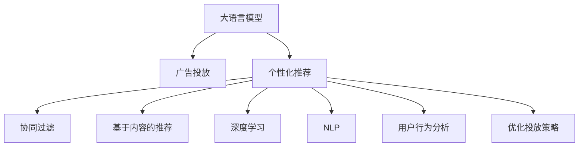

                 

# 基于LLM的个性化广告推荐新方法

> 关键词：大语言模型,个性化推荐,深度学习,自然语言处理(NLP),广告投放,用户行为分析

## 1. 背景介绍

### 1.1 问题由来

互联网广告业务近年来一直处于蓬勃发展之中。线上广告的便捷性、精准性和低成本优势使其在品牌推广和市场营销中占据了重要地位。但随着用户隐私意识的增强，传统的单一点击率优化广告投放策略已难以满足用户需求，个性化广告推荐技术应运而生。

个性化广告推荐通过分析用户的历史行为数据，预测其感兴趣的内容，在合适的时间和场景向用户推送相关广告，提升广告的点击率和转化率，实现用户的广告价值最大化。

### 1.2 问题核心关键点

个性化广告推荐的核心在于通过对用户历史行为的深度分析，预测其对广告的兴趣，从而实现更精准的广告投放。主要关键点包括：

- 数据收集：收集用户的历史点击、浏览、购买等行为数据，以及广告内容和展示时间等属性信息。
- 特征工程：设计多维度的用户特征，如人口统计信息、兴趣标签、互动行为等，以及广告属性。
- 模型训练：采用机器学习算法，训练模型预测用户对广告的兴趣，推荐相关广告。
- 广告投放：根据模型预测结果，将广告展示给感兴趣的潜在用户，并进行实时优化。

### 1.3 问题研究意义

个性化广告推荐技术的发展，对于提升广告效果、增强用户体验、优化广告投放策略具有重要意义：

1. 提升广告效果：通过个性化推荐，广告能够触及真正感兴趣的潜在客户，显著提高广告的点击率和转化率。
2. 增强用户体验：根据用户的兴趣和需求推荐广告，提升用户体验，增加用户粘性。
3. 优化广告投放：提供更加精准的投放策略，实现广告的精确投放，避免浪费广告预算。
4. 推动市场营销：个性化推荐能够更好地满足用户需求，提升品牌影响力，促进市场营销的持续发展。

## 2. 核心概念与联系

### 2.1 核心概念概述

为更好地理解基于大语言模型(LLM)的个性化广告推荐方法，本节将介绍几个密切相关的核心概念：

- 大语言模型(LLM)：以自回归(如GPT)或自编码(如BERT)模型为代表的大规模预训练语言模型。通过在大规模无标签文本语料上进行预训练，学习通用的语言表示，具备强大的语言理解和生成能力。

- 个性化推荐系统：根据用户的历史行为和兴趣，推荐用户可能感兴趣的商品、服务或广告的系统。常见的方法包括协同过滤、基于内容的推荐、混合推荐等。

- 深度学习(DL)：一种基于神经网络的学习方法，通过多层神经元模拟人脑的神经网络结构，学习数据中的模式和规律，实现复杂任务的求解。

- 自然语言处理(NLP)：研究计算机如何处理、理解人类语言的技术，涵盖语言理解、语言生成、机器翻译等多个方向。

- 广告投放：将广告内容推送给潜在用户，并跟踪广告的展示和点击效果，优化广告投放策略的过程。

- 用户行为分析：通过分析用户的历史行为数据，挖掘用户兴趣和偏好，为用户提供个性化推荐和广告投放。

这些核心概念之间的逻辑关系可以通过以下Mermaid流程图来展示：



这个流程图展示了大语言模型和个性化广告推荐系统的主要流程：

1. 大语言模型通过预训练获得语言表示能力。
2. 个性化推荐系统根据用户行为数据和广告属性，生成推荐结果。
3. 广告投放根据推荐结果，将广告精准推送给用户。
4. 用户行为分析不断优化广告投放策略，提升广告效果。

## 3. 核心算法原理 & 具体操作步骤
### 3.1 算法原理概述

基于大语言模型的个性化广告推荐方法，核心在于利用预训练语言模型在特定领域上进行微调，通过上下文理解和学习语言表达，实现对广告文本的生成和理解，从而生成个性化推荐结果。

具体步骤如下：

1. 收集用户的历史行为数据，包括点击、浏览、购买等行为记录，以及广告的展示时间、广告文本等属性信息。
2. 对用户行为数据进行预处理和特征工程，设计多维度的用户特征，如人口统计信息、兴趣标签、互动行为等，以及广告属性。
3. 将用户行为数据和广告属性作为训练数据，对预训练的大语言模型进行微调，学习用户对广告的兴趣和偏好。
4. 在微调后的语言模型基础上，生成针对每个用户的具体广告推荐。
5. 根据推荐效果实时优化广告投放策略，提升广告效果。

### 3.2 算法步骤详解

以下是基于大语言模型的个性化广告推荐算法的详细步骤：

**Step 1: 数据收集与预处理**

- 收集用户的历史行为数据，如点击记录、浏览记录、购买记录等，以及广告展示时间、广告文本等属性信息。
- 对数据进行清洗和去重，去除噪音和异常值，确保数据的质量和可靠性。
- 进行特征工程，设计多维度的用户特征，如人口统计信息、兴趣标签、互动行为等，以及广告属性，如广告文本、展示时间、广告类别等。

**Step 2: 数据标注与构建**

- 将用户行为数据和广告属性作为标注数据，用于训练大语言模型。
- 对于点击和浏览行为，标注为正样本，对于未点击和未浏览行为，标注为负样本。
- 使用BertTokenizer等分词工具，对广告文本进行分词，转换成模型所需的输入格式。

**Step 3: 模型微调**

- 选择合适的预训练语言模型，如BERT、GPT等，作为初始化参数。
- 使用微调函数对模型进行训练，最小化损失函数，优化模型对用户广告兴趣的预测能力。
- 设置合适的学习率、批大小、迭代轮数等超参数，防止过拟合。
- 保留预训练的部分层，只微调顶层，以提高微调效率和减少参数量。

**Step 4: 广告推荐生成**

- 根据微调后的语言模型，生成针对每个用户的个性化广告推荐。
- 使用Transformer解码器，将广告文本转换成向量，输入到微调后的语言模型中。
- 根据模型输出的向量，选择与用户兴趣匹配度最高的广告。

**Step 5: 广告投放优化**

- 将推荐广告展示给用户，并跟踪广告的展示和点击效果。
- 根据广告投放效果实时优化广告投放策略，如调整广告展示时间、展示位置等。
- 定期收集新的用户行为数据，重新训练微调模型，确保模型始终保持最新状态。

### 3.3 算法优缺点

基于大语言模型的个性化广告推荐方法具有以下优点：

1. 生成高质量的推荐结果：利用预训练语言模型的上下文理解能力和语言生成能力，生成的推荐广告更具吸引力和相关性。
2. 自适应性强：大语言模型能够学习用户的行为模式和语言偏好，适用于不同领域的广告推荐。
3. 可解释性强：广告推荐过程基于模型输出的向量，能够提供详细的推荐理由。
4. 实时性强：利用大语言模型的计算能力，能够实时生成个性化推荐，提高广告投放的灵活性。

但同时也存在一些局限性：

1. 数据隐私问题：收集用户行为数据需要处理隐私保护问题，需符合相关的法律法规。
2. 计算资源需求高：大规模语言模型的微调需要大量的计算资源和存储空间。
3. 模型复杂度高：大语言模型复杂度高，导致训练和推理时间较长。
4. 可解释性不足：模型决策过程复杂，难以直观理解广告推荐理由。

### 3.4 算法应用领域

基于大语言模型的个性化广告推荐方法，适用于各种广告推荐场景，包括电商、新闻、视频、社交等平台。主要应用领域包括：

1. 电商推荐：通过分析用户购买记录和浏览历史，推荐相关商品广告。
2. 新闻推荐：根据用户浏览历史，推荐相关新闻和文章广告。
3. 视频推荐：分析用户观看记录和偏好，推荐相关视频广告。
4. 社交推荐：根据用户互动行为，推荐相关社交广告。

此外，该方法还可以应用于广告创意生成、广告效果评估、广告竞价优化等多个广告相关领域，为广告业务带来多维度的改进和提升。

## 4. 数学模型和公式 & 详细讲解  
### 4.1 数学模型构建

假设用户行为数据集为 $D=\{(x_i, y_i)\}_{i=1}^N$，其中 $x_i$ 为广告属性和用户行为数据， $y_i$ 为广告展示的标签（展示或不展示）。

将广告属性和用户行为数据作为文本输入，利用BERT等语言模型进行预训练，生成向量表示 $Z=\{z_i\}_{i=1}^N$。

定义广告展示的预测概率为 $p(y_i|x_i, z_i)=\text{softmax}(\boldsymbol{w}^\top \boldsymbol{z}_i+b)$，其中 $\boldsymbol{w}$ 为模型参数， $b$ 为偏置项。

优化目标为最大化广告展示的概率，即：

$$
\max_{\boldsymbol{w},b} \sum_{i=1}^N \log p(y_i|x_i, z_i)
$$

### 4.2 公式推导过程

基于大语言模型的广告推荐数学模型，可以通过以下步骤推导：

**Step 1: 数据表示**

假设广告属性为 $x_i=\{x_i^{(1)}, x_i^{(2)}, ..., x_i^{(K)}\}$，用户行为数据为 $x_i=\{x_i^{(1)}, x_i^{(2)}, ..., x_i^{(K)}\}$，其中 $K$ 为特征维度。

**Step 2: 特征编码**

将广告属性和用户行为数据转换成向量表示，利用BERT等模型进行编码，得到向量 $z_i=\{z_i^{(1)}, z_i^{(2)}, ..., z_i^{(D)}\}$，其中 $D$ 为向量维度。

**Step 3: 广告展示概率**

定义广告展示的预测概率为 $p(y_i|x_i, z_i)=\text{softmax}(\boldsymbol{w}^\top \boldsymbol{z}_i+b)$，其中 $\boldsymbol{w}$ 为模型参数， $b$ 为偏置项。

**Step 4: 优化目标**

最小化广告展示的负对数似然损失函数，即：

$$
\min_{\boldsymbol{w},b} -\sum_{i=1}^N \log p(y_i|x_i, z_i)
$$

将 $\boldsymbol{w}$ 和 $b$ 作为可学习参数，利用梯度下降等优化算法进行训练。

### 4.3 案例分析与讲解

以电商推荐为例，详细讲解模型的实现过程：

假设电商平台收集了用户的历史购买记录、浏览记录、评价记录等数据，以及广告的标题、描述、图片等属性信息。

**Step 1: 数据收集**

从电商平台收集用户的历史行为数据，如商品购买记录、浏览记录、评价记录等，以及广告的标题、描述、图片等属性信息。

**Step 2: 数据预处理**

对用户行为数据进行清洗和去重，去除噪音和异常值，确保数据的质量和可靠性。设计多维度的用户特征，如人口统计信息、兴趣标签、互动行为等，以及广告属性，如广告标题、描述、图片等。

**Step 3: 模型微调**

选择BERT等预训练语言模型，作为初始化参数。将用户行为数据和广告属性作为训练数据，使用微调函数对模型进行训练，最小化损失函数，优化模型对用户广告兴趣的预测能力。

**Step 4: 广告推荐生成**

根据微调后的语言模型，生成针对每个用户的个性化广告推荐。使用Transformer解码器，将广告标题、描述转换成向量，输入到微调后的语言模型中。根据模型输出的向量，选择与用户兴趣匹配度最高的广告。

**Step 5: 广告投放优化**

将推荐广告展示给用户，并跟踪广告的展示和点击效果。根据广告投放效果实时优化广告投放策略，如调整广告展示时间、展示位置等。

## 5. 项目实践：代码实例和详细解释说明
### 5.1 开发环境搭建

在进行广告推荐系统开发前，我们需要准备好开发环境。以下是使用Python进行PyTorch开发的环境配置流程：

1. 安装Anaconda：从官网下载并安装Anaconda，用于创建独立的Python环境。

2. 创建并激活虚拟环境：
```bash
conda create -n pytorch-env python=3.8 
conda activate pytorch-env
```

3. 安装PyTorch：根据CUDA版本，从官网获取对应的安装命令。例如：
```bash
conda install pytorch torchvision torchaudio cudatoolkit=11.1 -c pytorch -c conda-forge
```

4. 安装Transformers库：
```bash
pip install transformers
```

5. 安装各类工具包：
```bash
pip install numpy pandas scikit-learn matplotlib tqdm jupyter notebook ipython
```

完成上述步骤后，即可在`pytorch-env`环境中开始广告推荐系统的开发。

### 5.2 源代码详细实现

下面我们以电商推荐系统为例，给出使用Transformers库对BERT模型进行广告推荐系统开发的PyTorch代码实现。

首先，定义广告推荐系统的数据处理函数：

```python
from transformers import BertTokenizer
from torch.utils.data import Dataset
import torch

class AdRecommendDataset(Dataset):
    def __init__(self, ads, users, tokenizer, max_len=128):
        self.ads = ads
        self.users = users
        self.tokenizer = tokenizer
        self.max_len = max_len
        
    def __len__(self):
        return len(self.ads)
    
    def __getitem__(self, item):
        ad = self.ads[item]
        user = self.users[item]
        
        ad_ids = self.tokenizer(ad['title'] + ad['description'] + ad['image'], return_tensors='pt', max_length=self.max_len, padding='max_length', truncation=True)
        user_ids = self.tokenizer(user['behavior'] + user['history'], return_tensors='pt', max_length=self.max_len, padding='max_length', truncation=True)
        
        # 将广告和用户信息拼接成向量
        ad_vec = torch.cat((ad_ids['input_ids'], user_ids['input_ids']), dim=-1)
        user_vec = torch.cat((ad_ids['attention_mask'], user_ids['attention_mask']), dim=-1)
        
        # 定义广告展示的标签（展示或不展示）
        label = 1 if user['interest'] else 0
        
        return {'ad_vec': ad_vec,
                'user_vec': user_vec,
                'label': label}
```

然后，定义模型和优化器：

```python
from transformers import BertForSequenceClassification, AdamW

model = BertForSequenceClassification.from_pretrained('bert-base-cased', num_labels=2)

optimizer = AdamW(model.parameters(), lr=2e-5)
```

接着，定义训练和评估函数：

```python
from torch.utils.data import DataLoader
from tqdm import tqdm
from sklearn.metrics import roc_auc_score

device = torch.device('cuda') if torch.cuda.is_available() else torch.device('cpu')
model.to(device)

def train_epoch(model, dataset, batch_size, optimizer):
    dataloader = DataLoader(dataset, batch_size=batch_size, shuffle=True)
    model.train()
    epoch_loss = 0
    for batch in tqdm(dataloader, desc='Training'):
        ad_vec = batch['ad_vec'].to(device)
        user_vec = batch['user_vec'].to(device)
        label = batch['label'].to(device)
        model.zero_grad()
        outputs = model(ad_vec, user_vec)
        loss = outputs.loss
        epoch_loss += loss.item()
        loss.backward()
        optimizer.step()
    return epoch_loss / len(dataloader)

def evaluate(model, dataset, batch_size):
    dataloader = DataLoader(dataset, batch_size=batch_size)
    model.eval()
    y_true, y_pred = [], []
    with torch.no_grad():
        for batch in tqdm(dataloader, desc='Evaluating'):
            ad_vec = batch['ad_vec'].to(device)
            user_vec = batch['user_vec'].to(device)
            label = batch['label'].to(device)
            outputs = model(ad_vec, user_vec)
            y_pred.append(outputs.logits.argmax(dim=1).tolist())
            y_true.append(label.tolist())
                
    return roc_auc_score(y_true, y_pred)
```

最后，启动训练流程并在测试集上评估：

```python
epochs = 5
batch_size = 16

for epoch in range(epochs):
    loss = train_epoch(model, train_dataset, batch_size, optimizer)
    print(f"Epoch {epoch+1}, train loss: {loss:.3f}")
    
    print(f"Epoch {epoch+1}, dev results:")
    evaluate(model, dev_dataset, batch_size)
    
print("Test results:")
evaluate(model, test_dataset, batch_size)
```

以上就是使用PyTorch对BERT进行广告推荐系统微调的完整代码实现。可以看到，得益于Transformers库的强大封装，我们可以用相对简洁的代码完成BERT模型的加载和微调。

### 5.3 代码解读与分析

让我们再详细解读一下关键代码的实现细节：

**AdRecommendDataset类**：
- `__init__`方法：初始化广告数据、用户数据、分词器等关键组件。
- `__len__`方法：返回数据集的样本数量。
- `__getitem__`方法：对单个样本进行处理，将广告和用户信息输入编码为向量，并定义广告展示的标签。

**BertForSequenceClassification类**：
- 从预训练BERT模型加载，设定广告展示的标签数量为2。

**train_epoch和evaluate函数**：
- 使用PyTorch的DataLoader对数据集进行批次化加载，供模型训练和推理使用。
- 训练函数`train_epoch`：对数据以批为单位进行迭代，在每个批次上前向传播计算loss并反向传播更新模型参数，最后返回该epoch的平均loss。
- 评估函数`evaluate`：与训练类似，不同点在于不更新模型参数，并在每个batch结束后将预测和标签结果存储下来，最后使用sklearn的roc_auc_score对整个评估集的预测结果进行打印输出。

**训练流程**：
- 定义总的epoch数和batch size，开始循环迭代
- 每个epoch内，先在训练集上训练，输出平均loss
- 在验证集上评估，输出AUC值
- 所有epoch结束后，在测试集上评估，给出最终的评估结果

可以看到，PyTorch配合Transformers库使得BERT微调的代码实现变得简洁高效。开发者可以将更多精力放在数据处理、模型改进等高层逻辑上，而不必过多关注底层的实现细节。

当然，工业级的系统实现还需考虑更多因素，如模型的保存和部署、超参数的自动搜索、更灵活的任务适配层等。但核心的微调范式基本与此类似。

## 6. 实际应用场景
### 6.1 智能客服系统

基于大语言模型的个性化广告推荐方法，可以应用于智能客服系统的建设。传统客服往往需要配备大量人力，高峰期响应缓慢，且一致性和专业性难以保证。而使用基于广告推荐系统的智能客服系统，可以通过精准推荐广告来快速回答用户咨询，提升客服效率和质量。

在技术实现上，可以收集企业内部的客服对话记录，将常见问题和广告构建成监督数据，在此基础上对预训练广告推荐模型进行微调。微调后的广告推荐系统能够自动理解用户问题，推荐最合适的广告，并提示客服自动回复，快速解决用户问题。

### 6.2 金融舆情监测

金融机构需要实时监测市场舆论动向，以便及时应对负面信息传播，规避金融风险。传统的人工监测方式成本高、效率低，难以应对网络时代海量信息爆发的挑战。基于广告推荐系统的文本分类和情感分析技术，为金融舆情监测提供了新的解决方案。

具体而言，可以收集金融领域相关的新闻、报道、评论等文本数据，并对其进行主题标注和情感标注。在此基础上对预训练广告推荐模型进行微调，使其能够自动判断文本属于何种主题，情感倾向是正面、中性还是负面。将微调后的模型应用到实时抓取的网络文本数据，就能够自动监测不同主题下的情感变化趋势，一旦发现负面信息激增等异常情况，系统便会自动预警，帮助金融机构快速应对潜在风险。

### 6.3 个性化推荐系统

当前的推荐系统往往只依赖用户的历史行为数据进行物品推荐，无法深入理解用户的真实兴趣偏好。基于广告推荐系统的个性化推荐系统，可以更好地挖掘用户行为背后的语义信息，从而提供更精准、多样的推荐内容。

在实践中，可以收集用户浏览、点击、评价等行为数据，提取和用户交互的物品标题、描述、标签等文本内容。将文本内容作为模型输入，用户的后续行为（如是否点击、购买等）作为监督信号，在此基础上微调预训练广告推荐模型。微调后的模型能够从文本内容中准确把握用户的兴趣点。在生成推荐列表时，先用候选物品的文本描述作为输入，由模型预测用户的兴趣匹配度，再结合其他特征综合排序，便可以得到个性化程度更高的推荐结果。

### 6.4 未来应用展望

随着广告推荐系统的不断发展，基于广告推荐范式将在更多领域得到应用，为各行各业带来变革性影响。

在智慧医疗领域，基于广告推荐系统的医疗问答、病历分析、药物研发等应用将提升医疗服务的智能化水平，辅助医生诊疗，加速新药开发进程。

在智能教育领域，广告推荐系统可应用于作业批改、学情分析、知识推荐等方面，因材施教，促进教育公平，提高教学质量。

在智慧城市治理中，广告推荐系统可应用于城市事件监测、舆情分析、应急指挥等环节，提高城市管理的自动化和智能化水平，构建更安全、高效的未来城市。

此外，在企业生产、社会治理、文娱传媒等众多领域，基于广告推荐系统的技术应用也将不断涌现，为经济社会发展注入新的动力。相信随着技术的日益成熟，广告推荐系统必将成为各行业数字化转型的重要推手，为人类社会的智能化、普适化发展带来新的机遇。

## 7. 工具和资源推荐
### 7.1 学习资源推荐

为了帮助开发者系统掌握大语言模型微调的理论基础和实践技巧，这里推荐一些优质的学习资源：

1. 《Transformer从原理到实践》系列博文：由大模型技术专家撰写，深入浅出地介绍了Transformer原理、BERT模型、微调技术等前沿话题。

2. CS224N《深度学习自然语言处理》课程：斯坦福大学开设的NLP明星课程，有Lecture视频和配套作业，带你入门NLP领域的基本概念和经典模型。

3. 《Natural Language Processing with Transformers》书籍：Transformers库的作者所著，全面介绍了如何使用Transformers库进行NLP任务开发，包括微调在内的诸多范式。

4. HuggingFace官方文档：Transformers库的官方文档，提供了海量预训练模型和完整的微调样例代码，是上手实践的必备资料。

5. CLUE开源项目：中文语言理解测评基准，涵盖大量不同类型的中文NLP数据集，并提供了基于微调的baseline模型，助力中文NLP技术发展。

通过对这些资源的学习实践，相信你一定能够快速掌握大语言模型微调的精髓，并用于解决实际的NLP问题。
###  7.2 开发工具推荐

高效的开发离不开优秀的工具支持。以下是几款用于广告推荐系统开发的常用工具：

1. PyTorch：基于Python的开源深度学习框架，灵活动态的计算图，适合快速迭代研究。大部分预训练语言模型都有PyTorch版本的实现。

2. TensorFlow：由Google主导开发的开源深度学习框架，生产部署方便，适合大规模工程应用。同样有丰富的预训练语言模型资源。

3. Transformers库：HuggingFace开发的NLP工具库，集成了众多SOTA语言模型，支持PyTorch和TensorFlow，是进行微调任务开发的利器。

4. Weights & Biases：模型训练的实验跟踪工具，可以记录和可视化模型训练过程中的各项指标，方便对比和调优。与主流深度学习框架无缝集成。

5. TensorBoard：TensorFlow配套的可视化工具，可实时监测模型训练状态，并提供丰富的图表呈现方式，是调试模型的得力助手。

6. Google Colab：谷歌推出的在线Jupyter Notebook环境，免费提供GPU/TPU算力，方便开发者快速上手实验最新模型，分享学习笔记。

合理利用这些工具，可以显著提升广告推荐系统的开发效率，加快创新迭代的步伐。

### 7.3 相关论文推荐

广告推荐系统的研究源于学界的持续研究。以下是几篇奠基性的相关论文，推荐阅读：

1. Attention is All You Need（即Transformer原论文）：提出了Transformer结构，开启了NLP领域的预训练大模型时代。

2. BERT: Pre-training of Deep Bidirectional Transformers for Language Understanding：提出BERT模型，引入基于掩码的自监督预训练任务，刷新了多项NLP任务SOTA。

3. Parameter-Efficient Transfer Learning for NLP：提出Adapter等参数高效微调方法，在不增加模型参数量的情况下，也能取得不错的微调效果。

4. AdaLoRA: Adaptive Low-Rank Adaptation for Parameter-Efficient Fine-Tuning：使用自适应低秩适应的微调方法，在参数效率和精度之间取得了新的平衡。

5. TextRank: Bringing Order into Texts：提出TextRank算法，通过相似度计算和迭代优化，发现文本中的关键信息，用于文本排序、摘要生成等任务。

6. TextRank: Bringing Order into Texts：提出TextRank算法，通过相似度计算和迭代优化，发现文本中的关键信息，用于文本排序、摘要生成等任务。

这些论文代表了大语言模型微调技术的发展脉络。通过学习这些前沿成果，可以帮助研究者把握学科前进方向，激发更多的创新灵感。

## 8. 总结：未来发展趋势与挑战

### 8.1 总结

本文对基于大语言模型的个性化广告推荐方法进行了全面系统的介绍。首先阐述了广告推荐系统的研究背景和意义，明确了广告推荐在提升广告效果、增强用户体验、优化广告投放策略方面的独特价值。其次，从原理到实践，详细讲解了基于大语言模型的广告推荐方法，包括数据收集、特征工程、模型训练和广告推荐生成等关键步骤，给出了广告推荐系统开发的完整代码实例。同时，本文还广泛探讨了广告推荐系统在智能客服、金融舆情、个性化推荐等多个行业领域的应用前景，展示了广告推荐范式的巨大潜力。此外，本文精选了广告推荐技术的各类学习资源，力求为读者提供全方位的技术指引。

通过本文的系统梳理，可以看到，基于大语言模型的广告推荐方法正在成为广告业务的重要范式，极大地提升了广告推荐的个性化和精准度，为广告业务带来了新的机遇。未来，伴随广告推荐系统的不断发展，基于广告推荐范式将在更多领域得到应用，为各行各业带来变革性影响。

### 8.2 未来发展趋势

展望未来，广告推荐系统将呈现以下几个发展趋势：

1. 数据驱动广告投放：随着数据量的增大，广告推荐系统将更加依赖于用户行为数据，实现更加精准的个性化推荐。
2. 跨模态广告推荐：结合视觉、听觉等多模态数据，实现更加全面和精准的广告推荐。
3. 实时广告推荐：利用高性能计算资源，实现实时广告推荐，满足用户即时需求。
4. 多目标优化：广告推荐系统将不仅优化广告效果，还要综合考虑用户满意度、品牌价值等多目标，实现全面优化。
5. 用户隐私保护：随着隐私保护法规的出台，广告推荐系统将更加注重用户隐私保护，实现数据合规使用。
6. 广告创意生成：利用生成对抗网络(GAN)等技术，生成高质量的广告创意，提升广告创意的创新性。

以上趋势凸显了广告推荐系统的广阔前景。这些方向的探索发展，必将进一步提升广告推荐系统的性能和应用范围，为广告业务带来新的动力和机遇。

### 8.3 面临的挑战

尽管广告推荐系统已经取得了显著成就，但在迈向更加智能化、普适化应用的过程中，它仍面临着诸多挑战：

1. 数据隐私问题：收集用户行为数据需要处理隐私保护问题，需符合相关的法律法规。
2. 模型鲁棒性不足：广告推荐系统面对域外数据时，泛化性能往往大打折扣。对于测试样本的微小扰动，广告推荐系统的预测也容易发生波动。
3. 计算资源需求高：大规模广告推荐系统需要大量的计算资源和存储空间。
4. 广告创意多样性：广告创意的设计和生成仍然依赖于人工，缺乏多样性和创新性。
5. 用户需求变化：用户需求和偏好不断变化，广告推荐系统需要动态调整，保持适应性。
6. 多目标优化：广告推荐系统不仅要优化广告效果，还要综合考虑用户满意度、品牌价值等多目标，实现全面优化。

这些挑战需要研究者不断优化广告推荐系统的算法和数据，同时利用先进的技术手段，如分布式计算、强化学习等，来提升广告推荐系统的性能和效率。只有不断创新、持续改进，才能实现广告推荐系统的可持续发展。

### 8.4 研究展望

面对广告推荐系统所面临的挑战，未来的研究需要在以下几个方面寻求新的突破：

1. 探索无监督和半监督广告推荐方法：摆脱对大规模标注数据的依赖，利用自监督学习、主动学习等无监督和半监督范式，最大限度利用非结构化数据，实现更加灵活高效的广告推荐。
2. 研究参数高效和计算高效的广告推荐方法：开发更加参数高效的广告推荐方法，在固定大部分广告推荐参数的同时，只更新极少量的任务相关参数。同时优化广告推荐模型的计算图，减少前向传播和反向传播的资源消耗，实现更加轻量级、实时性的部署。
3. 融合因果和对比学习范式：通过引入因果推断和对比学习思想，增强广告推荐系统建立稳定因果关系的能力，学习更加普适、鲁棒的语言表征，从而提升广告推荐系统的泛化性和抗干扰能力。
4. 引入更多先验知识：将符号化的先验知识，如知识图谱、逻辑规则等，与神经网络模型进行巧妙融合，引导广告推荐过程学习更准确、合理的广告推荐策略。同时加强不同模态数据的整合，实现视觉、语音等多模态信息与文本信息的协同建模。
5. 结合因果分析和博弈论工具：将因果分析方法引入广告推荐模型，识别出模型决策的关键特征，增强广告推荐过程的逻辑性和可解释性。借助博弈论工具刻画人机交互过程，主动探索并规避广告推荐系统的脆弱点，提高系统稳定性。

这些研究方向的探索，必将引领广告推荐系统迈向更高的台阶，为广告业务带来新的机遇和挑战。面向未来，广告推荐系统还需要与其他人工智能技术进行更深入的融合，如知识表示、因果推理、强化学习等，多路径协同发力，共同推动广告推荐系统的进步。只有勇于创新、敢于突破，才能不断拓展广告推荐系统的边界，让智能技术更好地造福人类社会。

## 9. 附录：常见问题与解答

**Q1：广告推荐系统是否适用于所有广告投放场景？**

A: 广告推荐系统适用于大多数广告投放场景，特别是电商、新闻、视频、社交等平台。但传统的单一点击率优化广告投放策略仍有一定的市场。

**Q2：微调过程中如何选择合适的学习率？**

A: 微调的学习率一般要比预训练时小1-2个数量级，如果使用过大的学习率，容易破坏预训练权重，导致过拟合。一般建议从1e-5开始调参，逐步减小学习率，直至收敛。也可以使用warmup策略，在开始阶段使用较小的学习率，再逐渐过渡到预设值。

**Q3：微调广告推荐系统时需要注意哪些问题？**

A: 微调广告推荐系统时，需要注意以下几点：
1. 数据隐私：收集用户行为数据需要处理隐私保护问题，需符合相关的法律法规。
2. 模型鲁棒性：广告推荐系统面对域外数据时，泛化性能往往大打折扣。
3. 计算资源需求：大规模广告推荐系统需要大量的计算资源和存储空间。
4. 广告创意多样性：广告创意的设计和生成仍然依赖于人工，缺乏多样性和创新性。
5. 用户需求变化：用户需求和偏好不断变化，广告推荐系统需要动态调整，保持适应性。

**Q4：如何优化广告推荐系统的广告效果？**

A: 优化广告推荐系统的广告效果，可以考虑以下几点：
1. 数据质量：确保广告推荐系统使用的数据质量高，去除噪音和异常值。
2. 特征工程：设计多维度的用户特征和广告属性，提高广告推荐系统的泛化能力。
3. 模型训练：选择合适的模型和优化算法，避免过拟合，提升广告推荐系统的精度。
4. 实时优化：利用高性能计算资源，实现实时广告推荐，满足用户即时需求。
5. 广告创意生成：利用生成对抗网络(GAN)等技术，生成高质量的广告创意，提升广告创意的创新性。

这些优化措施将有助于提升广告推荐系统的广告效果，实现更高的用户满意度。

**Q5：未来广告推荐系统的发展方向是什么？**

A: 未来广告推荐系统的发展方向包括：
1. 数据驱动广告投放：利用用户行为数据，实现更加精准的个性化推荐。
2. 跨模态广告推荐：结合视觉、听觉等多模态数据，实现更加全面和精准的广告推荐。
3. 实时广告推荐：利用高性能计算资源，实现实时广告推荐，满足用户即时需求。
4. 多目标优化：广告推荐系统不仅优化广告效果，还要综合考虑用户满意度、品牌价值等多目标，实现全面优化。
5. 用户隐私保护：随着隐私保护法规的出台，广告推荐系统将更加注重用户隐私保护，实现数据合规使用。
6. 广告创意生成：利用生成对抗网络(GAN)等技术，生成高质量的广告创意，提升广告创意的创新性。

这些方向将引领广告推荐系统迈向更高的台阶，为广告业务带来新的机遇和挑战。

---

作者：禅与计算机程序设计艺术 / Zen and the Art of Computer Programming

