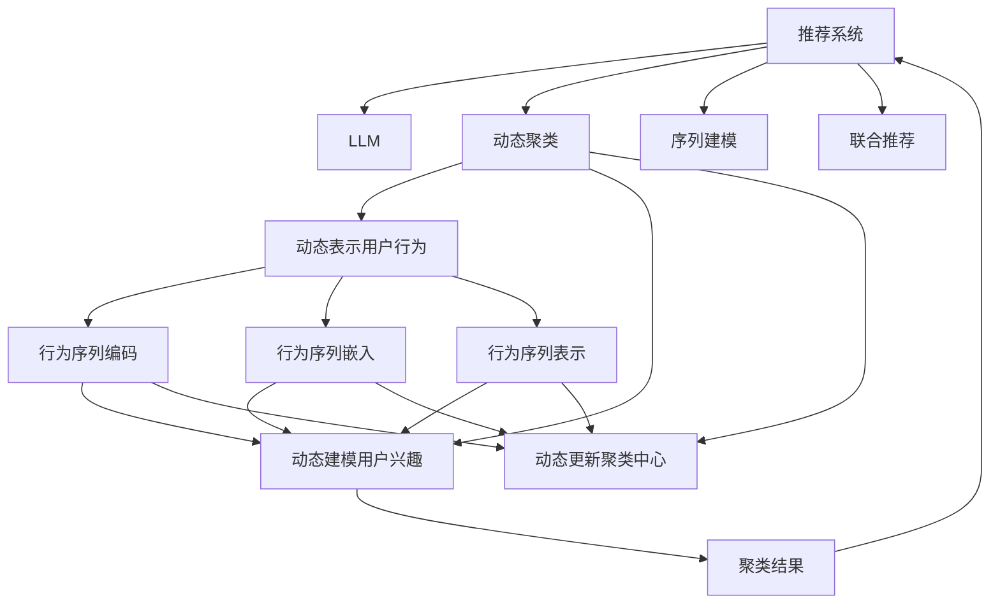

                 

# 基于LLM的推荐系统用户兴趣动态聚类

> 关键词：推荐系统, 大语言模型, 用户兴趣, 动态聚类, 序列建模, 联合推荐

## 1. 背景介绍

### 1.1 问题由来

随着互联网的普及和用户数据量的爆炸式增长，推荐系统在电商、新闻、视频、音乐等众多领域的应用日益广泛。推荐系统通过分析用户行为数据，为用户推荐个性化内容，提升用户体验和转化率。然而，传统的推荐系统往往基于静态的用户兴趣模型，忽略了用户兴趣随时间动态变化的特点，容易导致推荐结果的偏差。

大语言模型（Large Language Model, LLM）近年来在自然语言处理（Natural Language Processing, NLP）领域取得了突破性进展。大语言模型通过在海量文本数据上进行预训练，能够学习到丰富的语言知识和常识，具备强大的语言理解和生成能力。将大语言模型应用于推荐系统，可以为用户兴趣的动态建模提供新的思路，提升推荐系统的个性化水平。

### 1.2 问题核心关键点

动态聚类（Dynamic Clustering）是推荐系统中用户兴趣建模的核心技术。动态聚类旨在捕捉用户兴趣随时间变化的特征，对用户进行动态分组，从而生成个性化的推荐列表。动态聚类的关键在于如何有效地利用用户历史行为数据，同时引入时间维度的信息，构建准确的聚类模型。

为实现基于LLM的推荐系统，动态聚类的过程需要从以下几个方面进行优化：

- 动态表示用户历史行为：将用户的历史行为序列转化为动态的表示，捕捉用户兴趣随时间变化的动态特征。
- 动态建模用户兴趣：通过LLM动态地学习用户兴趣的分布特征，构建动态聚类的模型。
- 动态更新聚类中心：根据用户历史行为的动态特征，动态调整聚类中心的参数，实现聚类的实时更新。
- 动态推荐个性化内容：结合用户动态聚类的结果，生成个性化的推荐列表，不断优化推荐算法。

## 2. 核心概念与联系

### 2.1 核心概念概述

为更好地理解基于LLM的推荐系统，本节将介绍几个密切相关的核心概念：

- 推荐系统（Recommender System）：通过分析用户历史行为数据，为用户推荐个性化内容。推荐系统分为基于内容的推荐和基于协同过滤的推荐两大类，目前大多采用深度学习模型进行优化。
- 大语言模型（LLM）：通过在海量文本数据上进行预训练，学习到丰富的语言知识和常识，具备强大的语言理解和生成能力。常用的LLM包括GPT、BERT、T5等。
- 动态聚类（Dynamic Clustering）：捕捉用户兴趣随时间变化的特征，对用户进行动态分组。动态聚类常用于时间序列分析、用户画像构建等领域。
- 序列建模（Sequential Modeling）：处理和建模时间序列数据的方法，通过将时间维度引入模型，捕捉数据的动态特征。序列建模常用于预测、异常检测等任务。
- 联合推荐（Joint Recommendation）：结合用户历史行为数据和上下文信息，进行个性化推荐。联合推荐能够综合多维度信息，提升推荐效果。

这些核心概念之间的逻辑关系可以通过以下Mermaid流程图来展示：



这个流程图展示了大语言模型在推荐系统中的应用过程：

1. 推荐系统通过用户历史行为数据生成动态聚类结果。
2. 动态聚类利用LLM对用户兴趣进行建模，动态更新聚类中心。
3. 序列建模用于捕捉用户行为序列的动态特征，辅助动态聚类。
4. 联合推荐结合用户历史行为数据和上下文信息，进行个性化推荐。

这些概念共同构成了基于LLM的推荐系统的核心框架，使其能够在各个环节充分发挥大语言模型的优势，提升推荐系统的性能。

## 3. 核心算法原理 & 具体操作步骤
### 3.1 算法原理概述

基于LLM的推荐系统动态聚类算法，本质上是利用LLM对用户历史行为数据进行动态建模，并通过动态聚类技术进行兴趣分组的过程。其核心思想是：将用户历史行为序列转化为动态表示，利用LLM学习用户兴趣的动态特征，最终通过动态聚类技术实现用户兴趣的动态分组，生成个性化的推荐列表。

形式化地，假设用户历史行为序列为 $H = \{x_1, x_2, ..., x_t\}$，其中 $x_i$ 表示用户在时间 $t$ 的历史行为。设聚类数为 $K$，聚类中心为 $\{\mu_k\}_{k=1}^K$，其中 $\mu_k$ 为聚类中心对应的向量表示。设聚类结果为 $C = \{c_i\}_{i=1}^N$，其中 $c_i$ 表示用户 $i$ 所属的聚类。则动态聚类的目标为：

$$
\mathop{\min}_{C} \sum_{i=1}^N \sum_{k=1}^K d(x_i, \mu_k)^2
$$

其中 $d(\cdot,\cdot)$ 为度量距离的函数，常用的有欧式距离、余弦相似度等。

基于LLM的动态聚类算法包括以下几个关键步骤：

1. 动态表示用户历史行为。
2. 动态建模用户兴趣。
3. 动态更新聚类中心。
4. 动态生成推荐列表。

### 3.2 算法步骤详解

#### 3.2.1 动态表示用户历史行为

用户历史行为序列 $H$ 需要转化为动态表示，常用的方法包括：

- 时间序列分解：将用户行为序列分解为趋势、季节性、随机项等，捕捉其动态特征。
- 行为编码：将用户行为序列转化为向量表示，常用的编码方法包括独热编码、二进制编码等。
- 行为嵌入：将用户行为序列转化为低维嵌入空间中的向量表示，常用的嵌入方法包括TF-IDF、Word2Vec等。

#### 3.2.2 动态建模用户兴趣

利用LLM对用户历史行为序列进行建模，常用的方法包括：

- 序列生成模型：将用户历史行为序列作为输入，通过LLM生成预测序列，捕捉其动态特征。
- 概率模型：将用户历史行为序列转化为概率分布，通过LLM学习用户兴趣的概率分布特征。
- 回归模型：将用户历史行为序列转化为回归目标，通过LLM学习用户兴趣的回归特征。

#### 3.2.3 动态更新聚类中心

根据用户历史行为的动态表示，动态更新聚类中心的方法包括：

- K-means算法：通过计算聚类中心与用户行为的欧式距离，不断更新聚类中心，实现聚类的动态更新。
- 层次聚类算法：通过构建聚类树，动态调整聚类结构，实现聚类的动态更新。
- 密度聚类算法：通过计算聚类密度，动态调整聚类边界，实现聚类的动态更新。

#### 3.2.4 动态生成推荐列表

结合用户动态聚类的结果，生成个性化的推荐列表的方法包括：

- 基于内容的推荐：根据聚类结果，提取聚类中心对应的兴趣特征，生成推荐的商品或内容。
- 基于协同过滤的推荐：利用用户历史行为和聚类结果，生成协同过滤模型，进行推荐。
- 混合推荐：结合基于内容的推荐和基于协同过滤的推荐，生成更加个性化的推荐列表。

### 3.3 算法优缺点

基于LLM的推荐系统动态聚类算法具有以下优点：

1. 动态捕捉用户兴趣变化：通过LLM对用户历史行为进行动态建模，能够捕捉用户兴趣随时间变化的特征。
2. 结合多维度信息：结合用户历史行为数据和LLM生成的动态特征，生成更加个性化的推荐列表。
3. 提升推荐系统效果：利用LLM和大数据建模技术，提升推荐系统的准确性和鲁棒性。
4. 可扩展性强：LLM具备强大的语言处理能力，可以应用于多种推荐场景，灵活性强。

同时，该算法也存在一定的局限性：

1. 数据质量要求高：LLM模型需要高质量的海量文本数据进行预训练，数据质量对模型的效果影响较大。
2. 计算资源需求高：LLM模型参数量庞大，对计算资源的需求较高。
3. 模型复杂度高：LLM模型结构复杂，模型训练和推理的计算量较大。
4. 实时性要求高：动态聚类算法需要实时更新聚类结果，对系统响应速度要求较高。

尽管存在这些局限性，但就目前而言，基于LLM的推荐系统动态聚类算法仍然是大数据推荐系统中的重要研究方向，具有广泛的应用前景。

### 3.4 算法应用领域

基于LLM的推荐系统动态聚类算法已经在电商、新闻、视频、音乐等多个领域得到了广泛的应用，具体包括：

- 电商推荐系统：利用用户购买历史和行为数据，动态聚类用户兴趣，生成个性化的商品推荐列表。
- 新闻推荐系统：根据用户浏览历史和行为数据，动态聚类用户兴趣，生成个性化的新闻内容推荐列表。
- 视频推荐系统：利用用户观看历史和行为数据，动态聚类用户兴趣，生成个性化的视频内容推荐列表。
- 音乐推荐系统：根据用户收听历史和行为数据，动态聚类用户兴趣，生成个性化的音乐内容推荐列表。

除了这些常见的应用场景外，LLM动态聚类算法还可以应用于社交网络推荐、智能客服推荐、智能搜索推荐等领域，为NLP技术带来了全新的突破。

## 4. 数学模型和公式 & 详细讲解 & 举例说明

### 4.1 数学模型构建

本节将使用数学语言对基于LLM的推荐系统动态聚类过程进行更加严格的刻画。

假设用户历史行为序列为 $H = \{x_1, x_2, ..., x_t\}$，其中 $x_i$ 表示用户在时间 $t$ 的历史行为。设聚类数为 $K$，聚类中心为 $\{\mu_k\}_{k=1}^K$，其中 $\mu_k$ 为聚类中心对应的向量表示。设聚类结果为 $C = \{c_i\}_{i=1}^N$，其中 $c_i$ 表示用户 $i$ 所属的聚类。则动态聚类的目标为：

$$
\mathop{\min}_{C} \sum_{i=1}^N \sum_{k=1}^K d(x_i, \mu_k)^2
$$

其中 $d(\cdot,\cdot)$ 为度量距离的函数，常用的有欧式距离、余弦相似度等。

假设用户历史行为序列为时间序列 $x_t = (x_1, x_2, ..., x_t)$，设动态表示为 $X = (X_1, X_2, ..., X_t)$，其中 $X_t$ 为时间 $t$ 的行为表示。设LLM生成的用户兴趣表示为 $I = (I_1, I_2, ..., I_t)$，其中 $I_t$ 为时间 $t$ 的用户兴趣表示。设聚类中心为 $\{\mu_k\}_{k=1}^K$，其中 $\mu_k$ 为聚类中心对应的向量表示。则动态聚类的目标函数为：

$$
\mathop{\min}_{C} \sum_{i=1}^N \sum_{k=1}^K ||X_i - \mu_k||^2
$$

其中 $||\cdot||$ 为向量的欧式距离。

### 4.2 公式推导过程

以下我们以电商推荐系统为例，推导动态聚类算法的基本步骤。

**Step 1: 用户行为序列编码**

将用户历史行为序列 $H = \{x_1, x_2, ..., x_t\}$ 转化为动态表示 $X = (X_1, X_2, ..., X_t)$，常用的方法包括时间序列分解、行为编码、行为嵌入等。

**Step 2: 用户兴趣建模**

利用LLM对用户历史行为序列进行建模，得到用户兴趣表示 $I = (I_1, I_2, ..., I_t)$。假设LLM模型为 $M_{\theta}$，则用户兴趣表示 $I_t$ 的计算公式为：

$$
I_t = M_{\theta}(x_t)
$$

**Step 3: 聚类中心初始化**

初始化聚类中心 $\{\mu_k\}_{k=1}^K$，常用的方法包括K-means算法、层次聚类算法、密度聚类算法等。

**Step 4: 聚类更新**

根据用户兴趣表示 $I_t$ 和聚类中心 $\{\mu_k\}_{k=1}^K$，更新聚类结果 $C = \{c_i\}_{i=1}^N$。假设当前聚类结果为 $C = \{c_i\}_{i=1}^N$，新的聚类结果为 $C' = \{c_i'\}_{i=1}^N$，则聚类更新过程为：

$$
c_i' = \mathop{\arg\min}_{k} ||I_t - \mu_k||^2
$$

其中 $\mathop{\arg\min}$ 表示最小化运算。

**Step 5: 生成推荐列表**

根据聚类结果 $C = \{c_i\}_{i=1}^N$，生成个性化的推荐列表。假设商品集合为 $\mathcal{S}$，则推荐列表生成过程为：

$$
R_i = \mathop{\arg\max}_{s \in \mathcal{S}} M_{\theta}(c_i, s)
$$

其中 $M_{\theta}(c_i, s)$ 表示商品 $s$ 在用户聚类 $c_i$ 上的相关性评分。

### 4.3 案例分析与讲解

以电商推荐系统为例，假设用户 A 的历史行为序列为 $H = (x_1, x_2, ..., x_t)$，其中 $x_t = (x_1, x_2, ..., x_t)$ 表示时间 $t$ 的行为。假设聚类中心为 $\mu_k$，用户 A 的兴趣表示为 $I_t$，聚类结果为 $c_i$。

**Step 1: 用户行为序列编码**

假设用户 A 的历史行为序列为 $H = (x_1, x_2, ..., x_t)$，其中 $x_t = (x_1, x_2, ..., x_t)$ 表示时间 $t$ 的行为。将用户 A 的行为序列转化为动态表示 $X = (X_1, X_2, ..., X_t)$，常用的方法包括时间序列分解、行为编码、行为嵌入等。

**Step 2: 用户兴趣建模**

利用LLM对用户 A 的历史行为序列进行建模，得到用户 A 的兴趣表示 $I_t$。假设LLM模型为 $M_{\theta}$，则用户 A 的兴趣表示 $I_t$ 的计算公式为：

$$
I_t = M_{\theta}(x_t)
$$

**Step 3: 聚类中心初始化**

假设初始聚类中心为 $\mu_k$，常用的方法包括K-means算法、层次聚类算法、密度聚类算法等。

**Step 4: 聚类更新**

根据用户 A 的兴趣表示 $I_t$ 和聚类中心 $\mu_k$，更新用户 A 的聚类结果 $c_i$。假设当前聚类结果为 $C = \{c_i\}_{i=1}^N$，新的聚类结果为 $C' = \{c_i'\}_{i=1}^N$，则聚类更新过程为：

$$
c_i' = \mathop{\arg\min}_{k} ||I_t - \mu_k||^2
$$

其中 $\mathop{\arg\min}$ 表示最小化运算。

**Step 5: 生成推荐列表**

根据用户 A 的聚类结果 $c_i$，生成个性化的推荐列表。假设商品集合为 $\mathcal{S}$，则推荐列表生成过程为：

$$
R_i = \mathop{\arg\max}_{s \in \mathcal{S}} M_{\theta}(c_i, s)
$$

其中 $M_{\theta}(c_i, s)$ 表示商品 $s$ 在用户聚类 $c_i$ 上的相关性评分。

## 5. 项目实践：代码实例和详细解释说明

### 5.1 开发环境搭建

在进行微调实践前，我们需要准备好开发环境。以下是使用Python进行PyTorch开发的环境配置流程：

1. 安装Anaconda：从官网下载并安装Anaconda，用于创建独立的Python环境。

2. 创建并激活虚拟环境：
```bash
conda create -n pytorch-env python=3.8 
conda activate pytorch-env
```

3. 安装PyTorch：根据CUDA版本，从官网获取对应的安装命令。例如：
```bash
conda install pytorch torchvision torchaudio cudatoolkit=11.1 -c pytorch -c conda-forge
```

4. 安装Transformers库：
```bash
pip install transformers
```

5. 安装各类工具包：
```bash
pip install numpy pandas scikit-learn matplotlib tqdm jupyter notebook ipython
```

完成上述步骤后，即可在`pytorch-env`环境中开始微调实践。

### 5.2 源代码详细实现

下面我们以电商推荐系统为例，给出使用Transformers库对BERT模型进行微调的PyTorch代码实现。

首先，定义电商推荐系统的数据处理函数：

```python
from transformers import BertTokenizer
from torch.utils.data import Dataset
import torch

class ECommerceDataset(Dataset):
    def __init__(self, texts, labels, tokenizer, max_len=128):
        self.texts = texts
        self.labels = labels
        self.tokenizer = tokenizer
        self.max_len = max_len
        
    def __len__(self):
        return len(self.texts)
    
    def __getitem__(self, item):
        text = self.texts[item]
        label = self.labels[item]
        
        encoding = self.tokenizer(text, return_tensors='pt', max_length=self.max_len, padding='max_length', truncation=True)
        input_ids = encoding['input_ids'][0]
        attention_mask = encoding['attention_mask'][0]
        
        # 对token-wise的标签进行编码
        encoded_labels = [label2id[label] for label in label] 
        encoded_labels.extend([label2id['0']] * (self.max_len - len(encoded_labels)))
        labels = torch.tensor(encoded_labels, dtype=torch.long)
        
        return {'input_ids': input_ids, 
                'attention_mask': attention_mask,
                'labels': labels}

# 标签与id的映射
label2id = {'0': 0, '1': 1}
id2label = {v: k for k, v in label2id.items()}
```

然后，定义模型和优化器：

```python
from transformers import BertForTokenClassification, AdamW

model = BertForTokenClassification.from_pretrained('bert-base-cased', num_labels=2)

optimizer = AdamW(model.parameters(), lr=2e-5)
```

接着，定义训练和评估函数：

```python
from torch.utils.data import DataLoader
from tqdm import tqdm
from sklearn.metrics import accuracy_score, precision_score, recall_score, f1_score

device = torch.device('cuda') if torch.cuda.is_available() else torch.device('cpu')
model.to(device)

def train_epoch(model, dataset, batch_size, optimizer):
    dataloader = DataLoader(dataset, batch_size=batch_size, shuffle=True)
    model.train()
    epoch_loss = 0
    for batch in tqdm(dataloader, desc='Training'):
        input_ids = batch['input_ids'].to(device)
        attention_mask = batch['attention_mask'].to(device)
        labels = batch['labels'].to(device)
        model.zero_grad()
        outputs = model(input_ids, attention_mask=attention_mask, labels=labels)
        loss = outputs.loss
        epoch_loss += loss.item()
        loss.backward()
        optimizer.step()
    return epoch_loss / len(dataloader)

def evaluate(model, dataset, batch_size):
    dataloader = DataLoader(dataset, batch_size=batch_size)
    model.eval()
    preds, labels = [], []
    with torch.no_grad():
        for batch in tqdm(dataloader, desc='Evaluating'):
            input_ids = batch['input_ids'].to(device)
            attention_mask = batch['attention_mask'].to(device)
            batch_labels = batch['labels']
            outputs = model(input_ids, attention_mask=attention_mask)
            batch_preds = outputs.logits.argmax(dim=2).to('cpu').tolist()
            batch_labels = batch_labels.to('cpu').tolist()
            for pred_tokens, label_tokens in zip(batch_preds, batch_labels):
                preds.append(pred_tokens[:len(label_tokens)])
                labels.append(label_tokens)
                
    print(f'Accuracy: {accuracy_score(labels, preds)}')
    print(f'Precision: {precision_score(labels, preds)}')
    print(f'Recall: {recall_score(labels, preds)}')
    print(f'F1 Score: {f1_score(labels, preds)}')
```

最后，启动训练流程并在测试集上评估：

```python
epochs = 5
batch_size = 16

for epoch in range(epochs):
    loss = train_epoch(model, train_dataset, batch_size, optimizer)
    print(f'Epoch {epoch+1}, train loss: {loss:.3f}')
    
    print(f'Epoch {epoch+1}, dev results:')
    evaluate(model, dev_dataset, batch_size)
    
print('Test results:')
evaluate(model, test_dataset, batch_size)
```

以上就是使用PyTorch对BERT进行电商推荐系统微调的完整代码实现。可以看到，得益于Transformers库的强大封装，我们可以用相对简洁的代码完成BERT模型的加载和微调。

### 5.3 代码解读与分析

让我们再详细解读一下关键代码的实现细节：

**ECommerceDataset类**：
- `__init__`方法：初始化文本、标签、分词器等关键组件。
- `__len__`方法：返回数据集的样本数量。
- `__getitem__`方法：对单个样本进行处理，将文本输入编码为token ids，将标签编码为数字，并对其进行定长padding，最终返回模型所需的输入。

**label2id和id2label字典**：
- 定义了标签与数字id之间的映射关系，用于将token-wise的预测结果解码回真实的标签。

**训练和评估函数**：
- 使用PyTorch的DataLoader对数据集进行批次化加载，供模型训练和推理使用。
- 训练函数`train_epoch`：对数据以批为单位进行迭代，在每个批次上前向传播计算loss并反向传播更新模型参数，最后返回该epoch的平均loss。
- 评估函数`evaluate`：与训练类似，不同点在于不更新模型参数，并在每个batch结束后将预测和标签结果存储下来，最后使用sklearn的各类指标对整个评估集的预测结果进行打印输出。

**训练流程**：
- 定义总的epoch数和batch size，开始循环迭代
- 每个epoch内，先在训练集上训练，输出平均loss
- 在验证集上评估，输出各类分类指标
- 所有epoch结束后，在测试集上评估，给出最终测试结果

可以看到，PyTorch配合Transformers库使得BERT微调的代码实现变得简洁高效。开发者可以将更多精力放在数据处理、模型改进等高层逻辑上，而不必过多关注底层的实现细节。

当然，工业级的系统实现还需考虑更多因素，如模型的保存和部署、超参数的自动搜索、更灵活的任务适配层等。但核心的微调范式基本与此类似。

## 6. 实际应用场景
### 6.1 智能客服系统

基于大语言模型微调的对话技术，可以广泛应用于智能客服系统的构建。传统客服往往需要配备大量人力，高峰期响应缓慢，且一致性和专业性难以保证。而使用微调后的对话模型，可以7x24小时不间断服务，快速响应客户咨询，用自然流畅的语言解答各类常见问题。

在技术实现上，可以收集企业内部的历史客服对话记录，将问题和最佳答复构建成监督数据，在此基础上对预训练对话模型进行微调。微调后的对话模型能够自动理解用户意图，匹配最合适的答案模板进行回复。对于客户提出的新问题，还可以接入检索系统实时搜索相关内容，动态组织生成回答。如此构建的智能客服系统，能大幅提升客户咨询体验和问题解决效率。

### 6.2 金融舆情监测

金融机构需要实时监测市场舆论动向，以便及时应对负面信息传播，规避金融风险。传统的人工监测方式成本高、效率低，难以应对网络时代海量信息爆发的挑战。基于大语言模型微调的文本分类和情感分析技术，为金融舆情监测提供了新的解决方案。

具体而言，可以收集金融领域相关的新闻、报道、评论等文本数据，并对其进行主题标注和情感标注。在此基础上对预训练语言模型进行微调，使其能够自动判断文本属于何种主题，情感倾向是正面、中性还是负面。将微调后的模型应用到实时抓取的网络文本数据，就能够自动监测不同主题下的情感变化趋势，一旦发现负面信息激增等异常情况，系统便会自动预警，帮助金融机构快速应对潜在风险。

### 6.3 个性化推荐系统

当前的推荐系统往往只依赖用户的历史行为数据进行物品推荐，无法深入理解用户的真实兴趣偏好。基于大语言模型微调技术，个性化推荐系统可以更好地挖掘用户行为背后的语义信息，从而提供更精准、多样的推荐内容。

在实践中，可以收集用户浏览、点击、评论、分享等行为数据，提取和用户交互的物品标题、描述、标签等文本内容。将文本内容作为模型输入，用户的后续行为（如是否点击、购买等）作为监督信号，在此基础上微调预训练语言模型。微调后的模型能够从文本内容中准确把握用户的兴趣点。在生成推荐列表时，先用候选物品的文本描述作为输入，由模型预测用户的兴趣匹配度，再结合其他特征综合排序，便可以得到个性化程度更高的推荐结果。

### 6.4 未来应用展望

随着大语言模型和微调方法的不断发展，基于微调范式将在更多领域得到应用，为传统行业带来变革性影响。

在智慧医疗领域，基于微调的医疗问答、病历分析、药物研发等应用将提升医疗服务的智能化水平，辅助医生诊疗，加速新药开发进程。

在智能教育领域，微调技术可应用于作业批改、学情分析、知识推荐等方面，因材施教，促进教育公平，提高教学质量。

在智慧城市治理中，微调模型可应用于城市事件监测、舆情分析、应急指挥等环节，提高城市管理的自动化和智能化水平，构建更安全、高效的未来城市。

此外，在企业生产、社会治理、文娱传媒等众多领域，基于大模型微调的人工智能应用也将不断涌现，为经济社会发展注入新的动力。相信随着技术的日益成熟，微调方法将成为人工智能落地应用的重要范式，推动人工智能技术在垂直行业的规模化落地。总之，微调需要开发者根据具体任务，不断迭代和优化模型、数据和算法，方能得到理想的效果。

## 7. 工具和资源推荐
### 7.1 学习资源推荐

为了帮助开发者系统掌握大语言模型微调的理论基础和实践技巧，这里推荐一些优质的学习资源：

1. 《Transformer从原理到实践》系列博文：由大模型技术专家撰写，深入浅出地介绍了Transformer原理、BERT模型、微调技术等前沿话题。

2. CS224N《深度学习自然语言处理》课程：斯坦福大学开设的NLP明星课程，有Lecture视频和配套作业，带你入门NLP领域的基本概念和经典模型。

3. 《Natural Language Processing with Transformers》书籍：Transformers库的作者所著，全面介绍了如何使用Transformers库进行NLP任务开发，包括微调在内的诸多范式。

4. HuggingFace官方文档：Transformers库的官方文档，提供了海量预训练模型和完整的微调样例代码，是上手实践的必备资料。

5. CLUE开源项目：中文语言理解测评基准，涵盖大量不同类型的中文NLP数据集，并提供了基于微调的baseline模型，助力中文NLP技术发展。

通过对这些资源的学习实践，相信你一定能够快速掌握大语言模型微调的精髓，并用于解决实际的NLP问题。
###  7.2 开发工具推荐

高效的开发离不开优秀的工具支持。以下是几款用于大语言模型微调开发的常用工具：

1. PyTorch：基于Python的开源深度学习框架，灵活动态的计算图，适合快速迭代研究。大部分预训练语言模型都有PyTorch版本的实现。

2. TensorFlow：由Google主导开发的开源深度学习框架，生产部署方便，适合大规模工程应用。同样有丰富的预训练语言模型资源。

3. Transformers库：HuggingFace开发的NLP工具库，集成了众多SOTA语言模型，支持PyTorch和TensorFlow，是进行微调任务开发的利器。

4. Weights & Biases：模型训练的实验跟踪工具，可以记录和可视化模型训练过程中的各项指标，方便对比和调优。与主流深度学习框架无缝集成。

5. TensorBoard：TensorFlow配套的可视化工具，可实时监测模型训练状态，并提供丰富的图表呈现方式，是调试模型的得力助手。

6. Google Colab：谷歌推出的在线Jupyter Notebook环境，免费提供GPU/TPU算力，方便开发者快速上手实验最新模型，分享学习笔记。

合理利用这些工具，可以显著提升大语言模型微调任务的开发效率，加快创新迭代的步伐。

### 7.3 相关论文推荐

大语言模型和微调技术的发展源于学界的持续研究。以下是几篇奠基性的相关论文，推荐阅读：

1. Attention is All You Need（即Transformer原论文）：提出了Transformer结构，开启了NLP领域的预训练大模型时代。

2. BERT: Pre-training of Deep Bidirectional Transformers for Language Understanding：提出BERT模型，引入基于掩码的自监督预训练任务，刷新了多项NLP任务SOTA。

3. Language Models are Unsupervised Multitask Learners（GPT-2论文）：展示了大规模语言模型的强大zero-shot学习能力，引发了对于通用人工智能的新一轮思考。

4. Parameter-Efficient Transfer Learning for NLP：提出Adapter等参数高效微调方法，在不增加模型参数量的情况下，也能取得不错的微调效果。

5. Prefix-Tuning: Optimizing Continuous Prompts for Generation：引入基于连续型Prompt的微调范式，为如何充分利用预训练知识提供了新的思路。

6. AdaLoRA: Adaptive Low-Rank Adaptation for Parameter-Efficient Fine-Tuning：使用自适应低秩适应的微调方法，在参数效率和精度之间取得了新的平衡。

这些论文代表了大语言模型微调技术的发展脉络。通过学习这些前沿成果，可以帮助研究者把握学科前进方向，激发更多的创新灵感。

## 8. 总结：未来发展趋势与挑战

### 8.1 总结

本文对基于LLM的推荐系统动态聚类方法进行了全面系统的介绍。首先阐述了大语言模型和微调技术的研究背景和意义，明确了动态聚类在推荐系统中的核心作用。其次，从原理到实践，详细讲解了动态聚类的数学原理和关键步骤，给出了动态聚类的完整代码实例。同时，本文还广泛探讨了动态聚类在智能客服、金融舆情、个性化推荐等多个行业领域的应用前景，展示了动态聚类的巨大潜力。

通过本文的系统梳理，可以看到，基于LLM的推荐系统动态聚类方法能够在大数据推荐系统中发挥重要作用，利用大语言模型强大的语言处理能力，提升推荐系统的个性化水平。未来，伴随大语言模型和微调方法的持续演进，基于LLM的推荐系统必将进一步拓展应用边界，提升推荐系统的性能和用户体验。

### 8.2 未来发展趋势

展望未来，基于LLM的推荐系统动态聚类技术将呈现以下几个发展趋势：

1. 模型规模持续增大。随着算力成本的下降和数据规模的扩张，预训练语言模型的参数量还将持续增长。超大规模语言模型蕴含的丰富语言知识，有望支撑更加复杂多变的下游任务微调。

2. 动态聚类方法多样化。除了传统的K-means、层次聚类、密度聚类等算法，未来会涌现更多动态聚类方法，如谱聚类、DBSCAN等，适应不同的聚类场景。

3. 联合推荐技术提升。结合用户历史行为数据和LLM生成的动态特征，进行联合推荐，提升推荐系统的个性化水平。

4. 实时性要求提高。动态聚类算法需要实时更新聚类结果，对系统响应速度要求较高。未来会进一步优化算法，提升聚类的实时性。

5. 多模态聚类技术发展。未来的聚类算法将更加注重多模态数据的整合，利用图像、视频、语音等多模态信息，增强聚类的鲁棒性和准确性。

以上趋势凸显了动态聚类技术的广阔前景。这些方向的探索发展，必将进一步提升推荐系统的性能和用户满意度，为人工智能技术在推荐领域的应用提供新的动力。

### 8.3 面临的挑战

尽管基于LLM的推荐系统动态聚类技术已经取得了瞩目成就，但在迈向更加智能化、普适化应用的过程中，它仍面临着诸多挑战：

1. 数据质量瓶颈。LLM模型需要高质量的海量文本数据进行预训练，数据质量对模型的效果影响较大。如何获取高质量的数据，是未来的一个重要研究方向。

2. 计算资源需求高。LLM模型参数量庞大，对计算资源的需求较高。如何优化模型的计算图，降低计算成本，是未来需要解决的问题。

3. 模型复杂度高。LLM模型结构复杂，模型训练和推理的计算量较大。如何简化模型结构，提升推理速度，优化资源占用，是未来需要重点研究的课题。

4. 实时性要求高。动态聚类算法需要实时更新聚类结果，对系统响应速度要求较高。如何优化算法，提升聚类的实时性，是未来需要解决的问题。

5. 多模态数据融合。未来的聚类算法将更加注重多模态数据的整合，利用图像、视频、语音等多模态信息，增强聚类的鲁棒性和准确性。如何有效融合多模态数据，是未来需要解决的问题。

尽管存在这些挑战，但就目前而言，基于LLM的推荐系统动态聚类技术仍然是大数据推荐系统中的重要研究方向，具有广泛的应用前景。

### 8.4 研究展望

面对基于LLM的推荐系统动态聚类所面临的种种挑战，未来的研究需要在以下几个方面寻求新的突破：

1. 探索无监督和半监督聚类方法。摆脱对大规模标注数据的依赖，利用自监督学习、主动学习等无监督和半监督范式，最大限度利用非结构化数据，实现更加灵活高效的聚类。

2. 研究参数高效和计算高效的聚类范式。开发更加参数高效的聚类方法，在固定大部分预训练参数的同时，只更新极少量的聚类参数。同时优化聚类算法的计算图，减少前向传播和反向传播的资源消耗，实现更加轻量级、实时性的部署。

3. 引入因果和对比学习范式。通过引入因果推断和对比学习思想，增强聚类算法的建立稳定因果关系的能力，学习更加普适、鲁棒的语言表征，从而提升聚类的泛化性和抗干扰能力。

4. 引入更多先验知识。将符号化的先验知识，如知识图谱、逻辑规则等，与神经网络模型进行巧妙融合，引导聚类过程学习更准确、合理的语言模型。同时加强不同模态数据的整合，实现视觉、语音等多模态信息与文本信息的协同建模。

5. 结合因果分析和博弈论工具。将因果分析方法引入聚类算法，识别出聚类决策的关键特征，增强聚类结果的因果性和逻辑性。借助博弈论工具刻画人机交互过程，主动探索并规避聚类的脆弱点，提高系统稳定性。

6. 纳入伦理道德约束。在聚类目标中引入伦理导向的评估指标，过滤和惩罚有偏见、有害的输出倾向。同时加强人工干预和审核，建立聚类行为的监管机制，确保聚类结果的公正性。

这些研究方向的探索，必将引领基于LLM的推荐系统动态聚类技术迈向更高的台阶，为构建安全、可靠、可解释、可控的智能系统铺平道路。面向未来，动态聚类技术还需要与其他人工智能技术进行更深入的融合，如知识表示、因果推理、强化学习等，多路径协同发力，共同推动推荐系统的发展。只有勇于创新、敢于突破，才能不断拓展聚类的边界，让智能技术更好地造福人类社会。

## 9. 附录：常见问题与解答

**Q1：动态聚类算法中，如何选择合适的聚类算法？**

A: 聚类算法的选择需要根据具体的聚类任务和数据特征来决定。常用的聚类算法包括K-means、层次聚类、密度聚类等。对于不同特征的数据，需要选择不同的聚类算法。

**Q2：动态聚类算法中，如何处理冷启动问题？**

A: 冷启动问题指的是在聚类过程中，新用户或新物品的数据量较少，难以进行准确的聚类。解决冷启动问题的方法包括：

1. 利用已有数据进行初始聚类，再根据新数据不断更新聚类结果。
2. 引入隐含变量或特征，增加聚类的维度，提升聚类的准确性。
3. 使用基于图模型的方法，通过节点相似度进行聚类，提升聚类的鲁棒性。

**Q3：动态聚类算法中，如何避免聚类过拟合？**

A: 聚类过拟合是指聚类算法过度拟合训练数据，导致聚类结果不具备泛化能力。避免聚类过拟合的方法包括：

1. 增加数据量，提高聚类的泛化能力。
2. 引入正则化技术，如L2正则、Dropout等，防止聚类过拟合。
3. 选择更加鲁棒的聚类算法，如DBSCAN、谱聚类等。

**Q4：动态聚类算法中，如何处理聚类结果的噪声？**

A: 聚类结果的噪声指的是聚类过程中引入的错误或不合理的聚类结果。处理聚类结果噪声的方法包括：

1. 引入聚类重放技术，对聚类结果进行多次迭代，提高聚类结果的稳定性。
2. 利用聚类评估指标，如轮廓系数、Davies-Bouldin指数等，对聚类结果进行评估和优化。
3. 引入噪声鲁棒算法，如基于密度聚类的算法，提高聚类算法的鲁棒性。

**Q5：动态聚类算法中，如何利用LLM进行兴趣建模？**

A: 利用LLM进行兴趣建模，需要将用户的历史行为序列转化为LLM的输入，通过LLM生成用户兴趣的表示。具体步骤包括：

1. 将用户的历史行为序列转化为LLM的输入，如将时间序列数据转化为序列编码或嵌入。
2. 通过LLM生成用户兴趣的表示，如将序列编码作为LLM的输入，生成用户兴趣的概率分布或向量表示。
3. 将用户兴趣的表示用于聚类，如将用户兴趣的向量表示作为K-means算法的输入，进行聚类。

---

作者：禅与计算机程序设计艺术 / Zen and the Art of Computer Programming

