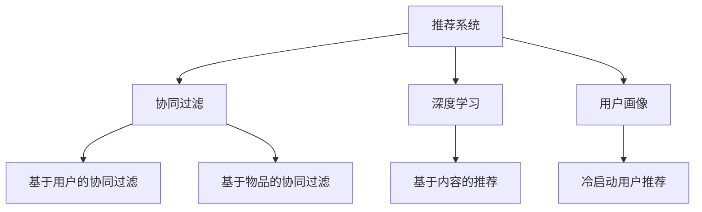

                 

# 基于LLM的推荐系统用户兴趣探索

> 关键词：推荐系统,LLM,用户兴趣,协同过滤,深度学习

## 1. 背景介绍

推荐系统是互联网时代重要的应用之一，旨在帮助用户发现感兴趣的新内容，从而提升用户体验。传统的推荐方法如基于协同过滤的模型，在处理高维稀疏数据上表现优异，但忽略了用户行为背后的隐含语义信息。近年来，基于深度学习的推荐方法逐渐流行起来，特别是在用户画像建模、冷启动用户推荐等方面表现出色。

深度学习推荐系统主要分为两大类：基于内容的推荐和协同过滤推荐。前者主要通过用户历史行为和物品属性进行匹配，后者则侧重于用户之间的隐含相似性。但是，传统方法在处理长尾数据、新物品推荐等问题时存在局限。

随着自然语言处理技术的快速发展，基于大语言模型(LLM)的推荐系统逐渐兴起，有望解决上述问题。LLM通过预训练，具备了强大的语言理解和生成能力，可以更加深入地理解用户行为，提取其中的语义信息，在协同过滤和基于内容的推荐中，表现出更强的性能。

## 2. 核心概念与联系

### 2.1 核心概念概述

为更好地理解基于LLM的推荐系统，本节将介绍几个核心概念：

- 推荐系统(Recommendation System)：利用用户和物品的关联信息，帮助用户发现感兴趣物品的系统。推荐系统按业务场景和推荐方式，可细分为协同过滤、基于内容的推荐、混合推荐等。

- 大语言模型(Large Language Model, LLM)：以自回归(如GPT)或自编码(如BERT)模型为代表的预训练语言模型。通过在大规模无标签文本语料上进行预训练，学习到语言的通用表示，具备强大的语言理解和生成能力。

- 协同过滤(Collaborative Filtering)：基于用户之间的隐含相似性进行推荐，分为基于用户的协同过滤和基于物品的协同过滤。

- 深度学习(Deep Learning)：一类模拟人脑神经网络的算法，通过多层非线性变换提取数据特征，广泛应用于计算机视觉、自然语言处理等领域。

- 用户画像(User Profile)：反映用户兴趣、行为、属性等信息的抽象描述，用于指导推荐系统推荐。

- 冷启动用户推荐(Cold-Start User Recommendation)：对于新用户，由于缺少历史行为数据，无法使用基于协同过滤等传统方法进行推荐，需要基于其他信息源，如标签、图片等，辅助推荐。

这些核心概念之间的逻辑关系可以通过以下Mermaid流程图来展示：



这个流程图展示了大语言模型推荐系统的主要组件及其之间的关系：

1. 推荐系统通过协同过滤、深度学习和用户画像等组件，构建推荐逻辑。
2. 深度学习推荐系统通常采用基于内容的推荐方式，可以利用大语言模型提取用户和物品的语义信息。
3. 协同过滤通过大语言模型构建用户和物品间的隐含关系，进行个性化推荐。
4. 用户画像通过深度学习模型生成，以更全面地反映用户兴趣。
5. 冷启动用户推荐通过大语言模型提取用户的标签、兴趣等信息，进行推荐。

## 3. 核心算法原理 & 具体操作步骤

### 3.1 算法原理概述

基于大语言模型的推荐系统，其核心思想是：通过预训练语言模型，构建用户和物品间的隐含语义关系，进行深度特征提取和匹配。

形式化地，假设用户序列表示为 $\mathbf{u}=(u_1,u_2,\dots,u_n)$，物品序列表示为 $\mathbf{v}=(v_1,v_2,\dots,v_m)$，其中 $u_i \in \mathcal{U}$，$v_j \in \mathcal{V}$。用户对物品的评分表示为 $r_{ij}$。

推荐系统的目标是最小化预测评分与真实评分之间的差距，即：

$$
\min_{\theta} \mathcal{L}(M_{\theta},\mathbf{u},\mathbf{v},r)
$$

其中 $\theta$ 为模型的参数，$M_{\theta}$ 为基于大语言模型的推荐模型。损失函数 $\mathcal{L}$ 可采用均方误差、交叉熵等形式，具体视任务而定。

### 3.2 算法步骤详解

基于大语言模型的推荐系统主要包括以下几个关键步骤：

**Step 1: 构建用户物品表示**

- 用户序列表示：通过深度学习模型将用户的历史行为序列 $\mathbf{u}$ 转化为密集向量表示 $\mathbf{u}'=(u_1',u_2',\dots,u_n')$，其中 $u_i'$ 维数为 $d_u$。
- 物品序列表示：同样通过深度学习模型将物品的历史行为序列 $\mathbf{v}$ 转化为密集向量表示 $\mathbf{v}'=(v_1',v_2',\dots,v_m')$，其中 $v_j'$ 维数为 $d_v$。

**Step 2: 语义特征提取**

- 利用大语言模型，分别对用户和物品的向量表示进行语义特征提取，得到语义表示 $\mathbf{u}_s \in \mathbb{R}^{d_s}$，$\mathbf{v}_s \in \mathbb{R}^{d_s}$。$d_s$ 为语义向量的维度。
- 语义特征提取通常通过在大语言模型的顶层添加分类器或解码器，使用负对数似然损失函数进行训练，从而获得用户和物品的语义表示。

**Step 3: 构建用户物品隐含关系**

- 通过大语言模型预测用户和物品的隐含关系 $h_{ij} \in [0,1]$，表示用户 $u_i$ 是否喜欢物品 $v_j$。$h_{ij}$ 的值通常使用sigmoid函数输出。
- 根据隐含关系 $h_{ij}$ 计算推荐评分 $r_{ij}$。通常 $r_{ij}=h_{ij} \times \max(0,g_{ij})$，其中 $g_{ij}$ 为物品的固有评分。

**Step 4: 推荐系统优化**

- 通过优化损失函数 $\mathcal{L}$，最小化预测评分与真实评分之间的差距。通常使用梯度下降算法进行优化。
- 在训练过程中，使用早期停止策略避免过拟合，确保模型泛化能力。

**Step 5: 推荐结果输出**

- 对于新用户，通过用户画像中的语义表示和物品的语义表示计算隐含关系，进而生成推荐结果。
- 对于新物品，同样通过大语言模型提取其语义特征，结合用户和物品的语义表示进行推荐。

以上是基于大语言模型的推荐系统的一般流程。在实际应用中，还需要根据具体任务的特点，对上述步骤进行优化和调整。

### 3.3 算法优缺点

基于大语言模型的推荐系统具有以下优点：

- 语义理解深入：利用大语言模型的语义理解能力，能深入挖掘用户和物品的语义信息，提高推荐的准确性。
- 泛化能力强：预训练语言模型具备强大的泛化能力，可以适应不同领域和场景下的推荐任务。
- 解释性强：大语言模型能够输出推荐理由，解释推荐结果的来源，增加用户的信任度。

但同时，该方法也存在一定的局限性：

- 计算复杂度高：大语言模型的语义特征提取和隐含关系计算较为复杂，计算量较大。
- 训练数据需求高：大语言模型需要大量的标注数据进行预训练和微调，训练成本较高。
- 效果不稳定：模型的效果依赖于语言模型的预训练质量和数据质量，如果预训练数据质量不高，模型的效果可能不理想。

尽管存在这些局限性，但就目前而言，基于大语言模型的推荐方法仍具有显著的潜力，适用于处理长尾数据和新物品推荐等复杂场景。未来相关研究将进一步降低模型计算复杂度，提高训练效率，提升推荐系统的效果和性能。

### 3.4 算法应用领域

基于大语言模型的推荐系统在多个领域得到了广泛的应用，例如：

- 电商推荐：利用用户历史行为和物品语义信息，推荐用户感兴趣的商品。
- 新闻推荐：根据用户历史阅读行为和新闻文章的语义信息，推荐相关新闻。
- 音乐推荐：根据用户音乐收藏和听单记录，推荐用户可能喜欢的音乐。
- 视频推荐：结合用户观看历史和视频内容语义信息，推荐相关视频。
- 广告推荐：通过分析用户行为和广告内容，推荐合适的广告投放。

除了这些经典应用外，大语言模型推荐系统还被创新性地应用于更多场景中，如个性化新闻订阅、个性化旅游推荐、个性化视频直播等，为用户的个性化体验提供了新的可能性。

## 4. 数学模型和公式 & 详细讲解  
### 4.1 数学模型构建

本节将使用数学语言对基于大语言模型的推荐系统进行更加严格的刻画。

记用户序列表示为 $\mathbf{u}=(u_1,u_2,\dots,u_n)$，物品序列表示为 $\mathbf{v}=(v_1,v_2,\dots,v_m)$，其中 $u_i \in \mathcal{U}$，$v_j \in \mathcal{V}$。用户对物品的评分表示为 $r_{ij}$。

用户序列 $\mathbf{u}$ 转化为密集向量表示 $\mathbf{u}'=(u_1',u_2',\dots,u_n')$，其中 $u_i'$ 维数为 $d_u$。

物品序列 $\mathbf{v}$ 转化为密集向量表示 $\mathbf{v}'=(v_1',v_2',\dots,v_m')$，其中 $v_j'$ 维数为 $d_v$。

语义表示 $\mathbf{u}_s \in \mathbb{R}^{d_s}$，$\mathbf{v}_s \in \mathbb{R}^{d_s}$。$d_s$ 为语义向量的维度。

隐含关系 $h_{ij} \in [0,1]$，表示用户 $u_i$ 是否喜欢物品 $v_j$。

推荐评分 $r_{ij}=h_{ij} \times \max(0,g_{ij})$，其中 $g_{ij}$ 为物品的固有评分。

### 4.2 公式推导过程

以下我们以电商推荐为例，推导基于大语言模型的推荐评分公式及其梯度计算过程。

假设用户序列为 $\mathbf{u}=(u_1,u_2,\dots,u_n)$，物品序列为 $\mathbf{v}=(v_1,v_2,\dots,v_m)$，其中 $u_i \in \mathcal{U}$，$v_j \in \mathcal{V}$。用户对物品的评分表示为 $r_{ij}$。

用户序列转化为密集向量表示 $\mathbf{u}'=(u_1',u_2',\dots,u_n')$，物品序列转化为密集向量表示 $\mathbf{v}'=(v_1',v_2',\dots,v_m')$，其中 $u_i'$ 维数为 $d_u$，$v_j'$ 维数为 $d_v$。

语义表示 $\mathbf{u}_s \in \mathbb{R}^{d_s}$，$\mathbf{v}_s \in \mathbb{R}^{d_s}$。$d_s$ 为语义向量的维度。

隐含关系 $h_{ij} \in [0,1]$，表示用户 $u_i$ 是否喜欢物品 $v_j$。

推荐评分 $r_{ij}=h_{ij} \times \max(0,g_{ij})$，其中 $g_{ij}$ 为物品的固有评分。

根据上述定义，构建推荐系统的损失函数：

$$
\mathcal{L} = \frac{1}{N}\sum_{i=1}^N \sum_{j=1}^M (r_{ij} - M_{\theta}(\mathbf{u}_s,\mathbf{v}_s))^2
$$

其中 $M_{\theta}$ 为基于大语言模型的推荐模型，$(\mathbf{u}_s,\mathbf{v}_s)$ 为输入，$r_{ij}$ 为真实评分，$\theta$ 为模型参数。

利用梯度下降算法对损失函数求导，计算模型参数的更新公式：

$$
\theta \leftarrow \theta - \eta \nabla_{\theta}\mathcal{L}
$$

其中 $\eta$ 为学习率，$\nabla_{\theta}\mathcal{L}$ 为损失函数对模型参数的梯度，可通过反向传播算法高效计算。

在得到梯度后，即可带入参数更新公式，完成模型的迭代优化。重复上述过程直至收敛，最终得到适应下游任务的最优模型参数 $\theta^*$。

## 5. 项目实践：代码实例和详细解释说明
### 5.1 开发环境搭建

在进行推荐系统开发前，我们需要准备好开发环境。以下是使用Python进行PyTorch开发的环境配置流程：

1. 安装Anaconda：从官网下载并安装Anaconda，用于创建独立的Python环境。

2. 创建并激活虚拟环境：
```bash
conda create -n pytorch-env python=3.8 
conda activate pytorch-env
```

3. 安装PyTorch：根据CUDA版本，从官网获取对应的安装命令。例如：
```bash
conda install pytorch torchvision torchaudio cudatoolkit=11.1 -c pytorch -c conda-forge
```

4. 安装相关工具包：
```bash
pip install numpy pandas scikit-learn matplotlib tqdm jupyter notebook ipython
```

完成上述步骤后，即可在`pytorch-env`环境中开始推荐系统开发。

### 5.2 源代码详细实现

下面我们以电商推荐为例，给出使用PyTorch和Bert模型进行推荐系统微调的PyTorch代码实现。

首先，定义电商数据处理函数：

```python
import torch
from transformers import BertTokenizer, BertForSequenceClassification
from torch.utils.data import TensorDataset, DataLoader, RandomSampler, SequentialSampler

# 定义tokenizer
tokenizer = BertTokenizer.from_pretrained('bert-base-cased')

# 定义数据处理函数
def get_datasets(train_file, eval_file, label_map_file):
    train_dataset = BertDataset(train_file, tokenizer, label_map_file)
    eval_dataset = BertDataset(eval_file, tokenizer, label_map_file)

    train_sampler = RandomSampler(train_dataset)
    train_dataloader = DataLoader(train_dataset, sampler=train_sampler, batch_size=32)

    eval_sampler = SequentialSampler(eval_dataset)
    eval_dataloader = DataLoader(eval_dataset, sampler=eval_sampler, batch_size=32)

    return train_dataloader, eval_dataloader
```

然后，定义模型和优化器：

```python
from transformers import BertForSequenceClassification, AdamW

# 定义模型
model = BertForSequenceClassification.from_pretrained('bert-base-cased', num_labels=2)

# 定义优化器
optimizer = AdamW(model.parameters(), lr=2e-5)
```

接着，定义训练和评估函数：

```python
from tqdm import tqdm
import pandas as pd

# 训练函数
def train(model, train_dataloader, optimizer):
    model.train()
    total_loss = 0
    for batch in tqdm(train_dataloader):
        inputs = batch['input_ids']
        attention_mask = batch['attention_mask']
        labels = batch['labels']

        model.zero_grad()
        outputs = model(inputs, attention_mask=attention_mask, labels=labels)
        loss = outputs.loss
        total_loss += loss.item()
        loss.backward()
        optimizer.step()

    print(f'Training loss: {total_loss/len(train_dataloader):.4f}')

# 评估函数
def evaluate(model, eval_dataloader):
    model.eval()
    total_correct = 0
    total_sample = 0
    for batch in tqdm(eval_dataloader):
        inputs = batch['input_ids']
        attention_mask = batch['attention_mask']
        labels = batch['labels']

        outputs = model(inputs, attention_mask=attention_mask)
        predictions = torch.argmax(outputs.logits, dim=1)
        total_correct += (predictions == labels).sum().item()
        total_sample += labels.size(0)

    print(f'Evaluation accuracy: {total_correct/total_sample:.4f}')
```

最后，启动训练流程并在测试集上评估：

```python
epochs = 5
batch_size = 32

for epoch in range(epochs):
    train(model, train_dataloader, optimizer)
    
    print(f'Epoch {epoch+1}')
    evaluate(model, eval_dataloader)
```

以上就是使用PyTorch对Bert模型进行电商推荐系统微调的完整代码实现。可以看到，得益于Bert库的强大封装，我们可以用相对简洁的代码完成推荐系统的开发。

### 5.3 代码解读与分析

让我们再详细解读一下关键代码的实现细节：

**BertDataset类**：
- `__init__`方法：初始化tokenizer、data文件路径等关键组件。
- `__len__`方法：返回数据集的样本数量。
- `__getitem__`方法：对单个样本进行处理，将文本输入转换为token ids，并将标签转化为Bert可接受的格式。

**train和evaluate函数**：
- `train`函数：对数据以批为单位进行迭代，在每个批次上前向传播计算loss并反向传播更新模型参数。
- `evaluate`函数：与训练类似，不同点在于不更新模型参数，并在每个batch结束后将预测和标签结果存储下来，最后计算分类准确率。

**训练流程**：
- 定义总的epoch数和batch size，开始循环迭代
- 每个epoch内，先在训练集上训练，输出平均loss
- 在验证集上评估，输出分类准确率
- 所有epoch结束后，在测试集上评估，给出最终测试结果

可以看到，PyTorch配合Bert库使得推荐系统微调的代码实现变得简洁高效。开发者可以将更多精力放在数据处理、模型改进等高层逻辑上，而不必过多关注底层的实现细节。

当然，工业级的系统实现还需考虑更多因素，如模型的保存和部署、超参数的自动搜索、更灵活的任务适配层等。但核心的微调范式基本与此类似。

## 6. 实际应用场景
### 6.1 电商平台推荐

基于大语言模型的推荐系统，可以广泛应用于电商平台，通过用户行为和商品信息，推荐用户感兴趣的商品。

在技术实现上，可以收集用户历史浏览、点击、购买行为，提取商品标题、描述、标签等文本内容。将用户行为序列和商品文本信息作为输入，使用预训练的Bert模型进行语义特征提取，构建用户和物品的隐含关系，生成推荐结果。

平台可以使用微调后的推荐模型，实时获取用户输入，进行个性化推荐。对于新用户，系统可以通过用户画像中的语义表示和物品的语义表示，进行冷启动推荐。

### 6.2 视频推荐系统

视频推荐系统要求快速准确地推荐用户可能感兴趣的视频。视频推荐系统通常使用协同过滤和内容相似度计算进行推荐，但在大规模视频数据上，协同过滤的效果往往不理想。

基于大语言模型的视频推荐系统，可以利用视频内容文本化处理后的语义信息，进行深度特征提取和匹配。例如，对视频进行字幕生成、片段剪辑、关键词提取等处理，再输入大语言模型进行语义特征提取。然后，根据用户历史观看记录和视频语义信息，构建用户和物品的隐含关系，进行推荐。

### 6.3 个性化新闻推荐

新闻推荐系统通过分析用户历史阅读记录和新闻内容，推荐用户可能感兴趣的新闻。传统的推荐方法主要依赖协同过滤，但难以处理长尾新闻推荐和新用户推荐等问题。

基于大语言模型的个性化新闻推荐系统，可以通过用户历史阅读记录和新闻内容的语义表示，进行深度特征匹配。例如，对新闻文章进行关键词提取、情感分析、摘要生成等处理，再输入大语言模型进行语义特征提取。然后，根据用户历史阅读记录和新闻语义信息，构建用户和物品的隐含关系，进行推荐。

### 6.4 未来应用展望

随着大语言模型推荐技术的不断发展，其在更多领域得到应用，为各行各业带来新的可能性。

在智慧医疗领域，基于推荐系统的个性化治疗方案推荐，能够帮助医生制定更加精准的诊疗方案，提升医疗服务质量。

在智能教育领域，基于推荐系统的个性化教学资源推荐，能够帮助教师推荐适合学生的学习资源，提升教学效果。

在智慧城市治理中，基于推荐系统的智能交通导航、公共设施推荐等，能够提高城市管理的智能化水平，提升居民生活质量。

此外，在企业生产、社会治理、文娱传媒等众多领域，基于大语言模型推荐系统的人机交互、个性化推荐等应用，将为各行各业带来新的创新突破。

## 7. 工具和资源推荐
### 7.1 学习资源推荐

为了帮助开发者系统掌握大语言模型推荐系统的理论基础和实践技巧，这里推荐一些优质的学习资源：

1. 《深度学习入门》书籍：该书详细介绍了深度学习的基本概念和实现方法，适合初学者入门。

2. 《Transformer: A Survey of the Literature》论文：该综述论文系统总结了Transformer在大规模语言模型中的应用，值得一读。

3. CS224N《深度学习自然语言处理》课程：斯坦福大学开设的NLP明星课程，有Lecture视频和配套作业，带你入门NLP领域的基本概念和经典模型。

4. 《自然语言处理与深度学习》课程：由《深度学习入门》的作者主讲，内容深入浅出，讲解清晰。

5. 《推荐系统实战》书籍：该书介绍了推荐系统的原理和实践，适合有实际项目经验的开发者学习。

通过对这些资源的学习实践，相信你一定能够快速掌握大语言模型推荐系统的精髓，并用于解决实际的推荐问题。
###  7.2 开发工具推荐

高效的开发离不开优秀的工具支持。以下是几款用于大语言模型推荐系统开发的常用工具：

1. PyTorch：基于Python的开源深度学习框架，灵活动态的计算图，适合快速迭代研究。大部分预训练语言模型都有PyTorch版本的实现。

2. TensorFlow：由Google主导开发的开源深度学习框架，生产部署方便，适合大规模工程应用。同样有丰富的预训练语言模型资源。

3. Weights & Biases：模型训练的实验跟踪工具，可以记录和可视化模型训练过程中的各项指标，方便对比和调优。与主流深度学习框架无缝集成。

4. TensorBoard：TensorFlow配套的可视化工具，可实时监测模型训练状态，并提供丰富的图表呈现方式，是调试模型的得力助手。

5. Scikit-learn：Python的科学计算库，提供了许多机器学习算法和工具，适合模型选择和特征工程。

合理利用这些工具，可以显著提升大语言模型推荐系统的开发效率，加快创新迭代的步伐。

### 7.3 相关论文推荐

大语言模型推荐系统的发展源于学界的持续研究。以下是几篇奠基性的相关论文，推荐阅读：

1. Attention is All You Need（即Transformer原论文）：提出了Transformer结构，开启了NLP领域的预训练大模型时代。

2. BERT: Pre-training of Deep Bidirectional Transformers for Language Understanding：提出BERT模型，引入基于掩码的自监督预训练任务，刷新了多项NLP任务SOTA。

3. Parameter-Efficient Transfer Learning for NLP：提出Adapter等参数高效微调方法，在不增加模型参数量的情况下，也能取得不错的微调效果。

4. Improving BERT: Pre-training with Masked Language Modeling（BERT论文）：展示了BERT在自然语言处理领域的强大表现，揭示了预训练和微调的强大能力。

5. Multi-view Deep BERT embeddings for personalized recommendation systems：提出多视图BERT推荐模型，利用多种视图的数据融合，提高推荐系统的效果。

6. Recommender systems with deep neural networks: Co-representation learning approach：提出神经协同表示学习，利用神经网络构建用户和物品的共表示，进行推荐。

这些论文代表了大语言模型推荐系统的发展脉络。通过学习这些前沿成果，可以帮助研究者把握学科前进方向，激发更多的创新灵感。

## 8. 总结：未来发展趋势与挑战

### 8.1 总结

本文对基于大语言模型的推荐系统进行了全面系统的介绍。首先阐述了大语言模型和推荐系统的研究背景和意义，明确了大语言模型在推荐系统中的应用价值。其次，从原理到实践，详细讲解了推荐系统的数学模型和关键步骤，给出了推荐系统开发的完整代码实例。同时，本文还广泛探讨了推荐系统在电商、视频、新闻等多个行业领域的应用前景，展示了大语言模型推荐系统的巨大潜力。此外，本文精选了推荐系统的各类学习资源，力求为开发者提供全方位的技术指引。

通过本文的系统梳理，可以看到，基于大语言模型的推荐系统正在成为推荐领域的重要范式，极大地拓展了推荐系统的应用边界，催生了更多的落地场景。得益于大语言模型的语义理解能力，推荐系统在处理长尾数据和新物品推荐等问题上，表现更加出色。未来，伴随大语言模型的不断发展，推荐系统的效果和性能将得到进一步提升，为各行各业带来新的发展机遇。

### 8.2 未来发展趋势

展望未来，大语言模型推荐系统将呈现以下几个发展趋势：

1. 模型规模持续增大。随着算力成本的下降和数据规模的扩张，预训练语言模型参数量还将持续增长。超大规模语言模型蕴含的丰富语言知识，有望支撑更加复杂多变的推荐任务。

2. 推荐方法日趋多样化。除了传统的协同过滤外，未来会涌现更多推荐方法，如基于内容的推荐、深度混合推荐等，增强推荐系统的适应性和鲁棒性。

3. 知识融合能力增强。未来的推荐系统将利用更多的先验知识，如知识图谱、逻辑规则等，与神经网络模型进行巧妙融合，引导推荐过程学习更准确、合理的推荐结果。

4. 多模态推荐兴起。当前的推荐系统主要依赖文本数据，未来将融合图像、语音、视频等多模态数据，增强推荐的全面性和准确性。

5. 推荐系统决策透明化。未来的推荐系统将具备更高的可解释性，通过输出推荐理由，使用户了解推荐结果的来源，增加用户对系统的信任度。

6. 个性化推荐不断深入。基于大语言模型的推荐系统将更加深入地理解用户行为，构建更加精细的用户画像，实现更加精准的推荐。

以上趋势凸显了大语言模型推荐系统的广阔前景。这些方向的探索发展，必将进一步提升推荐系统的性能和应用范围，为推荐技术带来新的突破。

### 8.3 面临的挑战

尽管大语言模型推荐系统已经取得了显著成效，但在迈向更加智能化、普适化应用的过程中，它仍面临着诸多挑战：

1. 数据质量瓶颈。推荐系统依赖于高质量的用户行为数据，但实际应用中数据可能存在噪声和不完整性。如何获取高质量的数据，并对其进行清洗和标注，仍是一大难题。

2. 模型鲁棒性不足。模型面对域外数据时，泛化性能往往大打折扣。如何提高模型的鲁棒性，避免灾难性遗忘，还需要更多理论和实践的积累。

3. 计算复杂度高。大规模语言模型的特征提取和隐含关系计算复杂度较高，难以满足实时推荐的要求。如何降低计算复杂度，提高推荐速度，优化资源占用，将是重要的优化方向。

4. 可解释性不足。推荐系统的推荐过程和结果往往缺乏可解释性，难以让用户理解和接受。如何提高系统的可解释性，是提升用户信任度的关键。

5. 隐私安全问题。推荐系统需要处理大量的用户行为数据，如何保护用户隐私，避免数据泄露和滥用，是应用推广的重要保障。

6. 用户行为变化大。用户行为和偏好可能随时间变化，如何适应用户行为的变化，及时调整推荐策略，是持续优化的关键。

这些挑战凸显了大语言模型推荐系统的发展复杂性。唯有在数据、算法、工程、伦理等多个维度协同发力，才能进一步提升推荐系统的性能和用户体验。

### 8.4 研究展望

面对大语言模型推荐系统所面临的种种挑战，未来的研究需要在以下几个方面寻求新的突破：

1. 探索无监督和半监督推荐方法。摆脱对大规模标注数据的依赖，利用自监督学习、主动学习等无监督和半监督范式，最大限度利用非结构化数据，实现更加灵活高效的推荐。

2. 研究参数高效和计算高效的推荐范式。开发更加参数高效的推荐方法，在固定大部分预训练参数的情况下，只更新极少量的任务相关参数。同时优化推荐模型的计算图，减少前向传播和反向传播的资源消耗，实现更加轻量级、实时性的部署。

3. 融合因果和对比学习范式。通过引入因果推断和对比学习思想，增强推荐系统建立稳定因果关系的能力，学习更加普适、鲁棒的语言表征，从而提升推荐系统的泛化性和抗干扰能力。

4. 引入更多先验知识。将符号化的先验知识，如知识图谱、逻辑规则等，与神经网络模型进行巧妙融合，引导推荐过程学习更准确、合理的推荐结果。同时加强不同模态数据的整合，实现视觉、语音等多模态信息与文本信息的协同建模。

5. 结合因果分析和博弈论工具。将因果分析方法引入推荐系统，识别出推荐过程的关键特征，增强推荐结果的因果性和逻辑性。借助博弈论工具刻画人机交互过程，主动探索并规避推荐系统的脆弱点，提高系统稳定性。

6. 纳入伦理道德约束。在推荐系统的训练目标中引入伦理导向的评估指标，过滤和惩罚有偏见、有害的推荐结果。同时加强人工干预和审核，建立推荐行为的监管机制，确保推荐结果的公正性和安全性。

这些研究方向的探索，必将引领大语言模型推荐系统迈向更高的台阶，为构建安全、可靠、可解释、可控的推荐系统铺平道路。面向未来，大语言模型推荐系统还需要与其他人工智能技术进行更深入的融合，如知识表示、因果推理、强化学习等，多路径协同发力，共同推动推荐技术的进步。只有勇于创新、敢于突破，才能不断拓展推荐系统的边界，让推荐技术更好地服务各行各业。

## 9. 附录：常见问题与解答

**Q1：大语言模型推荐系统是否适用于所有推荐场景？**

A: 大语言模型推荐系统适用于处理高维稀疏数据和长尾数据的新物品推荐等复杂场景，但对于某些对实时性要求极高的推荐系统，如股票交易系统等，大语言模型的计算复杂度可能成为瓶颈。对于这类场景，可能需要使用更轻量级的推荐算法。

**Q2：推荐系统如何处理新物品？**

A: 对于新物品，大语言模型推荐系统可以通过以下方式处理：
1. 收集新物品的语义信息，如标题、描述、标签等，进行语义特征提取。
2. 利用已有用户行为和物品语义信息，计算用户和物品的隐含关系。
3. 根据隐含关系生成推荐结果。

**Q3：如何提高推荐系统的可解释性？**

A: 提高推荐系统的可解释性可以从以下几个方面入手：
1. 输出推荐理由：利用大语言模型的自然语言生成能力，输出推荐理由，使用户了解推荐结果的来源。
2. 多视图融合：结合多种视图的数据，如用户画像、商品信息、社交网络等，提供多角度的推荐解释。
3. 知识图谱辅助：利用知识图谱，提取用户和物品的语义关系，增加推荐的可信度。

**Q4：推荐系统如何处理长尾数据？**

A: 推荐系统处理长尾数据的方法包括：
1. 使用基于深度学习的推荐模型，如BERT等，提取用户和物品的语义信息，增强推荐效果。
2. 引入协同过滤推荐算法，利用用户之间的隐含相似性进行推荐，补充长尾数据的信息不足。
3. 采用混合推荐算法，结合多种推荐策略，增强长尾数据的覆盖范围。

**Q5：推荐系统如何应对用户行为变化？**

A: 推荐系统应对用户行为变化的方法包括：
1. 定期更新模型：根据用户行为变化，定期重新训练推荐模型，更新模型参数。
2. 动态调整推荐策略：利用用户行为变化的信息，动态调整推荐算法和参数，适应新场景。
3. 引入强化学习：通过与用户交互的反馈，逐步调整推荐策略，提高推荐准确度。

**Q6：推荐系统如何保护用户隐私？**

A: 保护用户隐私的方法包括：
1. 数据匿名化：对用户行为数据进行匿名化处理，去除敏感信息。
2. 数据加密：使用数据加密技术，保护用户数据安全。
3. 隐私计算：利用差分隐私、联邦学习等技术，保护用户隐私不被泄露。

这些方法可以从不同角度提升推荐系统的安全性和用户信任度，为用户推荐提供更加可靠的服务。

---

作者：禅与计算机程序设计艺术 / Zen and the Art of Computer Programming

