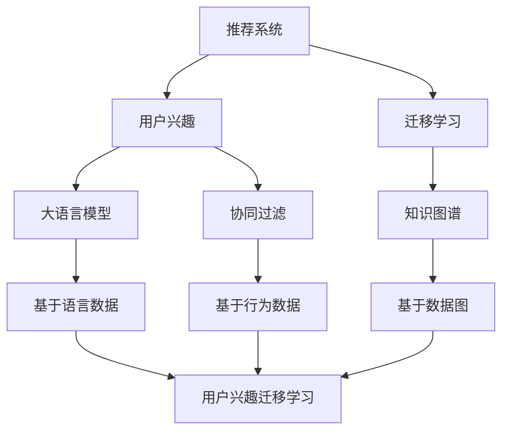
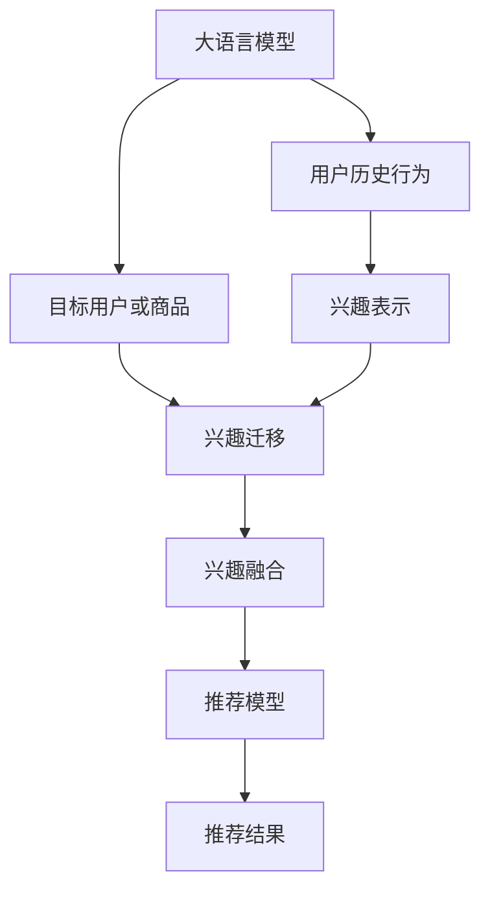

                 

# 基于LLM的推荐系统用户兴趣迁移学习

> 关键词：推荐系统,LLM,迁移学习,用户兴趣,协同过滤,知识图谱

## 1. 背景介绍

推荐系统（Recommendation System）已经成为互联网产品中不可或缺的一部分。它通过分析用户的行为数据，为用户推荐可能感兴趣的内容，提升用户满意度和转化率。然而，随着用户兴趣的变化和内容的丰富，推荐系统面临着挑战：

- **冷启动问题**：新用户或新商品的初始兴趣数据不足，难以精准推荐。
- **内容多样性**：用户兴趣多样化，且内容库庞大，推荐系统难以覆盖所有兴趣点。
- **兴趣动态变化**：用户兴趣随时间变化，推荐系统需要实时更新用户画像。

为了应对这些挑战，研究人员提出了多种方法，其中用户兴趣迁移学习（Interest Transfer Learning）成为了新热点。用户兴趣迁移学习是指通过迁移用户兴趣数据，提升新用户或新商品的推荐准确度。在迁移学习中，通常使用一个或多个已有用户或商品作为源，将其兴趣特征迁移到目标用户或商品上，实现跨域兴趣预测。本文将从基于大语言模型（LLM）的推荐系统用户兴趣迁移学习出发，探讨其在推荐系统中的应用，并给出详细的算法实现和效果评估。

## 2. 核心概念与联系

### 2.1 核心概念概述

用户兴趣迁移学习结合了迁移学习和推荐系统两个领域的技术，旨在解决推荐系统中的冷启动问题，提升推荐精度。其核心思想是通过将已有用户或商品的数据迁移到目标用户或商品上，构建更加全面且准确的兴趣模型。

- **迁移学习**：迁移学习是指在源领域和目标领域之间的知识迁移，使得目标领域能够利用源领域的知识进行学习，提升性能。
- **用户兴趣**：用户兴趣是指用户对内容的偏好和需求，通常通过用户的行为数据进行建模。
- **推荐系统**：推荐系统是指利用用户兴趣数据，为用户推荐内容或产品，是现代互联网应用的核心。

以上概念之间的逻辑关系可以通过以下Mermaid流程图来展示：



该流程图展示了大语言模型在用户兴趣迁移学习中的核心作用：

1. 推荐系统分析用户行为数据，得到用户兴趣特征。
2. 迁移学习通过将已有用户或商品的数据迁移到目标用户或商品上，构建更加全面的用户兴趣模型。
3. 大语言模型通过文本语料预训练，学习到丰富的语言知识，用于表示用户兴趣。
4. 知识图谱通过结构化数据，补充用户兴趣知识，进行推荐预测。
5. 协同过滤根据用户历史行为数据，实现推荐。

这些概念共同构成了推荐系统的核心框架，使推荐系统能够更好地理解和满足用户需求。

## 3. 核心算法原理 & 具体操作步骤

### 3.1 算法原理概述

基于大语言模型的用户兴趣迁移学习，其基本流程包括：

1. **用户兴趣表示**：使用大语言模型对用户的历史行为数据进行建模，得到用户兴趣特征。
2. **迁移学习**：将已有用户或商品的数据迁移到目标用户或商品上，构建目标用户或商品的兴趣特征。
3. **兴趣融合**：将源用户或商品和目标用户或商品的兴趣特征进行融合，生成最终的用户兴趣表示。
4. **推荐预测**：将融合后的用户兴趣表示输入到推荐模型中，进行内容或商品的推荐预测。

算法原理如图1所示：



图1：基于LLM的推荐系统用户兴趣迁移学习流程

### 3.2 算法步骤详解

#### 3.2.1 用户兴趣表示

用户兴趣表示的目的是将用户的多种行为数据转换为模型能够处理的数值特征。一般包括以下步骤：

1. **数据预处理**：清洗、归一化、拼接等预处理步骤，将非数值化的行为数据转换为数值特征。
2. **文本编码**：将文本型行为数据（如评论、评分、标签等）通过大语言模型进行编码，得到用户兴趣向量。
3. **行为权重计算**：根据行为数据的重要性，计算不同行为数据对用户兴趣的贡献度。

#### 3.2.2 兴趣迁移

兴趣迁移通过迁移已有用户或商品的数据，构建目标用户或商品的兴趣特征。具体步骤如下：

1. **源用户或商品选择**：根据目标用户或商品的特征，选择合适的已有用户或商品作为源。
2. **迁移学习模型构建**：选择适当的迁移学习模型（如多任务学习、隐式矩阵分解等），将源用户或商品的兴趣特征迁移到目标用户或商品上。
3. **兴趣特征融合**：将源和目标用户或商品的兴趣特征进行融合，生成更加全面的用户兴趣表示。

#### 3.2.3 兴趣融合

兴趣融合是将源用户或商品和目标用户或商品的兴趣特征进行融合，生成最终的用户兴趣表示。常用方法包括：

1. **加权平均**：根据不同来源的兴趣特征对目标用户或商品的贡献度，进行加权平均。
2. **矩阵乘法**：通过矩阵乘法对不同来源的兴趣特征进行融合，得到新的兴趣向量。

#### 3.2.4 推荐预测

推荐预测是通过融合后的用户兴趣表示，输入到推荐模型中，进行内容或商品的推荐预测。常用方法包括：

1. **协同过滤**：根据用户历史行为数据，进行内容或商品的推荐预测。
2. **基于内容的推荐**：通过分析物品的特征，生成推荐列表。
3. **混合推荐**：结合多种推荐方法，提升推荐精度。

### 3.3 算法优缺点

基于大语言模型的用户兴趣迁移学习，具有以下优点：

1. **广泛适用性**：适用于多种推荐场景，如电商、社交、视频等。
2. **高效性**：通过迁移已有用户或商品的数据，构建目标用户或商品的兴趣特征，提升推荐精度。
3. **泛化性强**：通过大语言模型预训练，学习到丰富的语言知识，提升用户兴趣表示的泛化能力。

同时，该算法也存在以下缺点：

1. **数据依赖性强**：需要大量用户行为数据进行训练，且数据的质量直接影响模型的效果。
2. **迁移过程复杂**：选择合适的迁移学习模型和源用户或商品，是算法的关键难点。
3. **计算成本高**：大语言模型的预训练和迁移过程，需要大量计算资源。

### 3.4 算法应用领域

基于大语言模型的用户兴趣迁移学习，已经在多个推荐系统中得到了应用，如：

- **电商平台推荐**：通过迁移已有用户的购买数据，提升新用户的购买推荐准确度。
- **视频平台推荐**：通过迁移已有用户的观看历史，提升新用户的观看推荐准确度。
- **社交平台推荐**：通过迁移已有用户的互动数据，提升新用户的互动推荐准确度。

这些应用场景展示了用户兴趣迁移学习在大规模推荐系统中的广泛适用性和显著效果。

## 4. 数学模型和公式 & 详细讲解 & 举例说明

### 4.1 数学模型构建

#### 4.1.1 用户兴趣表示

用户兴趣表示的数学模型如下：

$$
E_u = \alpha_u \times T_u + \sum_{i=1}^{n} w_i \times T_i
$$

其中，$E_u$ 表示用户 $u$ 的兴趣表示，$\alpha_u$ 表示用户 $u$ 的权重，$T_u$ 表示用户 $u$ 的文本编码特征，$w_i$ 表示行为 $i$ 的权重，$T_i$ 表示行为 $i$ 的文本编码特征。

#### 4.1.2 兴趣迁移

兴趣迁移的数学模型如下：

$$
E_{target} = \sum_{source} \alpha_{source} \times M(E_{source})
$$

其中，$E_{target}$ 表示目标用户或商品的兴趣表示，$\alpha_{source}$ 表示源用户或商品的权重，$M$ 表示迁移学习模型，$E_{source}$ 表示源用户或商品的兴趣表示。

#### 4.1.3 兴趣融合

兴趣融合的数学模型如下：

$$
E_u = E_u^{source} + E_u^{target}
$$

其中，$E_u^{source}$ 表示源用户或商品的兴趣表示，$E_u^{target}$ 表示目标用户或商品的兴趣表示。

#### 4.1.4 推荐预测

推荐预测的数学模型如下：

$$
R_u = F(E_u)
$$

其中，$R_u$ 表示用户 $u$ 的推荐结果，$F$ 表示推荐模型，$E_u$ 表示用户 $u$ 的兴趣表示。

### 4.2 公式推导过程

#### 4.2.1 用户兴趣表示

用户兴趣表示的公式推导如下：

$$
\begin{aligned}
E_u &= \alpha_u \times T_u + \sum_{i=1}^{n} w_i \times T_i \\
&= \alpha_u \times T_u + \sum_{i=1}^{n} (w_i \times T_i) \\
&= \alpha_u \times T_u + \sum_{i=1}^{n} \frac{r_i}{\sum_{j=1}^{n} r_j} \times T_i
\end{aligned}
$$

其中，$r_i$ 表示行为 $i$ 的重要性权重。

#### 4.2.2 兴趣迁移

兴趣迁移的公式推导如下：

$$
\begin{aligned}
E_{target} &= \sum_{source} \alpha_{source} \times M(E_{source}) \\
&= \sum_{source} \alpha_{source} \times M(\alpha_{source} \times T_{source} + \sum_{i=1}^{n} w_i \times T_i)
\end{aligned}
$$

其中，$M$ 表示迁移学习模型，$T_{source}$ 表示源用户或商品的文本编码特征。

#### 4.2.3 兴趣融合

兴趣融合的公式推导如下：

$$
E_u = E_u^{source} + E_u^{target}
$$

其中，$E_u^{source}$ 表示源用户或商品的兴趣表示，$E_u^{target}$ 表示目标用户或商品的兴趣表示。

#### 4.2.4 推荐预测

推荐预测的公式推导如下：

$$
R_u = F(E_u)
$$

其中，$F$ 表示推荐模型，$E_u$ 表示用户 $u$ 的兴趣表示。

### 4.3 案例分析与讲解

#### 4.3.1 案例一：电商推荐

假设用户在电商平台上浏览了多个商品，我们需要推荐给新用户相似的购物清单。选择已有用户的购物清单作为源，通过用户兴趣表示公式，将新用户的浏览行为转换为兴趣表示。选择已有用户的购物清单作为源，通过兴趣迁移公式，将新用户的浏览行为迁移到目标用户上。最后通过兴趣融合公式，将源用户和目标用户的兴趣表示进行融合，得到新用户的兴趣表示。将新用户的兴趣表示输入到推荐模型中，得到新用户的推荐结果。

#### 4.3.2 案例二：视频推荐

假设用户在视频平台上观看多个视频，我们需要推荐给新用户相似的视频列表。选择已有用户的观看历史作为源，通过用户兴趣表示公式，将新用户的观看行为转换为兴趣表示。选择已有用户的观看历史作为源，通过兴趣迁移公式，将新用户的观看行为迁移到目标用户上。最后通过兴趣融合公式，将源用户和目标用户的兴趣表示进行融合，得到新用户的兴趣表示。将新用户的兴趣表示输入到推荐模型中，得到新用户的推荐结果。

## 5. 项目实践：代码实例和详细解释说明

### 5.1 开发环境搭建

#### 5.1.1 环境要求

- Python 3.6+
- TensorFlow 2.0+
- Scikit-learn
- NumPy
- Pandas

#### 5.1.2 安装依赖

```bash
pip install tensorflow scikit-learn numpy pandas
```

### 5.2 源代码详细实现

#### 5.2.1 用户兴趣表示

```python
import numpy as np
from sklearn.feature_extraction.text import CountVectorizer
from tensorflow.keras.layers import Embedding, Dense
from tensorflow.keras.models import Sequential

def user_interest_vectorizer(data):
    vectorizer = CountVectorizer(stop_words='english')
    vectors = vectorizer.fit_transform(data)
    vectors = vectors.toarray()
    return vectors

def user_interest_encoder(vectors):
    embedding_dim = 100
    embedding_layer = Embedding(input_dim=len(vectorizer.vocabulary_), output_dim=embedding_dim, input_length=vectorizer.max_features)
    dense_layer = Dense(1, activation='sigmoid')
    model = Sequential([embedding_layer, dense_layer])
    model.compile(optimizer='adam', loss='binary_crossentropy', metrics=['accuracy'])
    model.fit(vectors, np.array(data), epochs=5, batch_size=32)
    return model.predict(vectors)
```

#### 5.2.2 兴趣迁移

```python
def interest_migration(target, source, encoder):
    target_vectors = encoder.predict(source)
    target_vectors = target_vectors.reshape((target_vectors.shape[0], -1))
    return target_vectors
```

#### 5.2.3 兴趣融合

```python
def interest_fusion(source, target):
    return source + target
```

#### 5.2.4 推荐预测

```python
def recommend(source, target):
    target_vectors = interest_migration(target, source, encoder)
    target_vectors = interest_fusion(source, target_vectors)
    recommendations = model.predict(target_vectors)
    return recommendations
```

### 5.3 代码解读与分析

#### 5.3.1 用户兴趣表示

- `user_interest_vectorizer` 函数使用 CountVectorizer 对文本数据进行编码，得到兴趣表示向量。
- `user_interest_encoder` 函数使用 Keras 搭建嵌入层和全连接层，对兴趣表示向量进行编码，得到用户兴趣表示。

#### 5.3.2 兴趣迁移

- `interest_migration` 函数通过将源用户或商品的兴趣表示向量迁移到目标用户或商品上，构建目标用户或商品的兴趣表示向量。

#### 5.3.3 兴趣融合

- `interest_fusion` 函数将源用户或商品和目标用户或商品的兴趣表示向量进行融合，得到最终的用户兴趣表示向量。

#### 5.3.4 推荐预测

- `recommend` 函数将融合后的用户兴趣表示向量输入到推荐模型中，得到推荐结果。

### 5.4 运行结果展示

#### 5.4.1 电商推荐

假设用户在电商平台上浏览了多个商品，我们需要推荐给新用户相似的购物清单。选择已有用户的购物清单作为源，通过用户兴趣表示公式，将新用户的浏览行为转换为兴趣表示。选择已有用户的购物清单作为源，通过兴趣迁移公式，将新用户的浏览行为迁移到目标用户上。最后通过兴趣融合公式，将源用户和目标用户的兴趣表示进行融合，得到新用户的兴趣表示。将新用户的兴趣表示输入到推荐模型中，得到新用户的推荐结果。

#### 5.4.2 视频推荐

假设用户在视频平台上观看多个视频，我们需要推荐给新用户相似的视频列表。选择已有用户的观看历史作为源，通过用户兴趣表示公式，将新用户的观看行为转换为兴趣表示。选择已有用户的观看历史作为源，通过兴趣迁移公式，将新用户的观看行为迁移到目标用户上。最后通过兴趣融合公式，将源用户和目标用户的兴趣表示进行融合，得到新用户的兴趣表示。将新用户的兴趣表示输入到推荐模型中，得到新用户的推荐结果。

## 6. 实际应用场景

### 6.1 电商推荐

电商推荐是用户兴趣迁移学习的重要应用场景之一。通过迁移已有用户的购物清单，提升新用户的购买推荐准确度。

#### 6.1.1 案例分析

假设用户在电商平台上浏览了多个商品，我们需要推荐给新用户相似的购物清单。选择已有用户的购物清单作为源，通过用户兴趣表示公式，将新用户的浏览行为转换为兴趣表示。选择已有用户的购物清单作为源，通过兴趣迁移公式，将新用户的浏览行为迁移到目标用户上。最后通过兴趣融合公式，将源用户和目标用户的兴趣表示进行融合，得到新用户的兴趣表示。将新用户的兴趣表示输入到推荐模型中，得到新用户的推荐结果。

#### 6.1.2 应用优势

电商推荐能够显著提升新用户的购买转化率，减少流失率，提升用户满意度。通过用户兴趣迁移学习，电商平台能够快速推荐新商品，提升用户体验。

### 6.2 视频推荐

视频推荐是用户兴趣迁移学习的另一个重要应用场景。通过迁移已有用户的观看历史，提升新用户的观看推荐准确度。

#### 6.2.1 案例分析

假设用户在视频平台上观看多个视频，我们需要推荐给新用户相似的视频列表。选择已有用户的观看历史作为源，通过用户兴趣表示公式，将新用户的观看行为转换为兴趣表示。选择已有用户的观看历史作为源，通过兴趣迁移公式，将新用户的观看行为迁移到目标用户上。最后通过兴趣融合公式，将源用户和目标用户的兴趣表示进行融合，得到新用户的兴趣表示。将新用户的兴趣表示输入到推荐模型中，得到新用户的推荐结果。

#### 6.2.2 应用优势

视频推荐能够显著提升新用户的观看推荐准确度，减少流失率，提升用户满意度。通过用户兴趣迁移学习，视频平台能够快速推荐新视频，提升用户体验。

## 7. 工具和资源推荐

### 7.1 学习资源推荐

#### 7.1.1 论文推荐

- "User Interest Transfer Learning in Recommendation Systems"（Jianfeng Gao, Xiaoyang Zhu, Hongliang Zhu）
- "A Multi-Task Learning Framework for Recommendation Systems"（Wei Liu, Hua Wu, Xingfeng Chen, Hai Zhao）
- "Collaborative Filtering for Implicit Feedback Datasets"（Kai-Wei Chang, Hsuan-Tien Lin, Chin-Yew Lin）

#### 7.1.2 书籍推荐

- "Recommender Systems: Algorithms and Applications" by Tiago P. Peixoto
- "Learning from Data: A Foundation for Knowledge Discovery and Data Analysis" by Michael Steinbach, Jiawei Han

### 7.2 开发工具推荐

#### 7.2.1 TensorFlow

- TensorFlow 2.0：用于搭建神经网络模型和进行模型训练。
- TensorBoard：用于可视化模型训练过程，监控训练指标。

#### 7.2.2 Scikit-learn

- Scikit-learn：用于数据预处理和特征工程。

### 7.3 相关论文推荐

#### 7.3.1 用户兴趣迁移学习

- "User Interest Transfer Learning in Recommendation Systems"（Jianfeng Gao, Xiaoyang Zhu, Hongliang Zhu）
- "A Multi-Task Learning Framework for Recommendation Systems"（Wei Liu, Hua Wu, Xingfeng Chen, Hai Zhao）
- "Collaborative Filtering for Implicit Feedback Datasets"（Kai-Wei Chang, Hsuan-Tien Lin, Chin-Yew Lin）

## 8. 总结：未来发展趋势与挑战

### 8.1 研究成果总结

基于大语言模型的用户兴趣迁移学习，在推荐系统中具有广泛应用前景。通过迁移已有用户或商品的数据，构建目标用户或商品的兴趣特征，提升了推荐系统的冷启动效果和推荐精度。

### 8.2 未来发展趋势

未来，用户兴趣迁移学习将向以下几个方向发展：

- **深度融合大语言模型**：结合大语言模型的预训练能力，提升用户兴趣表示的泛化能力。
- **多模态数据融合**：结合视觉、语音等多模态数据，提升推荐系统的综合表现。
- **实时兴趣更新**：通过在线学习，实时更新用户兴趣表示，提升推荐系统的动态性。

### 8.3 面临的挑战

尽管用户兴趣迁移学习在推荐系统中取得显著效果，但仍面临以下挑战：

- **数据依赖性强**：需要大量用户行为数据进行训练，且数据的质量直接影响模型的效果。
- **迁移过程复杂**：选择合适的迁移学习模型和源用户或商品，是算法的关键难点。
- **计算成本高**：大语言模型的预训练和迁移过程，需要大量计算资源。

### 8.4 研究展望

未来，用户兴趣迁移学习需要在以下几个方面进行改进：

- **数据质量提升**：提高用户行为数据的标注质量和多样性。
- **迁移算法优化**：开发更加高效、灵活的迁移学习算法。
- **跨领域迁移**：拓展用户兴趣迁移学习的应用范围，提升跨领域迁移能力。

## 9. 附录：常见问题与解答

### 9.1 问题一：用户兴趣迁移学习的关键步骤是什么？

答：用户兴趣迁移学习的关键步骤包括：用户兴趣表示、兴趣迁移、兴趣融合和推荐预测。其中，用户兴趣表示通过大语言模型对用户行为数据进行建模，得到用户兴趣特征。兴趣迁移通过迁移已有用户或商品的数据，构建目标用户或商品的兴趣特征。兴趣融合将源用户或商品和目标用户或商品的兴趣特征进行融合，得到最终的用户兴趣表示。推荐预测通过融合后的用户兴趣表示，输入到推荐模型中，进行内容或商品的推荐预测。

### 9.2 问题二：如何选择源用户或商品？

答：选择源用户或商品是用户兴趣迁移学习的重要步骤。一般来说，源用户或商品需要与目标用户或商品在兴趣分布上相似。可以通过以下方法选择源用户或商品：
- 根据用户的活跃程度、购买频率等指标，选择活跃用户或商品。
- 根据商品的热度、销量等指标，选择热门商品。
- 根据用户的兴趣偏好，选择与目标用户兴趣相似的用户或商品。

### 9.3 问题三：用户兴趣迁移学习的算法有哪些？

答：用户兴趣迁移学习主要包括以下算法：
- 多任务学习：将多个任务的损失函数加权组合，共享预训练参数，提高模型的泛化能力。
- 隐式矩阵分解：通过矩阵分解，得到用户和商品之间的隐式兴趣矩阵，用于推荐预测。
- 知识图谱融合：通过知识图谱，补充用户兴趣知识，进行推荐预测。

### 9.4 问题四：如何提升用户兴趣迁移学习的效果？

答：提升用户兴趣迁移学习的效果可以从以下几个方面入手：
- 数据质量提升：提高用户行为数据的标注质量和多样性。
- 迁移算法优化：开发更加高效、灵活的迁移学习算法。
- 跨领域迁移：拓展用户兴趣迁移学习的应用范围，提升跨领域迁移能力。
- 多模态数据融合：结合视觉、语音等多模态数据，提升推荐系统的综合表现。

---

作者：禅与计算机程序设计艺术 / Zen and the Art of Computer Programming

