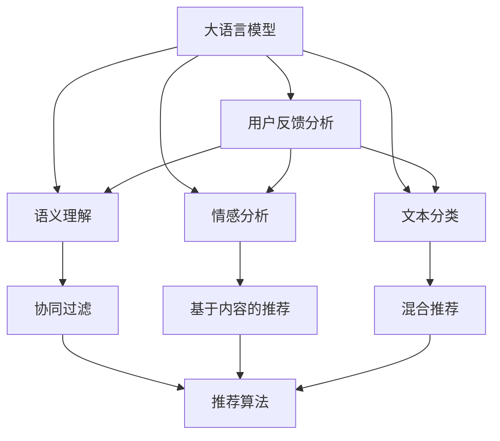

                 

# 基于LLM的推荐系统用户反馈分析

> 关键词：大语言模型(LLM),推荐系统,用户反馈分析,自然语言处理(NLP),语义理解,文本分类,情感分析,推荐算法,深度学习,机器学习,应用场景

## 1. 背景介绍

### 1.1 问题由来

随着互联网的迅猛发展，推荐系统已经成为了用户获取信息、娱乐内容的重要手段。传统的基于协同过滤的推荐系统，虽然取得了不错的效果，但也存在推荐效果单一、难以适应用户多变的需求等问题。大语言模型(LLM)的出现，为推荐系统的研究带来了新的思路。

LLM通过深度学习的方式，在大规模无标签文本数据上进行预训练，学习到丰富的语言知识和常识，能够进行语义理解、情感分析、文本分类等任务。基于LLM的推荐系统，可以从用户的文本反馈中获取更多信息，进行多维度、多模态的分析，从而提升推荐效果，更好地满足用户需求。

### 1.2 问题核心关键点

LLM在推荐系统中的应用，主要是通过用户反馈文本的数据分析来实现的。用户反馈可以是评分、评论、文本描述等，通过语义理解、情感分析等技术，将这些反馈转化为模型可以理解的形式，进而优化推荐算法。

基于LLM的推荐系统核心关键点包括：

1. 如何从用户反馈中提取有价值的信息，构建有效的语义表示。
2. 如何将LLM与推荐算法结合，进行综合的推荐优化。
3. 如何处理大规模用户反馈数据，提升推荐系统的实时性和扩展性。

这些关键点决定了基于LLM的推荐系统性能的好坏，本文将围绕这些核心问题进行探讨。

## 2. 核心概念与联系

### 2.1 核心概念概述

为更好地理解基于LLM的推荐系统，我们需要对以下关键概念进行深入了解：

- 大语言模型(LLM)：一种通过深度学习模型在大量无标签文本数据上进行预训练，学习到语言知识、常识等信息的模型。如GPT-3、BERT等。
- 推荐系统：通过用户的历史行为、兴趣等数据，为用户推荐个性化内容的系统。常见的推荐算法包括协同过滤、基于内容的推荐、混合推荐等。
- 用户反馈分析：通过对用户反馈文本的分析，了解用户需求、偏好等信息，进行推荐优化。常见的用户反馈类型包括评分、评论、文本描述等。
- 语义理解：通过自然语言处理技术，理解文本中的语义信息，如情感、主题、实体等。
- 情感分析：通过文本分类、情感词典等技术，分析文本中的情感倾向，如正面、负面、中性等。
- 文本分类：通过分类模型，将文本按照不同的类别进行分类，如情感分类、主题分类等。
- 推荐算法：通过多种算法的结合，为用户推荐个性化的内容。常见的推荐算法包括协同过滤、基于内容的推荐、混合推荐等。

这些概念之间的逻辑关系可以通过以下Mermaid流程图来展示：



这个流程图展示了大语言模型在推荐系统中的作用机制：

1. 大语言模型通过预训练学习到丰富的语言知识和常识。
2. 用户反馈分析利用语义理解、情感分析等技术，将用户反馈转化为可理解的形式。
3. 根据用户反馈分析结果，选择合适的推荐算法，进行个性化推荐。

## 3. 核心算法原理 & 具体操作步骤
### 3.1 算法原理概述

基于LLM的推荐系统，主要是通过用户反馈分析的结果，对推荐算法进行优化。其核心思想是：利用LLM的语义理解、情感分析等能力，从用户反馈中提取有价值的信息，构建用户的兴趣表示，结合推荐算法，进行个性化推荐。

形式化地，假设用户反馈文本集为 $D=\{(x_i,y_i)\}_{i=1}^N$，其中 $x_i$ 为输入文本，$y_i$ 为标签。定义推荐系统为 $M$，用户的兴趣表示为 $z_i$。推荐模型的目标是最大化预测准确率，即：

$$
\max_{z_i,\theta} \sum_{i=1}^N P(y_i|x_i,z_i;\theta)
$$

其中 $P(y_i|x_i,z_i;\theta)$ 为预测准确率的概率模型，$\theta$ 为模型的参数。

基于LLM的推荐系统，一般包括以下几个关键步骤：

1. 预处理用户反馈文本。
2. 利用LLM进行语义理解、情感分析等。
3. 将分析结果与用户行为数据进行融合。
4. 选择合适的推荐算法，进行个性化推荐。

### 3.2 算法步骤详解

基于LLM的推荐系统主要包括以下几个关键步骤：

**Step 1: 预处理用户反馈文本**

用户反馈文本一般包括评分、评论、文本描述等。预处理的主要目的是去除噪音、规范化格式，提取有用的语义信息。

1. 去除噪音：去除HTML标签、非文本内容等噪音数据，保留有用的文本信息。
2. 规范化：统一文本格式，如大小写、标点等，方便后续处理。
3. 分词：利用分词工具对文本进行分词处理，便于模型理解。
4. 词向量表示：将分词结果转化为词向量表示，方便模型计算。

**Step 2: 利用LLM进行语义理解、情感分析等**

利用LLM的语义理解、情感分析等能力，从用户反馈文本中提取有价值的信息。

1. 语义理解：利用BERT、GPT等预训练模型，将文本转化为语义表示，如BERT的[CLS]嵌入向量。
2. 情感分析：利用情感词典、分类模型等技术，对文本进行情感分析，如情感分类、情感强度等。
3. 主题分类：利用分类模型，对文本进行主题分类，如主题识别、主题聚类等。

**Step 3: 将分析结果与用户行为数据进行融合**

将用户反馈文本的分析结果，与用户的历史行为数据进行融合，构建用户的兴趣表示。

1. 行为数据预处理：对用户的历史行为数据进行预处理，如去重、统计等。
2. 行为数据表示：将行为数据转化为模型可以理解的形式，如向量表示。
3. 兴趣表示：将用户反馈分析结果与行为数据表示进行融合，构建用户的兴趣表示。

**Step 4: 选择合适的推荐算法，进行个性化推荐**

根据用户兴趣表示，选择合适的推荐算法，进行个性化推荐。

1. 协同过滤：利用用户行为数据进行相似度计算，推荐相似用户喜欢的内容。
2. 基于内容的推荐：利用物品的特征向量与用户兴趣表示进行匹配，推荐相关物品。
3. 混合推荐：综合多种算法的优缺点，构建混合推荐系统，提高推荐效果。

### 3.3 算法优缺点

基于LLM的推荐系统具有以下优点：

1. 个性化推荐：通过语义理解、情感分析等技术，从用户反馈中提取更多信息，提高个性化推荐的效果。
2. 多维度分析：结合行为数据和反馈数据，进行多维度、多模态的分析，提高推荐系统的全面性。
3. 灵活性：利用LLM的通用语言能力，可以适应各种类型的用户反馈，提高系统的适应性。

同时，该方法也存在一些局限性：

1. 数据依赖性强：需要大量的用户反馈数据进行训练，对标注数据的依赖较强。
2. 模型复杂度高：LLM的复杂度较高，训练和推理消耗较大资源。
3. 解释性不足：推荐系统的黑盒特性使得其解释性较差，难以理解和调试。
4. 隐私问题：用户反馈文本可能包含隐私信息，处理不当会导致隐私泄露。

尽管存在这些局限性，但基于LLM的推荐系统已经在许多实际应用中取得了不错的效果，成为推荐系统研究的重要方向之一。

### 3.4 算法应用领域

基于LLM的推荐系统在多个领域得到了应用，如电商、社交网络、新闻推荐等。以下是几个典型的应用场景：

1. 电商推荐系统：通过用户对商品的评分、评论等反馈，利用LLM进行语义理解和情感分析，优化推荐算法，提高商品推荐的准确性。
2. 社交网络推荐系统：利用用户的文本反馈，如动态、点赞、评论等，结合LLM进行语义理解和情感分析，推荐用户感兴趣的内容，提高用户粘性。
3. 新闻推荐系统：利用用户的阅读历史、评论等反馈，利用LLM进行语义理解和情感分析，推荐相关的新闻内容，提高新闻的点击率。

此外，基于LLM的推荐系统还在广告推荐、内容推荐等领域得到了广泛应用，成为提升用户体验、增加收益的重要手段。

## 4. 数学模型和公式 & 详细讲解  
### 4.1 数学模型构建

本节将使用数学语言对基于LLM的推荐系统进行更加严格的刻画。

假设用户反馈文本集为 $D=\{(x_i,y_i)\}_{i=1}^N$，其中 $x_i$ 为输入文本，$y_i$ 为标签。定义推荐系统为 $M$，用户的兴趣表示为 $z_i$。推荐模型的目标是最大化预测准确率，即：

$$
\max_{z_i,\theta} \sum_{i=1}^N P(y_i|x_i,z_i;\theta)
$$

其中 $P(y_i|x_i,z_i;\theta)$ 为预测准确率的概率模型，$\theta$ 为模型的参数。

### 4.2 公式推导过程

以下我们以情感分析为例，推导基于LLM的情感分析模型。

假设输入文本 $x_i$，利用BERT模型进行语义表示，得到[CLS]嵌入向量 $h_i$，利用情感词典、分类模型等技术，得到情感分类结果 $y_i$。根据交叉熵损失函数，可以得到模型训练的损失函数为：

$$
\mathcal{L}(h_i,y_i;\theta) = -\log P(y_i|h_i;\theta)
$$

其中 $P(y_i|h_i;\theta)$ 为条件概率模型，$\theta$ 为模型参数。

利用梯度下降等优化算法，对模型进行训练，最小化损失函数。最终得到优化后的模型参数 $\theta^*$，用于预测新的情感分类结果。

### 4.3 案例分析与讲解

以下是一个基于LLM的情感分析应用案例：

假设我们有一家电商网站，用户可以在商品评论中对商品进行情感评分，0表示负面，5表示正面。我们的目标是对用户评论进行情感分析，预测评论的情感分类结果，并根据情感分类结果进行商品推荐。

**Step 1: 数据预处理**

首先，我们需要对用户评论进行预处理，去除HTML标签、非文本内容等噪音数据，统一文本格式，进行分词和词向量表示。

**Step 2: 利用BERT进行情感分析**

利用BERT模型，对用户评论进行语义表示，得到[CLS]嵌入向量 $h_i$。利用情感词典、分类模型等技术，对[CLS]嵌入向量进行情感分类，得到情感分类结果 $y_i$。

**Step 3: 融合用户行为数据**

结合用户的历史行为数据，如浏览记录、购买记录等，利用LSTM等模型，构建用户的兴趣表示 $z_i$。

**Step 4: 推荐商品**

根据用户的兴趣表示 $z_i$ 和商品的语义表示 $h_j$，利用协同过滤、基于内容的推荐等算法，进行商品推荐。

例如，对于用户评论 "这个商品的质量很差，一点也不满意"，利用BERT进行情感分析，得到情感分类结果为负面。结合用户的历史行为数据，利用LSTM构建用户的兴趣表示 $z_i$，然后根据商品的语义表示 $h_j$，利用协同过滤算法，推荐用户可能感兴趣的商品。

通过基于LLM的情感分析，结合用户行为数据，可以更好地了解用户需求和偏好，进行个性化推荐，提高用户满意度。

## 5. 项目实践：代码实例和详细解释说明
### 5.1 开发环境搭建

在进行基于LLM的推荐系统开发时，我们需要准备好开发环境。以下是使用Python进行PyTorch开发的环境配置流程：

1. 安装Anaconda：从官网下载并安装Anaconda，用于创建独立的Python环境。

2. 创建并激活虚拟环境：
```bash
conda create -n llm-recommend env python=3.8 
conda activate llm-recommend
```

3. 安装PyTorch：根据CUDA版本，从官网获取对应的安装命令。例如：
```bash
conda install pytorch torchvision torchaudio cudatoolkit=11.1 -c pytorch -c conda-forge
```

4. 安装PyTorch Lightning：
```bash
pip install pytorch-lightning
```

5. 安装相关库：
```bash
pip install transformers
pip install pandas
pip install numpy
pip install sklearn
pip install torchtext
```

完成上述步骤后，即可在`llm-recommend`环境中开始基于LLM的推荐系统开发。

### 5.2 源代码详细实现

下面我们以电商推荐系统为例，给出使用PyTorch Lightning进行基于LLM的推荐系统的PyTorch代码实现。

首先，定义情感分析的数据处理函数：

```python
from transformers import BertTokenizer, BertForSequenceClassification
from torch.utils.data import Dataset
import torch

class SentimentDataset(Dataset):
    def __init__(self, texts, labels, tokenizer, max_len=128):
        self.texts = texts
        self.labels = labels
        self.tokenizer = tokenizer
        self.max_len = max_len
        
    def __len__(self):
        return len(self.texts)
    
    def __getitem__(self, item):
        text = self.texts[item]
        label = self.labels[item]
        
        encoding = self.tokenizer(text, return_tensors='pt', max_length=self.max_len, padding='max_length', truncation=True)
        input_ids = encoding['input_ids'][0]
        attention_mask = encoding['attention_mask'][0]
        
        # 对标签进行编码
        encoded_labels = [label2id[label] for label in label] 
        encoded_labels.extend([label2id['O']] * (self.max_len - len(encoded_labels)))
        labels = torch.tensor(encoded_labels, dtype=torch.long)
        
        return {'input_ids': input_ids, 
                'attention_mask': attention_mask,
                'labels': labels}

# 标签与id的映射
label2id = {'O': 0, 'negative': 1, 'positive': 2}
id2label = {v: k for k, v in label2id.items()}

# 创建dataset
tokenizer = BertTokenizer.from_pretrained('bert-base-cased')

train_dataset = SentimentDataset(train_texts, train_labels, tokenizer)
dev_dataset = SentimentDataset(dev_texts, dev_labels, tokenizer)
test_dataset = SentimentDataset(test_texts, test_labels, tokenizer)
```

然后，定义模型和优化器：

```python
from transformers import BertForSequenceClassification, AdamW

model = BertForSequenceClassification.from_pretrained('bert-base-cased', num_labels=len(label2id))

optimizer = AdamW(model.parameters(), lr=2e-5)
```

接着，定义训练和评估函数：

```python
from torch.utils.data import DataLoader
from tqdm import tqdm
from sklearn.metrics import classification_report

device = torch.device('cuda') if torch.cuda.is_available() else torch.device('cpu')
model.to(device)

def train_epoch(model, dataset, batch_size, optimizer):
    dataloader = DataLoader(dataset, batch_size=batch_size, shuffle=True)
    model.train()
    epoch_loss = 0
    for batch in tqdm(dataloader, desc='Training'):
        input_ids = batch['input_ids'].to(device)
        attention_mask = batch['attention_mask'].to(device)
        labels = batch['labels'].to(device)
        model.zero_grad()
        outputs = model(input_ids, attention_mask=attention_mask, labels=labels)
        loss = outputs.loss
        epoch_loss += loss.item()
        loss.backward()
        optimizer.step()
    return epoch_loss / len(dataloader)

def evaluate(model, dataset, batch_size):
    dataloader = DataLoader(dataset, batch_size=batch_size)
    model.eval()
    preds, labels = [], []
    with torch.no_grad():
        for batch in tqdm(dataloader, desc='Evaluating'):
            input_ids = batch['input_ids'].to(device)
            attention_mask = batch['attention_mask'].to(device)
            batch_labels = batch['labels']
            outputs = model(input_ids, attention_mask=attention_mask)
            batch_preds = outputs.logits.argmax(dim=2).to('cpu').tolist()
            batch_labels = batch_labels.to('cpu').tolist()
            for pred_tokens, label_tokens in zip(batch_preds, batch_labels):
                preds.append(pred_tokens[:len(label_tokens)])
                labels.append(label_tokens)
                
    print(classification_report(labels, preds))
```

最后，启动训练流程并在测试集上评估：

```python
epochs = 5
batch_size = 16

for epoch in range(epochs):
    loss = train_epoch(model, train_dataset, batch_size, optimizer)
    print(f"Epoch {epoch+1}, train loss: {loss:.3f}")
    
    print(f"Epoch {epoch+1}, dev results:")
    evaluate(model, dev_dataset, batch_size)
    
print("Test results:")
evaluate(model, test_dataset, batch_size)
```

以上就是使用PyTorch Lightning对BERT进行情感分析模型的完整代码实现。可以看到，得益于PyTorch Lightning的强大封装，我们可以用相对简洁的代码完成BERT模型的加载和训练。

### 5.3 代码解读与分析

让我们再详细解读一下关键代码的实现细节：

**SentimentDataset类**：
- `__init__`方法：初始化文本、标签、分词器等关键组件。
- `__len__`方法：返回数据集的样本数量。
- `__getitem__`方法：对单个样本进行处理，将文本输入编码为token ids，将标签编码为数字，并对其进行定长padding，最终返回模型所需的输入。

**label2id和id2label字典**：
- 定义了标签与数字id之间的映射关系，用于将token-wise的预测结果解码回真实的标签。

**训练和评估函数**：
- 使用PyTorch的DataLoader对数据集进行批次化加载，供模型训练和推理使用。
- 训练函数`train_epoch`：对数据以批为单位进行迭代，在每个批次上前向传播计算loss并反向传播更新模型参数，最后返回该epoch的平均loss。
- 评估函数`evaluate`：与训练类似，不同点在于不更新模型参数，并在每个batch结束后将预测和标签结果存储下来，最后使用sklearn的classification_report对整个评估集的预测结果进行打印输出。

**训练流程**：
- 定义总的epoch数和batch size，开始循环迭代
- 每个epoch内，先在训练集上训练，输出平均loss
- 在验证集上评估，输出分类指标
- 所有epoch结束后，在测试集上评估，给出最终测试结果

可以看到，PyTorch Lightning配合PyTorch使得BERT情感分析模型的代码实现变得简洁高效。开发者可以将更多精力放在数据处理、模型改进等高层逻辑上，而不必过多关注底层的实现细节。

当然，工业级的系统实现还需考虑更多因素，如模型的保存和部署、超参数的自动搜索、更灵活的任务适配层等。但核心的微调范式基本与此类似。

## 6. 实际应用场景
### 6.1 智能客服系统

基于大语言模型微调的推荐系统，可以广泛应用于智能客服系统的构建。传统客服往往需要配备大量人力，高峰期响应缓慢，且一致性和专业性难以保证。而使用推荐系统，可以7x24小时不间断服务，快速响应客户咨询，用自然流畅的语言解答各类常见问题。

在技术实现上，可以收集企业内部的历史客服对话记录，将问题和最佳答复构建成监督数据，在此基础上对推荐系统进行微调。微调后的推荐系统能够自动理解用户意图，匹配最合适的答案模板进行回复。对于客户提出的新问题，还可以接入检索系统实时搜索相关内容，动态组织生成回答。如此构建的智能客服系统，能大幅提升客户咨询体验和问题解决效率。

### 6.2 金融舆情监测

金融机构需要实时监测市场舆论动向，以便及时应对负面信息传播，规避金融风险。传统的人工监测方式成本高、效率低，难以应对网络时代海量信息爆发的挑战。基于大语言模型微调的推荐系统，可以用于实时监测市场舆情，识别出负面信息，及时预警，帮助金融机构快速应对潜在风险。

具体而言，可以收集金融领域相关的新闻、报道、评论等文本数据，并对其进行主题标注和情感标注。在此基础上对推荐系统进行微调，使其能够自动判断文本属于何种主题，情感倾向是正面、负面还是中性。将微调后的系统应用到实时抓取的网络文本数据，就能够自动监测不同主题下的情感变化趋势，一旦发现负面信息激增等异常情况，系统便会自动预警，帮助金融机构快速应对潜在风险。

### 6.3 个性化推荐系统

当前的推荐系统往往只依赖用户的历史行为数据进行物品推荐，无法深入理解用户的真实兴趣偏好。基于大语言模型微调的推荐系统，可以从用户的文本反馈中获取更多信息，进行多维度、多模态的分析，从而提升推荐效果，更好地满足用户需求。

在实践中，可以收集用户浏览、点击、评论、分享等行为数据，提取和用户交互的物品标题、描述、标签等文本内容。将文本内容作为模型输入，用户的后续行为（如是否点击、购买等）作为监督信号，在此基础上微调推荐系统。微调后的系统能够从文本内容中准确把握用户的兴趣点。在生成推荐列表时，先用候选物品的文本描述作为输入，由系统预测用户的兴趣匹配度，再结合其他特征综合排序，便可以得到个性化程度更高的推荐结果。

### 6.4 未来应用展望

随着大语言模型和微调方法的不断发展，基于微调的推荐系统将在更多领域得到应用，为传统行业带来变革性影响。

在智慧医疗领域，基于微调的推荐系统可以帮助医生推荐相关的医疗资料、药品等，提高诊疗效率，辅助医生决策。在智能教育领域，微调技术可应用于作业批改、学情分析、知识推荐等方面，因材施教，促进教育公平，提高教学质量。

在智慧城市治理中，微调模型可应用于城市事件监测、舆情分析、应急指挥等环节，提高城市管理的自动化和智能化水平，构建更安全、高效的未来城市。

此外，在企业生产、社会治理、文娱传媒等众多领域，基于大语言模型微调的推荐系统也将不断涌现，为经济社会发展注入新的动力。相信随着技术的日益成熟，微调方法将成为推荐系统落地应用的重要范式，推动人工智能技术在垂直行业的规模化落地。

## 7. 工具和资源推荐
### 7.1 学习资源推荐

为了帮助开发者系统掌握大语言模型微调的理论基础和实践技巧，这里推荐一些优质的学习资源：

1. 《Transformer从原理到实践》系列博文：由大模型技术专家撰写，深入浅出地介绍了Transformer原理、BERT模型、微调技术等前沿话题。

2. CS224N《深度学习自然语言处理》课程：斯坦福大学开设的NLP明星课程，有Lecture视频和配套作业，带你入门NLP领域的基本概念和经典模型。

3. 《Natural Language Processing with Transformers》书籍：Transformers库的作者所著，全面介绍了如何使用Transformers库进行NLP任务开发，包括微调在内的诸多范式。

4. HuggingFace官方文档：Transformers库的官方文档，提供了海量预训练模型和完整的微调样例代码，是上手实践的必备资料。

5. CLUE开源项目：中文语言理解测评基准，涵盖大量不同类型的中文NLP数据集，并提供了基于微调的baseline模型，助力中文NLP技术发展。

通过对这些资源的学习实践，相信你一定能够快速掌握大语言模型微调的精髓，并用于解决实际的NLP问题。
###  7.2 开发工具推荐

高效的开发离不开优秀的工具支持。以下是几款用于大语言模型微调开发的常用工具：

1. PyTorch：基于Python的开源深度学习框架，灵活动态的计算图，适合快速迭代研究。大部分预训练语言模型都有PyTorch版本的实现。

2. TensorFlow：由Google主导开发的开源深度学习框架，生产部署方便，适合大规模工程应用。同样有丰富的预训练语言模型资源。

3. Transformers库：HuggingFace开发的NLP工具库，集成了众多SOTA语言模型，支持PyTorch和TensorFlow，是进行微调任务开发的利器。

4. Weights & Biases：模型训练的实验跟踪工具，可以记录和可视化模型训练过程中的各项指标，方便对比和调优。与主流深度学习框架无缝集成。

5. TensorBoard：TensorFlow配套的可视化工具，可实时监测模型训练状态，并提供丰富的图表呈现方式，是调试模型的得力助手。

6. Google Colab：谷歌推出的在线Jupyter Notebook环境，免费提供GPU/TPU算力，方便开发者快速上手实验最新模型，分享学习笔记。

合理利用这些工具，可以显著提升大语言模型微调任务的开发效率，加快创新迭代的步伐。

### 7.3 相关论文推荐

大语言模型和微调技术的发展源于学界的持续研究。以下是几篇奠基性的相关论文，推荐阅读：

1. Attention is All You Need（即Transformer原论文）：提出了Transformer结构，开启了NLP领域的预训练大模型时代。

2. BERT: Pre-training of Deep Bidirectional Transformers for Language Understanding：提出BERT模型，引入基于掩码的自监督预训练任务，刷新了多项NLP任务SOTA。

3. Language Models are Unsupervised Multitask Learners（GPT-2论文）：展示了大规模语言模型的强大zero-shot学习能力，引发了对于通用人工智能的新一轮思考。

4. Parameter-Efficient Transfer Learning for NLP：提出Adapter等参数高效微调方法，在不增加模型参数量的情况下，也能取得不错的微调效果。

5. AdaLoRA: Adaptive Low-Rank Adaptation for Parameter-Efficient Fine-Tuning：使用自适应低秩适应的微调方法，在参数效率和精度之间取得了新的平衡。

这些论文代表了大语言模型微调技术的发展脉络。通过学习这些前沿成果，可以帮助研究者把握学科前进方向，激发更多的创新灵感。

## 8. 总结：未来发展趋势与挑战

### 8.1 总结

本文对基于LLM的推荐系统用户反馈分析进行了全面系统的介绍。首先阐述了大语言模型和推荐系统的研究背景和意义，明确了微调在拓展预训练模型应用、提升推荐效果方面的独特价值。其次，从原理到实践，详细讲解了基于LLM的推荐系统数学原理和关键步骤，给出了微调任务开发的完整代码实例。同时，本文还广泛探讨了推荐系统在智能客服、金融舆情、个性化推荐等多个领域的应用前景，展示了微调范式的巨大潜力。此外，本文精选了微调技术的各类学习资源，力求为读者提供全方位的技术指引。

通过本文的系统梳理，可以看到，基于LLM的推荐系统为用户反馈分析提供了新的思路，能够从文本数据中提取更多信息，提升推荐系统的效果。LLM在语义理解、情感分析等领域的强大能力，使得推荐系统能够更好地理解和满足用户需求，实现个性化推荐。未来，伴随LLM和微调方法的持续演进，基于微调的推荐系统必将在更多领域得到应用，为传统行业带来变革性影响。

### 8.2 未来发展趋势

展望未来，基于LLM的推荐系统将呈现以下几个发展趋势：

1. 多维度分析：结合用户反馈文本和行为数据，进行多维度、多模态的分析，提高推荐系统的全面性。
2. 实时化推荐：利用LLM的快速推理能力，实现实时化的推荐，提高用户体验。
3. 跨领域应用：基于LLM的推荐系统能够适应多种类型的用户反馈，具有更强的跨领域应用能力。
4. 自适应学习：利用LLM的动态训练能力，进行自适应学习，根据用户反馈不断优化推荐算法。
5. 混合推荐：结合多种推荐算法，构建混合推荐系统，提高推荐效果。

这些趋势凸显了基于LLM的推荐系统的灵活性和普适性。未来的推荐系统将继续朝着个性化、实时化、多维度、自适应的方向发展，为用户提供更优质的服务体验。

### 8.3 面临的挑战

尽管基于LLM的推荐系统已经取得了不错的效果，但在迈向更加智能化、普适化应用的过程中，它仍面临着诸多挑战：

1. 数据依赖性强：需要大量的用户反馈数据进行训练，对标注数据的依赖较强。
2. 模型复杂度高：LLM的复杂度较高，训练和推理消耗较大资源。
3. 解释性不足：推荐系统的黑盒特性使得其解释性较差，难以理解和调试。
4. 隐私问题：用户反馈文本可能包含隐私信息，处理不当会导致隐私泄露。
5. 鲁棒性不足：推荐系统面对域外数据时，泛化性能往往大打折扣。

尽管存在这些局限性，但基于LLM的推荐系统已经在许多实际应用中取得了不错的效果，成为推荐系统研究的重要方向之一。

### 8.4 研究展望

面对基于LLM的推荐系统所面临的挑战，未来的研究需要在以下几个方面寻求新的突破：

1. 探索无监督和半监督微调方法。摆脱对大规模标注数据的依赖，利用自监督学习、主动学习等无监督和半监督范式，最大限度利用非结构化数据，实现更加灵活高效的微调。
2. 研究参数高效和计算高效的微调范式。开发更加参数高效的微调方法，在固定大部分预训练参数的同时，只更新极少量的任务相关参数。同时优化微调模型的计算图，减少前向传播和反向传播的资源消耗，实现更加轻量级、实时性的部署。
3. 融合因果和对比学习范式。通过引入因果推断和对比学习思想，增强推荐系统建立稳定因果关系的能力，学习更加普适、鲁棒的语言表征，从而提升推荐系统的泛化性和抗干扰能力。
4. 引入更多先验知识。将符号化的先验知识，如知识图谱、逻辑规则等，与神经网络模型进行巧妙融合，引导微调过程学习更准确、合理的语言模型。同时加强不同模态数据的整合，实现视觉、语音等多模态信息与文本信息的协同建模。
5. 结合因果分析和博弈论工具。将因果分析方法引入推荐系统，识别出推荐关键特征，增强推荐系统的可解释性和可信度。借助博弈论工具刻画人机交互过程，主动探索并规避推荐系统的脆弱点，提高系统稳定性。
6. 纳入伦理道德约束。在推荐系统训练目标中引入伦理导向的评估指标，过滤和惩罚有害、偏见的推荐结果。同时加强人工干预和审核，建立推荐系统的监管机制，确保推荐结果符合人类价值观和伦理道德。

这些研究方向的探索，必将引领基于LLM的推荐系统迈向更高的台阶，为构建安全、可靠、可解释、可控的推荐系统铺平道路。面向未来，基于LLM的推荐系统还需要与其他人工智能技术进行更深入的融合，如知识表示、因果推理、强化学习等，多路径协同发力，共同推动自然语言理解和智能交互系统的进步。只有勇于创新、敢于突破，才能不断拓展语言模型的边界，让智能技术更好地造福人类社会。

## 9. 附录：常见问题与解答

**Q1：大语言模型微调是否适用于所有NLP任务？**

A: 大语言模型微调在大多数NLP任务上都能取得不错的效果，特别是对于数据量较小的任务。但对于一些特定领域的任务，如医学、法律等，仅仅依靠通用语料预训练的模型可能难以很好地适应。此时需要在特定领域语料上进一步预训练，再进行微调，才能获得理想效果。此外，对于一些需要时效性、个性化很强的任务，如对话、推荐等，微调方法也需要针对性的改进优化。

**Q2：微调过程中如何选择合适的学习率？**

A: 微调的学习率一般要比预训练时小1-2个数量级，如果使用过大的学习率，容易破坏预训练权重，导致过拟合。一般建议从1e-5开始调参，逐步减小学习率，直至收敛。也可以使用warmup策略，在开始阶段使用较小的学习率，再逐渐过渡到预设值。需要注意的是，不同的优化器(如AdamW、Adafactor等)以及不同的学习率调度策略，可能需要设置不同的学习率阈值。

**Q3：采用大语言模型微调时会面临哪些资源瓶颈？**

A: 目前主流的预训练大模型动辄以亿计的参数规模，对算力、内存、存储都提出了很高的要求。GPU/TPU等高性能设备是必不可少的，但即便如此，超大批次的训练和推理也可能遇到显存不足的问题。因此需要采用一些资源优化技术，如梯度积累、混合精度训练、模型并行等，来突破硬件瓶颈。同时，模型的存储和读取也可能占用大量时间和空间，需要采用模型压缩、稀疏化存储等方法进行优化。

**Q4：如何缓解微调过程中的过拟合问题？**

A: 过拟合是微调面临的主要挑战，尤其是在标注数据不足的情况下。常见的缓解策略包括：
1. 数据增强：通过回译、近义替换等方式扩充训练集
2. 正则化：使用L2正则、Dropout、Early Stopping等避免过拟合
3. 对抗训练：引入对抗样本，提高模型鲁棒性
4. 参数高效微调：只调整少量参数(如Adapter、Prefix等)，减小过拟合风险
5. 多模型集成：训练多个微调模型，取平均输出，抑制过拟合

这些策略往往需要根据具体任务和数据特点进行灵活组合。只有在数据、模型、训练、推理等各环节进行全面优化，才能最大限度地发挥大语言模型微调的威力。

**Q5：微调模型在落地部署时需要注意哪些问题？**

A: 将微调模型转化为实际应用，还需要考虑以下因素：
1. 模型裁剪：去除不必要的层和参数，减小模型尺寸，加快推理速度
2. 量化加速：将浮点模型转为定点模型，压缩存储空间，提高计算效率
3. 服务化封装：将模型封装为标准化服务接口，便于集成调用
4. 弹性伸缩：根据请求流量动态调整资源配置，平衡服务质量和成本
5. 监控告警：实时采集系统指标，设置异常告警阈值，确保服务稳定性
6. 安全防护：采用访问鉴权、数据脱敏等措施，保障数据和模型安全

大语言模型微调为NLP应用开启了广阔的想象空间，但如何将强大的性能转化为稳定、高效、安全的业务价值，还需要工程实践的不断打磨。唯有从数据、算法、工程、业务等多个维度协同发力，才能真正实现人工智能技术在垂直行业的规模化落地。总之，微调需要开发者根据具体任务，不断迭代和优化模型、数据和算法，方能得到理想的效果。

---

作者：禅与计算机程序设计艺术 / Zen and the Art of Computer Programming

