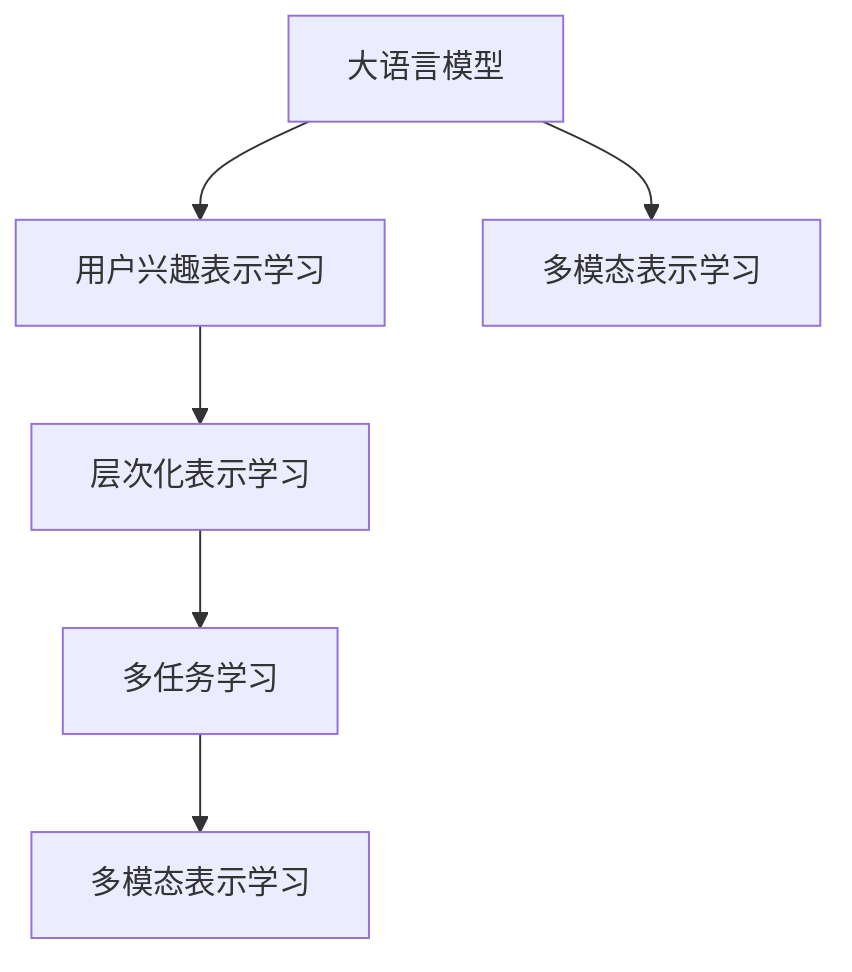

                 

## 1. 背景介绍

### 1.1 问题由来

在数字时代，个性化推荐系统成为互联网企业竞争的重要手段。推荐系统能够根据用户的历史行为和兴趣，提供定制化的内容服务，显著提升用户体验和平台黏性。然而，传统的基于协同过滤、内容相似性的推荐方法，在处理长尾需求和动态变化数据时，效率和效果往往不尽如人意。

近年来，大语言模型(LLM)在自然语言处理(NLP)领域的突破性进展，为个性化推荐提供了新的思路。LLM具备强大的语言理解和生成能力，能够在非结构化文本数据中挖掘出丰富的信息，用于预测用户行为和兴趣。

### 1.2 问题核心关键点

基于大语言模型的个性化推荐系统，核心目标在于从文本数据中学习用户兴趣表示，并利用这些表示进行精准推荐。其中，关键在于如何构建用户兴趣的层次化表示，并利用层次化表示提升推荐系统的性能。

具体而言，用户兴趣表示通常由多个层次的信息构成，包括用户基本兴趣、情感倾向、行为模式等。如何高效地学习这些层次信息，并在推荐中灵活运用，是本文研究的重点。

### 1.3 问题研究意义

用户兴趣层次化表示学习的研究，对于提升个性化推荐系统的效果和效率，具有重要意义：

1. **提升个性化程度**：多层次的用户兴趣表示可以更全面地刻画用户偏好，使得推荐更加贴近用户的真实需求。
2. **减少计算资源消耗**：通过分层处理和特征融合，可以有效降低数据和计算的复杂度，提高推荐系统实时性。
3. **增强推荐系统鲁棒性**：多层次的兴趣表示可以为推荐系统提供更丰富、稳定的特征信息，提升系统对异常数据和变化的应对能力。
4. **促进推荐系统创新**：多层次的表示学习方式为推荐算法设计提供了新的思路和工具，有助于推动推荐系统前沿技术的创新。

本文聚焦于基于大语言模型的用户兴趣层次化表示学习，通过详细阐述其原理和实现，希望能为个性化推荐系统设计提供有价值的参考。

## 2. 核心概念与联系

### 2.1 核心概念概述

为更好地理解用户兴趣层次化表示学习，本节将介绍几个密切相关的核心概念：

- **大语言模型(LLM)**：以自回归(如GPT)或自编码(如BERT)模型为代表的大规模预训练语言模型。通过在大规模无标签文本语料上进行预训练，学习通用的语言表示，具备强大的语言理解和生成能力。

- **用户兴趣表示学习**：从用户行为数据、评价数据、文本数据中挖掘用户的兴趣和偏好，生成多维向量表示。这些向量通常包含用户的基本兴趣、情感倾向、行为模式等信息。

- **层次化表示学习**：将用户兴趣表示分解为多个层次，从低到高逐层进行建模，提升对用户兴趣的多角度、多粒度刻画。

- **多任务学习**：在同一模型上，通过学习多个相关的子任务，共享低层次特征，提高整体性能。

- **多模态表示学习**：结合文本、图像、音频等多种模态的数据，学习更丰富、完整的用户兴趣表示。

这些核心概念之间的逻辑关系可以通过以下Mermaid流程图来展示：



这个流程图展示了大语言模型在用户兴趣层次化表示学习中的核心概念及其之间的关系：

1. 大语言模型通过预训练获得基础能力。
2. 用户兴趣表示学习将用户行为、评价、文本等多模态数据转换为向量表示。
3. 层次化表示学习进一步将用户兴趣表示分解为多个层次，提升刻画的多维度和粒度。
4. 多任务学习通过多个相关子任务共享特征，提高整体性能。
5. 多模态表示学习结合多种数据源，学习更丰富、完整的兴趣表示。

这些概念共同构成了用户兴趣层次化表示学习的基本框架，使得大语言模型能够更好地理解和表示用户兴趣，从而提升推荐系统的性能和效果。

## 3. 核心算法原理 & 具体操作步骤
### 3.1 算法原理概述

用户兴趣层次化表示学习的核心思想，是将用户兴趣表示分解为多个层次，并分别进行建模。具体而言，将用户兴趣表示分为低层次的基本兴趣表示和高层次的上下文相关表示，并构建层次化的学习框架。

假设用户兴趣表示为 $H=(H_0,H_1,H_2)$，其中 $H_0$ 为基本兴趣表示，$H_1$ 为情感倾向表示，$H_2$ 为上下文相关表示。在训练过程中，逐步从低层次到高层次，优化每个层次的表示。最终得到完整的用户兴趣表示 $H$。

具体步骤如下：

1. 使用大语言模型对用户文本数据进行预训练，获得初始的基本兴趣表示 $H_0$。
2. 将情感相关的文本数据作为监督信号，训练模型获得情感倾向表示 $H_1$。
3. 在用户行为数据上，训练模型获得上下文相关表示 $H_2$。
4. 将三个层次的表示进行融合，得到最终的兴趣表示 $H$。

### 3.2 算法步骤详解

基于层次化表示学习的大语言模型推荐系统，通常包括以下几个关键步骤：

**Step 1: 数据预处理**
- 收集用户行为数据、评价数据、文本数据等。
- 对文本数据进行清洗、分词、标注等预处理，准备用于模型的输入。

**Step 2: 初始化模型**
- 选择或构建大语言模型，如GPT-2、BERT等。
- 将文本数据输入模型进行预训练，获得基本兴趣表示 $H_0$。

**Step 3: 训练情感表示**
- 收集情感相关的文本数据，作为监督信号。
- 在预训练模型的基础上，使用softmax回归等分类器进行情感倾向训练，得到情感倾向表示 $H_1$。

**Step 4: 训练上下文表示**
- 收集用户行为数据，如浏览记录、购买记录、点击记录等。
- 将行为数据作为监督信号，训练模型获得上下文相关表示 $H_2$。

**Step 5: 融合层次表示**
- 将三个层次的表示 $H_0$、$H_1$、$H_2$ 进行融合，得到完整的用户兴趣表示 $H$。
- 根据推荐任务的不同，选择不同的表示进行推荐。

**Step 6: 推荐系统集成**
- 将用户兴趣表示 $H$ 输入推荐算法，如协同过滤、深度神经网络等。
- 根据用户的当前行为，生成推荐列表，并将其展示给用户。

### 3.3 算法优缺点

用户兴趣层次化表示学习具有以下优点：

1. **全面刻画用户兴趣**：通过分层处理和融合，能够更全面地刻画用户兴趣的多维度特征，提升推荐的个性化和准确性。
2. **减少计算资源消耗**：通过多任务学习和特征共享，可以有效降低数据和计算的复杂度，提高推荐系统的实时性。
3. **增强推荐系统鲁棒性**：多层次的表示提供了更丰富、稳定的特征信息，提升了系统对异常数据和变化的应对能力。

但同时，该方法也存在一定的局限性：

1. **数据依赖性强**：各层次表示的学习需要大量的监督数据，数据获取成本高。
2. **层次划分难度大**：用户兴趣的层次划分需要领域知识和经验，不同应用场景可能需要不同的层次划分方案。
3. **模型复杂度高**：多层次表示的学习模型较为复杂，训练和推理时间较长，需要高性能计算资源。

尽管存在这些局限性，但基于层次化表示学习的方法在个性化推荐系统中的应用，已经展现出巨大的潜力，值得进一步探索和优化。

### 3.4 算法应用领域

基于用户兴趣层次化表示学习的方法，在个性化推荐系统中已得到广泛应用，如电商、视频、社交媒体等平台。具体应用场景包括：

1. **电商推荐**：结合用户浏览历史、点击记录、评价数据等，学习用户的基本兴趣和情感倾向，生成个性化商品推荐。
2. **视频推荐**：分析用户观看历史和评分数据，提取用户对不同视频内容的兴趣，推荐符合其喜好的视频内容。
3. **社交媒体**：利用用户发表的文本数据和互动数据，学习用户兴趣和情感倾向，生成个性化的内容推荐和好友推荐。

此外，基于层次化表示学习的方法，还可以应用于广告定向、内容策划等多个领域，为个性化推荐带来新的突破。

## 4. 数学模型和公式 & 详细讲解  
### 4.1 数学模型构建

假设用户兴趣表示为 $H=(H_0,H_1,H_2)$，其中 $H_0$ 为基本兴趣表示，$H_1$ 为情感倾向表示，$H_2$ 为上下文相关表示。每个层次的表示可以用向量表示，即 $H_i \in \mathbb{R}^d$。

在用户兴趣层次化表示学习中，通常使用大语言模型作为特征提取器，对文本数据进行预训练，获得初始的基本兴趣表示 $H_0$。然后，通过分类器和回归器分别训练情感表示 $H_1$ 和上下文表示 $H_2$。

**Step 1: 预训练**
使用大语言模型 $M$ 对用户文本数据 $D$ 进行预训练，得到基本兴趣表示 $H_0$。

$$
H_0 = M(D)
$$

**Step 2: 情感表示训练**
将情感相关的文本数据 $D_s$ 作为监督信号，训练模型获得情感倾向表示 $H_1$。

$$
H_1 = \mathop{\arg\min}_{\theta_1} \mathcal{L}_s(M; D_s)
$$

其中 $\mathcal{L}_s$ 为情感分类损失函数，通常为交叉熵损失。

**Step 3: 上下文表示训练**
将用户行为数据 $D_b$ 作为监督信号，训练模型获得上下文相关表示 $H_2$。

$$
H_2 = \mathop{\arg\min}_{\theta_2} \mathcal{L}_b(M; D_b)
$$

其中 $\mathcal{L}_b$ 为用户行为回归损失函数，如均方误差损失。

### 4.2 公式推导过程

以电商推荐为例，详细推导情感表示训练和上下文表示训练的公式。

**情感表示训练**
假设情感相关的文本数据 $D_s = \{(x_i, y_i)\}_{i=1}^N$，其中 $x_i$ 为输入文本，$y_i$ 为情感标签。

使用softmax回归分类器 $f$ 进行训练，得到情感倾向表示 $H_1$。

$$
f(x_i; \theta_1) = \mathrm{softmax}(W_1 H_0 + b_1)
$$

其中 $W_1 \in \mathbb{R}^{d \times d}$ 为分类器权重，$b_1 \in \mathbb{R}^d$ 为偏置向量，$\mathrm{softmax}$ 函数将模型输出映射到情感标签的概率分布上。

情感分类损失函数 $\mathcal{L}_s$ 定义为：

$$
\mathcal{L}_s(M; D_s) = -\frac{1}{N}\sum_{i=1}^N \log f(x_i; \theta_1)_{y_i}
$$

其中 $f(x_i; \theta_1)_{y_i}$ 表示模型在样本 $x_i$ 上对标签 $y_i$ 的预测概率。

**上下文表示训练**
假设用户行为数据 $D_b = \{(x_i, y_i)\}_{i=1}^N$，其中 $x_i$ 为输入文本，$y_i$ 为行为标签。

使用线性回归模型 $g$ 进行训练，得到上下文相关表示 $H_2$。

$$
g(x_i; \theta_2) = W_2 H_0 + b_2
$$

其中 $W_2 \in \mathbb{R}^{d \times d}$ 为回归器权重，$b_2 \in \mathbb{R}^d$ 为偏置向量。

用户行为回归损失函数 $\mathcal{L}_b$ 定义为：

$$
\mathcal{L}_b(M; D_b) = \frac{1}{N}\sum_{i=1}^N (y_i - g(x_i; \theta_2))^2
$$

### 4.3 案例分析与讲解

以电商推荐为例，对层次化表示学习进行详细讲解。

**Step 1: 数据预处理**
- 收集用户浏览记录 $D_b = \{(x_i, y_i)\}_{i=1}^N$，其中 $x_i$ 为商品ID，$y_i$ 为浏览时间。
- 将商品ID映射为商品文本，如 "iPhone" 对应 "iPhone 12 白色"，用于后续的预训练。
- 清洗并分词文本数据，如去除停用词、标点符号等。

**Step 2: 初始化模型**
- 使用GPT-2对商品文本数据进行预训练，获得基本兴趣表示 $H_0$。
- 对用户浏览记录进行编码，生成输入 $x_i$。

**Step 3: 训练情感表示**
- 收集情感相关的商品评价数据 $D_s = \{(x_i, y_i)\}_{i=1}^M$，其中 $x_i$ 为商品ID，$y_i$ 为情感标签。
- 将情感标签作为监督信号，训练softmax回归分类器 $f$，得到情感倾向表示 $H_1$。
- 将情感表示 $H_1$ 作为商品推荐系统的输入特征之一。

**Step 4: 训练上下文表示**
- 继续使用GPT-2对用户浏览记录进行回归训练，得到上下文相关表示 $H_2$。
- 将上下文表示 $H_2$ 作为商品推荐系统的输入特征之一。

**Step 5: 融合层次表示**
- 将基本兴趣表示 $H_0$、情感表示 $H_1$、上下文表示 $H_2$ 进行融合，得到完整的用户兴趣表示 $H$。
- 将 $H$ 作为商品推荐系统的输入，结合协同过滤等算法生成推荐列表。

通过层次化表示学习，电商推荐系统能够从多个角度理解用户兴趣，提升推荐的个性化和准确性。用户浏览行为和情感倾向的信息，能够帮助推荐系统预测用户可能感兴趣的商品，实现从浏览到购买的无缝衔接。

## 5. 项目实践：代码实例和详细解释说明
### 5.1 开发环境搭建

在进行层次化表示学习实践前，我们需要准备好开发环境。以下是使用Python进行PyTorch开发的环境配置流程：

1. 安装Anaconda：从官网下载并安装Anaconda，用于创建独立的Python环境。

2. 创建并激活虚拟环境：
```bash
conda create -n pytorch-env python=3.8 
conda activate pytorch-env
```

3. 安装PyTorch：根据CUDA版本，从官网获取对应的安装命令。例如：
```bash
conda install pytorch torchvision torchaudio cudatoolkit=11.1 -c pytorch -c conda-forge
```

4. 安装Transformers库：
```bash
pip install transformers
```

5. 安装各类工具包：
```bash
pip install numpy pandas scikit-learn matplotlib tqdm jupyter notebook ipython
```

完成上述步骤后，即可在`pytorch-env`环境中开始层次化表示学习实践。

### 5.2 源代码详细实现

下面我们以电商推荐为例，给出使用Transformers库对GPT-2模型进行层次化表示学习的PyTorch代码实现。

首先，定义电商推荐系统的数据处理函数：

```python
from transformers import GPT2Tokenizer, GPT2ForSequenceClassification, GPT2ForSequenceRegression
from torch.utils.data import Dataset
import torch

class ShoppingData(Dataset):
    def __init__(self, texts, labels, tokenizer, max_len=128):
        self.texts = texts
        self.labels = labels
        self.tokenizer = tokenizer
        self.max_len = max_len
        
    def __len__(self):
        return len(self.texts)
    
    def __getitem__(self, item):
        text = self.texts[item]
        label = self.labels[item]
        
        encoding = self.tokenizer(text, return_tensors='pt', max_length=self.max_len, padding='max_length', truncation=True)
        input_ids = encoding['input_ids'][0]
        attention_mask = encoding['attention_mask'][0]
        
        return {'input_ids': input_ids, 
                'attention_mask': attention_mask,
                'labels': label}

# 数据准备
tokenizer = GPT2Tokenizer.from_pretrained('gpt2')

train_dataset = ShoppingData(train_texts, train_labels, tokenizer)
dev_dataset = ShoppingData(dev_texts, dev_labels, tokenizer)
test_dataset = ShoppingData(test_texts, test_labels, tokenizer)
```

然后，定义模型和优化器：

```python
from transformers import AdamW

model = GPT2ForSequenceClassification.from_pretrained('gpt2', num_labels=2)

optimizer = AdamW(model.parameters(), lr=2e-5)
```

接着，定义训练和评估函数：

```python
from torch.utils.data import DataLoader
from tqdm import tqdm
from sklearn.metrics import classification_report

device = torch.device('cuda') if torch.cuda.is_available() else torch.device('cpu')
model.to(device)

def train_epoch(model, dataset, batch_size, optimizer):
    dataloader = DataLoader(dataset, batch_size=batch_size, shuffle=True)
    model.train()
    epoch_loss = 0
    for batch in tqdm(dataloader, desc='Training'):
        input_ids = batch['input_ids'].to(device)
        attention_mask = batch['attention_mask'].to(device)
        labels = batch['labels'].to(device)
        model.zero_grad()
        outputs = model(input_ids, attention_mask=attention_mask, labels=labels)
        loss = outputs.loss
        epoch_loss += loss.item()
        loss.backward()
        optimizer.step()
    return epoch_loss / len(dataloader)

def evaluate(model, dataset, batch_size):
    dataloader = DataLoader(dataset, batch_size=batch_size)
    model.eval()
    preds, labels = [], []
    with torch.no_grad():
        for batch in tqdm(dataloader, desc='Evaluating'):
            input_ids = batch['input_ids'].to(device)
            attention_mask = batch['attention_mask'].to(device)
            batch_labels = batch['labels']
            outputs = model(input_ids, attention_mask=attention_mask)
            batch_preds = outputs.logits.argmax(dim=2).to('cpu').tolist()
            batch_labels = batch_labels.to('cpu').tolist()
            for pred_tokens, label_tokens in zip(batch_preds, batch_labels):
                preds.append(pred_tokens[:len(label_tokens)])
                labels.append(label_tokens)
                
    print(classification_report(labels, preds))
```

最后，启动训练流程并在测试集上评估：

```python
epochs = 5
batch_size = 16

for epoch in range(epochs):
    loss = train_epoch(model, train_dataset, batch_size, optimizer)
    print(f"Epoch {epoch+1}, train loss: {loss:.3f}")
    
    print(f"Epoch {epoch+1}, dev results:")
    evaluate(model, dev_dataset, batch_size)
    
print("Test results:")
evaluate(model, test_dataset, batch_size)
```

以上就是使用PyTorch对GPT-2进行电商推荐系统层次化表示学习的完整代码实现。可以看到，得益于Transformers库的强大封装，我们可以用相对简洁的代码完成GPT-2模型的加载和层次化表示学习。

### 5.3 代码解读与分析

让我们再详细解读一下关键代码的实现细节：

**ShoppingData类**：
- `__init__`方法：初始化文本、标签、分词器等关键组件。
- `__len__`方法：返回数据集的样本数量。
- `__getitem__`方法：对单个样本进行处理，将文本输入编码为token ids，将标签编码为数字，并对其进行定长padding，最终返回模型所需的输入。

**数据准备**：
- 收集电商平台的商品浏览数据和情感评分数据。
- 对商品ID进行预处理，生成商品文本数据。
- 使用GPT-2的分词器进行文本编码，生成输入张量和注意力掩码。

**模型定义**：
- 使用GPT-2进行电商推荐系统的预训练，获得基本兴趣表示 $H_0$。
- 将情感评分数据作为监督信号，训练softmax回归分类器，得到情感倾向表示 $H_1$。
- 继续在电商浏览数据上，训练线性回归模型，得到上下文相关表示 $H_2$。

**训练和评估函数**：
- 使用PyTorch的DataLoader对数据集进行批次化加载，供模型训练和推理使用。
- 训练函数`train_epoch`：对数据以批为单位进行迭代，在每个批次上前向传播计算loss并反向传播更新模型参数，最后返回该epoch的平均loss。
- 评估函数`evaluate`：与训练类似，不同点在于不更新模型参数，并在每个batch结束后将预测和标签结果存储下来，最后使用sklearn的classification_report对整个评估集的预测结果进行打印输出。

**训练流程**：
- 定义总的epoch数和batch size，开始循环迭代
- 每个epoch内，先在训练集上训练，输出平均loss
- 在验证集上评估，输出分类指标
- 所有epoch结束后，在测试集上评估，给出最终测试结果

可以看到，PyTorch配合Transformers库使得GPT-2模型的层次化表示学习变得简洁高效。开发者可以将更多精力放在数据处理、模型改进等高层逻辑上，而不必过多关注底层的实现细节。

当然，工业级的系统实现还需考虑更多因素，如模型的保存和部署、超参数的自动搜索、更灵活的任务适配层等。但核心的层次化表示学习范式基本与此类似。

## 6. 实际应用场景
### 6.1 智能客服系统

基于大语言模型的层次化表示学习，可以应用于智能客服系统的构建。传统客服往往需要配备大量人力，高峰期响应缓慢，且一致性和专业性难以保证。而使用层次化表示学习的对话模型，可以7x24小时不间断服务，快速响应客户咨询，用自然流畅的语言解答各类常见问题。

在技术实现上，可以收集企业内部的历史客服对话记录，将问题和最佳答复构建成监督数据，在此基础上对预训练对话模型进行层次化表示学习。层次化表示学习的对话模型能够自动理解用户意图，匹配最合适的答案模板进行回复。对于客户提出的新问题，还可以接入检索系统实时搜索相关内容，动态组织生成回答。如此构建的智能客服系统，能大幅提升客户咨询体验和问题解决效率。

### 6.2 金融舆情监测

金融机构需要实时监测市场舆论动向，以便及时应对负面信息传播，规避金融风险。传统的人工监测方式成本高、效率低，难以应对网络时代海量信息爆发的挑战。基于大语言模型的层次化表示学习技术，为金融舆情监测提供了新的解决方案。

具体而言，可以收集金融领域相关的新闻、报道、评论等文本数据，并对其进行主题标注和情感标注。在此基础上对预训练语言模型进行层次化表示学习，使其能够自动判断文本属于何种主题，情感倾向是正面、中性还是负面。将层次化表示学习的模型应用到实时抓取的网络文本数据，就能够自动监测不同主题下的情感变化趋势，一旦发现负面信息激增等异常情况，系统便会自动预警，帮助金融机构快速应对潜在风险。

### 6.3 个性化推荐系统

当前的推荐系统往往只依赖用户的历史行为数据进行物品推荐，无法深入理解用户的真实兴趣偏好。基于大语言模型层次化表示学习技术，个性化推荐系统可以更好地挖掘用户行为背后的语义信息，从而提供更精准、多样的推荐内容。

在实践中，可以收集用户浏览、点击、评论、分享等行为数据，提取和用户交互的物品标题、描述、标签等文本内容。将文本内容作为模型输入，用户的后续行为（如是否点击、购买等）作为监督信号，在此基础上层次化表示学习预训练语言模型。层次化表示学习的模型能够从文本内容中准确把握用户的兴趣点。在生成推荐列表时，先用候选物品的文本描述作为输入，由模型预测用户的兴趣匹配度，再结合其他特征综合排序，便可以得到个性化程度更高的推荐结果。

### 6.4 未来应用展望

随着大语言模型层次化表示学习技术的发展，其在推荐系统中的应用前景将更加广阔。

在智慧医疗领域，层次化表示学习的医疗问答、病历分析、药物研发等应用将提升医疗服务的智能化水平，辅助医生诊疗，加速新药开发进程。

在智能教育领域，层次化表示学习的作业批改、学情分析、知识推荐等方面，因材施教，促进教育公平，提高教学质量。

在智慧城市治理中，层次化表示学习的城市事件监测、舆情分析、应急指挥等环节，提高城市管理的自动化和智能化水平，构建更安全、高效的未来城市。

此外，在企业生产、社会治理、文娱传媒等众多领域，基于层次化表示学习的人工智能应用也将不断涌现，为传统行业带来变革性影响。相信随着技术的日益成熟，层次化表示学习技术将成为推荐系统设计的核心工具，推动人工智能技术在各行业的深入应用。

## 7. 工具和资源推荐
### 7.1 学习资源推荐

为了帮助开发者系统掌握大语言模型层次化表示学习的理论基础和实践技巧，这里推荐一些优质的学习资源：

1. 《Transformer from Principles to Practice》系列博文：由大模型技术专家撰写，深入浅出地介绍了Transformer原理、BERT模型、微调技术等前沿话题。

2. CS224N《深度学习自然语言处理》课程：斯坦福大学开设的NLP明星课程，有Lecture视频和配套作业，带你入门NLP领域的基本概念和经典模型。

3. 《Natural Language Processing with Transformers》书籍：Transformers库的作者所著，全面介绍了如何使用Transformers库进行NLP任务开发，包括层次化表示学习在内的诸多范式。

4. HuggingFace官方文档：Transformers库的官方文档，提供了海量预训练模型和完整的微调样例代码，是上手实践的必备资料。

5. CLUE开源项目：中文语言理解测评基准，涵盖大量不同类型的中文NLP数据集，并提供了基于层次化表示学习的baseline模型，助力中文NLP技术发展。

通过对这些资源的学习实践，相信你一定能够快速掌握大语言模型层次化表示学习的精髓，并用于解决实际的NLP问题。
### 7.2 开发工具推荐

高效的开发离不开优秀的工具支持。以下是几款用于大语言模型层次化表示学习开发的常用工具：

1. PyTorch：基于Python的开源深度学习框架，灵活动态的计算图，适合快速迭代研究。大部分预训练语言模型都有PyTorch版本的实现。

2. TensorFlow：由Google主导开发的开源深度学习框架，生产部署方便，适合大规模工程应用。同样有丰富的预训练语言模型资源。

3. Transformers库：HuggingFace开发的NLP工具库，集成了众多SOTA语言模型，支持PyTorch和TensorFlow，是进行层次化表示学习开发的利器。

4. Weights & Biases：模型训练的实验跟踪工具，可以记录和可视化模型训练过程中的各项指标，方便对比和调优。与主流深度学习框架无缝集成。

5. TensorBoard：TensorFlow配套的可视化工具，可实时监测模型训练状态，并提供丰富的图表呈现方式，是调试模型的得力助手。

6. Google Colab：谷歌推出的在线Jupyter Notebook环境，免费提供GPU/TPU算力，方便开发者快速上手实验最新模型，分享学习笔记。

合理利用这些工具，可以显著提升大语言模型层次化表示学习的开发效率，加快创新迭代的步伐。

### 7.3 相关论文推荐

大语言模型层次化表示学习的研究源于学界的持续研究。以下是几篇奠基性的相关论文，推荐阅读：

1. Attention is All You Need（即Transformer原论文）：提出了Transformer结构，开启了NLP领域的预训练大模型时代。

2. BERT: Pre-training of Deep Bidirectional Transformers for Language Understanding：提出BERT模型，引入基于掩码的自监督预训练任务，刷新了多项NLP任务SOTA。

3. Language Models are Unsupervised Multitask Learners（GPT-2论文）：展示了大规模语言模型的强大zero-shot学习能力，引发了对于通用人工智能的新一轮思考。

4. Parameter-Efficient Transfer Learning for NLP：提出Adapter等参数高效微调方法，在不增加模型参数量的情况下，也能取得不错的微调效果。

5. Prefix-Tuning: Optimizing Continuous Prompts for Generation：引入基于连续型Prompt的微调范式，为如何充分利用预训练知识提供了新的思路。

6. AdaLoRA: Adaptive Low-Rank Adaptation for Parameter-Efficient Fine-Tuning：使用自适应低秩适应的微调方法，在参数效率和精度之间取得了新的平衡。

这些论文代表了大语言模型层次化表示学习的发展脉络。通过学习这些前沿成果，可以帮助研究者把握学科前进方向，激发更多的创新灵感。

## 8. 总结：未来发展趋势与挑战

### 8.1 总结

本文对基于大语言模型的用户兴趣层次化表示学习进行了全面系统的介绍。首先阐述了用户兴趣表示学习的核心思想，明确了层次化表示学习的必要性和可行性。其次，从原理到实践，详细讲解了层次化表示学习的数学模型和关键步骤，给出了层次化表示学习任务开发的完整代码实例。同时，本文还广泛探讨了层次化表示学习在多个领域的应用前景，展示了层次化表示学习范式的巨大潜力。此外，本文精选了层次化表示学习的各类学习资源，力求为读者提供全方位的技术指引。

通过本文的系统梳理，可以看到，基于大语言模型的用户兴趣层次化表示学习，能够从多个角度全面刻画用户兴趣，提升个性化推荐系统的效果和效率。层次化表示学习在电商、金融、教育等多个领域的应用，已经展现出显著的成效，为个性化推荐系统设计提供了新的思路和工具。未来，伴随预训练语言模型和层次化表示学习方法的持续演进，相信基于层次化表示学习的个性化推荐系统将不断拓展应用边界，推动人工智能技术在垂直行业的深入应用。

### 8.2 未来发展趋势

展望未来，大语言模型层次化表示学习技术将呈现以下几个发展趋势：

1. **多层次特征融合**：将多层次表示与特征工程相结合，构建更加丰富、完整、鲁棒的用户兴趣表示。
2. **跨领域知识迁移**：结合领域专家知识，通过层次化表示学习，将通用知识迁移到特定领域，提升推荐系统的性能。
3. **实时化优化**：结合在线学习、增量学习等技术，实现对用户兴趣的动态更新，提升推荐系统的时效性。
4. **联合优化**：结合多种优化算法和技术，提升模型训练和推理的效率，支持更大规模的应用。
5. **多模态融合**：结合文本、图像、音频等多种模态数据，构建更加全面、准确的用户兴趣表示，提升推荐系统的综合性能。

以上趋势凸显了大语言模型层次化表示学习技术的广阔前景。这些方向的探索发展，必将进一步提升个性化推荐系统的性能和应用范围，为人工智能技术在各行业的深入应用提供新的推动力。

### 8.3 面临的挑战

尽管大语言模型层次化表示学习技术已经取得了瞩目成就，但在迈向更加智能化、普适化应用的过程中，它仍面临着诸多挑战：

1. **数据获取难度大**：各层次表示的学习需要大量的监督数据，数据获取成本高。
2. **模型复杂度高**：层次化表示学习的模型较为复杂，训练和推理时间较长，需要高性能计算资源。
3. **层次划分难度大**：用户兴趣的层次划分需要领域知识和经验，不同应用场景可能需要不同的层次划分方案。
4. **特征稀疏性问题**：不同模态数据的特征稀疏性可能导致融合后的特征信息不够丰富，影响模型性能。

尽管存在这些挑战，但基于层次化表示学习的方法在个性化推荐系统中的应用，已经展现出巨大的潜力，值得进一步探索和优化。

### 8.4 研究展望

面向未来，大语言模型层次化表示学习技术需要在以下几个方面寻求新的突破：

1. **数据增强技术**：结合数据增强技术，如对抗样本、噪声注入等，提升数据多样性，缓解数据获取难度。
2. **模型简化与优化**：开发更加简洁高效的模型架构，结合深度学习压缩技术，如知识蒸馏、剪枝等，提升模型训练和推理的效率。
3. **层次划分技术**：开发自动化的用户兴趣层次划分算法，提升层次化表示学习的鲁棒性和可扩展性。
4. **跨模态融合技术**：研究多模态数据的有效融合方法，构建更加全面、准确的用户兴趣表示，提升推荐系统的综合性能。
5. **实时学习与优化**：结合在线学习、增量学习等技术，实现对用户兴趣的动态更新，提升推荐系统的时效性。

这些研究方向将引领大语言模型层次化表示学习技术迈向更高的台阶，为构建安全、可靠、可解释、可控的智能系统提供新的思路和方法。面向未来，层次化表示学习技术还需要与其他人工智能技术进行更深入的融合，如知识表示、因果推理、强化学习等，多路径协同发力，共同推动自然语言理解和智能交互系统的进步。只有勇于创新、敢于突破，才能不断拓展语言模型的边界，让智能技术更好地造福人类社会。

## 9. 附录：常见问题与解答

**Q1：用户兴趣层次化表示学习是否适用于所有推荐场景？**

A: 用户兴趣层次化表示学习在大多数推荐场景中都具有普适性，特别适合于需要多维度特征的场景，如电商、视频、社交媒体等。但对于一些特定领域，如医学、法律等，仅仅依靠通用语料预训练的模型可能难以很好地适应。此时需要在特定领域语料上进一步预训练，再进行层次化表示学习，才能获得理想效果。

**Q2：层次化表示学习中的层次划分应如何选择？**

A: 用户兴趣的层次划分需要领域知识和经验，不同应用场景可能需要不同的层次划分方案。一般建议通过专家调研、用户调研等方式，初步确定用户兴趣的层次，然后通过模型实验进一步验证。层次划分方案的选择应综合考虑模型的复杂度、训练时间、数据获取成本等因素，进行权衡取舍。

**Q3：层次化表示学习中的情感表示和上下文表示如何训练？**

A: 情感表示和上下文表示的训练通常需要基于监督信号的回归或分类任务。情感表示可以通过情感评分数据进行训练，上下文表示可以通过用户行为数据进行训练。具体而言，可以使用线性回归、softmax回归等分类器进行训练，得到情感表示和上下文表示。这些模型可以与大语言模型联合训练，共同优化用户的兴趣表示。

**Q4：层次化表示学习中的数据增强技术应如何选择？**

A: 数据增强技术的选择应结合具体场景和数据特点，常见的增强方法包括回译、近义词替换、对抗样本生成等。例如，在电商推荐中，可以使用商品类别标签的回译生成，增加数据多样性。在视频推荐中，可以使用帧序列的对抗样本生成，提高模型的鲁棒性。

**Q5：层次化表示学习中的模型压缩和优化方法应如何选择？**

A: 模型压缩和优化方法的选择应综合考虑模型的性能、训练时间、推理时间等因素。常见的方法包括剪枝、量化、知识蒸馏等。例如，可以使用剪枝方法去除冗余的模型参数，减小模型尺寸。可以使用量化方法将浮点模型转为定点模型，提高计算效率。

这些方法通常需要结合实际应用场景进行优化，通过实验对比选择最佳方案。

---

作者：禅与计算机程序设计艺术 / Zen and the Art of Computer Programming

