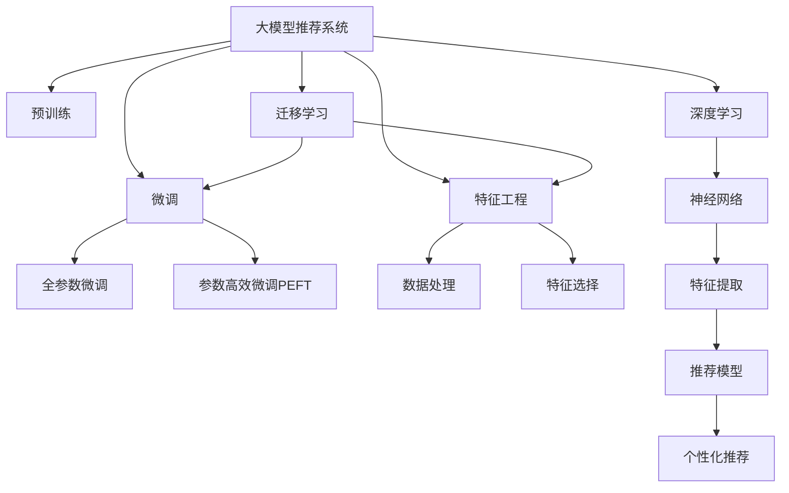

                 

# 基于大模型的推荐系统特征工程优化

> 关键词：大模型推荐系统，特征工程，数据处理，深度学习，推荐系统

## 1. 背景介绍

### 1.1 问题由来
在当下这个数据爆炸的时代，信息过载已经成为了一个普遍的问题。如何从海量的数据中，为用户推荐他们真正感兴趣的物品，成为了一个亟待解决的问题。传统的推荐系统往往依赖于手工设计的特征和简单的机器学习模型，难以应对复杂多变的需求。而随着深度学习技术的发展，基于大模型的推荐系统应运而生，通过大规模预训练语言模型在用户行为数据上的微调，学习到用户兴趣的丰富表示，从而能够更精准地进行个性化推荐。

### 1.2 问题核心关键点
大模型推荐系统的主要思想是通过大规模预训练语言模型在用户行为数据上的微调，学习到用户兴趣的丰富表示，从而进行个性化推荐。然而，由于预训练模型具有非常复杂的结构，直接应用于推荐系统可能导致模型复杂度过高，难以在大规模数据上训练和部署。因此，如何在大模型推荐系统中进行有效的特征工程优化，成为了一个重要的研究方向。

## 2. 核心概念与联系

### 2.1 核心概念概述

为更好地理解基于大模型的推荐系统特征工程优化，本节将介绍几个密切相关的核心概念：

- 大模型推荐系统(Large Model Recommendation System, LMR)：利用预训练语言模型进行推荐系统开发的范式。通过在大规模无标签数据上预训练通用语言模型，再通过微调学习用户行为数据中的个性化信息。

- 预训练(Pre-training)：指在大规模无标签数据上，通过自监督学习任务训练通用语言模型的过程。常见的预训练任务包括掩码语言模型、下一句预测等。

- 微调(Fine-tuning)：指在预训练模型的基础上，使用推荐系统任务的数据，通过有监督学习优化模型在推荐任务上的性能。通常只需要调整顶层分类器或解码器，并以较小的学习率更新全部或部分的模型参数。

- 特征工程(Feature Engineering)：指在推荐系统开发中，对原始数据进行预处理、选择、构建等操作，以提升模型的预测能力和泛化能力。

- 深度学习(Deep Learning)：基于神经网络结构的机器学习算法，利用多层次的非线性变换提取数据的高级特征表示，适用于复杂的数据处理和模式识别任务。

- 推荐系统(Recommendation System)：利用用户的历史行为数据和物品属性信息，为用户推荐符合其兴趣和需求的物品的技术。

- 迁移学习(Transfer Learning)：指将一个领域学习到的知识，迁移应用到另一个不同但相关的领域的学习范式。大模型的预训练-微调过程即是一种典型的迁移学习方式。

- 自监督学习(Self-supervised Learning)：指利用无标签数据，通过自学习的方式训练模型，获取数据的内在结构和表示方式。

这些核心概念之间的逻辑关系可以通过以下Mermaid流程图来展示：



这个流程图展示了大模型推荐系统的核心概念及其之间的关系：

1. 大模型推荐系统通过预训练获得基础能力。
2. 微调是对预训练模型进行推荐任务特定的优化，可以分为全参数微调和参数高效微调（PEFT）。
3. 特征工程是推荐系统开发的底层技术，用于提升数据的可利用性和模型的预测性能。
4. 深度学习是特征工程的重要工具，用于提取数据中的高级特征表示。
5. 迁移学习是连接预训练模型与推荐任务的目标，可以通过微调或特征工程实现。

这些概念共同构成了大模型推荐系统的学习和应用框架，使其能够在各种场景下发挥强大的推荐能力。通过理解这些核心概念，我们可以更好地把握大模型推荐系统的设计原则和优化方法。

## 3. 核心算法原理 & 具体操作步骤
### 3.1 算法原理概述

基于大模型的推荐系统特征工程优化，本质上是一个有监督的特征提取和微调过程。其核心思想是：将大模型预训练的通用语言表示，与推荐系统的任务数据进行融合，优化模型在该推荐任务上的性能。

形式化地，假设预训练模型为 $M_{\theta}$，其中 $\theta$ 为预训练得到的模型参数。给定推荐系统任务 $T$ 的数据集 $D=\{(x_i,y_i)\}_{i=1}^N, x_i \in \mathcal{X}, y_i \in \mathcal{Y}$，特征工程优化的优化目标是最小化经验风险，即找到最优参数：

$$
\theta^* = \mathop{\arg\min}_{\theta} \mathcal{L}(M_{\theta},D)
$$

其中 $\mathcal{L}$ 为针对任务 $T$ 设计的损失函数，用于衡量模型预测输出与真实标签之间的差异。常见的损失函数包括交叉熵损失、均方误差损失等。

通过梯度下降等优化算法，特征工程优化过程不断更新模型参数 $\theta$，最小化损失函数 $\mathcal{L}$，使得模型输出逼近真实标签。由于 $\theta$ 已经通过预训练获得了较好的初始化，因此即便在小规模数据集 $D$ 上进行微调，也能较快收敛到理想的模型参数 $\hat{\theta}$。

### 3.2 算法步骤详解

基于大模型的推荐系统特征工程优化一般包括以下几个关键步骤：

**Step 1: 准备预训练模型和数据集**
- 选择合适的预训练语言模型 $M_{\theta}$ 作为初始化参数，如 BERT、GPT等。
- 准备推荐系统任务 $T$ 的数据集 $D$，划分为训练集、验证集和测试集。一般要求数据集与预训练数据的分布不要差异过大。

**Step 2: 设计特征处理流程**
- 对原始用户行为数据进行数据清洗，去除噪声和异常值。
- 对用户行为数据进行分词、向量化处理，以适应模型输入格式。
- 根据推荐系统任务需求，选择和构建关键特征，如用户兴趣向量、物品属性向量等。

**Step 3: 设置特征工程超参数**
- 选择合适的特征选择和融合方法，如因子分解、向量拼接等。
- 设置特征工程超参数，如特征权重、正则化系数等。

**Step 4: 执行梯度训练**
- 将训练集数据分批次输入模型，前向传播计算损失函数。
- 反向传播计算参数梯度，根据设定的优化算法和学习率更新模型参数。
- 周期性在验证集上评估模型性能，根据性能指标决定是否触发 Early Stopping。
- 重复上述步骤直到满足预设的迭代轮数或 Early Stopping 条件。

**Step 5: 测试和部署**
- 在测试集上评估优化后的模型 $M_{\hat{\theta}}$ 的性能，对比优化前后的精度提升。
- 使用优化后的模型对新样本进行推荐，集成到实际的应用系统中。
- 持续收集新的数据，定期重新优化模型，以适应数据分布的变化。

以上是基于大模型的推荐系统特征工程优化的一般流程。在实际应用中，还需要针对具体任务的特点，对特征工程过程的各个环节进行优化设计，如改进特征提取方式，引入更多的正则化技术，搜索最优的超参数组合等，以进一步提升模型性能。

### 3.3 算法优缺点

基于大模型的推荐系统特征工程优化方法具有以下优点：
1. 简单高效。只需准备少量标注数据，即可对预训练模型进行快速适配，获得较大的性能提升。
2. 通用适用。适用于各种推荐系统任务，包括协同过滤、内容推荐、上下文推荐等，通过设计不同的特征提取方式即可实现。
3. 参数高效。利用参数高效微调技术，在固定大部分预训练参数的情况下，仍可取得不错的提升。
4. 效果显著。在学术界和工业界的诸多任务上，基于特征工程优化的方法已经刷新了最先进的性能指标。

同时，该方法也存在一定的局限性：
1. 依赖标注数据。特征工程优化的效果很大程度上取决于标注数据的质量和数量，获取高质量标注数据的成本较高。
2. 迁移能力有限。当目标任务与预训练数据的分布差异较大时，特征工程优化的性能提升有限。
3. 负面效果传递。预训练模型的固有偏见、有害信息等，可能通过特征工程优化传递到下游任务，造成负面影响。
4. 可解释性不足。特征工程优化后的模型决策过程通常缺乏可解释性，难以对其推理逻辑进行分析和调试。

尽管存在这些局限性，但就目前而言，基于特征工程优化的推荐方法仍是大模型推荐系统应用的最主流范式。未来相关研究的重点在于如何进一步降低特征工程对标注数据的依赖，提高模型的少样本学习和跨领域迁移能力，同时兼顾可解释性和伦理安全性等因素。

### 3.4 算法应用领域

基于大模型的推荐系统特征工程优化方法，在推荐系统领域已经得到了广泛的应用，覆盖了几乎所有常见任务，例如：

- 协同过滤推荐：通过用户行为数据和物品行为数据，进行用户和物品的相似度计算，推荐用户可能感兴趣的物品。
- 基于内容的推荐：利用物品属性信息，通过文本匹配、标签匹配等方式，推荐与用户兴趣相关的物品。
- 上下文推荐：考虑用户行为的时间、空间等上下文信息，进行个性化推荐。
- 社交网络推荐：利用社交关系数据，进行基于关系链的推荐。

除了上述这些经典任务外，大模型推荐系统特征工程优化方法也被创新性地应用到更多场景中，如实时推荐、推荐效果评估、推荐模型融合等，为推荐系统技术带来了全新的突破。随着预训练语言模型和特征工程方法的持续演进，相信推荐系统技术将在更广阔的应用领域大放异彩。

## 4. 数学模型和公式 & 详细讲解
### 4.1 数学模型构建

本节将使用数学语言对基于大模型的推荐系统特征工程优化过程进行更加严格的刻画。

记预训练语言模型为 $M_{\theta}$，其中 $\theta$ 为预训练得到的模型参数。假设推荐系统任务 $T$ 的训练集为 $D=\{(x_i,y_i)\}_{i=1}^N, x_i \in \mathcal{X}, y_i \in \mathcal{Y}$。

定义模型 $M_{\theta}$ 在数据样本 $(x,y)$ 上的损失函数为 $\ell(M_{\theta}(x),y)$，则在数据集 $D$ 上的经验风险为：

$$
\mathcal{L}(\theta) = \frac{1}{N} \sum_{i=1}^N \ell(M_{\theta}(x_i),y_i)
$$

其中 $\ell$ 为推荐任务上的损失函数，用于衡量模型预测输出与真实标签之间的差异。常见的损失函数包括均方误差损失、交叉熵损失等。

在得到损失函数的梯度后，即可带入参数更新公式，完成模型的迭代优化。重复上述过程直至收敛，最终得到适应推荐系统任务的最优模型参数 $\theta^*$。

### 4.2 公式推导过程

以下我们以协同过滤推荐任务为例，推导均方误差损失函数及其梯度的计算公式。

假设模型 $M_{\theta}$ 在输入 $x$ 上的输出为 $\hat{y}=M_{\theta}(x)$，表示物品与用户的相似度评分。真实标签 $y \in \{1,0\}$。则均方误差损失函数定义为：

$$
\ell(M_{\theta}(x),y) = \frac{1}{2}(y-M_{\theta}(x))^2
$$

将其代入经验风险公式，得：

$$
\mathcal{L}(\theta) = \frac{1}{N} \sum_{i=1}^N \frac{1}{2}(y_i-M_{\theta}(x_i))^2
$$

根据链式法则，损失函数对参数 $\theta_k$ 的梯度为：

$$
\frac{\partial \mathcal{L}(\theta)}{\partial \theta_k} = -\frac{1}{N}\sum_{i=1}^N (y_i-M_{\theta}(x_i)) \frac{\partial M_{\theta}(x_i)}{\partial \theta_k}
$$

其中 $\frac{\partial M_{\theta}(x_i)}{\partial \theta_k}$ 可进一步递归展开，利用自动微分技术完成计算。

在得到损失函数的梯度后，即可带入参数更新公式，完成模型的迭代优化。重复上述过程直至收敛，最终得到适应推荐系统任务的最优模型参数 $\theta^*$。

## 5. 项目实践：代码实例和详细解释说明
### 5.1 开发环境搭建

在进行推荐系统特征工程优化实践前，我们需要准备好开发环境。以下是使用Python进行PyTorch开发的环境配置流程：

1. 安装Anaconda：从官网下载并安装Anaconda，用于创建独立的Python环境。

2. 创建并激活虚拟环境：
```bash
conda create -n pytorch-env python=3.8 
conda activate pytorch-env
```

3. 安装PyTorch：根据CUDA版本，从官网获取对应的安装命令。例如：
```bash
conda install pytorch torchvision torchaudio cudatoolkit=11.1 -c pytorch -c conda-forge
```

4. 安装TensorFlow：
```bash
conda install tensorflow
```

5. 安装PyTorch的Transformer库：
```bash
pip install transformers
```

6. 安装各类工具包：
```bash
pip install numpy pandas scikit-learn matplotlib tqdm jupyter notebook ipython
```

完成上述步骤后，即可在`pytorch-env`环境中开始推荐系统特征工程优化实践。

### 5.2 源代码详细实现

这里我们以协同过滤推荐任务为例，给出使用Transformers库对BERT模型进行特征工程优化的PyTorch代码实现。

首先，定义协同过滤推荐任务的数据处理函数：

```python
from transformers import BertTokenizer, BertModel
from torch.utils.data import Dataset, DataLoader
import torch

class RecommendationDataset(Dataset):
    def __init__(self, user_item_matrix, user_features, item_features):
        self.user_item_matrix = user_item_matrix
        self.user_features = user_features
        self.item_features = item_features
        
    def __len__(self):
        return len(self.user_item_matrix)
    
    def __getitem__(self, item):
        user, item = self.user_item_matrix[item]
        user_vector = self.user_features[user]
        item_vector = self.item_features[item]
        
        return {'user': user_vector, 'item': item_vector}

# 定义用户行为数据和物品属性数据
user_item_matrix = ...
user_features = ...
item_features = ...
```

然后，定义模型和优化器：

```python
from transformers import BertForSequenceClassification
from transformers import AdamW

model = BertForSequenceClassification.from_pretrained('bert-base-cased', num_labels=1)

optimizer = AdamW(model.parameters(), lr=2e-5)
```

接着，定义训练和评估函数：

```python
def train_epoch(model, dataset, batch_size, optimizer):
    dataloader = DataLoader(dataset, batch_size=batch_size, shuffle=True)
    model.train()
    epoch_loss = 0
    for batch in dataloader:
        user_vector = batch['user'].to(device)
        item_vector = batch['item'].to(device)
        model.zero_grad()
        outputs = model(user_vector, item_vector)
        loss = outputs.loss
        epoch_loss += loss.item()
        loss.backward()
        optimizer.step()
    return epoch_loss / len(dataloader)

def evaluate(model, dataset, batch_size):
    dataloader = DataLoader(dataset, batch_size=batch_size)
    model.eval()
    preds, labels = [], []
    with torch.no_grad():
        for batch in dataloader:
            user_vector = batch['user'].to(device)
            item_vector = batch['item'].to(device)
            batch_labels = batch['labels']
            outputs = model(user_vector, item_vector)
            batch_preds = outputs.logits.argmax(dim=1).to('cpu').tolist()
            batch_labels = batch_labels.to('cpu').tolist()
            for pred, label in zip(batch_preds, batch_labels):
                preds.append(pred)
                labels.append(label)
                
    print(classification_report(labels, preds))
```

最后，启动训练流程并在测试集上评估：

```python
epochs = 5
batch_size = 16

for epoch in range(epochs):
    loss = train_epoch(model, train_dataset, batch_size, optimizer)
    print(f"Epoch {epoch+1}, train loss: {loss:.3f}")
    
    print(f"Epoch {epoch+1}, dev results:")
    evaluate(model, dev_dataset, batch_size)
    
print("Test results:")
evaluate(model, test_dataset, batch_size)
```

以上就是使用PyTorch对BERT进行协同过滤推荐任务特征工程优化的完整代码实现。可以看到，得益于Transformers库的强大封装，我们可以用相对简洁的代码完成BERT模型的加载和微调。

### 5.3 代码解读与分析

让我们再详细解读一下关键代码的实现细节：

**RecommendationDataset类**：
- `__init__`方法：初始化用户行为数据、用户特征和物品特征等关键组件。
- `__len__`方法：返回数据集的样本数量。
- `__getitem__`方法：对单个样本进行处理，将用户行为数据和物品属性数据转换为模型所需的格式。

**训练和评估函数**：
- 使用PyTorch的DataLoader对数据集进行批次化加载，供模型训练和推理使用。
- 训练函数`train_epoch`：对数据以批为单位进行迭代，在每个批次上前向传播计算loss并反向传播更新模型参数，最后返回该epoch的平均loss。
- 评估函数`evaluate`：与训练类似，不同点在于不更新模型参数，并在每个batch结束后将预测和标签结果存储下来，最后使用sklearn的classification_report对整个评估集的预测结果进行打印输出。

**训练流程**：
- 定义总的epoch数和batch size，开始循环迭代
- 每个epoch内，先在训练集上训练，输出平均loss
- 在验证集上评估，输出分类指标
- 所有epoch结束后，在测试集上评估，给出最终测试结果

可以看到，PyTorch配合Transformers库使得BERT微调的代码实现变得简洁高效。开发者可以将更多精力放在数据处理、模型改进等高层逻辑上，而不必过多关注底层的实现细节。

当然，工业级的系统实现还需考虑更多因素，如模型的保存和部署、超参数的自动搜索、更灵活的任务适配层等。但核心的微调范式基本与此类似。

## 6. 实际应用场景
### 6.1 电商推荐系统

基于大模型推荐系统的特征工程优化方法，可以广泛应用于电商推荐系统的构建。传统电商推荐系统往往依赖于复杂的协同过滤算法和手工设计的特征，难以适应快速变化的用户需求。而使用特征工程优化的推荐系统，可以通过预训练语言模型学习用户行为中的高级特征表示，更精准地进行推荐。

在技术实现上，可以收集用户浏览、点击、购买等行为数据，提取和用户交互的物品标题、描述、标签等文本内容。将文本内容作为模型输入，用户的后续行为（如是否点击、购买等）作为监督信号，在此基础上微调预训练语言模型。微调后的模型能够从文本内容中准确把握用户的兴趣点。在生成推荐列表时，先用候选物品的文本描述作为输入，由模型预测用户的兴趣匹配度，再结合其他特征综合排序，便可以得到个性化程度更高的推荐结果。

### 6.2 视频推荐系统

视频推荐系统面临的推荐场景与电商推荐系统类似，但需要考虑更多的因素，如视频的时序性、播放行为等。通过大模型推荐系统的特征工程优化，视频推荐系统可以更好地捕捉用户对视频的兴趣，推荐用户可能感兴趣的视频内容。

具体而言，可以收集用户观看视频的行为数据，如观看时间、点赞、评论等。将这些数据输入预训练语言模型中，使用微调后的模型学习用户的兴趣和行为特征。在推荐时，先用候选视频的关键帧或描述作为输入，由模型预测用户的兴趣匹配度，再结合播放行为等特征综合排序，便可以得到更加个性化的视频推荐结果。

### 6.3 个性化教育推荐

在个性化教育推荐场景中，大模型推荐系统的特征工程优化方法同样适用。教育推荐系统需要根据学生的学习行为和课程特征，推荐符合其兴趣和需求的课程内容。

在技术实现上，可以收集学生学习行为数据，如访问时间、互动评分等。将这些数据输入预训练语言模型中，使用微调后的模型学习学生的兴趣和行为特征。在推荐时，先用候选课程的关键描述作为输入，由模型预测学生的兴趣匹配度，再结合学习行为等特征综合排序，便可以得到更加个性化的课程推荐结果。

### 6.4 未来应用展望

随着大模型推荐系统的不断发展，基于特征工程优化的推荐方法将在更多领域得到应用，为推荐系统技术带来新的突破。

在智慧医疗领域，基于推荐系统的医疗知识推荐系统可以帮助医生快速获取最新的医学知识，提高医疗决策的准确性和及时性。

在智能交通领域，基于推荐系统的交通出行推荐系统可以帮助用户选择最佳的出行方案，提高交通系统的效率和用户体验。

在智慧娱乐领域，基于推荐系统的音乐、电影、游戏推荐系统可以为用户提供个性化内容推荐，提升用户体验和满意度。

此外，在教育、金融、健康等众多领域，基于大模型推荐系统的特征工程优化方法也将不断涌现，为各行业提供更加智能、高效的服务。相信随着技术的日益成熟，推荐系统技术必将在更广阔的应用领域大放异彩，深刻影响人类的生产生活方式。

## 7. 工具和资源推荐
### 7.1 学习资源推荐

为了帮助开发者系统掌握大模型推荐系统的特征工程优化理论基础和实践技巧，这里推荐一些优质的学习资源：

1. 《推荐系统实战》一书：作者为阿里巴巴推荐算法专家，详细介绍了推荐系统设计、特征工程、模型评估等核心内容，是推荐系统开发的必备参考资料。

2. 《Python深度学习》一书：谷歌机器学习专家撰写，全面介绍了深度学习在推荐系统中的应用，包括模型选择、数据处理、模型训练等。

3. Coursera上的《推荐系统》课程：斯坦福大学教授主讲，涵盖推荐系统的基本概念、算法原理和实际应用，适合入门和进阶学习。

4. Kaggle上的推荐系统竞赛：通过参加实际推荐系统竞赛，积累推荐系统设计和开发的实战经验。

5. arXiv上的最新推荐系统论文：定期关注推荐系统领域的最新研究进展，保持技术敏锐度。

通过对这些资源的学习实践，相信你一定能够快速掌握大模型推荐系统特征工程优化的精髓，并用于解决实际的推荐系统问题。
###  7.2 开发工具推荐

高效的开发离不开优秀的工具支持。以下是几款用于大模型推荐系统特征工程优化的常用工具：

1. PyTorch：基于Python的开源深度学习框架，灵活动态的计算图，适合快速迭代研究。大部分预训练语言模型都有PyTorch版本的实现。

2. TensorFlow：由Google主导开发的开源深度学习框架，生产部署方便，适合大规模工程应用。同样有丰富的预训练语言模型资源。

3. Transformers库：HuggingFace开发的NLP工具库，集成了众多SOTA语言模型，支持PyTorch和TensorFlow，是进行推荐系统特征工程优化的利器。

4. Weights & Biases：模型训练的实验跟踪工具，可以记录和可视化模型训练过程中的各项指标，方便对比和调优。与主流深度学习框架无缝集成。

5. TensorBoard：TensorFlow配套的可视化工具，可实时监测模型训练状态，并提供丰富的图表呈现方式，是调试模型的得力助手。

6. Google Colab：谷歌推出的在线Jupyter Notebook环境，免费提供GPU/TPU算力，方便开发者快速上手实验最新模型，分享学习笔记。

合理利用这些工具，可以显著提升大模型推荐系统特征工程优化的开发效率，加快创新迭代的步伐。

### 7.3 相关论文推荐

大模型推荐系统特征工程优化技术的发展源于学界的持续研究。以下是几篇奠基性的相关论文，推荐阅读：

1. "Deep Collaborative Filtering via Matrix Factorization Networks"（Chen等，2008年）：首次将深度学习应用到协同过滤推荐系统中，展示了其在推荐效果上的提升。

2. "Neural Collaborative Filtering"（He等，2017年）：提出了基于神经网络的协同过滤推荐模型，解决了传统协同过滤算法的稀疏性问题，取得了较好的效果。

3. "Gated Collaborative Filtering with Attention"（Zhao等，2018年）：提出了基于注意力机制的协同过滤推荐模型，进一步提升了推荐效果。

4. "Personalized Sequence Recommendation with Recurrent Neural Networks"（Sun等，2018年）：展示了基于RNN的序列推荐模型在视频推荐等场景中的应用效果。

5. "Adaptive Hypernetworks for Personalized Recommendation"（Yin等，2019年）：提出了基于自适应超网络的推荐系统，通过微调网络结构提升推荐效果。

6. "Adversarial Training for Recommendation Systems"（Jiang等，2020年）：展示了对抗训练在推荐系统中的应用，提高了推荐模型的鲁棒性和泛化能力。

这些论文代表了大模型推荐系统特征工程优化的发展脉络。通过学习这些前沿成果，可以帮助研究者把握学科前进方向，激发更多的创新灵感。

## 8. 总结：未来发展趋势与挑战
### 8.1 总结

本文对基于大模型的推荐系统特征工程优化方法进行了全面系统的介绍。首先阐述了大模型推荐系统的研究背景和意义，明确了特征工程在大模型推荐系统中的应用价值。其次，从原理到实践，详细讲解了特征工程优化数学原理和关键步骤，给出了推荐系统特征工程优化的完整代码实例。同时，本文还广泛探讨了特征工程优化方法在电商、视频、教育等多个行业领域的应用前景，展示了特征工程优化的巨大潜力。此外，本文精选了特征工程优化的各类学习资源，力求为读者提供全方位的技术指引。

通过本文的系统梳理，可以看到，基于大模型的推荐系统特征工程优化方法正在成为推荐系统开发的重要范式，极大地提升了推荐系统的预测能力和泛化能力。通过特征工程优化，推荐系统能够更好地处理复杂数据，挖掘深层次的用户兴趣，实现更加精准的个性化推荐。未来，伴随预训练语言模型和特征工程方法的持续演进，相信推荐系统技术将在更广阔的应用领域大放异彩，深刻影响人类的生产生活方式。

### 8.2 未来发展趋势

展望未来，大模型推荐系统特征工程优化技术将呈现以下几个发展趋势：

1. 模型规模持续增大。随着算力成本的下降和数据规模的扩张，预训练语言模型的参数量还将持续增长。超大规模语言模型蕴含的丰富语言知识，有望支撑更加复杂多变的推荐场景。

2. 特征工程方法多样化。未来会涌现更多特征选择和融合方法，如因子分解、卷积神经网络、注意力机制等，以提升推荐效果。

3. 深度学习与推荐系统深度融合。利用深度学习模型提取数据中的高级特征表示，提升推荐系统的预测能力和泛化能力。

4. 少样本学习和跨领域迁移能力提升。未来的推荐系统特征工程优化方法将更好地利用无监督数据和领域内知识，提升模型的泛化能力和迁移能力。

5. 多模态特征融合。推荐系统将不仅仅依赖于文本数据，还引入图像、音频等多模态数据，提升推荐的全面性和准确性。

6. 推荐系统与自然语言处理深度结合。推荐系统与自然语言处理技术深度融合，利用自然语言处理技术对用户行为数据进行更深入的分析和理解。

以上趋势凸显了大模型推荐系统特征工程优化的广阔前景。这些方向的探索发展，必将进一步提升推荐系统的预测能力和应用范围，为人类带来更加智能、个性化、高效的推荐体验。

### 8.3 面临的挑战

尽管大模型推荐系统特征工程优化技术已经取得了瞩目成就，但在迈向更加智能化、普适化应用的过程中，它仍面临着诸多挑战：

1. 标注成本瓶颈。虽然特征工程优化的方法可以处理无标注数据，但对于长尾应用场景，仍然需要收集大量标注数据，获取高质量标注数据的成本较高。如何进一步降低特征工程对标注数据的依赖，将是一大难题。

2. 推荐模型鲁棒性不足。当前推荐模型面对域外数据时，泛化性能往往大打折扣。对于测试样本的微小扰动，推荐模型容易出现波动。如何提高推荐模型的鲁棒性，避免灾难性遗忘，还需要更多理论和实践的积累。

3. 推荐系统可解释性不足。当前推荐系统通常缺乏可解释性，难以对其决策过程进行分析和调试。对于医疗、金融等高风险应用，算法的可解释性和可审计性尤为重要。如何赋予推荐系统更强的可解释性，将是亟待攻克的难题。

4. 推荐系统安全性有待保障。推荐系统可能会学习到有偏见、有害的信息，通过特征工程优化传递到下游任务，产生误导性、歧视性的输出，给实际应用带来安全隐患。如何从数据和算法层面消除推荐系统偏见，避免恶意用途，确保输出的安全性，也将是重要的研究课题。

5. 知识整合能力不足。现有的推荐系统往往局限于数据内部的信息整合，难以灵活吸收和运用更广泛的先验知识。如何让推荐系统更好地与外部知识库、规则库等专家知识结合，形成更加全面、准确的信息整合能力，还有很大的想象空间。

正视推荐系统面临的这些挑战，积极应对并寻求突破，将是大模型推荐系统特征工程优化走向成熟的必由之路。相信随着学界和产业界的共同努力，这些挑战终将一一被克服，大模型推荐系统特征工程优化必将在构建人机协同的智能推荐系统方面发挥更加重要的作用。

### 8.4 研究展望

面对大模型推荐系统特征工程优化所面临的种种挑战，未来的研究需要在以下几个方面寻求新的突破：

1. 探索无监督和半监督特征工程方法。摆脱对大规模标注数据的依赖，利用自监督学习、主动学习等无监督和半监督范式，最大限度利用非结构化数据，实现更加灵活高效的特征工程优化。

2. 研究参数高效和计算高效的特征工程范式。开发更加参数高效的特征工程方法，在固定大部分预训练参数的情况下，仍可取得不错的提升。同时优化推荐系统的计算图，减少前向传播和反向传播的资源消耗，实现更加轻量级、实时性的部署。

3. 引入更多先验知识。将符号化的先验知识，如知识图谱、逻辑规则等，与神经网络模型进行巧妙融合，引导特征工程优化过程学习更准确、合理的特征表示。同时加强不同模态数据的整合，实现视觉、音频等多模态信息与文本信息的协同建模。

4. 结合因果分析和博弈论工具。将因果分析方法引入特征工程优化过程，识别出推荐系统决策的关键特征，增强输出解释的因果性和逻辑性。借助博弈论工具刻画人机交互过程，主动探索并规避推荐系统的脆弱点，提高系统稳定性。

5. 纳入伦理道德约束。在特征工程优化目标中引入伦理导向的评估指标，过滤和惩罚有偏见、有害的输出倾向。同时加强人工干预和审核，建立推荐系统的监管机制，确保推荐输出的合理性和安全性。

这些研究方向的探索，必将引领大模型推荐系统特征工程优化技术迈向更高的台阶，为构建安全、可靠、可解释、可控的智能推荐系统铺平道路。面向未来，大模型推荐系统特征工程优化技术还需要与其他人工智能技术进行更深入的融合，如知识表示、因果推理、强化学习等，多路径协同发力，共同推动推荐系统技术的发展。只有勇于创新、敢于突破，才能不断拓展推荐系统的边界，让智能推荐更好地造福人类社会。

## 9. 附录：常见问题与解答

**Q1：大模型推荐系统特征工程优化是否适用于所有推荐系统任务？**

A: 大模型推荐系统特征工程优化方法在大多数推荐系统任务上都能取得不错的效果，特别是对于数据量较小的任务。但对于一些特定领域的任务，如医学、法律等，仅仅依靠通用语料预训练的模型可能难以很好地适应。此时需要在特定领域语料上进一步预训练，再进行特征工程优化。此外，对于一些需要时效性、个性化很强的任务，如对话推荐、实时推荐等，特征工程优化方法也需要针对性的改进优化。

**Q2：如何选择合适的特征工程超参数？**

A: 特征工程超参数的选择需要根据具体任务和数据特点进行实验调整。通常，可以通过网格搜索、贝叶斯优化等方法进行超参数调优。此外，还可以利用特征重要性分析，选择对推荐效果影响较大的特征，减少特征维度。

**Q3：推荐系统特征工程优化过程中是否需要保存模型参数？**

A: 推荐系统特征工程优化的过程中，建议定期保存模型的参数和模型配置，以备后续的进一步优化和实验复现。同时，还需要对保存的文件进行合理命名，便于管理和检索。

**Q4：推荐系统特征工程优化中需要注意哪些问题？**

A: 推荐系统特征工程优化中，需要注意以下几个问题：
1. 数据清洗：去除噪声和异常值，保证数据质量。
2. 特征选择：选择与任务相关的特征，避免冗余和无关特征的引入。
3. 特征构建：对原始特征进行预处理和特征构建，提升特征的表达能力。
4. 模型评估：使用合理的评估指标对模型进行评估，如准确率、召回率、F1-score等。
5. 超参数调优：通过实验调整，选择最优的超参数组合，提升模型性能。

这些问题的处理需要综合考虑数据、模型、算法等多个因素，才能构建出高效、鲁棒的推荐系统。

**Q5：推荐系统特征工程优化过程中如何提升模型的泛化能力？**

A: 提升推荐系统模型的泛化能力，可以从以下几个方面入手：
1. 数据增强：通过数据扩充、数据合成等方式增加训练数据的数量和多样性。
2. 正则化：使用L2正则、Dropout等正则化技术，防止过拟合。
3. 迁移学习：利用预训练语言模型进行迁移学习，提升模型在不同领域的泛化能力。
4. 对抗训练：引入对抗样本，提升模型的鲁棒性和泛化能力。
5. 模型集成：通过模型融合、加权平均等方法，提升模型的泛化能力和鲁棒性。

这些方法可以结合使用，根据具体任务和数据特点进行选择和调整。

**Q6：推荐系统特征工程优化过程中如何提升模型的可解释性？**

A: 提升推荐系统模型的可解释性，可以从以下几个方面入手：
1. 特征可视化：使用特征可视化工具，分析特征对推荐结果的影响。
2. 模型解释：使用模型解释工具，如LIME、SHAP等，分析模型的决策过程和特征权重。
3. 规则解释：构建推荐规则，解释推荐结果的依据。
4. 用户反馈：收集用户反馈，分析用户的推荐偏好和行为，提升模型的可解释性。

这些方法可以结合使用，根据具体任务和需求进行选择和调整。

---

作者：禅与计算机程序设计艺术 / Zen and the Art of Computer Programming

