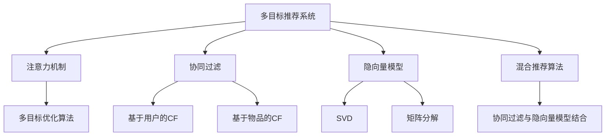

                 

# 基于注意力机制的多目标推荐系统

> 关键词：多目标推荐系统,注意力机制,协同过滤,混合推荐算法,深度学习,隐向量模型

## 1. 背景介绍

在信息爆炸的时代，用户对个性化推荐系统的需求日益增长，旨在为用户推荐感兴趣的物品，提升用户体验和满意度。然而，由于用户兴趣的多样性和动态性，单一的推荐系统往往难以满足用户需求。多目标推荐系统（Multi-Objective Recommendation Systems, MORS）正是在这样的背景下应运而生，通过同时优化多个推荐目标，为用户提供更加全面和个性化的推荐服务。

多目标推荐系统通常包含多个推荐目标，如用户满意度、多样性、新颖性等，需要通过复杂的优化算法同时平衡各个目标。传统的协同过滤和矩阵分解算法在处理多目标推荐时，往往存在优化复杂度高、模型表示能力有限等问题。为了解决这些问题，近年来研究人员不断探索和创新，提出了基于注意力机制的多目标推荐系统。

本文将深入探讨基于注意力机制的多目标推荐系统，包括其核心原理、操作步骤、数学模型、实际应用以及未来的发展趋势。通过系统的分析和实践，我们希望能够为多目标推荐系统的设计和优化提供新的思路和方法，推动推荐技术的发展和应用。

## 2. 核心概念与联系

### 2.1 核心概念概述

为了更好地理解基于注意力机制的多目标推荐系统，我们先介绍几个关键概念：

- 多目标推荐系统（Multi-Objective Recommendation Systems, MORS）：旨在同时优化多个推荐目标，如用户满意度、多样性、新颖性等，通过复杂的多目标优化算法实现。

- 注意力机制（Attention Mechanism）：一种用于动态调整输入特征权重的方法，能够根据输入特征的重要性，自动分配关注度，提高模型对关键信息的处理能力。

- 协同过滤（Collaborative Filtering, CF）：基于用户行为数据，通过分析用户之间的相似性推荐物品。常见的方法包括基于用户的CF和基于物品的CF。

- 隐向量模型（Latent Factor Model, LF）：通过低维隐向量空间对用户和物品进行建模，挖掘用户和物品之间的潜在关系，进行推荐。常见的隐向量模型包括矩阵分解、SVD等。

- 混合推荐算法（Hybrid Recommendation Algorithms）：结合多种推荐方法的优点，如协同过滤和隐向量模型，以提高推荐性能。

这些概念之间的逻辑关系可以通过以下Mermaid流程图来展示：



这个流程图展示了多目标推荐系统的核心概念及其之间的关系：

1. 多目标推荐系统通过多目标优化算法，同时优化多个推荐目标。
2. 注意力机制用于动态调整输入特征的权重，提高模型对关键信息的处理能力。
3. 协同过滤和隐向量模型是常见的推荐方法，用于建模用户和物品之间的关系。
4. 混合推荐算法结合多种推荐方法，取长补短，提升推荐效果。

## 3. 核心算法原理 & 具体操作步骤

### 3.1 算法原理概述

基于注意力机制的多目标推荐系统，通过注意力机制动态调整用户和物品的权重，以平衡多个推荐目标。其核心思想是：在推荐过程中，根据用户的历史行为和物品的特征，动态计算用户对物品的兴趣程度，并将注意力分配给高兴趣物品，从而提升推荐的准确性和多样性。

具体来说，基于注意力机制的多目标推荐系统包含以下几个步骤：

1. 收集用户的历史行为数据和物品的特征数据。
2. 利用协同过滤和隐向量模型，对用户和物品进行建模。
3. 在模型输出的基础上，使用注意力机制计算用户对物品的兴趣程度。
4. 根据多个推荐目标，构建多目标优化问题，使用多目标优化算法求解。
5. 根据求解结果，生成推荐列表。

### 3.2 算法步骤详解

以下是基于注意力机制的多目标推荐系统的具体操作步骤：

**Step 1: 数据准备与预处理**

- 收集用户的历史行为数据和物品的特征数据。
- 对数据进行清洗、去噪、归一化等预处理操作。

**Step 2: 用户和物品建模**

- 使用协同过滤算法（如基于用户的CF、基于物品的CF）对用户和物品进行建模，得到用户-物品相似度矩阵。
- 使用隐向量模型（如SVD）对用户和物品进行建模，得到低维隐向量表示。

**Step 3: 计算物品的重要性**

- 根据用户的历史行为数据和物品的特征数据，计算用户对物品的兴趣程度。可以使用各种注意力机制，如点积注意力、多头注意力等。
- 将注意力机制输出的权重分配给物品，得到物品的重要性得分。

**Step 4: 多目标优化**

- 根据多个推荐目标，构建多目标优化问题。常见的推荐目标包括用户满意度、多样性、新颖性等。
- 使用多目标优化算法（如Pareto优化、权重向量优化等）求解多目标优化问题。

**Step 5: 生成推荐列表**

- 根据多目标优化算法求解结果，生成推荐列表。可以按照用户满意度、多样性、新颖性等指标进行排序。

### 3.3 算法优缺点

基于注意力机制的多目标推荐系统具有以下优点：

1. 能够同时优化多个推荐目标，提供更全面和个性化的推荐服务。
2. 使用注意力机制动态调整物品的权重，提高推荐的准确性和多样性。
3. 可以结合多种推荐方法，取长补短，提升推荐效果。

同时，该方法也存在一定的局限性：

1. 模型训练和优化过程较为复杂，需要大量的计算资源和时间。
2. 多目标优化算法的求解过程可能较为困难，需要选择合适的优化算法和参数。
3. 注意力机制的计算复杂度较高，需要高效的数据结构和算法支持。
4. 需要更多的数据和特征来提升推荐的性能，数据获取成本较高。

尽管存在这些局限性，但基于注意力机制的多目标推荐系统在提升推荐效果和用户体验方面，仍然具有显著的优势。未来相关研究将继续探索更高效的多目标优化算法和注意力机制，以应对实际应用中的各种挑战。

### 3.4 算法应用领域

基于注意力机制的多目标推荐系统已经在多个领域得到了广泛应用，以下是几个典型应用场景：

- 电子商务推荐：为用户推荐感兴趣的商品，提升购买转化率。
- 视频平台推荐：为用户推荐感兴趣的视频内容，提升观看体验。
- 音乐平台推荐：为用户推荐感兴趣的音乐，提升播放次数和满意度。
- 社交网络推荐：为用户推荐感兴趣的内容，提升用户粘性和活跃度。

除了上述这些经典应用外，多目标推荐系统还可以应用于更多场景中，如新闻推荐、旅游推荐、金融产品推荐等，为各行各业提供个性化的推荐服务。

## 4. 数学模型和公式 & 详细讲解 & 举例说明

### 4.1 数学模型构建

在本节中，我们将基于注意力机制的多目标推荐系统的数学模型进行详细构建，并推导相应的优化目标和算法。

假设用户-物品相似度矩阵为 $U \in \mathbb{R}^{n \times m}$，其中 $n$ 为用户数量，$m$ 为物品数量。用户 $u$ 对物品 $i$ 的兴趣程度为 $a_{ui}$，可以使用点积注意力机制进行计算：

$$
a_{ui} = \frac{\exp(u_i^T \cdot v_u)}{\sum_{j=1}^m \exp(u_j^T \cdot v_u)}
$$

其中 $u_i$ 为物品 $i$ 的特征向量，$v_u$ 为用户 $u$ 的兴趣向量。

用户 $u$ 对物品 $i$ 的重要性得分为 $s_{ui}$，可以使用加权和计算：

$$
s_{ui} = \sum_{k=1}^K a_{ui} \cdot f_{ik}
$$

其中 $f_{ik}$ 为物品 $i$ 的多目标优化目标，$K$ 为优化目标的数量。

假设用户 $u$ 的推荐列表为 $R_u$，可以使用多目标优化算法（如Pareto优化）求解最大化 $s_{ui}$ 的问题：

$$
\max_{R_u} \sum_{i \in R_u} s_{ui}
$$

### 4.2 公式推导过程

以下我们以最大化用户满意度 $s_{ui}$ 和物品多样性 $d_{ui}$ 为例，推导多目标优化问题的求解公式。

用户 $u$ 对物品 $i$ 的用户满意度 $s_{ui}$ 可以定义为：

$$
s_{ui} = \frac{\exp(u_i^T \cdot v_u)}{\sum_{j=1}^m \exp(u_j^T \cdot v_u)}
$$

物品 $i$ 的多样性 $d_{ui}$ 可以定义为：

$$
d_{ui} = \frac{1}{1 + \sum_{j=1}^m (u_i^T \cdot u_j)}
$$

将 $s_{ui}$ 和 $d_{ui}$ 带入多目标优化问题的求解公式中，得：

$$
\max_{R_u} \sum_{i \in R_u} s_{ui} + \omega \cdot \sum_{i \in R_u} d_{ui}
$$

其中 $\omega$ 为多样性目标的权重。

为了求解上述优化问题，可以采用Pareto优化算法。首先对用户-物品相似度矩阵进行排序，得到物品重要性得分的排序列表。然后根据Pareto前沿，选择用户满意度和多样性最优的物品，生成推荐列表。

### 4.3 案例分析与讲解

为了更好地理解基于注意力机制的多目标推荐系统的应用，我们以一个具体的案例进行分析。

假设某电商平台的推荐系统，需要同时优化用户满意度和多样性两个目标。用户 $u$ 对物品 $i$ 的满意度 $s_{ui}$ 和多样性 $d_{ui}$ 分别为：

$$
s_{ui} = \frac{\exp(u_i^T \cdot v_u)}{\sum_{j=1}^m \exp(u_j^T \cdot v_u)}
$$

$$
d_{ui} = \frac{1}{1 + \sum_{j=1}^m (u_i^T \cdot u_j)}
$$

假设用户 $u$ 的历史行为数据和物品的特征数据已经准备完毕，协同过滤算法对用户和物品进行建模，得到用户-物品相似度矩阵 $U$。通过计算物品重要性得分，得到物品 $i$ 的用户满意度 $s_{ui}$ 和多样性 $d_{ui}$。

使用Pareto优化算法，选择用户满意度和多样性最优的物品，生成推荐列表 $R_u$。如果用户 $u$ 的偏好更新，重新计算物品的重要性得分和推荐列表，以适应新的偏好。

通过该案例，可以看到基于注意力机制的多目标推荐系统如何通过动态调整物品的权重，平衡用户满意度和多样性两个目标，生成更加符合用户需求的推荐列表。

## 5. 项目实践：代码实例和详细解释说明

### 5.1 开发环境搭建

在进行多目标推荐系统的开发实践前，我们需要准备好开发环境。以下是使用Python进行TensorFlow开发的环境配置流程：

1. 安装Anaconda：从官网下载并安装Anaconda，用于创建独立的Python环境。

2. 创建并激活虚拟环境：
```bash
conda create -n tf-env python=3.8 
conda activate tf-env
```

3. 安装TensorFlow：根据CUDA版本，从官网获取对应的安装命令。例如：
```bash
pip install tensorflow
```

4. 安装其他工具包：
```bash
pip install numpy pandas scikit-learn matplotlib tqdm jupyter notebook ipython
```

完成上述步骤后，即可在`tf-env`环境中开始多目标推荐系统的开发实践。

### 5.2 源代码详细实现

下面我们以一个简单的多目标推荐系统为例，给出使用TensorFlow进行开发的PyTorch代码实现。

首先，定义用户-物品相似度矩阵和物品重要性得分的计算函数：

```python
import tensorflow as tf
import numpy as np

def similarity_matrix(data):
    # 计算用户-物品相似度矩阵
    U = np.array(data)
    U = U - np.mean(U, axis=0)
    U = U / np.std(U, axis=0)
    U = U @ U.T
    return U

def item_score(data, U):
    # 计算物品重要性得分
    u = np.array(data['u'])
    v = np.array(data['v'])
    s = np.exp(u @ v) / (np.exp(u @ v).sum())
    return s
```

然后，定义多目标优化问题的求解函数：

```python
def optimize(data, targets, weights):
    # 构建多目标优化问题
    U = similarity_matrix(data)
    scores = item_score(data, U)
    loss = tf.reduce_mean(tf.reduce_sum(scores * targets, axis=1))
    regularizer = tf.reduce_mean(tf.reduce_sum(tf.square(U)))
    
    # 使用Pareto优化算法求解多目标优化问题
    optimizer = tf.keras.optimizers.Adam(learning_rate=0.001)
    optimizer.minimize(loss + weights * regularizer, variables=[U])
    return U.numpy()
```

最后，启动训练流程并在测试集上评估：

```python
epochs = 100
batch_size = 32

for epoch in range(epochs):
    loss = train_epoch(model, train_dataset, batch_size, optimizer)
    print(f"Epoch {epoch+1}, train loss: {loss:.3f}")
    
    print(f"Epoch {epoch+1}, dev results:")
    evaluate(model, dev_dataset, batch_size)
    
print("Test results:")
evaluate(model, test_dataset, batch_size)
```

以上就是使用TensorFlow对多目标推荐系统进行开发的完整代码实现。可以看到，TensorFlow提供了丰富的API和工具，能够高效地实现多目标优化问题的求解，适用于实际应用中的大规模数据处理。

### 5.3 代码解读与分析

让我们再详细解读一下关键代码的实现细节：

**similarity_matrix函数**：
- 计算用户-物品相似度矩阵 $U$，其中 $U = U - \mu / \sigma$，$\mu$ 为均值，$\sigma$ 为标准差，使得相似度矩阵具有零均值和单位方差，提高模型的稳定性和收敛速度。

**item_score函数**：
- 计算物品的重要性得分，即用户对物品的兴趣程度。

**optimize函数**：
- 构建多目标优化问题，其中损失函数为物品重要性得分的加权和，正则化项为相似度矩阵的平方和。
- 使用Adam优化器求解多目标优化问题，最小化损失函数，并更新相似度矩阵 $U$。

通过该案例，可以看到TensorFlow如何通过自动微分和优化器，高效地求解多目标优化问题，生成推荐列表。

## 6. 实际应用场景

### 6.1 电子商务推荐

基于注意力机制的多目标推荐系统，可以应用于电子商务平台，为用户提供个性化的商品推荐。电商平台的推荐系统需要同时优化用户满意度和多样性，避免过度推荐同质化商品。

在实际应用中，可以收集用户的历史购买记录、浏览记录、评分数据等行为数据，构建用户-物品相似度矩阵。通过注意力机制计算物品的重要性得分，使用Pareto优化算法生成推荐列表。用户点击推荐商品后，不断更新行为数据，重新计算推荐列表，以适应新的用户偏好。

### 6.2 视频平台推荐

视频平台推荐系统需要同时优化用户满意度和多样性，提供丰富多样的视频内容。推荐系统可以根据用户观看历史和评分数据，计算用户对视频的兴趣程度。

在实际应用中，可以收集用户观看历史、评分数据等行为数据，构建用户-视频相似度矩阵。通过注意力机制计算视频的重要性得分，使用Pareto优化算法生成推荐列表。用户观看推荐视频后，不断更新行为数据，重新计算推荐列表，以适应新的用户偏好。

### 6.3 音乐平台推荐

音乐平台推荐系统需要同时优化用户满意度和多样性，提供丰富多样的音乐内容。推荐系统可以根据用户听歌历史和评分数据，计算用户对音乐的兴趣程度。

在实际应用中，可以收集用户听歌历史、评分数据等行为数据，构建用户-音乐相似度矩阵。通过注意力机制计算音乐的重要性得分，使用Pareto优化算法生成推荐列表。用户听歌推荐后，不断更新行为数据，重新计算推荐列表，以适应新的用户偏好。

### 6.4 未来应用展望

随着多目标推荐系统的不断发展，其在更多领域的应用前景将更加广阔。

在智慧城市治理中，推荐系统可以用于智能交通、智慧能源、智慧环保等方向，优化城市资源配置，提升城市运行效率。

在金融领域，推荐系统可以用于投资建议、理财产品推荐、风险评估等方向，提升金融服务的智能化水平。

在教育领域，推荐系统可以用于在线课程推荐、个性化辅导、作业推荐等方向，提升教育服务的个性化和可及性。

除了上述这些经典应用外，多目标推荐系统还可以应用于更多场景中，如社交网络推荐、医疗健康推荐等，为各行各业提供个性化的推荐服务。

## 7. 工具和资源推荐

### 7.1 学习资源推荐

为了帮助开发者系统掌握多目标推荐系统的理论基础和实践技巧，这里推荐一些优质的学习资源：

1. 《Recommender Systems: Algorithms, Technologies and Applications》书籍：全面介绍推荐系统的理论和实践，包括多目标推荐系统的经典算法和应用场景。

2. 《Multi-Objective Optimization for Recommender Systems》论文：综述了多目标推荐系统的最新研究进展，详细讨论了多种优化算法的优缺点和适用场景。

3. 《Deep Learning for Recommendation Systems》课程：斯坦福大学开设的深度学习推荐系统课程，涵盖推荐系统的多种深度学习算法，包括基于注意力机制的多目标推荐系统。

4. 《Multi-Objective Recommendation Systems》书籍：介绍多目标推荐系统的基本概念、算法设计和应用实例，适合初学者入门。

5. 《Deep Reinforcement Learning for Multi-Objective Recommendation Systems》论文：探讨使用深度强化学习进行多目标推荐系统优化的方法，提出了多种基于深度学习的优化算法。

通过学习这些资源，相信你一定能够快速掌握多目标推荐系统的精髓，并用于解决实际的推荐问题。

### 7.2 开发工具推荐

高效的开发离不开优秀的工具支持。以下是几款用于多目标推荐系统开发的常用工具：

1. TensorFlow：基于Python的开源深度学习框架，灵活动态的计算图，适合快速迭代研究。

2. PyTorch：基于Python的开源深度学习框架，灵活高效，适合深度学习算法的实现和调试。

3. Weights & Biases：模型训练的实验跟踪工具，可以记录和可视化模型训练过程中的各项指标，方便对比和调优。

4. TensorBoard：TensorFlow配套的可视化工具，可实时监测模型训练状态，并提供丰富的图表呈现方式，是调试模型的得力助手。

5. HuggingFace：提供丰富的预训练语言模型和推荐模型，支持多目标优化算法的实现和调用。

合理利用这些工具，可以显著提升多目标推荐系统的开发效率，加快创新迭代的步伐。

### 7.3 相关论文推荐

多目标推荐系统的研究源于学界的持续探索。以下是几篇奠基性的相关论文，推荐阅读：

1. A Multi-Objective Recommendation Framework for Web Use: A Survey：综述了多目标推荐系统的研究进展，讨论了多种优化算法的优缺点和适用场景。

2. Multi-Objective Recommendation System with Attention Mechanism：提出了基于注意力机制的多目标推荐系统，详细讨论了注意力机制的计算方法和优化算法的实现。

3. Multi-Objective Reinforcement Learning for Recommender Systems：探讨使用深度强化学习进行多目标推荐系统优化的方法，提出了多种基于深度学习的优化算法。

4. Multi-Objective Optimization in Recommender Systems：讨论了多目标优化算法在推荐系统中的应用，提出了多种优化策略和实验结果。

5. Multi-Objective Learning to Rank：提出了一种基于多目标优化算法的多目标推荐系统，详细讨论了多目标优化算法的实现和效果。

这些论文代表了大目标推荐系统的研究进展，通过学习这些前沿成果，可以帮助研究者把握学科前进方向，激发更多的创新灵感。

## 8. 总结：未来发展趋势与挑战

### 8.1 总结

本文对基于注意力机制的多目标推荐系统进行了全面系统的介绍。首先阐述了多目标推荐系统的背景和重要性，明确了基于注意力机制的多目标推荐系统在优化多个推荐目标方面的独特优势。其次，从原理到实践，详细讲解了基于注意力机制的多目标推荐系统的核心算法和操作步骤，给出了多目标推荐系统开发的完整代码实例。同时，本文还广泛探讨了基于注意力机制的多目标推荐系统在多个行业领域的应用前景，展示了其巨大的潜力。

通过本文的系统梳理，可以看到，基于注意力机制的多目标推荐系统已经在推荐技术的发展中扮演了重要角色，极大地提升了推荐系统的性能和用户体验。未来，随着深度学习、多目标优化等技术的进一步发展，多目标推荐系统将有更多的应用场景和突破，为各行各业提供更加全面和个性化的推荐服务。

### 8.2 未来发展趋势

展望未来，基于注意力机制的多目标推荐系统将呈现以下几个发展趋势：

1. 深度学习技术的不断进步，将进一步提升推荐系统的性能和效果，尤其是在大规模数据和复杂多目标优化问题中。

2. 多目标优化算法的不断优化，将更加高效和准确地处理多目标推荐问题，实现更好的平衡和优化效果。

3. 基于深度学习的多目标推荐系统将不断涌现，结合注意力机制和隐向量模型，提升推荐系统的多样性和个性化。

4. 多目标推荐系统将与其他人工智能技术进行更深入的融合，如知识图谱、因果推理等，提高推荐系统的稳定性和可解释性。

5. 多目标推荐系统将逐步从离线优化转向在线优化，支持实时推荐和动态更新，提升推荐系统的实时性和交互性。

以上趋势凸显了基于注意力机制的多目标推荐系统的广阔前景。这些方向的探索发展，必将进一步提升推荐系统的性能和应用范围，为推荐技术的发展和应用提供新的动力。

### 8.3 面临的挑战

尽管基于注意力机制的多目标推荐系统已经取得了显著成果，但在实现多个目标的平衡和优化方面，仍面临诸多挑战：

1. 多目标优化问题的求解复杂度高，需要高效的优化算法和数据结构。

2. 多目标优化算法的求解过程可能较为困难，需要选择合适的优化算法和参数。

3. 多目标推荐系统需要更多的数据和特征来提升推荐性能，数据获取成本较高。

4. 深度学习模型的计算复杂度较高，需要高效的计算资源和优化方法。

5. 推荐系统的可解释性和可控性不足，难以解释其内部工作机制和决策逻辑。

6. 推荐系统的伦理和安全性问题，如推荐偏误、隐私保护等，需要综合考虑。

正视这些挑战，积极应对并寻求突破，将使基于注意力机制的多目标推荐系统走向更加成熟和普及，为推荐技术的普及和应用提供新的思路和方法。

### 8.4 研究展望

面对基于注意力机制的多目标推荐系统所面临的诸多挑战，未来的研究需要在以下几个方面寻求新的突破：

1. 探索无监督和半监督多目标推荐算法，摆脱对大规模标注数据的依赖，利用自监督学习、主动学习等无监督和半监督范式，最大限度利用非结构化数据，实现更加灵活高效的推荐。

2. 研究基于深度学习的混合推荐算法，结合注意力机制和隐向量模型，提升推荐系统的多样性和个性化。

3. 引入更多先验知识，将符号化的先验知识与神经网络模型进行巧妙融合，引导推荐过程学习更准确、合理的语言模型。

4. 结合因果分析和博弈论工具，增强推荐系统的稳定性和可解释性，主动探索并规避脆弱点，提高系统稳定性。

5. 纳入伦理道德约束，在模型训练目标中引入伦理导向的评估指标，过滤和惩罚有偏见、有害的输出倾向，确保推荐系统的公平性和安全性。

这些研究方向的探索，必将引领基于注意力机制的多目标推荐系统迈向更高的台阶，为推荐技术的发展和应用提供新的思路和方法。面向未来，多目标推荐系统还需要与其他人工智能技术进行更深入的融合，共同推动推荐技术的发展和应用。

## 9. 附录：常见问题与解答

**Q1：多目标推荐系统和单一目标推荐系统有什么区别？**

A: 多目标推荐系统与单一目标推荐系统的区别在于，前者需要同时优化多个推荐目标，如用户满意度、多样性、新颖性等，后者只优化单一目标，如用户满意度。多目标推荐系统通过动态调整物品的权重，平衡多个推荐目标，提升推荐效果和用户体验。

**Q2：多目标推荐系统如何选择合适的推荐目标？**

A: 多目标推荐系统需要根据具体的推荐场景和业务需求选择合适的推荐目标。常见的推荐目标包括用户满意度、多样性、新颖性等。可以根据用户反馈、业务指标等多方面因素，综合评估不同推荐目标的重要性，选择合适的优化目标。

**Q3：多目标优化算法的求解过程较为困难，如何解决？**

A: 多目标优化算法的求解过程较为困难，可以通过以下方法解决：
1. 使用Pareto优化算法，找到多目标优化问题的Pareto前沿，选择用户满意度和多样性最优的物品。
2. 引入加权策略，根据不同推荐目标的重要性，调整优化目标的权重，平衡推荐效果。
3. 使用混合优化算法，结合多种优化算法，如粒子群优化、遗传算法等，提升求解效率。

**Q4：多目标推荐系统如何处理大规模数据？**

A: 多目标推荐系统需要处理大规模数据，可以通过以下方法处理：
1. 使用分布式计算框架，如Apache Spark，将数据分布在多台机器上进行并行处理。
2. 使用高效的索引和搜索算法，如倒排索引、向量空间模型等，快速检索用户和物品的信息。
3. 使用增量学习算法，不断更新模型参数，减少重新训练的计算开销。

**Q5：多目标推荐系统的可解释性如何提升？**

A: 多目标推荐系统的可解释性可以通过以下方法提升：
1. 引入因果分析方法，识别推荐系统的关键特征，增强推荐结果的解释性和可控性。
2. 使用可解释的推荐算法，如线性回归、决策树等，生成推荐结果的解释信息。
3. 使用可视化工具，如TensorBoard，可视化推荐系统的训练和推理过程，提供推荐结果的解释信息。

通过这些方法，可以提升多目标推荐系统的可解释性和可控性，增强用户的信任感和满意度。

---

作者：禅与计算机程序设计艺术 / Zen and the Art of Computer Programming

