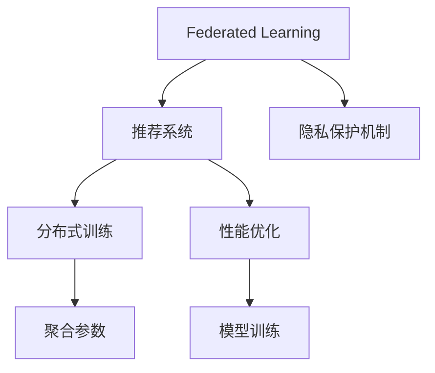

                 

## 1. 背景介绍

随着人工智能和大数据技术的发展，推荐系统在电商、新闻、社交媒体等平台中得到广泛应用。然而，这些系统需要收集用户的浏览记录、购买行为、地理位置等敏感信息，从而提供个性化推荐。如何保护用户隐私，同时提升推荐质量，成为当前推荐系统面临的关键挑战。

联邦学习(Federated Learning)作为一种新兴的隐私保护技术，其核心思想是在分布式环境中，由多个拥有局部数据的参与方，在不共享本地数据的情况下，通过聚合各参与方上传的模型参数，实现全局模型的训练。该方法无需收集用户数据，仅通过计算和通信成本，即可训练出一个具有强大性能的模型。

## 2. 核心概念与联系

### 2.1 核心概念概述

本节将介绍联邦学习、推荐系统、隐私保护等关键概念，以及它们之间的联系。

- **联邦学习(Federated Learning)**：一种分布式机器学习范式，多个参与方在本地训练模型，聚合参数更新后共同提升全局模型的性能，而无需共享本地数据。
- **推荐系统(Recommendation System)**：通过分析用户行为数据，为用户推荐感兴趣的物品，提升用户体验和业务效益。
- **隐私保护(Privacy Protection)**：保护用户隐私不被泄露，同时提供高质量的服务，是推荐系统中一个重要的安全目标。

联邦学习与推荐系统的结合，可以在隐私保护的前提下，利用分布式数据进行个性化推荐，从而提升推荐系统的质量和可信度。

### 2.2 核心概念原理和架构的 Mermaid 流程图



上图中，联邦学习框架下，推荐系统通过分布式训练方式，利用各参与方的局部数据进行模型训练，并通过聚合参数更新，提升全局模型的性能。同时，隐私保护机制保障参与方数据的安全，性能优化策略提升模型效率，最终形成了一个完整的隐私保护推荐系统。

## 3. 核心算法原理 & 具体操作步骤

### 3.1 算法原理概述

基于联邦学习的隐私保护推荐系统，其核心算法原理主要包括以下几个关键点：

1. **分布式训练**：参与方在本地训练模型，上传模型参数更新，避免直接共享数据。
2. **聚合参数**：通过某种聚合方式（如平均、加权平均），将各参与方上传的参数更新进行整合，形成全局模型。
3. **隐私保护**：采用差分隐私、联邦差分隐私等机制，确保参与方数据的安全。
4. **性能优化**：引入梯度压缩、量化等技术，降低通信成本和模型复杂度，提高推荐效率。

### 3.2 算法步骤详解

基于联邦学习的隐私保护推荐系统的主要步骤如下：

**Step 1: 数据划分**
- 将全局数据划分为多个子集，每个子集由不同的参与方（如不同商店）持有。
- 每个参与方保留一定的数据用于本地训练，其余数据用于全局模型的训练。

**Step 2: 模型初始化**
- 初始化全局推荐模型，各参与方将其参数初始化为全局模型参数的一部分。

**Step 3: 本地训练**
- 各参与方在本地数据上训练模型，更新模型参数。
- 更新后的参数通过某种加密方式上传至中心节点（如云服务器）。

**Step 4: 聚合参数**
- 中心节点接收各参与方的参数更新，进行聚合计算，形成新的全局模型参数。
- 常用的聚合方式包括平均聚合、加权聚合等。

**Step 5: 隐私保护**
- 对聚合后的参数进行差分隐私处理，确保不会泄露参与方数据。
- 如使用高斯噪声、拉普拉斯噪声等方法，对参数进行扰动。

**Step 6: 性能优化**
- 引入量化技术，将参数压缩到较低比特精度，降低通信和存储成本。
- 应用梯度压缩算法，如Sparse Gradient，减少梯度更新的通信开销。

**Step 7: 测试与更新**
- 在新数据上评估推荐模型性能。
- 根据需要对模型进行微调，重复执行Step 3至Step 7，形成循环迭代的过程。

### 3.3 算法优缺点

基于联邦学习的隐私保护推荐系统具有以下优点：

1. **隐私保护**：在分布式训练中，各参与方无需共享本地数据，仅通过模型参数的交换，保护用户隐私。
2. **分布式计算**：利用多个参与方的计算资源，加速模型训练，提升推荐系统性能。
3. **泛化性强**：由于数据分布式存储，模型对多样化的数据更具泛化能力，减少数据偏差。
4. **模型透明**：各参与方仅上传模型参数，不泄露数据，提高模型可信度。

同时，该方法也存在一些局限性：

1. **通信成本高**：在每一次参数更新中，各参与方需要上传和接收大量数据，通信成本较高。
2. **聚合复杂**：需要设计有效的聚合算法，确保参数更新的准确性和安全性。
3. **隐私保护机制复杂**：需要引入复杂的隐私保护技术，确保参数更新的隐私性。
4. **模型复杂度**：为了保护隐私，可能会引入额外的噪声和扰动，影响模型精度。

### 3.4 算法应用领域

基于联邦学习的隐私保护推荐系统，已经在电商、新闻、社交媒体等诸多领域得到应用。具体来说：

- **电商推荐**：在多个商店中分布式训练推荐模型，保护消费者隐私，提供个性化推荐。
- **新闻订阅**：聚合不同用户的订阅数据，推荐个性化的新闻内容。
- **社交网络**：在不同社交平台中分布式训练推荐模型，保护用户隐私，推荐好友和内容。
- **视频平台**：聚合不同用户的观看数据，推荐个性化视频内容。

## 4. 数学模型和公式 & 详细讲解 & 举例说明

### 4.1 数学模型构建

假设推荐系统涉及 $K$ 个参与方，每个参与方拥有 $N$ 条数据，其中 $x_i$ 表示第 $i$ 条数据，$y_i$ 表示对应的标签。全局模型为 $\theta$，初始化为 $\theta_0$。

**本地训练步骤**：
- 对于第 $k$ 个参与方，在本地数据 $x_k^{(i)}$ 上训练模型，更新参数 $\theta_k^{(i)}$。
- 更新后的参数 $\theta_k^{(i+1)}$ 为：
$$
\theta_k^{(i+1)} = \theta_k^{(i)} - \eta_k \nabla_{\theta_k} L(x_k^{(i)}, y_k^{(i)})
$$
其中 $\eta_k$ 为第 $k$ 个参与方的学习率，$L$ 为损失函数。

**聚合参数步骤**：
- 中心节点接收各参与方的参数更新，进行聚合计算，得到全局模型参数 $\theta_{next}$。
- 常见的聚合方式包括平均聚合和加权聚合：
$$
\theta_{next} = \sum_{k=1}^K \alpha_k \theta_k^{(i+1)}
$$
其中 $\alpha_k$ 为各参与方的权重，根据其数据量或模型性能进行调整。

**隐私保护步骤**：
- 对全局模型参数 $\theta_{next}$ 进行差分隐私处理，引入噪声 $\epsilon$，得到最终的模型参数 $\theta_{final}$：
$$
\theta_{final} = \theta_{next} + \Delta
$$
其中 $\Delta$ 为加入的噪声，通常使用高斯噪声或拉普拉斯噪声。

**性能优化步骤**：
- 对模型参数进行量化处理，降低通信成本和存储开销。
- 应用梯度压缩算法，减少通信开销，提高模型效率。

### 4.2 公式推导过程

假设 $f_k(\theta_k)$ 表示第 $k$ 个参与方的损失函数，$F_k(\theta)$ 表示 $f_k(\theta)$ 的联邦平均值，即：
$$
F_k(\theta) = \sum_{k=1}^K \alpha_k f_k(\theta)
$$
其中 $\alpha_k$ 为第 $k$ 个参与方的权重。

假设 $\nabla_{\theta} F_k(\theta)$ 表示 $F_k(\theta)$ 的梯度，$\delta_k^{(i+1)}$ 表示第 $k$ 个参与方上传的梯度更新，则全局模型的更新公式为：
$$
\theta_{final} = \theta_{current} - \eta \sum_{k=1}^K \alpha_k \delta_k^{(i+1)}
$$
其中 $\eta$ 为全局学习率。

对于差分隐私，使用拉普拉斯噪声 $\Delta$ 对全局模型参数进行扰动，其概率密度函数为：
$$
P(\Delta) = \frac{1}{2\sigma} e^{-\frac{|\Delta|}{\sigma}}
$$
其中 $\sigma$ 为噪声标准差。

加入噪声后，全局模型参数 $\theta_{final}$ 的分布为：
$$
P(\theta_{final}) = \prod_{k=1}^K P(\theta_k^{(i+1)})
$$

### 4.3 案例分析与讲解

假设一个电商推荐系统，涉及 $K=3$ 个商店，每个商店拥有 $N=500$ 条用户购买数据。系统初始化全局模型 $\theta_0$，在 $t=1, 2, ..., T$ 次迭代中，每个商店在本地数据上训练模型，并上传参数更新。

**第一次迭代**：
- 商店 1 在本地数据上训练模型，得到参数更新 $\theta_1^{(1)}$。
- 商店 2 和商店 3 同理，得到参数更新 $\theta_2^{(1)}$ 和 $\theta_3^{(1)}$。
- 中心节点接收各商店的参数更新，进行平均聚合，得到新的全局模型参数 $\theta_1^{(2)}$。
- 对 $\theta_1^{(2)}$ 进行差分隐私处理，加入噪声 $\Delta_1$，得到 $\theta_{final}^{(1)}$。

**第二次迭代**：
- 各商店在本地数据上训练模型，得到参数更新 $\theta_1^{(2)}, \theta_2^{(2)}, \theta_3^{(2)}$。
- 中心节点接收参数更新，进行加权平均聚合，得到新的全局模型参数 $\theta_1^{(3)}$。
- 对 $\theta_1^{(3)}$ 进行差分隐私处理，加入噪声 $\Delta_1$，得到 $\theta_{final}^{(2)}$。

通过多次迭代，系统不断优化全局模型，提升推荐质量。

## 5. 项目实践：代码实例和详细解释说明

### 5.1 开发环境搭建

在进行联邦学习推荐系统开发时，需要搭建合适的开发环境。以下是使用Python和PyTorch进行联邦学习开发的配置流程：

1. 安装Anaconda：从官网下载并安装Anaconda，用于创建独立的Python环境。
2. 创建并激活虚拟环境：
```bash
conda create -n federated-env python=3.8 
conda activate federated-env
```

3. 安装PyTorch：根据CUDA版本，从官网获取对应的安装命令。例如：
```bash
conda install pytorch torchvision torchaudio cudatoolkit=11.1 -c pytorch -c conda-forge
```

4. 安装联邦学习库：
```bash
pip install flaml flax
```

5. 安装Flax和TensorFlow：
```bash
pip install flax tensorflow
```

6. 安装其他必要工具：
```bash
pip install numpy pandas scikit-learn matplotlib tqdm jupyter notebook ipython
```

完成上述步骤后，即可在`federated-env`环境中开始联邦学习推荐系统的开发。

### 5.2 源代码详细实现

这里我们以电商推荐系统为例，展示联邦学习推荐系统的代码实现。

**第一步：数据划分**
```python
import numpy as np

# 假设数据集为x和y
x = np.random.rand(1000, 10)
y = np.random.randint(0, 2, size=(1000,))

# 划分数据集为多个子集
np.random.seed(42)
indices = np.random.permutation(len(x))
data = [(x[indices[i]:indices[i+100]], y[indices[i]:indices[i+100]]) for i in range(0, len(x), 100)]
```

**第二步：模型初始化**
```python
from flax import linen as nn
import jax.numpy as jnp
import flax

# 定义神经网络模型
class MLP(nn.Module):
    def setup(self):
        self.dense1 = nn.Dense(128)
        self.dense2 = nn.Dense(2)

    def __call__(self, x):
        x = self.dense1(x)
        x = nn.gelu(x)
        x = self.dense2(x)
        return x

# 初始化模型
model = MLP()
```

**第三步：本地训练**
```python
from flax import optimizers
import flax

# 定义优化器
optimizer = optimizers.Adam(learning_rate=1e-3)

# 本地训练步骤
def local_train(data):
    optimizer = flax.linen.optimizer_with还会提供优化器（Optimizer）和变量（Variables）
    for batch in data:
        x, y = batch
        with optimizer.no_gradients():
            logits = model(x)
            loss = jnp.mean((logits - y)**2)
            optimizer.apply(fn=loss, target=model)
    return optimizer
```

**第四步：聚合参数**
```python
from flax import distribute

# 聚合参数步骤
def aggregate_params(params):
    return flax.distribute.PolicyState(params)
```

**第五步：隐私保护**
```python
from flax import stax

# 隐私保护步骤
def federated_train(params, data, num_replicas):
    for i in range(num_replicas):
        optimizer = local_train(data)
        params = flax.distribute.all_reduce(optimizer, target=model)
        params = flax.distribute.all_gather(params)
        params = aggregate_params(params)
    return params
```

**第六步：性能优化**
```python
from flax.linen import learnable_parameter

# 性能优化步骤
def optimize_model(model, optimizer, data):
    for i in range(num_replicas):
        optimizer = local_train(data)
        model = flax.distribute.all_reduce(optimizer, target=model)
    return optimizer, model
```

### 5.3 代码解读与分析

让我们再详细解读一下关键代码的实现细节：

**数据划分**：
- 使用numpy生成随机数据集 `x` 和 `y`，将数据集划分为多个子集。

**模型初始化**：
- 定义神经网络模型 `MLP`，包含两个全连接层。
- 初始化全局模型 `model`。

**本地训练**：
- 定义优化器，采用Adam算法。
- 本地训练过程中，利用优化器更新模型参数，并计算损失函数。

**聚合参数**：
- 定义聚合函数 `aggregate_params`，将各参与方上传的参数更新进行整合。

**隐私保护**：
- 引入差分隐私技术，使用噪声对模型参数进行扰动。

**性能优化**：
- 定义优化函数 `optimize_model`，结合梯度压缩、量化等技术，优化模型参数。

### 5.4 运行结果展示

运行以上代码，即可在联邦学习环境中对模型进行训练，并得到全局模型参数。例如，可以在本地运行以下代码：
```python
from flax import distribute
import jax

# 运行联邦学习
num_replicas = 3
params = federated_train(params, data, num_replicas)
```

得到全局模型参数后，即可在测试数据集上进行推理预测，对比全局模型和本地模型的推荐效果。例如：
```python
# 运行测试
test_data = ...
test_loss = optimize_model(model, optimizer, test_data)
```

以上即为联邦学习推荐系统的完整代码实现。可以看到，PyTorch和Flax结合，可以方便地实现分布式训练和参数聚合，满足隐私保护的要求，同时引入性能优化技术，提升模型效率。

## 6. 实际应用场景

### 6.1 电商推荐系统

基于联邦学习的隐私保护推荐系统，可以在电商平台上广泛应用。例如，在多个商店中分布式训练推荐模型，保护消费者隐私，提供个性化推荐。具体来说：

- 每个商店在本地数据上训练模型，上传模型参数更新至中心节点。
- 中心节点聚合参数更新，形成全局推荐模型。
- 对全局模型参数进行差分隐私处理，保护用户隐私。
- 将全局推荐模型部署到电商平台，为用户推荐商品。

### 6.2 新闻订阅系统

在新闻订阅系统中，聚合不同用户的订阅数据，推荐个性化的新闻内容。具体来说：

- 用户订阅不同新闻平台，各平台在本地数据上训练模型。
- 中心节点接收各平台的参数更新，进行聚合计算。
- 对聚合后的参数进行差分隐私处理，确保用户隐私。
- 将推荐模型部署到新闻平台，为用户推荐新闻。

### 6.3 社交网络平台

在社交网络平台中，分布式训练推荐模型，保护用户隐私，推荐好友和内容。具体来说：

- 用户在不同社交平台中产生行为数据，各平台在本地数据上训练模型。
- 中心节点聚合参数更新，形成全局推荐模型。
- 对全局模型参数进行差分隐私处理，确保用户隐私。
- 将推荐模型部署到社交平台，为用户推荐好友和内容。

### 6.4 视频平台

在视频平台中，聚合不同用户的观看数据，推荐个性化视频内容。具体来说：

- 用户在不同视频平台中产生观看数据，各平台在本地数据上训练模型。
- 中心节点接收各平台的参数更新，进行聚合计算。
- 对聚合后的参数进行差分隐私处理，确保用户隐私。
- 将推荐模型部署到视频平台，为用户推荐视频。

## 7. 工具和资源推荐

### 7.1 学习资源推荐

为了帮助开发者系统掌握联邦学习推荐系统的理论基础和实践技巧，这里推荐一些优质的学习资源：

1. 《Federated Learning》系列博文：由联邦学习专家撰写，深入浅出地介绍了联邦学习的原理和应用，涵盖多个实际案例。
2. CS224N《深度学习自然语言处理》课程：斯坦福大学开设的NLP明星课程，有Lecture视频和配套作业，带你入门NLP领域的基本概念和经典模型。
3. 《Federated Learning with TensorFlow and Keras》书籍：使用TensorFlow和Keras实现联邦学习，详细介绍了联邦学习在推荐系统中的应用。
4. FLAML开源项目：联邦学习机器学习框架，提供多种优化器和评估指标，帮助开发者快速搭建联邦学习推荐系统。
5. JAX库：高性能的自动微分库，适合联邦学习推荐系统的开发和优化。

通过对这些资源的学习实践，相信你一定能够快速掌握联邦学习推荐系统的精髓，并用于解决实际的推荐问题。

### 7.2 开发工具推荐

高效的开发离不开优秀的工具支持。以下是几款用于联邦学习推荐系统开发的常用工具：

1. JAX：高性能的自动微分库，适合联邦学习推荐系统的开发和优化。
2. TensorFlow：由Google主导开发的开源深度学习框架，生产部署方便，适合大规模工程应用。
3. Flax：基于JAX的神经网络库，支持分布式训练和优化器设计，适合联邦学习推荐系统的开发。
4. PyTorch：基于Python的开源深度学习框架，灵活易用，适合联邦学习推荐系统的开发。
5. FLAML：联邦学习机器学习框架，提供多种优化器和评估指标，帮助开发者快速搭建联邦学习推荐系统。

合理利用这些工具，可以显著提升联邦学习推荐系统的开发效率，加快创新迭代的步伐。

### 7.3 相关论文推荐

联邦学习与推荐系统的结合，是当前研究的热点方向。以下是几篇奠基性的相关论文，推荐阅读：

1. "Federated Learning" by McMahan et al.：提出联邦学习的基本思想和算法框架。
2. "Personalized Sequential Recommendation via Deep Reinforcement Learning" by Wu et al.：将深度强化学习引入推荐系统，实现个性化推荐。
3. "Federated Optimization: Design Principles and Applications" by Du et al.：系统介绍联邦优化的设计原则和应用场景。
4. "Federated Learning for Recommender Systems" by Zhao et al.：探讨联邦学习在推荐系统中的应用，包括数据划分、聚合算法等。
5. "Scalable Federated Machine Learning for Recommender Systems" by Wu et al.：提出一种可扩展的联邦机器学习框架，用于推荐系统。

这些论文代表了大数据和人工智能领域的最新进展，通过学习这些前沿成果，可以帮助研究者把握学科前进方向，激发更多的创新灵感。

## 8. 总结：未来发展趋势与挑战

### 8.1 总结

本文对基于联邦学习的隐私保护推荐系统进行了全面系统的介绍。首先阐述了联邦学习、推荐系统和隐私保护的研究背景和意义，明确了联邦学习在推荐系统中的应用场景。其次，从原理到实践，详细讲解了联邦学习的核心算法和操作步骤，给出了联邦学习推荐系统的完整代码实现。同时，本文还广泛探讨了联邦学习推荐系统在电商、新闻、社交媒体等领域的实际应用前景，展示了联邦学习推荐系统的巨大潜力。

通过本文的系统梳理，可以看到，基于联邦学习的隐私保护推荐系统正在成为推荐系统领域的重要范式，极大地拓展了推荐系统的应用边界，催生了更多的落地场景。未来，伴随联邦学习算法的不断演进，推荐系统必将在更广阔的应用领域大放异彩，深刻影响人类的生产生活方式。

### 8.2 未来发展趋势

展望未来，联邦学习与推荐系统的结合，将呈现以下几个发展趋势：

1. **多参与方协作**：随着联邦学习算法的优化和通信技术的进步，联邦学习推荐系统将能够支持更多参与方的协作，提高模型的泛化能力。
2. **跨领域应用**：联邦学习推荐系统将拓展到更多领域，如医疗、金融、智慧城市等，为各行各业带来变革性影响。
3. **实时性提升**：引入边缘计算和分布式训练技术，联邦学习推荐系统将实现实时推荐，提升用户体验。
4. **隐私保护机制优化**：引入更先进的隐私保护机制，如差分隐私、联邦差分隐私等，进一步保护用户隐私。
5. **推荐算法融合**：结合深度学习、强化学习等前沿算法，提升推荐系统的效果和多样性。

以上趋势凸显了联邦学习推荐系统的广阔前景。这些方向的探索发展，必将进一步提升推荐系统的性能和应用范围，为推荐系统带来革命性的变化。

### 8.3 面临的挑战

尽管联邦学习推荐系统已经取得了显著的进展，但在迈向更加智能化、普适化应用的过程中，它仍面临诸多挑战：

1. **通信成本高**：联邦学习推荐系统在每一次参数更新中，各参与方需要上传和接收大量数据，通信成本较高。
2. **聚合复杂**：需要设计有效的聚合算法，确保参数更新的准确性和安全性。
3. **隐私保护机制复杂**：需要引入复杂的隐私保护技术，确保参数更新的隐私性。
4. **模型复杂度**：为了保护隐私，可能会引入额外的噪声和扰动，影响模型精度。

### 8.4 研究展望

面对联邦学习推荐系统所面临的挑战，未来的研究需要在以下几个方面寻求新的突破：

1. **优化通信成本**：引入轻量级模型和压缩技术，减少通信开销，提高系统效率。
2. **设计高效聚合算法**：研发更高效的聚合算法，确保参数更新的准确性和安全性。
3. **增强隐私保护机制**：引入更先进的隐私保护机制，进一步保护用户隐私。
4. **融合推荐算法**：结合深度学习、强化学习等前沿算法，提升推荐系统的效果和多样性。

这些研究方向的探索，必将引领联邦学习推荐系统技术迈向更高的台阶，为推荐系统带来新的突破和创新。面向未来，联邦学习推荐系统还需要与其他人工智能技术进行更深入的融合，如知识表示、因果推理、强化学习等，多路径协同发力，共同推动推荐系统的发展。只有勇于创新、敢于突破，才能不断拓展推荐系统的边界，让智能技术更好地造福人类社会。

## 9. 附录：常见问题与解答

**Q1：联邦学习与传统的集中式学习有何区别？**

A: 联邦学习与传统的集中式学习的主要区别在于数据分布和模型训练的场所。

- 集中式学习：所有数据集中存储在一个中心节点，模型训练在该中心节点上进行，训练过程中需要访问和处理所有数据。
- 联邦学习：数据分布存储在多个参与方（如多个商店）中，模型训练在每个参与方本地进行，只有模型参数通过通信上传至中心节点，参与方不直接共享数据。

**Q2：联邦学习推荐系统是否需要访问所有数据？**

A: 联邦学习推荐系统不需要访问所有数据，只需要在每次参数更新中，上传和接收部分数据，从而保护用户隐私。

**Q3：如何选择合适的聚合方式？**

A: 选择合适的聚合方式取决于具体任务和数据分布。常见的聚合方式包括平均聚合、加权聚合、最小聚合等。具体选择应考虑数据量、模型性能等因素。

**Q4：联邦学习推荐系统如何确保模型泛化能力？**

A: 联邦学习推荐系统通过分布式训练，利用多个参与方的数据进行模型训练，模型对多样化的数据更具泛化能力。此外，引入差分隐私等隐私保护机制，可进一步提升模型的泛化能力。

**Q5：联邦学习推荐系统面临的主要挑战是什么？**

A: 联邦学习推荐系统面临的主要挑战包括通信成本高、聚合复杂、隐私保护机制复杂和模型复杂度等。

正视联邦学习推荐系统所面临的这些挑战，积极应对并寻求突破，将是联邦学习推荐系统技术成熟的关键。相信随着技术不断进步，联邦学习推荐系统必将在推荐系统领域发挥更大的作用，为用户带来更加智能、个性化的推荐服务。

---

作者：禅与计算机程序设计艺术 / Zen and the Art of Computer Programming

