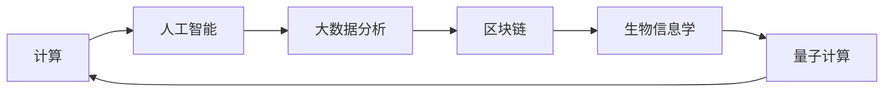

                 

# 塑造未来社会：人类计算的深远意义

> 关键词：
计算机程序设计艺术,人工智能,计算能力,未来社会,算法优化,大数据分析,区块链,生物信息学,量子计算

## 1. 背景介绍

### 1.1 问题由来

在21世纪，计算机技术的飞速发展极大地改变了我们的生活和工作方式。从个人计算到企业计算，再到全球计算，计算已经渗透到了社会的每一个角落。然而，随着计算能力的不断增强，我们对于“计算”的定义也在不断扩展。从简单的数据处理到复杂的算法优化，从传统的计算机程序设计到新的计算范式，计算不再仅仅是计算机科学家的工具，更是人类社会的基石。

### 1.2 问题核心关键点

计算的本质是什么？它如何塑造了我们的未来社会？这个问题不仅关乎技术，更关乎人类文明的未来。计算不仅仅是为了解决技术问题，更是为了推动社会进步，提升人类福祉。本文将从计算的定义、计算对社会的影响，以及计算的未来发展方向等多个角度，探讨人类计算的深远意义。

## 2. 核心概念与联系

### 2.1 核心概念概述

要深刻理解人类计算的深远意义，我们需要先掌握一些核心概念：

- **计算(Computing)**：广义上，计算是任何基于规则的符号操作。从简单的算术运算到复杂的算法设计，计算能力已经成为现代社会发展的关键驱动力。
- **人工智能(AI)**：通过模拟人类智能，使机器能够进行学习、推理、判断等高级认知任务。AI的发展，极大地推动了计算能力的提升。
- **大数据分析(Big Data Analytics)**：通过对海量数据进行分析，挖掘出隐藏在数据背后的规律和知识，为决策提供依据。
- **区块链(Blockchain)**：一种去中心化的分布式账本技术，通过密码学保证数据的安全和透明，具有广阔的应用前景。
- **生物信息学(Bioinformatics)**：结合生物学和计算机科学的交叉学科，致力于处理和分析生物数据，推动医学、农业等领域的进步。
- **量子计算(Quantum Computing)**：利用量子力学原理，实现计算能力的指数级提升，解决传统计算机无法处理的问题。

这些概念之间存在紧密联系，共同构成了现代计算技术的基石。理解它们之间的联系，有助于我们更好地把握计算技术的演进方向和应用潜力。

### 2.2 核心概念原理和架构的 Mermaid 流程图(Mermaid 流程节点中不要有括号、逗号等特殊字符)



## 3. 核心算法原理 & 具体操作步骤

### 3.1 算法原理概述

计算的核心在于通过算法优化实现目标任务的自动化处理。无论是传统的算法设计还是现代的深度学习模型，其本质都是对数据的符号操作和规则应用。算法优化的目标是通过最小化计算资源的消耗，最大化任务执行的效果。

### 3.2 算法步骤详解

算法优化通常包括以下几个关键步骤：

1. **问题建模**：明确优化目标和约束条件，构建数学模型或符号规则。
2. **算法设计**：选择合适的算法，设计算法流程和数据结构。
3. **参数调优**：根据实际数据和计算资源，调整算法的参数设置。
4. **性能评估**：通过实验和测试，评估算法的效果，迭代改进。

### 3.3 算法优缺点

- **优点**：
  - 自动化处理：算法可以自动处理大量重复性的任务，减少人工干预。
  - 可扩展性：算法设计灵活，可以适用于多种场景和问题。
  - 可优化性：通过参数调优，可以不断提升算法效率和效果。

- **缺点**：
  - 依赖数据质量：算法的效果受数据质量和样本数量的影响较大。
  - 计算资源消耗：复杂的算法往往需要大量的计算资源。
  - 缺乏解释性：某些算法（如深度学习模型）的决策过程难以解释。

### 3.4 算法应用领域

算法优化在各个领域都有广泛应用，如：

- **金融领域**：通过量化交易和风险管理，提升金融产品的开发和运营效率。
- **医疗健康**：通过数据分析和建模，提高疾病预测和诊断的准确性。
- **交通管理**：通过智能交通系统和预测分析，优化交通流量和资源配置。
- **制造业**：通过供应链管理和生产优化，提升生产效率和产品质量。
- **教育培训**：通过个性化学习和智能评估，提升教育效果和学习体验。

## 4. 数学模型和公式 & 详细讲解 & 举例说明

### 4.1 数学模型构建

数学模型是计算的基础，通过构建数学模型，我们可以将复杂的现实问题转化为可计算的形式。例如，在金融领域，我们可以构建量化交易模型，通过分析市场数据，预测股票价格变化。

### 4.2 公式推导过程

以量化交易模型为例，其核心公式为：

$$
\text{Expected Return} = \sum_i w_i \cdot r_i
$$

其中，$w_i$ 为投资权重，$r_i$ 为资产回报率。通过求解该公式，可以得到最优的投资组合，最大化预期收益。

### 4.3 案例分析与讲解

在医疗健康领域，通过对患者病历数据的分析，我们可以构建预测模型，判断疾病的风险和患病概率。例如，构建一个癌症风险预测模型，其数学模型为：

$$
P(\text{Cancer}) = f(\text{age}, \text{gender}, \text{family history}, \ldots)
$$

其中，$f$ 为预测函数，包含患者的年龄、性别、家族病史等多个特征。通过训练和优化该模型，我们可以预测患者的患病概率，为医生的诊断和治疗提供参考。

## 5. 项目实践：代码实例和详细解释说明

### 5.1 开发环境搭建

要实现上述算法和模型，我们需要搭建一个合适的开发环境。以下是Python开发环境的基本配置步骤：

1. 安装Anaconda：从官网下载并安装Anaconda，用于创建独立的Python环境。
2. 创建并激活虚拟环境：
```bash
conda create -n py-env python=3.8 
conda activate py-env
```

3. 安装必要的Python库：
```bash
pip install numpy pandas scikit-learn matplotlib
```

4. 安装深度学习框架和库：
```bash
pip install torch torchvision torchaudio cudatoolkit=11.1 -c pytorch -c conda-forge
```

5. 安装TensorFlow和其他深度学习库：
```bash
pip install tensorflow tflearn
```

完成上述步骤后，即可在`py-env`环境中开始项目实践。

### 5.2 源代码详细实现

以下是一个简单的量化交易模型示例，使用Python和TensorFlow实现：

```python
import numpy as np
import tensorflow as tf

# 定义模型参数
num_assets = 5
num_epochs = 100
learning_rate = 0.01

# 定义随机数据
np.random.seed(42)
assets = np.random.randn(num_assets, num_epochs)
returns = np.random.randn(num_epochs)

# 定义优化器和损失函数
optimizer = tf.train.AdamOptimizer(learning_rate)
loss_fn = tf.losses.mean_squared_error

# 定义输入和输出
inputs = tf.placeholder(tf.float32, shape=(num_assets, num_epochs))
targets = tf.placeholder(tf.float32, shape=(num_epochs,))

# 定义模型
model = tf.layers.dense(inputs, 1)

# 定义损失和优化
loss = loss_fn(model, targets)
train_op = optimizer.minimize(loss)

# 定义预测函数
predict = tf.squeeze(model)

# 训练模型
with tf.Session() as sess:
    sess.run(tf.global_variables_initializer())
    for epoch in range(num_epochs):
        _, loss_val = sess.run([train_op, loss], feed_dict={inputs: assets, targets: returns})
        print(f"Epoch {epoch+1}, loss: {loss_val}")

    # 预测新数据
    new_data = np.random.randn(num_assets, 1)
    print(f"Predictions for new data: {sess.run(predict, feed_dict={inputs: new_data})}")
```

### 5.3 代码解读与分析

这段代码实现了一个简单的量化交易模型，其主要流程如下：

1. 定义模型参数，包括资产数量、迭代次数和学习率。
2. 生成随机数据，模拟资产价格变化和回报率。
3. 定义优化器和损失函数，使用Adam优化器和均方误差损失函数。
4. 定义输入和输出，输入为资产价格数据，输出为预测的资产回报率。
5. 定义模型，使用全连接层进行预测。
6. 定义损失和优化操作，通过优化器最小化损失函数。
7. 定义预测函数，用于预测新数据的回报率。
8. 训练模型，并通过迭代更新模型参数，最小化损失函数。
9. 预测新数据，并输出预测结果。

## 6. 实际应用场景

### 6.1 金融领域

在金融领域，量化交易和风险管理是两个典型的应用场景。通过构建数学模型和算法，可以自动化处理大量的市场数据，预测股票价格变化，优化资产配置，降低投资风险。

- **量化交易**：通过构建量化交易模型，自动化执行买卖操作，优化交易策略，提高投资收益。
- **风险管理**：通过构建风险评估模型，预测市场波动和风险事件，进行风险控制和预警。

### 6.2 医疗健康

在医疗健康领域，数据分析和建模可以帮助医生进行疾病预测和诊断，提高治疗效果和患者满意度。

- **疾病预测**：通过构建预测模型，分析患者的病历数据，预测疾病的风险和患病概率。
- **治疗优化**：通过构建治疗方案模型，优化药物组合和治疗方案，提升治疗效果。

### 6.3 交通管理

在交通管理领域，智能交通系统和预测分析可以帮助优化交通流量和资源配置，提升城市交通管理效率。

- **交通流量预测**：通过构建交通流量预测模型，分析交通数据，预测未来交通状况。
- **智能调度**：通过构建智能调度模型，优化交通信号灯和交通工具的调度，缓解交通拥堵。

### 6.4 制造业

在制造业领域，供应链管理和生产优化是两个典型的应用场景。通过构建数学模型和算法，可以自动化处理大量的生产数据，优化生产流程和供应链管理。

- **供应链管理**：通过构建供应链管理模型，优化库存管理、物流调度和供应商选择，降低成本和提升效率。
- **生产优化**：通过构建生产优化模型，预测生产需求和设备状态，优化生产计划和资源分配。

### 6.5 教育培训

在教育培训领域，个性化学习和智能评估可以帮助提升教育效果和学习体验，实现因材施教。

- **个性化学习**：通过构建个性化学习模型，分析学生的学习数据，推荐适合的学习内容和资源，提高学习效果。
- **智能评估**：通过构建智能评估模型，自动化评估学生的学习成果，提供个性化反馈和指导，提升学习体验。

## 7. 工具和资源推荐

### 7.1 学习资源推荐

要深入理解计算技术的演进和应用，以下是一些优质的学习资源：

1. 《算法导论》(Introduction to Algorithms)：由Thomas H. Cormen等人合著的经典教材，全面介绍了算法设计和分析的基本概念和方法。
2. 《深度学习》(Deep Learning)：由Ian Goodfellow等人合著的深度学习教材，介绍了深度学习的基本理论和实践方法。
3. 《大数据分析》(Big Data Analytics)：由Doug O'Hallaron等人合著的教材，介绍了大数据分析的基本概念、技术和工具。
4. 《区块链技术与应用》(Blockchain Technology and Applications)：由Gavin Wood等人合著的书籍，介绍了区块链技术的基本原理和应用场景。
5. 《生物信息学基础》(Bioinformatics Basics)：由Dirk W.ruptions等人合著的教材，介绍了生物信息学的基本概念和应用技术。
6. 《量子计算原理与实践》(Quantum Computing Principles and Practice)：由Michael A. Nielsen等人合著的书籍，介绍了量子计算的基本原理和实验技术。

### 7.2 开发工具推荐

要实现计算技术的应用，以下是一些常用的开发工具：

1. Python：广泛使用的高级编程语言，具有丰富的科学计算和机器学习库。
2. R：专门用于数据分析和统计建模的编程语言，广泛应用于生物统计、金融分析等领域。
3. SQL：结构化查询语言，用于管理和查询关系型数据库，是数据管理的基础工具。
4. MATLAB：广泛应用于科学计算和工程设计的高级编程语言和环境。
5. Julia：专为科学计算和工程设计而设计的高级编程语言，具有高效性能和广泛的科学计算库支持。
6. Jupyter Notebook：基于Web的交互式编程环境，支持多种编程语言和科学计算库，方便进行数据处理和模型开发。

### 7.3 相关论文推荐

计算技术的发展离不开学术研究的推动。以下是几篇代表性的论文，推荐阅读：

1. "A Survey of Algorithms for Multivariate Time Series"：由Gerhard Grosik等人发表的综述论文，介绍了多变量时间序列分析的多种算法。
2. "A Survey of the Literature on Predictive Modeling for Financial Time Series"：由Yan Zhang等人发表的综述论文，介绍了金融时间序列预测的多种方法。
3. "A Survey on Deep Learning Techniques for Healthcare Data Analytics"：由Gang Chen等人发表的综述论文，介绍了深度学习在医疗数据分析中的应用。
4. "A Survey on Blockchain Technology for Supply Chain Management"：由K. Chern et al.发表的综述论文，介绍了区块链技术在供应链管理中的应用。
5. "A Survey on Quantum Computing and Its Applications to Biological Systems"：由Tamir Baish等人发表的综述论文，介绍了量子计算在生物信息学中的应用。

## 8. 总结：未来发展趋势与挑战

### 8.1 总结

本文从计算的定义、算法优化和应用场景等多个角度，探讨了计算技术对未来社会的影响。计算技术已经渗透到了社会的每一个角落，成为推动现代社会进步的关键驱动力。通过算法优化和模型构建，我们能够自动化处理大量数据和复杂任务，提升效率和效果，推动各行业的进步。

### 8.2 未来发展趋势

未来，计算技术的发展将呈现以下几个趋势：

1. **深度学习和大数据融合**：深度学习和大数据技术将更加紧密结合，推动智能决策和自动化处理能力的提升。
2. **分布式计算和云计算**：分布式计算和云计算技术将进一步普及，提供更加高效和可扩展的计算资源。
3. **量子计算和量子算法**：量子计算技术的发展将带来计算能力的指数级提升，解决传统计算机无法处理的问题。
4. **区块链和去中心化技术**：区块链和去中心化技术将推动数据安全和透明，构建更加可信和去中心化的计算环境。
5. **生物计算和生物信息学**：生物计算和生物信息学技术将推动生命科学和医学的进步，实现精准医疗和个性化治疗。

### 8.3 面临的挑战

尽管计算技术的发展带来了诸多便利，但也面临着诸多挑战：

1. **数据隐私和安全**：大数据和分布式计算带来了数据隐私和安全问题，如何保护用户数据和隐私，是一个重要挑战。
2. **计算资源的限制**：计算资源的限制和计算成本的高昂，限制了大规模计算的应用。
3. **算法的复杂性**：算法的复杂性和可解释性问题，导致部分算法难以广泛应用。
4. **技术的普及和应用**：技术普及和应用推广仍然存在障碍，需要更多的教育和培训。
5. **伦理和法律问题**：计算技术的广泛应用，也带来了伦理和法律问题，需要建立相应的规范和标准。

### 8.4 研究展望

未来的研究需要在以下几个方面寻求新的突破：

1. **算法优化和创新**：开发更加高效和可解释的算法，推动计算技术的普及和应用。
2. **多学科交叉融合**：加强不同学科之间的交叉融合，推动计算技术在更多领域的应用。
3. **伦理和法律研究**：加强对计算技术的伦理和法律研究，建立相应的规范和标准，保障技术应用的安全和可信。
4. **计算基础设施建设**：加强计算基础设施的建设和优化，提供更加高效和可扩展的计算资源。
5. **技术普及和教育**：加强对计算技术的普及和教育，提升公众的计算能力和应用意识。

## 9. 附录：常见问题与解答

**Q1：如何选择合适的算法和模型？**

A: 选择合适的算法和模型需要考虑多个因素，如问题类型、数据规模、计算资源等。一般情况下，可以先进行数据探索和预处理，选择与数据特征和问题类型匹配的算法和模型。可以参考已有的研究成果和成功案例，进行实验验证和调整。

**Q2：如何优化计算效率？**

A: 优化计算效率可以从多个方面入手，如算法优化、数据压缩、分布式计算等。可以使用并行计算、向量化和矩阵运算等技术，提高计算速度和效率。同时，可以通过模型裁剪和模型压缩等技术，减少计算资源的消耗。

**Q3：如何保证计算结果的可靠性？**

A: 保证计算结果的可靠性需要从多个方面入手，如数据质量、算法准确性、模型鲁棒性等。需要仔细设计算法和模型，选择合适的损失函数和优化器，进行充分的实验验证和调参。同时，需要进行系统的误差分析和评估，确保计算结果的可靠性。

**Q4：如何应对计算技术带来的伦理和法律问题？**

A: 应对计算技术带来的伦理和法律问题，需要建立相应的规范和标准，加强对计算技术的监管和管理。需要建立数据隐私保护机制，保护用户数据和隐私。同时，需要加强对计算技术的伦理和法律研究，制定相应的规范和标准，保障技术应用的安全和可信。

**Q5：如何推动计算技术的普及和应用？**

A: 推动计算技术的普及和应用需要多方面的努力，如政策支持、教育培训、技术推广等。需要加强对计算技术的普及和教育，提升公众的计算能力和应用意识。同时，需要加强对计算技术的推广和应用，提供更多的计算资源和技术支持，推动各行业的进步。

---

作者：禅与计算机程序设计艺术 / Zen and the Art of Computer Programming

