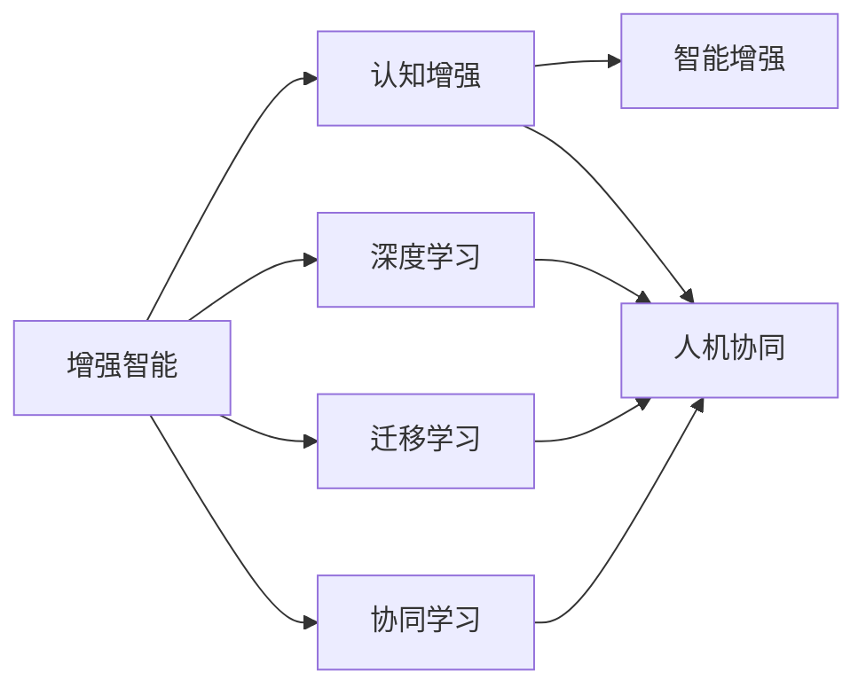

                 

# 增强智能：人机协同，拓展认知新领域

## 1. 背景介绍

在人工智能（AI）技术不断革新的今天，人机协同已成为驱动未来科技发展的关键力量。机器学习与认知科学的融合，不仅提升了人工智能系统的智能水平，也在不断拓展人类认知的新领域。本文将深入探讨人机协同的概念，展示其在增强智能方面的潜力，并展望其未来的发展趋势。

## 2. 核心概念与联系

### 2.1 核心概念概述

为更好地理解人机协同的原理和架构，我们首先介绍几个核心概念：

- **增强智能(Enhanced Intelligence)**：通过技术手段，赋予人类或机器新的认知能力，从而增强其解决问题的能力。

- **人机协同(Human-Machine Collaboration)**：人类与机器协同工作，相互补充，形成高效的信息处理与决策机制。

- **认知增强(Cognitive Enhancement)**：通过AI技术，提高人类的认知能力，如记忆、思考、决策等。

- **智能增强(Intelligence Enhancement)**：通过AI技术，提升机器的智能水平，使其能够执行更复杂的任务。

- **深度学习(Deep Learning)**：基于神经网络的机器学习范式，通过大量数据和计算资源，训练出具备强大特征提取和模式识别能力的模型。

- **迁移学习(Transfer Learning)**：将一个领域学到的知识迁移到另一个领域，加速模型的学习过程。

- **协同学习(Cooperative Learning)**：多个学习体相互协作，共同学习和优化。

这些核心概念相互交织，共同构成了人机协同的基础框架，使得人机系统能够实现更加高效、智能的信息处理与决策。

### 2.2 核心概念原理和架构的 Mermaid 流程图



这个流程图展示了增强智能、认知增强、智能增强等人机协同的关键概念及其相互关系。深度学习、迁移学习、协同学习等技术，为人机协同提供了强大的技术支撑。

## 3. 核心算法原理 & 具体操作步骤

### 3.1 算法原理概述

人机协同的核心在于将人类的认知优势与机器的计算能力相结合，实现信息的高效处理与决策。其算法原理主要包括以下几个方面：

- **认知增强模型**：通过深度学习模型，捕捉人类认知过程中的关键特征，如语言、图像、声音等。
- **智能增强模型**：基于强化学习、迁移学习等技术，使机器能够在复杂环境中自主学习并做出决策。
- **协同学习框架**：通过多智能体系统、联邦学习等技术，实现不同机器或人类之间的信息共享与协作。

### 3.2 算法步骤详解

基于人机协同的增强智能系统开发流程通常包括以下步骤：

**Step 1: 数据准备**
- 收集并标注训练数据，涵盖不同领域、不同类型的数据。
- 对数据进行预处理，包括数据清洗、特征提取等。

**Step 2: 模型选择与设计**
- 选择合适的深度学习模型，如卷积神经网络（CNN）、循环神经网络（RNN）、变压器（Transformer）等。
- 设计模型架构，包括输入层、隐藏层、输出层等。

**Step 3: 模型训练与优化**
- 使用训练数据集对模型进行训练，最小化损失函数。
- 使用优化算法（如Adam、SGD等）调整模型参数，避免过拟合。
- 使用正则化技术（如L2正则、Dropout等），提高模型泛化能力。

**Step 4: 模型评估与验证**
- 使用验证集评估模型性能，包括准确率、召回率、F1分数等指标。
- 进行超参数调优，如学习率、批次大小、迭代轮数等。

**Step 5: 应用部署**
- 将训练好的模型部署到实际应用场景中，实现人机协同。
- 集成监控与反馈机制，实时调整模型参数，提高系统性能。

### 3.3 算法优缺点

人机协同技术具有以下优点：
1. 高效协同：人机系统能够充分利用人类与机器的各自优势，实现信息的高效处理。
2. 智能增强：通过深度学习、强化学习等技术，提升系统的智能水平，解决复杂问题。
3. 灵活应用：可以根据不同的应用场景，灵活调整系统架构与功能。
4. 数据驱动：依托大量数据，实现模型的自适应与持续优化。

同时，也存在一些局限性：
1. 资源消耗：需要大量的计算资源与数据支持，存在一定的技术门槛。
2. 安全问题：涉及到个人隐私与数据安全，需要建立有效的隐私保护机制。
3. 伦理争议：涉及伦理与道德问题，需要慎重考虑人机协同的公平性与正义性。

### 3.4 算法应用领域

人机协同技术在多个领域中得到了广泛应用：

- **医疗健康**：结合医生经验与AI辅助诊断，提高医疗服务质量与效率。
- **金融服务**：通过智能投顾与风险管理，优化金融产品设计与风险控制。
- **教育培训**：提供个性化学习建议与智能辅助教学，提升学习效果与教育质量。
- **智能制造**：实现机器自动化操作与智能决策，提升生产效率与产品质量。
- **智能交通**：结合人类与车辆数据，优化交通流量控制，减少交通事故。
- **环境保护**：利用AI技术监测环境变化，提供科学决策支持。

## 4. 数学模型和公式 & 详细讲解 & 举例说明

### 4.1 数学模型构建

在认知增强模型的构建中，我们通常使用深度学习框架，如TensorFlow、PyTorch等。以下是一个简单的卷积神经网络（CNN）模型的数学模型构建：

$$
\begin{aligned}
H &= f(\mathcal{C}(W^c \times X + b^c) + \mathcal{C}(W^k \times X + b^k)) \\
S &= f(H \times W^s + b^s) + \mathcal{C}(W^k \times H + b^k)
\end{aligned}
$$

其中，$f$ 表示激活函数，$\mathcal{C}$ 表示卷积操作，$W$ 和 $b$ 分别表示权重矩阵与偏置项，$X$ 表示输入数据。

### 4.2 公式推导过程

对于一个简单的CNN模型，其公式推导过程如下：

**Step 1: 卷积层**
$$
H = \mathcal{C}(W^c \times X + b^c) + \mathcal{C}(W^k \times X + b^k)
$$
其中，$W^c$ 和 $W^k$ 分别表示卷积核矩阵，$X$ 表示输入数据，$b^c$ 和 $b^k$ 分别表示卷积偏置项。

**Step 2: 池化层**
$$
S = f(H \times W^s + b^s) + \mathcal{C}(W^k \times H + b^k)
$$
其中，$f$ 表示激活函数，$W^s$ 和 $b^s$ 分别表示池化层权重矩阵与偏置项。

### 4.3 案例分析与讲解

以图像分类任务为例，使用CNN模型进行图像增强与智能识别。假设有一个图片分类数据集，包含猫与狗的图像。模型输入为 $X$，输出为 $Y$。训练过程中，模型首先经过卷积层、池化层等操作，将输入数据转换为特征图 $H$。然后通过全连接层，将特征图转换为输出结果 $S$。最终，通过损失函数（如交叉熵损失）计算模型与真实标签的差异，使用优化算法（如Adam）更新模型参数，最小化损失函数，直至模型收敛。

## 5. 项目实践：代码实例和详细解释说明

### 5.1 开发环境搭建

在进行人机协同系统的开发前，我们需要准备好开发环境。以下是使用Python进行TensorFlow开发的环境配置流程：

1. 安装Anaconda：从官网下载并安装Anaconda，用于创建独立的Python环境。

2. 创建并激活虚拟环境：
```bash
conda create -n tensorflow-env python=3.8 
conda activate tensorflow-env
```

3. 安装TensorFlow：根据CUDA版本，从官网获取对应的安装命令。例如：
```bash
conda install tensorflow-gpu=2.6.0
```

4. 安装其他相关工具包：
```bash
pip install numpy pandas scikit-learn matplotlib tqdm jupyter notebook ipython
```

完成上述步骤后，即可在`tensorflow-env`环境中开始项目实践。

### 5.2 源代码详细实现

我们以图像分类任务为例，使用TensorFlow和Keras进行CNN模型的微调。

首先，定义数据处理函数：

```python
import tensorflow as tf
from tensorflow.keras.preprocessing.image import ImageDataGenerator

def data_generator(batch_size, train_dir, validation_dir):
    train_datagen = ImageDataGenerator(rescale=1./255)
    train_generator = train_datagen.flow_from_directory(
        train_dir,
        target_size=(224, 224),
        batch_size=batch_size,
        class_mode='categorical',
        shuffle=True
    )
    
    validation_datagen = ImageDataGenerator(rescale=1./255)
    validation_generator = validation_datagen.flow_from_directory(
        validation_dir,
        target_size=(224, 224),
        batch_size=batch_size,
        class_mode='categorical',
        shuffle=False
    )
    
    return train_generator, validation_generator
```

然后，定义模型和损失函数：

```python
from tensorflow.keras import layers, models

model = models.Sequential([
    layers.Conv2D(32, (3, 3), activation='relu', input_shape=(224, 224, 3)),
    layers.MaxPooling2D((2, 2)),
    layers.Conv2D(64, (3, 3), activation='relu'),
    layers.MaxPooling2D((2, 2)),
    layers.Conv2D(128, (3, 3), activation='relu'),
    layers.MaxPooling2D((2, 2)),
    layers.Flatten(),
    layers.Dense(64, activation='relu'),
    layers.Dense(2, activation='softmax')
])

loss_fn = tf.keras.losses.CategoricalCrossentropy()
```

接着，定义训练和评估函数：

```python
from tensorflow.keras.optimizers import Adam

optimizer = Adam(learning_rate=0.001)

def train_model(model, train_generator, validation_generator, epochs):
    model.compile(optimizer=optimizer, loss=loss_fn, metrics=['accuracy'])
    
    history = model.fit(
        train_generator,
        steps_per_epoch=train_generator.n // train_generator.batch_size,
        validation_data=validation_generator,
        validation_steps=validation_generator.n // validation_generator.batch_size,
        epochs=epochs
    )
    
    return history

def evaluate_model(model, validation_generator):
    model.evaluate(validation_generator)
```

最后，启动训练流程并在测试集上评估：

```python
epochs = 10
batch_size = 32

train_generator, validation_generator = data_generator(batch_size, train_dir, validation_dir)

history = train_model(model, train_generator, validation_generator, epochs)
evaluate_model(model, validation_generator)
```

以上就是使用TensorFlow对CNN进行图像分类任务微调的完整代码实现。可以看到，借助Keras的高级API，我们可以用简洁的代码实现模型的训练与评估。

### 5.3 代码解读与分析

让我们再详细解读一下关键代码的实现细节：

**data_generator函数**：
- 定义数据增强与预处理，使用ImageDataGenerator生成数据集。
- 对训练集与验证集进行批次化加载，返回训练与验证数据生成器。

**train_model函数**：
- 使用Keras编译模型，指定优化器、损失函数与评估指标。
- 使用fit函数训练模型，指定训练数据与验证数据，循环迭代epoch，记录训练过程。
- 返回训练历史，用于可视化模型性能。

**evaluate_model函数**：
- 使用evaluate函数在验证集上评估模型，输出模型准确率。

可以看到，TensorFlow和Keras提供了强大的工具支持，使得模型开发和微调变得更加便捷高效。开发者可以将更多精力放在模型设计和应用逻辑上，而不必过多关注底层实现细节。

## 6. 实际应用场景

### 6.1 医疗诊断

人机协同在医疗诊断中具有重要应用。通过结合医生的经验和AI技术，可以实现精准的疾病诊断与治疗方案推荐。

在技术实现上，可以收集大量医疗影像与病历数据，对模型进行预训练，使其学习到常见疾病的特征。在此基础上对预训练模型进行微调，使其能够准确判断新的病患影像，并提出治疗建议。微调后的模型可以在医院系统中实时运行，辅助医生快速诊断，提高诊疗效率与准确性。

### 6.2 金融投资

人机协同在金融投资中同样大放异彩。通过结合市场数据与AI技术，可以实现智能投顾与风险管理。

在实践中，可以收集历史股票数据、市场新闻、经济指标等，训练模型预测股票价格变化趋势。微调后的模型可以实时监测市场动态，提供投资建议与风险预警，帮助投资者制定科学的投资策略。

### 6.3 教育辅导

人机协同在教育辅导中具有广泛应用。通过结合教学资源与AI技术，可以实现个性化学习与智能辅导。

在技术实现上，可以收集学生学习数据、教材内容、作业反馈等，训练模型生成个性化学习计划。微调后的模型可以实时分析学生的学习进度，提供针对性的辅导与反馈，帮助学生提高学习效果。

## 7. 工具和资源推荐

### 7.1 学习资源推荐

为了帮助开发者系统掌握人机协同的理论基础和实践技巧，这里推荐一些优质的学习资源：

1. **《深度学习》课程**：斯坦福大学开设的深度学习课程，介绍了深度学习的基本概念与算法。
2. **《神经网络与深度学习》书籍**：迈克尔·尼格罗波洛斯（Michael Nielsen）的深度学习入门书籍，深入浅出地介绍了神经网络的基本原理。
3. **《TensorFlow官方文档》**：TensorFlow的官方文档，提供了丰富的学习资源与实践样例。
4. **Kaggle竞赛**：参加Kaggle数据科学竞赛，积累实战经验，提高解决问题的能力。
5. **《Human-Machine Collaboration》书籍**：麦肯锡全球研究院（McKinsey Global Institute）的协作论文，介绍了人机协同的商业应用。

通过对这些资源的学习实践，相信你一定能够快速掌握人机协同的基本原理与实践技巧，并用于解决实际问题。

### 7.2 开发工具推荐

人机协同系统的开发需要借助多种工具，以下是几款常用的工具：

1. **TensorFlow**：基于数据流的计算框架，支持分布式计算与GPU加速，适用于大规模深度学习模型开发。
2. **PyTorch**：动态计算图的深度学习框架，支持GPU加速与自动化微分，适用于快速迭代研究。
3. **Keras**：高级深度学习API，支持快速搭建与训练模型，简化模型开发流程。
4. **Jupyter Notebook**：交互式编程环境，支持代码编辑、调试与可视化，适用于研究与演示。
5. **WealthWhale**：资产管理平台，利用AI技术进行投资组合优化与管理。
6. **Coursera**：在线学习平台，提供各类深度学习与人工智能课程，支持理论与实践相结合。

合理利用这些工具，可以显著提升人机协同系统的开发效率，加速创新迭代的步伐。

### 7.3 相关论文推荐

人机协同技术的发展源于学界的持续研究。以下是几篇奠基性的相关论文，推荐阅读：

1. **《深度学习》论文**：Goodfellow et al. 的深度学习论文，系统介绍了深度学习的基本原理与算法。
2. **《迁移学习》论文**：Russell & Norvig 的迁移学习论文，介绍了迁移学习的基本概念与方法。
3. **《协同学习》论文**：Friedkin & Johnstone 的协同学习论文，介绍了协同学习的基本原理与算法。
4. **《人机协同》论文**：Karsai et al. 的人机协同论文，介绍了人机协同的基本概念与方法。
5. **《认知增强》论文**：Cooper & Shallice 的认知增强论文，介绍了认知增强的基本原理与方法。

这些论文代表了大语言模型微调技术的发展脉络。通过学习这些前沿成果，可以帮助研究者把握学科前进方向，激发更多的创新灵感。

## 8. 总结：未来发展趋势与挑战

### 8.1 研究成果总结

本文对基于深度学习的人机协同技术进行了全面系统的介绍。首先阐述了人机协同的概念，展示了其在增强智能方面的潜力。其次，从原理到实践，详细讲解了人机协同的数学原理与操作步骤，给出了完整的项目实践样例。同时，本文还广泛探讨了人机协同技术在医疗、金融、教育等多个领域的应用前景，展示了其广泛的应用价值。最后，本文精选了人机协同技术的各类学习资源与实践工具，力求为开发者提供全方位的技术指引。

通过本文的系统梳理，可以看到，人机协同技术通过深度学习、迁移学习、协同学习等技术，实现了高效协同与智能增强。未来，随着技术的不断进步，人机协同将在更多领域大放异彩，为人类认知智能的进化带来深远影响。

### 8.2 未来发展趋势

展望未来，人机协同技术将呈现以下几个发展趋势：

1. **多模态融合**：将视觉、听觉、文本等多模态信息融合，实现更全面、更准确的信息处理与决策。
2. **跨领域迁移**：将一个领域学到的知识迁移到另一个领域，加速模型的学习过程，提升模型的泛化能力。
3. **自适应学习**：根据不同场景与任务需求，动态调整模型参数与结构，实现个性化与自适应。
4. **联邦学习**：通过分布式协同学习，充分利用多方数据资源，提升模型的性能与鲁棒性。
5. **隐私保护**：引入隐私保护技术，如差分隐私、联邦学习等，保护用户数据隐私与安全性。
6. **伦理审查**：建立伦理审查机制，确保人机协同系统的公平性与正义性。

这些趋势预示着人机协同技术的未来发展方向，将在更多领域带来变革性影响。随着技术的不断进步，人机协同将真正实现智能与人类认知的深度融合，推动社会进步与创新。

### 8.3 面临的挑战

尽管人机协同技术已经取得了瞩目成就，但在迈向更加智能化、普适化应用的过程中，它仍面临着诸多挑战：

1. **数据质量**：高质量数据的获取与标注是提升模型性能的关键，但数据获取与标注成本较高，限制了技术的应用范围。
2. **计算资源**：人机协同系统的开发与部署需要大量计算资源与存储资源，存在一定的技术门槛。
3. **隐私保护**：人机协同系统涉及大量用户数据，需要建立有效的隐私保护机制，保护用户隐私与数据安全。
4. **伦理问题**：人机协同系统的应用可能涉及伦理与道德问题，需要慎重考虑公平性与正义性。
5. **模型泛化**：不同领域与场景的模型泛化能力不足，需要进一步提升模型的自适应性与鲁棒性。
6. **模型可解释性**：人机协同系统的复杂性高，模型的可解释性较差，难以理解和调试。

这些挑战需要学界与产业界的共同努力，通过技术创新与规范制定，不断推动人机协同技术的发展与应用。

### 8.4 研究展望

面向未来，人机协同技术需要在以下几个方面寻求新的突破：

1. **跨模态学习**：将视觉、听觉、文本等多模态信息融合，提升模型的感知能力与决策能力。
2. **联邦学习**：通过分布式协同学习，充分利用多方数据资源，提升模型的性能与鲁棒性。
3. **自适应学习**：根据不同场景与任务需求，动态调整模型参数与结构，实现个性化与自适应。
4. **隐私保护**：引入隐私保护技术，如差分隐私、联邦学习等，保护用户数据隐私与安全性。
5. **伦理审查**：建立伦理审查机制，确保人机协同系统的公平性与正义性。

这些研究方向的探索发展，必将引领人机协同技术迈向更高的台阶，为构建安全、可靠、可解释、可控的智能系统铺平道路。唯有勇于创新、敢于突破，才能不断拓展人机协同的边界，让人工智能技术更好地造福人类社会。

## 9. 附录：常见问题与解答

**Q1: 人机协同与增强智能有什么区别？**

A: 人机协同是指人类与机器相互协作，共同完成任务。而增强智能则是指通过技术手段，提高人类或机器的认知能力，使其具备更强的决策与执行能力。人机协同是实现增强智能的一种手段，二者相互补充，共同推动智能系统的进步。

**Q2: 深度学习在人机协同中的应用前景如何？**

A: 深度学习是人机协同技术的重要基础。通过深度学习，可以高效地提取与处理数据，实现复杂模式的识别与预测。深度学习在大数据、大规模计算资源支持下，能够显著提升系统的智能水平，实现人机协同系统的广泛应用。

**Q3: 人机协同系统在实际应用中需要注意哪些问题？**

A: 在实际应用中，人机协同系统需要注意以下几个问题：
1. 数据质量：高质量数据的获取与标注是提升模型性能的关键，需要投入大量时间和资源。
2. 计算资源：人机协同系统需要大量的计算资源与存储资源，需要合理分配与优化。
3. 隐私保护：系统涉及大量用户数据，需要建立有效的隐私保护机制，保护用户隐私与数据安全。
4. 伦理问题：系统可能涉及伦理与道德问题，需要慎重考虑公平性与正义性。

**Q4: 如何提高人机协同系统的泛化能力？**

A: 提高人机协同系统的泛化能力可以从以下几个方面入手：
1. 引入多模态数据：将视觉、听觉、文本等多模态信息融合，提升系统的感知能力与决策能力。
2. 使用联邦学习：通过分布式协同学习，充分利用多方数据资源，提升模型的性能与鲁棒性。
3. 应用迁移学习：将一个领域学到的知识迁移到另一个领域，加速模型的学习过程，提升模型的泛化能力。
4. 引入差分隐私：保护用户隐私与数据安全，避免模型过拟合。
5. 优化模型结构：合理设计模型的架构与参数，提升模型的泛化能力。

这些措施可以帮助人机协同系统更好地适应不同场景与任务，提升系统的泛化能力与鲁棒性。

**Q5: 人机协同技术在医疗、金融、教育等领域的应用前景如何？**

A: 人机协同技术在医疗、金融、教育等领域具有广泛的应用前景：
1. 医疗诊断：结合医生的经验和AI技术，实现精准的疾病诊断与治疗方案推荐。
2. 金融投资：结合市场数据与AI技术，实现智能投顾与风险管理。
3. 教育辅导：结合教学资源与AI技术，实现个性化学习与智能辅导。

这些应用展示了人机协同技术在提升工作效率、优化决策质量、改善用户体验等方面的巨大潜力，未来将有更多行业受益于这一技术。

---

作者：禅与计算机程序设计艺术 / Zen and the Art of Computer Programming

