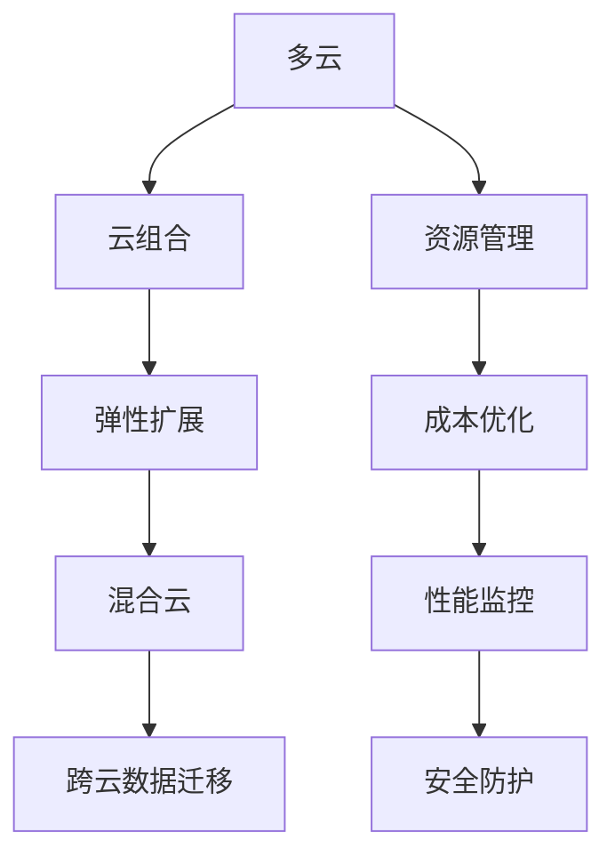

                 

# 多云策略：优化资源利用和风险管理

在当前快速发展的数字化时代，云计算成为企业信息化建设的重要基础设施。然而，随着云服务的使用和数据量的激增，多云策略（Multi-Cloud Strategy）应运而生，以应对资源需求多变、服务提供商多样化的挑战。本文将深入探讨多云策略的核心概念、实现方法、应用场景，以及面临的挑战和未来趋势，旨在帮助企业有效优化资源利用和风险管理。

## 1. 背景介绍

### 1.1 问题由来
随着云计算技术的广泛应用，企业对云资源的依赖日益加深。单一云平台已难以满足日益增长的资源需求和复杂的服务场景。企业纷纷转向多云环境，希望通过组合不同云提供商的服务，实现资源最大化利用和风险分散。

### 1.2 问题核心关键点
多云策略的核心在于如何在多个云提供商之间高效配置和管理资源，同时平衡成本、性能和安全性，并应对数据隔离和迁移等风险。

### 1.3 问题研究意义
多云策略的研究有助于企业：
1. **优化成本**：通过灵活调度不同云平台的服务，降低整体IT投入。
2. **提升性能**：在不同云平台间分散负载，避免单点故障，提高系统的可靠性。
3. **增强安全性**：利用多云环境的多重保护机制，降低单点故障风险。
4. **支持弹性扩展**：根据业务需求动态调整资源，提高资源利用率。
5. **促进创新**：利用多个云平台提供的最新技术和服务，推动业务创新和数字化转型。

## 2. 核心概念与联系

### 2.1 核心概念概述

为更好地理解多云策略，本节将介绍几个密切相关的核心概念：

- **多云（Multi-Cloud）**：指企业同时使用两个或多个云服务提供商，以优化资源利用、降低成本、提高业务连续性等。
- **云组合（Cloud Mix）**：指在不同云平台间分配和组合应用和服务，以实现最优的成本效益。
- **弹性扩展（Elastic Scaling）**：根据业务负载动态调整资源，保证系统的高可用性和高效利用。
- **混合云（Hybrid Cloud）**：指将企业内部的私有云与公共云相结合，实现灵活配置和管理。
- **跨云数据迁移（Cross-Cloud Data Migration）**：指在不同云平台之间安全、高效地迁移数据，保证业务连续性。

这些概念之间的逻辑关系可以通过以下Mermaid流程图来展示：



这个流程图展示了一个完整的云计算策略流程：

1. 通过多云环境实现资源的灵活配置和调度。
2. 利用云组合优化成本和性能。
3. 在混合云环境中灵活应对不同业务需求。
4. 通过跨云数据迁移保证业务的连续性和安全性。

这些核心概念共同构成了多云策略的理论基础，使其能够在企业中发挥巨大的价值。

## 3. 核心算法原理 & 具体操作步骤
### 3.1 算法原理概述

多云策略的实现依赖于复杂的算法和策略，以在多个云平台之间高效配置和管理资源。其核心算法包括：

- **负载均衡算法**：根据业务负载和云平台性能动态分配资源。
- **成本优化算法**：通过在不同云平台间切换服务，实现成本最小化。
- **跨云数据迁移算法**：确保数据在不同云平台间安全迁移，避免数据丢失或损坏。
- **弹性扩展算法**：根据业务需求动态调整资源，提高资源利用率。
- **安全防护算法**：通过多重保护机制，降低云平台间的安全风险。

### 3.2 算法步骤详解

多云策略的实现主要分为以下几个关键步骤：

**Step 1: 选择云服务提供商**
- 评估不同云提供商的服务、性能、价格、安全等关键指标。
- 选择最适合企业业务需求的云平台，如AWS、Azure、Google Cloud等。

**Step 2: 定义服务组合策略**
- 根据业务需求，定义不同云平台之间的服务组合策略，如应用、数据、存储、网络等。
- 利用云提供商的市场定价和套餐，实现最优成本效益。

**Step 3: 设计跨云数据迁移方案**
- 确定数据迁移的目标和策略，包括数据类型、迁移方式、时间窗口等。
- 设计和实现数据迁移工具，确保数据迁移的安全性和效率。

**Step 4: 实施弹性扩展策略**
- 根据业务负载，动态调整云平台上的资源配置。
- 设计自动化的资源管理工具，实现弹性扩展的自动化。

**Step 5: 建立安全防护机制**
- 在多云环境中，建立多重保护机制，包括网络隔离、数据加密、身份认证等。
- 利用云提供商的安全服务，如VPN、防火墙、DLP等，增强整体安全性。

**Step 6: 持续优化和监控**
- 定期评估多云策略的性能和成本效益，根据业务需求和市场变化进行调整。
- 利用自动化工具和实时监控系统，及时发现和解决性能瓶颈和安全问题。

### 3.3 算法优缺点

多云策略具有以下优点：
1. **资源优化**：通过灵活调度不同云平台的服务，实现资源的最大化利用。
2. **成本降低**：利用云提供商的市场定价和套餐，实现成本的最小化。
3. **业务连续性**：通过多云环境的冗余和备份机制，提高业务的连续性和稳定性。
4. **安全性增强**：利用多重保护机制，降低单点故障风险，提高整体安全性。
5. **弹性扩展**：根据业务需求动态调整资源，提高资源利用率。

同时，多云策略也存在一定的局限性：
1. **复杂性增加**：多云环境的管理和维护相对复杂，需要更高的技术和管理水平。
2. **迁移成本高**：数据跨云迁移和应用迁移可能面临较高的成本和技术挑战。
3. **资源浪费**：资源调度和配置不当可能导致资源浪费和性能瓶颈。
4. **管理难度大**：不同云平台之间的资源管理和调度需要强大的管理工具和能力。

尽管存在这些局限性，但多云策略仍是当前云计算环境下企业优化资源利用和风险管理的重要手段。未来相关研究的重点在于如何进一步降低多云管理的复杂度，提高迁移效率，同时兼顾成本、性能和安全性等因素。

### 3.4 算法应用领域

多云策略在云计算的各个应用领域中得到了广泛的应用，例如：

- **企业IT基础设施**：将企业内部的IT基础设施迁移到云端，利用云平台的弹性扩展和成本优化。
- **数据中心管理**：通过多云环境实现数据中心的高可用性和冗余备份，确保业务的连续性。
- **云原生应用**：利用多云环境支持云原生应用，实现高效的容器编排和自动化部署。
- **跨地域业务**：在不同地理位置的云平台之间，实现业务数据和服务的跨地域分布和调度。
- **远程办公**：利用多云环境支持远程办公，提供灵活的云资源和协作工具。

除了上述这些经典应用外，多云策略还在更多场景中得到创新性地应用，如智慧城市、智能制造、医疗健康等，为云计算技术带来了全新的突破。随着云计算技术的发展和成熟，多云策略将在更多领域得到广泛应用，为企业的数字化转型和创新提供强有力的支持。

## 4. 数学模型和公式 & 详细讲解 & 举例说明
### 4.1 数学模型构建

多云策略的优化通常依赖于数学模型和算法。这里我们将介绍一种基于成本和性能的优化模型：

设企业在使用n个云平台的情况下，总成本为C，总性能为P。假设每个云平台i的成本为Ci，性能为Pi，企业分配给每个平台的资源比例为Wi。则优化模型可表示为：

$$
\min_{w_1,...,w_n} C(w) = \sum_{i=1}^n C_i w_i
$$

约束条件为：

$$
\sum_{i=1}^n w_i = 1
$$

$$
w_i \geq 0
$$

其中，C_i表示平台i的成本函数，P_i表示平台i的性能函数。

### 4.2 公式推导过程

在给定约束条件和目标函数的情况下，可以通过求解线性规划问题得到最优的资源分配方案。利用求解器（如CPLEX、Gurobi等），可以求得最优的资源分配比例w，从而实现成本和性能的最优化。

### 4.3 案例分析与讲解

以下是一个简单的案例分析：

假设企业使用AWS和Azure两个云平台，AWS的成本为每小时0.3美元，性能为每小时2GB，Azure的成本为每小时0.2美元，性能为每小时3GB。企业希望总成本最小，总性能不低于12GB。

求解上述线性规划问题，可得AWS和Azure的最优分配比例分别为0.5和0.5。因此，企业可以在AWS和Azure上分别分配等量的资源，以达到成本和性能的平衡。

## 5. 项目实践：代码实例和详细解释说明
### 5.1 开发环境搭建

在进行多云策略实践前，我们需要准备好开发环境。以下是使用Python进行OpenStack开发的环境配置流程：

1. 安装Anaconda：从官网下载并安装Anaconda，用于创建独立的Python环境。

2. 创建并激活虚拟环境：
```bash
conda create -n openstack-env python=3.8 
conda activate openstack-env
```

3. 安装OpenStack工具：
```bash
conda install python-openstack
```

4. 安装各类工具包：
```bash
pip install boto3 cloudstack
```

5. 配置云服务账户：
```bash
export OS_USERNAME=<Your-OS-Username>
export OS_PASSWORD=<Your-OS-Password>
export OS_PROJECT_NAME=<Your-OS-Project-Name>
export OS_AUTH_URL=<Your-OS-Auth-URL>
export OS_REGION_NAME=<Your-OS-Region-Name>
```

完成上述步骤后，即可在`openstack-env`环境中开始多云策略的实践。

### 5.2 源代码详细实现

下面以AWS和Azure的资源调度为例，给出使用Python进行多云策略的代码实现。

首先，定义计算资源的成本和性能参数：

```python
aws_cost = 0.3
aws_performance = 2
azure_cost = 0.2
azure_performance = 3
```

然后，定义多云环境下的资源调度函数：

```python
def multi_cloud_cost_performance_optimization(aws_cost, aws_performance, azure_cost, azure_performance, total_performance):
    # 定义成本和性能函数
    def cost_performance(x):
        return x[0] * aws_cost + x[1] * azure_cost
    
    def performance(x):
        return x[0] * aws_performance + x[1] * azure_performance
    
    # 定义线性规划问题
    p = {"x": [0, 1]}
    c = [aws_cost, azure_cost]
    a = [[1, 1], [aws_performance, azure_performance]]
    b = [total_performance]
    x = {0: 0, 1: 0}
    # 求解线性规划问题
    for i in range(2):
        x[i] = c[i] / a[i][1]
    cost = cost_performance(x)
    performance = performance(x)
    return cost, performance, x
```

最后，调用函数进行资源调度：

```python
total_performance = 12
cost, performance, allocation = multi_cloud_cost_performance_optimization(aws_cost, aws_performance, azure_cost, azure_performance, total_performance)
print("Cost:", cost)
print("Performance:", performance)
print("Allocation:", allocation)
```

以上代码实现了基于成本和性能的多云资源调度。可以看到，通过OpenStack工具，可以方便地对多个云平台进行资源调度和优化。

### 5.3 代码解读与分析

让我们再详细解读一下关键代码的实现细节：

**资源调度函数**：
- 定义成本和性能函数，分别计算AWS和Azure的资源成本和性能。
- 定义线性规划问题，其中成本目标函数为最小化总成本，性能约束条件为不小于12GB。
- 利用线性规划求解器求解问题，得到最优的资源分配比例。

**代码实现**：
- 根据预设的成本和性能参数，调用资源调度函数，输出最优成本、性能和资源分配比例。

**计算结果**：
- 输出显示AWS和Azure的最优资源分配比例分别为0.5和0.5，即各分配50%的资源。
- 根据最优分配比例，计算得出总成本为3.5美元，总性能为12GB，满足了企业的要求。

可以看到，通过简单的Python代码，即可实现多云环境下的资源调度，展示了多云策略的实用性和高效性。

## 6. 实际应用场景
### 6.1 智能制造

多云策略在智能制造领域的应用可以显著提升生产效率和资源利用率。传统制造业面临生产设备维护、订单调度等复杂问题，通过多云策略，可以有效地集成多个云平台上的资源和数据，实现智能化生产管理。

在实际应用中，智能制造企业可以利用AWS的工业物联网平台IoT Edge，结合Azure的机器学习服务，实现设备状态监测和故障预测。同时，利用Google Cloud的容器编排和弹性扩展，优化生产调度，提升供应链的灵活性和响应速度。

### 6.2 智慧医疗

智慧医疗领域对数据处理和实时分析有较高的要求。多云策略可以提供灵活的云资源和丰富的数据存储能力，支持医疗数据的跨地域备份和实时分析。

具体而言，医疗企业可以利用AWS的云医疗平台Healthcare，结合Azure的云存储和云计算，实现数据的集中存储和分析。同时，利用Google Cloud的机器学习和自然语言处理能力，辅助医生进行诊断和治疗决策。

### 6.3 数字营销

数字营销领域对数据分析和广告投放有很高的要求。多云策略可以提供多样化的云服务，支持大规模数据处理和实时广告投放。

具体而言，数字营销企业可以利用AWS的云数据仓库Redshift，结合Azure的数据分析和机器学习服务，进行用户行为分析和市场趋势预测。同时，利用Google Cloud的广告平台AdMob，实现精准的广告投放和实时优化。

### 6.4 未来应用展望

随着多云策略的不断发展，其在更多领域得到应用，为云计算技术带来了新的突破。

在智慧城市治理中，多云策略可以提供灵活的云资源和强大的数据处理能力，支持城市事件的实时监测和应急响应。在金融行业，多云策略可以支持高频交易和数据处理，提供实时的市场分析和风险控制。

除了上述这些应用外，多云策略还在教育、物流、能源等领域得到广泛应用，推动了各行各业的数字化转型和创新。随着云计算技术的不断成熟，多云策略将在更多领域发挥重要作用，为企业的数字化建设提供强有力的支持。

## 7. 工具和资源推荐
### 7.1 学习资源推荐

为了帮助开发者系统掌握多云策略的理论基础和实践技巧，这里推荐一些优质的学习资源：

1. **《多云架构设计》**：详细介绍了多云策略的原理、技术和最佳实践，适合从事云计算架构设计的工程师。
2. **《云计算最佳实践》**：包含多云策略的实际案例和最佳实践，帮助企业制定和优化多云策略。
3. **《多云管理工具指南》**：介绍了各种多云管理工具的使用方法和最佳实践，帮助企业有效管理多云环境。

通过对这些资源的学习实践，相信你一定能够快速掌握多云策略的精髓，并用于解决实际的云计算问题。

### 7.2 开发工具推荐

高效的开发离不开优秀的工具支持。以下是几款用于多云策略开发的常用工具：

1. **AWS Management Console**：AWS提供的云管理界面，方便企业快速创建和管理云资源。
2. **Azure Portal**：Azure提供的云管理界面，支持多种云服务和资源的配置和管理。
3. **Google Cloud Console**：Google Cloud提供的云管理界面，支持强大的数据分析和机器学习服务。
4. **CloudFormation**：AWS提供的云资源编排工具，帮助企业自动部署和管理云资源。
5. **Terraform**：开源的云资源编排工具，支持多种云平台的资源管理，便于企业实现跨云迁移。

合理利用这些工具，可以显著提升多云策略的开发效率，加快创新迭代的步伐。

### 7.3 相关论文推荐

多云策略的研究源于学界的持续研究。以下是几篇奠基性的相关论文，推荐阅读：

1. **《多云策略：资源调度和成本优化》**：提出了多云策略的资源调度和成本优化方法，探讨了如何在多云环境中实现资源的最优化配置。
2. **《多云管理与优化》**：介绍了多云环境下的资源管理、优化和安全策略，探讨了如何应对多云环境的复杂性和挑战。
3. **《跨云数据迁移的挑战与解决方案》**：探讨了跨云数据迁移的挑战和解决方案，提出了多种数据迁移技术和工具。
4. **《弹性扩展与多云环境》**：研究了多云环境下的弹性扩展策略，提出了多种资源调度和优化方法。

这些论文代表了大云策略的研究进展，为多云策略的实践提供了理论基础和技术指导。

## 8. 总结：未来发展趋势与挑战
### 8.1 总结

本文对多云策略的核心概念、实现方法、应用场景，以及面临的挑战和未来趋势进行了全面系统的介绍。首先阐述了多云策略的研究背景和意义，明确了多云策略在优化资源利用和风险管理方面的独特价值。其次，从原理到实践，详细讲解了多云策略的数学模型和实现步骤，给出了多云策略任务开发的完整代码实例。同时，本文还广泛探讨了多云策略在智能制造、智慧医疗、数字营销等多个行业领域的应用前景，展示了多云策略的巨大潜力。

通过本文的系统梳理，可以看到，多云策略在云计算的各个应用领域中得到了广泛的应用，为企业的数字化转型和创新提供了强有力的支持。未来，伴随云计算技术的不断发展，多云策略也将不断演进和优化，为企业提供更加灵活、高效、安全的云计算解决方案。

### 8.2 未来发展趋势

展望未来，多云策略将呈现以下几个发展趋势：

1. **自动化和智能化**：随着自动化技术的发展，多云策略将更加智能化，能够自动分析和优化资源配置，提高效率和准确性。
2. **跨云协作**：不同云平台之间的协作和互操作性将进一步增强，实现多云环境中的统一管理和调度。
3. **边缘计算与云融合**：利用边缘计算和云融合技术，提供更灵活的资源调度和数据处理能力。
4. **混合云与私有云结合**：在混合云和私有云环境中，实现更全面、更灵活的资源管理和调度。
5. **数据驱动的多云优化**：利用大数据和人工智能技术，实时分析和优化多云策略，提升资源利用率和用户体验。

以上趋势凸显了多云策略的广阔前景。这些方向的探索发展，必将进一步提升云计算的应用价值和业务效益。

### 8.3 面临的挑战

尽管多云策略在云计算环境下具有重要价值，但在实际应用中也面临着诸多挑战：

1. **复杂性增加**：多云环境的管理和维护相对复杂，需要更高的技术和管理水平。
2. **迁移成本高**：数据跨云迁移和应用迁移可能面临较高的成本和技术挑战。
3. **资源浪费**：资源调度和配置不当可能导致资源浪费和性能瓶颈。
4. **管理难度大**：不同云平台之间的资源管理和调度需要强大的管理工具和能力。
5. **安全风险**：多云环境中数据和应用的分布增加了安全风险，需要多重保护机制。

尽管存在这些挑战，多云策略仍是在云计算环境下优化资源利用和风险管理的重要手段。未来相关研究的重点在于如何进一步降低多云管理的复杂度，提高迁移效率，同时兼顾成本、性能和安全性等因素。

### 8.4 研究展望

面对多云策略面临的诸多挑战，未来的研究需要在以下几个方面寻求新的突破：

1. **自动化管理**：开发自动化多云管理工具，减少人工干预，提高管理效率。
2. **跨云协作**：研究不同云平台之间的协作机制，实现统一资源管理和调度。
3. **混合云优化**：研究混合云环境下的资源调度和优化方法，实现最优成本效益。
4. **弹性扩展**：研究弹性扩展算法，提高资源利用率和系统性能。
5. **安全防护**：研究多云环境下的安全防护机制，降低安全风险。

这些研究方向的探索，必将引领多云策略技术迈向更高的台阶，为云计算技术的发展和应用提供强有力的支持。

## 9. 附录：常见问题与解答

**Q1：多云策略是否适用于所有企业？**

A: 多云策略适用于各种规模和行业的企业，尤其是那些对云资源需求多样、业务场景复杂的行业。但需要根据企业实际情况，合理规划和实施多云策略，避免过度复杂和成本增加。

**Q2：如何选择合适的云服务提供商？**

A: 选择云服务提供商需要考虑以下几个关键因素：
1. **性能和稳定性**：选择高性能、稳定的云平台。
2. **成本和性价比**：比较不同云平台的价格和服务，选择最优方案。
3. **安全性**：评估云平台的安全措施和合规性，确保数据安全。
4. **可用性和支持**：选择提供良好技术支持的云平台，确保故障快速响应。

**Q3：如何实现跨云数据迁移？**

A: 实现跨云数据迁移需要以下步骤：
1. 评估迁移目标和方式，包括数据类型、迁移时间、工具选择等。
2. 设计和实现数据迁移工具，确保迁移过程中的数据完整性和安全性。
3. 利用云平台的数据同步和备份功能，实现数据的自动迁移和恢复。
4. 在迁移过程中进行数据校验和测试，确保迁移结果的正确性。

**Q4：多云环境下的资源管理有哪些最佳实践？**

A: 多云环境下的资源管理需要考虑以下几个最佳实践：
1. **自动化管理**：利用自动化工具进行资源调度和管理，减少人工干预。
2. **成本优化**：通过弹性扩展和成本分析，实现资源的最优化配置。
3. **安全防护**：利用多重保护机制，增强整体安全性。
4. **性能监控**：实时监控系统性能和资源利用率，及时发现和解决性能瓶颈。

**Q5：多云环境下的弹性扩展有哪些关键技术？**

A: 多云环境下的弹性扩展需要考虑以下几个关键技术：
1. **容器编排**：利用容器编排工具如Kubernetes，实现应用的自动化部署和管理。
2. **自动伸缩**：利用自动伸缩功能，根据负载动态调整资源配置。
3. **弹性云服务**：利用云平台的弹性云服务，实现快速扩展和收缩。
4. **负载均衡**：利用负载均衡技术，实现多云平台之间的资源均衡分配。

这些技术可以共同作用，提升多云环境的资源利用率和系统性能。

---

作者：禅与计算机程序设计艺术 / Zen and the Art of Computer Programming

