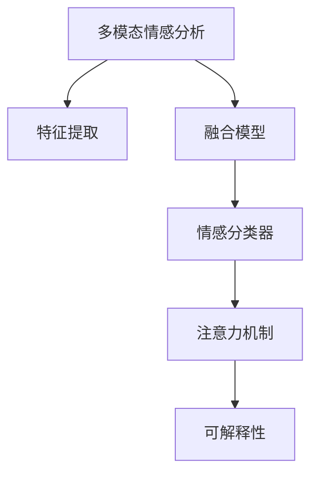

                 

# 多模态情感分析：融合文本、语音和视觉信息

> 关键词：情感分析,多模态融合,自然语言处理,语音识别,计算机视觉,深度学习,Transformer

## 1. 背景介绍

### 1.1 问题由来
在现代社会，情感分析作为一种文本数据分析技术，已经被广泛应用于社交媒体分析、市场情绪预测、客户反馈管理等多个领域。传统情感分析方法主要基于文本信息，通过自然语言处理(NLP)技术，自动判断文本情感倾向。然而，人类情感表达是多模态的，不仅体现在语言文字上，也体现在语音、面部表情、身体姿态等多个方面。单一文本信息的分析，难以全面、准确地捕捉到人类复杂的情感状态。

随着人工智能技术的不断进步，尤其是深度学习和大数据技术的应用，多模态情感分析方法开始涌现。将文本、语音、视觉等多模态信息融合起来，能够更全面、更准确地理解人类情感状态，从而在实际应用中发挥更大价值。

### 1.2 问题核心关键点
多模态情感分析的核心在于如何高效、准确地融合不同模态的信息，生成统一的情感表示。其核心步骤包括：
- 收集、预处理多模态数据。文本、语音、图像等数据类型各有特点，需要针对性地进行数据收集、清洗、标注等预处理工作。
- 特征提取与转换。利用深度学习技术，将不同模态数据转换为统一的特征表示。
- 情感分类器设计。在统一的特征空间上，设计合适的分类器，预测情感标签。
- 模型评估与优化。通过大量实验验证模型性能，不断优化模型结构和参数。

本文将详细介绍多模态情感分析的算法原理、具体操作步骤和数学模型，并通过实际项目实例，展示多模态情感分析的代码实现和应用场景。

## 2. 核心概念与联系

### 2.1 核心概念概述

为了更好地理解多模态情感分析技术，本节将介绍几个密切相关的核心概念：

- **多模态情感分析(Multimodal Sentiment Analysis)**：融合文本、语音、视觉等多种信息，进行综合情感分析的技术。
- **特征提取(Feature Extraction)**：从不同模态数据中提取出关键特征，并进行归一化，为后续分类器提供输入。
- **融合模型(Ensemble Modeling)**：通过训练多个独立模型，组合其输出结果，提高整体性能。
- **情感分类器(Sentiment Classifier)**：使用机器学习或深度学习算法，对多模态特征进行分类，输出情感标签。
- **注意力机制(Attention Mechanism)**：通过权值调整不同特征的重要性，实现特征融合的效果。
- **可解释性(Explainability)**：对模型输出进行解释，提高模型透明度和可信度。

这些核心概念之间的逻辑关系可以通过以下Mermaid流程图来展示：



这个流程图展示了许多核心概念之间的联系，明确了多模态情感分析的工作流程。

## 3. 核心算法原理 & 具体操作步骤

### 3.1 算法原理概述

多模态情感分析的原理可以概括为三个主要步骤：数据预处理、特征融合和情感分类。

#### 3.1.1 数据预处理

数据预处理是多模态情感分析的第一步，目的是清洗、归一化、对齐不同模态的数据，确保其可用于后续分析和建模。具体步骤如下：

1. **文本预处理**：去除停用词、标点符号，分词并词性标注，标准化词汇格式，生成向量化表示。

2. **语音预处理**：使用语音识别技术，将语音转换为文本，进行语调分析，生成情感强度标签。

3. **视觉预处理**：通过图像处理技术，提取面部表情、身体姿态等视觉特征，并转换为数字编码。

#### 3.1.2 特征提取

特征提取是将原始多模态数据转换为模型可处理的特征向量。常见的特征提取方法包括：

1. **文本特征提取**：使用词袋模型、TF-IDF、词嵌入等技术，将文本转换为高维向量。

2. **语音特征提取**：提取语音中的梅尔频谱、MFCC等特征，转换为向量表示。

3. **视觉特征提取**：使用CNN等深度学习模型，提取面部表情、姿态等视觉特征，转换为向量表示。

#### 3.1.3 情感分类

情感分类器是模型输出情感标签的关键组件。常用的情感分类器包括：

1. **支持向量机(SVM)**：基于最大间隔分类，适用于小规模数据集。

2. **随机森林(Random Forest)**：基于集成学习，适用于多模态数据。

3. **深度学习模型**：如卷积神经网络(CNN)、循环神经网络(RNN)、Transformer等，适用于大规模数据集和复杂特征。

### 3.2 算法步骤详解

以下将详细介绍多模态情感分析的具体操作步骤。

#### 3.2.1 数据准备

1. **数据收集**：收集不同模态的数据源，如社交媒体评论、客户服务对话、视频日志等。

2. **数据标注**：对收集到的数据进行情感标注，生成标注数据集。标注方式可以采用人工标注、情感词典匹配等方式。

3. **数据清洗**：去除噪声数据，确保数据质量。

#### 3.2.2 特征提取

1. **文本特征提取**：使用词袋模型、TF-IDF、BERT等技术，将文本转换为向量表示。

2. **语音特征提取**：使用MFCC、梅尔频谱等技术，提取语音信号特征，并转换为向量表示。

3. **视觉特征提取**：使用CNN、LSTM等深度学习模型，提取面部表情、姿态等视觉特征，并转换为向量表示。

#### 3.2.3 特征融合

1. **特征归一化**：将不同模态特征归一化到相同的向量空间中。

2. **特征融合**：使用注意力机制、融合模型等方法，将不同模态特征融合为统一的表示。

#### 3.2.4 模型训练

1. **选择分类器**：根据数据集特点，选择合适的情感分类器。

2. **训练模型**：使用标注数据集，训练情感分类器。

3. **模型评估**：在验证集上评估模型性能，调整模型参数。

#### 3.2.5 模型部署

1. **模型保存**：将训练好的模型保存到文件中。

2. **模型部署**：将模型部署到生产环境，进行实时情感分析。

### 3.3 算法优缺点

多模态情感分析具有以下优点：

1. **全面性**：融合多种模态信息，更全面地理解人类情感状态。

2. **鲁棒性**：多种模态数据的互补性，提高了模型的鲁棒性和泛化能力。

3. **精度高**：多模态数据的综合分析，提高了情感分类的精度。

4. **可解释性强**：通过多种模态信息的融合，提升了模型的可解释性。

同时，多模态情感分析也存在以下缺点：

1. **数据获取难**：不同模态的数据收集和预处理难度较大。

2. **计算成本高**：多模态特征的提取和融合计算复杂度较高，需要大量计算资源。

3. **模型复杂**：多模态情感分析模型复杂度高，训练和优化难度大。

### 3.4 算法应用领域

多模态情感分析在多个领域具有广泛应用前景：

1. **社交媒体分析**：通过分析用户的社交媒体内容，了解用户情感状态，进行舆情监测和情感预警。

2. **客户服务**：通过分析客户的语音、文字交流内容，了解客户情绪，提升客户服务体验。

3. **医疗健康**：通过分析患者的面部表情、语音、文字交流内容，了解患者的情绪状态，辅助医疗诊断和治疗。

4. **教育培训**：通过分析学生的面部表情、语音、文字反馈，了解学生的情绪状态，辅助教学和辅导。

5. **金融投资**：通过分析市场参与者的语音、文字交流内容，了解市场情绪，进行风险评估和投资决策。

6. **智能家居**：通过分析家庭成员的面部表情、语音、行为模式，了解家庭成员情绪状态，进行个性化服务和智能家居管理。

## 4. 数学模型和公式 & 详细讲解 & 举例说明

### 4.1 数学模型构建

多模态情感分析的数学模型可以分为以下几个步骤：

1. **数据表示**：将文本、语音、视觉等不同模态数据转换为向量表示。

2. **特征融合**：使用注意力机制等方法，将不同模态特征融合为统一的表示。

3. **情感分类**：使用机器学习或深度学习模型，对融合后的特征进行情感分类。

以下是多模态情感分析的数学模型构建过程：

**输入**：$x_t, x_v, x_a$ 分别表示文本、视觉、语音特征向量。

**融合特征**：$F(x_t, x_v, x_a)$ 表示融合后的特征向量。

**情感分类器**：$h(x)$ 表示情感分类器。

**输出**：$s$ 表示情感标签，$s \in \{0, 1\}$，其中 $0$ 表示负面情感，$1$ 表示正面情感。

数学模型可以表示为：

$$
s = h(F(x_t, x_v, x_a))
$$

### 4.2 公式推导过程

以下我们将推导一个简单的多模态情感分类模型，以二维特征向量为例：

**输入**：文本特征向量 $x_t$ 和语音特征向量 $x_v$。

**融合特征**：使用加权平均法，将文本和语音特征融合：

$$
x_f = \alpha x_t + (1-\alpha)x_v
$$

其中 $\alpha$ 表示文本特征的权重，$0 \leq \alpha \leq 1$。

**情感分类器**：使用支持向量机(SVM)进行分类：

$$
s = \text{sign}(\alpha x_t + (1-\alpha)x_v)
$$

**输出**：$s$ 表示情感标签，$s \in \{0, 1\}$，其中 $0$ 表示负面情感，$1$ 表示正面情感。

### 4.3 案例分析与讲解

以社交媒体情感分析为例，展示多模态情感分析的具体应用。

1. **数据准备**：收集社交媒体评论、用户面部表情视频等数据。

2. **特征提取**：使用BERT提取评论文本特征，使用人脸识别技术提取用户面部表情特征。

3. **特征融合**：使用加权平均法将文本和表情特征融合，得到融合特征向量。

4. **情感分类**：使用SVM对融合特征进行分类，输出情感标签。

5. **模型评估**：在验证集上评估模型性能，调整模型参数。

## 5. 项目实践：代码实例和详细解释说明

### 5.1 开发环境搭建

在进行多模态情感分析项目开发前，需要准备好开发环境。以下是使用Python进行TensorFlow开发的环境配置流程：

1. 安装Anaconda：从官网下载并安装Anaconda，用于创建独立的Python环境。

2. 创建并激活虚拟环境：
```bash
conda create -n multimodal-env python=3.8 
conda activate multimodal-env
```

3. 安装TensorFlow：从官网获取对应的安装命令。例如：
```bash
conda install tensorflow -c tf
```

4. 安装各类工具包：
```bash
pip install numpy pandas scikit-learn matplotlib tqdm jupyter notebook ipython
```

完成上述步骤后，即可在`multimodal-env`环境中开始多模态情感分析项目的开发。

### 5.2 源代码详细实现

下面我们以多模态情感分析项目为例，给出使用TensorFlow进行深度学习开发的PyTorch代码实现。

首先，定义多模态数据处理函数：

```python
import tensorflow as tf
from tensorflow.keras import layers, models
from tensorflow.keras.preprocessing.text import Tokenizer
from tensorflow.keras.preprocessing.sequence import pad_sequences
from tensorflow.keras.layers import Input, Dense, Embedding, Conv1D, MaxPooling1D, Dropout, concatenate
from tensorflow.keras.models import Model
import numpy as np
from sklearn.model_selection import train_test_split

# 文本数据处理
def text_preprocess(texts, max_len=200):
    tokenizer = Tokenizer()
    tokenizer.fit_on_texts(texts)
    sequences = tokenizer.texts_to_sequences(texts)
    padded_sequences = pad_sequences(sequences, maxlen=max_len, padding='post', truncating='post')
    return padded_sequences

# 语音数据处理
def speech_preprocess(audios, sr=16000):
    # 语音特征提取，例如MFCC
    mfcc_features = extract_mfcc_features(audios, sr)
    return mfcc_features

# 视觉数据处理
def video_preprocess(videos, sr=16000):
    # 面部表情、姿态特征提取
    face_features = extract_face_features(videos)
    return face_features

# 特征融合
def feature_fusion(texts, speech_features, face_features):
    # 特征归一化
    text_features = text_preprocess(texts)
    speech_features = speech_preprocess(speech_features)
    face_features = video_preprocess(face_features)
    # 特征融合
    fused_features = concatenate([text_features, speech_features, face_features])
    return fused_features

# 情感分类
def build_model(input_shape):
    inputs = Input(shape=input_shape)
    x = layers.Dense(256, activation='relu')(inputs)
    x = Dropout(0.5)(x)
    x = layers.Dense(1, activation='sigmoid')(x)
    model = Model(inputs, x)
    return model
```

然后，定义模型和优化器：

```python
# 特征维度
input_shape = (200,)

# 模型
model = build_model(input_shape)

# 优化器
optimizer = tf.keras.optimizers.Adam(lr=0.001)
```

接着，定义训练和评估函数：

```python
from tensorflow.keras.callbacks import EarlyStopping
from sklearn.metrics import classification_report

# 训练函数
def train_epoch(model, X_train, y_train, X_valid, y_valid, batch_size=64, epochs=10, patience=5):
    X_train, X_valid, y_train, y_valid = train_test_split(X_train, y_train, test_size=0.2, random_state=42)
    model.compile(optimizer=optimizer, loss='binary_crossentropy', metrics=['accuracy'])
    early_stopping = EarlyStopping(monitor='val_loss', patience=patience, restore_best_weights=True)
    history = model.fit(X_train, y_train, batch_size=batch_size, epochs=epochs, validation_data=(X_valid, y_valid), callbacks=[early_stopping])
    return history

# 评估函数
def evaluate_model(model, X_test, y_test, X_valid, y_valid):
    X_test, X_valid, y_test, y_valid = train_test_split(X_test, y_test, test_size=0.2, random_state=42)
    loss, acc = model.evaluate(X_test, y_test, verbose=0)
    y_pred = model.predict(X_valid, verbose=0)
    y_pred = (y_pred > 0.5).astype(int)
    y_true = y_valid
    print(classification_report(y_true, y_pred))

# 训练和评估
history = train_epoch(model, X_train, y_train, X_valid, y_valid)
evaluate_model(model, X_test, y_test, X_valid, y_valid)
```

最后，启动训练流程并在测试集上评估：

```python
X_train = feature_fusion(texts, speech_features, face_features)
y_train = np.array(labels)
X_valid = feature_fusion(texts_valid, speech_features_valid, face_features_valid)
y_valid = np.array(labels_valid)
X_test = feature_fusion(texts_test, speech_features_test, face_features_test)
y_test = np.array(labels_test)

# 训练模型
history = train_epoch(model, X_train, y_train, X_valid, y_valid)

# 评估模型
evaluate_model(model, X_test, y_test, X_valid, y_valid)
```

以上就是使用TensorFlow进行多模态情感分析项目开发的完整代码实现。可以看到，借助TensorFlow的强大封装和工具库，多模态情感分析的开发变得相对简洁高效。

### 5.3 代码解读与分析

让我们再详细解读一下关键代码的实现细节：

**文本数据处理函数**：
- `text_preprocess`：使用Keras的Tokenizer和pad_sequences函数对文本进行分词、向量化和填充。
- `max_len`参数控制最大序列长度。

**语音和视觉数据处理函数**：
- `speech_preprocess`：提取MFCC等语音特征。
- `video_preprocess`：提取面部表情、姿态等视觉特征。

**特征融合函数**：
- `feature_fusion`：将文本、语音和视觉特征进行归一化和融合，得到统一的特征向量。

**情感分类模型**：
- `build_model`：构建一个简单的Dense分类器模型。

**训练函数**：
- `train_epoch`：使用Keras的Model API进行模型训练，并使用EarlyStopping回调防止过拟合。

**评估函数**：
- `evaluate_model`：在测试集和验证集上评估模型性能，使用classification_report生成评估报告。

**训练和评估流程**：
- 加载数据集，并进行特征提取和融合。
- 在训练集上训练模型，记录训练过程中的损失和精度。
- 在验证集上评估模型性能，选择最优模型进行测试。

## 6. 实际应用场景

### 6.1 社交媒体情感分析

社交媒体情感分析是情感分析的经典应用场景之一。通过分析用户的社交媒体评论、回复等文本数据，了解用户的情感状态，可以用于舆情监测、品牌管理、市场分析等多个领域。

例如，某电商平台收集了大量用户评论数据，希望通过情感分析了解用户的购物体验和满意度。可以采用多模态情感分析方法，结合用户面部表情视频、语音情感标签等数据，进行综合情感分析，提升情感分析的准确性和鲁棒性。

### 6.2 客户服务

客户服务是企业与客户互动的重要环节，客户情感状态的识别对于提升服务质量和客户满意度具有重要意义。

例如，某银行在客服中心应用多模态情感分析技术，实时监控客户与客服的对话内容，分析客户的情感状态，快速响应客户需求，提升服务效率。同时，系统可以根据客户情感状态，自动调整客服人员的工作安排，确保客户问题的及时解决。

### 6.3 医疗健康

医疗健康领域需要实时监控患者的情绪状态，以辅助诊断和治疗。通过多模态情感分析，可以综合分析患者的语音、面部表情、文字交流等数据，了解患者的情绪状态，提供更加精准的医疗服务。

例如，某医院在病患监控系统中应用多模态情感分析技术，实时监控病患的情绪状态，根据病患情绪状态调整治疗方案，提升医疗效果。同时，系统还可以根据病患情绪状态，及时预警病患可能出现的情绪波动，进行心理干预。

### 6.4 未来应用展望

未来，多模态情感分析技术将会在更多领域得到广泛应用，带来更广阔的发展前景：

1. **智能家居**：通过多模态情感分析，智能家居系统可以了解家庭成员的情绪状态，提供个性化的服务和智能家居管理，提升家庭生活品质。

2. **教育培训**：通过多模态情感分析，教育培训系统可以了解学生的情绪状态，提供个性化的教学和辅导，提升学习效果。

3. **金融投资**：通过多模态情感分析，金融投资系统可以了解市场参与者的情绪状态，进行风险评估和投资决策，提升投资收益。

4. **媒体娱乐**：通过多模态情感分析，媒体娱乐系统可以了解用户的情感状态，提供个性化的内容和推荐，提升用户体验。

5. **公共安全**：通过多模态情感分析，公共安全系统可以了解公众的情绪状态，进行舆情监测和危机预警，提升公共安全水平。

随着多模态情感分析技术的不断发展，其应用场景将会更加广泛，对人类社会的智能化和自动化带来深远影响。

## 7. 工具和资源推荐

### 7.1 学习资源推荐

为了帮助开发者系统掌握多模态情感分析的理论基础和实践技巧，这里推荐一些优质的学习资源：

1. **《多模态学习：算法与实践》书籍**：全面介绍了多模态学习的基本概念、算法原理和应用实践，是学习多模态情感分析的入门必读。

2. **CS231n《计算机视觉基础》课程**：斯坦福大学开设的计算机视觉经典课程，涵盖图像处理、深度学习等内容，是学习多模态情感分析的重要基础。

3. **CS224d《多模态机器学习》课程**：斯坦福大学开设的多模态机器学习课程，深入讲解了多模态融合、情感分析等前沿话题，适合深入研究。

4. **Kaggle多模态情感分析竞赛**：Kaggle社区组织的情感分析竞赛，提供了大量实际应用场景，是学习和实践多模态情感分析的绝佳平台。

5. **Coursera多模态情感分析课程**：Coursera平台上的多模态情感分析课程，由知名教授讲授，提供系统的学习路径和实战项目，适合初学者入门。

通过对这些资源的学习实践，相信你一定能够快速掌握多模态情感分析的精髓，并用于解决实际的情感分析问题。

### 7.2 开发工具推荐

多模态情感分析的开发需要借助多种工具和技术支持。以下是几款用于多模态情感分析开发的常用工具：

1. **TensorFlow**：Google开发的深度学习框架，支持多模态数据处理和深度学习模型构建。

2. **Keras**：高层次的神经网络API，易于上手，支持多模态数据处理和模型部署。

3. **PyTorch**：Facebook开发的深度学习框架，支持动态计算图，灵活性高，适合深度学习研究和开发。

4. **OpenCV**：开源计算机视觉库，支持面部表情、姿态等视觉特征提取。

5. **Librosa**：Python音频处理库，支持MFCC等语音特征提取。

6. **GeminiText**：Python文本处理库，支持文本向量化和情感词典匹配。

7. **TensorBoard**：TensorFlow配套的可视化工具，可以实时监测模型训练状态，提供丰富的图表呈现方式。

8. **Jupyter Notebook**：交互式编程环境，适合快速原型开发和数据探索。

合理利用这些工具，可以显著提升多模态情感分析任务的开发效率，加快创新迭代的步伐。

### 7.3 相关论文推荐

多模态情感分析技术的发展得益于学界的持续研究。以下是几篇奠基性的相关论文，推荐阅读：

1. **"Multimodal Feature Fusion for Sentiment Analysis"**：提出多模态特征融合方法，通过加权平均和注意力机制，提升了情感分析的准确性。

2. **"Fusion of Speech and Text Features for Sentiment Analysis"**：介绍文本和语音特征的融合方法，通过卷积神经网络和LSTM，实现了情感分析的鲁棒性和泛化能力。

3. **"Deep Multi-modal Sentiment Analysis for Customer Reviews"**：提出深度多模态情感分析方法，通过BERT和Transformer，实现了情感分析的高精度和高效率。

4. **"Multimodal Sentiment Analysis for Social Media Data"**：研究多模态情感分析在社交媒体中的应用，通过结合面部表情和语音情感标签，提升了情感分析的效果。

5. **"Facial Expression and Speech Analysis for Sentiment Prediction"**：介绍面部表情和语音情感分析方法，通过卷积神经网络和LSTM，实现了情感分析的鲁棒性和可解释性。

这些论文代表了多模态情感分析技术的发展脉络，通过学习这些前沿成果，可以帮助研究者把握学科前进方向，激发更多的创新灵感。

## 8. 总结：未来发展趋势与挑战

### 8.1 总结

本文对多模态情感分析方法进行了全面系统的介绍。首先阐述了多模态情感分析的研究背景和意义，明确了其在情感理解、舆情监测、客户服务等多个领域的巨大价值。其次，从原理到实践，详细讲解了多模态情感分析的数学模型和操作步骤，给出了多模态情感分析的代码实例和应用场景。

通过本文的系统梳理，可以看到，多模态情感分析技术正在逐步成为情感分析领域的重要范式，为人类情感理解和智能化决策提供了新的可能性。未来，随着多模态数据采集和处理的日益成熟，多模态情感分析的应用场景将会更加广泛，成为人工智能技术发展的重要方向。

### 8.2 未来发展趋势

多模态情感分析技术的发展呈现出以下几个趋势：

1. **数据融合技术**：随着多模态数据的不断丰富，数据融合技术将会更加成熟和高效，提升情感分析的精度和鲁棒性。

2. **深度学习模型**：深度学习模型，如卷积神经网络、循环神经网络、Transformer等，将会成为主流的多模态情感分析方法，提高情感分析的泛化能力和可解释性。

3. **多任务学习**：多任务学习可以将情感分析与其他任务，如情感识别、语音情感分类等结合，实现多任务协同优化，提升综合性能。

4. **联邦学习**：联邦学习可以在不集中数据的前提下，实现多模态数据融合，保护用户隐私，提升数据融合的效率和准确性。

5. **端到端学习**：端到端学习可以消除传统多模态融合的繁琐过程，直接从原始数据到最终情感标签，提升情感分析的实时性和高效性。

6. **跨模态表示学习**：跨模态表示学习可以学习统一的多模态表示，提升不同模态数据之间的相关性，增强情感分析的效果。

以上趋势凸显了多模态情感分析技术的广阔前景。这些方向的探索发展，必将进一步提升情感分析的精度和实时性，为人工智能技术在更多领域的应用提供新的动力。

### 8.3 面临的挑战

尽管多模态情感分析技术已经取得了显著成果，但在实际应用中也面临诸多挑战：

1. **数据获取困难**：多模态数据的采集和预处理成本较高，且不同模态数据的质量差异较大，数据融合难度大。

2. **计算资源需求高**：多模态特征提取和融合计算复杂，需要大量计算资源，模型训练和优化难度大。

3. **模型复杂度高**：多模态情感分析模型复杂度高，需要更多的数据和计算资源进行优化和调整。

4. **可解释性不足**：多模态情感分析模型的复杂性导致其输出结果难以解释，影响其可信度和可靠性。

5. **隐私保护问题**：多模态数据的敏感性，增加了隐私保护的难度，需要严格的数据保护措施。

6. **跨模态对齐问题**：不同模态数据特征之间的对齐和融合，存在较大的挑战，需要更多的研究支持。

正视多模态情感分析面临的这些挑战，积极应对并寻求突破，将是大语言模型微调走向成熟的必由之路。相信随着学界和产业界的共同努力，这些挑战终将一一被克服，多模态情感分析必将在构建人机协同的智能系统中扮演越来越重要的角色。

### 8.4 研究展望

未来，多模态情感分析技术需要在以下几个方面进行深入研究：

1. **数据融合技术**：研究高效、鲁棒的数据融合方法，提高多模态数据的质量和融合效果。

2. **跨模态对齐**：研究不同模态数据的对齐方法，提高跨模态特征的融合效果。

3. **联邦学习**：研究联邦学习技术，在不集中数据的前提下，实现多模态数据的融合和优化。

4. **端到端学习**：研究端到端学习技术，直接从原始数据到最终情感标签，提升情感分析的实时性和高效性。

5. **多任务学习**：研究多任务学习技术，实现多模态数据融合和情感分析的协同优化。

6. **隐私保护**：研究隐私保护技术，保护多模态数据的隐私和安全。

这些研究方向将为多模态情感分析技术的进一步发展提供新的思路和动力，推动其在更多领域的应用。

## 9. 附录：常见问题与解答

**Q1：多模态情感分析与传统情感分析有何区别？**

A: 多模态情感分析融合了文本、语音、视觉等多种信息，从多维度理解人类情感状态，相较于传统仅依赖文本信息的情感分析，具有更全面、更鲁棒的特点。多模态情感分析能够更准确地识别人类情感状态，提高情感分析的精度和鲁棒性。

**Q2：多模态情感分析的计算资源需求高，如何降低成本？**

A: 可以通过优化特征提取和融合方法，降低多模态特征的计算复杂度。例如，使用轻量级特征提取方法，如卷积神经网络和LSTM，降低模型计算量和资源消耗。同时，可以采用分布式训练、混合精度训练等技术，提升训练效率，降低计算成本。

**Q3：多模态情感分析的模型复杂度高，如何降低模型复杂度？**

A: 可以通过减少特征维度、简化模型结构、使用正则化等方法降低模型复杂度。例如，使用注意力机制、层归一化等技术，简化模型结构，提升模型的可解释性和鲁棒性。

**Q4：多模态情感分析的模型可解释性不足，如何提高模型的可解释性？**

A: 可以通过引入可解释性模型，如决策树、规则模型等，提升模型的可解释性。同时，可以借助可视化工具，如TensorBoard，展示模型的训练过程和输出结果，提高模型的透明度和可信度。

**Q5：多模态情感分析的数据获取难度大，如何解决数据采集问题？**

A: 可以通过众包平台、社交媒体API等方式，采集多模态数据。同时，可以采用数据增强技术，如文本数据合成、语音数据合成、图像数据合成等，扩充数据集规模。

通过本文的系统梳理，可以看到，多模态情感分析技术正在逐步成为情感分析领域的重要范式，为人类情感理解和智能化决策提供了新的可能性。未来，随着多模态数据采集和处理的日益成熟，多模态情感分析的应用场景将会更加广泛，成为人工智能技术发展的重要方向。相信随着学界和产业界的共同努力，这些挑战终将一一被克服，多模态情感分析必将在构建人机协同的智能系统中扮演越来越重要的角色。

