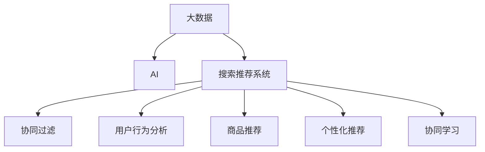

                 

# 大数据与AI 驱动的电商平台：搜索推荐系统是核心竞争优势

> 关键词：大数据, AI, 电商平台, 搜索推荐系统, 机器学习, 深度学习, 协同过滤, 用户行为分析, 商品推荐, 个性化推荐

## 1. 背景介绍

随着电商平台的快速发展，如何通过技术手段提升用户体验，提高交易转化率，成为电商企业面临的重要挑战。大数据与人工智能（AI）技术的深度融合，为电商平台的智能推荐系统提供了新的技术突破口。搜索推荐系统作为电商平台的核心竞争力，通过深度挖掘用户行为数据，精准匹配用户需求，显著提升电商平台的运营效率和用户体验。

### 1.1 问题由来

在电商平台上，用户的行为模式多样，需求变化复杂。传统的基于规则的推荐算法难以满足用户个性化需求，而深度学习算法能够通过数据驱动，动态地捕捉用户行为特征和偏好，从而提供更精准的推荐。然而，大规模用户数据和高并发的系统架构，使得推荐系统的设计和实现面临诸多挑战。

### 1.2 问题核心关键点

推荐系统是电商平台中连接用户与商品的重要桥梁。它的核心任务是通过对用户历史行为和兴趣的分析，预测用户未来的购买行为，从而提供个性化推荐。推荐系统的高效性和准确性直接影响到电商平台的运营效果和用户满意度。

推荐系统的主要挑战包括：
1. 数据获取与处理：大规模用户数据的收集与清洗。
2. 模型设计：推荐算法的设计与优化。
3. 系统架构：高效且可扩展的系统架构设计。
4. 实时性：低延迟的推荐服务。
5. 安全性：保障用户隐私和数据安全。

## 2. 核心概念与联系

### 2.1 核心概念概述

为更好地理解电商平台搜索推荐系统的构建，本节将介绍几个密切相关的核心概念：

- **大数据**：电商平台收集的各类数据，如用户浏览记录、点击行为、购买记录等，数据量巨大，数据类型复杂多样。
- **AI**：利用机器学习、深度学习等技术，从大规模数据中提取用户行为特征和偏好，实现个性化推荐。
- **搜索推荐系统**：电商平台中连接用户与商品的系统，通过搜索和推荐，满足用户需求，提升用户体验。
- **协同过滤**：利用用户之间行为数据的相似性，推荐其他用户喜欢的商品，是一种基于用户行为的推荐算法。
- **用户行为分析**：通过分析用户行为数据，挖掘用户兴趣和偏好，实现更精准的推荐。
- **商品推荐**：根据用户兴趣和行为数据，推荐用户可能感兴趣的商品，提升转化率。

- **个性化推荐**：通过深度学习技术，根据用户历史行为和兴趣，提供个性化的商品推荐。
- **协同学习**：利用用户之间的协同行为，通过共享知识，提升推荐精度。

这些核心概念之间的逻辑关系可以通过以下Mermaid流程图来展示：



这个流程图展示了大数据、AI与搜索推荐系统的联系：

1. 大数据提供原始数据，供AI技术提取和分析。
2. 基于AI技术的推荐算法，构建搜索推荐系统。
3. 推荐系统中的协同过滤、用户行为分析和商品推荐，是实现个性化推荐的核心模块。
4. 协同学习和个性化推荐，通过数据共享和深度学习技术，提升推荐精度。

## 3. 核心算法原理 & 具体操作步骤
### 3.1 算法原理概述

电商平台的搜索推荐系统，主要通过深度学习模型对用户行为数据进行建模，从而实现个性化推荐。核心算法包括协同过滤、用户行为分析、深度学习推荐等。

协同过滤算法基于用户之间行为数据的相似性，实现商品推荐。它分为基于用户的协同过滤和基于物品的协同过滤两种方式。用户行为分析通过对用户历史行为数据进行分析，提取用户兴趣和偏好。深度学习推荐则利用深度神经网络，学习用户行为数据中的特征，实现更精准的推荐。

搜索推荐系统的构建步骤如下：

1. **数据收集与处理**：收集用户行为数据，进行清洗和预处理。
2. **模型训练**：选择合适的深度学习模型，使用标注数据进行训练。
3. **模型评估**：使用测试集对训练好的模型进行评估，选择最优模型。
4. **模型部署**：将训练好的模型部署到生产环境，实现实时推荐。
5. **效果监控**：实时监控推荐系统的性能，根据反馈不断优化模型。

### 3.2 算法步骤详解

以深度学习推荐算法为例，下面是具体的算法步骤：

**Step 1: 数据预处理**

数据预处理是推荐系统构建的第一步。主要包括以下几个环节：
- 数据清洗：去除无关数据，如错误数据、噪声数据等。
- 数据归一化：将数据转换为标准格式，如将浮点型数据归一化为0-1之间的值。
- 特征提取：将原始数据转化为模型可以处理的特征，如将浏览记录转化为向量表示。

**Step 2: 模型选择与训练**

选择合适的深度学习模型，如多任务学习（MTL）、深度矩阵分解（DMD）、注意力机制（Attention）等，并使用标注数据进行训练。以多任务学习为例，其主要步骤包括：
- 选择合适的深度学习框架，如TensorFlow、PyTorch等。
- 定义输入层和输出层，选择合适的损失函数，如均方误差、交叉熵等。
- 训练模型，使用标注数据进行迭代优化。

**Step 3: 模型评估与优化**

模型训练完成后，使用测试集对模型进行评估，选择最优模型。常用的评估指标包括准确率、召回率、F1值等。针对评估结果，可以进行模型优化，如调整超参数、增加训练数据等。

**Step 4: 模型部署与监控**

将训练好的模型部署到生产环境，实现实时推荐。同时，需要对推荐系统进行监控，实时评估其性能，根据反馈不断优化模型。

### 3.3 算法优缺点

深度学习推荐算法具有以下优点：
1. 能够自动提取用户行为数据中的特征，无需手工设计特征。
2. 能够处理大规模用户数据，实现个性化的推荐。
3. 模型的泛化能力较强，适应不同领域的推荐任务。

同时，也存在一些局限性：
1. 对标注数据的依赖较大，需要收集大量标注数据。
2. 模型复杂度高，训练和推理速度较慢。
3. 模型不透明，难以解释推荐过程。
4. 需要较大的计算资源，对硬件要求较高。

### 3.4 算法应用领域

深度学习推荐算法在电商、社交网络、新闻推荐等多个领域得到了广泛应用，具体应用包括：

- 电商推荐：通过分析用户购买行为，推荐用户可能感兴趣的商品。
- 社交网络推荐：根据用户行为数据，推荐其他用户喜欢的内容或好友。
- 新闻推荐：通过分析用户阅读行为，推荐相关新闻内容。

推荐系统的应用不仅提升了用户体验，还显著提高了电商平台的转化率和收入。

## 4. 数学模型和公式 & 详细讲解 & 举例说明

### 4.1 数学模型构建

推荐系统的核心任务是预测用户对商品或内容的评分。以电商推荐为例，假设有 $N$ 个用户，$M$ 个商品，用户对商品的评分矩阵为 $R \in \mathbb{R}^{N \times M}$，其中 $R_{ui}$ 表示用户 $u$ 对商品 $i$ 的评分。

推荐系统的目标是预测用户 $u$ 对商品 $i$ 的评分 $r_{ui}$，可以使用如下数学模型：

$$
r_{ui} = f(\mathbf{x}_u, \mathbf{x}_i, \theta)
$$

其中，$\mathbf{x}_u$ 表示用户 $u$ 的特征向量，$\mathbf{x}_i$ 表示商品 $i$ 的特征向量，$\theta$ 为模型的可学习参数。

### 4.2 公式推导过程

以矩阵分解为例，假设有 $N$ 个用户，$M$ 个商品，用户对商品的评分矩阵为 $R \in \mathbb{R}^{N \times M}$。模型的目标是通过分解 $R$ 矩阵，找到低秩矩阵 $\mathbf{U} \in \mathbb{R}^{N \times K}$ 和 $\mathbf{V} \in \mathbb{R}^{M \times K}$，使得 $R \approx \mathbf{U} \mathbf{V}^T$，其中 $K$ 为隐向量维度。

最小二乘法的目标函数为：

$$
\min_{\mathbf{U}, \mathbf{V}} \frac{1}{2} ||R - \mathbf{U} \mathbf{V}^T||_F^2
$$

其中，$||.||_F$ 表示矩阵的 Frobenius 范数。

对上述目标函数进行优化，可以得到 $\mathbf{U}$ 和 $\mathbf{V}$ 的更新公式：

$$
\mathbf{U} \leftarrow \mathbf{U} - \eta \frac{\partial \mathcal{L}(\mathbf{U}, \mathbf{V})}{\partial \mathbf{U}}
$$
$$
\mathbf{V} \leftarrow \mathbf{V} - \eta \frac{\partial \mathcal{L}(\mathbf{U}, \mathbf{V})}{\partial \mathbf{V}}
$$

其中，$\eta$ 为学习率。

### 4.3 案例分析与讲解

以电商推荐为例，可以使用协同过滤算法进行推荐。协同过滤算法分为基于用户的协同过滤和基于物品的协同过滤两种方式：

- 基于用户的协同过滤：通过分析用户之间行为数据的相似性，推荐其他用户喜欢的商品。具体步骤包括：
  1. 计算用户之间的相似度，如余弦相似度、Pearson相关系数等。
  2. 根据相似度计算用户对商品的评分，从而推荐用户可能感兴趣的商品。

- 基于物品的协同过滤：通过分析商品之间行为数据的相似性，推荐其他用户喜欢的商品。具体步骤包括：
  1. 计算商品之间的相似度，如余弦相似度、Pearson相关系数等。
  2. 根据相似度计算用户对商品的评分，从而推荐用户可能感兴趣的商品。

## 5. 项目实践：代码实例和详细解释说明
### 5.1 开发环境搭建

在进行推荐系统实践前，我们需要准备好开发环境。以下是使用Python进行TensorFlow开发的环境配置流程：

1. 安装Anaconda：从官网下载并安装Anaconda，用于创建独立的Python环境。

2. 创建并激活虚拟环境：
```bash
conda create -n tf-env python=3.8 
conda activate tf-env
```

3. 安装TensorFlow：根据CUDA版本，从官网获取对应的安装命令。例如：
```bash
conda install tensorflow -c tf -c conda-forge
```

4. 安装各类工具包：
```bash
pip install numpy pandas scikit-learn matplotlib tqdm jupyter notebook ipython
```

完成上述步骤后，即可在`tf-env`环境中开始推荐系统实践。

### 5.2 源代码详细实现

这里我们以基于协同过滤的电商推荐系统为例，给出使用TensorFlow进行深度学习推荐系统的PyTorch代码实现。

首先，定义数据处理函数：

```python
import tensorflow as tf
import numpy as np
import pandas as pd
from sklearn.model_selection import train_test_split

def load_data(file_path, header, split_ratio=0.8, seed=42):
    df = pd.read_csv(file_path, header=header)
    X = df.drop('rating', axis=1)
    y = df['rating']
    X_train, X_test, y_train, y_test = train_test_split(X, y, test_size=split_ratio, random_state=seed)
    return X_train, X_test, y_train, y_test
```

然后，定义协同过滤模型：

```python
def collaborative_filtering(X_train, X_test, y_train, y_test):
    N, M, K = X_train.shape[0], X_train.shape[1], 10
    X_train = tf.keras.layers.Dense(K, activation='relu')(X_train)
    X_test = tf.keras.layers.Dense(K, activation='relu')(X_test)
    V = tf.keras.layers.Dense(1, activation='sigmoid')(X_train)
    U = tf.keras.layers.Dense(K, activation='relu')(tf.concat([X_test, V], axis=1))
    Y_pred = U * V
    loss = tf.keras.losses.mean_squared_error(y_test, Y_pred)
    optimizer = tf.keras.optimizers.Adam(learning_rate=0.001)
    model = tf.keras.Model(inputs=X_test, outputs=Y_pred)
    model.compile(optimizer=optimizer, loss=loss)
    model.fit(X_test, y_test, epochs=10, batch_size=64)
    return model
```

最后，启动训练流程并在测试集上评估：

```python
X_train, X_test, y_train, y_test = load_data('data.csv', header=0)
model = collaborative_filtering(X_train, X_test, y_train, y_test)
model.evaluate(X_test, y_test)
```

以上就是使用TensorFlow进行基于协同过滤的电商推荐系统的完整代码实现。可以看到，得益于TensorFlow的强大封装，我们可以用相对简洁的代码完成推荐模型的训练和评估。

### 5.3 代码解读与分析

让我们再详细解读一下关键代码的实现细节：

**load_data函数**：
- `read_csv`方法：读取CSV格式的数据文件，并指定表头。
- `drop`方法：去除目标变量。
- `split`方法：将数据集分为训练集和测试集。

**collaborative_filtering函数**：
- `Dense`层：定义多层全连接神经网络，实现特征提取。
- `concat`方法：将用户特征和用户对商品评分的预测值拼接，用于训练。
- `sigmoid`激活函数：输出层的激活函数，使得模型输出在0-1之间。
- `mean_squared_error`损失函数：均方误差损失函数，用于衡量模型预测的误差。
- `Adam`优化器：优化器，控制模型参数的更新方向和步长。

**训练流程**：
- `compile`方法：编译模型，指定损失函数和优化器。
- `fit`方法：训练模型，指定训练数据和批大小。
- `evaluate`方法：评估模型，输出测试集上的评分。

可以看出，TensorFlow提供的高层API使得深度学习推荐系统的构建和训练变得非常简洁高效。开发者可以将更多精力放在数据处理和模型改进上，而不必过多关注底层实现细节。

当然，工业级的系统实现还需考虑更多因素，如模型的保存和部署、超参数的自动搜索、更灵活的推荐策略等。但核心的推荐范式基本与此类似。

## 6. 实际应用场景
### 6.1 智能客服系统

基于推荐系统的智能客服系统，可以广泛应用于电商平台。传统客服系统需要配备大量人力，高峰期响应缓慢，且无法提供24小时不间断服务。而推荐系统能够根据用户的历史行为和偏好，自动推荐相似商品或问题解答，减少客服工作量，提升客户满意度。

在技术实现上，可以收集用户浏览、点击、购买等行为数据，分析用户的兴趣和偏好，实时推荐相关商品或问题解答。对于用户提出的新问题，系统还能动态搜索和匹配答案，形成智能化的推荐列表，帮助用户快速解决问题。

### 6.2 金融投资平台

金融投资平台需要对市场数据进行实时监控和分析，推荐合适的投资策略和产品。推荐系统能够根据用户的交易历史和偏好，推荐相匹配的投资策略或产品，减少用户的决策时间和成本。

在技术实现上，可以使用多维度的用户行为数据，如交易时间、交易金额、交易类型等，构建复杂的推荐模型，实时输出推荐结果。同时，系统还需要考虑风险控制和用户隐私保护，保证推荐结果的可靠性和安全性。

### 6.3 健康医疗平台

健康医疗平台需要对用户的健康数据进行分析和推荐，推荐个性化的健康方案和产品。推荐系统能够根据用户的健康数据和偏好，推荐匹配的健康方案或产品，帮助用户科学管理健康。

在技术实现上，可以使用用户的健康数据、运动数据、饮食数据等，构建个性化的推荐模型。同时，系统还需要考虑隐私保护和数据安全，保护用户的健康数据不被泄露。

### 6.4 未来应用展望

随着推荐系统的不断发展，未来将会在更多领域得到应用，为各行各业带来变革性影响。

在智慧城市治理中，推荐系统可以用于城市事件监测、交通规划、旅游推荐等，提高城市管理的自动化和智能化水平，构建更安全、高效的未来城市。

在智能家居领域，推荐系统可以用于智能家电推荐、生活场景推荐等，提升用户的生活质量，构建智能化的家庭环境。

在教育领域，推荐系统可以用于个性化学习方案推荐、课程推荐等，提升教育质量，促进教育公平，提高学习效率。

总之，推荐系统将在各行各业中发挥越来越重要的作用，推动社会生产力的提升和人民生活水平的提高。

## 7. 工具和资源推荐
### 7.1 学习资源推荐

为了帮助开发者系统掌握推荐系统的理论基础和实践技巧，这里推荐一些优质的学习资源：

1. 《推荐系统实战》：详细介绍了推荐系统的基本原理和实践方法，涵盖协同过滤、深度学习等多种推荐算法。

2. Coursera《推荐系统》课程：斯坦福大学开设的推荐系统课程，有Lecture视频和配套作业，帮助学习推荐系统的基础知识和算法实现。

3. Kaggle推荐系统竞赛：Kaggle平台上有多个推荐系统竞赛，提供实战场景和数据集，帮助开发者在实践中提升技能。

4. 《Deep Learning for Recommendation Systems》书籍：深入介绍了深度学习在推荐系统中的应用，包括基于深度矩阵分解和注意力机制的推荐算法。

5. Arxiv推荐系统论文合集：Arxiv上推荐系统的最新研究论文合集，涵盖协同过滤、深度学习、知识图谱等多个方向。

通过对这些资源的学习实践，相信你一定能够快速掌握推荐系统的精髓，并用于解决实际的推荐问题。

### 7.2 开发工具推荐

高效的开发离不开优秀的工具支持。以下是几款用于推荐系统开发的常用工具：

1. TensorFlow：基于Python的开源深度学习框架，灵活动态的计算图，适合快速迭代研究。

2. PyTorch：基于Python的开源深度学习框架，灵活高效的计算图，适合复杂模型训练。

3. Apache Spark：分布式计算框架，支持大规模数据处理和机器学习任务。

4. Apache Flink：分布式流式处理框架，支持实时推荐系统的构建。

5. ELK Stack：日志分析工具，用于监控推荐系统的性能和异常。

6. Kibana：可视化工具，用于监控推荐系统的实时数据和指标。

合理利用这些工具，可以显著提升推荐系统的开发效率，加快创新迭代的步伐。

### 7.3 相关论文推荐

推荐系统的发展源于学界的持续研究。以下是几篇奠基性的相关论文，推荐阅读：

1. A Probabilistic Model for Recommendation List Generation（协同过滤算法）：提出协同过滤算法的概率模型，开创了协同过滤的研究。

2. Deep Factorization Machines for Recommender Systems（深度因子分解机）：提出深度因子分解机算法，结合深度学习和协同过滤的优点，实现更精准的推荐。

3. Attention Is All You Need（Transformer）：提出Transformer模型，用于推荐系统中的深度学习推荐。

4. Feature-based Deep Collaborative Filtering with Attention Mechanisms（基于特征的深度协同过滤）：提出基于特征的深度协同过滤算法，解决传统协同过滤算法的稀疏性问题。

5. Adaptive Deep Networks for Conversational Recommendations（适应性深度网络）：提出适应性深度网络算法，解决深度学习推荐系统中的个性化推荐问题。

这些论文代表了大规模推荐系统的发展脉络。通过学习这些前沿成果，可以帮助研究者把握学科前进方向，激发更多的创新灵感。

## 8. 总结：未来发展趋势与挑战

### 8.1 总结

本文对基于大数据和AI技术的电商平台搜索推荐系统进行了全面系统的介绍。首先阐述了推荐系统在电商平台中的重要地位和作用，明确了推荐系统对电商平台的运营效果和用户体验的影响。其次，从原理到实践，详细讲解了推荐算法的数学模型和具体实现，给出了推荐系统开发的完整代码实例。同时，本文还广泛探讨了推荐系统在智能客服、金融投资、健康医疗等多个行业领域的应用前景，展示了推荐系统的广泛应用潜力。此外，本文精选了推荐系统的各类学习资源，力求为读者提供全方位的技术指引。

通过本文的系统梳理，可以看到，基于大数据和AI技术的推荐系统为电商平台的智能化转型提供了重要技术支撑，极大地提升了电商平台的运营效率和用户体验。未来，伴随大数据和AI技术的不断进步，推荐系统也将不断进化，为用户提供更精准、更个性化的推荐服务。

### 8.2 未来发展趋势

展望未来，推荐系统的发展趋势将呈现以下几个方向：

1. 深度学习推荐算法将得到更广泛的应用，实现个性化推荐，提升用户体验。

2. 推荐系统将与更多AI技术进行融合，如自然语言处理、计算机视觉等，实现多模态推荐。

3. 推荐系统将与区块链技术结合，保障推荐结果的可信度和安全性。

4. 推荐系统将采用联邦学习等分布式技术，保护用户隐私和数据安全。

5. 推荐系统将采用联邦学习等分布式技术，实现跨平台推荐，提升推荐精度。

6. 推荐系统将采用增强学习技术，提升系统的自主学习和自适应能力。

以上趋势凸显了推荐系统在各个领域中的广泛应用前景，相信未来推荐系统将在更多行业领域中发挥重要作用，带来新的技术突破和应用场景。

### 8.3 面临的挑战

尽管推荐系统在电商平台上已经取得了显著效果，但在实现更精准、更个性化推荐的过程中，仍面临诸多挑战：

1. 数据获取与处理：大规模用户数据和高并发的系统架构，使得推荐系统的构建和优化面临诸多技术挑战。

2. 模型优化：深度学习模型的复杂度较高，需要大量的计算资源和优化技术，才能实现高效和精确的推荐。

3. 隐私保护：推荐系统需要收集用户大量行为数据，如何在保障用户隐私和数据安全的前提下，实现推荐效果的最大化，是当前研究的重要课题。

4. 公平性：推荐系统需要确保推荐结果的公平性和无偏性，避免对某些用户或群体产生歧视性影响。

5. 可解释性：深度学习模型的决策过程往往不透明，难以解释推荐结果的生成机制，这会影响用户的信任和接受度。

6. 跨领域应用：推荐系统在不同领域的应用场景中，需要针对具体领域的特点，进行算法优化和系统架构设计，才能实现较好的效果。

这些挑战凸显了推荐系统在技术应用和实际部署中的复杂性和多样性。未来需要更多的研究投入，才能克服这些挑战，推动推荐系统的应用和发展。

### 8.4 研究展望

面对推荐系统面临的挑战，未来的研究需要在以下几个方面寻求新的突破：

1. 探索新的推荐算法：如图神经网络、强化学习等，实现更高效、更准确的推荐。

2. 引入更多先验知识：如知识图谱、规则库等，提升推荐系统的解释性和可靠性。

3. 提升推荐系统的可解释性：如特征可视化、模型解释技术等，提升用户对推荐系统的信任和接受度。

4. 强化用户隐私保护：如联邦学习、差分隐私等技术，保护用户隐私和数据安全。

5. 提升推荐系统的公平性：如公平性约束、推荐算法优化等，提升推荐结果的公平性和无偏性。

6. 探索跨领域推荐：如多模态推荐、多任务学习等，提升推荐系统的跨领域适应能力。

这些研究方向将进一步提升推荐系统的性能和应用效果，推动推荐系统在更多领域中发挥重要作用。

## 9. 附录：常见问题与解答

**Q1：推荐系统是否适用于所有电商领域？**

A: 推荐系统在大多数电商领域都能取得不错的效果，特别是对于数据量较小的领域。但对于一些特定领域的电商，如垂直电商平台、C2C平台等，推荐系统的构建和优化需要更多技术和经验积累。

**Q2：推荐系统如何处理冷启动问题？**

A: 冷启动问题是指新用户或新商品没有历史数据，难以进行推荐。常见的解决方案包括：
1. 利用用户特征或商品特征进行推荐，如利用用户的性别、年龄、地理位置等。
2. 使用协同过滤算法，利用其他用户或商品的相似度进行推荐。
3. 使用基于内容推荐的算法，利用商品属性、标签等信息进行推荐。

**Q3：推荐系统如何避免重复推荐？**

A: 重复推荐是指系统多次推荐相同的商品或内容。常见的解决方案包括：
1. 使用去重策略，如删除已经推荐过的商品。
2. 使用协同过滤算法，过滤掉与其他用户相似度低的商品。
3. 使用随机策略，随机选择商品进行推荐。

**Q4：推荐系统如何实现实时推荐？**

A: 实时推荐是指系统能够根据用户实时行为，实时输出推荐结果。常见的解决方案包括：
1. 使用分布式计算框架，如Apache Spark、Apache Flink等，实现实时数据处理。
2. 使用缓存技术，如Redis、Memcached等，缓存高频访问的商品信息，提升推荐速度。
3. 使用异步处理技术，如消息队列、任务队列等，实现实时推荐。

**Q5：推荐系统如何提升推荐精度？**

A: 推荐精度是指系统推荐的商品或内容与用户实际需求相匹配的程度。常见的提升方法包括：
1. 引入更多用户特征或商品特征，提升推荐模型的准确性。
2. 引入更多先验知识，如知识图谱、规则库等，提升推荐模型的解释性和可靠性。
3. 使用多模型融合技术，提升推荐系统的鲁棒性和泛化能力。

这些方法可以帮助推荐系统更好地处理复杂多样的电商场景，提供更精准、更个性化的推荐服务。

---

作者：禅与计算机程序设计艺术 / Zen and the Art of Computer Programming

