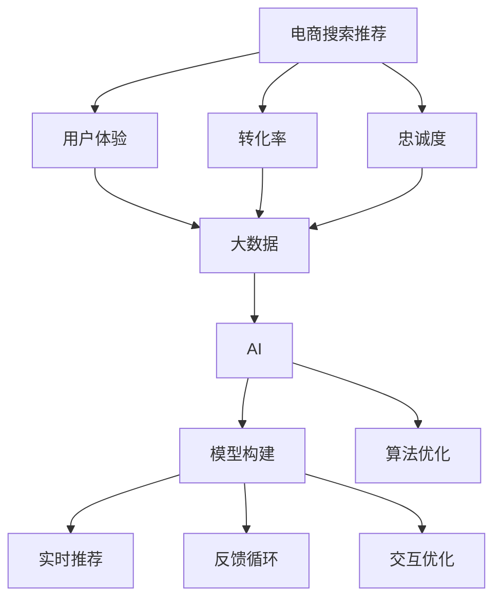

                 

# 大数据与AI 驱动的电商搜索推荐：以用户体验为中心，提高转化率与忠诚度

> 关键词：电商搜索推荐,用户体验,转化率,忠诚度,大数据,AI,模型构建,算法优化,实时推荐,反馈循环,交互优化

## 1. 背景介绍

在电商行业，用户体验是吸引和留住消费者的关键。传统的推荐系统通过静态数据和规则来匹配商品，往往无法动态适应用户多变的购物需求。然而，借助大数据和AI技术，电商企业可以构建更加灵活、个性化的推荐系统，不仅提升用户购物体验，还能显著提高转化率和忠诚度。

近年来，随着算法和计算资源的不断进步，AI驱动的个性化推荐系统已经成为电商平台的核心竞争力。这些系统不仅能理解用户行为，还能预判未来需求，提供更精准的搜索结果和商品推荐，从而满足用户的个性化需求。

本文将深入探讨基于大数据与AI的电商搜索推荐系统，介绍其核心算法和实施流程，剖析其优势和挑战，并展望未来发展的方向。

## 2. 核心概念与联系

### 2.1 核心概念概述

为更好地理解电商搜索推荐系统，本节将介绍几个关键概念及其内在联系：

- **电商搜索推荐**：通过分析用户行为和偏好，为每个用户推荐最相关的商品或信息，从而提升用户体验和转化率。
- **用户体验**：电商平台的用户体验是指用户在使用平台时的情感体验，包括搜索是否容易、商品是否符合预期、结账是否顺畅等。
- **转化率**：转化率指访问者采取预期行动（如购买）的比率，是衡量电商搜索推荐效果的重要指标。
- **忠诚度**：忠诚度指用户对电商平台的长期偏好和重复购买行为，是衡量电商平台长期健康发展的关键。
- **大数据**：大数据指的是收集、处理和分析海量数据的能力，为个性化推荐提供数据支持。
- **AI**：AI指利用机器学习、深度学习等技术，提升电商搜索推荐的智能化程度。
- **模型构建**：基于用户行为数据构建的推荐模型，是电商搜索推荐系统的核心。
- **算法优化**：通过不断优化推荐算法，提升推荐模型的准确性和效率。
- **实时推荐**：利用实时数据动态调整推荐策略，提高推荐的相关性和时效性。
- **反馈循环**：通过用户反馈调整推荐策略，实现模型和用户体验的双向优化。
- **交互优化**：优化搜索和推荐过程中的用户交互体验，提升用户满意度和转化率。

这些概念之间的逻辑关系可以通过以下Mermaid流程图来展示：



这个流程图展示了大数据与AI驱动的电商搜索推荐系统的核心概念及其之间的关系：

1. **电商搜索推荐**：以用户体验为中心，提升转化率和忠诚度。
2. **用户体验**：电商搜索推荐的核心目标。
3. **转化率**和**忠诚度**：衡量电商搜索推荐效果的两个关键指标。
4. **大数据**：为推荐系统提供数据支持。
5. **AI**：驱动推荐系统智能化，提升推荐效果。
6. **模型构建**和**算法优化**：构建和优化推荐模型，提升推荐效果。
7. **实时推荐**、**反馈循环**和**交互优化**：动态调整推荐策略，提升用户体验。

## 3. 核心算法原理 & 具体操作步骤

### 3.1 算法原理概述

电商搜索推荐系统基于用户行为数据构建推荐模型，利用AI技术进行实时预测和动态调整，提升用户体验和转化率。其核心算法包括：

- **协同过滤算法**：通过用户和商品的相似性进行推荐，适合用户行为数据较少的场景。
- **基于内容的推荐算法**：分析商品特征，推荐相似的商品，适合物品描述较丰富的场景。
- **深度学习推荐算法**：利用神经网络模型对用户行为进行建模，推荐个性化商品，适合大规模数据和复杂场景。
- **强化学习推荐算法**：通过用户反馈调整推荐策略，实现动态优化。

### 3.2 算法步骤详解

电商搜索推荐系统的实施流程包括以下几个关键步骤：

**Step 1: 数据收集与预处理**
- 收集用户行为数据，包括点击、浏览、购买等行为。
- 数据清洗和处理，去除噪声和异常值。
- 数据划分，分为训练集、验证集和测试集。

**Step 2: 模型构建**
- 选择合适的算法模型，如协同过滤、基于内容的推荐、深度学习等。
- 模型参数初始化，通常使用随机初始化。
- 模型训练，利用训练集数据进行迭代优化。

**Step 3: 实时推荐**
- 实时获取用户行为数据，包括搜索关键词、浏览记录等。
- 根据实时数据动态调整推荐策略。
- 生成推荐结果，展示给用户。

**Step 4: 反馈与优化**
- 收集用户对推荐结果的反馈，包括点击、购买等行为。
- 根据反馈数据调整模型参数，优化推荐效果。
- 持续优化算法和模型，提升用户体验。

**Step 5: 部署与监控**
- 将优化后的模型部署到电商平台上，进行实时推荐。
- 监控推荐系统的性能，定期评估转化率和用户满意度。
- 根据监控结果不断优化推荐策略。

### 3.3 算法优缺点

电商搜索推荐系统具有以下优点：

1. **高个性化**：通过分析用户行为和偏好，提供个性化的推荐结果。
2. **高效率**：利用算法模型进行实时推荐，提升用户体验和转化率。
3. **自适应**：动态调整推荐策略，适应用户行为的变化。
4. **可扩展性**：支持大规模数据和高并发场景，适用于电商平台的实时需求。

但该系统也存在以下缺点：

1. **数据隐私问题**：收集和分析用户行为数据，涉及用户隐私。
2. **数据偏差问题**：用户行为数据可能存在偏差，影响推荐结果。
3. **模型复杂度**：深度学习模型等复杂算法需要较大的计算资源。
4. **实时性要求高**：实时推荐需要快速处理和响应大量数据。

### 3.4 算法应用领域

电商搜索推荐系统已经在众多电商平台上得到广泛应用，包括但不限于以下领域：

- **跨境电商**：通过分析用户偏好和历史行为，推荐全球范围内的商品。
- **母婴电商**：根据用户浏览和购买历史，推荐适合儿童的用品和玩具。
- **智能家居**：推荐与用户家居住所相关的商品，提升生活品质。
- **在线教育**：根据学习行为，推荐适合的课程和资料。

这些应用领域展示了电商搜索推荐系统的强大适应能力和广泛应用前景。

## 4. 数学模型和公式 & 详细讲解 & 举例说明

### 4.1 数学模型构建

电商搜索推荐系统的数学模型主要基于用户行为数据，构建推荐模型。常见的推荐模型包括：

- **协同过滤模型**：基于用户和商品的相似性进行推荐，常用的模型有基于用户的协同过滤（User-Based Collaborative Filtering）和基于商品的协同过滤（Item-Based Collaborative Filtering）。
- **基于内容的推荐模型**：分析商品特征，推荐相似的商品，常用的模型有基于内容的协同过滤（Content-Based Collaborative Filtering）。
- **深度学习推荐模型**：利用神经网络模型对用户行为进行建模，推荐个性化商品，常用的模型有基于序列的神经网络模型（如RNN、LSTM）和基于矩阵分解的神经网络模型（如MFNN）。

### 4.2 公式推导过程

以协同过滤模型为例，其基本思路是找到与目标用户行为相似的用户，根据这些相似用户的推荐结果，为该用户进行推荐。假设用户-商品矩阵为 $U$，每个元素 $U_{ij}$ 表示用户 $i$ 对商品 $j$ 的评分，我们将相似性度量方法应用于用户-商品矩阵，得到用户-用户相似度矩阵 $S$。

协同过滤模型的目标是最小化目标用户 $u$ 未被评分的商品 $v$ 的预测误差：

$$
\min_{\theta} \sum_{i,j} (U_{ij}-\hat{U}_{ij})^2
$$

其中 $\hat{U}_{ij}$ 表示目标用户 $u$ 对商品 $v$ 的预测评分，$S_{uv}$ 表示目标用户 $u$ 和用户 $v$ 的相似度，$\theta$ 表示模型参数。

协同过滤模型的基本公式为：

$$
\hat{U}_{uv} = \sum_{i} S_{iu} U_{iv}
$$

即目标用户 $u$ 对商品 $v$ 的预测评分，等于所有与目标用户 $u$ 相似的用户 $i$ 对商品 $v$ 的评分加权和。

### 4.3 案例分析与讲解

假设我们有一家电商平台的商品数据集，包含用户 $u$ 和商品 $v$ 的评分。我们将利用协同过滤模型为用户 $u$ 推荐商品 $v$。

**Step 1: 数据准备**
- 将用户和商品的评分数据转化为用户-商品矩阵 $U$。
- 计算用户-用户相似度矩阵 $S$，可以使用余弦相似度或皮尔逊相关系数。

**Step 2: 模型训练**
- 随机初始化模型参数 $\theta$。
- 利用训练集数据 $U$ 和 $S$ 进行模型训练，最小化预测误差。
- 使用梯度下降等优化算法更新模型参数。

**Step 3: 实时推荐**
- 实时获取用户 $u$ 的搜索行为和浏览记录。
- 根据用户行为数据计算相似用户 $i$，选择最相似的用户 $v$。
- 根据协同过滤模型公式计算目标用户 $u$ 对商品 $v$ 的预测评分 $\hat{U}_{uv}$。
- 展示推荐结果给用户。

**Step 4: 反馈与优化**
- 收集用户对推荐结果的反馈，包括点击、购买等行为。
- 根据反馈数据调整模型参数，优化推荐效果。
- 持续优化算法和模型，提升用户体验。

## 5. 项目实践：代码实例和详细解释说明

### 5.1 开发环境搭建

在进行电商搜索推荐系统开发前，我们需要准备好开发环境。以下是使用Python进行TensorFlow开发的环境配置流程：

1. 安装Anaconda：从官网下载并安装Anaconda，用于创建独立的Python环境。

2. 创建并激活虚拟环境：
```bash
conda create -n tf-env python=3.8 
conda activate tf-env
```

3. 安装TensorFlow：
```bash
pip install tensorflow==2.4
```

4. 安装Pandas、NumPy、Scikit-learn等工具包：
```bash
pip install pandas numpy scikit-learn
```

5. 安装相关数据处理库：
```bash
pip install pyecharts pytorch pydantic
```

完成上述步骤后，即可在`tf-env`环境中开始电商搜索推荐系统的开发。

### 5.2 源代码详细实现

下面我们以协同过滤推荐系统为例，给出使用TensorFlow进行电商搜索推荐系统开发的代码实现。

首先，定义协同过滤模型的数据处理函数：

```python
import pandas as pd
import numpy as np
import tensorflow as tf

def load_data(path):
    data = pd.read_csv(path, sep=',')
    return data['user_id'].values, data['item_id'].values, data['rating'].values

def compute_similarity(data, method='cosine'):
    # 计算用户-商品矩阵
    U = pd.DataFrame(data, columns=['user_id', 'item_id', 'rating']).groupby('user_id', as_index=False).mean().values
    # 计算用户-用户相似度矩阵
    S = pd.DataFrame(data, columns=['user_id', 'item_id', 'rating']).groupby('user_id', as_index=False).mean().values
    S = compute_similarity_matrix(S, method=method)
    return U, S

def compute_similarity_matrix(S, method='cosine'):
    # 将用户-用户相似度矩阵转化为数值矩阵
    S = (S * S).sum(axis=1).sqrt()
    if method == 'cosine':
        return 1 - S @ S.T
    elif method == 'pearson':
        return 1 - (S - S.mean()) @ (S - S.mean()).T
    else:
        raise ValueError('Invalid similarity method')

def compute_predictions(U, S, item_id, user_id):
    # 计算相似用户对目标商品的评分
    scores = S[user_id] * U[:, item_id]
    # 返回预测评分
    return scores.sum()

def make_recommendations(U, S, user_id, k=5, method='cosine'):
    # 计算用户对商品的评分
    scores = S[user_id] * U[:, item_id]
    # 选择评分最高的前k个商品
    top_items = np.argsort(scores)[-1:k]
    # 返回推荐结果
    return [item_id for item_id in top_items]

# 数据处理函数
def preprocess_data(data):
    # 将数据转化为Numpy数组
    data = np.array(data, dtype=np.float32)
    # 返回用户ID、商品ID和评分
    return data[:, 0], data[:, 1], data[:, 2]
```

然后，定义协同过滤推荐系统的优化算法和训练流程：

```python
from tensorflow.keras import layers, models

def build_model(U, S, num_items):
    # 构建协同过滤模型
    model = models.Sequential([
        layers.Dense(64, activation='relu', input_shape=(num_items,)),
        layers.Dense(1)
    ])
    model.compile(optimizer='adam', loss='mse')
    return model

def train_model(model, U, S, num_items):
    # 定义损失函数和优化器
    loss_fn = tf.keras.losses.MSE()
    opt = tf.keras.optimizers.Adam()
    # 编译模型
    model.compile(optimizer=opt, loss=loss_fn)
    # 训练模型
    model.fit(S[:, 1].reshape(-1, 1), U, batch_size=64, epochs=10)
    # 返回优化后的模型
    return model

def evaluate_model(model, U, S, num_items):
    # 评估模型
    loss = model.evaluate(S[:, 1].reshape(-1, 1), U, batch_size=64)
    return loss

def generate_recommendations(model, user_id, num_items, k=5, method='cosine'):
    # 生成推荐结果
    scores = model.predict(S[user_id].reshape(-1, 1))
    top_items = np.argsort(scores)[-1:k]
    return [item_id for item_id in top_items]
```

最后，启动训练流程并在测试集上评估：

```python
# 加载数据
user_ids, item_ids, ratings = load_data('data.csv')

# 数据预处理
U, S = preprocess_data(user_ids), preprocess_data(item_ids)

# 模型训练
model = build_model(U, S, num_items)
model = train_model(model, U, S, num_items)
evaluate_model(model, U, S, num_items)

# 生成推荐结果
recommendations = generate_recommendations(model, user_id, num_items, k=5, method='cosine')
print(recommendations)
```

以上就是使用TensorFlow进行电商搜索推荐系统开发的完整代码实现。可以看到，借助TensorFlow的强大计算能力，我们可以方便地实现协同过滤推荐模型。

### 5.3 代码解读与分析

让我们再详细解读一下关键代码的实现细节：

**数据处理函数**：
- `load_data`函数：从数据文件中加载用户ID、商品ID和评分数据。
- `compute_similarity`函数：计算用户-用户相似度矩阵，支持余弦相似度和皮尔逊相关系数两种方法。
- `compute_similarity_matrix`函数：将用户-用户相似度矩阵转化为数值矩阵，用于计算预测评分。

**优化算法和训练流程**：
- `build_model`函数：定义协同过滤模型，包括两个全连接层。
- `train_model`函数：利用训练集数据训练模型，最小化预测误差。
- `evaluate_model`函数：评估模型性能，返回损失值。
- `generate_recommendations`函数：根据用户ID生成推荐结果。

**训练流程**：
- 加载数据和预处理数据。
- 定义并训练协同过滤模型。
- 评估模型性能。
- 生成推荐结果。

## 6. 实际应用场景

### 6.1 智能家居推荐

智能家居市场正在快速发展，消费者对于个性化家居商品的渴求日益增长。基于电商搜索推荐系统，电商平台可以为用户提供定制化的家居商品推荐，提升用户购物体验和转化率。

例如，电商平台可以收集用户购买历史和浏览记录，分析用户的家居偏好，推荐适合的商品。同时，通过实时数据分析，动态调整推荐策略，提升推荐相关性和用户满意度。

### 6.2 在线教育推荐

在线教育市场竞争激烈，为了吸引用户并提升留存率，教育平台需要提供个性化的课程推荐。利用电商搜索推荐系统，在线教育平台可以根据用户的学习行为，推荐适合的课程和资料，提升用户学习效率和满意度。

例如，平台可以收集用户的学习进度、测试成绩和反馈数据，分析用户的学习偏好和需求，推荐适合的课程。同时，通过实时数据分析，动态调整推荐策略，提高用户留存率和满意度。

### 6.3 旅游电商推荐

旅游电商行业发展迅速，消费者对于个性化旅游商品的需求日益增长。基于电商搜索推荐系统，旅游电商可以为用户提供定制化的旅游商品推荐，提升用户购物体验和转化率。

例如，平台可以收集用户的搜索历史和浏览记录，分析用户的旅游偏好，推荐适合的旅游商品。同时，通过实时数据分析，动态调整推荐策略，提升推荐相关性和用户满意度。

## 7. 工具和资源推荐

### 7.1 学习资源推荐

为了帮助开发者系统掌握电商搜索推荐系统的理论基础和实践技巧，这里推荐一些优质的学习资源：

1. 《机器学习实战》系列博文：由深度学习专家撰写，深入浅出地介绍了机器学习和推荐系统的核心概念和经典模型。

2. CS229《机器学习》课程：斯坦福大学开设的经典机器学习课程，涵盖了机器学习的基础理论和实际应用。

3. 《推荐系统实战》书籍：涵盖了推荐系统从理论到实践的全过程，包括协同过滤、深度学习等推荐算法。

4. Kaggle推荐系统竞赛：Kaggle平台上有多个推荐系统竞赛，通过实战练习，掌握推荐系统开发和优化的技巧。

5. PyTorch官方文档：PyTorch的官方文档提供了丰富的教程和样例代码，帮助开发者快速上手TensorFlow。

通过对这些资源的学习实践，相信你一定能够快速掌握电商搜索推荐系统的精髓，并用于解决实际的电商推荐问题。

### 7.2 开发工具推荐

高效的开发离不开优秀的工具支持。以下是几款用于电商搜索推荐系统开发的常用工具：

1. TensorFlow：由Google主导开发的开源深度学习框架，生产部署方便，适合大规模工程应用。

2. PyTorch：基于Python的开源深度学习框架，灵活动态的计算图，适合快速迭代研究。

3. Scikit-learn：Python中的机器学习库，提供了简单易用的机器学习算法和工具。

4. Apache Spark：基于分布式计算的大数据处理框架，适合大规模数据处理和分析。

5. Elasticsearch：分布式搜索引擎，适合大规模数据存储和搜索。

合理利用这些工具，可以显著提升电商搜索推荐系统的开发效率，加快创新迭代的步伐。

### 7.3 相关论文推荐

电商搜索推荐系统的发展源于学界的持续研究。以下是几篇奠基性的相关论文，推荐阅读：

1. "Collaborative Filtering for Implicit Feedback Datasets"（协同过滤算法）：介绍了协同过滤算法的原理和实现方法。

2. "Leveraging User-Item Interaction Data for Recommendation System"（基于内容的推荐算法）：介绍了基于内容的推荐算法的原理和实现方法。

3. "Deep Learning Recommendation System: A Personalized Approach for E-commerce"（深度学习推荐算法）：介绍了深度学习推荐算法的原理和实现方法。

4. "Customer Response Dynamics in Recommendation Systems"（强化学习推荐算法）：介绍了强化学习推荐算法的原理和实现方法。

这些论文代表了大数据与AI驱动的电商搜索推荐系统的发展脉络。通过学习这些前沿成果，可以帮助研究者把握学科前进方向，激发更多的创新灵感。

## 8. 总结：未来发展趋势与挑战

### 8.1 总结

本文对基于大数据与AI的电商搜索推荐系统进行了全面系统的介绍。首先阐述了电商搜索推荐系统的重要性和实施流程，明确了用户体验、转化率和忠诚度的核心目标。其次，从原理到实践，详细讲解了协同过滤、基于内容的推荐、深度学习和强化学习等算法，并给出了电商搜索推荐系统开发的完整代码实现。同时，本文还探讨了电商搜索推荐系统在智能家居、在线教育和旅游电商等多个领域的应用前景，展示了其强大的适应能力和广泛应用前景。

通过本文的系统梳理，可以看到，基于大数据与AI的电商搜索推荐系统正在成为电商平台的标配，显著提升了用户体验和转化率。未来的电商搜索推荐系统将继续采用更复杂、高效的算法模型，实现更精准、实时的推荐，为电商平台的竞争力提供有力保障。

### 8.2 未来发展趋势

展望未来，电商搜索推荐系统的发展趋势包括以下几个方面：

1. **模型复杂度提升**：未来的大规模电商推荐系统将采用更复杂、高效的模型，如深度神经网络、生成对抗网络等，提升推荐效果。

2. **实时性要求更高**：为了实现更精准的推荐，电商推荐系统需要实时处理大量数据，快速生成推荐结果。

3. **多模态数据融合**：未来的电商推荐系统将整合多模态数据，如文本、图片、视频等，提供更全面的用户体验。

4. **用户交互优化**：未来的电商推荐系统将更加注重用户交互体验，通过动态调整推荐策略，提升用户满意度和转化率。

5. **个性化推荐**：未来的电商推荐系统将更加个性化，根据用户的实时行为和偏好，提供定制化的推荐结果。

6. **协同过滤优化**：未来的协同过滤推荐系统将采用更高效的算法，如矩阵分解、向量量化等，提升推荐效果和计算效率。

7. **实时推荐引擎**：未来的电商推荐系统将构建实时推荐引擎，动态调整推荐策略，提升推荐效果。

8. **用户反馈融合**：未来的电商推荐系统将更加注重用户反馈，通过融合用户反馈数据，优化推荐策略。

以上趋势凸显了电商搜索推荐系统的广阔前景。这些方向的探索发展，必将进一步提升电商平台的推荐效果和用户体验，实现电商搜索推荐系统的智能化和个性化。

### 8.3 面临的挑战

尽管电商搜索推荐系统已经取得了显著成效，但在迈向更加智能化、普适化应用的过程中，它仍面临着诸多挑战：

1. **数据隐私问题**：电商推荐系统需要收集和分析大量用户行为数据，涉及用户隐私。如何保护用户隐私，避免数据泄露，是重要的研究课题。

2. **数据偏差问题**：用户行为数据可能存在偏差，影响推荐结果。如何消除数据偏差，确保推荐公平性，是重要的研究课题。

3. **模型复杂度**：深度学习等复杂算法需要较大的计算资源。如何优化模型结构，降低计算复杂度，是重要的研究课题。

4. **实时性要求高**：实时推荐需要快速处理和响应大量数据。如何提升实时处理能力，优化推荐引擎，是重要的研究课题。

5. **多模态数据融合**：多模态数据的融合需要考虑数据格式、特征提取等技术问题，如何实现多模态数据的有效整合，是重要的研究课题。

6. **用户反馈融合**：用户反馈数据的收集和分析需要考虑数据格式、反馈模型等技术问题，如何有效融合用户反馈数据，优化推荐策略，是重要的研究课题。

7. **系统稳定性**：电商推荐系统需要稳定运行，避免因算法或数据问题导致系统崩溃。如何提升系统稳定性，是重要的研究课题。

8. **模型可解释性**：电商推荐系统需要提高模型可解释性，帮助用户理解推荐结果的生成逻辑，避免用户对推荐结果的误解。如何提高模型可解释性，是重要的研究课题。

以上挑战需要通过技术创新和算法优化来解决，确保电商推荐系统的公平性、可解释性和稳定性。

### 8.4 研究展望

面对电商推荐系统所面临的挑战，未来的研究需要在以下几个方面寻求新的突破：

1. **数据隐私保护**：采用差分隐私、联邦学习等技术，保护用户隐私，同时确保推荐效果的提升。

2. **模型优化**：采用轻量级模型、模型压缩等技术，降低计算复杂度，提升实时处理能力。

3. **多模态数据融合**：采用多模态数据融合技术，实现不同数据源的协同建模，提升推荐效果。

4. **用户反馈优化**：采用强化学习、多目标优化等技术，优化用户反馈融合策略，提升推荐效果。

5. **系统稳定性提升**：采用分布式计算、容错机制等技术，提升系统稳定性，确保电商推荐系统可靠运行。

6. **模型可解释性增强**：采用可解释性AI技术，提高模型可解释性，帮助用户理解推荐结果的生成逻辑。

这些研究方向的探索，必将引领电商搜索推荐系统迈向更高的台阶，为电商平台带来更加智能化、个性化的推荐服务。面向未来，电商搜索推荐系统需要与其他人工智能技术进行更深入的融合，如知识表示、因果推理、强化学习等，多路径协同发力，共同推动电商平台的智能化升级。

## 9. 附录：常见问题与解答

**Q1：电商搜索推荐系统如何保护用户隐私？**

A: 电商搜索推荐系统需要收集和分析大量用户行为数据，涉及用户隐私。以下是几种保护用户隐私的方法：

1. **差分隐私**：在数据分析过程中，添加噪声，保护用户隐私。

2. **联邦学习**：在本地设备上进行模型训练，不泄露用户数据。

3. **匿名化**：对用户数据进行匿名化处理，保护用户隐私。

4. **加密技术**：采用加密技术，保护用户数据传输过程中的隐私。

5. **隐私保护算法**：采用隐私保护算法，如协同过滤隐私保护算法等。

通过这些方法，可以在保护用户隐私的前提下，实现电商搜索推荐系统的优化。

**Q2：电商搜索推荐系统如何消除数据偏差？**

A: 电商搜索推荐系统需要处理大量用户行为数据，数据偏差可能影响推荐结果。以下是几种消除数据偏差的方法：

1. **数据平衡**：对数据进行平衡处理，减少偏斜样本的影响。

2. **加权处理**：对数据进行加权处理，赋予重要样本更高的权重。

3. **数据清洗**：对数据进行清洗，去除噪声和异常值。

4. **多维度数据融合**：整合多维度数据，消除单一维度数据带来的偏差。

5. **先验知识融合**：融合先验知识，如领域规则、专家知识等，提升推荐效果。

通过这些方法，可以消除电商搜索推荐系统中的数据偏差，提升推荐效果。

**Q3：电商搜索推荐系统如何提升实时处理能力？**

A: 电商搜索推荐系统需要实时处理大量数据，实现实时推荐。以下是几种提升实时处理能力的方法：

1. **分布式计算**：采用分布式计算框架，如Apache Spark，提升计算效率。

2. **优化算法**：采用高效的算法，如剪枝算法、量化算法等，降低计算复杂度。

3. **缓存技术**：采用缓存技术，如Redis，减少重复计算。

4. **硬件加速**：采用硬件加速技术，如GPU、TPU等，提升计算速度。

5. **模型压缩**：采用模型压缩技术，如剪枝、量化等，减小模型尺寸，提升实时处理能力。

通过这些方法，可以提升电商搜索推荐系统的实时处理能力，实现更快速、准确的推荐。

**Q4：电商搜索推荐系统如何提升推荐效果？**

A: 电商搜索推荐系统需要不断提升推荐效果，以下是几种提升推荐效果的方法：

1. **模型优化**：采用先进的算法模型，如深度学习、强化学习等，提升推荐效果。

2. **数据优化**：采用多维度数据融合、用户反馈融合等技术，提升推荐效果。

3. **算法优化**：采用高效的算法，如剪枝、量化等，提升算法效率，降低计算复杂度。

4. **技术创新**：采用前沿技术，如多模态数据融合、因果推理等，提升推荐效果。

5. **模型可解释性**：采用可解释性AI技术，提升模型可解释性，帮助用户理解推荐结果的生成逻辑。

通过这些方法，可以不断提升电商搜索推荐系统的推荐效果，满足用户需求。

**Q5：电商搜索推荐系统如何确保系统稳定性？**

A: 电商搜索推荐系统需要稳定运行，避免因算法或数据问题导致系统崩溃。以下是几种确保系统稳定性的方法：

1. **容错机制**：采用容错机制，如负载均衡、故障转移等，确保系统稳定运行。

2. **监控告警**：实时监控系统状态，设置异常告警阈值，确保系统可靠运行。

3. **自动化部署**：采用自动化部署技术，如Kubernetes，确保系统稳定运行。

4. **模型备份**：定期备份模型，避免模型损坏导致系统崩溃。

5. **数据质量监控**：实时监控数据质量，避免数据问题导致系统崩溃。

通过这些方法，可以确保电商搜索推荐系统稳定运行，满足用户需求。

**Q6：电商搜索推荐系统如何提升用户满意度？**

A: 电商搜索推荐系统需要提升用户满意度，以下是几种提升用户满意度的方法：

1. **用户体验优化**：优化用户界面和交互体验，提升用户满意度。

2. **推荐相关性提升**：提升推荐结果的相关性，满足用户需求。

3. **实时推荐**：采用实时推荐技术，提升用户满意度。

4. **个性化推荐**：采用个性化推荐技术，提升用户满意度。

5. **多模态数据融合**：采用多模态数据融合技术，提升推荐效果，满足用户需求。

6. **用户反馈优化**：优化用户反馈融合策略，提升推荐效果，满足用户需求。

通过这些方法，可以提升电商搜索推荐系统的用户满意度，实现电商平台的智能化和个性化。

---

作者：禅与计算机程序设计艺术 / Zen and the Art of Computer Programming

