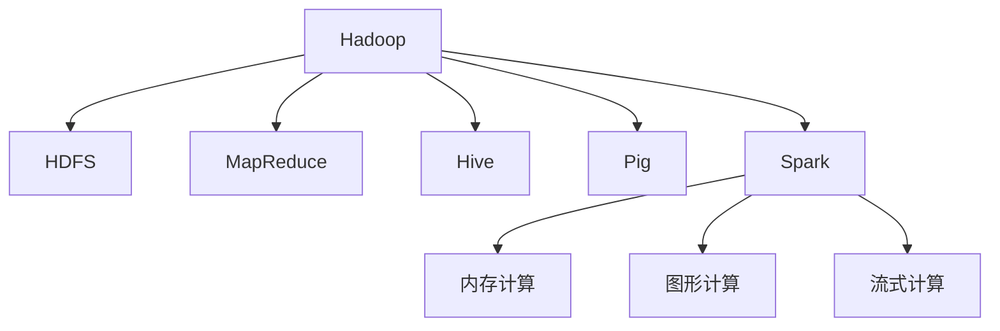

                 

# 大数据处理框架：Hadoop和Spark的应用

> 关键词：大数据, Hadoop, Spark, 分布式处理, 数据仓库, 机器学习

## 1. 背景介绍

### 1.1 问题由来
在大数据时代，数据量呈指数级增长，传统的集中式数据处理方式已难以应对。企业需要一套高效、可靠、可扩展的大数据处理框架，以便快速分析海量数据，提取有价值的信息。在这方面，Hadoop和Spark成为了两个广受欢迎的框架，它们各具特色，互为补充，共同构成了现代大数据生态的核心。

### 1.2 问题核心关键点
Hadoop和Spark是当今大数据处理的主流框架。它们通过分布式计算和存储技术，打破了传统数据处理的时间和空间限制，大大提升了数据处理的速度和效率。本文将详细介绍Hadoop和Spark的核心概念、原理和应用实践，并对比它们在性能、功能和适用场景上的差异。

## 2. 核心概念与联系

### 2.1 核心概念概述

为更好地理解Hadoop和Spark的原理和应用，本节将介绍几个关键概念：

- Hadoop：由Apache基金会开发的开源分布式计算框架，主要用于处理海量数据，具有高可靠性和高扩展性。Hadoop包括HDFS（分布式文件系统）和MapReduce（分布式计算模型）两部分。
- Spark：由Apache基金会开发的快速、通用、可扩展的分布式计算引擎，支持内存计算和图形计算，适用于实时数据处理和大数据机器学习任务。
- Hive：基于Hadoop的数据仓库工具，提供SQL查询接口，将数据湖中的海量数据转化为易用的数据仓库。
- Pig：基于Hadoop的脚本语言，提供数据流操作，支持ETL（抽取、转换、加载）过程。
- Storm：实时数据处理框架，支持流式计算，适用于需要低延迟数据处理的应用场景。

这些核心概念之间的逻辑关系可以通过以下Mermaid流程图来展示：



这个流程图展示了大数据处理框架的主要组件及其相互关系：

1. Hadoop提供分布式文件系统和计算模型，是数据处理的基础。
2. Spark建立在Hadoop之上，提供了更高效、灵活的计算引擎。
3. Hive和Pig是基于Hadoop的数据处理工具，提供了更高的抽象层次。
4. Storm专门用于实时数据处理，适用于需要低延迟的应用场景。
5. Spark还支持内存计算和图形计算，扩展了数据处理的功能和性能。

## 3. 核心算法原理 & 具体操作步骤
### 3.1 算法原理概述

Hadoop和Spark的核心算法原理都是基于分布式计算的思想，即将大数据任务拆分成多个子任务，分别在不同的计算节点上并行处理，最后将所有结果汇总。通过这种方式，Hadoop和Spark能够高效地处理海量数据。

Hadoop的MapReduce模型由两个阶段组成：Map阶段和Reduce阶段。在Map阶段，数据被分片并分配到不同的计算节点上，每个节点对数据进行局部处理，生成中间结果。在Reduce阶段，中间结果被合并并汇总，生成最终结果。

Spark则引入了弹性分布式数据集（RDD）的概念，RDD是一个只读的、可并行操作的集合，支持多种数据源和操作。Spark的核心计算引擎包括Spark Core（基于MapReduce）、Spark SQL（基于SQL查询）、Spark Streaming（基于流式处理）和Spark MLlib（基于机器学习的库）。Spark通过内存计算和优化算法，在处理速度和灵活性上超越了传统的MapReduce模型。

### 3.2 算法步骤详解

以下是Hadoop和Spark的详细操作步骤：

**Hadoop操作流程：**

1. **数据准备**：将数据存储在HDFS分布式文件系统中。

2. **任务拆分**：使用MapReduce模型将任务拆分为多个Map和Reduce任务。

3. **任务分配**：将Map任务分配给不同的计算节点并行执行。

4. **中间结果合并**：将Map任务的输出合并，生成中间结果。

5. **最终结果计算**：将中间结果传递给Reduce任务进行计算，生成最终结果。

6. **结果输出**：将最终结果输出到HDFS或其他存储系统中。

**Spark操作流程：**

1. **数据准备**：将数据存储在Hadoop分布式文件系统（HDFS）或本地文件系统中。

2. **RDD创建**：使用Spark Core创建RDD，表示数据集。

3. **数据转换**：使用转换操作（如map、filter、groupBy）对RDD进行操作，生成新的RDD。

4. **数据动作**：使用操作（如collect、save）将RDD转换成具体的数据形式，完成计算。

5. **交互式查询**：使用Spark SQL进行交互式查询和数据分析。

6. **流式处理**：使用Spark Streaming进行实时数据处理，支持流式计算。

7. **机器学习**：使用Spark MLlib进行机器学习模型的训练和预测。

### 3.3 算法优缺点

Hadoop和Spark各有优缺点：

**Hadoop的优点：**

- 高可靠性：通过三份数据冗余和故障检测机制，保证了数据的可靠性。
- 高可扩展性：可以动态扩展计算节点和存储节点，适应大规模数据处理。
- 兼容性好：支持多种数据源和处理工具，如Hive、Pig、HBase等。

**Hadoop的缺点：**

- 处理速度慢：由于数据读写频繁，处理速度较慢。
- 延迟高：由于数据的切分和合并，处理延迟较高。

**Spark的优点：**

- 处理速度快：内存计算和优化算法大大提升了数据处理速度。
- 延迟低：支持流式处理，能够实现低延迟数据处理。
- 功能全面：支持多种计算引擎和操作，适用范围广。

**Spark的缺点：**

- 资源需求高：内存计算需要大量内存资源，对硬件要求较高。
- 维护成本高：需要维护集群和计算节点，复杂度较高。

### 3.4 算法应用领域

Hadoop和Spark在多个领域得到了广泛应用，例如：

- 数据仓库：用于构建数据仓库，存储和查询海量数据。
- 流式处理：用于实时数据处理和分析，支持低延迟、高吞吐量的应用。
- 机器学习：用于训练和预测模型，支持大规模机器学习任务。
- 大数据分析：用于分析和挖掘数据，发现潜在规律和价值。
- 图像处理：用于处理和分析大规模图像数据。
- 视频处理：用于处理和分析大规模视频数据。

## 4. 数学模型和公式 & 详细讲解 & 举例说明

### 4.1 数学模型构建

在本节中，我们将使用数学语言对Hadoop和Spark的算法原理进行更加严格的刻画。

**Hadoop的MapReduce模型**：
- 输入：键值对 $(x, y)$，其中 $x$ 为键，$y$ 为值。
- 输出：键值对 $(z, w)$，其中 $z$ 为键，$w$ 为值。
- Map函数：将输入键值对映射为多个键值对。
- Reduce函数：将相同键的输出值进行合并。

**Spark的RDD操作**：
- 输入：RDD $\{(x, y)\}$，其中 $x$ 为键，$y$ 为值。
- 输出：RDD $\{(z, w)\}$，其中 $z$ 为键，$w$ 为值。
- Map函数：将输入RDD中的每个元素映射为新的RDD元素。
- Filter函数：从输入RDD中过滤出满足条件的元素。
- GroupBy函数：根据键对RDD进行分组。
- Join函数：将两个RDD根据键进行连接。

### 4.2 公式推导过程

以下我们以Spark的RDD操作为例，推导RDD的map和reduceByKey操作的数学公式。

**map操作**：
$$
RDD_{\text{map}} = RDD_{\text{map}}\{f(x_i)\}, f: RDD_{\text{map}} \rightarrow RDD_{\text{map}}(x_i)
$$

**reduceByKey操作**：
$$
RDD_{\text{reduceByKey}} = RDD_{\text{reduceByKey}}\{(\text{key}, \text{reduce}(\text{values})), \text{key} \in \text{RDD}_{\text{reduceByKey}}, \text{values} = \text{RDD}_{\text{reduceByKey}}(\text{key})\}
$$

其中 $\text{key}$ 为RDD的键，$\text{values}$ 为RDD的值集合。$\text{reduce}$ 函数用于将相同键的输出值进行合并。

在得到RDD操作的数学公式后，即可带入实际数据集进行计算，完成数据处理。

### 4.3 案例分析与讲解

假设我们有一个包含用户行为数据的大数据集，每个数据记录包含用户ID和行为时间戳。我们可以使用Spark进行如下操作：

1. **用户ID分组**：
   $$
   RDD_{\text{group}} = RDD_{\text{group}}\{(\text{user_id}, \text{time})\}, \text{time} = RDD_{\text{group}}(\text{user_id})
   $$

2. **行为时间戳统计**：
   $$
   RDD_{\text{reduceByKey}} = RDD_{\text{reduceByKey}}\{(\text{user_id}, \text{reduce}(\text{time})), \text{time} = RDD_{\text{reduceByKey}}(\text{user_id})\}
   $$

通过以上操作，我们得到了每个用户的行为时间戳统计结果，可用于用户行为分析、趋势预测等应用场景。

## 5. 项目实践：代码实例和详细解释说明
### 5.1 开发环境搭建

在进行Hadoop和Spark的开发实践前，我们需要准备好开发环境。以下是使用Python进行PySpark开发的环境配置流程：

1. 安装Anaconda：从官网下载并安装Anaconda，用于创建独立的Python环境。

2. 创建并激活虚拟环境：
```bash
conda create -n pyspark-env python=3.8 
conda activate pyspark-env
```

3. 安装PySpark：根据CUDA版本，从官网获取对应的安装命令。例如：
```bash
conda install pyspark -c conda-forge -c pytorch
```

4. 安装相关依赖：
```bash
pip install numpy pandas scikit-learn tqdm jupyter notebook ipython
```

完成上述步骤后，即可在`pyspark-env`环境中开始Spark的开发实践。

### 5.2 源代码详细实现

下面我们以数据仓库构建为例，给出使用PySpark对Hadoop数据进行ETL处理的PySpark代码实现。

首先，定义Hadoop数据源和目标：

```python
from pyspark.sql import SparkSession
from pyspark.sql.functions import col

spark = SparkSession.builder.appName('HadoopDataETL').getOrCreate()

# 定义Hadoop数据源
source_rdd = spark.sparkContext.textFile('hdfs://localhost:9000/user/hadoop_data')

# 定义数据仓库
target_rdd = spark.createDataFrame(source_rdd.map(lambda x: (col(x.split('\t')[0]), col(x.split('\t')[1]))), schema=spark.schema([('user_id', 'string'), ('time', 'string')]))

target_rdd.write.format('parquet').option('path', 'hdfs://localhost:9000/user/data_warehousing').mode('overwrite').save()
```

然后，定义数据处理函数：

```python
def data_processing(df):
    # 数据清洗
    df = df.dropna()
    
    # 用户ID分组和行为时间戳统计
    grouped_df = df.groupby('user_id').agg({'time': 'count'}).toDF('user_id', 'count')
    
    # 数据存储
    grouped_df.write.format('parquet').option('path', 'hdfs://localhost:9000/user/data_processing').mode('overwrite').save()
    
    return grouped_df
```

最后，启动数据处理流程：

```python
# 读取Hadoop数据
data = spark.sparkContext.textFile('hdfs://localhost:9000/user/hadoop_data')

# 数据处理
processed_data = data_processing(data)

# 显示处理结果
processed_data.show()
```

以上就是使用PySpark对Hadoop数据进行ETL处理的完整代码实现。可以看到，PySpark提供了丰富、易用的API，大大简化了数据处理流程。

### 5.3 代码解读与分析

让我们再详细解读一下关键代码的实现细节：

**SparkSession**：
- 创建SparkSession，并指定应用名称和SparkContext。

**数据源定义**：
- 使用SparkContext的textFile方法读取Hadoop数据。

**数据处理**：
- 对数据进行清洗，去除NaN值。
- 使用groupBy和agg方法进行分组和聚合计算，统计每个用户的行为时间戳数量。
- 将处理结果转换为DataFrame，并存储到HDFS上。

**数据处理函数**：
- 定义数据处理函数，接受DataFrame作为输入，返回处理后的DataFrame。
- 数据清洗：使用dropna方法去除NaN值。
- 数据处理：使用groupBy和agg方法进行分组和聚合计算，统计每个用户的行为时间戳数量。
- 数据存储：将处理结果存储到HDFS上。

**数据处理流程**：
- 读取Hadoop数据。
- 调用数据处理函数进行数据清洗和处理。
- 显示处理结果。

通过这些代码实现，可以完成Hadoop数据的ETL处理，生成可用的数据仓库。

## 6. 实际应用场景
### 6.1 智慧城市

基于Hadoop和Spark的大数据处理框架，智慧城市可以实现实时数据分析、智能决策和精准治理。通过集成各种传感器、摄像头等数据源，智慧城市能够实时监测交通流量、空气质量、人流分布等城市运行数据，提供科学的决策支持。

例如，通过实时处理交通流量数据，智慧城市可以优化交通信号灯控制，减少拥堵；通过分析空气质量数据，可以预警重污染天气，优化城市能源管理。这些基于大数据的应用，大大提升了城市管理的智能化和效率。

### 6.2 零售业

在零售业中，Hadoop和Spark可以用于客户行为分析、库存管理、供应链优化等应用场景。通过分析客户交易数据、浏览记录等行为数据，零售商可以精准推荐商品，优化促销策略，提升客户满意度。通过实时处理库存数据，零售商可以优化库存管理，减少浪费，降低成本。通过分析供应链数据，零售商可以优化物流和配送，提高配送效率。

### 6.3 金融业

在金融业中，Hadoop和Spark可以用于欺诈检测、风险控制、客户分析等应用场景。通过分析交易数据、客户行为数据等，金融机构可以实时检测异常交易，及时预警风险。通过分析客户数据，金融机构可以挖掘客户需求，提升客户服务质量。通过实时处理金融市场数据，金融机构可以预测市场趋势，优化投资策略。

## 7. 工具和资源推荐
### 7.1 学习资源推荐

为了帮助开发者系统掌握Hadoop和Spark的理论基础和实践技巧，这里推荐一些优质的学习资源：

1. 《大数据技术与应用》系列博文：由Hadoop和Spark技术专家撰写，深入浅出地介绍了大数据处理框架的基础原理和应用场景。

2. Hadoop和Spark官方文档：详细介绍了Hadoop和Spark的架构、组件和使用方法，是开发实践的必备资料。

3. 《Spark with Python》书籍：详细介绍了PySpark的使用方法和实例，帮助开发者快速上手Spark的开发。

4. Kaggle数据科学竞赛：提供了大量大数据处理和分析的竞赛数据和代码，是实践Hadoop和Spark的好平台。

5. Coursera《Hadoop和Spark》课程：由知名大学教授讲授，系统讲解了Hadoop和Spark的核心概念和应用实践。

通过对这些资源的学习实践，相信你一定能够快速掌握Hadoop和Spark的精髓，并用于解决实际的NLP问题。

### 7.2 开发工具推荐

高效的开发离不开优秀的工具支持。以下是几款用于Hadoop和Spark开发的常用工具：

1. PySpark：基于Python的Spark开发框架，提供了丰富、易用的API，适合快速迭代研究。

2. Hadoop：由Apache基金会开发的分布式计算框架，具有高可靠性和高扩展性。

3. Spark SQL：基于SQL查询的Spark引擎，支持交互式数据处理和分析。

4. Spark Streaming：基于流式处理的Spark引擎，适用于实时数据处理和分析。

5. Spark MLlib：基于机器学习的Spark库，支持大规模机器学习任务的训练和预测。

6. Hive：基于Hadoop的数据仓库工具，提供SQL查询接口，将数据湖中的海量数据转化为易用的数据仓库。

合理利用这些工具，可以显著提升Hadoop和Spark的开发效率，加快创新迭代的步伐。

### 7.3 相关论文推荐

Hadoop和Spark的发展源于学界的持续研究。以下是几篇奠基性的相关论文，推荐阅读：

1. MapReduce: Simplified Data Processing on Large Clusters（MapReduce论文）：提出MapReduce模型，奠定了分布式计算的基础。

2. Spark: Cluster Computing with Fault Tolerance（Spark论文）：提出Spark框架，引入了弹性分布式数据集（RDD）和内存计算等新概念。

3. Pregel: A Commodity-Parallel Graph-Processing System（Pregel论文）：提出Pregel算法，支持大规模图计算。

4. Storm: Fault Tolerant Real-time Computations（Storm论文）：提出Storm框架，支持实时数据处理和流式计算。

5. YARN: Yet Another Resource Negotiator（YARN论文）：提出YARN调度器，支持Hadoop的资源管理和调度。

这些论文代表了大数据处理框架的发展脉络。通过学习这些前沿成果，可以帮助研究者把握学科前进方向，激发更多的创新灵感。

## 8. 总结：未来发展趋势与挑战

### 8.1 总结

本文对Hadoop和Spark的核心概念、原理和应用实践进行了全面系统的介绍。首先阐述了Hadoop和Spark的研究背景和意义，明确了它们在处理大规模数据、提升计算效率方面的独特价值。其次，从原理到实践，详细讲解了Hadoop和Spark的数学模型和操作步骤，给出了大数据处理的完整代码实现。同时，本文还广泛探讨了Hadoop和Spark在智慧城市、零售业、金融业等诸多领域的应用前景，展示了大数据处理框架的广阔前景。

通过本文的系统梳理，可以看到，Hadoop和Spark作为大数据处理的核心框架，已经在各个领域得到了广泛的应用，推动了数据的深度挖掘和分析。未来，伴随技术的不断演进和优化，Hadoop和Spark必将在大数据生态中扮演越来越重要的角色。

### 8.2 未来发展趋势

展望未来，Hadoop和Spark的发展趋势如下：

1. 分布式计算技术不断成熟。随着硬件的不断发展，分布式计算的效率和可靠性将进一步提升，支持更大规模的数据处理。

2. 内存计算和混合存储技术进步。内存计算和混合存储技术的发展，将使数据处理速度更快，延迟更低，支持更灵活的数据处理场景。

3. 实时流式处理能力增强。Spark Streaming和Flink等流式处理框架的不断进步，将支持更高速、更稳定的实时数据处理。

4. 机器学习和人工智能的深度融合。Hadoop和Spark将与机器学习、人工智能技术深度融合，支持更复杂的数据分析和挖掘。

5. 云化和大规模分布式化。Hadoop和Spark将更多地向云化和大规模分布式化方向发展，支持更广泛的行业应用。

6. 安全性、隐私性和合规性加强。大数据处理框架将加强对数据隐私和安全性的保护，满足不同行业的合规要求。

以上趋势凸显了Hadoop和Spark的广阔前景。这些方向的探索发展，将进一步提升大数据处理框架的性能和应用范围，为各行业带来深远影响。

### 8.3 面临的挑战

尽管Hadoop和Spark已经取得了显著成就，但在迈向更加智能化、普适化应用的过程中，它们仍面临诸多挑战：

1. 数据量爆炸。随着数据量的不断增长，大数据处理框架的存储和计算能力需要不断提升，以满足海量数据的需求。

2. 资源消耗高。大数据处理框架的资源消耗较高，需要合理调度和管理资源，以避免资源浪费。

3. 应用复杂度增加。随着大数据处理框架功能的不断扩展，应用复杂度也在增加，需要开发者具备较高的技术水平。

4. 安全性问题突出。大数据处理框架需要保护数据的隐私和安全，避免数据泄露和滥用。

5. 技术迭代速度快。大数据处理框架需要不断更新迭代，保持技术领先。

6. 维护成本高。大数据处理框架的维护成本较高，需要持续投入资源进行维护和优化。

正视Hadoop和Spark面临的这些挑战，积极应对并寻求突破，将是大数据处理框架走向成熟的必由之路。相信随着学界和产业界的共同努力，这些挑战终将一一被克服，大数据处理框架必将在构建人机协同的智能时代中扮演越来越重要的角色。

### 8.4 未来突破

面对Hadoop和Spark所面临的种种挑战，未来的研究需要在以下几个方面寻求新的突破：

1. 分布式计算的优化。优化分布式计算算法和数据传输机制，提高计算效率和网络带宽利用率。

2. 内存计算的扩展。研究和应用更多内存计算技术，支持更大规模的数据处理。

3. 流式处理的优化。优化流式处理框架，支持更高速、更稳定的实时数据处理。

4. 机器学习和大数据的融合。结合机器学习和深度学习技术，提升大数据处理框架的数据分析和挖掘能力。

5. 安全性保障的加强。加强数据隐私和安全保护，构建可信的大数据处理框架。

6. 云化和大规模分布式化的改进。优化云化和大规模分布式化技术，支持更广泛的行业应用。

这些研究方向的探索，必将引领Hadoop和Spark迈向更高的台阶，为大数据处理框架的发展注入新的动力。相信随着技术的不断进步和创新，Hadoop和Spark必将在大数据生态中发挥更大的作用，推动数据的深度挖掘和分析。

## 9. 附录：常见问题与解答

**Q1：Hadoop和Spark的区别是什么？**

A: Hadoop和Spark的主要区别在于计算模型和数据处理方式：

- Hadoop采用MapReduce模型，适合处理大规模批处理任务。
- Spark采用RDD（弹性分布式数据集）和多种计算引擎，支持分布式内存计算、流式处理和机器学习任务。

**Q2：如何选择合适的Hadoop和Spark版本？**

A: 选择合适的Hadoop和Spark版本需要考虑以下几个因素：

- 数据量：大数据处理框架适用于海量数据处理，Hadoop和Spark都支持大规模数据处理。
- 计算需求：Hadoop适合处理批处理任务，Spark支持内存计算和流式处理，适用于实时数据处理和大数据机器学习任务。
- 技术栈：Hadoop和Spark都有丰富的API和工具支持，可以根据自身技术栈选择适合的框架。

**Q3：如何进行Hadoop和Spark的性能优化？**

A: 进行Hadoop和Spark的性能优化可以从以下几个方面入手：

- 数据分区：合理分区可以避免数据倾斜，提升数据处理效率。
- 内存管理：优化内存使用，减少内存溢出和资源浪费。
- 任务调度：合理调度任务，避免任务瓶颈和资源竞争。
- 数据压缩：压缩数据可以减少存储和传输成本，提升数据处理速度。

通过这些优化措施，可以显著提升Hadoop和Spark的性能，确保数据处理的高效和可靠。

**Q4：Hadoop和Spark在数据处理中的适用场景是什么？**

A: Hadoop和Spark在数据处理中各有适用场景：

- Hadoop适用于大规模批处理任务，如数据仓库构建、日志分析等。
- Spark适用于实时数据处理和大数据机器学习任务，如实时分析、流式计算、推荐系统等。

**Q5：如何应对大数据处理中的数据倾斜问题？**

A: 数据倾斜是大数据处理中的常见问题，可以通过以下措施进行优化：

- 数据预处理：对数据进行预处理，减少数据的分布不均。
- 数据分区：合理分区，确保数据分布均衡。
- 数据重采样：对数据进行重采样，平衡数据分布。
- 任务重调度：对任务进行重调度，避免任务瓶颈。

通过这些措施，可以避免数据倾斜问题，提升大数据处理框架的性能和可靠性。

---

作者：禅与计算机程序设计艺术 / Zen and the Art of Computer Programming

