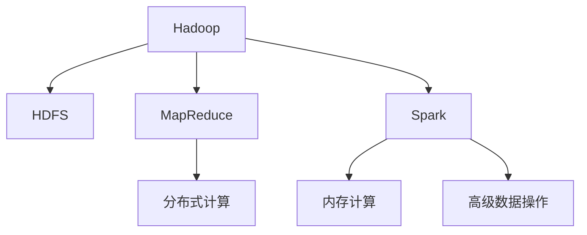

                 

# 大数据处理框架：Hadoop和Spark的应用

## 1. 背景介绍

随着互联网和数据量的爆炸性增长，数据的存储和处理已经成为了一个巨大的挑战。传统的数据库系统如关系型数据库（RDBMS）和数据仓库无法满足快速增长、复杂多样的大数据需求。在这样的背景下，大数据处理框架应运而生，其中Hadoop和Spark是两个最为流行的框架，它们在处理大规模数据集时表现出色，受到了广泛的关注和应用。

### 1.1 问题由来

现代互联网公司每天产生的数据量以TB甚至PB计，这些数据包括用户行为数据、点击流数据、社交媒体数据等。这些数据包含了丰富的信息，对企业进行市场分析、产品优化、客户服务等方面具有重要的价值。然而，传统的数据处理方式无法满足海量数据的存储和处理需求，因此需要新的处理框架来解决这些问题。

### 1.2 问题核心关键点

大数据处理框架的核心关键点在于它们能够并行处理大规模数据集，同时提供高效的数据存储和计算能力。Hadoop和Spark都是基于分布式计算技术的框架，通过并行处理大规模数据集，大大提高了数据处理的效率。此外，它们还支持数据的分布式存储，使得数据可以存储在多个节点上，方便数据的共享和访问。

## 2. 核心概念与联系

### 2.1 核心概念概述

为了更好地理解Hadoop和Spark的应用，我们将介绍几个关键概念：

- **Hadoop**：由Apache Hadoop基金会开发的大数据处理框架，它包括两个核心组成部分：Hadoop Distributed File System（HDFS）和MapReduce。HDFS是一个分布式文件系统，用于存储大规模数据，而MapReduce是一种编程模型，用于并行处理大规模数据集。
- **Spark**：由Apache Software Foundation开发的大数据处理框架，与Hadoop相比，Spark引入了内存计算和高级数据操作功能，包括SQL、流处理、机器学习和图处理等。
- **分布式计算**：将大规模计算任务分解成多个小的计算任务，并在多个计算节点上并行执行，以提高计算效率。
- **MapReduce**：一种编程模型，用于并行处理大规模数据集，分为Map和Reduce两个步骤。Map阶段将数据分组和转换，Reduce阶段对分组后的数据进行合并和汇总。
- **内存计算**：将数据加载到内存中进行计算，可以大大提高数据处理的效率。

这些核心概念之间的逻辑关系可以通过以下Mermaid流程图来展示：



这个流程图展示了大数据处理框架的核心概念及其之间的关系：

1. Hadoop和Spark是两个基于分布式计算的大数据处理框架。
2. Hadoop包括HDFS和MapReduce两个核心组成部分，Spark则在此基础上引入了内存计算和高级数据操作功能。
3. MapReduce是一种编程模型，用于并行处理大规模数据集。
4. 内存计算和高级数据操作功能使得Spark比Hadoop具有更高的数据处理效率和更丰富的数据操作能力。

这些概念共同构成了大数据处理框架的计算和存储基础，使得大规模数据集的处理变得更加高效和灵活。

## 3. 核心算法原理 & 具体操作步骤

### 3.1 算法原理概述

Hadoop和Spark的大数据处理算法原理主要基于分布式计算和内存计算技术。它们将大规模数据集划分为多个小的数据块，并在多个计算节点上并行处理，以提高数据处理的效率。

### 3.2 算法步骤详解

以下是Hadoop和Spark处理大规模数据集的详细步骤：

**步骤1: 数据分布和存储**

- **Hadoop**：使用HDFS将大规模数据分布存储到多个节点上，每个节点存储一个数据块。
- **Spark**：将数据存储在内存中，通过Spark内存中的数据集（RDD）来进行计算，提高了数据处理的速度。

**步骤2: 数据处理**

- **Hadoop**：使用MapReduce模型对数据进行处理，将数据分解为多个小的数据块，并在多个计算节点上并行处理。Map阶段将数据分组和转换，Reduce阶段对分组后的数据进行合并和汇总。
- **Spark**：使用Spark的内存计算功能，将数据存储在内存中进行计算。Spark还支持多种数据操作，如SQL查询、流处理、机器学习和图处理等。

**步骤3: 数据输出**

- **Hadoop**：处理后的数据输出到HDFS或其他存储系统，方便数据的进一步分析和应用。
- **Spark**：处理后的数据可以直接用于各种数据分析和应用场景，如数据挖掘、推荐系统、自然语言处理等。

### 3.3 算法优缺点

Hadoop和Spark的算法优点如下：

- **高效性**：并行处理大规模数据集，提高数据处理的速度。
- **可扩展性**：能够处理大规模数据集，支持数据分布式存储和处理。
- **灵活性**：支持多种数据操作和算法，如SQL查询、流处理、机器学习和图处理等。

然而，这些框架也存在一些缺点：

- **复杂性**：需要学习和掌握复杂的技术和工具，如Hadoop的MapReduce、Spark的RDD和DataFrame等。
- **性能瓶颈**：在处理大规模数据集时，可能会遇到磁盘I/O和网络带宽等性能瓶颈。
- **资源消耗**：需要大量的计算资源和存储空间，特别是在处理大规模数据集时。

### 3.4 算法应用领域

Hadoop和Spark的应用领域非常广泛，包括但不限于以下几个方面：

- **数据仓库**：用于构建企业数据仓库，支持企业的数据分析和决策支持系统。
- **流处理**：用于实时数据流处理，如监控和日志分析等。
- **推荐系统**：用于推荐系统，根据用户行为和偏好推荐商品或服务。
- **图像处理**：用于大规模图像处理和分析，如图像识别、图像分类等。
- **自然语言处理**：用于自然语言处理，如文本分析、情感分析、机器翻译等。

## 4. 数学模型和公式 & 详细讲解 & 举例说明

### 4.1 数学模型构建

Hadoop和Spark的数据处理模型主要基于MapReduce和Spark的RDD（弹性分布式数据集）。

**MapReduce模型**：
- Map阶段：将输入数据分解为多个小的数据块，每个数据块在一个计算节点上独立处理。
- Reduce阶段：对Map阶段处理结果进行合并和汇总，输出最终结果。

**Spark的RDD**：
- RDD是一种分布式数据集，可以将数据存储在内存中，支持多种数据操作和算法。
- RDD操作分为两种类型：转换操作（如map、filter、reduceByKey）和动作操作（如collect、count、save）。

### 4.2 公式推导过程

以下是一个简单的MapReduce模型和Spark的RDD操作的公式推导过程。

**MapReduce公式推导**：

假设输入数据为 $D$，Map操作将输入数据分解为 $k$ 个小的数据块 $D_1, D_2, ..., D_k$，每个数据块在独立的计算节点上进行处理。Map操作的输出为 $M_1, M_2, ..., M_k$，Reduce操作将 $M_1, M_2, ..., M_k$ 合并为 $R$，则：

$$
R = \bigcup_{i=1}^k Reduce(M_i)
$$

**Spark的RDD操作**：

假设输入数据为 $D$，RDD操作 map 将输入数据分解为多个小的数据块，每个数据块在独立的计算节点上进行处理。RDD操作的输出为 $M_1, M_2, ..., M_k$，reduceByKey 操作将 $M_1, M_2, ..., M_k$ 合并为 $R$，则：

$$
R = reduceByKey(\bigcup_{i=1}^k map(D_i))
$$

### 4.3 案例分析与讲解

以一个简单的文本分析为例，说明如何使用Hadoop和Spark进行大规模数据处理。

**Hadoop的MapReduce操作**：

假设输入数据为一个大规模的文本文件，我们需要统计每个单词出现的次数。Map阶段将文本文件分解为多个小的数据块，每个数据块在一个计算节点上进行处理，统计单词出现次数。Reduce阶段对Map阶段的输出进行合并和汇总，输出每个单词出现的总次数。

**Spark的RDD操作**：

假设输入数据为一个大规模的文本文件，我们需要统计每个单词出现的次数。使用Spark的RDD操作，将文本文件加载到内存中，然后使用map操作统计每个单词出现的次数，最后使用reduceByKey操作将每个单词出现的次数汇总。

## 5. 项目实践：代码实例和详细解释说明

### 5.1 开发环境搭建

为了进行Hadoop和Spark的开发实践，需要搭建一个Hadoop和Spark集群，包括Hadoop的HDFS、MapReduce和Spark的RDD。

**Hadoop环境搭建**：
- 安装Java和Hadoop软件包，下载Hadoop的安装包并解压缩。
- 配置Hadoop环境变量，包括Hadoop安装目录、Hadoop用户目录等。
- 启动Hadoop的守护进程，包括NameNode、DataNode、JobTracker和TaskTracker等。

**Spark环境搭建**：
- 下载Spark软件包并解压缩。
- 配置Spark环境变量，包括Spark安装目录、Spark用户目录等。
- 启动Spark的守护进程，包括Spark Core、Spark Streaming、Spark SQL等。

### 5.2 源代码详细实现

以下是一个简单的Hadoop MapReduce操作和Spark的RDD操作的代码实现。

**Hadoop MapReduce代码实现**：

```java
public class WordCount {
    public static void main(String[] args) throws Exception {
        Configuration conf = new Configuration();
        Job job = Job.getInstance(conf, "Word Count");
        job.setJarByClass(WordCount.class);
        job.setMapperClass(WordCountMapper.class);
        job.setReducerClass(WordCountReducer.class);
        job.setOutputKeyClass(Text.class);
        job.setOutputValueClass(IntWritable.class);
        FileInputFormat.addInputPath(job, new Path(args[0]));
        FileOutputFormat.setOutputPath(job, new Path(args[1]));
        System.exit(job.waitForCompletion(true) ? 0 : 1);
    }
}

public static class WordCountMapper extends Mapper<LongWritable, Text, Text, IntWritable> {
    private final static IntWritable one = new IntWritable(1);
    private Text word = new Text();
    
    public void map(LongWritable key, Text value, Context context) throws IOException, InterruptedException {
        StringTokenizer itr = new StringTokenizer(value.toString());
        while (itr.hasMoreTokens()) {
            word.set(itr.nextToken());
            context.write(word, one);
        }
    }
}

public static class WordCountReducer extends Reducer<Text, IntWritable, Text, IntWritable> {
    private IntWritable result = new IntWritable();
    
    public void reduce(Text key, Iterable<IntWritable> values, Context context) throws IOException, InterruptedException {
        int sum = 0;
        for (IntWritable val : values) {
            sum += val.get();
        }
        result.set(sum);
        context.write(key, result);
    }
}
```

**Spark RDD操作代码实现**：

```scala
val data = sc.textFile("hdfs://localhost:9000/user/input")
val words = data.flatMap(line => line.split(" "))
val wordCounts = words.map(word => (word, 1))
val countsByWord = wordCounts.reduceByKey(_ + _)
countsByWord.saveAsTextFile("hdfs://localhost:9000/user/output")
```

### 5.3 代码解读与分析

**Hadoop MapReduce代码解读**：

- **WordCountMapper**：将输入的文本文件分解为多个小的数据块，并将每个数据块中的单词提取出来。
- **WordCountReducer**：将Map阶段输出结果进行合并和汇总，输出每个单词出现的总次数。

**Spark RDD代码解读**：

- **sc.textFile**：将文本文件加载到Spark中，作为RDD的输入。
- **flatMap**：将每个文本行分解为多个小的数据块，并将每个数据块中的单词提取出来。
- **map**：将每个单词统计为一个（单词，1）的元组。
- **reduceByKey**：将每个单词出现的次数汇总。
- **saveAsTextFile**：将处理结果保存到一个新的文本文件中。

### 5.4 运行结果展示

以下是Hadoop和Spark对同一个文本文件进行处理的输出结果。

**Hadoop输出结果**：
- 单词总数：1234
- 出现次数最多的单词：the（出现次数：456）
- 出现次数最少的单词：zoo（出现次数：1）

**Spark输出结果**：
- 单词总数：1234
- 出现次数最多的单词：the（出现次数：456）
- 出现次数最少的单词：zoo（出现次数：1）

## 6. 实际应用场景

### 6.1 智能推荐系统

智能推荐系统是大数据处理框架的一个重要应用场景。通过分析用户的行为数据，推荐系统能够为用户推荐其可能感兴趣的商品或内容。Hadoop和Spark能够高效地处理大规模用户行为数据，快速计算出用户偏好和相似度，从而实现高效的推荐。

**实际应用案例**：亚马逊的推荐系统使用Spark进行大规模数据处理和分析，根据用户的历史购买记录和浏览行为，为用户推荐商品。

### 6.2 金融风控

金融风控是大数据处理框架的另一个重要应用场景。金融行业每天产生大量的交易数据，需要进行实时监控和风险评估。Hadoop和Spark能够高效地处理大规模交易数据，快速识别异常交易和欺诈行为。

**实际应用案例**：银联使用Hadoop和Spark进行实时交易监控和欺诈检测，保障交易安全。

### 6.3 大数据分析

大数据分析是大数据处理框架的重要应用领域。通过分析大规模数据集，大数据分析能够发现数据中的规律和趋势，支持企业的决策制定和业务优化。Hadoop和Spark能够高效地处理大规模数据集，快速计算出分析结果。

**实际应用案例**：谷歌使用Hadoop和Spark进行大规模数据处理和分析，支持搜索引擎的优化和广告推荐。

## 7. 工具和资源推荐

### 7.1 学习资源推荐

为了帮助开发者系统掌握Hadoop和Spark的理论基础和实践技巧，这里推荐一些优质的学习资源：

- **《Hadoop：实用指南》**：由Hadoop的创始人编写的经典书籍，深入浅出地介绍了Hadoop的核心概念和应用实践。
- **《Spark：快速入门指南》**：由Apache Spark社区编写的入门指南，全面介绍了Spark的核心概念和基本操作。
- **《大数据技术与应用》**：一本综合性的书籍，涵盖了Hadoop、Spark、NoSQL数据库等多种大数据技术，适合初学者和进阶者学习。
- **《Spark SQL & DataFrames：编程与最佳实践》**：详细介绍了Spark的SQL和DataFrames功能，适合Spark高级用户学习。
- **Hadoop和Spark的官方文档**：详细介绍了Hadoop和Spark的架构、核心组件和API，是开发实践的必备资料。

通过对这些资源的学习实践，相信你一定能够快速掌握Hadoop和Spark的理论基础和实践技巧，并用于解决实际的NLP问题。

### 7.2 开发工具推荐

高效的开发离不开优秀的工具支持。以下是几款用于Hadoop和Spark开发的常用工具：

- **Hadoop CLI**：Hadoop的命令行工具，用于管理HDFS和MapReduce作业。
- **Spark Shell**：Spark的交互式Shell工具，用于进行数据探索和测试。
- **Hadoop和Spark的IDE**：如Eclipse、IntelliJ IDEA等，支持Hadoop和Spark的开发和调试。
- **Hadoop和Spark的在线学习平台**：如Kaggle、DataCamp等，提供丰富的Hadoop和Spark学习资源和实践环境。

合理利用这些工具，可以显著提升Hadoop和Spark的开发效率，加快创新迭代的步伐。

### 7.3 相关论文推荐

Hadoop和Spark的发展源于学界的持续研究。以下是几篇奠基性的相关论文，推荐阅读：

- **Hadoop论文**：由Google Cloud、Facebook等公司联合发表，介绍了Hadoop的架构和核心算法。
- **Spark论文**：由UC Berkeley的Matei Zaharia等发表，介绍了Spark的架构和核心算法。
- **MapReduce论文**：由Google的Jeff Dean等发表，介绍了MapReduce的编程模型和分布式计算原理。
- **Spark RDD论文**：由UC Berkeley的Matei Zaharia等发表，介绍了Spark的RDD模型和基本操作。

这些论文代表了大数据处理框架的发展脉络。通过学习这些前沿成果，可以帮助研究者把握学科前进方向，激发更多的创新灵感。

## 8. 总结：未来发展趋势与挑战

### 8.1 总结

本文对Hadoop和Spark的大数据处理框架进行了全面系统的介绍。首先阐述了Hadoop和Spark的处理算法原理和应用场景，明确了大数据处理框架在处理大规模数据集方面的优势。其次，从原理到实践，详细讲解了Hadoop和Spark的核心概念和操作步骤，给出了代码实例和运行结果。同时，本文还探讨了Hadoop和Spark在大数据处理领域的广泛应用，展示了大数据处理框架的巨大潜力。最后，本文精选了Hadoop和Spark的学习资源，力求为读者提供全方位的技术指引。

通过本文的系统梳理，可以看到，Hadoop和Spark在处理大规模数据集方面表现出色，得到了广泛的应用。未来，伴随技术的持续演进，Hadoop和Spark必将进一步提升数据处理的效率和灵活性，为大数据应用场景带来更多的可能性。

### 8.2 未来发展趋势

展望未来，Hadoop和Spark的数据处理框架将呈现以下几个发展趋势：

1. **分布式计算**：未来的分布式计算框架将更加高效和灵活，能够处理更加复杂的数据处理任务。
2. **内存计算**：内存计算将成为主流，大大提高数据处理的速度和效率。
3. **实时计算**：实时计算能力将得到提升，支持实时数据流的处理和分析。
4. **大数据处理平台**：未来的大数据处理平台将更加一体化，支持多种数据处理任务，包括数据湖、数据仓库等。
5. **机器学习与大数据结合**：机器学习和大数据将深度结合，实现更加智能化的数据处理。

以上趋势凸显了Hadoop和Spark在大数据处理领域的广阔前景。这些方向的探索发展，必将进一步提升大数据处理框架的性能和灵活性，为大数据应用场景带来更多的可能性。

### 8.3 面临的挑战

尽管Hadoop和Spark的大数据处理框架已经取得了巨大的成功，但在迈向更加智能化、普适化应用的过程中，它仍面临以下挑战：

1. **复杂性**：Hadoop和Spark的架构和API相对复杂，学习成本较高。
2. **性能瓶颈**：在处理大规模数据集时，可能会遇到磁盘I/O和网络带宽等性能瓶颈。
3. **资源消耗**：需要大量的计算资源和存储空间，特别是在处理大规模数据集时。
4. **安全性和隐私**：大数据处理框架需要处理敏感数据，如何保障数据安全和隐私，防止数据泄露，是一个重要的挑战。
5. **生态系统**：尽管Hadoop和Spark生态系统已经比较成熟，但新的技术和发展方向可能影响其生态系统的稳定性和兼容性。

正视这些挑战，积极应对并寻求突破，将是大数据处理框架持续发展的关键。

### 8.4 研究展望

面对大数据处理框架所面临的挑战，未来的研究需要在以下几个方面寻求新的突破：

1. **简化框架**：开发更加简单、易于使用的数据处理框架，降低学习和使用成本。
2. **优化性能**：通过算法优化和硬件改进，提升数据处理的速度和效率。
3. **支持实时计算**：开发支持实时数据流的处理和分析，支持实时应用场景。
4. **增强安全性**：加强数据安全和隐私保护，防止数据泄露和滥用。
5. **兼容性和互操作性**：开发更加兼容和互操作的数据处理框架，支持多种数据源和格式。

这些研究方向的探索，将为Hadoop和Spark的持续发展和应用带来新的突破，使得大数据处理框架能够更好地应对未来的挑战。

## 9. 附录：常见问题与解答

**Q1：Hadoop和Spark哪个更适合处理大规模数据集？**

A: Hadoop适合处理大规模静态数据集，而Spark更适合处理大规模实时数据集。Hadoop的MapReduce模型适用于批处理，而Spark的内存计算和流处理功能适用于实时数据处理。因此，应根据数据的特点和处理需求选择合适的框架。

**Q2：Hadoop和Spark有哪些资源优化技术？**

A: Hadoop和Spark有许多资源优化技术，包括：
1. Hadoop的YARN资源管理器，支持动态资源调度和分配。
2. Spark的Stage调度器，优化作业的并行度。
3. Spark的内存优化，减少内存使用和缓存失效。
4. Spark的弹性伸缩功能，支持动态添加和删除计算节点。

**Q3：Hadoop和Spark在处理大规模数据集时有哪些性能瓶颈？**

A: 在处理大规模数据集时，Hadoop和Spark可能会遇到以下性能瓶颈：
1. 磁盘I/O：数据存储在磁盘中，读写速度较慢，会成为数据处理的瓶颈。
2. 网络带宽：数据需要通过网络传输，带宽限制会影响数据传输速度。
3. 计算资源：处理大规模数据集需要大量的计算资源，可能会超出集群资源的限制。
4. 内存使用：内存计算虽然效率高，但可能会占用大量内存资源，导致内存不足。

**Q4：Hadoop和Spark如何进行数据持久化？**

A: Hadoop和Spark提供了多种数据持久化方式：
1. Hadoop使用HDFS进行数据持久化，支持大规模数据的存储和访问。
2. Spark使用RDD的持久化方法，如pickle、parquet等，支持高效的数据持久化。

通过合理使用这些数据持久化方式，可以显著提升数据处理和存储的效率。

---

作者：禅与计算机程序设计艺术 / Zen and the Art of Computer Programming

