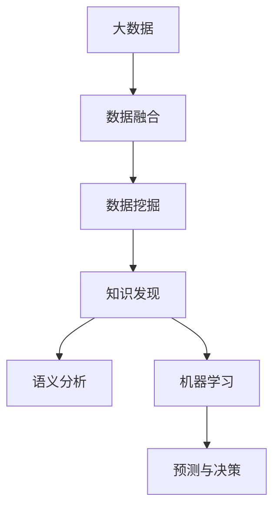

                 

## 1. 背景介绍

### 1.1 问题由来
随着数字化时代的到来，全球每天产生的数据量以指数级增长。这些数据以文本、音频、视频、图片等形式存在，蕴含了海量的知识和信息。然而，数据只是冰山一角，真正的宝藏在于挖掘其中的知识。在大数据时代，如何高效、智能地从数据中发现知识，成为各行各业关注的焦点。

### 1.2 问题核心关键点
在大数据背景下，知识发现(也称为知识挖掘)指的是从数据中自动发现、抽取和总结有用信息的过程。核心关键点在于：

- **数据源的多样性**：数据来自各行各业，具有复杂的来源、格式和结构，如何整合这些数据是首要挑战。
- **数据量的庞大**：海量数据不仅难以存储和传输，也给计算和分析带来了巨大压力。
- **知识表示的复杂性**：知识可以有多种表示方式，如文本、图像、声音等，如何将这些知识表示统一映射到计算机可处理的模型是难题。
- **知识价值的密度低**：海量的数据中蕴含的知识密度相对较低，如何高效挖掘有用的信息是另一大挑战。

### 1.3 问题研究意义
通过对大数据中的知识进行高效、准确地发现和抽取，可以为决策支持、商业智能、精准医疗、智能制造等领域提供重要参考。具体意义包括：

- **降低信息获取成本**：自动化知识发现大大降低了人工数据分析的工作量，提高了效率和准确性。
- **提升决策质量**：通过科学的数据分析，帮助决策者获得更全面、更深入的洞察，提高决策的准确性和时效性。
- **推动技术创新**：知识发现是人工智能、机器学习等领域的重要应用，其研究成果将推动技术的不断进步。
- **促进社会治理**：在公共安全、环境保护、城市管理等领域，知识发现有助于优化资源配置，提升社会治理水平。

## 2. 核心概念与联系

### 2.1 核心概念概述
1. **大数据**：指数据量巨大、数据类型多样、数据速度实时的一种数据集合。
2. **知识发现(Knowledge Discovery, KDD)**：通过数据分析技术，从大量数据中发现和抽取有用知识的过程。
3. **数据挖掘(Data Mining)**：从数据中提取有价值信息和模式的技术，是知识发现的重要手段。
4. **数据融合(Data Fusion)**：将来自不同来源和不同格式的数据整合为统一结构，便于进一步分析。
5. **语义分析(Semantic Analysis)**：理解文本含义，进行自然语言处理，识别知识元素。
6. **机器学习(Machine Learning)**：利用算法使计算机通过数据学习知识，预测和决策。

### 2.2 核心概念原理和架构的 Mermaid 流程图



这个流程图展示了大数据时代知识发现的流程和关键技术。大数据首先经过数据融合，进行初步处理和整合；然后通过数据挖掘技术进行数据中的模式和知识抽取；接着通过语义分析对文本数据进行深入理解；最后，结合机器学习进行模型训练和知识预测，最终形成支持决策的洞察。

## 3. 核心算法原理 & 具体操作步骤

### 3.1 算法原理概述

知识发现通常包括数据预处理、特征提取、模型训练、知识评估等步骤。具体来说：

1. **数据预处理**：对原始数据进行清洗、归一化、去噪等操作，以提高后续分析的准确性。
2. **特征提取**：从数据中提取有意义的特征，如文本中的关键词、时间序列中的趋势等。
3. **模型训练**：选择合适的算法模型进行训练，如决策树、支持向量机、神经网络等。
4. **知识评估**：评估模型效果，验证模型对真实知识的发现能力。

### 3.2 算法步骤详解

#### 3.2.1 数据预处理

数据预处理是知识发现的第一步，通常包括数据清洗、归一化、去噪等操作。

**数据清洗**：
- **去重**：去除重复数据，减少冗余信息。
- **缺失值处理**：对缺失值进行填充或删除，保证数据完整性。
- **噪声去除**：通过异常值检测和处理，去除数据中的噪声。

**数据归一化**：
- **标准化**：将数据按比例缩放到[0,1]或[-1,1]区间，便于后续处理。
- **最小-最大规范化**：将数据缩放到[0,最大值-min(最小值)]区间。

**去噪**：
- **滤波器**：使用信号滤波器去除数据中的高频噪声。
- **平滑**：使用移动平均等方法平滑数据，减少随机波动。

#### 3.2.2 特征提取

特征提取是将原始数据转换为模型可以处理的特征集合的过程。常用的特征提取方法包括：

**文本特征提取**：
- **TF-IDF**：统计词频和逆文档频率，评估词语的重要程度。
- **词袋模型**：将文本转换为词向量表示。
- **词嵌入**：如Word2Vec、GloVe等，将词语转换为低维向量。

**时间序列特征提取**：
- **移动平均**：计算时间序列的平均值。
- **方差**：计算时间序列的波动程度。
- **自相关**：检测时间序列中的相关性。

**图像特征提取**：
- **边缘检测**：检测图像中的边缘和轮廓。
- **纹理分析**：分析图像的纹理特征。
- **特征点检测**：提取图像中的显著特征点。

#### 3.2.3 模型训练

模型训练是知识发现的核心步骤，常用的模型包括：

**分类模型**：
- **决策树**：基于树形结构的分类模型，易于解释和优化。
- **支持向量机**：通过寻找最大间隔超平面进行分类。
- **朴素贝叶斯**：基于贝叶斯定理的简单分类算法。

**聚类模型**：
- **K-means**：基于质心的聚类算法，适用于数值型数据。
- **层次聚类**：自底向上或自顶向下建立聚类树。
- **DBSCAN**：基于密度的聚类算法。

**回归模型**：
- **线性回归**：通过线性方程进行预测。
- **多项式回归**：通过多项式函数进行预测。
- **随机森林**：基于决策树的集成模型。

**神经网络**：
- **多层感知器(MLP)**：基于多层神经元进行预测。
- **卷积神经网络(CNN)**：用于图像处理和模式识别。
- **循环神经网络(RNN)**：用于时间序列预测。

#### 3.2.4 知识评估

知识评估是检验模型效果的重要步骤，常用的评估指标包括：

**准确率(Accuracy)**：
- 分类任务中，正确预测的样本数占总样本数的比例。

**精确率(Precision)**：
- 分类任务中，被正确分类的正样本占预测为正样本的比例。

**召回率(Recall)**：
- 分类任务中，被正确分类的正样本占实际正样本的比例。

**F1分数**：
- 综合精确率和召回率的调和平均数。

**均方误差(MSE)**：
- 回归任务中，预测值和真实值之差的平方和的均值。

**平均绝对误差(MAE)**：
- 回归任务中，预测值和真实值之差的绝对值的均值。

### 3.3 算法优缺点

**优点**：
1. **自动化和高效性**：自动化流程大大减少了人工干预，提高了效率。
2. **准确性和可靠性**：通过多种算法和评估指标，保证了结果的准确性和可靠性。
3. **广泛适用性**：适用于多种数据类型和分析任务。

**缺点**：
1. **数据质量要求高**：数据清洗和预处理是知识发现的前提，需要高质量的数据。
2. **模型选择复杂**：不同数据和任务需要选择合适的模型，增加了复杂度。
3. **可解释性差**：部分算法如神经网络等黑箱模型难以解释其内部机制。

### 3.4 算法应用领域

知识发现技术已经广泛应用于多个领域：

**商业智能(BI)**：
- 通过分析客户数据，发现客户偏好和行为模式，指导产品推荐和市场营销。

**金融风险管理**：
- 利用时间序列分析和预测模型，评估金融产品的风险，优化投资组合。

**医疗健康**：
- 通过分析患者数据，发现疾病模式和风险因素，辅助诊断和治疗。

**社交网络分析**：
- 分析社交网络中的关系和模式，发现社区结构，优化信息传播。

**交通运输**：
- 通过分析交通数据，预测流量趋势，优化路线规划和资源配置。

## 4. 数学模型和公式 & 详细讲解 & 举例说明

### 4.1 数学模型构建

在大数据时代，知识发现涉及多种数学模型，下面以分类任务为例，简要介绍数学模型的构建过程。

假设有一组二分类数据集 $\{(x_i,y_i)\}_{i=1}^N$，其中 $x_i \in \mathcal{X}$ 表示样本特征，$y_i \in \{0,1\}$ 表示样本标签。分类任务的目标是找到一个分类器 $f(x)$，使得 $f(x)$ 的输出尽可能接近真实标签 $y$。

常用的分类模型有线性分类器和非线性分类器，常用的损失函数有交叉熵损失、对数损失等。以交叉熵损失为例，其定义为：

$$
\mathcal{L}(y,\hat{y})=-\frac{1}{N}\sum_{i=1}^N[y_i\log\hat{y}_i+(1-y_i)\log(1-\hat{y}_i)]
$$

其中 $\hat{y}$ 为模型预测的类别概率，通过softmax函数计算得到：

$$
\hat{y}_i = \frac{e^{z_i}}{\sum_{j=1}^ke^{z_j}}, z_i=f(x_i)
$$

其中 $z_i$ 为样本 $x_i$ 的特征向量通过分类器 $f$ 的输出。

### 4.2 公式推导过程

**线性分类器**：
线性分类器通过线性方程 $z=w^Tx+b$ 进行分类，其中 $w$ 和 $b$ 为模型参数。分类边界为 $z=0$，即 $w^Tx+b=0$。

假设训练集为 $\{(x_i,y_i)\}_{i=1}^N$，通过最小化交叉熵损失函数得到参数 $w$ 和 $b$：

$$
\hat{w} = \mathop{\arg\min}_{w,b} \frac{1}{N}\sum_{i=1}^N[y_i\log\sigma(z_i)+(1-y_i)\log(1-\sigma(z_i))] - \frac{\lambda}{2}\|w\|^2
$$

其中 $\sigma(z_i)=\frac{1}{1+e^{-z_i}}$ 为sigmoid函数，$\lambda$ 为正则化参数。

线性分类器的预测公式为：

$$
\hat{y}_i=\begin{cases}1 & z_i>0 \\ 0 & z_i\leq 0\end{cases}
$$

**决策树**：
决策树通过树形结构进行分类，每个节点代表一个特征，每个边代表一个特征的取值。构建决策树的目标是最大化信息增益，即降低信息熵。

设训练集为 $\{(x_i,y_i)\}_{i=1}^N$，节点 $t$ 的信息熵为：

$$
H(t)= -\sum_{i=1}^Np_i\log p_i
$$

其中 $p_i$ 为节点 $t$ 的样本权重。节点 $t$ 的信息增益为：

$$
Gain(t)=H(t)-\frac{1}{N}\sum_{i=1}^N\sum_{j=1}^Kp_{i,j}\log p_{i,j}
$$

其中 $p_{i,j}$ 为节点 $t$ 在特征 $k$ 取值 $j$ 下的样本权重。

### 4.3 案例分析与讲解

**案例1：文本分类**
文本分类任务是常见的知识发现任务，常用于垃圾邮件过滤、情感分析等。以情感分析为例，数据集为 $\{(x_i,y_i)\}_{i=1}^N$，其中 $x_i$ 为文本，$y_i \in \{1,-1\}$ 表示情感极性。

使用朴素贝叶斯分类器进行情感分析：

- **模型训练**：计算词频和逆文档频率，构建词频矩阵 $D$ 和逆文档频率矩阵 $P$。
- **预测**：将新文本转换为词向量 $z$，通过softmax函数计算分类概率 $\hat{y}$。

**案例2：客户分群**
客户分群是商业智能中的重要任务，常用于个性化营销和客户细分。数据集为 $\{(x_i,y_i)\}_{i=1}^N$，其中 $x_i$ 为客户属性，$y_i \in \{1,2,3\}$ 表示客户群体。

使用K-means聚类算法进行客户分群：

- **模型训练**：计算数据集的均值向量 $\mu$ 和协方差矩阵 $S$。
- **预测**：将新客户属性 $x$ 转换为数据点 $z$，通过计算距离进行聚类。

## 5. 项目实践：代码实例和详细解释说明

### 5.1 开发环境搭建

**Python环境**：
- 安装Python 3.7及以上版本，使用Anaconda进行环境管理。
- 安装必要的库，如pandas、numpy、scikit-learn等。

**Jupyter Notebook**：
- 安装Jupyter Notebook，使用它进行代码编写和结果展示。

**TensorFlow**：
- 安装TensorFlow 2.x版本，使用其提供的API进行模型训练和推理。

### 5.2 源代码详细实现

**文本分类**：

```python
import pandas as pd
from sklearn.model_selection import train_test_split
from sklearn.feature_extraction.text import CountVectorizer
from sklearn.naive_bayes import MultinomialNB
from sklearn.metrics import accuracy_score

# 数据集
df = pd.read_csv('text_classification.csv')

# 特征提取
vectorizer = CountVectorizer()
X = vectorizer.fit_transform(df['text'])
y = df['label']

# 划分数据集
X_train, X_test, y_train, y_test = train_test_split(X, y, test_size=0.2, random_state=42)

# 模型训练
clf = MultinomialNB(alpha=0.01)
clf.fit(X_train, y_train)

# 预测与评估
y_pred = clf.predict(X_test)
print('Accuracy:', accuracy_score(y_test, y_pred))
```

**客户分群**：

```python
import pandas as pd
from sklearn.cluster import KMeans
from sklearn.preprocessing import StandardScaler

# 数据集
df = pd.read_csv('customer_segmentation.csv')

# 特征提取
X = df[['age', 'income', 'education']]
scaler = StandardScaler()
X = scaler.fit_transform(X)

# 模型训练
kmeans = KMeans(n_clusters=3, random_state=42)
kmeans.fit(X)

# 预测与评估
df['cluster'] = kmeans.labels_
print(df.groupby('cluster')['income'].mean())
```

### 5.3 代码解读与分析

**文本分类**：

- **数据预处理**：使用pandas读取文本分类数据集，并进行特征提取。
- **模型训练**：使用朴素贝叶斯分类器进行训练，计算词频矩阵和逆文档频率矩阵。
- **预测与评估**：使用测试集进行预测，并计算分类准确率。

**客户分群**：

- **数据预处理**：使用pandas读取客户分群数据集，并进行特征提取。
- **模型训练**：使用K-means聚类算法进行训练，计算均值和协方差。
- **预测与评估**：使用训练好的模型进行预测，并计算各个群体的收入均值。

## 6. 实际应用场景

### 6.1 金融风险管理

金融风险管理是知识发现的重要应用场景之一，通过对历史金融数据进行分析，预测市场走势，评估风险。

**数据来源**：
- 历史交易数据：包括股票、债券、外汇等市场数据。
- 公司财务数据：包括利润、负债、现金流等。
- 宏观经济数据：包括GDP、利率、汇率等。

**模型应用**：
- **时间序列分析**：使用ARIMA、GARCH等模型进行预测。
- **回归分析**：使用线性回归、多项式回归等模型分析风险因素。
- **聚类分析**：使用K-means、层次聚类等算法识别风险群体。

### 6.2 社交网络分析

社交网络分析是知识发现的重要应用场景之一，通过对社交网络数据进行分析，发现社区结构，优化信息传播。

**数据来源**：
- 用户行为数据：包括点赞、评论、分享等行为。
- 用户关系数据：包括好友、关注等关系。
- 用户属性数据：包括年龄、性别、兴趣等。

**模型应用**：
- **图算法**：使用PageRank、Greedy算法发现社区结构。
- **统计分析**：使用聚类算法分析用户群体。
- **深度学习**：使用图神经网络分析社交关系。

## 7. 工具和资源推荐

### 7.1 学习资源推荐

1. **《Python数据科学手册》**：适合初学者了解数据科学和机器学习的基本概念。
2. **Coursera《机器学习》课程**：斯坦福大学Andrew Ng教授的课程，系统介绍机器学习的基本理论和算法。
3. **Kaggle平台**：提供海量数据集和比赛，适合实践和竞赛。
4. **TensorFlow官方文档**：详细说明TensorFlow的使用和API。
5. **PyTorch官方文档**：详细说明PyTorch的使用和API。

### 7.2 开发工具推荐

1. **Jupyter Notebook**：适合进行数据科学和机器学习的开发和调试。
2. **Anaconda**：提供环境管理工具，方便数据科学和机器学习项目的开发。
3. **TensorBoard**：可视化工具，实时监控模型训练过程和结果。
4. **Weights & Biases**：实验跟踪工具，记录和分析模型训练过程。

### 7.3 相关论文推荐

1. **《Python数据科学手册》**：适合初学者了解数据科学和机器学习的基本概念。
2. **Coursera《机器学习》课程**：斯坦福大学Andrew Ng教授的课程，系统介绍机器学习的基本理论和算法。
3. **Kaggle平台**：提供海量数据集和比赛，适合实践和竞赛。
4. **TensorFlow官方文档**：详细说明TensorFlow的使用和API。
5. **PyTorch官方文档**：详细说明PyTorch的使用和API。

## 8. 总结：未来发展趋势与挑战

### 8.1 研究成果总结

在知识发现领域，近年来取得了许多重要成果：

- **大数据处理技术**：如Hadoop、Spark等，提供了高效的数据处理能力。
- **机器学习算法**：如深度学习、强化学习等，提高了知识发现模型的准确性和泛化能力。
- **数据可视化工具**：如Tableau、PowerBI等，提供了更直观的知识发现过程和结果展示。

### 8.2 未来发展趋势

未来知识发现技术将呈现以下趋势：

**数据规模持续扩大**：随着物联网、云计算等技术的发展，数据规模将持续扩大，知识发现技术需要更高的处理能力。

**数据类型更加多样化**：数据类型将从结构化数据扩展到非结构化数据，如文本、图像、视频等，知识发现技术需要更强的多模态处理能力。

**知识发现的自动化**：随着自动化技术的发展，知识发现过程将更加自动化和智能化，需要更多的AI技术支持。

**知识发现的可解释性**：随着AI应用的深入，知识发现过程的可解释性将越来越重要，需要更多可解释性和可解释性的算法。

**知识发现的应用领域更加广泛**：知识发现技术将深入应用到更多领域，如医疗健康、智慧城市、智能制造等。

### 8.3 面临的挑战

尽管知识发现技术已经取得了许多进展，但仍然面临诸多挑战：

**数据质量和数量**：高质量、高数量数据的获取和处理仍然是一个难题，需要更多的数据收集和预处理技术。

**模型复杂性**：知识发现模型的复杂度不断增加，需要更高效的算法和计算资源。

**可解释性和可解释性**：知识发现模型的可解释性和可解释性仍然是一个难题，需要更多的可解释性和可解释性的算法。

**多模态数据的融合**：不同数据类型的融合和整合仍然是一个难题，需要更强的数据处理能力。

**隐私和安全**：数据隐私和安全问题仍然是一个重要挑战，需要更多的隐私保护和安全技术。

### 8.4 研究展望

未来知识发现技术需要在以下几个方面进行更多的研究：

**自动化和智能化**：研究自动化的知识发现算法，减少人工干预，提高效率和准确性。

**可解释性和可解释性**：研究可解释性和可解释性的知识发现算法，提高模型的可解释性和可信度。

**多模态数据的融合**：研究多模态数据的融合和整合算法，提高模型的综合处理能力。

**隐私和安全**：研究数据隐私和安全技术，保护数据隐私和安全。

**实时化和互动化**：研究实时化和互动化的知识发现算法，提高知识发现的实时性和互动性。

## 9. 附录：常见问题与解答

### Q1: 大数据时代对知识发现技术有哪些影响？

**A1**：大数据时代对知识发现技术有以下影响：

- **数据量的增加**：大数据时代，数据量迅速增加，为知识发现提供了更丰富的数据源。
- **数据类型的多样化**：大数据时代，数据类型多样化，需要更强的多模态处理能力。
- **计算资源的提升**：大数据时代，计算资源不断提升，为知识发现提供了更高的处理能力。
- **算法技术的进步**：大数据时代，算法技术不断进步，提高了知识发现模型的准确性和泛化能力。

### Q2: 知识发现技术如何应用于金融风险管理？

**A2**：知识发现技术可以应用于金融风险管理，具体如下：

- **时间序列分析**：使用ARIMA、GARCH等模型进行预测，评估金融市场的风险。
- **回归分析**：使用线性回归、多项式回归等模型分析金融风险因素。
- **聚类分析**：使用K-means、层次聚类等算法识别金融风险群体。

### Q3: 知识发现技术在社交网络分析中的应用有哪些？

**A3**：知识发现技术可以应用于社交网络分析，具体如下：

- **图算法**：使用PageRank、Greedy算法发现社交网络的社区结构。
- **统计分析**：使用聚类算法分析社交网络的用户群体。
- **深度学习**：使用图神经网络分析社交网络的关系和模式。

### Q4: 如何提高知识发现模型的可解释性？

**A4**：提高知识发现模型的可解释性有以下方法：

- **特征可视化**：通过可视化特征的重要性，提高模型的可解释性。
- **模型解释技术**：使用LIME、SHAP等算法，提供模型的局部解释。
- **模型可视化**：通过可视化模型的决策路径，提高模型的可解释性。

### Q5: 知识发现技术在医疗健康领域的应用有哪些？

**A5**：知识发现技术可以应用于医疗健康领域，具体如下：

- **患者数据分析**：使用机器学习模型分析患者数据，发现疾病模式和风险因素。
- **医疗知识抽取**：使用自然语言处理技术抽取医疗知识，支持临床决策。
- **医疗影像分析**：使用深度学习模型分析医疗影像，辅助诊断和治疗。

### Q6: 如何优化知识发现模型的性能？

**A6**：优化知识发现模型的性能有以下方法：

- **数据清洗**：进行数据清洗和预处理，减少噪声和冗余信息。
- **特征选择**：选择有意义的特征，提高模型的准确性。
- **模型选择**：选择合适的模型，提高模型的泛化能力。
- **参数调优**：优化模型的参数，提高模型的性能。

---

作者：禅与计算机程序设计艺术 / Zen and the Art of Computer Programming

