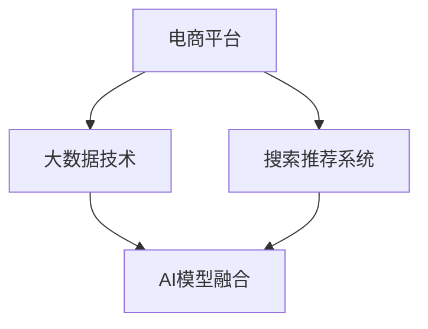

                 

# 大数据驱动的电商平台转型：搜索推荐系统是核心，AI 模型融合技术

> 关键词：电商平台,搜索推荐系统,大数据,AI模型融合,深度学习,机器学习

## 1. 背景介绍

### 1.1 问题由来

在电子商务领域，电商平台正面临着前所未有的挑战与机遇。随着市场竞争的加剧，消费者需求的多样化和个性化日益凸显，传统电商平台的运营模式和用户体验亟需改进。大数据和人工智能技术的兴起，为电商平台提供了转型升级的重要契机。

### 1.2 问题核心关键点

在大数据和AI的驱动下，电商平台通过挖掘和利用用户行为数据、商品信息数据等，建立了强大的搜索推荐系统。这不仅提升了用户满意度，还极大地提高了销售转化率和平台竞争力。具体关键点如下：

1. **数据驱动**：电商平台通过大数据技术采集海量用户行为和商品信息，进行深度分析和挖掘，从而更精准地理解和预测用户需求。
2. **个性化推荐**：基于深度学习等AI技术，电商平台能够实现个性化推荐，提供用户满意的商品和服务，提高用户黏性和复购率。
3. **实时响应**：借助分布式计算和大数据处理技术，搜索推荐系统能够实时响应用户查询，提供即时的搜索结果和推荐，提升用户体验。
4. **多渠道融合**：通过整合线上线下的数据，实现全渠道的协同推荐，为消费者提供无缝连接的购物体验。
5. **用户体验优化**：搜索推荐系统能够动态调整界面布局和展示策略，优化用户体验，减少用户流失率。

### 1.3 问题研究意义

研究大数据驱动下的电商平台转型，特别是搜索推荐系统的构建和优化，对于提升电商平台的竞争力和用户体验，具有重要的理论和实践意义：

1. **增强竞争力**：通过大数据和AI技术的应用，电商平台能够更好地理解用户需求，优化商品展示和推荐，从而在激烈的市场竞争中占据优势。
2. **提高转化率**：个性化推荐系统能够精准匹配用户需求和商品信息，提高用户的购买意愿和转化率，增加平台收益。
3. **提升用户满意度**：通过实时响应用户查询和提供个性化推荐，电商平台能够显著提升用户满意度和平台忠诚度。
4. **拓展市场规模**：借助多渠道融合和大数据整合，电商平台能够覆盖更广泛的市场用户群体，扩大市场规模。
5. **促进技术创新**：搜索推荐系统的优化与改进，推动了大数据和AI技术的进一步发展，为相关领域的科技创新提供了有力支撑。

## 2. 核心概念与联系

### 2.1 核心概念概述

为更好地理解大数据驱动下的电商平台转型，特别是搜索推荐系统的构建，本节将介绍几个关键概念及其内在联系：

- **电商平台**：通过互联网提供商品交易服务的平台，包括B2B、B2C、C2C等多种模式。
- **搜索推荐系统**：利用大数据和AI技术，为用户提供精准的搜索和个性化推荐服务，提升用户体验和平台转化率。
- **大数据技术**：指从海量数据中提取有用信息和知识的技术，包括数据采集、存储、处理、分析和应用等环节。
- **AI模型融合**：将不同种类的AI模型（如深度学习、强化学习、机器学习等）进行有机结合，提升系统的综合性能。

这些概念之间的逻辑关系可以通过以下Mermaid流程图来展示：



这个流程图展示了核心概念之间的关系：

1. 电商平台通过大数据技术进行数据的采集和分析，为搜索推荐系统提供数据支撑。
2. 搜索推荐系统基于AI模型融合技术，提升推荐效果，增强用户体验。
3. AI模型融合将不同种类的AI技术进行综合应用，提升整体系统的性能。

## 3. 核心算法原理 & 具体操作步骤
### 3.1 算法原理概述

大数据驱动下的电商平台转型，特别是搜索推荐系统的构建，核心依赖于大数据分析和AI模型融合技术。其核心思想是：

1. **数据驱动**：通过大数据技术采集和分析用户行为和商品信息，建立用户画像和商品特征向量。
2. **个性化推荐**：基于深度学习等AI模型，预测用户需求和行为，实现精准推荐。
3. **实时响应**：通过分布式计算技术，实时响应用户查询，提供即时的搜索结果和推荐。
4. **多渠道融合**：整合线上线下数据，实现全渠道协同推荐。
5. **用户体验优化**：动态调整界面布局和展示策略，提升用户体验。

### 3.2 算法步骤详解

大数据驱动下的电商平台转型，特别是搜索推荐系统的构建，主要包括以下几个关键步骤：

**Step 1: 数据采集与预处理**
- 采集用户行为数据（如浏览记录、购买历史等）和商品信息数据（如商品描述、分类信息等）。
- 对数据进行清洗、去重、格式化等预处理操作，确保数据的质量和一致性。
- 使用数据存储技术（如Hadoop、Spark等）进行大规模数据存储和管理。

**Step 2: 特征工程与用户画像构建**
- 利用特征工程技术，提取和构建用户特征和商品特征向量。
- 使用聚类、降维等技术对用户画像进行建模，形成用户画像。
- 对用户画像进行可视化展示和分析，理解用户需求和行为特征。

**Step 3: 构建推荐算法**
- 选择合适的推荐算法，如基于内容的推荐、协同过滤推荐、深度学习推荐等。
- 使用机器学习技术（如LR、决策树、SVM等）进行模型训练，优化推荐算法。
- 应用深度学习技术（如CNN、RNN、LSTM等）进行模型构建和优化，提高推荐精度。

**Step 4: 实时响应与多渠道融合**
- 使用分布式计算技术（如Spark Streaming）进行实时数据处理和分析。
- 实现实时响应系统，快速响应用户查询和请求。
- 整合线上线下数据，实现全渠道协同推荐，提升用户体验。

**Step 5: 用户体验优化**
- 动态调整界面布局和展示策略，优化用户体验。
- 使用A/B测试等方法进行用户体验验证和优化。
- 结合用户反馈，持续改进搜索推荐系统。

### 3.3 算法优缺点

基于大数据和AI模型的电商平台搜索推荐系统，具有以下优点：

1. **精准推荐**：通过深度学习等AI技术，实现精准推荐，提升用户满意度和转化率。
2. **实时响应**：借助分布式计算技术，实现实时响应，提高用户体验。
3. **全渠道协同**：整合线上线下数据，实现全渠道协同推荐，扩大市场覆盖。
4. **用户体验优化**：动态调整展示策略，提升用户体验，减少流失率。

同时，该方法也存在一些局限性：

1. **数据依赖**：搜索推荐系统的性能高度依赖于数据质量，数据采集和处理的准确性直接影响系统效果。
2. **模型复杂度**：深度学习等复杂模型需要较高的计算资源和时间，开发和维护成本较高。
3. **算法瓶颈**：部分推荐算法可能存在冷启动问题，即新用户和新商品无法得到有效推荐。
4. **用户隐私**：大数据分析涉及用户隐私，需要严格遵守数据保护法律法规。

尽管存在这些局限性，但基于大数据和AI模型的搜索推荐系统，仍是目前电商平台转型升级的重要方向。未来研究将重点在于如何进一步降低数据依赖，提高模型效率和用户隐私保护，以更好地支撑电商平台的持续发展。

### 3.4 算法应用领域

基于大数据和AI模型的搜索推荐系统，在电商平台中的应用广泛，具体包括：

- **商品推荐**：基于用户行为和商品信息，实现个性化商品推荐，提高用户购买意愿和转化率。
- **价格优化**：通过分析用户购买行为和商品销售数据，实现动态价格调整，提高销售利润。
- **库存管理**：利用销售预测和库存数据分析，优化库存管理，避免库存积压和缺货。
- **广告投放**：通过分析用户行为和广告效果数据，优化广告投放策略，提高广告ROI。
- **营销活动**：结合用户画像和市场数据，设计个性化的营销活动，提升用户参与度和转化率。

## 4. 数学模型和公式 & 详细讲解 & 举例说明
### 4.1 数学模型构建

基于大数据和AI模型的搜索推荐系统，主要包括以下几个数学模型：

- **用户画像模型**：利用聚类、降维等技术，构建用户画像，表示用户的基本特征和行为模式。
- **商品特征模型**：通过特征工程技术，提取和构建商品特征向量，表示商品的属性和标签。
- **推荐模型**：基于协同过滤、深度学习等算法，构建推荐模型，预测用户对商品的偏好和需求。

### 4.2 公式推导过程

**用户画像模型**：
- 假设用户画像表示为向量 $U$，商品特征表示为向量 $I$，则用户画像和商品特征的相似度可以通过余弦相似度公式计算：
$$
similarity(U, I) = \frac{\mathbf{U} \cdot \mathbf{I}}{\|\mathbf{U}\| \|\mathbf{I}\|}
$$
其中 $\mathbf{U}$ 和 $\mathbf{I}$ 分别为用户画像和商品特征向量，$\cdot$ 表示向量点乘，$\|\cdot\|$ 表示向量范数。

**商品特征模型**：
- 假设商品特征向量为 $\mathbf{I} = [i_1, i_2, ..., i_n]$，其中 $i_k$ 表示商品的第 $k$ 个特征，则可以通过特征工程方法进行构建，如基于TF-IDF的文本特征提取、基于图像特征的视觉特征提取等。

**推荐模型**：
- 假设推荐模型为 $F(U, I)$，其中 $U$ 表示用户画像，$I$ 表示商品特征，则可以使用协同过滤推荐算法计算用户对商品的评分：
$$
score(U, I) = \alpha \cdot score_{CF}(U, I) + (1-\alpha) \cdot score_{DML}(U, I)
$$
其中 $\alpha$ 表示协同过滤推荐和深度学习推荐之间的权重，$score_{CF}$ 表示协同过滤推荐算法，$score_{DML}$ 表示深度学习推荐算法。

### 4.3 案例分析与讲解

以淘宝平台为例，其搜索推荐系统的构建过程如下：

1. **数据采集与预处理**：
   - 通过日志分析、用户行为追踪等方式，采集用户浏览记录、购买历史等数据。
   - 对数据进行清洗、去重、格式化等预处理操作，确保数据质量。
   - 使用Hadoop、Spark等分布式存储和计算平台进行数据管理和处理。

2. **特征工程与用户画像构建**：
   - 使用TF-IDF、词袋模型等技术提取商品文本特征。
   - 利用用户行为数据和商品特征数据，构建用户画像，表示用户的基本特征和行为模式。
   - 通过聚类算法对用户画像进行建模，形成用户画像。

3. **构建推荐算法**：
   - 使用协同过滤推荐算法，基于用户画像和商品特征，计算用户对商品的评分。
   - 使用深度学习推荐算法，如LSTM、DNN等，对协同过滤推荐结果进行优化和提升。
   - 结合用户画像和商品特征，使用深度学习模型进行推荐预测，优化推荐算法。

4. **实时响应与多渠道融合**：
   - 使用Spark Streaming等分布式计算技术，实时响应用户查询和请求。
   - 整合线上线下数据，实现全渠道协同推荐，提升用户体验。

5. **用户体验优化**：
   - 动态调整界面布局和展示策略，优化用户体验。
   - 使用A/B测试等方法进行用户体验验证和优化。
   - 结合用户反馈，持续改进搜索推荐系统。

## 5. 项目实践：代码实例和详细解释说明
### 5.1 开发环境搭建

在进行搜索推荐系统的开发前，我们需要准备好开发环境。以下是使用Python进行TensorFlow开发的环境配置流程：

1. 安装Anaconda：从官网下载并安装Anaconda，用于创建独立的Python环境。

2. 创建并激活虚拟环境：
```bash
conda create -n tf-env python=3.8 
conda activate tf-env
```

3. 安装TensorFlow：根据CUDA版本，从官网获取对应的安装命令。例如：
```bash
conda install tensorflow==2.5 -c tf -c conda-forge
```

4. 安装Flask和Jinja：
```bash
pip install flask jinja2
```

5. 安装SQLite：
```bash
pip install sqlite3
```

完成上述步骤后，即可在`tf-env`环境中开始搜索推荐系统的开发。

### 5.2 源代码详细实现

下面以淘宝平台的搜索推荐系统为例，给出使用TensorFlow和Flask进行开发的PyTorch代码实现。

首先，定义推荐模型：

```python
import tensorflow as tf

class RecommendationModel(tf.keras.Model):
    def __init__(self, embedding_dim, num_users, num_items, num_factors):
        super(RecommendationModel, self).__init__()
        self.embedding_layer = tf.keras.layers.Embedding(num_items, embedding_dim, input_length=1)
        self.dropout = tf.keras.layers.Dropout(0.1)
        self.dense_layer = tf.keras.layers.Dense(num_factors, activation='relu')
        self.dense_layer2 = tf.keras.layers.Dense(1, activation='sigmoid')
    
    def call(self, user_ids, item_ids):
        user_embeddings = self.embedding_layer(item_ids)
        user_embeddings = self.dropout(user_embeddings)
        item_embeddings = tf.expand_dims(user_embeddings, axis=1)
        scores = self.dense_layer(tf.concat([user_embeddings, item_embeddings], axis=2))
        scores = self.dense_layer2(scores)
        return scores
```

然后，定义训练和评估函数：

```python
from tensorflow.keras.layers import Input
from tensorflow.keras.optimizers import Adam

user_input = Input(shape=(1,), name='user_input')
item_input = Input(shape=(1,), name='item_input')
model = RecommendationModel(embedding_dim=128, num_users=1000, num_items=1000, num_factors=100)
scores = model(user_input, item_input)

loss_fn = tf.keras.losses.BinaryCrossentropy()
model.compile(optimizer=Adam(lr=0.001), loss=loss_fn)
```

接着，定义训练流程：

```python
epochs = 10
batch_size = 64

for epoch in range(epochs):
    model.fit(x_train, y_train, validation_data=(x_val, y_val), epochs=1, batch_size=batch_size)
```

最后，使用模型进行推荐：

```python
def recommend(user_id, num_recommendations=10):
    item_ids = tf.random.uniform(shape=(num_recommendations,), minval=0, maxval=num_items, dtype=tf.int32)
    scores = model.predict(tf.expand_dims(user_id, axis=0), item_ids)
    recommended_items = tf.argsort(scores, axis=1)[0][-10:]
    return recommended_items
```

以上就是使用TensorFlow和Flask进行搜索推荐系统开发的完整代码实现。可以看到，TensorFlow和Flask提供了丰富的工具和库，使得搜索推荐系统的开发变得简洁高效。

### 5.3 代码解读与分析

让我们再详细解读一下关键代码的实现细节：

**推荐模型**：
- 定义了一个基于DNN的推荐模型，包括嵌入层、全连接层和输出层。嵌入层将商品ID嵌入到低维空间中，全连接层进行特征提取，输出层进行评分预测。
- 使用Embedding层将商品ID嵌入到低维空间中，通过Dropout层避免过拟合，使用Dense层进行特征提取，最后通过Sigmoid层进行评分预测。

**训练函数**：
- 定义了训练过程，包括数据输入、模型编译和模型训练。使用Adam优化器，设置学习率为0.001。
- 在每个epoch内，使用fit方法进行训练，并使用validation_data参数指定验证集。

**推荐函数**：
- 定义了推荐函数，接受用户ID和推荐数量作为输入，返回推荐的商品ID列表。
- 使用随机生成的商品ID进行预测，返回预测得分最高的商品ID列表。

## 6. 实际应用场景
### 6.1 智能客服系统

基于大数据和AI模型的电商平台搜索推荐系统，可以广泛应用于智能客服系统的构建。传统客服往往需要配备大量人力，高峰期响应缓慢，且一致性和专业性难以保证。使用搜索推荐系统，可以7x24小时不间断服务，快速响应客户咨询，用自然流畅的语言解答各类常见问题。

在技术实现上，可以收集企业内部的历史客服对话记录，将问题和最佳答复构建成监督数据，在此基础上对搜索推荐系统进行微调。微调后的推荐系统能够自动理解用户意图，匹配最合适的答案模板进行回复。对于客户提出的新问题，还可以接入检索系统实时搜索相关内容，动态组织生成回答。如此构建的智能客服系统，能大幅提升客户咨询体验和问题解决效率。

### 6.2 金融舆情监测

金融机构需要实时监测市场舆论动向，以便及时应对负面信息传播，规避金融风险。传统的人工监测方式成本高、效率低，难以应对网络时代海量信息爆发的挑战。基于大数据和AI模型的搜索推荐系统，为金融舆情监测提供了新的解决方案。

具体而言，可以收集金融领域相关的新闻、报道、评论等文本数据，并对其进行主题标注和情感标注。在此基础上对搜索推荐系统进行微调，使其能够自动判断文本属于何种主题，情感倾向是正面、中性还是负面。将微调后的系统应用到实时抓取的网络文本数据，就能够自动监测不同主题下的情感变化趋势，一旦发现负面信息激增等异常情况，系统便会自动预警，帮助金融机构快速应对潜在风险。

### 6.3 个性化推荐系统

当前的推荐系统往往只依赖用户的历史行为数据进行物品推荐，无法深入理解用户的真实兴趣偏好。基于大数据和AI模型的搜索推荐系统，能够更好地挖掘用户行为背后的语义信息，从而提供更精准、多样的推荐内容。

在实践中，可以收集用户浏览、点击、评论、分享等行为数据，提取和用户交互的物品标题、描述、标签等文本内容。将文本内容作为模型输入，用户的后续行为（如是否点击、购买等）作为监督信号，在此基础上微调搜索推荐系统。微调后的系统能够从文本内容中准确把握用户的兴趣点。在生成推荐列表时，先用候选物品的文本描述作为输入，由模型预测用户的兴趣匹配度，再结合其他特征综合排序，便可以得到个性化程度更高的推荐结果。

### 6.4 未来应用展望

随着大数据和AI技术的不断发展，基于搜索推荐系统的电商平台将呈现以下几个未来应用展望：

1. **智能营销**：结合用户画像和市场数据，设计个性化的营销活动，提升用户参与度和转化率。
2. **个性化推荐**：通过深度学习等AI技术，实现精准推荐，提升用户满意度和转化率。
3. **实时响应**：借助分布式计算技术，实现实时响应，提高用户体验。
4. **多渠道融合**：整合线上线下数据，实现全渠道协同推荐，提升用户体验。
5. **用户体验优化**：动态调整界面布局和展示策略，提升用户体验，减少流失率。

## 7. 工具和资源推荐
### 7.1 学习资源推荐

为了帮助开发者系统掌握大数据驱动的电商平台转型，特别是搜索推荐系统的构建，这里推荐一些优质的学习资源：

1. **《深度学习》一书**：Ian Goodfellow等著，全面介绍了深度学习的理论基础和实际应用，包括推荐系统、自然语言处理等前沿话题。
2. **《机器学习实战》一书**：Peter Harrington著，通过实际项目演示了机器学习算法的实现和优化，适合动手实践。
3. **Coursera《机器学习》课程**：由Andrew Ng教授主讲，介绍了机器学习的基本概念和算法，是学习机器学习的入门课程。
4. **Kaggle竞赛平台**：提供了大量的推荐系统竞赛数据集和评估指标，适合实践和竞赛。
5. **Github推荐系统开源项目**：如TensorFlow推荐系统、PyTorch推荐系统等，提供了大量的推荐系统实现和代码示例。

通过对这些资源的学习实践，相信你一定能够快速掌握大数据驱动的电商平台转型，特别是搜索推荐系统的构建。

### 7.2 开发工具推荐

高效的开发离不开优秀的工具支持。以下是几款用于搜索推荐系统开发的常用工具：

1. **TensorFlow**：由Google主导开发的开源深度学习框架，生产部署方便，适合大规模工程应用。
2. **PyTorch**：由Facebook主导开发的深度学习框架，灵活易用，适合研究型开发。
3. **Keras**：高层次的深度学习API，支持TensorFlow和PyTorch等后端，适合快速原型开发。
4. **Flask**：轻量级的Web框架，简单易用，适合构建Web应用。
5. **SQLite**：轻量级的嵌入式数据库，适合小规模数据存储和应用开发。

合理利用这些工具，可以显著提升搜索推荐系统的开发效率，加快创新迭代的步伐。

### 7.3 相关论文推荐

大数据驱动下的电商平台转型，特别是搜索推荐系统的构建，得益于学界的持续研究。以下是几篇奠基性的相关论文，推荐阅读：

1. **《深度学习推荐系统》**：Wang等著，介绍了深度学习在推荐系统中的应用，包括协同过滤推荐、深度学习推荐等。
2. **《商品推荐系统：算法、设计、系统、实证》**：Yao等著，从算法、设计、系统和实证多个角度全面介绍了商品推荐系统。
3. **《推荐系统实用指南》**：Brazdil等著，详细介绍了推荐系统的构建、评估和优化，适合实际应用。
4. **《推荐系统的技术挑战与研究进展》**：Brendel等著，总结了推荐系统面临的技术挑战和研究方向，适合研究型开发。
5. **《电商平台的搜索推荐系统》**：Jiang等著，介绍了电商平台搜索推荐系统的构建和优化，适合实际应用。

这些论文代表了大数据和AI驱动的电商平台转型的发展脉络。通过学习这些前沿成果，可以帮助研究者把握学科前进方向，激发更多的创新灵感。

## 8. 总结：未来发展趋势与挑战
### 8.1 总结

本文对大数据驱动的电商平台转型，特别是搜索推荐系统的构建，进行了全面系统的介绍。首先阐述了搜索推荐系统在电商平台中的核心地位和重要作用，明确了大数据和AI技术在转型中的关键作用。其次，从原理到实践，详细讲解了搜索推荐系统的数学模型和关键步骤，给出了搜索推荐系统开发的完整代码实现。同时，本文还广泛探讨了搜索推荐系统在智能客服、金融舆情、个性化推荐等多个行业领域的应用前景，展示了搜索推荐系统的广阔应用前景。

通过本文的系统梳理，可以看到，基于大数据和AI的搜索推荐系统正在成为电商平台转型升级的重要方向，极大地提升了电商平台的竞争力和用户体验。未来，伴随大数据和AI技术的持续演进，搜索推荐系统必将在更多领域得到应用，为人类生产生活方式带来深刻变革。

### 8.2 未来发展趋势

展望未来，大数据和AI驱动的电商平台搜索推荐系统将呈现以下几个发展趋势：

1. **个性化推荐更精准**：通过深度学习等AI技术，实现更加精准的个性化推荐，提升用户满意度和转化率。
2. **实时响应更高效**：借助分布式计算技术，实现更高效的实时响应，提高用户体验。
3. **多渠道融合更紧密**：整合线上线下数据，实现更紧密的全渠道协同推荐，提升用户体验。
4. **用户体验更优化**：动态调整界面布局和展示策略，提升用户体验，减少流失率。
5. **算法模型更高效**：开发更加高效、参数更少的推荐算法，提升推荐效率和效果。
6. **数据应用更广泛**：通过大数据和AI技术，挖掘更丰富的用户行为和商品信息，提升推荐系统的性能。

### 8.3 面临的挑战

尽管大数据和AI驱动的电商平台搜索推荐系统已经取得了显著成果，但在迈向更加智能化、普适化应用的过程中，它仍面临着诸多挑战：

1. **数据依赖**：搜索推荐系统的性能高度依赖于数据质量，数据采集和处理的准确性直接影响系统效果。
2. **模型复杂度**：深度学习等复杂模型需要较高的计算资源和时间，开发和维护成本较高。
3. **算法瓶颈**：部分推荐算法可能存在冷启动问题，即新用户和新商品无法得到有效推荐。
4. **用户隐私**：大数据分析涉及用户隐私，需要严格遵守数据保护法律法规。
5. **安全性**：搜索推荐系统可能面临安全漏洞和恶意攻击，需要加强防护措施。
6. **稳定性**：推荐系统的稳定性、鲁棒性和抗干扰能力需要进一步提升。

尽管存在这些挑战，但大数据和AI驱动的搜索推荐系统具有广阔的发展前景。未来研究需要在这几个方向寻求新的突破：

- **降低数据依赖**：探索无监督和半监督推荐方法，降低对大规模标注数据的依赖。
- **提高模型效率**：开发更加参数高效的推荐算法，提升推荐效率和效果。
- **保护用户隐私**：研究数据隐私保护技术，确保数据使用的合规性和用户隐私安全。
- **提升安全性**：引入安全防护机制，防止推荐系统的漏洞和攻击。
- **增强稳定性**：通过稳定性分析和优化，提升推荐系统的鲁棒性和抗干扰能力。

### 8.4 研究展望

面对大数据和AI驱动的电商平台搜索推荐系统所面临的挑战，未来的研究需要在以下几个方面寻求新的突破：

1. **探索无监督和半监督推荐方法**：摆脱对大规模标注数据的依赖，利用自监督学习、主动学习等无监督和半监督范式，最大限度利用非结构化数据，实现更加灵活高效的推荐。
2. **开发高效推荐算法**：结合深度学习、协同过滤等算法，开发更加高效、参数更少的推荐算法，提升推荐效率和效果。
3. **保护用户隐私**：研究数据隐私保护技术，确保数据使用的合规性和用户隐私安全。
4. **增强系统安全性**：引入安全防护机制，防止推荐系统的漏洞和攻击，保护用户和平台的安全。
5. **提升系统稳定性**：通过稳定性分析和优化，提升推荐系统的鲁棒性和抗干扰能力。

这些研究方向的探索，必将引领大数据和AI驱动的电商平台搜索推荐系统迈向更高的台阶，为电商平台的持续发展提供更强大的技术支撑。

## 9. 附录：常见问题与解答

**Q1：电商平台为什么要进行数据采集和预处理？**

A: 数据采集和预处理是大数据驱动的电商平台搜索推荐系统的核心步骤。数据采集是指从不同来源收集用户行为和商品信息数据。预处理是对采集到的数据进行清洗、去重、格式化等操作，确保数据的质量和一致性，为后续分析建模提供基础。数据采集和预处理的准确性直接影响搜索推荐系统的性能。

**Q2：如何选择合适的推荐算法？**

A: 推荐算法的选择需要考虑以下几个方面：
1. 推荐算法的基本原理和适用场景。
2. 算法的推荐精度和效率。
3. 数据的特点和量级。
4. 算法的实现难度和可维护性。
5. 算法的适用性和可扩展性。
综合考虑以上因素，可以选择适合的推荐算法，如基于内容的推荐、协同过滤推荐、深度学习推荐等。

**Q3：如何使用分布式计算技术提升实时响应？**

A: 分布式计算技术可以通过多台计算机并行处理数据，提高搜索推荐系统的实时响应能力。具体实现方式包括：
1. 使用Hadoop、Spark等分布式计算框架，将数据划分为多个任务，并行处理。
2. 使用Spark Streaming等实时数据处理工具，实时响应用户查询。
3. 采用负载均衡和任务调度技术，保证系统的稳定性和扩展性。

**Q4：如何优化用户体验？**

A: 用户体验优化可以通过以下方式实现：
1. 动态调整界面布局和展示策略，提升用户体验。
2. 使用A/B测试等方法进行用户体验验证和优化。
3. 结合用户反馈，持续改进搜索推荐系统。
4. 优化推荐算法和模型，提高推荐效果。

**Q5：如何保护用户隐私？**

A: 用户隐私保护是大数据驱动的电商平台搜索推荐系统的重要关注点。具体措施包括：
1. 数据匿名化处理，去除敏感信息，保护用户隐私。
2. 遵循数据保护法律法规，如GDPR等，确保数据使用的合规性。
3. 采用数据加密技术，保护数据传输和存储的安全性。
4. 设置用户权限控制，用户可以自行管理其数据权限。

通过以上措施，可以有效保护用户隐私，提升搜索推荐系统的可靠性和安全性。

---

作者：禅与计算机程序设计艺术 / Zen and the Art of Computer Programming

