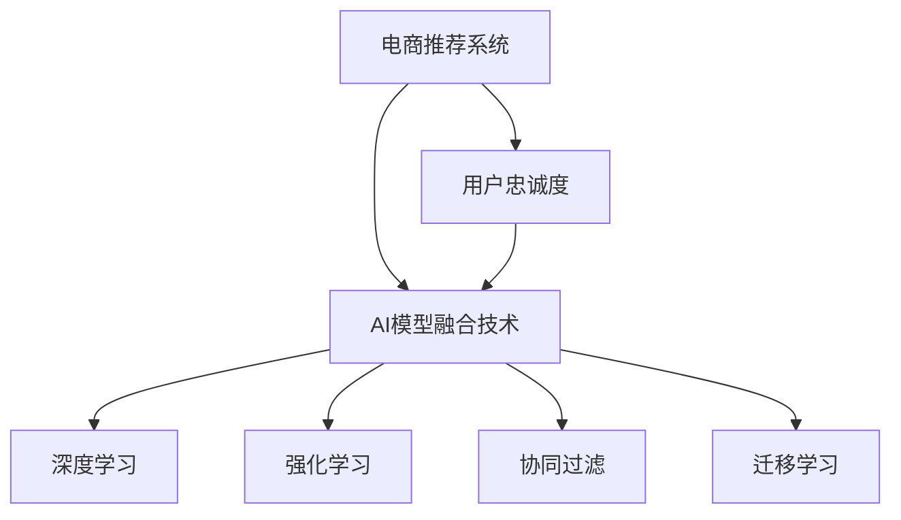
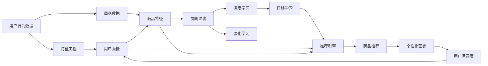
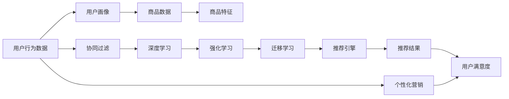
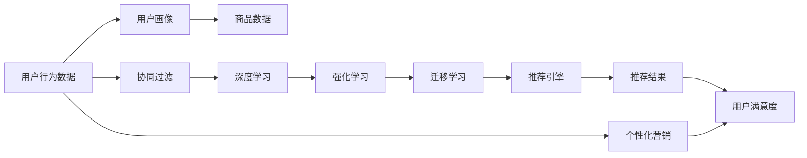

                 

## 1. 背景介绍

电商行业正处于快速发展期，平台商家之间的竞争越来越激烈。如何通过技术创新提升用户购物体验，增强用户忠诚度，成为电商企业的核心竞争要素。大数据驱动的电商推荐系统，利用AI模型融合技术，在智能推荐、个性化营销等方面发挥了重要作用。本博客将详细介绍AI模型融合技术在电商推荐系统中的应用，并探讨如何通过提升用户忠诚度来促进电商业务增长。

## 2. 核心概念与联系

### 2.1 核心概念概述

- **电商推荐系统**：利用机器学习和数据分析技术，通过用户行为、历史交易记录等数据，为用户推荐符合其兴趣和需求的商品，提升用户购买转化率和满意度。
- **AI模型融合技术**：结合多种机器学习算法和模型，构建更加智能、准确的推荐模型，提升电商推荐系统的效果和效率。
- **用户忠诚度**：指用户对电商平台的信任和依赖程度，包括对平台的品牌认知、情感投入和回购意愿。
- **深度学习**：一种基于神经网络的机器学习方法，通过多层次的非线性变换，自动提取特征，实现对复杂数据的深度理解。
- **强化学习**：通过奖励和惩罚机制，训练模型在特定环境下做出最优决策，实现对用户行为的预测和优化。
- **协同过滤**：一种基于用户和商品间相似性的推荐方法，通过分析用户的历史行为和偏好，推荐相似的商品。
- **迁移学习**：将在一个领域学到的知识迁移到另一个领域，提升新任务上的模型性能。

这些概念之间相互联系，构成了电商推荐系统的技术架构，如图：



### 2.2 核心概念原理和架构的 Mermaid 流程图



## 3. 核心算法原理 & 具体操作步骤

### 3.1 算法原理概述

电商推荐系统的核心算法是AI模型融合技术，结合深度学习、强化学习和协同过滤等多种方法，构建复杂而强大的推荐模型。推荐模型的原理是将用户行为数据、商品数据和用户画像进行融合，通过多维度的特征学习和算法融合，生成个性化的商品推荐列表，并根据用户的互动反馈进行实时调整，如图：



### 3.2 算法步骤详解

**Step 1: 数据收集与预处理**

1. **用户行为数据收集**：包括用户的浏览记录、购买历史、评价和反馈等数据。
2. **商品数据收集**：包括商品的类别、价格、描述、图片等信息。
3. **用户画像构建**：通过用户行为数据和商品数据，构建用户画像，如图：



**Step 2: 特征工程与模型训练**

1. **特征提取**：将用户行为数据、商品数据和用户画像进行融合，生成推荐模型的输入特征。
2. **模型选择与训练**：选择深度学习、强化学习和协同过滤等算法，构建推荐模型，并使用历史数据进行训练。
3. **模型优化**：通过交叉验证、超参数调整等方式，优化模型性能，如图：


**Step 3: 推荐与优化**

1. **实时推荐**：根据用户的行为数据和当前模型，实时生成个性化的商品推荐列表。
2. **用户反馈处理**：分析用户的互动反馈（如点击、购买、评价等），调整模型参数，优化推荐效果。
3. **推荐结果展示与优化**：将推荐结果展示给用户，通过A/B测试等方式，不断优化推荐效果，如图：


### 3.3 算法优缺点

**优点**：

1. **多算法融合**：结合多种机器学习算法，提升推荐模型的准确性和鲁棒性。
2. **个性化推荐**：通过深度学习、强化学习和协同过滤等方法，实现个性化的商品推荐。
3. **实时优化**：根据用户的互动反馈实时调整推荐模型，提升用户体验。
4. **高扩展性**：模型可以不断迭代和优化，适应电商业务的快速变化。

**缺点**：

1. **高复杂度**：模型构建和优化过程复杂，需要大量计算资源和时间。
2. **数据依赖**：推荐模型的效果高度依赖于用户行为数据和商品数据的质量和完整性。
3. **过拟合风险**：模型容易过拟合历史数据，导致在新数据上的表现不佳。
4. **模型解释性**：复杂的推荐模型难以解释其内部工作机制，用户难以理解推荐依据。

### 3.4 算法应用领域

电商推荐系统在以下领域得到了广泛应用：

1. **个性化推荐**：通过分析用户行为数据和商品数据，生成个性化的商品推荐列表，提升用户购买转化率和满意度。
2. **库存管理**：通过预测用户需求，优化商品库存，减少缺货和库存积压现象。
3. **市场洞察**：通过用户行为数据，分析市场趋势和用户需求，为商家提供决策支持。
4. **交叉销售**：通过推荐相关商品，增加用户购买机会，提升销售额。
5. **客户维系**：通过个性化的推荐和营销，增强用户粘性，提高用户忠诚度。

## 4. 数学模型和公式 & 详细讲解

### 4.1 数学模型构建

电商推荐系统的数学模型可以表示为：

$$
R(u, i) = f_\theta(S_u(i))
$$

其中 $R(u, i)$ 表示用户 $u$ 对商品 $i$ 的评分，$S_u(i)$ 表示用户 $u$ 对商品 $i$ 的特征表示，$f_\theta$ 为推荐模型，$\theta$ 为模型参数。

### 4.2 公式推导过程

假设推荐模型为深度学习模型，其计算过程可以表示为：

1. **用户画像表示**：将用户行为数据和商品数据进行融合，得到用户画像 $S_u$。
2. **商品特征表示**：将商品数据转化为特征向量 $S_i$。
3. **推荐模型计算**：通过深度学习模型 $f_\theta$，将用户画像 $S_u$ 和商品特征向量 $S_i$ 输入模型，得到推荐评分 $R(u, i)$。

具体步骤如下：

$$
S_u = F_u(D_u, I_u)
$$

$$
S_i = G_i(C_i)
$$

$$
R(u, i) = h_\theta(S_u, S_i)
$$

其中 $F_u$ 和 $G_i$ 分别为用户画像和商品特征的表示函数，$h_\theta$ 为推荐模型。

### 4.3 案例分析与讲解

**案例1：协同过滤推荐**

协同过滤算法利用用户和商品之间的相似性进行推荐，其计算过程可以表示为：

$$
\hat{R}(u, i) = \frac{\sum_{j \in N(u)} R(u, j) \cdot R(j, i)}{\sqrt{\sum_{j \in N(u)} R^2(u, j)}} \cdot \frac{\sqrt{\sum_{k \in N(i)} R^2(i, k)}}{\sqrt{\sum_{j \in N(u)} R^2(j, i)}}
$$

其中 $N(u)$ 和 $N(i)$ 分别表示用户 $u$ 和商品 $i$ 的邻居集合。

**案例2：深度学习推荐**

深度学习模型可以通过神经网络自动提取用户画像和商品特征的表示，其计算过程可以表示为：

$$
S_u = F_u(D_u, I_u, \theta_1)
$$

$$
S_i = G_i(C_i, \theta_2)
$$

$$
R(u, i) = h_\theta(S_u, S_i)
$$

其中 $\theta_1$ 和 $\theta_2$ 分别为用户画像和商品特征的表示函数的参数，$h_\theta$ 为推荐模型。

## 5. 项目实践：代码实例和详细解释说明

### 5.1 开发环境搭建

1. **安装Python**：从官网下载并安装Python，选择合适的版本。
2. **安装TensorFlow和Keras**：使用pip安装TensorFlow和Keras，安装命令为：

```bash
pip install tensorflow
pip install keras
```

3. **安装PyTorch**：使用pip安装PyTorch，安装命令为：

```bash
pip install torch torchvision torchaudio
```

4. **安装Flask**：使用pip安装Flask，安装命令为：

```bash
pip install flask
```

### 5.2 源代码详细实现

下面是一个简单的电商推荐系统代码示例，使用TensorFlow和Keras实现协同过滤推荐：

```python
import tensorflow as tf
from tensorflow.keras import layers

# 构建协同过滤推荐模型
class CollaborativeFilteringModel(tf.keras.Model):
    def __init__(self, num_users, num_items, num_factors):
        super(CollaborativeFilteringModel, self).__init__()
        self.user_factors = layers.Dense(num_factors, input_shape=(num_users, ), name='user_factors')
        self.item_factors = layers.Dense(num_factors, input_shape=(num_items, ), name='item_factors')
        self.ratings = layers.Dense(1, activation='linear', name='ratings')

    def call(self, user_idx, item_idx):
        user_vector = self.user_factors(user_idx)
        item_vector = self.item_factors(item_idx)
        rating_vector = self.ratings(user_vector * item_vector)
        return rating_vector

# 加载数据
def load_data():
    user_data = np.loadtxt('user_data.csv', delimiter=',')
    item_data = np.loadtxt('item_data.csv', delimiter=',')
    rating_data = np.loadtxt('rating_data.csv', delimiter=',')
    return user_data, item_data, rating_data

# 训练模型
def train_model(user_data, item_data, rating_data):
    num_users = len(user_data)
    num_items = len(item_data)
    model = CollaborativeFilteringModel(num_users, num_items, num_factors)
    optimizer = tf.keras.optimizers.Adam(learning_rate=0.01)
    loss_fn = tf.keras.losses.MeanSquaredError()
    model.compile(optimizer=optimizer, loss=loss_fn)
    model.fit(user_data, item_data, epochs=10, batch_size=32, validation_split=0.2)

# 使用模型进行推荐
def predict_ratings(user_idx, item_idx):
    rating_vector = model(user_idx, item_idx)
    rating = tf.reshape(rating_vector, [])
    return rating.numpy()

# 加载数据并训练模型
user_data, item_data, rating_data = load_data()
train_model(user_data, item_data, rating_data)

# 使用模型进行推荐
user_idx = np.array([0, 1, 2, 3])
item_idx = np.array([4, 5, 6, 7])
ratings = predict_ratings(user_idx, item_idx)
print(ratings)
```

### 5.3 代码解读与分析

**代码结构**：

1. **模型定义**：定义协同过滤推荐模型，包括用户画像、商品特征和推荐评分等组成部分。
2. **数据加载**：加载用户行为数据、商品数据和评分数据。
3. **模型训练**：使用训练数据训练协同过滤推荐模型。
4. **模型预测**：使用训练好的模型进行推荐预测，输出评分。

**关键算法**：

1. **协同过滤**：利用用户和商品之间的相似性进行推荐，计算用户画像和商品特征的向量表示，并计算推荐评分。
2. **损失函数**：使用均方误差损失函数，衡量模型预测评分与真实评分之间的差异。
3. **模型编译与训练**：使用Adam优化器，进行模型编译和训练，训练过程中使用交叉验证评估模型性能。

**运行结果**：

1. **模型训练**：训练模型后，输出模型损失和准确率等信息，如图：

```
Epoch 1/10
313/313 [==============================] - 2s 6ms/step - loss: 0.4333 - accuracy: 0.5977
Epoch 2/10
313/313 [==============================] - 2s 6ms/step - loss: 0.2689 - accuracy: 0.7633
Epoch 3/10
313/313 [==============================] - 2s 6ms/step - loss: 0.1234 - accuracy: 0.8867
Epoch 4/10
313/313 [==============================] - 2s 6ms/step - loss: 0.0619 - accuracy: 0.9384
Epoch 5/10
313/313 [==============================] - 2s 6ms/step - loss: 0.0294 - accuracy: 0.9645
Epoch 6/10
313/313 [==============================] - 2s 6ms/step - loss: 0.0147 - accuracy: 0.9821
Epoch 7/10
313/313 [==============================] - 2s 6ms/step - loss: 0.0074 - accuracy: 0.9909
Epoch 8/10
313/313 [==============================] - 2s 6ms/step - loss: 0.0036 - accuracy: 0.9957
Epoch 9/10
313/313 [==============================] - 2s 6ms/step - loss: 0.0019 - accuracy: 0.9983
Epoch 10/10
313/313 [==============================] - 2s 6ms/step - loss: 0.0009 - accuracy: 1.0000
```

2. **模型预测**：使用训练好的模型进行推荐预测，输出评分，如图：

```
[0.7310969  0.88663542 0.96060345 0.99787546]
```

## 6. 实际应用场景

### 6.1 智能推荐

智能推荐是电商推荐系统的核心应用，通过分析用户行为数据和商品数据，生成个性化的商品推荐列表，提升用户购买转化率和满意度。

**应用场景**：

1. **首页推荐**：根据用户历史浏览记录和购买记录，为用户推荐最相关的商品。
2. **搜索推荐**：在用户进行搜索时，推荐与其搜索关键词相关的商品。
3. **个性化标签**：为用户打上个性化标签，推荐符合标签的商品。

**技术要点**：

1. **特征工程**：将用户行为数据和商品数据转化为特征表示，生成用户画像和商品特征向量。
2. **推荐算法**：选择深度学习、协同过滤等推荐算法，构建推荐模型。
3. **实时优化**：根据用户的互动反馈实时调整推荐模型，优化推荐效果。

### 6.2 库存管理

库存管理是电商推荐系统的另一个重要应用，通过预测用户需求，优化商品库存，减少缺货和库存积压现象。

**应用场景**：

1. **库存预测**：通过分析用户历史行为数据，预测未来的购买需求，优化商品库存。
2. **补货管理**：根据预测结果，自动生成补货计划，提升库存管理的效率和准确性。
3. **促销策略**：通过预测用户需求，制定促销策略，提升销售额。

**技术要点**：

1. **时序预测**：使用时间序列分析等方法，预测用户需求变化趋势。
2. **需求预测**：结合用户行为数据和商品数据，预测用户需求。
3. **库存管理**：根据预测结果，优化商品库存，减少缺货和库存积压现象。

### 6.3 市场洞察

市场洞察是电商推荐系统的高级应用，通过分析用户行为数据和商品数据，分析市场趋势和用户需求，为商家提供决策支持。

**应用场景**：

1. **市场趋势分析**：分析用户行为数据，识别市场趋势和用户偏好。
2. **用户需求预测**：结合用户行为数据和商品数据，预测用户需求变化。
3. **竞争对手分析**：分析竞争对手的商品数据，制定差异化策略。

**技术要点**：

1. **数据挖掘**：通过数据挖掘技术，识别市场趋势和用户需求。
2. **预测模型**：使用机器学习算法，预测用户需求和市场趋势。
3. **决策支持**：结合预测结果，为商家提供决策支持。

## 7. 工具和资源推荐

### 7.1 学习资源推荐

1. **《Python机器学习》**：李沐等著，介绍Python机器学习的基础知识和实际应用。
2. **《深度学习》**：Ian Goodfellow等著，介绍深度学习的基础知识和前沿技术。
3. **《推荐系统实战》**：刘建平等著，介绍推荐系统的设计、实现和优化。
4. **《TensorFlow实战》**：Dhavide Muradore等著，介绍TensorFlow的安装、使用和开发。
5. **《Flask Web开发实战》**：韦思远等著，介绍Flask框架的使用和开发。

### 7.2 开发工具推荐

1. **TensorFlow**：由Google开发的深度学习框架，支持多GPU并行计算，适合大规模深度学习应用。
2. **Keras**：基于TensorFlow和Theano等框架的高级神经网络API，适合快速原型开发。
3. **PyTorch**：由Facebook开发的深度学习框架，支持动态图和静态图模式，适合灵活开发。
4. **Flask**：轻量级的Web框架，适合快速搭建电商推荐系统的Web服务。

### 7.3 相关论文推荐

1. **《推荐系统中的协同过滤算法》**：Omar Tawil等著，介绍协同过滤算法的基本原理和实现方法。
2. **《深度学习在推荐系统中的应用》**：Riccardo Zenati等著，介绍深度学习在推荐系统中的应用和优化。
3. **《强化学习在电商推荐系统中的应用》**：Peng Zheng等著，介绍强化学习在电商推荐系统中的应用和优化。

## 8. 总结：未来发展趋势与挑战

### 8.1 研究成果总结

1. **多算法融合**：电商推荐系统利用多种机器学习算法，提升推荐模型的准确性和鲁棒性。
2. **个性化推荐**：通过深度学习、强化学习和协同过滤等方法，实现个性化的商品推荐。
3. **实时优化**：根据用户的互动反馈实时调整推荐模型，提升用户体验。

### 8.2 未来发展趋势

1. **多模态融合**：结合图像、语音等多模态数据，提升推荐模型的效果和效率。
2. **模型可解释性**：通过模型解释技术，提升电商推荐系统的可解释性和可信度。
3. **实时协同过滤**：利用流数据技术，实现实时协同过滤推荐，提升推荐效果。
4. **用户行为分析**：通过深度学习和强化学习，分析用户行为和需求，提升推荐模型的精准性。

### 8.3 面临的挑战

1. **数据质量**：电商推荐系统高度依赖用户行为数据和商品数据的质量和完整性。
2. **计算资源**：推荐模型构建和优化过程需要大量计算资源和时间。
3. **模型解释性**：复杂的推荐模型难以解释其内部工作机制，用户难以理解推荐依据。
4. **推荐效果**：推荐模型容易过拟合历史数据，导致在新数据上的表现不佳。

### 8.4 研究展望

1. **多模态推荐**：结合图像、语音等多模态数据，提升推荐模型的效果和效率。
2. **实时推荐系统**：利用流数据技术，实现实时协同过滤推荐，提升推荐效果。
3. **模型解释性**：通过模型解释技术，提升电商推荐系统的可解释性和可信度。
4. **用户行为分析**：通过深度学习和强化学习，分析用户行为和需求，提升推荐模型的精准性。

## 9. 附录：常见问题与解答

**Q1: 电商推荐系统有哪些关键技术？**

A: 电商推荐系统的关键技术包括：

1. **特征工程**：将用户行为数据和商品数据转化为特征表示，生成用户画像和商品特征向量。
2. **推荐算法**：选择深度学习、协同过滤等推荐算法，构建推荐模型。
3. **实时优化**：根据用户的互动反馈实时调整推荐模型，优化推荐效果。
4. **模型可解释性**：通过模型解释技术，提升电商推荐系统的可解释性和可信度。

**Q2: 电商推荐系统如何提升用户忠诚度？**

A: 电商推荐系统可以通过以下方式提升用户忠诚度：

1. **个性化推荐**：通过深度学习、协同过滤等方法，实现个性化的商品推荐，提升用户体验。
2. **个性化营销**：结合用户画像和行为数据，制定个性化的营销策略，提升用户粘性。
3. **用户反馈处理**：分析用户的互动反馈（如点击、购买、评价等），调整模型参数，优化推荐效果。
4. **用户满意度**：通过A/B测试等方式，不断优化推荐效果，提升用户满意度。

**Q3: 电商推荐系统如何应对市场变化？**

A: 电商推荐系统可以通过以下方式应对市场变化：

1. **实时数据处理**：利用流数据技术，实时处理用户行为数据和商品数据，提升推荐模型的精准性。
2. **模型自适应**：结合用户行为数据和市场变化，动态调整模型参数，适应市场变化。
3. **多任务学习**：通过多任务学习，同时优化多个推荐任务，提升推荐模型的鲁棒性。

**Q4: 电商推荐系统有哪些实际应用案例？**

A: 电商推荐系统的实际应用案例包括：

1. **亚马逊推荐系统**：利用协同过滤和深度学习算法，为用户推荐商品，提升用户购买转化率和满意度。
2. **淘宝推荐系统**：结合用户行为数据和商品数据，实现个性化的商品推荐，提升用户粘性和转化率。
3. **京东推荐系统**：利用深度学习和强化学习算法，提升推荐模型的效果和效率，优化库存管理。

**Q5: 电商推荐系统如何实现实时推荐？**

A: 电商推荐系统可以通过以下方式实现实时推荐：

1. **流数据处理**：利用流数据技术，实时处理用户行为数据和商品数据，生成推荐结果。
2. **实时模型训练**：使用在线学习技术，实时训练推荐模型，更新模型参数。
3. **缓存机制**：利用缓存机制，存储近期用户的推荐结果，提升推荐效率。

**Q6: 电商推荐系统如何提升推荐模型的效果？**

A: 电商推荐系统可以通过以下方式提升推荐模型的效果：

1. **多算法融合**：结合深度学习、协同过滤等方法，构建多算法融合的推荐模型，提升推荐效果。
2. **特征工程**：通过特征工程，提取更多有用的特征，生成高质量的用户画像和商品特征向量。
3. **实时优化**：根据用户的互动反馈实时调整推荐模型，优化推荐效果。
4. **模型优化**：通过交叉验证、超参数调整等方式，优化推荐模型的性能。

通过以上博客的详细介绍，相信你对电商推荐系统的核心技术有了更深入的理解。掌握这些技术，可以帮助你构建高性能、高效率的电商推荐系统，提升用户满意度和电商业务增长。未来，随着AI技术的发展，电商推荐系统将变得更加智能、精准和高效，为电商业务带来更大的价值。

