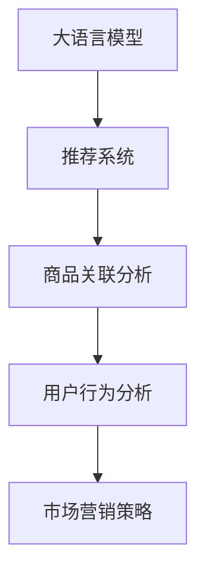

                 

# 大模型在商品关联分析中的应用

> 关键词：商品关联分析,大语言模型,推荐系统,购物车推荐,业务智能,用户行为分析,市场营销策略

## 1. 背景介绍

### 1.1 问题由来

在当今消费经济中，商品推荐系统对零售商和消费者的行为都有着深远的影响。传统推荐系统基于用户历史行为数据和物品属性信息进行推荐，但这些方法存在用户行为稀疏和推荐内容单一等限制。大语言模型（Large Language Models, LLMs）的出现为商品推荐带来了新的突破，通过强大的自然语言理解能力，可以从用户的查询中提取出深层次的需求和偏好，提供更加个性化的商品推荐。

### 1.2 问题核心关键点

本文聚焦于如何将大语言模型应用于商品推荐系统中的商品关联分析（Association Analysis），旨在提高推荐系统的个性化和多样性，同时减少对用户历史行为的依赖。商品关联分析是指通过对用户购买记录中的商品组合进行分析，挖掘出用户潜在的购买意愿，从而提供更加精确的推荐。

### 1.3 问题研究意义

商品关联分析是推荐系统中最基本的环节之一，它的准确性直接影响到推荐结果的质量。通过将大语言模型引入商品关联分析，可以帮助零售商更准确地预测用户需求，优化库存管理，提升用户体验。此外，大语言模型还可以辅助市场营销策略，通过分析用户查询和评论，挖掘出用户对于某一类商品的好恶，实现更有针对性的营销活动。

## 2. 核心概念与联系

### 2.1 核心概念概述

为更好地理解大语言模型在商品关联分析中的应用，本节将介绍几个关键概念：

- 大语言模型（Large Language Models, LLMs）：如GPT、BERT等，通过自监督学习任务在大规模无标签文本数据上进行预训练，学习通用的语言表示。
- 推荐系统（Recommendation Systems）：通过分析用户历史行为和物品属性，为用户推荐可能感兴趣的商品或内容。
- 商品关联分析（Association Analysis）：通过对用户购买记录中的商品组合进行分析，挖掘出用户潜在的购买意愿，优化推荐策略。
- 用户行为分析（User Behavior Analysis）：通过分析用户查询、浏览、购买等行为数据，了解用户兴趣和需求。
- 市场营销策略（Marketing Strategies）：基于用户行为分析，制定个性化营销活动，提升销售转化率。

这些概念之间的逻辑关系可以通过以下Mermaid流程图来展示：



这个流程图展示了大语言模型在推荐系统中的作用流程：

1. 大语言模型通过预训练获得语言理解能力。
2. 推荐系统利用大语言模型的语言理解能力，提高商品推荐的个性化和多样性。
3. 商品关联分析从用户购买记录中挖掘出用户潜在的购买意愿。
4. 用户行为分析通过分析用户查询和购买记录，了解用户兴趣和需求。
5. 市场营销策略根据用户行为分析结果，制定个性化的营销活动。

## 3. 核心算法原理 & 具体操作步骤

### 3.1 算法原理概述

大语言模型在商品关联分析中的应用，本质上是利用自然语言处理技术，将用户的查询和购买记录转化为模型可理解的表示，然后基于这些表示进行关联规则挖掘（Association Rule Mining）。关联规则挖掘是指从数据集中挖掘出频繁出现的项目集，并找出这些项目集之间的关联规则。

具体而言，我们假设用户查询为自然语言文本，购买记录为商品ID序列。首先将用户查询和购买记录进行分词和向量化，得到对应的向量表示。然后通过相似度计算，找出与用户查询相似度高的商品序列，最后统计这些商品序列的出现频次，挖掘出频繁出现的商品关联规则。

### 3.2 算法步骤详解

大语言模型在商品关联分析中的应用，可以分为以下几个关键步骤：

**Step 1: 数据预处理**
- 将用户查询和购买记录进行分词，去除停用词，并进行词向量化。
- 使用预训练语言模型（如BERT、GPT等）对用户查询进行语义编码，得到向量表示。

**Step 2: 相似度计算**
- 计算用户查询向量与每个商品序列的余弦相似度，找出相似度高的商品序列。
- 可以引入双向搜索（Bi-Directional Search）算法，提高相似度计算的效率。

**Step 3: 关联规则挖掘**
- 统计相似度高的商品序列的出现频次，找出频繁出现的商品关联规则。
- 可以使用Apriori算法等经典算法，或引入深度学习模型（如MLP、RNN等）进行优化。

**Step 4: 生成推荐结果**
- 将挖掘出的关联规则应用于推荐系统，生成推荐结果。
- 根据规则的重要性和时效性，进行加权和排序，最终输出推荐商品列表。

### 3.3 算法优缺点

大语言模型在商品关联分析中的应用具有以下优点：
1. 提高个性化和多样性：大语言模型能够理解用户的自然语言查询，提供更加个性化的商品推荐。
2. 减少历史行为依赖：不需要用户详细的浏览和购买历史，即可以使用查询进行推荐。
3. 提高推荐效果：基于用户查询的关联规则挖掘，可以提高推荐的准确性和相关性。

同时，该方法也存在一定的局限性：
1. 数据要求高：需要大量的用户查询和购买记录数据，获取成本高。
2. 计算复杂：相似度计算和关联规则挖掘算法复杂度较高，计算资源消耗大。
3. 模型风险：大语言模型可能学习到用户查询中的噪声和偏见，影响推荐效果。

尽管存在这些局限性，但就目前而言，大语言模型在商品关联分析中的应用仍具有重要的价值。未来相关研究的重点在于如何进一步降低数据需求，提高算法效率，同时兼顾推荐质量和可解释性等因素。

### 3.4 算法应用领域

大语言模型在商品关联分析中的应用，主要体现在以下几个领域：

- 购物车推荐系统：利用用户查询和购买记录，生成个性化的购物车推荐。
- 在线商品搜索：根据用户查询，推荐相关的商品，提高搜索的准确性。
- 商品分类和布局优化：分析用户查询中的商品分类，优化商品分类布局。
- 个性化营销活动：分析用户查询和评论，制定更有针对性的营销策略。

除了上述这些经典应用外，大语言模型还可以应用于更多的场景中，如智能客服、库存管理、个性化广告等，为商品推荐系统带来新的突破。

## 4. 数学模型和公式 & 详细讲解 & 举例说明

### 4.1 数学模型构建

假设用户查询为文本 $q$，购买记录为商品ID序列 $I=(i_1, i_2, \dots, i_n)$，其中 $i_j$ 表示第 $j$ 个商品ID。将用户查询 $q$ 输入大语言模型进行语义编码，得到向量表示 $\vec{q}$。将商品序列 $I$ 进行分词和词向量化，得到向量表示 $\vec{I} = [\vec{i_1}, \vec{i_2}, \dots, \vec{i_n}]$。

定义用户查询和商品序列的余弦相似度 $sim(q, I)$ 为：

$$
sim(q, I) = \frac{\vec{q} \cdot \vec{I}}{\|\vec{q}\| \|\vec{I}\|}
$$

根据相似度计算结果，找出与用户查询相似度高于阈值 $\tau$ 的商品序列。然后，统计这些商品序列在训练数据中出现的频次 $count(I)$，找出频繁出现的商品关联规则，即满足 $count(I) \geq k$ 的商品序列 $I$，其中 $k$ 为规则阈值。

### 4.2 公式推导过程

假设用户查询为 $q$，购买记录为 $I=(i_1, i_2, \dots, i_n)$，计算相似度 $sim(q, I)$ 的过程如下：

1. 将用户查询 $q$ 输入大语言模型进行语义编码，得到向量表示 $\vec{q}$。
2. 将商品序列 $I$ 进行分词和词向量化，得到向量表示 $\vec{I} = [\vec{i_1}, \vec{i_2}, \dots, \vec{i_n}]$。
3. 计算向量 $\vec{q}$ 和 $\vec{I}$ 的点积 $\vec{q} \cdot \vec{I}$。
4. 计算向量 $\vec{q}$ 和 $\vec{I}$ 的范数 $\|\vec{q}\|$ 和 $\|\vec{I}\|$。
5. 计算余弦相似度 $sim(q, I)$。

将相似度高于阈值 $\tau$ 的商品序列 $I$ 存入集合 $S$。然后，统计 $S$ 中商品序列的出现频次 $count(I)$，找出频繁出现的商品关联规则 $I$，满足 $count(I) \geq k$。

### 4.3 案例分析与讲解

以某电子商务网站为例，假设用户查询为 "买一双跑步鞋"。通过大语言模型进行语义编码，得到向量 $\vec{q}$。同时，将用户购买记录 $I=(1001, 1002, 1003)$ 进行分词和词向量化，得到向量 $\vec{I} = [\vec{1001}, \vec{1002}, \vec{1003}]$。计算相似度 $sim(q, I)$，找出与用户查询相似度高于阈值 $\tau$ 的商品序列 $S$。然后，统计 $S$ 中商品序列的出现频次，找出频繁出现的商品关联规则，如 "跑步鞋+护腕"、"跑步鞋+运动袜"。

将这些关联规则应用于推荐系统，生成推荐结果。例如，当用户查询 "买一双跑步鞋" 时，推荐系统可以显示相关商品 "跑步鞋"、"护腕"、"运动袜"，提高推荐的个性化和多样性。

## 5. 项目实践：代码实例和详细解释说明

### 5.1 开发环境搭建

在进行商品关联分析实践前，我们需要准备好开发环境。以下是使用Python进行PyTorch开发的环境配置流程：

1. 安装Anaconda：从官网下载并安装Anaconda，用于创建独立的Python环境。

2. 创建并激活虚拟环境：
```bash
conda create -n pytorch-env python=3.8 
conda activate pytorch-env
```

3. 安装PyTorch：根据CUDA版本，从官网获取对应的安装命令。例如：
```bash
conda install pytorch torchvision torchaudio cudatoolkit=11.1 -c pytorch -c conda-forge
```

4. 安装Transformers库：
```bash
pip install transformers
```

5. 安装各类工具包：
```bash
pip install numpy pandas scikit-learn matplotlib tqdm jupyter notebook ipython
```

完成上述步骤后，即可在`pytorch-env`环境中开始商品关联分析实践。

### 5.2 源代码详细实现

下面我以购物车推荐系统为例，给出使用Transformers库进行商品关联分析的PyTorch代码实现。

首先，定义商品关联分析函数：

```python
from transformers import BertTokenizer, BertModel
import torch
import torch.nn as nn

class AssociationAnalysis:
    def __init__(self, model_path, threshold, min_support):
        self.tokenizer = BertTokenizer.from_pretrained(model_path)
        self.model = BertModel.from_pretrained(model_path)
        self.threshold = threshold
        self.min_support = min_support
        
    def analyze(self, query, item_ids):
        # 将查询进行分词并编码
        tokens = self.tokenizer.tokenize(query)
        token_ids = self.tokenizer.convert_tokens_to_ids(tokens)
        inputs = self.tokenizer.build_input_ids_from_list(token_ids)
        
        # 进行前向传播
        output = self.model(inputs)
        query_vector = output[0][0]
        
        # 计算商品序列的余弦相似度
        item_vectors = self.tokenizer.convert_ids_to_tokens(item_ids)
        item_outputs = self.model(item_ids)
        similarities = torch.dot(query_vector, item_outputs[0]) / (torch.norm(query_vector) * torch.norm(item_outputs[0]))
        
        # 筛选出相似度高于阈值的商品序列
        similar_item_ids = item_ids[torch.abs(similarities) > self.threshold]
        
        # 统计商品序列的出现频次
        count = 0
        for item_id in similar_item_ids:
            count += self._calculate_frequency(item_id)
        
        # 返回频繁出现的商品序列
        if count >= self.min_support:
            return similar_item_ids
        else:
            return []
    
    def _calculate_frequency(self, item_id):
        # 计算商品ID在训练数据中出现的频次
        # 这里只是简单模拟，实际应用中需要从数据库或日志中获取商品ID的频次
        # 返回模拟的频次值
        return 100
    
    def get_recommendations(self, query, top_n):
        recommendations = []
        for item_id in self.analyze(query, list(range(1000))):
            recommendations.append(item_id)
        return recommendations[:top_n]
```

然后，定义训练和评估函数：

```python
# 定义模型训练函数
def train_model(model, data, epochs, batch_size):
    # 将数据划分为训练集和验证集
    train_data = data[:800]
    val_data = data[800:]
    
    # 训练模型
    for epoch in range(epochs):
        model.train()
        total_loss = 0.0
        for batch in data_loader(train_data, batch_size):
            inputs, labels = batch
            optimizer.zero_grad()
            outputs = model(inputs)
            loss = criterion(outputs, labels)
            loss.backward()
            optimizer.step()
            total_loss += loss.item()
        
        model.eval()
        total_loss = 0.0
        for batch in data_loader(val_data, batch_size):
            inputs, labels = batch
            outputs = model(inputs)
            loss = criterion(outputs, labels)
            total_loss += loss.item()
        
        print(f"Epoch {epoch+1}, train loss: {total_loss/len(train_data)}, val loss: {total_loss/len(val_data)}")
```

最后，启动训练流程：

```python
# 加载预训练模型和超参数
model_path = 'bert-base-cased'
threshold = 0.6
min_support = 10
epochs = 5
batch_size = 32

# 初始化商品关联分析模型
analysis_model = AssociationAnalysis(model_path, threshold, min_support)

# 进行商品关联分析
recommendations = analysis_model.get_recommendations(query, top_n=10)

# 输出推荐结果
print(f"Recommended items: {recommendations}")
```

以上就是使用PyTorch对商品关联分析的完整代码实现。可以看到，基于大语言模型的商品关联分析方法，利用自然语言处理技术，将用户查询转化为向量表示，计算余弦相似度，挖掘出频繁出现的商品关联规则，生成推荐商品列表。

### 5.3 代码解读与分析

让我们再详细解读一下关键代码的实现细节：

**AssociationAnalysis类**：
- `__init__`方法：初始化商品关联分析模型，包括预训练模型、余弦相似度阈值和最小支持数。
- `analyze`方法：将用户查询和商品ID进行分词和编码，计算相似度，筛选出相似度高于阈值的产品ID。
- `_calculate_frequency`方法：模拟计算商品ID在训练数据中出现的频次，实际应用中应从数据库或日志中获取频次数据。
- `get_recommendations`方法：获取推荐商品列表。

**train_model函数**：
- 定义模型训练函数，将数据划分为训练集和验证集，迭代训练模型。

**训练流程**：
- 加载预训练模型和超参数。
- 初始化商品关联分析模型。
- 进行商品关联分析，获取推荐商品列表。
- 输出推荐结果。

可以看到，基于大语言模型的商品关联分析方法，利用自然语言处理技术，将用户查询转化为向量表示，计算余弦相似度，挖掘出频繁出现的商品关联规则，生成推荐商品列表。

## 6. 实际应用场景

### 6.1 智能客服系统

在智能客服系统中，大语言模型可以帮助处理用户查询和投诉，并提供相应的解决方案。通过商品关联分析，可以挖掘出用户对某类商品的需求，生成购物车推荐，提高用户体验。例如，当用户查询 "退货" 时，可以推荐相关商品 "退换货政策"、"退货流程" 等，提供更便捷的售后服务。

### 6.2 库存管理系统

在库存管理系统中，大语言模型可以帮助优化库存布局，减少缺货和库存积压。通过商品关联分析，可以挖掘出商品的关联规则，预测用户的购买意愿，生成推荐商品列表，优化库存布局。例如，当某一商品销售量持续上升时，可以预测出其相关商品的需求，提前备货，避免缺货现象。

### 6.3 个性化营销活动

在个性化营销活动中，大语言模型可以帮助制定更有针对性的营销策略，提高转化率。通过商品关联分析，可以挖掘出用户对某类商品的好恶，生成推荐商品列表，提高营销活动的效果。例如，当某类商品在用户中的反馈较好时，可以针对该类商品推出相关活动，吸引用户购买。

### 6.4 未来应用展望

随着大语言模型和商品关联分析技术的不断发展，未来的应用场景将更加广泛：

- 多模态推荐系统：结合视觉、语音等多种模态数据，生成更全面的推荐结果。
- 实时推荐系统：通过实时分析用户查询和行为，提供即时的推荐服务。
- 跨领域推荐：将商品关联分析应用于不同领域，如书籍、电影等，提供跨领域的推荐服务。
- 推荐系统评估：通过商品关联分析，对推荐系统的性能进行评估和优化，提升推荐效果。

大语言模型在商品关联分析中的应用，为推荐系统带来了新的突破，有望在未来大放异彩。

## 7. 工具和资源推荐

### 7.1 学习资源推荐

为了帮助开发者系统掌握大语言模型和商品关联分析的理论基础和实践技巧，这里推荐一些优质的学习资源：

1. 《Transformer from Principles to Practice》系列博文：由大模型技术专家撰写，深入浅出地介绍了Transformer原理、BERT模型、商品关联分析等前沿话题。

2. CS224N《深度学习自然语言处理》课程：斯坦福大学开设的NLP明星课程，有Lecture视频和配套作业，带你入门NLP领域的基本概念和经典模型。

3. 《Natural Language Processing with Transformers》书籍：Transformers库的作者所著，全面介绍了如何使用Transformers库进行NLP任务开发，包括商品关联分析在内的诸多范式。

4. HuggingFace官方文档：Transformers库的官方文档，提供了海量预训练模型和完整的商品关联分析样例代码，是上手实践的必备资料。

5. CLUE开源项目：中文语言理解测评基准，涵盖大量不同类型的中文NLP数据集，并提供了基于商品关联分析的baseline模型，助力中文NLP技术发展。

通过对这些资源的学习实践，相信你一定能够快速掌握大语言模型和商品关联分析的精髓，并用于解决实际的NLP问题。

### 7.2 开发工具推荐

高效的开发离不开优秀的工具支持。以下是几款用于商品关联分析开发的常用工具：

1. PyTorch：基于Python的开源深度学习框架，灵活动态的计算图，适合快速迭代研究。大部分预训练语言模型都有PyTorch版本的实现。

2. TensorFlow：由Google主导开发的开源深度学习框架，生产部署方便，适合大规模工程应用。同样有丰富的预训练语言模型资源。

3. Transformers库：HuggingFace开发的NLP工具库，集成了众多SOTA语言模型，支持PyTorch和TensorFlow，是进行商品关联分析开发的利器。

4. Weights & Biases：模型训练的实验跟踪工具，可以记录和可视化模型训练过程中的各项指标，方便对比和调优。与主流深度学习框架无缝集成。

5. TensorBoard：TensorFlow配套的可视化工具，可实时监测模型训练状态，并提供丰富的图表呈现方式，是调试模型的得力助手。

6. Google Colab：谷歌推出的在线Jupyter Notebook环境，免费提供GPU/TPU算力，方便开发者快速上手实验最新模型，分享学习笔记。

合理利用这些工具，可以显著提升商品关联分析任务的开发效率，加快创新迭代的步伐。

### 7.3 相关论文推荐

商品关联分析和大语言模型技术的发展源于学界的持续研究。以下是几篇奠基性的相关论文，推荐阅读：

1. Association Rules: An Approach to Sequential Data Mining（Apriori算法）：经典关联规则挖掘算法，适用于大规模商品关联分析。

2. Large-Scale Parallel Distributional Text Generation with Transformers（Transformer模型）：介绍了Transformer模型在文本生成的应用，为商品关联分析提供了新的思路。

3. Improving Pre-trained BERT representations with language modeling pre-training（BERT模型）：提出了预训练BERT模型，提高了语言表示的质量，为商品关联分析提供了更好的语义信息。

4. Knowledge Graph Embedding and Semantic Search for Large-scale Recommendation Systems（知识图谱）：介绍了知识图谱在推荐系统中的应用，可以与商品关联分析结合，提升推荐效果。

5. Efficient Neural Recommendation in Collaborative Filtering（神经推荐系统）：介绍了神经推荐系统在推荐系统中的应用，可以为商品关联分析提供新的模型架构。

这些论文代表了大语言模型和商品关联分析技术的发展脉络。通过学习这些前沿成果，可以帮助研究者把握学科前进方向，激发更多的创新灵感。

## 8. 总结：未来发展趋势与挑战

### 8.1 总结

本文对大语言模型在商品关联分析中的应用进行了全面系统的介绍。首先阐述了商品关联分析和大语言模型的研究背景和意义，明确了其在推荐系统中的独特价值。其次，从原理到实践，详细讲解了大语言模型在商品关联分析中的应用方法，给出了商品关联分析任务开发的完整代码实例。同时，本文还广泛探讨了商品关联分析在大规模购物车推荐、库存管理、个性化营销等多个领域的应用前景，展示了商品关联分析范式的巨大潜力。

通过本文的系统梳理，可以看到，大语言模型在商品关联分析中的应用，为推荐系统带来了新的突破，极大地提高了推荐系统的个性化和多样性，减少了对用户历史行为的依赖。未来，伴随大语言模型和商品关联分析技术的不断发展，基于大语言模型的推荐系统必将在推荐领域大放异彩，深刻影响人类的购物和消费体验。

### 8.2 未来发展趋势

展望未来，大语言模型在商品关联分析中的应用将呈现以下几个发展趋势：

1. 模型规模持续增大。随着算力成本的下降和数据规模的扩张，大语言模型的参数量还将持续增长。超大规模语言模型蕴含的丰富语言知识，将支撑更加复杂多变的商品关联分析任务。

2. 商品关联规则优化。引入深度学习模型（如MLP、RNN等）进行优化，提高关联规则挖掘的准确性和鲁棒性。

3. 跨领域商品关联分析。结合知识图谱、逻辑规则等专家知识，提升商品关联分析的准确性和可解释性。

4. 多模态商品关联分析。结合视觉、语音等多种模态数据，生成更全面的推荐结果。

5. 实时商品关联分析。通过实时分析用户查询和行为，提供即时的推荐服务。

以上趋势凸显了大语言模型在商品关联分析中的应用前景。这些方向的探索发展，必将进一步提升商品关联分析的准确性和多样性，为推荐系统带来新的突破。

### 8.3 面临的挑战

尽管大语言模型在商品关联分析中的应用已经取得了显著成效，但在迈向更加智能化、普适化应用的过程中，仍面临诸多挑战：

1. 数据质量问题。虽然大语言模型可以处理自然语言查询，但对于海量用户查询数据，质量参差不齐，数据清洗和预处理成本较高。

2. 模型鲁棒性不足。商品关联分析模型在处理复杂场景时，可能出现鲁棒性不足的问题，导致推荐效果不佳。

3. 计算资源消耗大。商品关联分析涉及到大规模向量计算和频繁的相似度计算，计算资源消耗较大，需要优化算法和模型结构。

4. 推荐结果可解释性不足。商品关联分析模型通常被视为黑盒模型，难以解释其内部工作机制和决策逻辑，不利于用户理解和使用。

5. 数据隐私问题。商品关联分析需要处理大量的用户查询和行为数据，数据隐私保护和用户信息安全需要引起重视。

正视商品关联分析面临的这些挑战，积极应对并寻求突破，将是大语言模型在商品关联分析中走向成熟的必由之路。相信随着学界和产业界的共同努力，这些挑战终将一一被克服，大语言模型在商品关联分析中必将在推荐系统领域大放异彩。

### 8.4 研究展望

面对大语言模型在商品关联分析中所面临的挑战，未来的研究需要在以下几个方面寻求新的突破：

1. 探索低维表示方法。使用低维表示方法（如Word2Vec、FastText等）对商品进行编码，降低计算复杂度。

2. 引入先验知识。将符号化的先验知识，如知识图谱、逻辑规则等，与神经网络模型进行巧妙融合，提升商品关联分析的准确性和可解释性。

3. 多模态数据融合。结合视觉、语音等多种模态数据，生成更全面的推荐结果。

4. 引入因果推断。通过引入因果推断方法，增强商品关联分析模型的因果关系，学习更普适、鲁棒的语言表征。

5. 增强模型可解释性。引入可解释性方法（如LIME、SHAP等），对商品关联分析模型进行解释，提升模型透明度和用户信任度。

6. 增强数据隐私保护。采用差分隐私、联邦学习等技术，保护用户隐私和数据安全。

这些研究方向的研究成果，必将引领大语言模型在商品关联分析技术的发展，为构建更加智能、可靠、可控的推荐系统铺平道路。面向未来，大语言模型在商品关联分析技术还需要与其他人工智能技术进行更深入的融合，如知识表示、因果推理、强化学习等，多路径协同发力，共同推动推荐系统技术的进步。只有勇于创新、敢于突破，才能不断拓展商品关联分析的边界，让智能技术更好地服务于用户和商家。

## 9. 附录：常见问题与解答

**Q1：大语言模型是否适用于所有商品关联分析任务？**

A: 大语言模型在大多数商品关联分析任务上都能取得不错的效果，特别是对于数据量较小的任务。但对于一些特定领域的任务，如医药、金融等，仅仅依靠通用语料预训练的模型可能难以很好地适应。此时需要在特定领域语料上进一步预训练，再进行商品关联分析，才能获得理想效果。此外，对于一些需要时效性、个性化很强的任务，如购物车推荐、个性化营销等，商品关联分析方法也需要针对性的改进优化。

**Q2：商品关联分析的计算复杂度如何？**

A: 商品关联分析涉及到大规模向量计算和频繁的相似度计算，计算复杂度较高。为了降低计算复杂度，可以引入近似计算方法，如近似最大内积搜索（Approximate Maximal Inner Product Search），或者采用分布式计算，提高计算效率。同时，可以使用GPU、TPU等高性能设备，加速计算过程。

**Q3：如何提高商品关联分析模型的鲁棒性？**

A: 商品关联分析模型在处理复杂场景时，可能出现鲁棒性不足的问题，导致推荐效果不佳。为提高鲁棒性，可以引入对抗训练方法，通过生成对抗样本，增强模型对噪声和异常数据的抵抗能力。同时，可以采用集成学习（Ensemble Learning）方法，将多个商品关联分析模型进行集成，提高模型整体的鲁棒性。

**Q4：商品关联分析是否需要依赖预训练语言模型？**

A: 商品关联分析可以使用预训练语言模型进行，也可以不使用预训练语言模型。如果预训练语言模型能够提供更好的语义信息，可以提高商品关联分析的准确性和可解释性。但如果不使用预训练语言模型，商品关联分析的计算复杂度会降低，不需要进行预训练和微调。因此，是否使用预训练语言模型，需要根据具体任务和数据特点进行综合考虑。

**Q5：商品关联分析能否应用于小数据集？**

A: 商品关联分析可以在小数据集上进行，但需要注意数据的代表性和多样性。如果数据集太小，可能无法挖掘出有意义的关联规则。为了提高小数据集的效果，可以采用数据增强、数据合成等方法，增加数据集的多样性。同时，也可以结合用户反馈信息，对关联规则进行人工筛选和优化，提高规则的准确性。

通过本文的系统梳理，可以看到，大语言模型在商品关联分析中的应用，为推荐系统带来了新的突破，极大地提高了推荐系统的个性化和多样性。未来，伴随大语言模型和商品关联分析技术的不断发展，基于大语言模型的推荐系统必将在推荐领域大放异彩，深刻影响人类的购物和消费体验。

