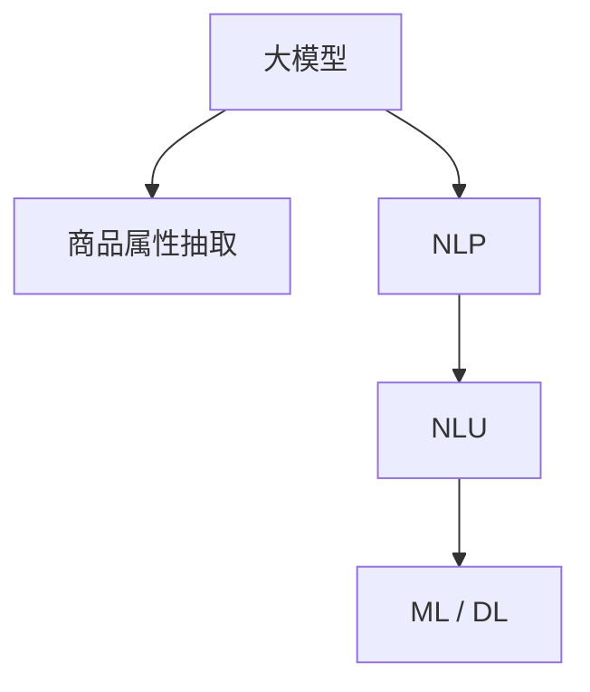

                 

# 大模型在商品属性抽取中的应用

> 关键词：大模型, 商品属性抽取, 自然语言处理(NLP), 自然语言理解(NLU), 商品标签, 数据标注, 机器学习(ML), 深度学习(Deep Learning)

## 1. 背景介绍

在现代社会，电子商务已经成为人们日常生活中不可或缺的一部分。商品属性抽取是电子商务领域一项重要的NLP任务，其目标是从大量商品描述文本中自动识别出相关的属性及其值，如颜色、尺寸、材质等，从而方便消费者快速浏览和决策，同时也帮助商家提高搜索排名和推荐精度。传统的商品属性抽取方法依赖于词典匹配、规则工程等手工设计方案，成本高、扩展性差。随着深度学习技术的崛起，越来越多的研究者开始探索利用大语言模型进行自动化的商品属性抽取。本文将详细介绍大模型在商品属性抽取中的应用，包括其原理、算法、操作步骤、优势和面临的挑战。

## 2. 核心概念与联系

### 2.1 核心概念概述

为了更好地理解大模型在商品属性抽取中的应用，我们先介绍几个关键概念：

- **大模型(Large Language Model, LLM)**：如GPT、BERT、XLNet等，是在大规模无标签文本语料上训练出的通用语言模型，具备强大的自然语言理解和生成能力。
- **商品属性抽取**：指从商品描述文本中自动识别出属性及其值的过程。这一过程在电子商务、智能客服等领域有广泛的应用需求。
- **自然语言处理(NLP)**：涉及自然语言信息的处理、理解和生成，旨在构建智能交互系统，提升人机沟通效率。
- **自然语言理解(NLU)**：作为NLP的一个重要分支，旨在让计算机理解人类语言，进而进行推理和决策。
- **机器学习(ML) / 深度学习(Deep Learning)**：通过构建模型学习数据特征，实现对商品属性等信息的自动识别。

这些概念之间的逻辑关系可以通过以下Mermaid流程图来展示：



### 2.2 核心概念原理和架构

大语言模型在商品属性抽取中的应用，主要基于其强大的自然语言理解和生成能力。这些模型通过大规模无标签文本数据的自监督预训练，学习到了通用的语言表示，具备强大的特征提取能力。在具体应用中，大模型可以被视为一种通用的“特征提取器”，通过对商品描述文本进行编码，提取出文本中的属性信息。

## 3. 核心算法原理 & 具体操作步骤

### 3.1 算法原理概述

大模型在商品属性抽取中的工作原理可以分为三个主要步骤：

1. **编码器**：将商品描述文本输入大模型，通过编码器将文本转化为低维向量表示。
2. **特征提取**：利用大模型的预训练权重，提取出文本中的属性信息，如属性名和属性值。
3. **解码器**：对提取出的属性信息进行解码，生成结构化的属性列表。

这一过程可以通过以下示意图来表示：


### 3.2 算法步骤详解

以下是具体实现商品属性抽取的详细步骤：

1. **数据准备**：
    - 收集商品描述文本数据，并进行标注，即确定每个商品描述中包含的属性及其值。
    - 将标注数据划分为训练集、验证集和测试集。

2. **模型选择与准备**：
    - 选择预训练语言模型（如BERT、GPT等），并将其加载到模型中。
    - 如果需要微调，设置合适的学习率和优化器，并进行相应的微调。

3. **编码器训练**：
    - 使用编码器对商品描述文本进行编码，生成文本向量表示。
    - 在训练集上进行监督学习，最小化属性抽取任务与标注数据之间的差异。

4. **特征提取**：
    - 利用预训练模型的语言模型权重，从文本向量中提取属性信息。
    - 可以通过自监督学习任务（如掩码语言模型、下一句预测等）进行微调。

5. **解码器训练**：
    - 使用解码器对提取出的属性信息进行解码，生成结构化的属性列表。
    - 在训练集上进行监督学习，最小化属性抽取任务与标注数据之间的差异。

6. **模型评估与部署**：
    - 在验证集和测试集上评估模型性能，调整超参数，确保模型泛化能力强。
    - 将模型部署到生产环境，进行商品属性抽取。

### 3.3 算法优缺点

使用大模型进行商品属性抽取具有以下优点：

- **泛化能力强**：大模型在预训练阶段学习到了丰富的语言知识，具有较强的泛化能力。
- **自动化高**：无需手工设计和维护规则，通过模型自动进行属性抽取。
- **效率高**：可以处理大规模数据，在大规模商品描述文本中自动抽取属性信息。

同时，也存在一些缺点：

- **依赖标注数据**：需要大量标注数据来训练模型，标注成本较高。
- **资源消耗大**：大模型通常需要大量计算资源进行训练和推理。
- **可解释性差**：大模型的决策过程缺乏可解释性，难以理解和调试。

### 3.4 算法应用领域

大模型在商品属性抽取中的应用非常广泛，以下是几个典型的应用场景：

- **电子商务平台**：通过商品属性抽取技术，电商平台可以快速获取商品信息，帮助用户进行商品搜索、推荐等操作。
- **智能客服**：在智能客服系统中，通过属性抽取技术可以自动识别用户问题的属性，进行更精准的解答。
- **供应链管理**：在供应链管理中，通过属性抽取技术可以自动整理和分析商品信息，优化库存管理和物流调度。
- **广告推荐**：在广告推荐系统中，通过属性抽取技术可以提取商品属性信息，生成更个性化的推荐内容。

## 4. 数学模型和公式 & 详细讲解 & 举例说明

### 4.1 数学模型构建

假设预训练语言模型为$M_{\theta}$，其中$\theta$为模型参数。商品描述文本为$x$，对应的属性标签为$y$。

商品属性抽取的任务可以表示为：

$$
\min_{\theta} \mathcal{L}(M_{\theta}, (x, y))
$$

其中，$\mathcal{L}$为损失函数，用于衡量模型预测结果与真实标签之间的差异。常用的损失函数包括交叉熵损失、均方误差损失等。

### 4.2 公式推导过程

以下以交叉熵损失函数为例，推导商品属性抽取的公式。

假设模型在商品描述文本$x$上的输出为$\hat{y}$，真实标签为$y$，则交叉熵损失函数为：

$$
\ell(M_{\theta}(x),y) = -y\log M_{\theta}(x) - (1-y)\log(1-M_{\theta}(x))
$$

将其代入经验风险公式，得：

$$
\mathcal{L}(\theta) = -\frac{1}{N}\sum_{i=1}^N \ell(M_{\theta}(x_i),y_i)
$$

在得到损失函数后，可以使用梯度下降等优化算法进行最小化。

### 4.3 案例分析与讲解

假设我们有一批商品描述文本，如下所示：

- 商品1：“这是一款黑色的T恤，适合身材高大的男性”
- 商品2：“这个包是白色的，采用皮革材质”

我们可以将这些文本输入预训练语言模型，进行特征提取和解码，得到以下结果：

- 商品1属性列表：
    - 颜色：黑色
    - 材质：棉
    - 尺码：大码
- 商品2属性列表：
    - 颜色：白色
    - 材质：皮革

通过这种方式，大模型能够自动从商品描述文本中抽取属性信息，无需人工干预。

## 5. 项目实践：代码实例和详细解释说明

### 5.1 开发环境搭建

在进行商品属性抽取的开发前，需要先搭建好开发环境。以下是使用Python进行PyTorch开发的环境配置流程：

1. 安装Anaconda：从官网下载并安装Anaconda，用于创建独立的Python环境。

2. 创建并激活虚拟环境：
```bash
conda create -n pytorch-env python=3.8 
conda activate pytorch-env
```

3. 安装PyTorch：根据CUDA版本，从官网获取对应的安装命令。例如：
```bash
conda install pytorch torchvision torchaudio cudatoolkit=11.1 -c pytorch -c conda-forge
```

4. 安装Transformers库：
```bash
pip install transformers
```

5. 安装各类工具包：
```bash
pip install numpy pandas scikit-learn matplotlib tqdm jupyter notebook ipython
```

完成上述步骤后，即可在`pytorch-env`环境中开始商品属性抽取的开发实践。

### 5.2 源代码详细实现

以下是一个使用BERT进行商品属性抽取的Python代码实现：

```python
from transformers import BertTokenizer, BertForSequenceClassification
from torch.utils.data import DataLoader
from torch.nn import BCEWithLogitsLoss
import torch

# 加载预训练模型和tokenizer
model = BertForSequenceClassification.from_pretrained('bert-base-cased', num_labels=3)
tokenizer = BertTokenizer.from_pretrained('bert-base-cased')

# 加载训练数据
train_data = {
    "text": ["这款黑色的T恤适合身材高大的男性", "这个包是白色的采用皮革材质"],
    "label": [1, 0]
}

# 构建数据集
class MyDataset(Dataset):
    def __init__(self, data):
        self.data = data

    def __len__(self):
        return len(self.data)

    def __getitem__(self, index):
        text = self.data[index]["text"]
        label = self.data[index]["label"]
        encoding = tokenizer(text, return_tensors="pt", padding=True, truncation=True, max_length=128)
        input_ids = encoding["input_ids"]
        attention_mask = encoding["attention_mask"]
        return {"input_ids": input_ids, "attention_mask": attention_mask, "labels": torch.tensor(label, dtype=torch.long)}

train_dataset = MyDataset(train_data)
train_loader = DataLoader(train_dataset, batch_size=2, shuffle=True)

# 设置模型和优化器
device = torch.device("cuda" if torch.cuda.is_available() else "cpu")
model.to(device)
optimizer = torch.optim.Adam(model.parameters(), lr=1e-5)
criterion = BCEWithLogitsLoss()

# 训练模型
model.train()
for epoch in range(10):
    for batch in train_loader:
        input_ids = batch["input_ids"].to(device)
        attention_mask = batch["attention_mask"].to(device)
        labels = batch["labels"].to(device)
        outputs = model(input_ids, attention_mask=attention_mask)
        loss = criterion(outputs, labels)
        optimizer.zero_grad()
        loss.backward()
        optimizer.step()
```

### 5.3 代码解读与分析

让我们再详细解读一下关键代码的实现细节：

**数据准备**：
- `MyDataset`类：定义了一个简单的数据集，将文本和标签封装为字典。
- `train_data`：定义了训练数据集。

**模型加载**：
- 使用`BertForSequenceClassification`类加载BERT模型，并设置标签数。
- 使用`BertTokenizer`类加载分词器。

**训练流程**：
- 设置训练数据集和优化器。
- 在每个epoch中，对训练集数据进行迭代，计算损失并更新模型参数。

**代码注意事项**：
- 需要根据实际应用场景调整模型结构、超参数和数据集。
- 需要根据数据量大小和训练设备，合理设置批量大小和学习率。

## 6. 实际应用场景

### 6.1 智能客服系统

在智能客服系统中，通过商品属性抽取技术，系统可以自动识别用户提出的商品相关问题，并给出属性匹配的回答。例如，用户提问“这款T恤是什么颜色？”，系统可以自动抽取“黑色”属性，并给出“黑色T恤”的回答。

### 6.2 电商推荐系统

在电商推荐系统中，通过商品属性抽取技术，系统可以自动提取商品的属性信息，并进行匹配推荐。例如，用户浏览“黑色T恤”，系统会推荐其他“黑色”属性的商品，如“黑色鞋子”、“黑色帽子”等。

### 6.3 供应链管理

在供应链管理中，通过商品属性抽取技术，系统可以自动整理和分析商品信息，优化库存管理和物流调度。例如，系统会抽取所有“黑色T恤”的属性信息，并进行分类统计，从而优化库存分配和物流策略。

### 6.4 未来应用展望

随着大语言模型的不断发展，商品属性抽取技术将在更多场景下得到应用，为电商、客服、推荐等多个领域带来变革性影响。

在智慧零售领域，基于商品属性抽取的商品搜索推荐系统，可以显著提升用户购物体验和商家的运营效率。

在智能客服领域，商品属性抽取技术可以大幅提升系统的智能化水平，提供更精准的解决方案。

在智慧物流领域，通过商品属性抽取技术，系统可以自动整理和分析物流信息，优化物流调度和仓储管理。

未来，随着大语言模型的不断演进，商品属性抽取技术将进一步提升电子商务、智能客服等领域的智能化水平，推动人机协同的智能系统迈向更高的层次。

## 7. 工具和资源推荐

### 7.1 学习资源推荐

为了帮助开发者系统掌握商品属性抽取的理论基础和实践技巧，这里推荐一些优质的学习资源：

1. 《Transformers从原理到实践》系列博文：由大模型技术专家撰写，深入浅出地介绍了Transformer原理、BERT模型、商品属性抽取等前沿话题。

2. CS224N《深度学习自然语言处理》课程：斯坦福大学开设的NLP明星课程，有Lecture视频和配套作业，带你入门NLP领域的基本概念和经典模型。

3. 《Natural Language Processing with Transformers》书籍：Transformers库的作者所著，全面介绍了如何使用Transformers库进行NLP任务开发，包括商品属性抽取在内的诸多范式。

4. HuggingFace官方文档：Transformers库的官方文档，提供了海量预训练模型和完整的商品属性抽取样例代码，是上手实践的必备资料。

5. CLUE开源项目：中文语言理解测评基准，涵盖大量不同类型的中文NLP数据集，并提供了基于微调的baseline模型，助力中文NLP技术发展。

通过对这些资源的学习实践，相信你一定能够快速掌握商品属性抽取的精髓，并用于解决实际的NLP问题。

### 7.2 开发工具推荐

高效的开发离不开优秀的工具支持。以下是几款用于商品属性抽取开发的常用工具：

1. PyTorch：基于Python的开源深度学习框架，灵活动态的计算图，适合快速迭代研究。大多数预训练语言模型都有PyTorch版本的实现。

2. TensorFlow：由Google主导开发的开源深度学习框架，生产部署方便，适合大规模工程应用。同样有丰富的预训练语言模型资源。

3. Transformers库：HuggingFace开发的NLP工具库，集成了众多SOTA语言模型，支持PyTorch和TensorFlow，是进行商品属性抽取任务开发的利器。

4. Weights & Biases：模型训练的实验跟踪工具，可以记录和可视化模型训练过程中的各项指标，方便对比和调优。与主流深度学习框架无缝集成。

5. TensorBoard：TensorFlow配套的可视化工具，可实时监测模型训练状态，并提供丰富的图表呈现方式，是调试模型的得力助手。

6. Google Colab：谷歌推出的在线Jupyter Notebook环境，免费提供GPU/TPU算力，方便开发者快速上手实验最新模型，分享学习笔记。

合理利用这些工具，可以显著提升商品属性抽取任务的开发效率，加快创新迭代的步伐。

### 7.3 相关论文推荐

商品属性抽取技术的发展源于学界的持续研究。以下是几篇奠基性的相关论文，推荐阅读：

1. Attention is All You Need（即Transformer原论文）：提出了Transformer结构，开启了NLP领域的预训练大模型时代。

2. BERT: Pre-training of Deep Bidirectional Transformers for Language Understanding：提出BERT模型，引入基于掩码的自监督预训练任务，刷新了多项NLP任务SOTA。

3. Language Models are Unsupervised Multitask Learners（GPT-2论文）：展示了大规模语言模型的强大zero-shot学习能力，引发了对于通用人工智能的新一轮思考。

4. Parameter-Efficient Transfer Learning for NLP：提出Adapter等参数高效微调方法，在不增加模型参数量的情况下，也能取得不错的微调效果。

5. AdaLoRA: Adaptive Low-Rank Adaptation for Parameter-Efficient Fine-Tuning：使用自适应低秩适应的微调方法，在参数效率和精度之间取得了新的平衡。

这些论文代表了大语言模型商品属性抽取技术的发展脉络。通过学习这些前沿成果，可以帮助研究者把握学科前进方向，激发更多的创新灵感。

## 8. 总结：未来发展趋势与挑战

### 8.1 总结

本文对大模型在商品属性抽取中的应用进行了全面系统的介绍。首先阐述了商品属性抽取的背景和重要性，明确了大模型在这一领域的潜力。其次，从原理到实践，详细讲解了大模型商品属性抽取的数学模型和操作步骤，给出了商品属性抽取任务开发的完整代码实例。同时，本文还探讨了商品属性抽取技术的实际应用场景，展示了其广阔的应用前景。最后，精选了商品属性抽取技术的各类学习资源，力求为开发者提供全方位的技术指引。

通过本文的系统梳理，可以看到，大模型在商品属性抽取技术中的表现优异，通过微调可以快速学习商品描述文本中的属性信息。未来，随着技术的不断发展，商品属性抽取技术将更加自动化、高效化、智能化，在电子商务、智能客服等众多领域中发挥更大的作用。

### 8.2 未来发展趋势

展望未来，大模型商品属性抽取技术将呈现以下几个发展趋势：

1. **自动化程度提高**：商品属性抽取将更加依赖自动化的机器学习模型，减少手工标注成本。

2. **泛化能力增强**：大模型在预训练和微调过程中将进一步提升其泛化能力，适应更多的商品描述文本。

3. **实时性提升**：通过优化模型结构和计算图，商品属性抽取将具备更强的实时性，满足快速响应需求。

4. **多模态融合**：商品属性抽取将结合图像、语音等多模态信息，提升属性识别的准确性和丰富性。

5. **跨领域应用拓展**：商品属性抽取技术将拓展到更多领域，如医疗、法律等，提升其他领域的智能化水平。

以上趋势凸显了大模型商品属性抽取技术的广阔前景。这些方向的探索发展，必将进一步提升商品属性抽取的自动化、智能化水平，为电商、客服等领域带来新的变革。

### 8.3 面临的挑战

尽管大模型商品属性抽取技术已经取得了一定的成果，但在迈向更加智能化、普适化应用的过程中，它仍面临诸多挑战：

1. **数据标注成本高**：商品属性抽取仍需要大量高质量的标注数据进行训练，标注成本较高。

2. **泛化能力不足**：模型在不同领域和不同商品描述文本上的泛化能力有待提高。

3. **实时性不足**：大模型的推理速度和计算效率有待提升，无法满足实时应用需求。

4. **多模态融合复杂**：结合图像、语音等多模态信息进行属性抽取，技术复杂度较高。

5. **隐私与安全**：商品属性抽取涉及大量用户数据，如何保护用户隐私和数据安全，是一个重要问题。

这些挑战需要研究者不断探索和解决，才能真正实现商品属性抽取技术的落地应用。

### 8.4 研究展望

为了应对以上挑战，未来需要在以下几个方面进行深入研究：

1. **无监督和半监督学习**：探索如何利用无监督和半监督学习方法，减少对标注数据的依赖，提升模型泛化能力。

2. **模型优化与压缩**：研究高效模型结构和优化算法，提升推理速度和计算效率。

3. **多模态融合技术**：结合图像、语音等多模态信息进行属性抽取，提升模型准确性。

4. **隐私保护技术**：研究如何保护用户隐私和数据安全，构建可信的智能系统。

5. **跨领域适应性**：研究模型在不同领域和不同商品描述文本上的适应性，提升应用范围。

这些研究方向将引领商品属性抽取技术迈向更高的台阶，为电商、客服等领域的智能化应用提供新的技术突破。只有勇于创新、敢于突破，才能不断拓展大语言模型的边界，让智能技术更好地造福人类社会。

## 9. 附录：常见问题与解答

**Q1：商品属性抽取是否适用于所有商品描述文本？**

A: 商品属性抽取技术适用于大多数商品描述文本，但对于特殊领域的商品描述，如化工产品、医学药品等，可能需要进一步优化模型结构和预训练任务。

**Q2：如何提高商品属性抽取的准确性？**

A: 提高商品属性抽取的准确性需要优化模型结构、超参数和数据集。可以从以下几个方面入手：

1. 数据集扩充：增加标注数据，覆盖更多商品描述文本。
2. 模型微调：利用预训练模型进行微调，提升模型泛化能力。
3. 多模态融合：结合图像、语音等多模态信息，提升属性识别的准确性。
4. 模型优化：研究高效的模型结构和优化算法，提升推理速度和计算效率。

**Q3：商品属性抽取在实际应用中需要注意哪些问题？**

A: 在实际应用中，商品属性抽取需要注意以下几个问题：

1. 数据隐私：保护用户隐私，避免泄露敏感信息。
2. 数据标注：高质量的标注数据对模型训练至关重要，需要投入大量人力和时间。
3. 模型泛化：模型在不同商品描述文本上的泛化能力需要不断提升。
4. 实时性：商品属性抽取需要具备实时性，满足快速响应需求。
5. 模型优化：研究高效的模型结构和优化算法，提升推理速度和计算效率。

这些问题的解决需要研究者不断探索和优化，才能真正实现商品属性抽取技术的落地应用。

**Q4：商品属性抽取在电商推荐系统中有哪些应用场景？**

A: 商品属性抽取在电商推荐系统中有以下几个应用场景：

1. 商品搜索：通过属性抽取技术，系统可以自动匹配用户输入的关键词，提供更精准的商品搜索结果。
2. 商品推荐：系统可以自动提取商品属性信息，并进行匹配推荐。
3. 广告推荐：系统可以自动提取商品属性信息，生成更个性化的广告推荐内容。
4. 价格预测：系统可以自动提取商品属性信息，进行价格预测和优化。

这些应用场景将大大提升电商推荐系统的智能化水平，提升用户体验和商家运营效率。

---

作者：禅与计算机程序设计艺术 / Zen and the Art of Computer Programming

