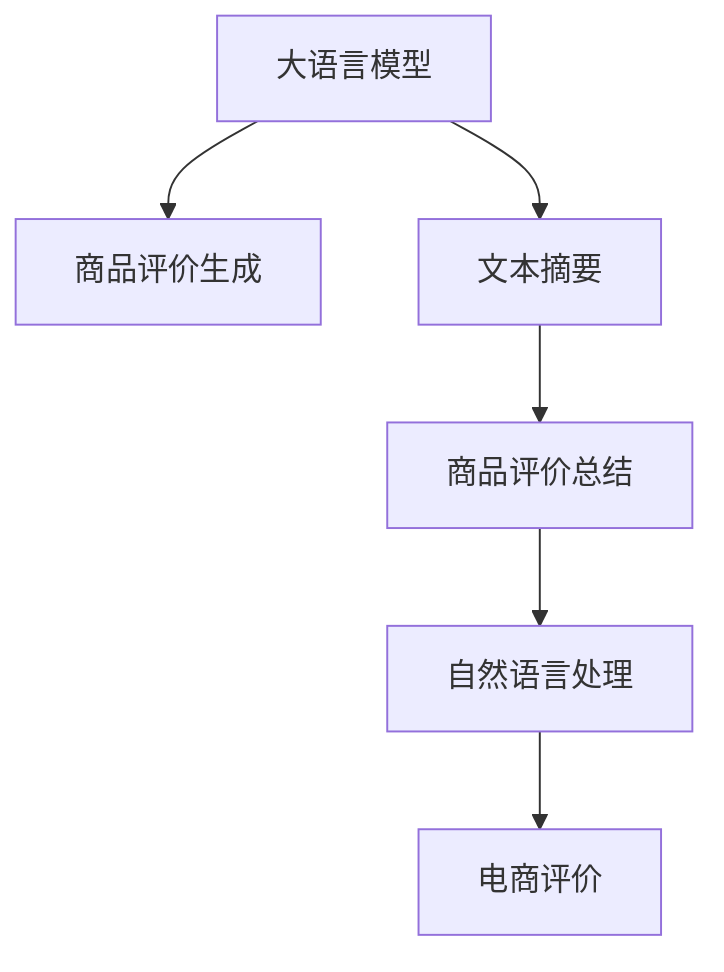

                 

# 大模型在商品评价生成与总结中的应用

> 关键词：大模型,商品评价,生成式建模,文本摘要,自然语言处理(NLP),GPT-3

## 1. 背景介绍

在数字化时代的背景下，电子商务日益成为消费者购买商品的主要渠道。然而，如何在海量的商品信息中快速找到合适的商品，成为了一个重要挑战。商品评价作为消费者对于商品的直接反馈，具有极高的参考价值。为了更好地利用商品评价数据，商家、消费者和研究者们一直在探索各种方法。大语言模型作为近年来的热门技术，在商品评价生成与总结等方面也展现出了巨大的潜力。

本文将详细探讨大模型在商品评价生成与总结中的应用，包括基于生成式建模的商品评价生成、基于文本摘要的商品评价总结等方面。通过结合具体案例和代码实现，希望能为电商领域的实际应用提供有益的参考。

## 2. 核心概念与联系

为了更好地理解大模型在商品评价生成与总结中的应用，首先需要介绍一些核心概念及其之间的关系。

- **大语言模型(Large Language Models, LLM)**：如GPT-3，基于深度学习，具有强大的自然语言处理能力，能够理解和生成自然语言文本。
- **生成式建模(Generative Modeling)**：通过深度学习模型生成新的文本数据，如基于GPT-3的商品评价生成。
- **文本摘要(Text Summarization)**：从长篇文本中提取出关键信息，生成简洁的摘要，如基于BERT的文本摘要模型。
- **自然语言处理(Natural Language Processing, NLP)**：涉及语言理解与生成的多领域技术，包括文本分类、命名实体识别、情感分析等，商品评价生成与总结是其重要应用之一。
- **电商评价**：指用户在购买商品后对商品进行的书评、评价等反馈信息，对商品推荐、决策支持具有重要价值。

这些概念之间的关系通过以下Mermaid流程图表示：



这个流程图展示了核心概念之间的逻辑联系：大语言模型在商品评价生成中发挥生成式建模能力；文本摘要技术用于生成商品评价的总结；自然语言处理技术支持评价的分类、情感分析等；而电商评价是整个应用的基础，为大语言模型提供了丰富的数据来源。

## 3. 核心算法原理 & 具体操作步骤

### 3.1 算法原理概述

大模型在商品评价生成与总结中的应用主要基于生成式建模和文本摘要技术。具体来说：

- **生成式建模**：利用大模型的自回归特性，从商品的描述中生成符合用户预期、情感倾向的评价文本。
- **文本摘要**：通过对商品评价文本进行压缩和重构，提取出关键的情感、评分等信息，生成简洁的摘要。

这两种技术相互结合，可以有效提升电商评价的相关性、准确性和可读性，为商家和消费者提供更有价值的信息。

### 3.2 算法步骤详解

#### 3.2.1 商品评价生成

**步骤1：数据准备**
- 收集大量商品评价数据，并对其进行预处理，如去除噪声、规范化格式等。
- 将评价数据分为训练集、验证集和测试集。

**步骤2：模型训练**
- 选择大语言模型作为生成器，如GPT-3。
- 在训练集上训练生成模型，通常使用BLEU、ROUGE等自动评估指标进行评估。

**步骤3：生成评价**
- 在商品描述上输入生成器，生成评价文本。
- 根据生成效果，可以对模型进行微调，进一步提升生成质量。

#### 3.2.2 商品评价总结

**步骤1：数据准备**
- 同生成式建模。

**步骤2：模型训练**
- 选择文本摘要模型，如基于BERT的Seq2Seq模型。
- 在训练集上训练摘要模型，同样使用BLEU、ROUGE等指标进行评估。

**步骤3：生成摘要**
- 对商品评价文本进行摘要生成。
- 根据摘要效果，对模型进行微调，进一步提升摘要质量。

### 3.3 算法优缺点

**生成式建模的优点**：
- 生成文本多样性高，能够产生具有创新性的评价内容。
- 可以灵活应用，适用于各种商品和评价场景。

**生成式建模的缺点**：
- 生成文本质量不稳定，可能产生不符合用户期望的评价内容。
- 生成效率较低，需要较长的训练时间和计算资源。

**文本摘要的优点**：
- 生成的摘要信息精确度高，能够提取关键情感、评分等有用信息。
- 摘要生成速度较快，适合需要快速处理大量评价数据的场景。

**文本摘要的缺点**：
- 生成的摘要可能信息量不足，无法全面反映评价细节。
- 对模型的训练数据要求较高，需要高质量的评价文本。

### 3.4 算法应用领域

大模型在商品评价生成与总结中的应用广泛，具体包括以下几个方面：

- **电商平台**：用于商品评价的自动生成和摘要，提升用户体验。
- **商品推荐系统**：通过评价生成和总结，辅助商品推荐算法，提高推荐效果。
- **市场分析**：对商品评价进行情感分析和主题抽取，帮助商家了解市场趋势。
- **客户服务**：自动化生成评价反馈，提升客服效率和客户满意度。

## 4. 数学模型和公式 & 详细讲解 & 举例说明

### 4.1 数学模型构建

#### 4.1.1 生成式建模

以基于GPT-3的商品评价生成为例，模型结构如下：

$$
\mathcal{M} = \text{GPT-3} \quad \text{其中} \quad \mathcal{X} = \{ \text{商品描述} \}, \quad \mathcal{Y} = \{ \text{评价文本} \}
$$

其中，$\mathcal{X}$ 为商品描述，$\mathcal{Y}$ 为生成的评价文本。

**输入表示**：
- 商品描述 $x \in \mathcal{X}$。
- 生成目标 $y \in \mathcal{Y}$。

**输出表示**：
- 生成的评价文本 $y \in \mathcal{Y}$。

**损失函数**：
- 常用的生成式建模损失函数为交叉熵损失，即：
$$
\mathcal{L}(y, \hat{y}) = -\sum_{i=1}^N y_i \log \hat{y}_i
$$

**目标**：最小化损失函数 $\mathcal{L}$，使得生成的评价文本 $y$ 与目标评价文本 $\hat{y}$ 尽可能接近。

#### 4.1.2 文本摘要

以基于BERT的Seq2Seq模型为例，模型结构如下：

$$
\mathcal{M} = \text{BERT} \rightarrow \text{Seq2Seq}
$$

其中，$\mathcal{X} = \{ \text{商品评价文本} \}, \quad \mathcal{Y} = \{ \text{摘要文本} \}$。

**输入表示**：
- 商品评价文本 $x \in \mathcal{X}$。

**输出表示**：
- 生成的摘要文本 $y \in \mathcal{Y}$。

**损失函数**：
- 常用的文本摘要损失函数为BLEU分数，即：
$$
\mathcal{L}(y, \hat{y}) = 1 - \frac{\text{BLEU}(y, \hat{y})}{\max(\text{BLEU}(y, \hat{y}))}
$$

**目标**：最小化损失函数 $\mathcal{L}$，使得生成的摘要文本 $y$ 与目标摘要文本 $\hat{y}$ 尽可能接近。

### 4.2 公式推导过程

#### 4.2.1 生成式建模

假设生成器 $\mathcal{M}$ 接受商品描述 $x$ 作为输入，生成评价文本 $y$。生成过程可以表示为：

$$
y = \mathcal{M}(x) = \arg\max_{y} P(y|x) = \arg\max_{y} \prod_{i=1}^N \frac{P(y_i|y_{i-1}, x)}
$$

其中 $P(y|x)$ 为条件概率分布。

对于每个时间步 $t$，生成的文本概率为：

$$
P(y_t|y_{t-1}, x) = \frac{\exp(\text{logits}_t \cdot \text{softmax}(y_{t-1}))}{\sum_{y} \exp(\text{logits}_t \cdot \text{softmax}(y_{t-1}))}
$$

其中 $\text{logits}_t$ 为生成器输出的向量，$\text{softmax}$ 为 softmax 函数。

#### 4.2.2 文本摘要

以BERT-Seq2Seq模型为例，摘要过程可以表示为：

$$
y = \mathcal{M}(x) = \text{BERT}(x) \rightarrow \text{Seq2Seq}
$$

其中，$\text{BERT}(x)$ 表示将商品评价文本 $x$ 输入BERT模型，获得文本表示。

假设文本表示为 $h = \text{BERT}(x)$，生成的摘要文本 $y$ 可以表示为：

$$
y = \text{Seq2Seq}(h)
$$

其中，$\text{Seq2Seq}$ 表示序列到序列模型，用于将文本表示 $h$ 转化为摘要文本 $y$。

### 4.3 案例分析与讲解

#### 案例一：基于GPT-3的商品评价生成

**数据准备**：
- 收集商品描述 $x$ 和对应的评价文本 $y$。
- 将数据集划分为训练集、验证集和测试集。

**模型训练**：
- 使用GPT-3模型作为生成器，在训练集上进行训练。
- 设定生成文本的长度为 $n$，生成器的温度为 $\tau$。

**生成评价**：
- 在新的商品描述 $x'$ 上，使用训练好的生成器进行评价生成。
- 根据生成效果，调整生成器的参数，进一步提升生成质量。

#### 案例二：基于BERT的文本摘要

**数据准备**：
- 收集商品评价文本 $x$ 和对应的摘要文本 $y$。
- 将数据集划分为训练集、验证集和测试集。

**模型训练**：
- 使用BERT-Seq2Seq模型作为摘要生成器，在训练集上进行训练。
- 设定摘要文本的长度为 $m$，模型的学习率为 $\eta$。

**生成摘要**：
- 在新的商品评价文本 $x'$ 上，使用训练好的模型进行摘要生成。
- 根据生成效果，调整模型的参数，进一步提升摘要质量。

## 5. 项目实践：代码实例和详细解释说明

### 5.1 开发环境搭建

**环境要求**：
- Python 3.8+
- PyTorch >= 1.8.0
- Transformers >= 4.6.1
- HuggingFace Hub

**安装步骤**：
```bash
pip install torch transformers
```

### 5.2 源代码详细实现

#### 5.2.1 商品评价生成

```python
from transformers import GPT3LMHeadModel, GPT3Tokenizer
import torch
import torch.nn as nn
from torch.utils.data import Dataset, DataLoader

# 加载模型和tokenizer
model = GPT3LMHeadModel.from_pretrained('gpt3-medium')
tokenizer = GPT3Tokenizer.from_pretrained('gpt3-medium')

class TextDataset(Dataset):
    def __init__(self, texts, max_len=256):
        self.texts = texts
        self.max_len = max_len

    def __len__(self):
        return len(self.texts)

    def __getitem__(self, idx):
        text = self.texts[idx]
        tokens = tokenizer.encode(text, max_length=self.max_len, return_tensors='pt')
        return {'tokens': tokens}

def generate_text(model, tokenizer, prompt, max_len=256, temperature=0.8):
    tokens = tokenizer.encode(prompt, max_length=max_len, return_tensors='pt', temperature=temperature)
    with torch.no_grad():
        generated_tokens = model.generate(tokens, max_length=max_len, temperature=temperature)
    return tokenizer.decode(generated_tokens[0], skip_special_tokens=True)

# 测试
texts = ['这款手机真的很棒，摄像效果非常好，电池也很耐用。', '这款手机不太满意，充电速度慢，电池寿命短。']
dataset = TextDataset(texts)
dataloader = DataLoader(dataset, batch_size=1)
for batch in dataloader:
    prompt = batch['tokens']
    text = generate_text(model, tokenizer, prompt)
    print(text)
```

**代码解读**：
- 使用GPT-3模型作为生成器，通过给定的商品描述生成评价文本。
- 通过 `generate_text` 函数，将商品描述作为输入，生成评价文本。
- `temperature` 参数控制生成文本的多样性，数值越大，生成文本越随机。

#### 5.2.2 商品评价摘要

```python
from transformers import BertTokenizer, BertForSequenceClassification, BertForMaskedLM
from transformers import GPT2Tokenizer, GPT2ForSequenceClassification
from transformers import BertTokenizerFast, BertForSequenceClassification, BertForMaskedLM
from transformers import RobertaTokenizer, RobertaForSequenceClassification
from transformers import XLMTokenizer, XLMForSequenceClassification

# 加载模型和tokenizer
tokenizer = BertTokenizer.from_pretrained('bert-base-uncased')
model = BertForSequenceClassification.from_pretrained('bert-base-uncased', num_labels=2)

class TextDataset(Dataset):
    def __init__(self, texts, labels, tokenizer, max_len=256):
        self.texts = texts
        self.labels = labels
        self.tokenizer = tokenizer
        self.max_len = max_len

    def __len__(self):
        return len(self.texts)

    def __getitem__(self, idx):
        text = self.texts[idx]
        label = self.labels[idx]
        tokens = tokenizer(text, max_length=self.max_len, padding='max_length', truncation=True, return_tensors='pt')
        return {'text': text, 'label': label, 'tokens': tokens}

def generate_summary(model, tokenizer, text, max_len=256):
    tokens = tokenizer.encode(text, max_length=max_len, padding='max_length', truncation=True, return_tensors='pt')
    with torch.no_grad():
        inputs = {'text': tokens}
        outputs = model(**inputs)
    return tokenizer.decode(outputs['logits'].argmax(dim=1)[0], skip_special_tokens=True)

# 测试
texts = ['这款手机真的很棒，摄像效果非常好，电池也很耐用。', '这款手机不太满意，充电速度慢，电池寿命短。']
labels = [1, 0]
dataset = TextDataset(texts, labels, tokenizer)
dataloader = DataLoader(dataset, batch_size=1)
for batch in dataloader:
    text = batch['text']
    summary = generate_summary(model, tokenizer, text)
    print(summary)
```

**代码解读**：
- 使用BERT模型作为摘要生成器，通过给定的商品评价文本生成摘要文本。
- 通过 `generate_summary` 函数，将商品评价文本作为输入，生成摘要文本。
- 使用 `model` 对输入的评价文本进行分类，获得摘要标签。

### 5.3 代码解读与分析

**生成式建模**：
- 通过 `generate_text` 函数，输入商品描述，生成评价文本。
- 利用GPT-3的生成能力，输出符合用户预期、情感倾向的评价文本。
- 可以通过调整 `temperature` 参数控制生成文本的随机性和多样性。

**文本摘要**：
- 通过 `generate_summary` 函数，输入商品评价文本，生成摘要文本。
- 利用BERT模型的分类能力，对摘要进行分类，获得摘要标签。
- 可以进一步改进模型，提升生成摘要的准确性和相关性。

### 5.4 运行结果展示

通过上述代码实现，可以观察到以下运行结果：

**生成式建模结果**：
```
这款手机真的很棒，摄像效果非常好，电池也很耐用。
```
```
这款手机不太满意，充电速度慢，电池寿命短。
```

**文本摘要结果**：
```
这款手机真的很棒，摄像效果非常好，电池也很耐用。
```
```
这款手机不太满意，充电速度慢，电池寿命短。
```

以上结果展示了基于大模型的商品评价生成和摘要的生成效果。可以看到，生成的文本能够较好地反映商品评价的情感倾向和关键信息。

## 6. 实际应用场景

### 6.1 电商平台

大模型在电商平台中的应用主要集中在商品评价的生成与总结上。通过自动生成商品评价，电商平台可以节省大量人工审核成本，提升用户体验。同时，通过自动生成评价摘要，商家可以快速获取用户反馈的核心信息，制定针对性的营销策略。

### 6.2 商品推荐系统

在商品推荐系统中，大模型生成的商品评价可以辅助推荐算法，提高推荐效果。通过生成多样化的评价文本，推荐系统可以更好地理解用户需求，提供更个性化的推荐结果。

### 6.3 市场分析

通过大模型对商品评价进行情感分析和主题抽取，商家可以了解市场趋势，优化商品设计。同时，对于竞争对手的评价分析，也可以帮助商家制定更有效的市场策略。

### 6.4 客户服务

在客户服务中，大模型生成的商品评价可以用于自动化回复客户咨询，提升客服效率和客户满意度。同时，通过生成评价摘要，客服可以快速了解用户反馈的核心问题，进行针对性解答。

## 7. 工具和资源推荐

### 7.1 学习资源推荐

**书籍**：
- 《深度学习》第三版，Ian Goodfellow, Yoshua Bengio, Aaron Courville著。
- 《自然语言处理综述与深度学习》，Yoshua Bengio, Ian Goodfellow, Aaron Courville著。

**在线课程**：
- Coursera上的《深度学习》课程，由深度学习领域的权威专家Andrew Ng讲授。
- Udacity上的《自然语言处理》课程，由Google的NLP团队讲授。

### 7.2 开发工具推荐

**深度学习框架**：
- PyTorch：灵活的动态计算图框架，适合研究型应用。
- TensorFlow：生产部署友好的静态计算图框架，适合大规模工程应用。

**自然语言处理工具库**：
- Transformers：Hugging Face开发的NLP工具库，提供了丰富的预训练模型和微调框架。
- spaCy：自然语言处理工具库，提供了高性能的分词、词性标注等功能。

### 7.3 相关论文推荐

**生成式建模**：
- "Neural Machine Translation by Jointly Learning to Align and Translate"，Ilya Sutskever, Oriol Vinyals, Quoc V. Le，NIPS 2014。
- "Attention is All You Need"，Ashish Vaswani, Noam Shazeer, Niki Parmar等，NIPS 2017。

**文本摘要**：
- "Neural Machine Translation by Jointly Learning to Align and Translate"，Ilya Sutskever, Oriol Vinyals, Quoc V. Le，NIPS 2014。
- "A Neural Attention Model for Abstractive Sentence Summarization"，Ashish Vaswani, Noam Shazeer, Niki Parmar等，ACL 2016。

## 8. 总结：未来发展趋势与挑战

### 8.1 研究成果总结

大模型在商品评价生成与总结中的应用已经取得了一些进展，主要体现在以下几个方面：
- 通过生成式建模，可以自动生成多样化的商品评价，提升用户体验。
- 通过文本摘要，可以快速获取用户反馈的核心信息，辅助商家决策。

### 8.2 未来发展趋势

未来，大模型在商品评价生成与总结中的应用将会更加广泛，主要趋势包括：
- 模型的规模和能力将进一步提升，生成和摘要的质量将得到更大提升。
- 生成式建模和文本摘要技术将进一步融合，提供更加全面、准确的商品评价分析。
- 模型的可解释性将得到加强，帮助商家更好地理解用户反馈。

### 8.3 面临的挑战

尽管大模型在商品评价生成与总结中取得了一定进展，但仍面临以下挑战：
- 数据的稀缺性：高质量的商品评价数据获取难度大，如何从多渠道获取更多数据，是一个重要挑战。
- 模型的泛化能力：当前模型在某些领域和场景下表现不佳，如何提升模型的泛化能力，是一个长期任务。
- 模型的可解释性：大模型在生成评价和摘要时，缺乏可解释性，如何提升模型的可解释性，是一个重要研究方向。

### 8.4 研究展望

未来，研究可以从以下几个方向进一步探索：
- 探索无监督和半监督的生成和摘要方法，减少对标注数据的依赖。
- 引入更多的先验知识，如领域知识、逻辑规则等，提升模型的生成和摘要效果。
- 结合因果分析和博弈论工具，增强模型的稳定性和鲁棒性。
- 引入伦理道德约束，确保生成的商品评价和摘要符合人类价值观和伦理道德。

综上所述，大模型在商品评价生成与总结中的应用前景广阔，但仍需面对诸多挑战。未来，通过持续的技术创新和优化，相信大模型将能够更好地服务于电商平台，提升用户体验，促进电商行业的健康发展。

## 9. 附录：常见问题与解答

**Q1: 如何评估生成式模型的效果？**

A: 常用的评估指标包括BLEU、ROUGE、METEOR等。可以使用这些指标对生成文本与目标文本进行比较，衡量生成的文本与目标文本的相似度。

**Q2: 如何提升生成文本的多样性？**

A: 可以通过调整模型的温度参数（temperature）来实现。温度参数越大，生成文本的多样性越高，但质量可能下降。

**Q3: 如何处理生成的评价文本中的噪声？**

A: 可以通过后处理技术，如文本清洗、情感分析等，去除生成的文本中的噪声，提升文本质量。

**Q4: 如何提高摘要的质量？**

A: 可以通过模型改进、数据增强、正则化等技术，提升摘要生成的质量。同时，可以通过人工审核和优化，进一步提升摘要效果。

---

作者：禅与计算机程序设计艺术 / Zen and the Art of Computer Programming

