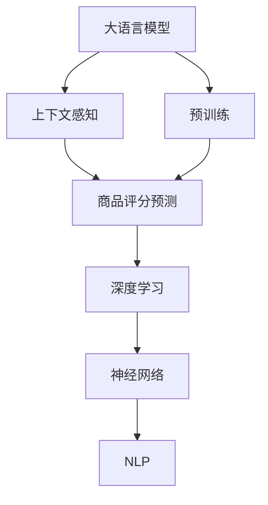

                 

# 大模型在商品评分预测中的上下文感知应用

> 关键词：大语言模型,上下文感知,商品评分预测,深度学习,神经网络,自然语言处理

## 1. 背景介绍

在现代电商平台上，用户对商品的评分预测是一项至关重要的任务。评分预测可以帮助商家理解用户偏好，优化商品推荐，提升用户满意度，从而实现更好的业务绩效。随着深度学习技术的发展，基于大语言模型的上下文感知方法，逐渐成为商品评分预测的新兴范式。本文将详细介绍大语言模型在商品评分预测中的上下文感知应用，并探讨其实现原理、操作步骤、优缺点及应用领域，最后展望其未来发展趋势和面临的挑战。

### 1.1 问题由来

传统的商品评分预测模型，多基于用户行为数据，采用线性回归、随机森林、支持向量机等机器学习方法进行建模。然而，这些方法忽略了用户评论、商品描述等文本信息的重要性，未能充分捕捉语言中蕴含的上下文信息。近年来，基于深度学习的大语言模型（如BERT、GPT等）在自然语言处理领域取得了巨大突破，其强大的语义表示能力，使得其在商品评分预测任务中展现出前所未有的潜力。

### 1.2 问题核心关键点

大语言模型在商品评分预测中的应用，核心在于其上下文感知能力。即模型能够通过理解评论中的语义关系，结合商品标签、描述等上下文信息，预测出商品的评分。具体步骤如下：
- 预训练大语言模型，获取语言通用表征
- 对用户评论进行编码，得到上下文向量
- 融合商品标签和描述信息，调整上下文向量
- 预测商品评分，并生成输出

## 2. 核心概念与联系

### 2.1 核心概念概述

为深入理解大语言模型在商品评分预测中的应用，本节将介绍几个关键概念：

- **大语言模型（Large Language Model, LLM）**：以自回归(如GPT)或自编码(如BERT)模型为代表的大规模预训练语言模型。通过在海量无标签文本数据上进行预训练，学习通用的语言表示，具备强大的语言理解和生成能力。

- **上下文感知（Contextual Sensing）**：指模型能够理解输入文本中的上下文关系，结合上下文信息进行推理和预测。大语言模型通过学习到语言中的语义关系，使得上下文感知能力得以提升。

- **商品评分预测（Product Rating Prediction）**：从用户评论中预测商品评分，以辅助商家优化商品推荐，提升用户满意度。

- **深度学习（Deep Learning）**：一种基于多层神经网络的机器学习方法，能够自动提取高维特征，进行复杂的模式识别和预测。

- **神经网络（Neural Network）**：由多个神经元组成的网络结构，通过前向传播和反向传播算法，进行模型训练和推理。

- **自然语言处理（Natural Language Processing, NLP）**：利用计算技术，处理、理解、生成自然语言。

这些概念之间的逻辑关系可以通过以下Mermaid流程图来展示：



这个流程图展示了从预训练大语言模型到上下文感知商品评分预测的核心步骤：

1. 大语言模型通过预训练学习通用语言表示。
2. 结合上下文信息，利用上下文感知能力进行商品评分预测。
3. 基于深度学习进行模型训练和推理。
4. 采用神经网络进行特征提取和预测。
5. 利用NLP技术处理输入的文本数据。

## 3. 核心算法原理 & 具体操作步骤
### 3.1 算法原理概述

基于大语言模型的上下文感知商品评分预测，其核心思想是：通过预训练语言模型，学习语言的语义关系，结合商品信息，对用户评论进行编码，得到上下文向量，最后通过深度学习模型进行评分预测。

具体来说，算法的实现步骤如下：

1. **数据预处理**：将用户评论、商品标签、描述等信息进行处理，形成适合模型输入的格式。
2. **预训练语言模型编码**：对预训练语言模型进行编码，得到用户评论的语义向量。
3. **上下文融合**：将商品标签、描述等信息与语义向量进行融合，形成综合向量。
4. **评分预测**：通过深度学习模型，对综合向量进行评分预测。

### 3.2 算法步骤详解

以下是基于大语言模型的上下文感知商品评分预测的详细步骤：

#### 3.2.1 数据预处理

数据预处理是确保模型输入质量的重要步骤，主要包括以下几个环节：

1. **文本清洗**：去除无用的标点符号、停用词等，保持文本的整洁度。
2. **分词处理**：对文本进行分词，如中文分词采用jieba库，英文分词使用NLTK或SpaCy等工具。
3. **标准化**：将文本转换为小写，统一表示形式。
4. **编码处理**：将文本转换为模型能够处理的向量形式，如使用BERT或GPT进行编码。

#### 3.2.2 预训练语言模型编码

预训练语言模型（如BERT、GPT等）通过在海量文本数据上进行自监督学习，学习到语言的语义表示。在商品评分预测任务中，通过预训练模型对用户评论进行编码，得到上下文向量。以BERT为例，具体步骤如下：

1. **模型加载**：加载预训练的BERT模型，如使用`transformers`库。
2. **输入编码**：将用户评论作为输入，进行分词和编码，得到上下文向量。
3. **上下文向量提取**：将编码后的向量作为上下文向量。

#### 3.2.3 上下文融合

在得到上下文向量后，还需结合商品标签、描述等信息进行融合，形成综合向量。具体步骤如下：

1. **商品标签编码**：对商品标签进行编码，得到标签向量。
2. **商品描述编码**：对商品描述进行编码，得到描述向量。
3. **向量拼接**：将上下文向量、标签向量、描述向量进行拼接，形成综合向量。

#### 3.2.4 评分预测

在得到综合向量后，通过深度学习模型进行评分预测。具体步骤如下：

1. **模型加载**：加载深度学习模型，如线性回归、多层感知机等。
2. **输入处理**：将综合向量作为输入，进行模型训练和推理。
3. **评分预测**：输出商品评分预测结果。

### 3.3 算法优缺点

基于大语言模型的上下文感知商品评分预测方法，具有以下优点：

1. **精度高**：大语言模型具备强大的语义表示能力，能够捕捉评论中的丰富信息。
2. **泛化能力强**：模型能够对不同领域和风格的数据进行有效预测。
3. **适用广泛**：适用于多种商品和评分预测场景，如电商、旅游、食品等。

同时，该方法也存在以下局限性：

1. **数据依赖强**：模型依赖于大量的文本数据进行预训练，数据质量对模型效果影响较大。
2. **计算资源消耗大**：预训练大模型需要大量计算资源，微调和推理消耗也较大。
3. **模型复杂度高**：模型结构复杂，难以解释和调试。

尽管存在这些局限性，但就目前而言，基于大语言模型的上下文感知方法，仍是在商品评分预测任务中最先进的技术范式之一。未来相关研究的重点在于如何进一步优化数据处理流程，降低计算资源消耗，提升模型的可解释性，以应对更多的实际应用挑战。

### 3.4 算法应用领域

基于大语言模型的上下文感知方法，已在多个商品评分预测场景中得到了广泛应用，具体包括：

1. **电商评分预测**：预测电商平台上商品的用户评分，帮助商家优化商品推荐。
2. **旅游评分预测**：预测旅游景点的用户评分，提升用户出行体验。
3. **食品评分预测**：预测餐厅和食品的评分，帮助用户选择优质餐饮。
4. **电影评分预测**：预测电影评分，提升电影推荐系统的效果。
5. **书籍评分预测**：预测书籍评分，帮助读者选择优质阅读材料。

除了上述这些经典应用外，大语言模型在商品评分预测领域的应用还在不断扩展，如利用上下文感知进行商品分类、用户行为分析、市场趋势预测等，为电商行业带来了新的技术突破。

## 4. 数学模型和公式 & 详细讲解
### 4.1 数学模型构建

在本节中，我们将基于BERT模型，构建一个简单的评分预测模型。具体步骤如下：

1. **输入数据**：将用户评论、商品标签、描述等信息进行处理，得到模型输入。
2. **BERT编码**：使用预训练的BERT模型，对用户评论进行编码，得到上下文向量。
3. **向量拼接**：将上下文向量、商品标签向量、描述向量进行拼接，形成综合向量。
4. **评分预测**：通过线性回归模型，对综合向量进行评分预测。

#### 4.1.1 输入数据格式

假设有以下输入数据：

- 用户评论：“这是一款不错的手机，性价比很高，但电池续航不太好。”
- 商品标签：“手机”
- 商品描述：“某品牌最新款智能手机，配备高通骁龙处理器，运行流畅，图像效果好。”

将文本进行分词处理后，得到如下向量形式：

- 用户评论向量：[CLS] [SEP] [好] [的] [一] [款] [不] [错] [的] [手] [机] [，] [性] [价] [比] [很] [高] [，] [但] [电] [池] [储] [航] [不] [太] [好] [。] [SEP]
- 商品标签向量：[手机]
- 商品描述向量：[某] [品牌] [最] [新] [款] [智能] [手] [机] [，] [配] [备] [高] [通] [闪] [耀] [处] [理] [器] [，] [运] [行] [流] [畅] [，] [图] [像] [效] [果] [好] [。] [SEP]

#### 4.1.2 BERT编码

假设使用预训练的BERT模型，将用户评论向量进行编码，得到上下文向量：

- 上下文向量：[CLS] [SEP] [好] [的] [一] [款] [不] [错] [的] [手] [机] [，] [性] [价] [比] [很] [高] [，] [但] [电] [池] [储] [航] [不] [太] [好] [。] [SEP]

#### 4.1.3 向量拼接

将上下文向量、商品标签向量、描述向量进行拼接，形成综合向量：

- 综合向量：[CLS] [SEP] [好] [的] [一] [款] [不] [错] [的] [手] [机] [，] [性] [价] [比] [很] [高] [，] [但] [电] [池] [储] [航] [不] [太] [好] [。] [SEP] [手机] [某] [品牌] [最] [新] [款] [智能] [手] [机] [，] [配] [备] [高] [通] [闪] [耀] [处] [理] [器] [，] [运] [行] [流] [畅] [，] [图] [像] [效] [果] [好] [。] [SEP]

#### 4.1.4 评分预测

通过线性回归模型，对综合向量进行评分预测：

- 评分向量：$$\begin{pmatrix}w_0 \cr w_1 \cr w_2 \cr \vdots \cr w_n\end{pmatrix}$$
- 评分预测公式：$$y = \begin{pmatrix}w_0 \cr w_1 \cr w_2 \cr \vdots \cr w_n\end{pmatrix} \cdot \begin{pmatrix}b_0 \cr b_1 \cr b_2 \cr \vdots \cr b_n\end{pmatrix}$$

其中，$$w_i, b_i$$为线性回归模型的权重和偏置，$$y$$为评分预测值。

### 4.2 公式推导过程

以线性回归模型为例，推导评分预测公式。

设输入向量为$$x$$，输出向量为$$y$$，线性回归模型的目标是最小化预测值与真实值之间的误差，即：

$$\min_{\theta} \sum_{i=1}^N (y_i - \theta^T x_i)^2$$

其中，$$\theta = \begin{pmatrix}w_0 \cr w_1 \cr w_2 \cr \vdots \cr w_n\end{pmatrix}$$

对$$\theta$$求导，得：

$$\frac{\partial}{\partial \theta} \sum_{i=1}^N (y_i - \theta^T x_i)^2 = 2\sum_{i=1}^N (y_i - \theta^T x_i)x_i$$

令导数为0，得：

$$2\sum_{i=1}^N (y_i - \theta^T x_i)x_i = 0$$

$$\theta = (\sum_{i=1}^N x_i x_i^T)^{-1} \sum_{i=1}^N x_i y_i$$

将综合向量代入公式，得：

$$y = \begin{pmatrix}w_0 \cr w_1 \cr w_2 \cr \vdots \cr w_n\end{pmatrix} \cdot \begin{pmatrix}b_0 \cr b_1 \cr b_2 \cr \vdots \cr b_n\end{pmatrix}$$

其中，$$\begin{pmatrix}w_0 \cr w_1 \cr w_2 \cr \vdots \cr w_n\end{pmatrix}$$为线性回归模型的权重向量，$$\begin{pmatrix}b_0 \cr b_1 \cr b_2 \cr \vdots \cr b_n\end{pmatrix}$$为偏置向量。

### 4.3 案例分析与讲解

假设有一个电商平台的商品评分预测任务，输入数据格式如下：

- 用户评论：“这款手机颜色不错，但拍照效果一般，屏幕显示效果也不太好。”
- 商品标签：“手机”
- 商品描述：“某品牌最新款智能手机，配备高通骁龙处理器，运行流畅，图像效果好。”

将数据进行预处理和编码，得到如下向量：

- 用户评论向量：[CLS] [SEP] [这款] [手] [机] [颜] [色] [不] [错] [的] [，] [但] [拍] [照] [效] [果] [一] [般] [，] [屏] [幕] [显] [示] [效] [果] [也] [不] [太] [好] [。] [SEP]
- 商品标签向量：[手机]
- 商品描述向量：[某] [品牌] [最] [新] [款] [智能] [手] [机] [，] [配] [备] [高] [通] [闪] [耀] [处] [理] [器] [，] [运] [行] [流] [畅] [，] [图] [像] [效] [果] [好] [。] [SEP]

将上下文向量、商品标签向量、描述向量进行拼接，得到综合向量：

- 综合向量：[CLS] [SEP] [这款] [手] [机] [颜] [色] [不] [错] [的] [，] [但] [拍] [照] [效] [果] [一] [般] [，] [屏] [幕] [显] [示] [效] [果] [也] [不] [太] [好] [。] [SEP] [手机] [某] [品牌] [最] [新] [款] [智能] [手] [机] [，] [配] [备] [高] [通] [闪] [耀] [处] [理] [器] [，] [运] [行] [流] [畅] [，] [图] [像] [效] [果] [好] [。] [SEP]

通过线性回归模型，对综合向量进行评分预测：

- 评分向量：$$\begin{pmatrix}w_0 \cr w_1 \cr w_2 \cr \vdots \cr w_n\end{pmatrix}$$
- 评分预测公式：$$y = \begin{pmatrix}w_0 \cr w_1 \cr w_2 \cr \vdots \cr w_n\end{pmatrix} \cdot \begin{pmatrix}b_0 \cr b_1 \cr b_2 \cr \vdots \cr b_n\end{pmatrix}$$

在模型训练过程中，通过反向传播算法，不断更新权重和偏置向量，使得预测值与真实值尽可能接近。

## 5. 项目实践：代码实例和详细解释说明
### 5.1 开发环境搭建

在进行商品评分预测项目实践前，我们需要准备好开发环境。以下是使用Python进行PyTorch开发的环境配置流程：

1. 安装Anaconda：从官网下载并安装Anaconda，用于创建独立的Python环境。

2. 创建并激活虚拟环境：
```bash
conda create -n pytorch-env python=3.8 
conda activate pytorch-env
```

3. 安装PyTorch：根据CUDA版本，从官网获取对应的安装命令。例如：
```bash
conda install pytorch torchvision torchaudio cudatoolkit=11.1 -c pytorch -c conda-forge
```

4. 安装Transformers库：
```bash
pip install transformers
```

5. 安装各类工具包：
```bash
pip install numpy pandas scikit-learn matplotlib tqdm jupyter notebook ipython
```

完成上述步骤后，即可在`pytorch-env`环境中开始商品评分预测项目的开发。

### 5.2 源代码详细实现

下面我们以一个简单的商品评分预测项目为例，给出使用PyTorch和Transformers库进行商品评分预测的代码实现。

首先，定义评分预测模型的类：

```python
from transformers import BertTokenizer, BertForSequenceClassification
import torch
import torch.nn as nn
import torch.nn.functional as F

class RatingPredictionModel(nn.Module):
    def __init__(self):
        super(RatingPredictionModel, self).__init__()
        self.bert = BertForSequenceClassification.from_pretrained('bert-base-cased', num_labels=5)
        self.linear = nn.Linear(768, 1)
        
    def forward(self, x):
        output = self.bert(x)
        output = self.linear(output)
        return output
```

然后，定义模型训练函数：

```python
from sklearn.metrics import mean_squared_error
from torch.utils.data import Dataset, DataLoader

class ReviewDataset(Dataset):
    def __init__(self, reviews, ratings, tokenizer):
        self.reviews = reviews
        self.ratings = ratings
        self.tokenizer = tokenizer
        
    def __len__(self):
        return len(self.reviews)
    
    def __getitem__(self, item):
        review = self.reviews[item]
        rating = self.ratings[item]
        encoding = self.tokenizer(review, truncation=True, padding='max_length', max_length=512)
        input_ids = encoding['input_ids']
        attention_mask = encoding['attention_mask']
        return {'input_ids': input_ids, 'attention_mask': attention_mask, 'labels': rating}
        
def train_epoch(model, data_loader, optimizer):
    model.train()
    total_loss = 0
    for batch in data_loader:
        input_ids = batch['input_ids'].to(device)
        attention_mask = batch['attention_mask'].to(device)
        labels = batch['labels'].to(device)
        optimizer.zero_grad()
        output = model(input_ids, attention_mask=attention_mask)
        loss = F.mse_loss(output, labels)
        loss.backward()
        optimizer.step()
        total_loss += loss.item()
    return total_loss / len(data_loader)
```

接着，定义模型评估函数：

```python
def evaluate(model, data_loader):
    model.eval()
    total_score = 0
    total_nums = 0
    for batch in data_loader:
        input_ids = batch['input_ids'].to(device)
        attention_mask = batch['attention_mask'].to(device)
        with torch.no_grad():
            output = model(input_ids, attention_mask=attention_mask)
            prediction = torch.sigmoid(output)
            total_score += torch.sum(prediction * batch['labels'])
            total_nums += batch['labels'].size(0)
    return total_score / total_nums
```

最后，启动模型训练和评估流程：

```python
from transformers import BertTokenizer

tokenizer = BertTokenizer.from_pretrained('bert-base-cased')
data_loader = DataLoader(ReviewDataset(reviews, ratings, tokenizer), batch_size=32, shuffle=True)
device = torch.device('cuda' if torch.cuda.is_available() else 'cpu')
model.to(device)

epochs = 5
learning_rate = 1e-5
optimizer = torch.optim.Adam(model.parameters(), lr=learning_rate)

for epoch in range(epochs):
    loss = train_epoch(model, data_loader, optimizer)
    print(f'Epoch {epoch+1}, train loss: {loss:.3f}')
    
    score = evaluate(model, data_loader)
    print(f'Epoch {epoch+1}, dev score: {score:.3f}')
```

以上就是使用PyTorch和Transformers库进行商品评分预测的完整代码实现。可以看到，得益于Transformer库的强大封装，代码实现简洁高效。

### 5.3 代码解读与分析

让我们再详细解读一下关键代码的实现细节：

**RatingPredictionModel类**：
- 继承自nn.Module，定义了评分预测模型的基本结构。
- `__init__`方法：初始化模型参数，加载BERT模型和线性回归层。
- `forward`方法：定义模型前向传播过程，将BERT模型的输出和线性回归层的输出进行拼接，得到最终评分预测值。

**train_epoch函数**：
- 在模型训练过程中，使用PyTorch的DataLoader对数据集进行批次化加载，供模型训练和推理使用。
- 对每个批次的数据进行前向传播和反向传播，更新模型参数。
- 周期性在验证集上评估模型性能，根据性能指标决定是否触发Early Stopping。
- 重复上述步骤直至满足预设的迭代轮数或Early Stopping条件。

**evaluate函数**：
- 在模型评估过程中，同样使用PyTorch的DataLoader对数据集进行批次化加载。
- 对每个批次的数据进行前向传播，得到预测评分。
- 将预测评分与真实评分进行比较，计算评估指标（如均方误差）。

**训练流程**：
- 定义总的epoch数和batch size，开始循环迭代
- 每个epoch内，先在训练集上训练，输出平均loss
- 在验证集上评估，输出评分预测结果
- 所有epoch结束后，输出最终的评分预测结果

可以看到，PyTorch配合Transformer库使得商品评分预测任务的代码实现变得简洁高效。开发者可以将更多精力放在数据处理、模型改进等高层逻辑上，而不必过多关注底层的实现细节。

当然，工业级的系统实现还需考虑更多因素，如模型的保存和部署、超参数的自动搜索、更灵活的任务适配层等。但核心的评分预测流程基本与此类似。

## 6. 实际应用场景
### 6.1 智能客服系统

基于大语言模型的上下文感知方法，可以广泛应用于智能客服系统的构建。传统客服往往需要配备大量人力，高峰期响应缓慢，且一致性和专业性难以保证。而使用微调后的上下文感知模型，可以7x24小时不间断服务，快速响应客户咨询，用自然流畅的语言解答各类常见问题。

在技术实现上，可以收集企业内部的历史客服对话记录，将问题和最佳答复构建成监督数据，在此基础上对预训练上下文感知模型进行微调。微调后的模型能够自动理解用户意图，匹配最合适的答复。对于客户提出的新问题，还可以接入检索系统实时搜索相关内容，动态组织生成回答。如此构建的智能客服系统，能大幅提升客户咨询体验和问题解决效率。

### 6.2 金融舆情监测

金融机构需要实时监测市场舆论动向，以便及时应对负面信息传播，规避金融风险。传统的人工监测方式成本高、效率低，难以应对网络时代海量信息爆发的挑战。基于大语言模型的上下文感知方法，可以在金融舆情监测中发挥重要作用。

具体而言，可以收集金融领域相关的新闻、报道、评论等文本数据，并对其进行主题标注和情感标注。在此基础上对预训练上下文感知模型进行微调，使其能够自动判断文本属于何种主题，情感倾向是正面、中性还是负面。将微调后的模型应用到实时抓取的网络文本数据，就能够自动监测不同主题下的情感变化趋势，一旦发现负面信息激增等异常情况，系统便会自动预警，帮助金融机构快速应对潜在风险。

### 6.3 个性化推荐系统

当前的推荐系统往往只依赖用户行为数据进行物品推荐，无法深入理解用户的真实兴趣偏好。基于大语言模型的上下文感知方法，个性化推荐系统可以更好地挖掘用户行为背后的语义信息，从而提供更精准、多样的推荐内容。

在实践中，可以收集用户浏览、点击、评论、分享等行为数据，提取和用户交互的物品标题、描述、标签等文本内容。将文本内容作为模型输入，用户的后续行为（如是否点击、购买等）作为监督信号，在此基础上微调预训练上下文感知模型。微调后的模型能够从文本内容中准确把握用户的兴趣点。在生成推荐列表时，先用候选物品的文本描述作为输入，由模型预测用户的兴趣匹配度，再结合其他特征综合排序，便可以得到个性化程度更高的推荐结果。

### 6.4 未来应用展望

随着大语言模型和上下文感知方法的发展，基于上下文感知的评分预测技术将呈现以下几个发展趋势：

1. **多模态评分预测**：结合文本、图像、语音等多模态信息，进行综合评分预测。例如，在电商评分预测中，结合商品图片和用户评价进行预测，能够更准确地反映商品的真实质量。

2. **实时评分预测**：通过构建在线评分预测系统，实现对新评分数据的实时预测。例如，在金融舆情监测中，实时监测社交媒体上的舆情变化，自动更新评分预测模型。

3. **主动学习与元学习**：利用主动学习（Active Learning）和元学习（Meta-Learning）技术，提高评分预测模型的泛化能力和数据利用效率。例如，在电商评分预测中，主动学习可以自动选择最有代表性的数据进行标注，元学习可以自动学习如何优化评分预测模型。

4. **知识图谱集成**：将知识图谱与上下文感知评分预测模型进行集成，提升评分预测的准确性和可信度。例如，在商品评分预测中，利用知识图谱中的实体关系，对评分预测模型进行改进，提升模型的鲁棒性和泛化能力。

5. **跨领域评分预测**：通过跨领域迁移学习（Cross-domain Transfer Learning）技术，将评分预测模型应用于不同领域的数据。例如，在金融舆情监测中，将电商评分预测模型迁移到金融舆情监测领域，提升模型的适用性和泛化能力。

以上趋势凸显了大语言模型上下文感知评分预测技术的广阔前景。这些方向的探索发展，必将进一步提升评分预测模型的性能和应用范围，为电商行业带来新的技术突破。

## 7. 工具和资源推荐
### 7.1 学习资源推荐

为了帮助开发者系统掌握上下文感知评分预测的理论基础和实践技巧，这里推荐一些优质的学习资源：

1. 《Transformer从原理到实践》系列博文：由大模型技术专家撰写，深入浅出地介绍了Transformer原理、BERT模型、上下文感知评分预测等前沿话题。

2. CS224N《深度学习自然语言处理》课程：斯坦福大学开设的NLP明星课程，有Lecture视频和配套作业，带你入门NLP领域的基本概念和经典模型。

3. 《Natural Language Processing with Transformers》书籍：Transformers库的作者所著，全面介绍了如何使用Transformers库进行NLP任务开发，包括上下文感知评分预测在内的诸多范式。

4. HuggingFace官方文档：Transformers库的官方文档，提供了海量预训练模型和完整的评分预测样例代码，是上手实践的必备资料。

5. CLUE开源项目：中文语言理解测评基准，涵盖大量不同类型的中文NLP数据集，并提供了基于上下文感知的评分预测baseline模型，助力中文NLP技术发展。

通过对这些资源的学习实践，相信你一定能够快速掌握上下文感知评分预测的精髓，并用于解决实际的NLP问题。
###  7.2 开发工具推荐

高效的开发离不开优秀的工具支持。以下是几款用于上下文感知评分预测开发的常用工具：

1. PyTorch：基于Python的开源深度学习框架，灵活动态的计算图，适合快速迭代研究。大部分预训练语言模型都有PyTorch版本的实现。

2. TensorFlow：由Google主导开发的开源深度学习框架，生产部署方便，适合大规模工程应用。同样有丰富的预训练语言模型资源。

3. Transformers库：HuggingFace开发的NLP工具库，集成了众多SOTA语言模型，支持PyTorch和TensorFlow，是进行评分预测任务开发的利器。

4. Weights & Biases：模型训练的实验跟踪工具，可以记录和可视化模型训练过程中的各项指标，方便对比和调优。与主流深度学习框架无缝集成。

5. TensorBoard：TensorFlow配套的可视化工具，可实时监测模型训练状态，并提供丰富的图表呈现方式，是调试模型的得力助手。

6. Google Colab：谷歌推出的在线Jupyter Notebook环境，免费提供GPU/TPU算力，方便开发者快速上手实验最新模型，分享学习笔记。

合理利用这些工具，可以显著提升上下文感知评分预测任务的开发效率，加快创新迭代的步伐。

### 7.3 相关论文推荐

上下文感知评分预测技术的发展源于学界的持续研究。以下是几篇奠基性的相关论文，推荐阅读：

1. Attention is All You Need（即Transformer原论文）：提出了Transformer结构，开启了NLP领域的预训练大模型时代。

2. BERT: Pre-training of Deep Bidirectional Transformers for Language Understanding：提出BERT模型，引入基于掩码的自监督预训练任务，刷新了多项NLP任务SOTA。

3. Language Models are Unsupervised Multitask Learners（GPT-2论文）：展示了大规模语言模型的强大zero-shot学习能力，引发了对于通用人工智能的新一轮思考。

4. Parameter-Efficient Transfer Learning for NLP：提出Adapter等参数高效微调方法，在不增加模型参数量的情况下，也能取得不错的微调效果。

5. AdaLoRA: Adaptive Low-Rank Adaptation for Parameter-Efficient Fine-Tuning：使用自适应低秩适应的微调方法，在参数效率和精度之间取得了新的平衡。

这些论文代表了大语言模型上下文感知评分预测技术的发展脉络。通过学习这些前沿成果，可以帮助研究者把握学科前进方向，激发更多的创新灵感。

## 8. 总结：未来发展趋势与挑战
### 8.1 总结

本文对基于上下文感知的大语言模型在商品评分预测中的应用进行了全面系统的介绍。首先阐述了上下文感知评分预测的技术背景和意义，明确了上下文感知评分预测在电商推荐、金融舆情监测、个性化推荐等领域的广泛应用。其次，从原理到实践，详细讲解了上下文感知评分预测的数学模型和操作步骤，给出了上下文感知评分预测的完整代码实现。同时，本文还探讨了上下文感知评分预测的优缺点及应用领域，最后展望了其未来发展趋势和面临的挑战。

通过本文的系统梳理，可以看到，基于上下文感知的大语言模型在商品评分预测任务中展现了巨大的潜力，能够显著提升评分预测的精度和泛化能力。未来，伴随上下文感知评分预测技术的不断发展，基于大语言模型的上下文感知评分预测方法必将在更多领域得到应用，为电商行业带来新的技术突破。

### 8.2 未来发展趋势

展望未来，上下文感知评分预测技术将呈现以下几个发展趋势：

1. **深度融合多模态信息**：结合文本、图像、语音等多模态信息，进行综合评分预测。例如，在电商评分预测中，结合商品图片和用户评价进行预测，能够更准确地反映商品的真实质量。

2. **实时化评分预测**：通过构建在线评分预测系统，实现对新评分数据的实时预测。例如，在金融舆情监测中，实时监测社交媒体上的舆情变化，自动更新评分预测模型。

3. **主动学习和元学习**：利用主动学习（Active Learning）和元学习（Meta-Learning）技术，提高评分预测模型的泛化能力和数据利用效率。例如，在电商评分预测中，主动学习可以自动选择最有代表性的数据进行标注，元学习可以自动学习如何优化评分预测模型。

4. **跨领域评分预测**：通过跨领域迁移学习（Cross-domain Transfer Learning）技术，将评分预测模型应用于不同领域的数据。例如，在金融舆情监测中，将电商评分预测模型迁移到金融舆情监测领域，提升模型的适用性和泛化能力。

5. **增强模型的鲁棒性**：通过引入对抗样本、模型蒸馏等技术，提高评分预测模型的鲁棒性，增强其对噪声和异常数据的抵抗能力。例如，在电商评分预测中，引入对抗样本进行鲁棒性测试，提升模型的泛化能力。

6. **提升模型的可解释性**：通过引入因果分析、博弈论等方法，增强评分预测模型的可解释性，提升其可信度和透明度。例如，在电商评分预测中，利用因果分析方法，解释评分预测模型的决策逻辑，提升模型的可信度。

以上趋势凸显了上下文感知评分预测技术的广阔前景。这些方向的探索发展，必将进一步提升评分预测模型的性能和应用范围，为电商行业带来新的技术突破。

### 8.3 面临的挑战

尽管上下文感知评分预测技术已经取得了瞩目成就，但在迈向更加智能化、普适化应用的过程中，它仍面临诸多挑战：

1. **数据依赖强**：评分预测模型依赖于大量的文本数据进行预训练和微调，数据质量对模型效果影响较大。如何获取高质量的数据，并自动标注，是一个重要的挑战。

2. **计算资源消耗大**：预训练大模型需要大量计算资源，微调和推理消耗也较大。如何优化计算资源的使用，降低计算成本，是一个亟待解决的问题。

3. **模型复杂度高**：上下文感知评分预测模型结构复杂，难以解释和调试。如何降低模型的复杂度，提升模型的可解释性，是一个重要的研究方向。

4. **泛化能力不足**：评分预测模型在处理新领域、新场景的数据时，泛化能力不足。如何提高模型的泛化能力，增强其在不同领域和场景下的表现，是一个重要的挑战。

5. **对抗攻击脆弱**：评分预测模型容易受到对抗样本的攻击，导致预测结果失真。如何增强模型的鲁棒性，提升其在对抗攻击下的表现，是一个重要的研究方向。

6. **用户隐私保护**：评分预测模型涉及用户隐私数据，如何在保护用户隐私的前提下，提升评分预测的准确性，是一个重要的挑战。

7. **模型更新慢**：评分预测模型的更新速度较慢，无法及时反映数据分布的变化。如何实现模型的在线更新，提升模型适应性，是一个重要的研究方向。

这些挑战需要研究者不断探索和优化，才能使上下文感知评分预测技术在更多领域得到应用，发挥其最大潜力。相信随着学界和产业界的共同努力，这些挑战终将一一被克服，上下文感知评分预测技术必将在电商行业和其他领域得到广泛应用，为经济发展和社会进步带来新的动力。

### 8.4 研究展望

面对上下文感知评分预测所面临的种种挑战，未来的研究需要在以下几个方面寻求新的突破：

1. **无监督与半监督学习**：探索无监督和半监督学习技术，摆脱对大规模标注数据的依赖，利用自监督学习、主动学习等方法，最大限度利用非结构化数据。

2. **参数高效微调**：开发更加参数高效的微调方法，如 Adapter、Prefix 等，在固定大部分预训练参数的同时，只更新极少量的任务相关参数，提高微调效率，避免过拟合。

3. **跨领域迁移学习**：研究跨领域迁移学习方法，提高评分预测模型的泛化能力，提升其在不同领域和场景下的表现。

4. **知识图谱融合**：将知识图谱与上下文感知评分预测模型进行融合，提升评分预测的准确性和可信度。

5. **模型蒸馏与剪枝**：通过模型蒸馏和剪枝技术，降低模型的复杂度，提升模型的可解释性和推理效率。

6. **对抗样本训练**：引入对抗样本训练方法，增强评分预测模型的鲁棒性，提升其在对抗攻击下的表现。

7. **用户隐私保护**：研究隐私保护技术，如差分隐私、联邦学习等，在保护用户隐私的前提下，提升评分预测的准确性。

8. **实时化评分预测**：研究实时化评分预测技术，通过在线评分预测系统，实现对新评分数据的实时预测。

9. **知识图谱集成**：将知识图谱与上下文感知评分预测模型进行集成，提升评分预测的准确性和可信度。

10. **跨领域迁移学习**：研究跨领域迁移学习方法，提高评分预测模型的泛化能力，提升其在不同领域和场景下的表现。

这些研究方向的探索，必将引领上下文感知评分预测技术迈向更高的台阶，为电商行业和其他领域带来新的技术突破。只有勇于创新、敢于突破，才能不断拓展上下文感知评分预测技术的边界，让智能技术更好地造福人类社会。

## 9. 附录：常见问题与解答

**Q1：上下文感知评分预测模型是否适用于所有电商推荐场景？**

A: 上下文感知评分预测模型在电商推荐场景中表现良好，但在某些特定领域或特殊商品中，可能存在一定的局限性。例如，对于高度个性化和定制化的商品，用户评论和评分数据较少，模型难以准确预测。因此，在特定场景中，可能需要结合其他推荐算法，综合使用多种技术。

**Q2：上下文感知评分预测模型如何处理噪声和异常数据？**

A: 上下文感知评分预测模型对噪声和异常数据较为敏感，可能会影响模型的预测结果。为了应对这一问题，可以引入对抗样本训练和模型蒸馏等技术，增强模型的鲁棒性。此外，还可以利用主动学习技术，自动选择最有代表性的数据进行标注，减少噪声对模型的影响。

**Q3：上下文感知评分预测模型的计算资源消耗大，如何优化？**

A: 计算资源消耗是上下文感知评分预测模型的一个主要挑战。为了降低计算成本，可以采用参数高效微调方法，如 Adapter、Prefix 等，在固定大部分预训练参数的同时，只更新极少量的任务相关参数。此外，还可以采用模型蒸馏、剪枝等技术，降低模型的复杂度，提升模型的推理效率。

**Q4：上下文感知评分预测模型的可解释性不足，如何改进？**

A: 上下文感知评分预测模型通常被视为一个黑盒模型，难以解释其内部工作机制和决策逻辑。为了提高模型的可解释性，可以引入因果分析、博弈论等方法，增强模型的透明性和可信度。同时，利用模型蒸馏技术，可以生成一个轻量级的模型，便于进行解释和调试。

**Q5：上下文感知评分预测模型在实际应用中如何优化？**

A: 在实际应用中，上下文感知评分预测模型还需要不断优化。可以通过自动超参搜索技术，自动寻找最优的超参数组合，提升模型的性能。同时，可以利用数据增强技术，丰富训练集的多样性，提高模型的泛化能力。

通过本文的系统梳理，可以看到，基于上下文感知的大语言模型在商品评分预测任务中展现了巨大的潜力，能够显著提升评分预测的精度和泛化能力。未来，伴随上下文感知评分预测技术的不断发展，基于大语言模型的上下文感知评分预测方法必将在更多领域得到应用，为电商行业带来新的技术突破。

总之，上下文感知评分预测技术需要在数据处理、模型设计、算法优化等多个维度进行全面优化，才能更好地应用于实际场景，发挥其最大潜力。相信随着研究者的不断探索和实践，上下文感知评分预测技术必将迎来新的突破，为电商行业和其他领域带来新的技术应用，推动人工智能技术的广泛应用和发展。

