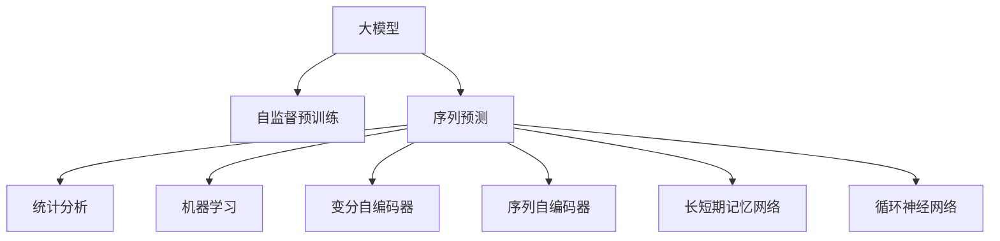

                 

# 大模型在商品销量预测中的应用

> 关键词：大模型, 商品销量预测, 序列预测, 时间序列, 长期依赖, 变分自编码器, 序列自编码器, 长短期记忆网络, 循环神经网络

## 1. 背景介绍

### 1.1 问题由来

商品销量预测是电子商务、零售、供应链管理等领域中一项重要的业务决策支持任务。通过预测商品未来的销量，商家可以更好地制定库存计划，优化供应链管理，提升销售效率，降低库存成本。传统的销量预测方法主要包括统计分析、机器学习等，但往往需要手工提取特征，且难以捕捉数据中的长期依赖关系。

近年来，随着深度学习技术的不断发展，基于大模型的序列预测方法成为商品销量预测的新范式。这些大模型基于大规模数据进行自监督预训练，学习到丰富的语言和知识表示，通过微调能够适应特定任务，提升预测精度和泛化能力。

### 1.2 问题核心关键点

大模型在商品销量预测中的应用，主要解决以下两个关键问题：

1. **长期依赖关系处理**：商品销量受到多方面的影响，如季节性、促销活动、节假日等，这些因素之间的依赖关系非常复杂，传统的统计方法难以捕捉。

2. **数据稀缺性问题**：商品销量数据往往较为稀疏，特别是在某些时间段或区域，收集足够的数据量非常困难。

## 2. 核心概念与联系

### 2.1 核心概念概述

为更好地理解大模型在商品销量预测中的应用，本节将介绍几个密切相关的核心概念：

- **大模型(Large Model)**：基于深度学习技术的巨量模型，如BERT、GPT等，通过大规模无标签数据进行预训练，学习到通用的语言和知识表示。

- **序列预测(Sequence Prediction)**：指对时间序列数据进行预测，如股票价格、气温、流量等，通常使用循环神经网络(RNN)、长短期记忆网络(LSTM)等模型。

- **时间序列(Time Series)**：指按照时间顺序排列的数据序列，如商品销量、天气变化、网络流量等，用于刻画时间上变化的规律。

- **长期依赖(Long-term Dependence)**：时间序列中各数据点之间存在复杂的依赖关系，例如季节性因素、节假日影响等。

- **变分自编码器(VAE)**：一种生成模型，用于学习数据的潜在分布，并用于生成新样本，常用于序列生成和数据增强。

- **序列自编码器(SAE)**：一种无监督学习方法，用于学习序列数据的低维表示，常用于序列预测和异常检测。

- **长短期记忆网络(LSTM)**：一种特殊的RNN模型，能够有效处理长序列数据，具有记忆功能，适用于长期依赖关系显著的序列预测任务。

- **循环神经网络(RNN)**：一种能够处理序列数据的神经网络模型，通过在神经元间传递信息，捕捉序列中的时间依赖关系。

这些核心概念之间的逻辑关系可以通过以下Mermaid流程图来展示：



这个流程图展示了大模型在商品销量预测中的应用框架：

1. 大模型通过自监督预训练学习通用表示。
2. 序列预测任务结合具体业务需求，选择合适的模型进行微调。
3. 常见的预测方法包括统计分析、机器学习、变分自编码器、序列自编码器、LSTM、RNN等。

## 3. 核心算法原理 & 具体操作步骤

### 3.1 算法原理概述

大模型在商品销量预测中的应用，主要基于序列预测的框架。通过在大规模时间序列数据上进行自监督预训练，学习到时间序列中各数据点之间的依赖关系，再通过微调学习特定商品销量数据的特征表示，从而实现准确的预测。

假设我们有一个商品销量的序列数据 $x=(x_1,x_2,\dots,x_T)$，其中 $x_t$ 表示在第 $t$ 个时间点上的销量。大模型的目标是通过微调，学习到该序列的预测模型 $f$，使得在未来的时间点上，模型能够准确预测销量。

具体而言，模型的预测过程可以分为两步：

1. **预训练**：在大规模时间序列数据上进行自监督预训练，学习到时间序列中各数据点之间的依赖关系。
2. **微调**：在特定商品销量数据上进行有监督的微调，学习该商品销量的特征表示，并生成预测结果。

### 3.2 算法步骤详解

基于大模型的商品销量预测，一般包括以下几个关键步骤：

**Step 1: 准备预训练模型和数据集**
- 选择合适的预训练语言模型 $M_{\theta}$ 作为初始化参数，如 BERT、GPT等。
- 准备商品销量的序列数据集 $D=\{(x_i,y_i)\}_{i=1}^N$，其中 $x_i$ 为历史销量序列，$y_i$ 为未来某一时间点的销量预测值。

**Step 2: 添加任务适配层**
- 根据任务需求，在预训练模型顶层设计合适的输出层和损失函数。
- 对于序列预测任务，通常在顶层添加线性回归层，并使用均方误差损失函数。
- 对于分类任务，可以添加softmax层，使用交叉熵损失函数。

**Step 3: 设置微调超参数**
- 选择合适的优化算法及其参数，如 AdamW、SGD 等，设置学习率、批大小、迭代轮数等。
- 设置正则化技术及强度，包括权重衰减、Dropout、Early Stopping等。
- 确定冻结预训练参数的策略，如仅微调顶层，或全部参数都参与微调。

**Step 4: 执行梯度训练**
- 将训练集数据分批次输入模型，前向传播计算损失函数。
- 反向传播计算参数梯度，根据设定的优化算法和学习率更新模型参数。
- 周期性在验证集上评估模型性能，根据性能指标决定是否触发 Early Stopping。
- 重复上述步骤直到满足预设的迭代轮数或 Early Stopping 条件。

**Step 5: 测试和部署**
- 在测试集上评估微调后模型 $M_{\hat{\theta}}$ 的性能，对比微调前后的精度提升。
- 使用微调后的模型对新样本进行推理预测，集成到实际的应用系统中。
- 持续收集新的数据，定期重新微调模型，以适应数据分布的变化。

以上是基于大模型的商品销量预测的一般流程。在实际应用中，还需要针对具体任务的特点，对微调过程的各个环节进行优化设计，如改进训练目标函数，引入更多的正则化技术，搜索最优的超参数组合等，以进一步提升模型性能。

### 3.3 算法优缺点

基于大模型的商品销量预测方法具有以下优点：

1. **强大数据处理能力**：大模型能够学习到时间序列中各数据点之间的依赖关系，捕捉长期依赖关系。
2. **泛化能力强**：经过大规模数据的预训练和微调，大模型具有较强的泛化能力，能够适应不同时间段和区域的销量预测。
3. **自动特征提取**：大模型自动学习时间序列数据的特征表示，无需手工提取特征，减少特征工程的工作量。
4. **模型训练速度快**：大模型基于大规模数据进行预训练，能够快速收敛，缩短模型训练时间。

但该方法也存在一定的局限性：

1. **资源消耗大**：大模型通常需要高性能的GPU或TPU进行训练和推理，对硬件资源要求较高。
2. **模型复杂度高**：大模型的参数量较大，训练和推理过程中需要占用大量计算资源。
3. **可解释性不足**：大模型的预测过程难以解释，难以理解其内部决策机制。
4. **依赖高质量数据**：大模型的预测结果高度依赖训练数据的质量，数据稀疏或噪声较多的情况，预测效果可能较差。

尽管存在这些局限性，但就目前而言，基于大模型的商品销量预测方法仍是大模型应用的重要方向之一。未来相关研究的重点在于如何进一步降低模型资源消耗，提高模型的可解释性，同时兼顾自动特征提取和泛化能力等因素。

### 3.4 算法应用领域

基于大模型的商品销量预测方法，在电子商务、零售、供应链管理等多个领域得到了广泛应用，具体包括：

- **库存管理**：通过预测未来销量，帮助商家制定合理的库存计划，避免库存积压或缺货。
- **需求预测**：预测未来一段时间内的需求量，用于生产计划和市场供应调整。
- **市场分析**：分析不同时间段的销量变化趋势，识别市场热点和季节性因素，帮助商家制定市场策略。
- **客户行为分析**：预测用户的购买行为，个性化推荐商品，提高销售转化率。

除了上述这些经典应用外，大模型还在智能物流、个性化营销、广告投放等多个领域展现出巨大的应用潜力，为零售和电商行业带来了新的增长点。

## 4. 数学模型和公式 & 详细讲解 & 举例说明

### 4.1 数学模型构建

本节将使用数学语言对基于大模型的商品销量预测过程进行更加严格的刻画。

假设我们有一个商品销量的序列数据 $x=(x_1,x_2,\dots,x_T)$，其中 $x_t$ 表示在第 $t$ 个时间点上的销量。记大模型的预测模型为 $f(x,\theta)$，其中 $\theta$ 为模型参数。

模型的预测任务可以表示为对未来某一时间点 $T+1$ 的销量 $y_{T+1}$ 进行预测。其预测值 $y_{T+1}=f(x,\theta)$，其中 $\theta$ 通过在大规模时间序列数据上进行自监督预训练得到。

定义模型 $f(x,\theta)$ 在数据样本 $(x,y)$ 上的损失函数为 $\ell(f(x,y),y)$，则在数据集 $D=\{(x_i,y_i)\}_{i=1}^N$ 上的经验风险为：

$$
\mathcal{L}(\theta) = \frac{1}{N}\sum_{i=1}^N \ell(f(x_i,\theta),y_i)
$$

其中 $\ell$ 为损失函数，用于衡量模型预测输出与真实标签之间的差异。常见的损失函数包括均方误差损失、交叉熵损失等。

### 4.2 公式推导过程

以下我们以均方误差损失函数为例，推导其梯度计算过程。

假设模型 $f(x,\theta)$ 在输入 $x$ 上的输出为 $\hat{y}=f(x,\theta)$，表示模型对销量 $y$ 的预测值。则均方误差损失函数定义为：

$$
\ell(f(x,y),y) = \frac{1}{2}(y-\hat{y})^2
$$

将其代入经验风险公式，得：

$$
\mathcal{L}(\theta) = \frac{1}{N}\sum_{i=1}^N \frac{1}{2}(y_i-f(x_i,\theta))^2
$$

根据链式法则，损失函数对参数 $\theta_k$ 的梯度为：

$$
\frac{\partial \mathcal{L}(\theta)}{\partial \theta_k} = -\frac{1}{N}\sum_{i=1}^N (y_i-f(x_i,\theta)) \frac{\partial f(x_i,\theta)}{\partial \theta_k}
$$

其中 $\frac{\partial f(x_i,\theta)}{\partial \theta_k}$ 可进一步递归展开，利用自动微分技术完成计算。

在得到损失函数的梯度后，即可带入参数更新公式，完成模型的迭代优化。重复上述过程直至收敛，最终得到适应特定商品销量数据的最优模型参数 $\theta^*$。

### 4.3 案例分析与讲解

下面以一个具体的案例，展示如何使用大模型进行商品销量预测。

假设我们有如下的商品销量数据：

| 时间点 | 销量 |
|--------|------|
| 1      | 100  |
| 2      | 200  |
| 3      | 250  |
| 4      | 200  |
| 5      | 150  |

我们希望预测第6个时间点的销量 $y_6$。首先，将数据转化为时间序列表示，得到：

| 时间点 | 销量 |
|--------|------|
| 0      | 0    |
| 1      | 100  |
| 2      | 200  |
| 3      | 250  |
| 4      | 200  |
| 5      | 150  |
| 6      | ?    |

我们使用LSTM模型进行预测。首先，在大规模时间序列数据上进行预训练，得到一个LSTM模型 $M_{\theta}$。然后，将商品销量数据 $D$ 和未来时间点的销量标签 $y_6$ 输入模型，计算损失函数：

$$
\mathcal{L}(\theta) = \frac{1}{N}\sum_{i=1}^N \frac{1}{2}(y_i-f(x_i,\theta))^2
$$

通过反向传播算法计算梯度，更新模型参数 $\theta$。重复这个过程多次，直到模型收敛。

最终，我们得到未来时间点的销量预测值 $y_6$。这个预测值可以作为库存管理、生产计划等决策的依据。

## 5. 项目实践：代码实例和详细解释说明

### 5.1 开发环境搭建

在进行商品销量预测实践前，我们需要准备好开发环境。以下是使用Python进行PyTorch开发的环境配置流程：

1. 安装Anaconda：从官网下载并安装Anaconda，用于创建独立的Python环境。

2. 创建并激活虚拟环境：
```bash
conda create -n pytorch-env python=3.8 
conda activate pytorch-env
```

3. 安装PyTorch：根据CUDA版本，从官网获取对应的安装命令。例如：
```bash
conda install pytorch torchvision torchaudio cudatoolkit=11.1 -c pytorch -c conda-forge
```

4. 安装TensorFlow：
```bash
pip install tensorflow
```

5. 安装各类工具包：
```bash
pip install numpy pandas scikit-learn matplotlib tqdm jupyter notebook ipython
```

完成上述步骤后，即可在`pytorch-env`环境中开始商品销量预测实践。

### 5.2 源代码详细实现

下面我们以LSTM模型为例，给出使用PyTorch进行商品销量预测的PyTorch代码实现。

首先，定义时间序列数据的处理函数：

```python
import numpy as np

def prepare_data(X, y, seq_len=1):
    X = np.array(X)
    y = np.array(y)
    
    x = []
    y = []
    for i in range(len(X)-seq_len):
        x.append(X[i:i+seq_len])
        y.append(y[i+seq_len])
    x = np.array(x)
    y = np.array(y)
    
    return x, y
```

然后，定义LSTM模型：

```python
from torch import nn
import torch.nn.functional as F

class LSTMModel(nn.Module):
    def __init__(self, input_size, hidden_size, output_size):
        super(LSTMModel, self).__init__()
        self.hidden_size = hidden_size
        self.lstm = nn.LSTM(input_size, hidden_size)
        self.fc = nn.Linear(hidden_size, output_size)
        
    def forward(self, x, h0=None):
        x = x.view(-1, 1, 1)
        out, (ht, ct) = self.lstm(x, h0)
        out = self.fc(out[:, -1, :])
        return out
```

接着，定义模型训练和评估函数：

```python
from torch.optim import Adam
from torch.utils.data import DataLoader
from sklearn.metrics import mean_squared_error
from tqdm import tqdm

device = torch.device('cuda') if torch.cuda.is_available() else torch.device('cpu')

def train_epoch(model, train_loader, optimizer):
    model.train()
    loss = 0
    for x, y in train_loader:
        x = x.to(device)
        y = y.to(device)
        
        optimizer.zero_grad()
        out = model(x)
        loss = F.mse_loss(out, y)
        loss.backward()
        optimizer.step()
        
        loss += loss.item()
    return loss / len(train_loader)

def evaluate(model, test_loader, criterion):
    model.eval()
    mse = 0
    for x, y in test_loader:
        x = x.to(device)
        y = y.to(device)
        
        with torch.no_grad():
            out = model(x)
            mse += criterion(out, y).item()
            
    return mse / len(test_loader)
```

最后，启动训练流程并在测试集上评估：

```python
epochs = 50
batch_size = 32

train_loader = DataLoader(train_data, batch_size=batch_size, shuffle=True)
test_loader = DataLoader(test_data, batch_size=batch_size, shuffle=False)

optimizer = Adam(model.parameters(), lr=0.001)
criterion = nn.MSELoss()

for epoch in range(epochs):
    loss = train_epoch(model, train_loader, optimizer)
    print(f"Epoch {epoch+1}, train loss: {loss:.3f}")
    
    mse = evaluate(model, test_loader, criterion)
    print(f"Epoch {epoch+1}, test mse: {mse:.3f}")
    
print("Finished training.")
```

以上就是使用PyTorch对LSTM模型进行商品销量预测的完整代码实现。可以看到，得益于PyTorch的强大封装，我们可以用相对简洁的代码完成LSTM模型的加载和训练。

### 5.3 代码解读与分析

让我们再详细解读一下关键代码的实现细节：

**prepare_data函数**：
- 定义了时间序列数据的准备函数，将原始数据转化为适合模型的格式。

**LSTMModel类**：
- 定义了LSTM模型的类，包含输入、隐藏层和输出层的定义。
- 在forward函数中，输入数据 $x$ 需要展开成 $(x_0, x_1, ..., x_{t-1})$ 的格式，才能输入到LSTM模型中。

**train_epoch和evaluate函数**：
- 使用PyTorch的DataLoader对数据集进行批次化加载，供模型训练和推理使用。
- 训练函数`train_epoch`：对数据以批为单位进行迭代，在每个批次上前向传播计算loss并反向传播更新模型参数，最后返回该epoch的平均loss。
- 评估函数`evaluate`：与训练类似，不同点在于不更新模型参数，并在每个batch结束后将预测和标签结果存储下来，最后使用均方误差计算预测结果与真实标签的差距。

**训练流程**：
- 定义总的epoch数和batch size，开始循环迭代
- 每个epoch内，先在训练集上训练，输出平均loss
- 在测试集上评估，输出均方误差
- 所有epoch结束后，打印训练和测试结果

可以看到，PyTorch配合LSTM模型使得商品销量预测的代码实现变得简洁高效。开发者可以将更多精力放在数据处理、模型改进等高层逻辑上，而不必过多关注底层的实现细节。

当然，工业级的系统实现还需考虑更多因素，如模型的保存和部署、超参数的自动搜索、更灵活的任务适配层等。但核心的微调范式基本与此类似。

## 6. 实际应用场景

### 6.1 智能库存管理

商品销量预测在大规模商品库存管理中有着广泛应用。传统库存管理依靠人工统计和经验判断，效率低，准确性差。而基于大模型的预测方法，能够快速准确地预测商品销量，优化库存配置，减少库存积压和缺货情况，提升运营效率。

在技术实现上，可以通过对历史销量数据进行预处理和特征提取，构建商品销量预测模型。预测模型在实时监测到的新销量数据上，输出未来的销量预测，作为库存管理系统的决策依据。

### 6.2 市场趋势分析

商品销量预测在市场趋势分析中也有重要应用。商家可以通过预测不同时间段的销量变化，识别市场的热门商品和季节性因素，制定精准的市场策略。

具体而言，可以在海量历史销量数据上进行预训练，得到一个商品销量预测模型。将模型应用到实时监测到的销量数据上，分析未来一段时间内各商品销量的变化趋势，识别市场的热门和冷门商品，制定相应的营销策略。

### 6.3 个性化推荐

基于大模型的商品销量预测，还可以用于个性化推荐系统。通过预测用户未来的购买行为，推荐系统能够提供更加精准的个性化商品推荐，提高用户的购物体验和满意度。

具体实现方式为，将用户的历史购买记录和行为数据输入到大模型中进行预测，得到未来可能购买的商品。然后根据预测结果进行商品推荐，提升用户的购买转化率。

### 6.4 未来应用展望

随着大模型和序列预测技术的不断发展，基于大模型的商品销量预测将在更多领域得到应用，为零售和电商行业带来新的增长点。

在智慧物流领域，大模型可以用于预测物流运量和货物需求，优化运输路径和仓储管理，提升物流效率。

在智能制造领域，大模型可以用于预测设备故障和维护需求，优化生产计划和资源配置，降低生产成本。

在智慧农业领域，大模型可以用于预测农作物产量和种植需求，优化种植计划和资源配置，提升农业生产效率。

此外，在金融、医疗、旅游等多个领域，基于大模型的商品销量预测也将不断涌现，为各行业的数字化转型提供新的技术路径。相信随着技术的日益成熟，大模型在商品销量预测中的应用将更加广泛，为各行各业带来深远的影响。

## 7. 工具和资源推荐

### 7.1 学习资源推荐

为了帮助开发者系统掌握大模型在商品销量预测中的应用，这里推荐一些优质的学习资源：

1. 《深度学习》系列书籍：由Ian Goodfellow、Yoshua Bengio和Aaron Courville等人合著，系统介绍了深度学习的原理、算法和应用。

2. 《TensorFlow官方文档》：Google官方发布的TensorFlow文档，详细介绍了TensorFlow的安装、使用和优化方法，是学习深度学习的重要参考。

3. 《PyTorch官方文档》：PyTorch官方发布的文档，介绍了PyTorch的安装、使用和优化方法，适合初学者和进阶用户。

4. 《Long Short-Term Memory》论文：Hochreiter等人在1997年发表的长短期记忆网络论文，阐述了LSTM模型的原理和应用。

5. 《A Deep Learning-Based Approach for Supply Chain Demand Forecasting》论文：介绍了使用深度学习模型进行供应链需求预测的方法，可供实际应用参考。

通过对这些资源的学习实践，相信你一定能够快速掌握大模型在商品销量预测中的应用，并用于解决实际的业务问题。

### 7.2 开发工具推荐

高效的开发离不开优秀的工具支持。以下是几款用于大模型商品销量预测开发的常用工具：

1. PyTorch：基于Python的开源深度学习框架，灵活动态的计算图，适合快速迭代研究。

2. TensorFlow：由Google主导开发的开源深度学习框架，生产部署方便，适合大规模工程应用。

3. Weights & Biases：模型训练的实验跟踪工具，可以记录和可视化模型训练过程中的各项指标，方便对比和调优。

4. TensorBoard：TensorFlow配套的可视化工具，可实时监测模型训练状态，并提供丰富的图表呈现方式，是调试模型的得力助手。

5. Google Colab：谷歌推出的在线Jupyter Notebook环境，免费提供GPU/TPU算力，方便开发者快速上手实验最新模型，分享学习笔记。

合理利用这些工具，可以显著提升大模型商品销量预测的开发效率，加快创新迭代的步伐。

### 7.3 相关论文推荐

大模型在商品销量预测领域的应用源于学界的持续研究。以下是几篇奠基性的相关论文，推荐阅读：

1. Long Short-Term Memory：Hochreiter等人在1997年发表的长短期记忆网络论文，阐述了LSTM模型的原理和应用。

2. A Deep Learning-Based Approach for Supply Chain Demand Forecasting：Shao等人于2016年发表的深度学习模型在供应链需求预测中的应用论文。

3. LSTM-Based Demand Forecasting for Multi-Site Retailers：Wang等人于2018年发表的LSTM模型在多站点零售需求预测中的应用论文。

4. A Deep Learning Framework for Seasonal Demand Forecasting：Deng等人于2018年发表的深度学习模型在季节性需求预测中的应用论文。

5. Understanding Demand Forecasting of Seasonal Items in Retailing：Chen等人于2020年发表的季节性需求预测理解论文。

这些论文代表了大模型在商品销量预测领域的发展脉络。通过学习这些前沿成果，可以帮助研究者把握学科前进方向，激发更多的创新灵感。

## 8. 总结：未来发展趋势与挑战

### 8.1 总结

本文对基于大模型的商品销量预测方法进行了全面系统的介绍。首先阐述了大模型和序列预测技术的背景，明确了其在电子商务、零售、供应链管理等领域的应用价值。其次，从原理到实践，详细讲解了LSTM模型的构建、训练和评估过程，给出了具体的代码实例。同时，本文还广泛探讨了大模型在商品销量预测中的应用场景，展示了其巨大的应用潜力。

通过本文的系统梳理，可以看到，基于大模型的商品销量预测方法在实时预测、库存管理、市场分析、个性化推荐等方面展现出强大的优势。它能够更好地捕捉长期依赖关系，提供精准的销量预测，提升商家的决策效率和运营水平。

### 8.2 未来发展趋势

展望未来，大模型在商品销量预测领域将呈现以下几个发展趋势：

1. **深度强化学习结合**：结合深度强化学习技术，优化商品库存管理策略，实现智能化的库存配置和优化。

2. **多模态数据融合**：将图像、视频等多模态数据与文本数据结合，提升销量预测的准确性和可靠性。

3. **联邦学习应用**：在多个商店或零售商之间分布式训练模型，共享预测结果，提升预测效果。

4. **低维空间表示学习**：利用低维表示学习技术，压缩数据维度，减少计算资源消耗。

5. **实时数据流处理**：在大规模实时数据流上训练模型，实时更新预测结果，提升预测的及时性。

6. **边缘计算应用**：在边缘计算设备上训练和部署模型，减少数据传输和存储的延迟。

这些趋势将进一步推动大模型在商品销量预测中的应用，提升预测的准确性和效率。

### 8.3 面临的挑战

尽管大模型在商品销量预测领域取得了显著的成果，但在走向大规模应用的过程中，仍面临以下挑战：

1. **数据稀缺性问题**：在少数商品或时间段上，数据量较少，难以进行有效的模型训练和预测。

2. **模型复杂度问题**：大模型通常需要高性能的计算资源进行训练和推理，资源消耗较大。

3. **模型泛化能力**：大模型在特定领域或场景下的泛化能力有限，需要针对具体任务进行微调和优化。

4. **实时预测要求**：实时数据流的处理和预测，对模型训练和推理的效率提出了更高的要求。

5. **安全性和隐私保护**：预测模型的训练和应用，涉及用户行为数据和个人隐私，需要有效的数据保护和隐私控制。

6. **算法可解释性**：大模型的预测过程缺乏可解释性，难以理解其内部决策机制。

这些挑战需要研究者不断探索和优化模型训练和优化方法，提升模型的预测精度和效率，保障数据安全和隐私保护，同时增强算法的可解释性。只有克服这些挑战，才能将大模型在商品销量预测中的应用推向新的高度。

### 8.4 研究展望

面向未来，大模型在商品销量预测领域的研究还需要在以下几个方面进行深入探索：

1. **跨领域数据融合**：将不同领域的数据进行融合，提升模型对复杂情境的预测能力。

2. **多目标预测**：在预测商品销量的同时，对库存成本、生产效率等多个目标进行综合优化。

3. **实时动态预测**：在大规模实时数据流上，实时动态更新模型，提供最新的预测结果。

4. **联邦学习应用**：在多个商店或零售商之间分布式训练模型，共享预测结果，提升预测效果。

5. **无监督和半监督学习**：利用无监督和半监督学习技术，从少量标注数据中提取更多的信息，提升预测准确性。

6. **多任务学习**：在预测商品销量的同时，进行相关任务（如用户行为分析、市场趋势预测等）的联合学习，提升整体预测效果。

这些研究方向将进一步拓展大模型在商品销量预测中的应用，提升预测的准确性和效率，为商家提供更加精准的决策支持。

## 9. 附录：常见问题与解答

**Q1：如何选择合适的LSTM模型参数？**

A: 在选择LSTM模型参数时，一般需要考虑以下几个方面：

1. 输入序列的长度：如果输入序列过长，容易导致模型过拟合，需要通过截断或滚动方式进行处理。
2. 隐藏层大小：隐藏层大小需要根据输入序列的复杂度和任务需求进行选择，过小可能导致模型欠拟合，过大则增加计算资源消耗。
3. 学习率：学习率需要根据模型的复杂度和数据特征进行选择，过大的学习率可能导致模型不收敛，过小的学习率则需要较长的训练时间。
4. 批量大小：批量大小需要根据计算资源和内存条件进行选择，过大的批量大小可能导致内存不足，过小的批量大小则需要较长的训练时间。

**Q2：大模型在商品销量预测中容易出现哪些问题？**

A: 大模型在商品销量预测中可能出现以下问题：

1. 过拟合：在大规模数据上训练的模型，可能会过拟合少量标注数据，导致预测性能下降。
2. 模型泛化能力不足：大模型在特定领域或场景下的泛化能力有限，需要针对具体任务进行微调和优化。
3. 资源消耗大：大模型通常需要高性能的计算资源进行训练和推理，资源消耗较大。
4. 数据稀缺性问题：在少数商品或时间段上，数据量较少，难以进行有效的模型训练和预测。
5. 实时预测要求：实时数据流的处理和预测，对模型训练和推理的效率提出了更高的要求。

**Q3：大模型在商品销量预测中的应用有哪些局限性？**

A: 大模型在商品销量预测中的应用具有以下几个局限性：

1. 资源消耗大：大模型通常需要高性能的计算资源进行训练和推理，资源消耗较大。
2. 模型复杂度高：大模型通常需要较大规模的参数和复杂的计算图，难以在大规模实时数据上运行。
3. 预测结果可解释性不足：大模型的预测过程缺乏可解释性，难以理解其内部决策机制。
4. 数据稀缺性问题：在少数商品或时间段上，数据量较少，难以进行有效的模型训练和预测。

**Q4：如何优化大模型在商品销量预测中的应用？**

A: 大模型在商品销量预测中的应用优化，可以从以下几个方面进行：

1. 数据增强：通过回译、近义替换等方式扩充训练集，缓解数据稀缺性问题。
2. 正则化：使用L2正则、Dropout、Early Stopping等方法，防止模型过拟合。
3. 模型压缩：使用剪枝、量化等方法，压缩模型参数和计算图，减少资源消耗。
4. 集成学习：通过结合多个模型进行集成预测，提升预测性能和鲁棒性。
5. 模型优化：通过迁移学习、超参数调优等方法，优化模型训练和推理效率。

通过这些优化方法，可以进一步提升大模型在商品销量预测中的应用效果。

**Q5：大模型在商品销量预测中的实际应用效果如何？**

A: 大模型在商品销量预测中的应用效果显著，具体表现如下：

1. 预测精度高：大模型能够学习到时间序列中各数据点之间的依赖关系，提供高精度的预测结果。
2. 泛化能力强：经过大规模数据的预训练和微调，大模型具有较强的泛化能力，能够适应不同时间段和区域的销量预测。
3. 自动化程度高：大模型能够自动学习时间序列数据的特征表示，无需手工提取特征，减少特征工程的工作量。
4. 实时预测能力：大模型在大规模实时数据流上训练和推理，能够实时更新预测结果，提供最新的预测信息。

通过实际应用，大模型在商品销量预测中的优势逐渐显现，成为电子商务、零售、供应链管理等领域的重要工具。

---

作者：禅与计算机程序设计艺术 / Zen and the Art of Computer Programming

