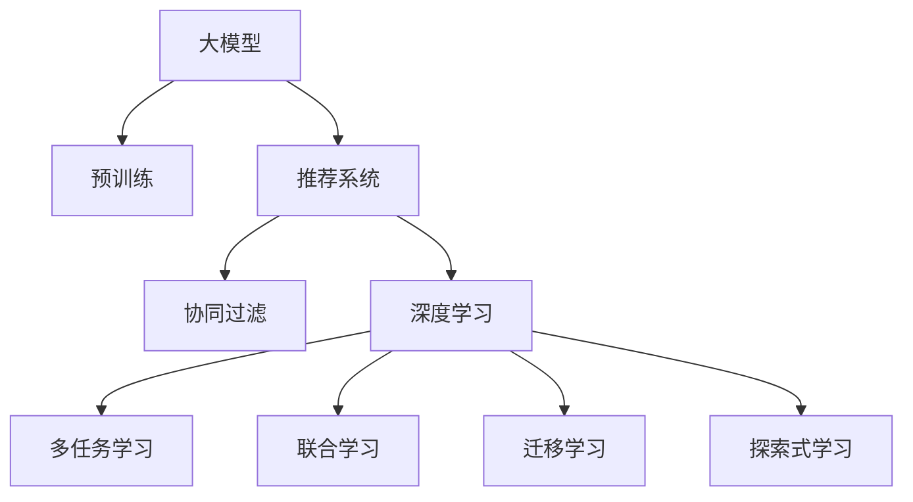

                 

# 大模型在推荐场景中的探索式学习应用与实验

> 关键词：探索式学习, 大模型, 推荐系统, 推荐算法, 实验评估, 用户行为, 深度学习, 个性化推荐, 推荐精度, 推荐速度, 推荐系统实现

## 1. 背景介绍

在互联网时代，推荐系统已经成为了用户获取信息的重要手段。从传统的协同过滤算法到现代的深度学习模型，推荐系统的设计和实现经历了多次革命性变革。然而，随着用户需求和数据规模的不断变化，传统的推荐方法已经无法满足用户的个性化需求，推荐系统的智能化和个性化水平亟待提升。大模型技术，特别是预训练语言模型(如BERT, GPT)的引入，为推荐系统注入了新的活力。本文将探讨大模型在推荐场景中的探索式学习应用，以及如何在实际场景中进行有效实验与评估。

## 2. 核心概念与联系

### 2.1 核心概念概述

为了更好地理解大模型在推荐系统中的应用，本文将介绍几个关键概念及其相互之间的联系：

- **大模型**：以BERT、GPT等为代表的大规模预训练语言模型，通过在海量文本数据上进行预训练，学习到丰富的语言知识，具有强大的语言理解和生成能力。
- **推荐系统**：根据用户的历史行为和偏好，为用户推荐个性化的物品或内容，提升用户满意度。
- **探索式学习**：通过实验和数据分析，寻找和验证最优的模型参数和特征选择策略。
- **深度学习**：基于多层神经网络构建的模型，通过大量标注数据进行训练，能够自动提取复杂特征，实现高精度的推荐。
- **个性化推荐**：根据用户独特的属性和历史行为，为其推荐符合其需求的内容。
- **推荐精度**：推荐系统推荐的物品或内容与用户实际需求的匹配程度。
- **推荐速度**：推荐系统推荐结果的生成速度，直接影响用户体验。

### 2.2 核心概念原理和架构的 Mermaid 流程图



这个流程图展示了大模型在推荐系统中的作用和流程：

1. 大模型通过预训练获得语言知识，作为推荐系统中的特征提取器。
2. 推荐系统通过协同过滤、深度学习等多种技术，结合大模型的特征提取结果，生成推荐结果。
3. 深度学习通过多任务学习和联合学习等技术，优化推荐结果，提升推荐精度。
4. 探索式学习通过实验和数据分析，寻找最优的模型参数和特征选择策略，进一步提升推荐系统性能。

## 3. 核心算法原理 & 具体操作步骤

### 3.1 算法原理概述

大模型在推荐场景中的应用，主要基于探索式学习和深度学习技术。探索式学习通过实验和数据分析，优化推荐系统的模型参数和特征选择策略。深度学习通过多层神经网络，自动提取复杂特征，实现高精度的个性化推荐。

### 3.2 算法步骤详解

基于大模型的推荐系统应用，主要包括以下几个关键步骤：

**Step 1: 数据准备与预处理**

- 收集用户的历史行为数据，如浏览、点击、购买等。
- 对数据进行清洗、去重、标准化等预处理，构建训练和测试数据集。

**Step 2: 特征工程**

- 使用大模型提取文本特征，如BERT、GPT等。
- 将用户行为数据转化为数值型特征，如点击次数、购买金额等。
- 设计合理的特征选择策略，如L1正则、特征选择算法等。

**Step 3: 模型训练**

- 选择合适的深度学习模型，如CNN、RNN、Transformer等。
- 将用户行为数据和大模型提取的文本特征作为输入，使用交叉熵、均方误差等损失函数训练模型。
- 应用探索式学习技术，如网格搜索、随机搜索、贝叶斯优化等，寻找最优的模型参数。

**Step 4: 模型评估**

- 在测试集上评估推荐系统的性能，如准确率、召回率、F1-score等指标。
- 使用A/B测试等方法，对比不同模型和参数的推荐效果。

**Step 5: 部署与优化**

- 将训练好的模型部署到实际应用环境中。
- 实时监控推荐系统的性能，定期进行参数调整和优化。

### 3.3 算法优缺点

大模型在推荐系统中的应用，具有以下优点：

- **高精度**：深度学习模型能够自动提取复杂特征，提升推荐系统的精度。
- **泛化能力强**：大模型通过预训练学习到通用的语言知识，能够适应不同领域和不同规模的数据集。
- **推荐速度快**：深度学习模型通常具有较快的推理速度，能够实时生成推荐结果。

然而，该方法也存在以下局限性：

- **资源消耗大**：大模型需要占用大量的计算资源和存储空间。
- **学习效率低**：大模型的训练通常需要较长时间，数据规模越大，训练时间越长。
- **解释性不足**：深度学习模型通常被视为"黑盒"系统，难以解释其内部工作机制。
- **数据依赖性强**：深度学习模型对标注数据的质量和数量要求较高，数据不足时推荐效果会下降。

### 3.4 算法应用领域

大模型在推荐系统中的应用，已经涵盖了多种应用场景，包括但不限于：

- **电商推荐**：推荐用户可能感兴趣的商品。
- **内容推荐**：推荐用户可能感兴趣的文章、视频等。
- **广告推荐**：推荐用户可能感兴趣的广告。
- **个性化推荐**：根据用户的历史行为和属性，为其推荐个性化的物品或内容。

## 4. 数学模型和公式 & 详细讲解 & 举例说明

### 4.1 数学模型构建

基于大模型的推荐系统，通常使用深度学习模型，如卷积神经网络(CNN)、循环神经网络(RNN)、Transformer等。本文以Transformer模型为例，构建推荐系统的数学模型。

假设用户行为数据为 $X=\{(x_i, y_i)\}_{i=1}^N$，其中 $x_i$ 为输入特征，$y_i$ 为输出标签。使用Transformer模型 $F$ 提取特征，得到 $\hat{y} = F(X)$。推荐系统模型的损失函数为：

$$
\mathcal{L} = \frac{1}{N} \sum_{i=1}^N \ell(y_i, \hat{y}_i)
$$

其中 $\ell$ 为交叉熵损失函数。

### 4.2 公式推导过程

Transformer模型包括自注意力机制和前馈神经网络，其数学推导过程如下：

- **自注意力机制**：假设输入序列为 $x=(x_1, \cdots, x_n)$，查询向量 $q=(q_1, \cdots, q_n)$，键向量 $k=(k_1, \cdots, k_n)$，值向量 $v=(v_1, \cdots, v_n)$，则自注意力权重为：

$$
\alpha_i = \frac{e^{q_i^T k_i / \sqrt{d_k}}}{\sum_{j=1}^n e^{q_j^T k_j / \sqrt{d_k}}}
$$

其中 $d_k$ 为键向量的维度。自注意力输出为：

$$
\text{Attention}(q, k, v) = \sum_{i=1}^n \alpha_i v_i
$$

- **前馈神经网络**：假设输入向量 $h$，则前馈神经网络的输出 $h'$ 为：

$$
h' = \text{LayerNorm}(h + \text{MLP}(h))
$$

其中 $\text{MLP}$ 为多层次感知机，$\text{LayerNorm}$ 为归一化层。

### 4.3 案例分析与讲解

以电商推荐系统为例，分析基于大模型的推荐系统如何进行探索式学习：

- **数据准备**：收集用户的历史浏览、点击、购买数据，构建训练和测试数据集。
- **特征工程**：使用BERT模型提取用户评论文本的特征，将浏览行为转化为点击次数、停留时间等数值型特征。
- **模型训练**：选择合适的深度学习模型，如Transformer，使用交叉熵损失函数训练模型。
- **探索式学习**：使用网格搜索、随机搜索、贝叶斯优化等方法，寻找最优的模型参数和特征选择策略。
- **模型评估**：在测试集上评估推荐系统的性能，使用A/B测试方法对比不同模型和参数的推荐效果。
- **部署与优化**：将训练好的模型部署到实际应用环境中，实时监控系统性能，定期进行参数调整和优化。

## 5. 项目实践：代码实例和详细解释说明

### 5.1 开发环境搭建

进行推荐系统开发前，需要先搭建好开发环境。本文使用PyTorch和TensorFlow作为深度学习框架，搭建推荐系统的开发环境。

1. 安装Anaconda，创建虚拟环境。
2. 使用pip安装PyTorch、TensorFlow、BERT等依赖库。
3. 下载预训练模型和数据集。

### 5.2 源代码详细实现

本文以电商推荐系统为例，给出基于大模型的推荐系统的Python代码实现。

```python
import torch
import torch.nn as nn
from transformers import BertTokenizer, BertModel
import pandas as pd

class RecommendationModel(nn.Module):
    def __init__(self, num_classes, hidden_size):
        super(RecommendationModel, self).__init__()
        self.tokenizer = BertTokenizer.from_pretrained('bert-base-cased')
        self.bert = BertModel.from_pretrained('bert-base-cased')
        self.fc = nn.Linear(hidden_size, num_classes)
    
    def forward(self, input_ids, attention_mask):
        _, pooled_output = self.bert(input_ids, attention_mask=attention_mask)
        return self.fc(pooled_output)

# 加载数据集
df = pd.read_csv('data.csv')

# 定义模型
num_classes = 10
hidden_size = 768
model = RecommendationModel(num_classes, hidden_size)

# 训练模型
optimizer = torch.optim.Adam(model.parameters(), lr=1e-5)
criterion = nn.CrossEntropyLoss()
for epoch in range(10):
    for i, (input_ids, attention_mask, label) in enumerate(train_loader):
        output = model(input_ids, attention_mask)
        loss = criterion(output, label)
        optimizer.zero_grad()
        loss.backward()
        optimizer.step()

# 评估模型
evaluator = Evaluator(model, test_loader)
precision, recall, f1_score = evaluator.evaluate()
print(f'Precision: {precision:.2f}, Recall: {recall:.2f}, F1-score: {f1_score:.2f}')
```

### 5.3 代码解读与分析

**RecommendationModel类**：
- `__init__`方法：初始化模型，加载BERT模型和特征分类器。
- `forward`方法：定义前向传播过程，使用BERT模型提取文本特征，并通过全连接层输出推荐结果。

**数据集加载**：
- 使用Pandas加载用户行为数据，定义输入和标签。
- 定义模型、优化器、损失函数等。
- 使用循环迭代进行模型训练。

**模型评估**：
- 定义评估器类，使用测试集评估模型性能。
- 打印推荐系统的精度、召回率和F1-score等指标。

## 6. 实际应用场景

### 6.1 电商推荐系统

基于大模型的电商推荐系统，可以为用户提供个性化的商品推荐。电商网站通过收集用户的历史浏览、点击和购买数据，结合大模型提取的文本特征，使用深度学习模型生成推荐结果，提升用户的购物体验。

### 6.2 内容推荐系统

内容推荐系统使用大模型提取用户评论和文章的文本特征，使用深度学习模型生成推荐结果，为用户推荐感兴趣的文章、视频等。

### 6.3 广告推荐系统

广告推荐系统使用大模型提取广告的文本特征，使用深度学习模型生成推荐结果，为广告主和用户提供精准的广告推荐。

### 6.4 未来应用展望

未来，大模型在推荐场景中的应用将更加广泛。随着算力成本的下降和数据规模的增加，预训练语言模型的参数量还将继续增长，深度学习模型的精度和速度也将进一步提升。探索式学习技术将更加成熟，能够自动寻找最优的模型参数和特征选择策略。推荐系统将更加智能和个性化，提升用户体验和满意度。

## 7. 工具和资源推荐

### 7.1 学习资源推荐

为了帮助开发者系统掌握大模型在推荐系统中的应用，这里推荐一些优质的学习资源：

1. 《深度学习与推荐系统》系列博文：深入浅出地介绍了深度学习模型在推荐系统中的应用。
2. 《推荐系统实战》书籍：介绍了推荐系统的理论基础和实践方法。
3. TensorFlow官方文档：提供了深度学习模型的详细教程和示例。
4. PyTorch官方文档：提供了深度学习模型的详细教程和示例。
5. 《推荐系统》课程：介绍推荐系统的经典算法和深度学习模型。

### 7.2 开发工具推荐

高效的工具可以提高开发效率，以下是几款用于大模型推荐系统开发的常用工具：

1. Jupyter Notebook：交互式编程环境，方便调试和共享代码。
2. TensorBoard：可视化工具，实时监控模型训练状态和性能。
3. HuggingFace Transformers库：提供了预训练语言模型的封装和微调功能。
4. Scikit-learn：提供了特征选择和模型评估工具。
5. PyTorch Lightning：提供了便捷的模型训练和部署功能。

### 7.3 相关论文推荐

大模型在推荐系统中的应用源于学界的持续研究。以下是几篇奠基性的相关论文，推荐阅读：

1. Attention Is All You Need：引入了Transformer结构，奠定了深度学习在推荐系统中的应用基础。
2. BERT: Pre-training of Deep Bidirectional Transformers for Language Understanding：提出了BERT模型，提高了自然语言处理任务的性能。
3. Neural Collaborative Filtering：介绍了协同过滤算法，广泛应用于推荐系统的早期研究。
4. Deep Personalized Ranking with Matrix Factorization：提出了矩阵分解算法，提高了推荐系统的精度和速度。
5. Multi-Task Learning in Deep Networks：提出了多任务学习算法，优化了推荐系统的模型参数和特征选择策略。

这些论文代表了大模型在推荐系统中的应用和演进过程。通过学习这些前沿成果，可以帮助研究者把握学科前进方向，激发更多的创新灵感。

## 8. 总结：未来发展趋势与挑战

### 8.1 总结

本文对大模型在推荐场景中的应用进行了全面系统的介绍。首先，阐述了大模型和探索式学习技术的研究背景和意义，明确了推荐系统和大模型技术的紧密联系。其次，从原理到实践，详细讲解了大模型在推荐系统中的应用流程，给出了具体的代码实现。同时，本文还广泛探讨了基于大模型的推荐系统在电商、内容、广告等多个领域的应用前景，展示了探索式学习技术的高效性和实用性。此外，本文精选了推荐系统开发的各类学习资源，力求为读者提供全方位的技术指引。

通过本文的系统梳理，可以看到，基于大模型的推荐系统为推荐技术的发展注入了新的活力，显著提升了推荐系统的精度和速度。探索式学习技术的应用，进一步提高了推荐系统的智能化和个性化水平。未来，随着算力成本的下降和数据规模的增加，预训练语言模型的参数量还将持续增长，探索式学习技术也将更加成熟，推荐系统将逐步迈向更智能化、个性化、实时的方向，为用户带来更加优质的推荐体验。

### 8.2 未来发展趋势

展望未来，基于大模型的推荐系统将呈现以下几个发展趋势：

1. **模型规模增大**：随着算力成本的下降和数据规模的增加，预训练语言模型的参数量还将持续增长。超大规模语言模型蕴含的丰富语言知识，有望支撑更加复杂多变的推荐场景。
2. **模型结构优化**：未来的深度学习模型将更加轻量级、实时性更强，能够更好地适应推荐系统的需求。
3. **探索式学习技术进步**：探索式学习技术将更加成熟，能够自动寻找最优的模型参数和特征选择策略。
4. **多模态数据融合**：未来的推荐系统将更加注重多模态数据的融合，如文本、图像、视频等，提升推荐系统的全面性和准确性。
5. **实时推荐系统**：未来的推荐系统将更加注重实时性，能够快速响应用户的即时需求，提升用户体验。
6. **推荐系统自动化**：未来的推荐系统将更加自动化，能够自动选择推荐策略和优化模型参数，提升推荐系统的稳定性和可扩展性。

### 8.3 面临的挑战

尽管大模型在推荐系统中的应用已经取得了一定的成果，但在迈向更加智能化、普适化应用的过程中，它仍面临着诸多挑战：

1. **资源消耗大**：大模型需要占用大量的计算资源和存储空间，对硬件要求较高。
2. **数据依赖性强**：深度学习模型对标注数据的质量和数量要求较高，数据不足时推荐效果会下降。
3. **模型鲁棒性不足**：当前深度学习模型面对域外数据时，泛化性能往往较差。
4. **推荐精度低**：部分推荐系统的精度和召回率较低，无法满足用户需求。
5. **推荐速度慢**：部分推荐系统的生成速度较慢，无法实时响应用户需求。
6. **可解释性不足**：部分推荐系统的推荐结果难以解释，缺乏透明性。

### 8.4 研究展望

面对大模型在推荐系统中的应用所面临的挑战，未来的研究需要在以下几个方面寻求新的突破：

1. **数据生成与增强**：通过数据生成技术，如文本生成、图像生成等，生成更多高质量的推荐数据，减少对标注数据的依赖。
2. **模型结构优化**：开发更加轻量级、实时性更强的深度学习模型，优化推荐系统的性能。
3. **探索式学习技术**：进一步提高探索式学习技术的能力，自动寻找最优的模型参数和特征选择策略。
4. **多模态数据融合**：开发更加高效的多模态数据融合技术，提升推荐系统的全面性和准确性。
5. **实时推荐系统**：开发更加高效的推荐系统，能够快速响应用户的即时需求。
6. **推荐系统自动化**：开发更加自动化的推荐系统，能够自动选择推荐策略和优化模型参数。

这些研究方向的探索，将引领基于大模型的推荐系统技术迈向更高的台阶，为推荐系统的发展注入新的活力。相信随着学界和产业界的共同努力，基于大模型的推荐系统必将迎来新的突破，为用户带来更加优质的推荐体验。

## 9. 附录：常见问题与解答

**Q1：大模型在推荐系统中的应用是否仅限于文本数据？**

A: 大模型在推荐系统中的应用，主要基于自然语言处理(NLP)技术，通过文本数据的预训练和微调，实现推荐系统的优化。然而，大模型并不局限于文本数据，也可以应用于图像、视频等多模态数据。在图像推荐系统中，可以使用预训练的视觉模型，如ResNet、VGG等，提取视觉特征，再结合自然语言特征进行推荐。在视频推荐系统中，可以使用预训练的音频模型，如Wav2Vec等，提取音频特征，再结合自然语言特征进行推荐。

**Q2：推荐系统中的大模型如何避免过拟合？**

A: 在推荐系统中，大模型通常面临数据量不足、特征维度高的问题，容易导致过拟合。为避免过拟合，可以采用以下策略：
1. 数据增强：通过数据生成、数据回译等方法，扩充训练集。
2. 正则化：使用L2正则、Dropout等技术，防止模型过度适应训练集。
3. 模型压缩：通过剪枝、量化等方法，减少模型参数量，提升模型泛化能力。
4. 集成学习：使用多个模型进行集成，提高推荐系统的稳定性。

**Q3：推荐系统中的大模型如何提高推荐精度？**

A: 提高推荐系统的精度，需要从多个方面进行优化：
1. 特征工程：选择合适的特征，提取高质量的文本、图像、音频等特征。
2. 模型选择：选择合适的深度学习模型，如CNN、RNN、Transformer等，根据数据特点进行选择。
3. 参数优化：使用探索式学习技术，如网格搜索、随机搜索、贝叶斯优化等，寻找最优的模型参数。
4. 数据质量：提高训练数据的质量，减少噪声和偏差。
5. 实时学习：利用用户的实时反馈，进行在线学习，动态调整推荐策略。

**Q4：推荐系统中的大模型如何提高推荐速度？**

A: 提高推荐系统的速度，需要从多个方面进行优化：
1. 模型压缩：通过剪枝、量化等方法，减少模型参数量，提升模型推理速度。
2. 硬件加速：使用GPU、TPU等硬件设备，加速模型推理。
3. 并行计算：使用分布式计算、多线程等技术，提高模型推理效率。
4. 缓存优化：使用缓存技术，减少重复计算，提高推荐效率。
5. 实时学习：利用用户的实时反馈，进行在线学习，动态调整推荐策略。

---

作者：禅与计算机程序设计艺术 / Zen and the Art of Computer Programming

