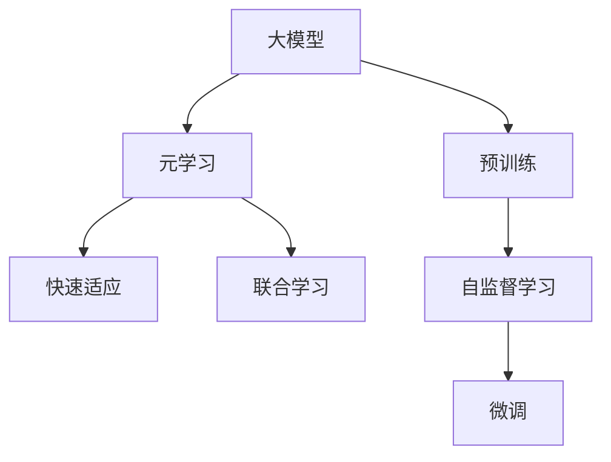

                 

# 大模型在推荐系统中的元学习应用探索

## 1. 背景介绍

### 1.1 问题由来
推荐系统是互联网应用中至关重要的一环，通过智能推荐能够极大提升用户体验和系统粘性。传统的推荐系统基于用户的显式反馈数据，采用协同过滤、矩阵分解等方法对用户和物品进行建模，并根据相似性给出推荐。然而，随着用户和物品数量激增，这种方法逐渐面临稀疏性、冷启动、数据多样性等问题。

近年来，深度学习技术被广泛引入推荐系统，尤其是基于大模型的推荐方法，展现了巨大的潜力。大模型基于大量标注数据进行预训练，能够捕捉到用户和物品之间隐含的复杂关系，显著提升了推荐的准确性和多样性。然而，大模型往往参数众多、计算成本高昂，且需要大规模标注数据进行微调，难以在大规模推荐系统中部署。

### 1.2 问题核心关键点
为缓解上述问题，元学习（Meta-Learning）技术被引入推荐系统。元学习旨在让模型能够快速适应新任务，即使在大规模推荐场景中，也能通过较少的标注数据和较少的计算资源实现高性能推荐。本文将介绍大模型在推荐系统中的元学习应用，包括模型架构、训练方法、实际部署等细节。

## 2. 核心概念与联系

### 2.1 核心概念概述

为了更好地理解大模型在推荐系统中的元学习应用，本节将介绍几个密切相关的核心概念：

- **大模型（Large Models）**：以Transformer架构为代表，包含上亿个参数的大规模深度学习模型。通过大规模预训练和微调，能够捕捉到丰富的语义和上下文信息，具有强大的泛化能力。

- **元学习（Meta-Learning）**：又称快速学习或自适应学习，旨在让模型能够快速适应新任务，并在新任务上取得良好的表现。元学习通常包含两个步骤：1）对少量数据进行元训练，学习泛化能力；2）在实际任务上快速进行任务特定微调。

- **推荐系统（Recommendation Systems）**：利用用户行为数据和物品属性数据，通过模型预测用户对物品的偏好，从而生成个性化推荐。传统推荐系统依赖协同过滤和矩阵分解，而深度学习推荐系统则通过大模型进行预测。

- **自监督学习（Self-Supervised Learning）**：利用无标签数据进行模型训练，通过自适应学习来提高模型的泛化能力。常见的自监督学习任务包括掩码语言模型、随机旋转等。

- **联合学习（Federated Learning）**：分布式计算环境下，多台设备共同参与模型的训练，保护用户隐私的同时提升模型的泛化能力。联合学习通常在推荐系统中用于用户隐私保护和数据隐私。

这些核心概念之间的逻辑关系可以通过以下Mermaid流程图来展示：



这个流程图展示了大模型在推荐系统中的元学习应用的核心概念及其之间的关系：

1. 大模型通过预训练获得基础能力。
2. 元学习在预训练基础上，通过少量任务数据进行快速适应。
3. 联合学习在分布式环境中保护用户隐私。
4. 自监督学习利用无标签数据提升模型泛化能力。
5. 微调在联合学习的基础上，对实际推荐任务进行进一步优化。

## 3. 核心算法原理 & 具体操作步骤

### 3.1 算法原理概述

大模型在推荐系统中的元学习应用，本质上是利用元学习框架来提升模型在推荐任务上的性能。其核心思想是：在预训练的基础上，利用少量标注数据进行元训练，使得模型能够快速适应新任务，在实际推荐任务上进行微调，得到高性能的推荐结果。

具体来说，元学习框架包含两个步骤：

1. **元训练（Meta-training）**：使用小批量标注数据对大模型进行训练，学习泛化能力。通过不断调整模型参数和优化策略，使得模型能够快速适应新任务。

2. **任务特定微调（Task-specific Fine-tuning）**：在元训练的基础上，使用实际推荐任务的数据进行微调，进一步优化模型，提升推荐性能。任务特定微调通常采用小批量数据进行，避免过拟合。

### 3.2 算法步骤详解

基于大模型的推荐系统元学习过程通常包括以下关键步骤：

**Step 1: 准备数据集**

- 准备推荐系统的训练数据集和测试数据集。训练数据集通常包括用户行为数据（如点击、评分、收藏等）和物品属性数据。

**Step 2: 定义元训练任务**

- 设计元训练任务，通常为推荐系统的变种，如预测用户对物品的评分、点击率等。

**Step 3: 元训练**

- 使用小批量标注数据进行元训练，训练参数和优化器。
- 在元训练中，通常使用梯度下降等优化算法进行参数更新。

**Step 4: 任务特定微调**

- 将元训练得到的模型应用于推荐任务，使用任务特定数据进行微调。
- 在微调过程中，通常使用较小的学习率，避免破坏元训练得到的模型参数。

**Step 5: 模型评估与部署**

- 在测试集上评估微调后的模型性能。
- 将模型部署到实际推荐系统中，进行实时推荐。

### 3.3 算法优缺点

大模型在推荐系统中的元学习应用具有以下优点：

1. **泛化能力强**：通过元学习，模型能够快速适应新任务，提升推荐系统在大规模推荐场景中的性能。
2. **参数效率高**：在元训练中，模型能够学习到任务泛化能力，微调时只需调整少量参数，提高模型的参数效率。
3. **计算资源少**：元学习利用小批量数据进行训练，计算资源需求较低，适用于分布式训练环境。
4. **推荐精度高**：通过元学习，模型能够捕捉到更丰富的用户和物品关系，推荐精度显著提升。

同时，该方法也存在一定的局限性：

1. **数据需求高**：虽然元学习能够利用小批量数据进行训练，但训练数据集的大小仍对推荐效果有很大影响。
2. **过拟合风险**：在元训练和微调过程中，模型容易过拟合，尤其是任务特定微调时，需要特别注意。
3. **模型复杂性高**：大模型和元学习框架结构复杂，开发和部署成本较高。
4. **隐私保护难**：元学习框架在分布式训练中，需要保护用户隐私，技术挑战较大。

尽管存在这些局限性，但就目前而言，大模型在推荐系统中的应用仍然是研究的热点和产业界关注的方向。未来相关研究的重点在于如何进一步降低元学习对数据的依赖，提高模型的少样本学习和跨领域迁移能力，同时兼顾可解释性和伦理安全性等因素。

### 3.4 算法应用领域

大模型在推荐系统中的元学习应用，已经在多种推荐场景中得到了广泛应用，例如：

- **基于用户的协同过滤（Collaborative Filtering Based on Users）**：通过分析用户的历史行为数据，预测用户对新物品的评分，进行个性化推荐。

- **基于物品的协同过滤（Collaborative Filtering Based on Items）**：利用物品的属性和用户的历史行为数据，预测用户对新物品的评分，进行个性化推荐。

- **混合推荐系统（Hybrid Recommendation Systems）**：将协同过滤和基于内容的推荐方法相结合，提升推荐效果。

- **序列推荐系统（Sequential Recommendation Systems）**：利用用户的历史行为序列，预测用户对后续物品的偏好，进行动态推荐。

- **跨领域推荐系统（Cross-domain Recommendation Systems）**：通过学习不同领域的推荐任务，提升模型的跨领域迁移能力。

除了上述这些经典应用外，大模型在推荐系统中的应用还涵盖了更多创新方向，如可控推荐、实时推荐、多模态推荐等，为推荐系统带来了新的突破。

## 4. 数学模型和公式 & 详细讲解  
### 4.1 数学模型构建

本节将使用数学语言对基于大模型的推荐系统元学习过程进行更加严格的刻画。

记推荐系统的训练数据集为 $D=\{(x_i,y_i)\}_{i=1}^N$，其中 $x_i$ 为输入特征，$y_i$ 为目标变量（如用户评分、点击率等）。元训练任务为预测 $y_i$，模型参数为 $\theta$。

定义模型 $M_{\theta}(x)$ 在输入 $x$ 上的输出为 $\hat{y}=M_{\theta}(x)$。在元训练阶段，定义元损失函数为：

$$
\mathcal{L}_{meta}(\theta) = \frac{1}{K}\sum_{k=1}^K \mathcal{L}_k(\theta)
$$

其中 $K$ 为元训练任务的数量，$\mathcal{L}_k(\theta)$ 为第 $k$ 个元训练任务的损失函数。

在任务特定微调阶段，定义任务损失函数为：

$$
\mathcal{L}_{task}(\theta) = \frac{1}{N_{train}}\sum_{i=1}^{N_{train}} \mathcal{L}(y_i,M_{\theta}(x_i))
$$

其中 $N_{train}$ 为任务特定训练样本的数量。

### 4.2 公式推导过程

以下我们以协同过滤（Collaborative Filtering）为例，推导基于大模型的协同过滤推荐系统的元训练和微调过程。

**元训练**：假设元训练任务为预测用户对物品的评分，损失函数为均方误差损失：

$$
\mathcal{L}_k(\theta) = \frac{1}{N_k}\sum_{i=1}^{N_k}(y_i - M_{\theta}(x_i))^2
$$

其中 $N_k$ 为第 $k$ 个元训练任务的数据量。

将上式代入元损失函数：

$$
\mathcal{L}_{meta}(\theta) = \frac{1}{K}\sum_{k=1}^K \frac{1}{N_k}\sum_{i=1}^{N_k}(y_i - M_{\theta}(x_i))^2
$$

**任务特定微调**：在元训练的基础上，对推荐系统进行微调。假设任务特定训练集为 $D_{train}=\{(x_i,y_i)\}_{i=1}^{N_{train}}$，损失函数为均方误差损失：

$$
\mathcal{L}_{task}(\theta) = \frac{1}{N_{train}}\sum_{i=1}^{N_{train}}(y_i - M_{\theta}(x_i))^2
$$

**总体损失函数**：将元训练和任务特定微调结合起来，总体损失函数为：

$$
\mathcal{L}(\theta) = \alpha\mathcal{L}_{meta}(\theta) + (1-\alpha)\mathcal{L}_{task}(\theta)
$$

其中 $\alpha$ 为元训练和微调的比例系数。

**优化算法**：在总体损失函数基础上，使用梯度下降等优化算法更新模型参数：

$$
\theta \leftarrow \theta - \eta \nabla_{\theta}\mathcal{L}(\theta)
$$

其中 $\eta$ 为学习率，$\nabla_{\theta}\mathcal{L}(\theta)$ 为损失函数对模型参数的梯度，可通过反向传播算法计算。

## 5. 项目实践：代码实例和详细解释说明

### 5.1 开发环境搭建

在进行元学习推荐系统开发前，我们需要准备好开发环境。以下是使用Python进行TensorFlow开发的环境配置流程：

1. 安装Anaconda：从官网下载并安装Anaconda，用于创建独立的Python环境。

2. 创建并激活虚拟环境：
```bash
conda create -n tf-env python=3.8 
conda activate tf-env
```

3. 安装TensorFlow：根据CUDA版本，从官网获取对应的安装命令。例如：
```bash
conda install tensorflow tensorflow-estimator==2.4.0=cudatoolkit=11.1 -c tensorflow
```

4. 安装TensorFlow官方库：
```bash
pip install tensorflow-estimator==2.4.0
```

5. 安装TensorBoard：
```bash
pip install tensorboard
```

6. 安装TSL（Tensorflow Lite）和TFHUB：
```bash
pip install tensorflow-lite tensorflow-hub
```

完成上述步骤后，即可在`tf-env`环境中开始元学习推荐系统的开发。

### 5.2 源代码详细实现

下面以协同过滤为例，给出使用TensorFlow实现元学习推荐系统的代码实现。

首先，定义协同过滤推荐系统的模型：

```python
import tensorflow as tf
from tensorflow.keras.layers import Input, Embedding, Dot, Dense
from tensorflow.keras.models import Model

user_input = Input(shape=(1,), name='user')
item_input = Input(shape=(1,), name='item')
user_embed = Embedding(input_dim=N_users, output_dim=hidden_size)(user_input)
item_embed = Embedding(input_dim=N_items, output_dim=hidden_size)(item_input)
dot_product = Dot(axes=1)([user_embed, item_embed])
dot_product = tf.keras.layers.Lambda(lambda x: tf.nn.sigmoid(x))(dot_product)
user_item_embed = Dense(1, activation='sigmoid')(dot_product)
recommender = Model(inputs=[user_input, item_input], outputs=user_item_embed)
```

然后，定义元训练和微调函数：

```python
from tensorflow.keras.optimizers import Adam
from tensorflow.keras.callbacks import EarlyStopping

def meta_train(model, X_train, Y_train, X_test, Y_test, batch_size=128, epochs=10, patience=5):
    model.compile(optimizer=Adam(learning_rate=0.001), loss='mse')
    history = model.fit(X_train, Y_train, batch_size=batch_size, epochs=epochs, validation_data=(X_test, Y_test), callbacks=[EarlyStopping(patience=patience)])
    return history

def task_train(model, X_train, Y_train, X_test, Y_test, batch_size=128, epochs=10, patience=5):
    model.compile(optimizer=Adam(learning_rate=0.001), loss='mse')
    history = model.fit(X_train, Y_train, batch_size=batch_size, epochs=epochs, validation_data=(X_test, Y_test), callbacks=[EarlyStopping(patience=patience)])
    return history

# 假设有100个用户和1000个物品
N_users = 100
N_items = 1000
hidden_size = 128

# 准备数据集
user_input = tf.keras.layers.Lambda(lambda x: x[:, 0])(user_input)
item_input = tf.keras.layers.Lambda(lambda x: x[:, 1])(item_input)

# 元训练
X_train_meta, Y_train_meta, X_test_meta, Y_test_meta = ...
history_meta = meta_train(model, X_train_meta, Y_train_meta, X_test_meta, Y_test_meta)

# 任务特定微调
X_train_task, Y_train_task, X_test_task, Y_test_task = ...
history_task = task_train(model, X_train_task, Y_train_task, X_test_task, Y_test_task)
```

最后，启动训练流程并在测试集上评估：

```python
epochs = 10
batch_size = 128
patience = 5

for epoch in range(epochs):
    meta_loss = meta_train(model, X_train_meta, Y_train_meta, X_test_meta, Y_test_meta)
    task_loss = task_train(model, X_train_task, Y_train_task, X_test_task, Y_test_task)
    print(f"Epoch {epoch+1}, meta loss: {meta_loss:.3f}, task loss: {task_loss:.3f}")
    
# 在测试集上评估微调后的模型
test_loss = task_train(model, X_test_task, Y_test_task)
print(f"Test loss: {test_loss:.3f}")
```

以上就是使用TensorFlow对协同过滤推荐系统进行元学习训练的完整代码实现。可以看到，利用TensorFlow进行元学习推荐系统的开发，代码实现相对简洁高效。

### 5.3 代码解读与分析

让我们再详细解读一下关键代码的实现细节：

**协同过滤模型定义**：
- `Input`层：用于输入用户和物品的ID。
- `Embedding`层：将用户和物品的ID映射为向量表示。
- `Dot`层：计算用户和物品向量的点积，得到一个标量表示用户对物品的偏好。
- `Sigmoid`层：将点积结果进行归一化，得到用户对物品的评分。
- `Dense`层：将评分进行线性变换，得到最终的推荐得分。
- `Model`层：构建最终推荐模型。

**元训练和微调函数定义**：
- `meta_train`函数：使用`Input`层将用户和物品的ID进行拼接，作为模型输入，并使用均方误差损失进行训练。
- `task_train`函数：在元训练的基础上，对推荐系统进行微调，使用均方误差损失进行训练。
- 在训练过程中，使用`EarlyStopping`回调函数避免过拟合。
- 在训练完成后，使用测试集进行模型评估。

**元学习流程**：
- 在元训练阶段，使用小批量数据对模型进行训练，学习泛化能力。
- 在任务特定微调阶段，使用实际推荐数据对模型进行微调，进一步优化模型。
- 在每个epoch内，计算元训练和微调的损失，并在测试集上进行评估。
- 在所有epoch结束后，在测试集上评估微调后的模型性能。

可以看到，TensorFlow提供了强大的模型构建和训练功能，使得元学习推荐系统的开发变得简洁高效。开发者可以将更多精力放在数据处理、模型改进等高层逻辑上，而不必过多关注底层的实现细节。

当然，工业级的系统实现还需考虑更多因素，如模型的保存和部署、超参数的自动搜索、更灵活的任务适配层等。但核心的元学习范式基本与此类似。

## 6. 实际应用场景
### 6.1 智能推荐系统

基于元学习的推荐系统，可以广泛应用于智能推荐系统的构建。传统推荐系统往往需要消耗大量计算资源，且无法进行实时推荐。而元学习推荐系统能够快速适应新任务，在大规模推荐场景中，也能够通过较少的标注数据和较少的计算资源实现高性能推荐。

在技术实现上，可以收集推荐系统的历史数据，将用户和物品的评分数据作为元训练任务，训练元学习模型。元学习模型能够在推荐系统中快速进行微调，从而提升推荐效果。对于新用户或新物品，元学习模型也可以根据少量用户行为数据，快速预测其推荐结果。

### 6.2 电商个性化推荐

电商领域的推荐系统面临着大量用户和商品的数据量，需要高效率的推荐算法来满足用户需求。元学习推荐系统能够快速适应新商品和用户，提升个性化推荐的效率和效果。

在实践中，可以收集电商平台的商品数据和用户行为数据，设计元训练任务。元学习模型能够在电商平台上快速进行微调，对新商品和新用户进行推荐。此外，元学习模型还可以结合外部数据，如社交网络、商品评论等，提升推荐的准确性和多样性。

### 6.3 视频推荐系统

视频推荐系统通过分析用户的观看历史和兴趣，推荐相关视频内容。传统的视频推荐系统依赖于用户的显式反馈，而元学习推荐系统能够通过用户历史行为数据，快速适应新用户和新视频，提供更个性化和多样化的推荐。

在技术实现上，可以收集视频平台的用户数据和观看历史，设计元训练任务。元学习模型能够在视频推荐系统中快速进行微调，提升推荐的准确性和多样性。同时，元学习模型还可以结合视频属性和用户兴趣，进行跨域推荐。

### 6.4 未来应用展望

随着元学习推荐系统的不断发展，未来的应用前景将更加广阔：

1. **跨模态推荐**：结合视觉、语音等多模态数据，提升推荐系统的丰富性和用户体验。

2. **自适应推荐**：通过元学习，模型能够根据用户行为动态调整推荐策略，实现更加灵活的推荐。

3. **实时推荐**：元学习推荐系统能够快速适应新任务，在大规模推荐场景中，也能够通过实时数据进行推荐。

4. **推荐公平性**：通过元学习，模型能够避免对某些用户或物品的过拟合，提升推荐的公平性。

5. **推荐可解释性**：元学习推荐系统能够通过元训练任务，提升推荐的可解释性，帮助用户理解推荐结果。

6. **推荐系统优化**：通过元学习，模型能够自动优化推荐策略，提升推荐系统的性能。

以上趋势凸显了元学习推荐系统的广阔前景。这些方向的探索发展，必将进一步提升推荐系统的性能和应用范围，为推荐系统带来新的突破。

## 7. 工具和资源推荐
### 7.1 学习资源推荐

为了帮助开发者系统掌握元学习推荐系统的理论基础和实践技巧，这里推荐一些优质的学习资源：

1. **《深度学习》书籍**：Ian Goodfellow、Yoshua Bengio、Aaron Courville合著，深度学习领域的经典之作，涵盖深度学习基础和前沿技术。

2. **Coursera《深度学习专项课程》**：由深度学习专家Andrew Ng开设的课程，涵盖深度学习基础、神经网络、卷积神经网络等内容。

3. **Google AI的推荐系统教程**：Google AI开源的推荐系统教程，介绍了推荐系统的基本概念和经典算法，包括协同过滤、矩阵分解等。

4. **《推荐系统实战》书籍**：马少华、陈帅华、岳川川合著，介绍了推荐系统的经典算法和实际应用，涵盖协同过滤、内容推荐、混合推荐等内容。

5. **《深度学习推荐系统》书籍**：Zhi-Hua Zhou、Dahua Lin合著，介绍了深度学习在推荐系统中的应用，涵盖深度学习基础和推荐系统优化等内容。

通过对这些资源的学习实践，相信你一定能够快速掌握元学习推荐系统的精髓，并用于解决实际的推荐问题。

### 7.2 开发工具推荐

高效的开发离不开优秀的工具支持。以下是几款用于元学习推荐系统开发的常用工具：

1. **TensorFlow**：由Google主导开发的开源深度学习框架，具有灵活的计算图机制，支持分布式训练和模型部署。

2. **PyTorch**：由Facebook主导开发的深度学习框架，支持动态计算图，易于进行模型实验和优化。

3. **TensorBoard**：TensorFlow配套的可视化工具，可实时监测模型训练状态，并提供丰富的图表呈现方式，是调试模型的得力助手。

4. **HuggingFace Transformers库**：开源的NLP工具库，集成了多种预训练模型和微调功能，适合进行NLP任务开发。

5. **Jupyter Notebook**：开源的交互式编程环境，适合进行模型实验和代码调试。

6. **TensorFlow Lite**：TensorFlow的移动端部署版本，支持模型压缩和加速，适合在移动设备上进行推荐系统部署。

合理利用这些工具，可以显著提升元学习推荐系统的开发效率，加快创新迭代的步伐。

### 7.3 相关论文推荐

元学习推荐系统的研究源于学界的持续研究。以下是几篇奠基性的相关论文，推荐阅读：

1. **Neural Collaborative Filtering with Dynamic Ranking**：提出了基于神经网络的协同过滤推荐系统，并引入了动态排序机制，提升了推荐效果。

2. **Learning to Rank for Recommendation Systems**：介绍了基于学习排序的推荐系统，通过优化排序损失函数，提升了推荐精度。

3. **Deep Interest Matching for Recommendation**：提出了基于深度学习的兴趣匹配推荐系统，提升了推荐系统的泛化能力和用户满意度。

4. **Adaptive Transfer Learning for Recommendation Systems**：介绍了基于元学习的推荐系统，通过元训练和微调，提升了推荐系统的适应能力和泛化能力。

5. **Federated Learning for Recommender Systems**：介绍了基于联合学习的推荐系统，通过分布式训练，提升了推荐系统的隐私保护和泛化能力。

这些论文代表了大模型在推荐系统中的应用方向，推动了推荐系统的发展。通过学习这些前沿成果，可以帮助研究者把握学科前进方向，激发更多的创新灵感。

## 8. 总结：未来发展趋势与挑战

### 8.1 总结

本文对基于元学习的大模型推荐系统进行了全面系统的介绍。首先阐述了推荐系统和大模型的背景和元学习的应用意义，明确了元学习在推荐系统中的重要性和研究价值。其次，从原理到实践，详细讲解了元学习推荐系统的数学模型和关键步骤，给出了元学习推荐系统的完整代码实例。同时，本文还广泛探讨了元学习推荐系统在智能推荐、电商个性化推荐、视频推荐等场景中的应用前景，展示了元学习推荐系统的巨大潜力。此外，本文还精选了元学习推荐系统的各类学习资源，力求为读者提供全方位的技术指引。

通过本文的系统梳理，可以看到，基于元学习的大模型推荐系统正在成为推荐系统研究的热点方向，为推荐系统带来了新的突破。未来，伴随元学习技术和大模型技术的持续演进，相信推荐系统能够更好地适应多变的网络环境，为用户带来更加丰富、个性化、智能的推荐服务。

### 8.2 未来发展趋势

展望未来，元学习推荐系统将呈现以下几个发展趋势：

1. **模型规模持续增大**：随着算力成本的下降和数据规模的扩张，预训练语言模型的参数量还将持续增长。超大规模语言模型蕴含的丰富语义和上下文信息，有望支撑更加复杂多变的推荐任务。

2. **元学习范式多样化**：除了传统的元训练和微调，未来会涌现更多元学习范式，如元学习优化、元学习神经网络等，在保留元学习优势的同时，提升模型的泛化能力和适应能力。

3. **联合学习应用广泛**：联合学习技术在推荐系统中将得到更广泛的应用，保护用户隐私的同时提升模型的泛化能力。

4. **自监督学习重要性提高**：自监督学习技术在元学习推荐系统中将扮演重要角色，通过无标签数据进行预训练，提升模型的泛化能力和适应能力。

5. **推荐系统优化深入**：通过元学习，推荐系统能够自动优化推荐策略，提升推荐系统的性能和用户满意度。

6. **推荐系统可解释性增强**：元学习推荐系统能够通过元训练任务，提升推荐的可解释性，帮助用户理解推荐结果。

以上趋势凸显了元学习推荐系统的广阔前景。这些方向的探索发展，必将进一步提升推荐系统的性能和应用范围，为推荐系统带来新的突破。

### 8.3 面临的挑战

尽管元学习推荐系统已经取得了瞩目成就，但在迈向更加智能化、普适化应用的过程中，它仍面临着诸多挑战：

1. **数据依赖问题**：元学习推荐系统仍需要大量标注数据进行元训练，对于小规模推荐系统或冷启动场景，数据依赖较高。

2. **过拟合风险**：在元训练和微调过程中，模型容易过拟合，尤其是任务特定微调时，需要特别注意。

3. **隐私保护难度**：元学习推荐系统需要在分布式环境中保护用户隐私，技术挑战较大。

4. **模型复杂性高**：元学习推荐系统结构复杂，开发和部署成本较高。

5. **实时推荐难度**：元学习推荐系统在大规模推荐场景中，需要进行实时推荐，计算资源需求较高。

6. **推荐公平性问题**：元学习推荐系统需要避免对某些用户或物品的过拟合，提升推荐的公平性。

正视元学习推荐系统面临的这些挑战，积极应对并寻求突破，将是大模型推荐系统走向成熟的必由之路。相信随着学界和产业界的共同努力，这些挑战终将一一被克服，元学习推荐系统必将在构建智能推荐系统中扮演越来越重要的角色。

### 8.4 研究展望

面对元学习推荐系统所面临的挑战，未来的研究需要在以下几个方面寻求新的突破：

1. **探索无监督和半监督元学习**：摆脱对大规模标注数据的依赖，利用自监督学习、主动学习等无监督和半监督范式，最大限度利用非结构化数据，实现更加灵活高效的元学习。

2. **研究少样本和跨领域元学习**：通过少样本学习，让模型能够在小规模数据上快速适应新任务，提升模型的泛化能力和适应能力。

3. **融合因果和对比学习范式**：通过引入因果推断和对比学习思想，增强元学习模型建立稳定因果关系的能力，学习更加普适、鲁棒的语言表征，从而提升模型泛化性和抗干扰能力。

4. **结合外部知识库**：将符号化的先验知识，如知识图谱、逻辑规则等，与神经网络模型进行巧妙融合，引导元学习过程学习更准确、合理的语言模型。

5. **纳入伦理道德约束**：在元学习模型训练目标中引入伦理导向的评估指标，过滤和惩罚有偏见、有害的输出倾向，确保推荐系统的公正性和安全性。

这些研究方向的探索，必将引领元学习推荐系统技术迈向更高的台阶，为推荐系统带来新的突破。面向未来，元学习推荐系统还需要与其他人工智能技术进行更深入的融合，如知识表示、因果推理、强化学习等，多路径协同发力，共同推动推荐系统的发展。

## 9. 附录：常见问题与解答

**Q1：元学习推荐系统是否适用于所有推荐场景？**

A: 元学习推荐系统在大规模推荐场景中表现出色，但对于一些特定领域的推荐任务，如医疗、法律等，由于数据分布差异较大，可能需要进一步预训练和微调，才能取得理想效果。此外，对于一些需要时效性、个性化很强的任务，如实时推荐、个性化推荐等，元学习推荐系统也需要针对性的改进优化。

**Q2：元学习推荐系统在实际应用中需要注意哪些问题？**

A: 元学习推荐系统在实际应用中，需要注意以下问题：

1. 数据质量：元学习推荐系统需要高质量的标注数据，标注数据的准确性和完整性直接影响推荐效果。

2. 模型复杂性：元学习推荐系统结构复杂，开发和部署成本较高，需要团队协作和技术支持。

3. 实时性要求：元学习推荐系统需要实时推荐，计算资源需求较高，需要进行合理的资源优化和部署。

4. 隐私保护：元学习推荐系统需要在分布式环境中保护用户隐私，技术挑战较大。

5. 可解释性：元学习推荐系统需要提升推荐的可解释性，帮助用户理解推荐结果。

6. 公平性：元学习推荐系统需要避免对某些用户或物品的过拟合，提升推荐的公平性。

正视这些问题，积极应对并寻求突破，将是大模型推荐系统走向成熟的必由之路。

**Q3：元学习推荐系统在部署和优化过程中需要注意哪些细节？**

A: 元学习推荐系统在部署和优化过程中，需要注意以下细节：

1. 模型裁剪：去除不必要的层和参数，减小模型尺寸，加快推理速度。

2. 量化加速：将浮点模型转为定点模型，压缩存储空间，提高计算效率。

3. 服务化封装：将元学习模型封装为标准化服务接口，便于集成调用。

4. 弹性伸缩：根据请求流量动态调整资源配置，平衡服务质量和成本。

5. 监控告警：实时采集系统指标，设置异常告警阈值，确保服务稳定性。

6. 安全防护：采用访问鉴权、数据脱敏等措施，保障数据和模型安全。

大模型推荐系统在部署和优化过程中，还需要考虑更多的工程细节，确保系统性能和安全性。只有从数据、算法、工程、业务等多个维度协同发力，才能真正实现人工智能技术在推荐系统的落地。

总之，元学习推荐系统需要开发者根据具体任务，不断迭代和优化模型、数据和算法，方能得到理想的效果。

