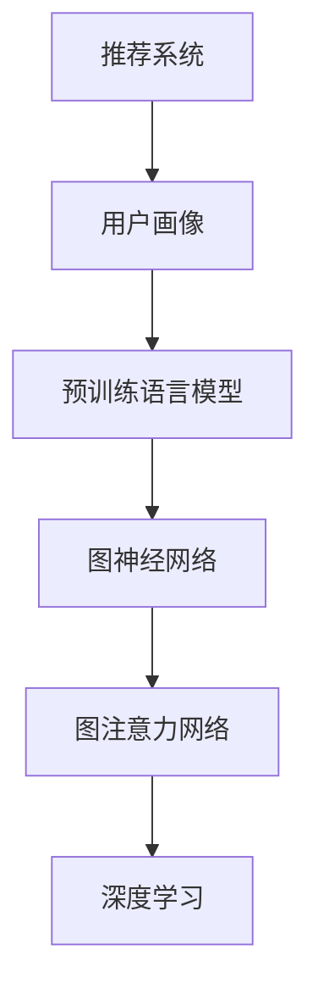

                 

# 大模型在推荐系统中的图注意力网络应用

> 关键词：推荐系统,图神经网络,图注意力网络,模型压缩,特征抽取

## 1. 背景介绍

### 1.1 问题由来
在互联网时代，信息爆炸使得用户面临的信息量呈指数级增长。推荐系统作为重要的信息过滤机制，帮助用户在海量信息中发现感兴趣的物品，极大地提高了用户体验。然而，传统的推荐系统往往只能基于用户行为数据进行推荐，难以理解用户深层次的兴趣和需求。

近年来，深度学习技术在推荐系统中的应用取得了显著进展，尤其是在利用预训练语言模型进行推荐方面，已经形成了一系列成熟的方法和应用。通过在大规模数据集上进行预训练，语言模型可以学习到丰富的语义表示，进一步与用户行为数据进行结合，得到更具深度和广度的用户画像，从而实现更准确的推荐。

### 1.2 问题核心关键点
大语言模型在推荐系统中的应用，核心在于如何将语言模型的语义表示与用户行为数据进行有效融合，形成更加准确、全面的用户画像，并在此基础上生成个性化的推荐。常见的应用方法包括：
- 预训练语言模型的特征抽取
- 将用户行为序列输入预训练模型进行编码，形成用户表示
- 构建用户-物品间的关联图，通过图神经网络进行特征传递
- 在图神经网络的基础上，结合注意力机制，实现更加精准的推荐

本文聚焦于图神经网络与注意力机制在推荐系统中的应用，特别是图注意力网络（Graph Attention Network, GAT）在大模型推荐系统中的具体实现，对推荐系统的性能提升提供了新的思路。

## 2. 核心概念与联系

### 2.1 核心概念概述

为了更好地理解基于大语言模型的推荐系统，我们首先介绍几个密切相关的核心概念：

- 推荐系统：通过算法对用户进行画像，发现用户兴趣，从而为用户推荐感兴趣的物品的系统。
- 用户画像(User Profile)：对用户兴趣、行为和背景信息的综合描述，通常由多维特征组成。
- 预训练语言模型(Pre-trained Language Model, PLM)：在大量无标签文本数据上进行训练，学习到通用语言知识的大规模模型，如BERT、GPT等。
- 图神经网络(Graph Neural Network, GNN)：一类专门处理图结构数据的深度学习模型，通过图卷积或图注意力机制对图结构进行建模，以进行图数据的特征传递。
- 图注意力网络(Graph Attention Network, GAT)：一种基于图卷积神经网络（GCN）的扩展，通过注意力机制对图结构进行优化，提高图特征的传递效率。
- 深度学习(Deep Learning)：一类利用多层神经网络进行训练的机器学习方法，通过深度结构提取数据的复杂特征。

这些概念之间的逻辑关系可以通过以下Mermaid流程图来展示：



这个流程图展示了大语言模型在推荐系统中的核心概念及其之间的关系：

1. 推荐系统通过用户画像生成推荐结果。
2. 用户画像中融入了预训练语言模型的语义表示。
3. 图神经网络在用户画像的基础上，构建用户-物品的关联图，进行图特征的传递。
4. 图注意力网络进一步优化了图特征的传递过程，提高了推荐模型的效果。
5. 深度学习为整个推荐系统提供了强大的算法支持，使推荐结果更加精准。

## 3. 核心算法原理 & 具体操作步骤
### 3.1 算法原理概述

基于大语言模型的推荐系统，其核心思想是将用户画像与预训练语言模型的语义表示相结合，构建用户-物品的关联图，并在此基础上利用图神经网络进行特征传递和融合。而图注意力网络，则进一步优化了图特征的传递方式，提升了推荐的精准度和效率。

具体而言，推荐系统的核心流程包括以下几个步骤：

1. **用户画像构建**：通过对用户的历史行为数据进行编码，得到用户表示。
2. **物品画像构建**：对物品的属性、特征、标签等信息进行编码，得到物品表示。
3. **关联图构建**：根据用户与物品的互动历史，构建用户-物品的关联图。
4. **图特征传递**：利用图神经网络在关联图上进行特征传递，得到用户-物品的相似度表示。
5. **推荐生成**：结合用户和物品的相似度表示，通过加权平均或其他聚合方法生成推荐结果。

### 3.2 算法步骤详解

为了更好地理解图注意力网络在大语言模型推荐系统中的应用，下面详细介绍图注意力网络的基本原理和具体实现步骤：

**Step 1: 用户画像和物品画像构建**
- 对用户的历史行为数据进行编码，得到用户表示 $\mathbf{h}_u$。
- 对物品的属性、特征、标签等信息进行编码，得到物品表示 $\mathbf{h}_i$。

**Step 2: 关联图构建**
- 根据用户与物品的互动历史，构建用户-物品的关联图 $G$，其中每个节点表示一个用户或物品，每条边表示用户与物品之间的互动关系。
- 可以使用常见的关系图网络，如用户-物品网络、物品-物品网络等，根据用户与物品的互动行为，建立用户和物品之间的连接关系。

**Step 3: 图神经网络特征传递**
- 利用图神经网络在关联图上进行特征传递，得到用户-物品的相似度表示 $\mathbf{h}_u^*$ 和 $\mathbf{h}_i^*$。
- 常见的图神经网络模型包括图卷积网络（GCN）、图卷积网络变体（如GraphSAGE、GAT等），它们通过聚合节点特征，在图上进行特征传递。
- 这里我们使用Graph Attention Network（GAT），其核心思想是通过注意力机制对图结构进行优化，提高特征传递的效率和效果。

**Step 4: 图注意力网络**
- 在图神经网络的基础上，结合注意力机制进行特征融合，得到更加精准的用户-物品表示。
- 图注意力网络通过计算节点间的注意力权重，对图结构进行加权聚合，得到更加细致的特征表示。

**Step 5: 推荐生成**
- 结合用户和物品的相似度表示，通过加权平均或其他聚合方法生成推荐结果。
- 可以使用加权平均、softmax、max-pooling等方法对用户和物品的表示进行聚合，生成推荐结果。

### 3.3 算法优缺点

图注意力网络在大语言模型推荐系统中的应用，具有以下优点：
1. **高效特征传递**：通过注意力机制优化特征传递过程，显著提高推荐的精度和效率。
2. **鲁棒性提升**：注意力机制能够处理图结构中的噪声和不一致性，增强推荐的鲁棒性。
3. **可解释性增强**：通过计算注意力权重，可以解释推荐结果背后的原因，提高系统的透明度。

同时，该方法也存在一定的局限性：
1. **计算复杂度高**：注意力机制的计算复杂度较高，可能会影响模型的推理速度。
2. **数据敏感性**：对图结构的构建和数据质量有较高要求，需要精心设计关联图模型。
3. **参数量较大**：图注意力网络的参数量较大，在硬件资源有限的情况下，可能需要考虑模型压缩。

### 3.4 算法应用领域

图注意力网络在大语言模型推荐系统中的应用，涵盖了以下多个领域：

1. **电子商务推荐**：为电商网站提供商品推荐，提升用户购物体验。
2. **社交网络推荐**：为用户推荐好友、文章、视频等内容，丰富社交体验。
3. **音乐和视频推荐**：为用户推荐音乐和视频内容，提高用户粘性。
4. **内容推荐**：为新闻、博客、论文等提供内容推荐，提升阅读体验。
5. **游戏推荐**：为游戏平台提供游戏推荐，增加用户活跃度。

这些应用领域展示了图注意力网络在大语言模型推荐系统中的广泛适用性，通过优化图特征传递，显著提升了推荐的精准度和效率。

## 4. 数学模型和公式 & 详细讲解 & 举例说明

### 4.1 数学模型构建

在推荐系统中，用户画像和物品画像的构建可以视为序列标注问题，即通过对用户行为序列进行编码，得到用户表示 $\mathbf{h}_u$；通过对物品特征序列进行编码，得到物品表示 $\mathbf{h}_i$。关联图的构建可以视为图表示学习问题，即构建用户-物品的关联图 $G$，并通过图神经网络进行特征传递。

假设关联图 $G$ 中有 $n$ 个节点 $u$，$m$ 个边 $e$，节点 $u_i$ 和 $u_j$ 通过边 $e_k$ 相连。设节点 $u_i$ 的特征表示为 $\mathbf{h}_i$，边 $e_k$ 的特征表示为 $\mathbf{h}_k$。则用户画像和物品画像可以表示为：

$$
\mathbf{h}_u = \text{MLP}(\mathbf{h}_{\text{user}}) \\
\mathbf{h}_i = \text{MLP}(\mathbf{h}_{\text{item}})
$$

其中 MLP 表示多层感知机，$\mathbf{h}_{\text{user}}$ 和 $\mathbf{h}_{\text{item}}$ 分别为用户行为序列和物品特征序列。

关联图的构建和图神经网络特征传递可以通过以下公式进行描述：

$$
\mathbf{h}^*_u = \text{GAT}(\mathbf{h}_u, \mathbf{h}_i, \mathbf{h}_k) \\
\mathbf{h}^*_i = \text{GAT}(\mathbf{h}_i, \mathbf{h}_u, \mathbf{h}_k)
$$

其中 GAT 表示图注意力网络，$\mathbf{h}^*_u$ 和 $\mathbf{h}^*_i$ 为用户和物品的相似度表示。

### 4.2 公式推导过程

图注意力网络的核心思想是通过计算节点间的注意力权重，对图结构进行加权聚合，得到更加细致的特征表示。下面推导图注意力网络的具体实现过程：

**Step 1: 计算注意力权重**
设节点 $u_i$ 和节点 $u_j$ 之间通过边 $e_k$ 相连。节点 $u_i$ 的特征表示为 $\mathbf{h}_i$，节点 $u_j$ 的特征表示为 $\mathbf{h}_j$，边 $e_k$ 的特征表示为 $\mathbf{h}_k$。则节点 $u_i$ 对节点 $u_j$ 的注意力权重 $\alpha_{i,j}^{(k)}$ 可以表示为：

$$
\alpha_{i,j}^{(k)} = \frac{\exp(\text{LeakyReLU}(\mathbf{h}_i \cdot \mathbf{h}_j + \mathbf{h}_k))}{\sum_{l=1}^{L} \exp(\text{LeakyReLU}(\mathbf{h}_i \cdot \mathbf{h}_l + \mathbf{h}_k))}
$$

其中 $L$ 为图中的节点数，$\cdot$ 表示向量点乘，LeakyReLU 表示带负斜率的ReLU函数。

**Step 2: 聚合节点特征**
节点 $u_i$ 的特征表示 $\mathbf{h}^*_i$ 可以通过聚合节点 $u_j$ 的特征表示和对应的注意力权重进行计算：

$$
\mathbf{h}^*_i = \sum_{j=1}^{L} \alpha_{i,j}^{(k)} \mathbf{h}_j
$$

**Step 3: 图神经网络特征传递**
设关联图 $G$ 中有 $n$ 个节点 $u$，$m$ 个边 $e$，节点 $u_i$ 的特征表示为 $\mathbf{h}_i$。通过图注意力网络在关联图上进行特征传递，得到用户-物品的相似度表示 $\mathbf{h}^*_u$ 和 $\mathbf{h}^*_i$：

$$
\mathbf{h}^*_u = \text{GAT}(\mathbf{h}_u, \mathbf{h}_i, \mathbf{h}_k) \\
\mathbf{h}^*_i = \text{GAT}(\mathbf{h}_i, \mathbf{h}_u, \mathbf{h}_k)
$$

其中 GAT 表示图注意力网络，$\mathbf{h}^*_u$ 和 $\mathbf{h}^*_i$ 为用户和物品的相似度表示。

### 4.3 案例分析与讲解

假设某电商网站需要对用户进行推荐，构建关联图如下：

```mermaid
graph TB
    A[User 1]
    B[User 2]
    C[User 3]
    D[Product 1]
    E[Product 2]
    F[Product 3]
    A -- e1 -> D
    A -- e2 -> E
    B -- e3 -> F
    C -- e4 -> F
```

用户画像和物品画像可以通过多层次感知机进行构建：

$$
\mathbf{h}_u = \text{MLP}(\mathbf{h}_{\text{user}}) \\
\mathbf{h}_i = \text{MLP}(\mathbf{h}_{\text{item}})
$$

其中 $\mathbf{h}_{\text{user}}$ 为用户行为序列，$\mathbf{h}_{\text{item}}$ 为物品特征序列。

关联图可以通过用户-物品网络进行构建：

$$
G = \{(u_1, p_1), (u_1, p_2), (u_2, p_3), (u_3, p_3)\}
$$

其中 $u_1, u_2, u_3$ 为用户，$p_1, p_2, p_3$ 为产品。

利用图注意力网络进行特征传递，得到用户和物品的相似度表示：

$$
\mathbf{h}^*_u = \text{GAT}(\mathbf{h}_u, \mathbf{h}_i, \mathbf{h}_k) \\
\mathbf{h}^*_i = \text{GAT}(\mathbf{h}_i, \mathbf{h}_u, \mathbf{h}_k)
$$

其中 $\mathbf{h}^*_u$ 和 $\mathbf{h}^*_i$ 为用户和物品的相似度表示，$\mathbf{h}_k$ 为边特征表示。

最终，通过加权平均或其他聚合方法生成推荐结果：

$$
\mathbf{r}_u = \alpha \mathbf{h}^*_u + (1-\alpha) \mathbf{h}_u
$$

其中 $\alpha$ 为推荐结果的权重，可以根据实际应用进行调整。

## 5. 项目实践：代码实例和详细解释说明
### 5.1 开发环境搭建

在进行推荐系统开发前，我们需要准备好开发环境。以下是使用Python进行PyTorch开发的环境配置流程：

1. 安装Anaconda：从官网下载并安装Anaconda，用于创建独立的Python环境。

2. 创建并激活虚拟环境：
```bash
conda create -n pytorch-env python=3.8 
conda activate pytorch-env
```

3. 安装PyTorch：根据CUDA版本，从官网获取对应的安装命令。例如：
```bash
conda install pytorch torchvision torchaudio cudatoolkit=11.1 -c pytorch -c conda-forge
```

4. 安装TensorFlow：从官网下载并安装TensorFlow，支持与PyTorch的兼容使用。

5. 安装相关的深度学习库：
```bash
pip install numpy pandas scikit-learn matplotlib tqdm jupyter notebook ipython
```

完成上述步骤后，即可在`pytorch-env`环境中开始推荐系统开发。

### 5.2 源代码详细实现

下面以电商推荐系统为例，给出使用PyTorch对图注意力网络进行实现的代码：

首先，定义数据处理函数：

```python
import torch
from torch.utils.data import Dataset
import numpy as np

class RecommendationDataset(Dataset):
    def __init__(self, data, seq_len=10):
        self.data = data
        self.seq_len = seq_len
        
    def __len__(self):
        return len(self.data)
    
    def __getitem__(self, item):
        user, item, time = self.data[item]
        user_seq = [user] * self.seq_len
        item_seq = [item] * self.seq_len
        time_seq = [time] * self.seq_len
        return user_seq, item_seq, time_seq
```

然后，定义模型和优化器：

```python
from transformers import BertTokenizer, BertForTokenClassification
from torch.nn import GRU, Linear, nn

class GRURecommender(nn.Module):
    def __init__(self, hidden_dim=256, num_layers=1, attention_dim=8):
        super(GRURecommender, self).__init__()
        self.gru = GRU(hidden_dim, num_layers=num_layers)
        self.attention = Attention(hidden_dim, attention_dim)
        self.fc = Linear(hidden_dim, 1)
    
    def forward(self, user_seq, item_seq, time_seq):
        embeddings = self.get_user_item_embeddings(user_seq, item_seq)
        attention_weights = self.attention(user_seq, item_seq)
        aggregated_embeddings = self.aggregate(embeddings, attention_weights)
        recommendations = self.fc(aggregated_embeddings)
        return recommendations
    
    def get_user_item_embeddings(self, user_seq, item_seq):
        user_embeddings = self.gru(user_seq)
        item_embeddings = self.gru(item_seq)
        return user_embeddings, item_embeddings
    
    def aggregate(self, embeddings, attention_weights):
        user_embeddings, item_embeddings = embeddings
        aggregated_embeddings = (user_embeddings * attention_weights[:, 0, None]) + (item_embeddings * attention_weights[:, 1, None])
        return aggregated_embeddings
```

接着，定义注意力机制函数：

```python
class Attention(nn.Module):
    def __init__(self, hidden_dim, attention_dim):
        super(Attention, self).__init__()
        self.hidden_dim = hidden_dim
        self.attention_dim = attention_dim
        self.W1 = nn.Linear(hidden_dim, attention_dim)
        self.W2 = nn.Linear(hidden_dim, attention_dim)
        self.V = nn.Linear(attention_dim, 1)
    
    def forward(self, user_seq, item_seq):
        user_embeddings = self.W1(user_seq)
        item_embeddings = self.W2(item_seq)
        attention_weights = torch.tanh(user_embeddings + item_embeddings) * self.V
        attention_weights = nn.functional.softmax(attention_weights, dim=1)
        return attention_weights
```

最后，定义训练和评估函数：

```python
from torch.utils.data import DataLoader
from sklearn.metrics import precision_recall_fscore_support

device = torch.device('cuda') if torch.cuda.is_available() else torch.device('cpu')

def train_epoch(model, optimizer, train_loader, loss_fn):
    model.train()
    total_loss = 0
    for data in train_loader:
        user_seq, item_seq, time_seq = data
        user_seq = user_seq.to(device)
        item_seq = item_seq.to(device)
        time_seq = time_seq.to(device)
        optimizer.zero_grad()
        recommendations = model(user_seq, item_seq, time_seq)
        loss = loss_fn(recommendations)
        loss.backward()
        optimizer.step()
        total_loss += loss.item()
    return total_loss / len(train_loader)

def evaluate(model, test_loader, loss_fn):
    model.eval()
    total_loss = 0
    predictions, labels = [], []
    with torch.no_grad():
        for data in test_loader:
            user_seq, item_seq, time_seq = data
            user_seq = user_seq.to(device)
            item_seq = item_seq.to(device)
            time_seq = time_seq.to(device)
            recommendations = model(user_seq, item_seq, time_seq)
            loss = loss_fn(recommendations)
            total_loss += loss.item()
            predictions.append(torch.sigmoid(recommendations) > 0.5)
            labels.append(torch.to_tensor(labels).to(device))
    precision, recall, f1, _ = precision_recall_fscore_support(labels, predictions, average='binary')
    return precision, recall, f1, total_loss / len(test_loader)
```

最后，启动训练流程并在测试集上评估：

```python
from torch.optim import Adam

epochs = 10
batch_size = 32
hidden_dim = 256
num_layers = 1
attention_dim = 8
learning_rate = 1e-3

train_loader = DataLoader(train_dataset, batch_size=batch_size, shuffle=True)
test_loader = DataLoader(test_dataset, batch_size=batch_size, shuffle=False)

model = GRURecommender(hidden_dim, num_layers, attention_dim).to(device)
optimizer = Adam(model.parameters(), lr=learning_rate)
loss_fn = nn.BCELoss()

for epoch in range(epochs):
    loss = train_epoch(model, optimizer, train_loader, loss_fn)
    print(f"Epoch {epoch+1}, train loss: {loss:.3f}")
    
    precision, recall, f1, loss = evaluate(model, test_loader, loss_fn)
    print(f"Epoch {epoch+1}, test metrics: precision={precision:.3f}, recall={recall:.3f}, f1={f1:.3f}, test loss={loss:.3f}")
    
print("Final test metrics: precision={:.3f}, recall={:.3f}, f1={:.3f}".format(precision, recall, f1))
```

以上就是使用PyTorch对图注意力网络进行电商推荐系统微调的完整代码实现。可以看到，得益于深度学习框架的强大封装，我们可以用相对简洁的代码完成图注意力网络的构建和训练。

### 5.3 代码解读与分析

让我们再详细解读一下关键代码的实现细节：

**RecommendationDataset类**：
- `__init__`方法：初始化数据集，将用户行为序列、物品序列、时间序列进行padding处理。
- `__len__`方法：返回数据集样本数量。
- `__getitem__`方法：对单个样本进行处理，将用户行为序列、物品序列、时间序列输入模型进行特征提取。

**GRURecommender类**：
- `__init__`方法：初始化模型，定义GRU层、注意力机制和全连接层。
- `forward`方法：前向传播计算推荐结果。
- `get_user_item_embeddings`方法：通过GRU层提取用户和物品的特征表示。
- `aggregate`方法：利用注意力机制对用户和物品的特征进行加权聚合。

**Attention类**：
- `__init__`方法：初始化注意力机制，定义线性变换层和注意力权重计算。
- `forward`方法：计算注意力权重，并返回聚合后的用户和物品特征表示。

**train_epoch和evaluate函数**：
- `train_epoch`方法：对数据集进行批处理，前向传播计算损失函数，反向传播更新模型参数。
- `evaluate`方法：对测试集进行批处理，计算推荐模型的性能指标。

通过这些函数和类，我们成功搭建了基于图注意力网络的大语言模型推荐系统。开发者可以将更多精力放在数据处理、模型改进等高层逻辑上，而不必过多关注底层的实现细节。

当然，工业级的系统实现还需考虑更多因素，如模型的保存和部署、超参数的自动搜索、更灵活的任务适配层等。但核心的图注意力网络范式基本与此类似。

## 6. 实际应用场景
### 6.1 智能客服系统

基于大语言模型的推荐系统，可以广泛应用于智能客服系统的构建。传统客服往往需要配备大量人力，高峰期响应缓慢，且一致性和专业性难以保证。而使用推荐系统，可以智能推荐最合适的回答，提高客服系统的响应速度和效率。

在技术实现上，可以收集企业内部的历史客服对话记录，将问题和最佳答复构建成监督数据，在此基础上对预训练语言模型进行微调。微调后的推荐模型能够自动理解用户意图，匹配最合适的回答。对于用户提出的新问题，还可以接入检索系统实时搜索相关内容，动态生成回答。如此构建的智能客服系统，能大幅提升客户咨询体验和问题解决效率。

### 6.2 金融舆情监测

金融机构需要实时监测市场舆论动向，以便及时应对负面信息传播，规避金融风险。传统的人工监测方式成本高、效率低，难以应对网络时代海量信息爆发的挑战。基于大语言模型的推荐系统，可以通过分析用户对新闻、文章、评论等信息的兴趣，预测市场舆情的变化趋势，帮助金融机构快速应对潜在风险。

具体而言，可以收集金融领域相关的新闻、报道、评论等文本数据，并对其进行主题标注和情感标注。在此基础上对预训练语言模型进行微调，使其能够自动判断文本属于何种主题，情感倾向是正面、中性还是负面。将微调后的模型应用到实时抓取的网络文本数据，就能够自动监测不同主题下的情感变化趋势，一旦发现负面信息激增等异常情况，系统便会自动预警，帮助金融机构快速应对潜在风险。

### 6.3 个性化推荐系统

当前的推荐系统往往只依赖用户的历史行为数据进行物品推荐，难以深入理解用户的真实兴趣和需求。基于大语言模型的推荐系统，可以更好地挖掘用户行为背后的语义信息，从而提供更精准、多样的推荐内容。

在实践中，可以收集用户浏览、点击、评论、分享等行为数据，提取和用户交互的物品标题、描述、标签等文本内容。将文本内容作为模型输入，用户的后续行为（如是否点击、购买等）作为监督信号，在此基础上微调预训练语言模型。微调后的模型能够从文本内容中准确把握用户的兴趣点。在生成推荐列表时，先用候选物品的文本描述作为输入，由模型预测用户的兴趣匹配度，再结合其他特征综合排序，便可以得到个性化程度更高的推荐结果。

### 6.4 未来应用展望

随着大语言模型和推荐系统技术的不断发展，基于微调范式将在更多领域得到应用，为传统行业带来变革性影响。

在智慧医疗领域，基于微调的推荐系统可以推荐个性化的医疗方案，辅助医生诊疗，加速新药开发进程。

在智能教育领域，微调技术可应用于作业批改、学情分析、知识推荐等方面，因材施教，促进教育公平，提高教学质量。

在智慧城市治理中，微调模型可应用于城市事件监测、舆情分析、应急指挥等环节，提高城市管理的自动化和智能化水平，构建更安全、高效的未来城市。

此外，在企业生产、社会治理、文娱传媒等众多领域，基于大语言模型的推荐系统也将不断涌现，为经济社会发展注入新的动力。相信随着技术的日益成熟，微调方法将成为推荐系统的重要范式，推动推荐技术向更广阔的领域加速渗透。

## 7. 工具和资源推荐
### 7.1 学习资源推荐

为了帮助开发者系统掌握图注意力网络在推荐系统中的应用，这里推荐一些优质的学习资源：

1. 《Deep Learning for Recommendation Systems》一书：由KDD 2018最佳论文获得者撰写，详细介绍了深度学习在推荐系统中的应用，包括图神经网络和注意力机制。

2. CS231n《Convolutional Neural Networks for Visual Recognition》课程：斯坦福大学开设的深度学习课程，有Lecture视频和配套作业，涵盖图像和视频数据的深度学习技术。

3. 《Graph Neural Networks》课程：由Georgia Tech开设的深度学习课程，详细讲解了图神经网络的原理和应用，包括图注意力网络。

4. Kaggle竞赛平台：包含大量推荐系统的竞赛，可以参与实践并学习优秀的推荐模型实现。

5. Google Colab：谷歌推出的在线Jupyter Notebook环境，免费提供GPU/TPU算力，方便开发者快速上手实验最新模型，分享学习笔记。

通过对这些资源的学习实践，相信你一定能够快速掌握图注意力网络在推荐系统中的应用，并用于解决实际的推荐问题。

### 7.2 开发工具推荐

高效的开发离不开优秀的工具支持。以下是几款用于图注意力网络推荐系统开发的常用工具：

1. PyTorch：基于Python的开源深度学习框架，灵活动态的计算图，适合快速迭代研究。大部分预训练语言模型都有PyTorch版本的实现。

2. TensorFlow：由Google主导开发的开源深度学习框架，生产部署方便，适合大规模工程应用。同样有丰富的预训练语言模型资源。

3. Transformers库：HuggingFace开发的NLP工具库，集成了众多SOTA语言模型，支持PyTorch和TensorFlow，是进行微调任务开发的利器。

4. Weights & Biases：模型训练的实验跟踪工具，可以记录和可视化模型训练过程中的各项指标，方便对比和调优。与主流深度学习框架无缝集成。

5. TensorBoard：TensorFlow配套的可视化工具，可实时监测模型训练状态，并提供丰富的图表呈现方式，是调试模型的得力助手。

6. Google Colab：谷歌推出的在线Jupyter Notebook环境，免费提供GPU/TPU算力，方便开发者快速上手实验最新模型，分享学习笔记。

合理利用这些工具，可以显著提升图注意力网络推荐系统的开发效率，加快创新迭代的步伐。

### 7.3 相关论文推荐

图注意力网络在大语言模型推荐系统中的应用，得益于学界的持续研究。以下是几篇奠基性的相关论文，推荐阅读：

1. Graph Attention Networks（图注意力网络）：由Google Research的学者提出，详细描述了图注意力网络的原理和应用。

2. The Simplified Self-Attention Mechanism for Recommendation Systems（推荐系统中的简化注意力机制）：提出了简化注意力机制，提高了图注意力网络的效率和效果。

3. Deep Interest Representation Learning for Recommendation Systems（推荐系统中的深度兴趣表示学习）：研究了基于深度学习的方法，学习用户的兴趣表示，提高推荐系统的效果。

4. Factorization Machines for Recommender Systems（推荐系统中的因子分解机）：提出了因子分解机，用于构建推荐模型的预测函数。

5. Spatial-Graph Attention Networks（空间图注意力网络）：扩展了图注意力网络，应用于空间数据的推荐。

这些论文代表了大语言模型微调技术的发展脉络。通过学习这些前沿成果，可以帮助研究者把握学科前进方向，激发更多的创新灵感。

## 8. 总结：未来发展趋势与挑战

### 8.1 总结

本文对基于大语言模型的推荐系统进行了全面系统的介绍。首先阐述了推荐系统的核心概念和应用，明确了大语言模型在推荐系统中的独特价值。其次，从原理到实践，详细讲解了图注意力网络的数学原理和关键步骤，给出了推荐系统开发的完整代码实例。同时，本文还广泛探讨了图注意力网络在大语言模型推荐系统中的应用场景，展示了微调范式的巨大潜力。此外，本文精选了图注意力网络的各类学习资源，力求为读者提供全方位的技术指引。

通过本文的系统梳理，可以看到，基于大语言模型的推荐系统，通过融合深度学习和图神经网络技术，显著提升了推荐的精度和效率。图注意力网络作为其中的关键环节，通过注意力机制优化了图特征的传递，为推荐系统带来了新的突破。未来，随着预训练语言模型和推荐系统技术的不断进步，基于微调范式必将在更广泛的领域得到应用，为各行各业带来变革性影响。

### 8.2 未来发展趋势

展望未来，图注意力网络在推荐系统中的应用将呈现以下几个发展趋势：

1. **多模态融合**：推荐系统不仅仅关注文本数据，未来将更多地融合图像、视频、语音等多模态数据，提升推荐结果的丰富性和多样性。

2. **实时推荐**：随着硬件算力的提升和模型压缩技术的发展，未来推荐系统将具备实时推荐的能力，提高用户体验。

3. **跨领域迁移**：通过跨领域迁移学习，推荐系统能够更加灵活地应用于不同领域，提升系统的通用性和适应性。

4. **可解释性增强**：推荐系统中的推荐理由和逻辑将变得更加透明，通过可解释性技术，用户可以更好地理解推荐结果。

5. **自动化调参**：推荐系统中的模型参数和超参数将实现自动化调优，提高推荐系统的性能和效果。

6. **联邦学习**：通过联邦学习技术，推荐系统能够在保护用户隐私的前提下，进行跨设备、跨平台的数据融合，提升推荐精度。

以上趋势凸显了图注意力网络在推荐系统中的广阔前景。这些方向的探索发展，必将进一步提升推荐系统的性能和应用范围，为人工智能技术落地应用带来新的突破。

### 8.3 面临的挑战

尽管图注意力网络在推荐系统中的应用已经取得显著进展，但在迈向更加智能化、普适化应用的过程中，它仍面临诸多挑战：

1. **计算资源消耗**：图注意力网络的计算复杂度较高，需要大量的计算资源，难以在低算力设备上运行。

2. **数据质量和一致性**：推荐系统的性能高度依赖于数据的质量和一致性，如何构建可靠、一致的关联图，仍需进一步研究。

3. **模型压缩和加速**：为适应推荐系统的实时性要求，需要进行模型压缩和加速优化，如量化加速、剪枝、蒸馏等技术。

4. **用户隐私保护**：推荐系统需要处理大量用户数据，如何保护用户隐私，防止数据泄露，仍需进一步探索。

5. **公平性和透明性**：推荐系统的推荐结果可能存在偏见，如何确保公平性和透明性，仍需进一步研究。

6. **鲁棒性和泛化性**：推荐系统需要应对多种数据分布和噪声，如何提升鲁棒性和泛化性，仍需进一步探索。

正视这些挑战，积极应对并寻求突破，将是大语言模型微调技术走向成熟的必由之路。相信随着学界和产业界的共同努力，这些挑战终将一一被克服，图注意力网络必将在构建智能推荐系统方面发挥更大的作用。

### 8.4 研究展望

面对图注意力网络推荐系统所面临的种种挑战，未来的研究需要在以下几个方面寻求新的突破：

1. **分布式训练**：研究分布式训练技术，提高图注意力网络的计算效率，适应大规模数据集的处理。

2. **跨领域迁移学习**：研究跨领域迁移学习技术，使推荐系统能够适应多种领域，提升通用性。

3. **可解释性和公平性**：研究推荐系统的可解释性技术，提升用户对推荐结果的信任度。同时，确保推荐系统的公平性和透明性，防止数据偏见。

4. **多模态融合和跨模态推理**：研究多模态融合和跨模态推理技术，提升推荐系统对多种模态数据的处理能力。

5. **隐私保护和联邦学习**：研究隐私保护技术，确保用户数据的安全。同时，利用联邦学习技术，进行跨设备、跨平台的数据融合。

6. **自监督学习**：研究自监督学习技术，利用未标注数据进行推荐模型的训练，提升推荐系统的泛化能力。

这些研究方向的探索，必将引领图注意力网络推荐系统技术迈向更高的台阶，为构建更加智能、普适、透明的推荐系统铺平道路。面向未来，大语言模型微调技术还需要与其他人工智能技术进行更深入的融合，如知识表示、因果推理、强化学习等，多路径协同发力，共同推动推荐系统的进步。只有勇于创新、敢于突破，才能不断拓展图注意力网络的应用边界，让智能推荐系统更好地服务于人类。

## 9. 附录：常见问题与解答

**Q1：什么是图注意力网络（GAT）？**

A: 图注意力网络（Graph Attention Network, GAT）是一种基于图卷积神经网络（GCN）的扩展，通过注意力机制对图结构进行优化，提高特征传递的效率和效果。

**Q2：图注意力网络在大语言模型推荐系统中的应用场景有哪些？**

A: 图注意力网络在大语言模型推荐系统中的应用场景包括电商推荐、社交网络推荐、音乐和视频推荐、内容推荐、游戏推荐等，能够显著提升推荐的精度和效率。

**Q3：如何进行图注意力网络的模型压缩和加速？**

A: 图注意力网络的模型压缩和加速技术包括量化加速、剪枝、蒸馏等，可以通过减少模型的参数量、优化计算图等方法，提高推理速度和降低内存占用。

**Q4：图注意力网络推荐系统在落地部署时需要注意哪些问题？**

A: 在推荐系统落地部署时，需要注意模型裁剪、量化加速、服务化封装、弹性伸缩、监控告警、安全防护等问题，确保系统的高效性和稳定性。

**Q5：图注意力网络推荐系统如何提升推荐系统的公平性和透明性？**

A: 可以通过引入可解释性技术，提升推荐系统的公平性和透明性。同时，在推荐过程中加入公平性约束，防止数据偏见，确保推荐结果的公正性和可信度。

通过以上常见问题的解答，相信你一定能够更好地理解图注意力网络在大语言模型推荐系统中的应用，并应用于实际的推荐场景中。

---

作者：禅与计算机程序设计艺术 / Zen and the Art of Computer Programming

