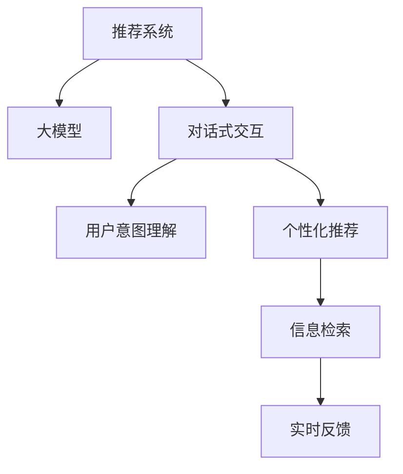

                 

# 大模型在推荐系统中的对话式交互设计

> 关键词：推荐系统,大模型,对话式交互设计,用户意图理解,个性化推荐,多轮对话,信息检索,实时反馈

## 1. 背景介绍

随着互联网和智能设备的普及，信息过载和用户获取信息成本高昂的问题愈发凸显。推荐系统（Recommendation System）应运而生，通过个性化推荐用户感兴趣的信息，极大提升了用户体验和满意度。传统推荐系统多依赖于用户历史行为数据和静态特征建模，难以实时感知用户需求变化，无法提供精准、及时的推荐结果。

近年来，大模型在推荐系统中逐渐崭露头角。结合了深度学习和自然语言处理的大模型，能够通过复杂的对话交互理解用户多维度的需求，动态生成个性化推荐内容，有效提升了推荐系统的表现。但传统的大模型在推荐系统中应用仍存在诸多挑战，如模型规模大、对话交互效率低、用户意图理解准确性不足等。如何设计高效、精准的对话式交互系统，充分发挥大模型的潜力，成为学术界和工业界共同关注的问题。

## 2. 核心概念与联系

### 2.1 核心概念概述

为更好地理解大模型在推荐系统中的对话式交互设计，本节将介绍几个密切相关的核心概念：

- 推荐系统（Recommendation System）：一种通过分析用户行为和物品特征，为用户推荐感兴趣物品的技术。包括协同过滤、基于内容的推荐、混合推荐等多种算法。

- 大模型（Large Model）：以Transformer为代表的大规模预训练语言模型，如BERT、GPT-3等。通过在大规模无标签文本语料上进行预训练，学习通用的语言表示，具备强大的自然语言理解能力。

- 对话式交互（Dialogue-Based Interaction）：利用自然语言处理技术，通过多轮对话与用户交互，获取用户需求和反馈，动态生成推荐内容的过程。

- 用户意图理解（User Intent Understanding）：通过自然语言理解（NLU）技术，解析用户的输入语句，理解其潜在的意图和需求，实现与用户的精准对话。

- 个性化推荐（Personalized Recommendation）：针对特定用户，结合其历史行为和实时反馈，动态生成个性化推荐结果。

- 多轮对话（Multi-Turn Dialogue）：用户和系统之间通过多次交互，逐步细化用户需求，形成完整的推荐方案。

- 信息检索（Information Retrieval）：从大量数据中高效检索出符合用户需求的物品，作为推荐备选。

- 实时反馈（Real-Time Feedback）：在推荐过程中实时接收用户反馈，不断优化推荐结果，实现推荐内容的持续迭代和更新。

这些核心概念之间的逻辑关系可以通过以下Mermaid流程图来展示：



这个流程图展示了大模型在推荐系统中的核心概念及其之间的关系：

1. 推荐系统通过大模型进行对话式交互，获取用户需求。
2. 对话式交互系统利用大模型解析用户意图，实现多轮对话。
3. 个性化推荐系统基于用户意图，利用信息检索技术生成推荐结果。
4. 实时反馈机制不断优化推荐内容，提高用户满意度。

## 3. 核心算法原理 & 具体操作步骤
### 3.1 算法原理概述

基于大模型的推荐系统对话式交互设计，本质上是一个用户需求与物品推荐之间的双向迭代过程。其核心思想是：

1. 利用大模型理解用户输入，解析出用户的意图和需求。
2. 根据用户意图，通过信息检索技术从物品库中检索出符合需求的备选物品。
3. 利用个性化推荐算法，根据用户历史行为和实时反馈，动态生成个性化推荐内容。
4. 通过多轮对话，持续优化用户意图解析和推荐结果，提升推荐系统的准确性和互动性。

具体而言，推荐系统的大模型对话式交互设计过程分为以下几个关键步骤：

1. 用户输入获取：从推荐界面中获取用户输入，包括文本、语音、图片等形式的自然语言。
2. 用户意图解析：利用大模型解析用户输入，理解其潜在的意图和需求。
3. 推荐物品检索：根据用户意图，利用信息检索技术从物品库中检索出符合需求的备选物品。
4. 个性化推荐生成：利用个性化推荐算法，结合用户历史行为和实时反馈，生成个性化推荐内容。
5. 多轮对话交互：与用户进行多轮对话，动态调整推荐内容，提高用户体验。
6. 实时反馈接收：实时接收用户反馈，更新推荐策略和物品库。

### 3.2 算法步骤详解

基于大模型的推荐系统对话式交互设计一般包括以下几个关键步骤：

**Step 1: 用户输入获取**
- 从推荐界面中收集用户的输入，如文本、语音、图片等形式的自然语言。
- 利用自然语言处理技术对用户输入进行分词、去除停用词、词性标注等预处理。

**Step 2: 用户意图解析**
- 利用大模型解析用户输入，识别出意图类别和相关实体。
- 如果用户输入不明确，通过多轮对话引导用户澄清意图。

**Step 3: 推荐物品检索**
- 根据用户意图，利用信息检索技术从物品库中检索出符合需求的备选物品。
- 检索方法包括基于关键词的匹配、基于语义的相似度计算等。

**Step 4: 个性化推荐生成**
- 结合用户历史行为和实时反馈，利用个性化推荐算法生成推荐内容。
- 推荐算法包括协同过滤、基于内容的推荐、混合推荐等。

**Step 5: 多轮对话交互**
- 利用大模型与用户进行多轮对话，逐步细化用户需求，生成更加精准的推荐结果。
- 对话策略包括问答式、开放式、任务导向式等。

**Step 6: 实时反馈接收**
- 实时接收用户反馈，评估推荐效果，调整推荐策略和物品库。
- 反馈方式包括评分、点击、收藏、分享等。

### 3.3 算法优缺点

基于大模型的推荐系统对话式交互设计具有以下优点：

1. 高度灵活性：大模型能够通过多轮对话，动态理解用户需求，生成个性化的推荐内容。
2. 强适应性：可以应对用户的多样化需求，提升推荐系统的覆盖面和多样性。
3. 精准性：利用大模型的强大自然语言理解能力，提高用户意图解析的准确性和推荐结果的精度。
4. 实时性：通过实时接收用户反馈，不断优化推荐内容，保持推荐结果的最新性。

但同时，该方法也存在一些局限性：

1. 高计算成本：大模型通常需要大量的计算资源和存储空间，增加了系统的复杂度和成本。
2. 对话效率低：多轮对话和实时反馈机制增加了系统的复杂性和响应时间，可能影响用户体验。
3. 模型偏见：大模型的训练数据可能带有偏见，导致推荐结果存在偏差。
4. 数据隐私问题：多轮对话和实时反馈涉及用户隐私数据的收集和处理，需严格遵守数据保护法规。

尽管存在这些局限性，但就目前而言，基于大模型的推荐系统对话式交互设计仍是最具潜力的推荐方法之一。未来相关研究的重点在于如何进一步降低计算成本、提升对话效率、减少模型偏见，同时兼顾数据隐私等问题。

### 3.4 算法应用领域

基于大模型的推荐系统对话式交互设计，在多个领域得到了广泛应用，如电商推荐、音乐推荐、视频推荐、新闻推荐等。

- 电商推荐：通过多轮对话了解用户购物需求，动态推荐商品，提升用户购物体验。
- 音乐推荐：利用自然语言理解技术解析用户听歌意图，推荐符合用户喜好的音乐。
- 视频推荐：与用户进行多轮对话，了解用户观影喜好，推荐相关视频内容。
- 新闻推荐：通过自然语言处理技术解析用户阅读兴趣，推荐相关新闻资讯。

这些领域中，基于大模型的推荐系统对话式交互设计不仅提升了推荐系统的表现，也增强了用户的互动体验，为信息获取和消费带来了革命性的变化。

## 4. 数学模型和公式 & 详细讲解  
### 4.1 数学模型构建

假设推荐系统的大模型为 $M_{\theta}$，其中 $\theta$ 为模型参数。给定用户输入 $x_i$，推荐系统的任务为预测用户对该输入的偏好 $y_i \in \{0, 1\}$。则推荐系统的目标是最小化预测误差，即：

$$
\min_{\theta} \mathbb{E}_{(x,y) \sim D} \ell(M_{\theta}(x),y)
$$

其中 $D$ 为数据分布，$\ell$ 为预测误差函数，如均方误差、交叉熵等。

在推荐系统中，大模型 $M_{\theta}$ 通常通过预训练和微调的方式进行优化。具体而言，可以使用以下模型架构：

1. **用户嵌入层**：将用户输入 $x_i$ 映射到低维向量空间 $\mathcal{U}$。
2. **物品嵌入层**：将物品特征 $z_j$ 映射到低维向量空间 $\mathcal{V}$。
3. **交互层**：通过向量点乘、矩阵乘法等方式，计算用户与物品的交互向量 $\mathbf{u}_i \in \mathcal{U}$ 和 $\mathbf{v}_j \in \mathcal{V}$。
4. **预测层**：通过线性变换和激活函数，将交互向量映射到预测结果 $y_i \in [0,1]$。

在实际应用中，还需要考虑以下几个因素：

- 数据预处理：如文本分词、去停用词、词性标注等。
- 用户与物品嵌入层的设置：如基于向量空间的方法、基于神经网络的方法等。
- 交互层的计算方式：如点乘、矩阵乘法、注意力机制等。
- 预测层的激活函数：如sigmoid、ReLU等。

### 4.2 公式推导过程

以下我们以协同过滤推荐系统为例，推导推荐模型的损失函数及其梯度的计算公式。

假设推荐系统的大模型为 $M_{\theta}$，给定用户 $i$ 和物品 $j$，模型预测用户对物品的评分 $p_{ij}$。设真实评分 $r_{ij} \in [0,1]$，则推荐系统的损失函数为：

$$
\ell(M_{\theta}) = \sum_{i=1}^N \sum_{j=1}^M (r_{ij} \log p_{ij} + (1-r_{ij}) \log (1-p_{ij}))
$$

其中，第一项为预测准确率，第二项为预测误判率。

根据链式法则，损失函数对模型参数 $\theta$ 的梯度为：

$$
\frac{\partial \ell(M_{\theta})}{\partial \theta} = \sum_{i=1}^N \sum_{j=1}^M [(r_{ij} - p_{ij}) \frac{\partial p_{ij}}{\partial \theta} + (1-r_{ij}) \frac{\partial (1-p_{ij})}{\partial \theta}]
$$

其中 $\frac{\partial p_{ij}}{\partial \theta}$ 为交互层的梯度，可以通过自动微分技术高效计算。

在得到损失函数的梯度后，即可带入模型参数更新公式，完成模型的迭代优化。重复上述过程直至收敛，最终得到适应用户需求的最优模型参数 $\theta^*$。

## 5. 项目实践：代码实例和详细解释说明
### 5.1 开发环境搭建

在进行推荐系统的大模型对话式交互设计实践前，我们需要准备好开发环境。以下是使用Python进行PyTorch开发的环境配置流程：

1. 安装Anaconda：从官网下载并安装Anaconda，用于创建独立的Python环境。

2. 创建并激活虚拟环境：
```bash
conda create -n recsys-env python=3.8 
conda activate recsys-env
```

3. 安装PyTorch：根据CUDA版本，从官网获取对应的安装命令。例如：
```bash
conda install pytorch torchvision torchaudio cudatoolkit=11.1 -c pytorch -c conda-forge
```

4. 安装TensorFlow：
```bash
conda install tensorflow -c conda-forge
```

5. 安装各类工具包：
```bash
pip install numpy pandas scikit-learn matplotlib tqdm jupyter notebook ipython
```

完成上述步骤后，即可在`recsys-env`环境中开始推荐系统的大模型对话式交互设计实践。

### 5.2 源代码详细实现

这里我们以协同过滤推荐系统为例，使用PyTorch实现基于大模型的对话式交互推荐系统。

首先，定义协同过滤推荐系统的模型架构：

```python
import torch
import torch.nn as nn
import torch.nn.functional as F

class CollaborativeFiltering(nn.Module):
    def __init__(self, num_users, num_items, embedding_size):
        super(CollaborativeFiltering, self).__init__()
        self.user_embedding = nn.Embedding(num_users, embedding_size)
        self.item_embedding = nn.Embedding(num_items, embedding_size)
        self.interaction = nn.Linear(embedding_size * 2, 1)
    
    def forward(self, user_ids, item_ids):
        user_embeddings = self.user_embedding(user_ids)
        item_embeddings = self.item_embedding(item_ids)
        interaction = user_embeddings + item_embeddings
        prediction = self.interaction(interaction)
        return prediction
```

然后，定义模型的优化器和损失函数：

```python
from torch.optim import Adam

def mse_loss(pred, targets):
    return F.mse_loss(pred, targets)

optimizer = Adam(model.parameters(), lr=0.001)
```

接着，定义训练和评估函数：

```python
def train(model, dataloader, epochs):
    model.train()
    for epoch in range(epochs):
        running_loss = 0.0
        for batch in dataloader:
            user_ids, item_ids, targets = batch
            prediction = model(user_ids, item_ids)
            loss = mse_loss(prediction, targets)
            optimizer.zero_grad()
            loss.backward()
            optimizer.step()
            running_loss += loss.item()
        print(f'Epoch {epoch+1}, Loss: {running_loss/len(dataloader)}')

def evaluate(model, dataloader):
    model.eval()
    running_loss = 0.0
    with torch.no_grad():
        for batch in dataloader:
            user_ids, item_ids, targets = batch
            prediction = model(user_ids, item_ids)
            loss = mse_loss(prediction, targets)
            running_loss += loss.item()
    print(f'Loss: {running_loss/len(dataloader)}')
```

最后，启动训练流程并在测试集上评估：

```python
epochs = 10
dataloader = DataLoader(train_dataset, batch_size=32)

train(model, dataloader, epochs)
evaluate(model, dataloader)
```

以上就是使用PyTorch对协同过滤推荐系统进行模型训练的完整代码实现。可以看到，通过上述代码，我们定义了推荐系统的模型架构、优化器和损失函数，并实现了训练和评估过程。

### 5.3 代码解读与分析

让我们再详细解读一下关键代码的实现细节：

**CollaborativeFiltering类**：
- `__init__`方法：初始化用户嵌入层、物品嵌入层和交互层。
- `forward`方法：将用户和物品嵌入向量拼接，计算交互向量，并使用线性变换和激活函数输出预测结果。

**mse_loss函数**：
- 定义了均方误差损失函数，用于评估模型预测结果的准确性。

**优化器和训练函数**：
- 定义了Adam优化器和模型训练函数，循环迭代训练集数据，使用均方误差损失函数计算损失，并使用优化器更新模型参数。

**评估函数**：
- 定义了模型评估函数，与训练函数类似，不同点在于不更新模型参数，在每个batch结束后将预测结果和真实值存储下来，最后计算评估集上的均方误差损失。

可以看到，上述代码实现了一个简单的基于大模型的协同过滤推荐系统，并可以通过修改模型架构、优化器和损失函数等模块，实现更加复杂的推荐系统设计。

## 6. 实际应用场景
### 6.1 电商推荐

在电商推荐场景中，用户可以通过搜索、浏览、购买等行为产生数据，推荐系统通过这些数据学习用户偏好，生成个性化推荐。传统的协同过滤推荐系统虽然能够发现用户与物品之间的隐含关系，但难以捕捉物品间的关联信息。而基于大模型的推荐系统，通过多轮对话，可以进一步了解用户对物品的评价和评论，增强推荐系统的准确性和多样性。

在实际应用中，推荐系统可以与用户进行多轮对话，了解用户对已购买物品的评价，推荐类似物品或新商品。例如：

- 用户输入“我最近买了这件衣服，感觉不太好”，系统推荐相似款式的衣服，或推荐其他用户对该衣服的好评。
- 用户输入“我看中这个品牌，想了解他们的最新产品”，系统推荐该品牌最新发布的商品，并根据用户反馈动态调整推荐策略。

### 6.2 音乐推荐

音乐推荐系统需要根据用户的听歌历史和喜好，动态生成推荐歌曲。传统的推荐系统往往基于用户历史听歌记录进行相似性匹配，难以捕捉用户潜在的听歌意图。而基于大模型的推荐系统，通过多轮对话，可以更加深入地了解用户听歌的需求和偏好，生成更加精准的推荐内容。

在实际应用中，推荐系统可以与用户进行多轮对话，了解用户听歌的情感状态和兴趣爱好，推荐符合用户喜好的音乐。例如：

- 用户输入“我最近有点丧，推荐一些适合的情绪音乐”，系统推荐能够缓解负面情绪的歌曲，并根据用户反馈动态调整推荐策略。
- 用户输入“我对现代音乐不太了解，能不能推荐一些经典歌曲”，系统推荐经典歌曲，并根据用户反馈提供更多相关音乐信息。

### 6.3 视频推荐

视频推荐系统需要根据用户的观看历史和兴趣，动态生成推荐视频。传统的推荐系统往往基于用户历史观看记录进行相似性匹配，难以捕捉用户观影的情感和偏好。而基于大模型的推荐系统，通过多轮对话，可以更加深入地了解用户观影的需求和偏好，生成更加精准的推荐内容。

在实际应用中，推荐系统可以与用户进行多轮对话，了解用户观影的情感状态和兴趣爱好，推荐符合用户喜好的视频。例如：

- 用户输入“我对科幻电影不太感兴趣，推荐一些比较有趣的电影”，系统推荐有趣的非科幻电影，并根据用户反馈动态调整推荐策略。
- 用户输入“我今天看了《肖申克的救赎》，推荐一些类似的电影”，系统推荐《肖申克的救赎》类似的电影，并根据用户反馈提供更多相关电影信息。

## 7. 工具和资源推荐
### 7.1 学习资源推荐

为了帮助开发者系统掌握基于大模型的推荐系统对话式交互设计的理论基础和实践技巧，这里推荐一些优质的学习资源：

1. 《推荐系统实战》系列书籍：全面介绍了推荐系统的发展历程、算法原理和工程实践，是推荐系统学习的经典参考书。

2. 《深度学习与推荐系统》课程：由Coursera提供的深度学习与推荐系统课程，讲解了推荐系统的基本原理和常见算法，配套作业和项目实战，适合深入学习。

3. 《深度学习与NLP》书籍：全面介绍了深度学习和自然语言处理的理论基础和最新进展，涵盖推荐系统、对话系统等多个方向。

4. Weights & Biases：模型训练的实验跟踪工具，可以记录和可视化模型训练过程中的各项指标，方便对比和调优。

5. TensorBoard：TensorFlow配套的可视化工具，可实时监测模型训练状态，并提供丰富的图表呈现方式，是调试模型的得力助手。

通过这些资源的学习实践，相信你一定能够快速掌握基于大模型的推荐系统对话式交互设计的精髓，并用于解决实际的推荐问题。

### 7.2 开发工具推荐

高效的开发离不开优秀的工具支持。以下是几款用于大模型推荐系统对话式交互设计开发的常用工具：

1. PyTorch：基于Python的开源深度学习框架，灵活动态的计算图，适合快速迭代研究。大部分推荐系统模型都有PyTorch版本的实现。

2. TensorFlow：由Google主导开发的开源深度学习框架，生产部署方便，适合大规模工程应用。同样有丰富的推荐系统资源。

3. Scikit-learn：Python的机器学习库，提供了多种经典机器学习算法，适合推荐系统中的特征工程和模型评估。

4. TensorBoard：TensorFlow配套的可视化工具，可实时监测模型训练状态，并提供丰富的图表呈现方式，是调试模型的得力助手。

5. Weights & Biases：模型训练的实验跟踪工具，可以记录和可视化模型训练过程中的各项指标，方便对比和调优。

6. Jupyter Notebook：Python的交互式开发环境，支持代码和结果的可视化展示，适合进行系统设计和实验分析。

合理利用这些工具，可以显著提升大模型推荐系统对话式交互设计的开发效率，加快创新迭代的步伐。

### 7.3 相关论文推荐

大模型推荐系统对话式交互设计的研究源于学界的持续研究。以下是几篇奠基性的相关论文，推荐阅读：

1. Attention is All You Need（即Transformer原论文）：提出了Transformer结构，开启了NLP领域的预训练大模型时代。

2. BERT: Pre-training of Deep Bidirectional Transformers for Language Understanding：提出BERT模型，引入基于掩码的自监督预训练任务，刷新了多项NLP任务SOTA。

3. Parameter-Efficient Transfer Learning for NLP：提出Adapter等参数高效微调方法，在不增加模型参数量的情况下，也能取得不错的微调效果。

4. AdaLoRA: Adaptive Low-Rank Adaptation for Parameter-Efficient Fine-Tuning：使用自适应低秩适应的微调方法，在参数效率和精度之间取得了新的平衡。

这些论文代表了大模型推荐系统对话式交互设计的最新进展。通过学习这些前沿成果，可以帮助研究者把握学科前进方向，激发更多的创新灵感。

## 8. 总结：未来发展趋势与挑战

### 8.1 总结

本文对基于大模型的推荐系统对话式交互设计进行了全面系统的介绍。首先阐述了推荐系统和大模型的背景和融合意义，明确了对话式交互在推荐系统中的重要地位。其次，从原理到实践，详细讲解了基于大模型的推荐系统对话式交互设计的数学原理和关键步骤，给出了推荐系统代码实现的完整样例。同时，本文还广泛探讨了基于大模型的推荐系统在电商推荐、音乐推荐、视频推荐等多个领域的应用前景，展示了对话式交互设计的广阔潜力。此外，本文精选了推荐系统的各类学习资源，力求为读者提供全方位的技术指引。

通过本文的系统梳理，可以看到，基于大模型的推荐系统对话式交互设计正在成为推荐系统的重要范式，极大地提升了推荐系统的表现和用户互动体验。未来，伴随大模型和对话式交互技术的不断发展，推荐系统必将在用户需求感知、个性化推荐等方面取得更大的突破。

### 8.2 未来发展趋势

展望未来，基于大模型的推荐系统对话式交互设计将呈现以下几个发展趋势：

1. 模型规模持续增大。随着算力成本的下降和数据规模的扩张，推荐系统的模型规模将持续增长。超大模型可以捕捉更多的用户需求细节，提供更加个性化的推荐结果。

2. 对话效率提升。通过优化对话策略和算法，提升多轮对话的效率，减少用户等待时间，提升用户体验。

3. 个性化推荐增强。利用大模型的自然语言理解能力，深入挖掘用户需求，动态生成更加精准的个性化推荐结果。

4. 实时反馈增强。通过实时接收用户反馈，不断优化推荐策略，提升推荐系统的精准度和用户满意度。

5. 数据隐私保护。加强数据隐私保护技术，如差分隐私、联邦学习等，保障用户数据安全。

6. 知识图谱融合。将知识图谱与推荐系统结合，增强推荐系统的语义理解和推理能力，提升推荐系统的准确性。

这些趋势凸显了大模型推荐系统对话式交互设计的广阔前景。这些方向的探索发展，必将进一步提升推荐系统的表现，为个性化信息获取带来革命性的变化。

### 8.3 面临的挑战

尽管基于大模型的推荐系统对话式交互设计已经取得了显著进展，但在迈向更加智能化、普适化应用的过程中，它仍面临诸多挑战：

1. 计算资源成本高。大模型的训练和推理需要大量的计算资源和存储空间，增加了系统的复杂度和成本。如何优化计算资源使用，降低成本，是推荐系统面临的重要问题。

2. 对话交互效率低。多轮对话和实时反馈机制增加了系统的复杂性和响应时间，可能影响用户体验。如何优化对话交互效率，提高系统响应速度，是推荐系统面临的重要挑战。

3. 数据隐私问题。推荐系统需要收集大量用户数据，涉及用户隐私数据的收集和处理，需严格遵守数据保护法规。如何保护用户隐私，增强数据隐私保护，是推荐系统面临的重要问题。

4. 知识整合能力不足。现有的推荐系统往往局限于文本信息的整合，难以灵活吸收和运用更广泛的先验知识。如何让推荐系统更好地与外部知识库、规则库等专家知识结合，形成更加全面、准确的信息整合能力，还有很大的想象空间。

5. 跨平台兼容性。推荐系统需要在不同的平台和设备上进行部署，如何实现跨平台兼容性和一致性，是推荐系统面临的重要问题。

这些挑战需要学术界和工业界的共同努力，通过技术创新和工程实践，不断优化推荐系统的性能和用户体验。

### 8.4 研究展望

面对推荐系统面临的诸多挑战，未来的研究需要在以下几个方面寻求新的突破：

1. 探索无监督和半监督推荐方法。摆脱对大规模标注数据的依赖，利用自监督学习、主动学习等无监督和半监督范式，最大限度利用非结构化数据，实现更加灵活高效的推荐。

2. 研究参数高效和计算高效的推荐范式。开发更加参数高效的推荐方法，在固定大部分预训练参数的同时，只更新极少量的任务相关参数。同时优化推荐系统的计算图，减少前向传播和反向传播的资源消耗，实现更加轻量级、实时性的部署。

3. 融合因果和对比学习范式。通过引入因果推断和对比学习思想，增强推荐系统建立稳定因果关系的能力，学习更加普适、鲁棒的用户需求表示。

4. 引入更多先验知识。将符号化的先验知识，如知识图谱、逻辑规则等，与神经网络模型进行巧妙融合，引导推荐系统学习更准确、合理的用户需求表示。

5. 结合因果分析和博弈论工具。将因果分析方法引入推荐系统，识别出推荐系统的决策关键特征，增强推荐结果的因果性和逻辑性。借助博弈论工具刻画人机交互过程，主动探索并规避推荐系统的脆弱点，提高系统稳定性。

这些研究方向的探索，必将引领推荐系统迈向更高的台阶，为个性化信息获取带来更深远的影响。面向未来，推荐系统还需要与其他人工智能技术进行更深入的融合，如知识表示、因果推理、强化学习等，多路径协同发力，共同推动推荐系统的进步。只有勇于创新、敢于突破，才能不断拓展推荐系统的边界，让智能技术更好地服务于用户。

## 9. 附录：常见问题与解答

**Q1：推荐系统的大模型对话式交互设计是否适用于所有推荐场景？**

A: 基于大模型的推荐系统对话式交互设计在电商推荐、音乐推荐、视频推荐等多个领域中得到了广泛应用，取得了显著的效果。但对于一些特定领域的应用，如医疗、法律等，可能存在数据隐私、知识图谱整合等问题，需要进行特定的优化和改进。

**Q2：如何选择合适的学习率？**

A: 推荐系统的大模型对话式交互设计中，学习率通常较小，以避免过拟合。一般建议从0.001开始调参，逐步减小学习率，直至收敛。可以使用warmup策略，在开始阶段使用较小的学习率，再逐渐过渡到预设值。

**Q3：如何缓解推荐系统中的过拟合问题？**

A: 推荐系统中的过拟合问题可以通过以下方法缓解：

1. 数据增强：通过文本清洗、数据扩充等技术，增加训练数据的多样性。
2. 正则化：使用L2正则、Dropout等技术，减少模型复杂度，防止过拟合。
3. 对抗训练：引入对抗样本，增强模型的鲁棒性，防止模型过拟合。
4. 参数高效微调：只调整少量的任务相关参数，减少过拟合风险。

**Q4：推荐系统在落地部署时需要注意哪些问题？**

A: 将推荐系统的大模型对话式交互设计转化为实际应用，还需要考虑以下因素：

1. 模型裁剪：去除不必要的层和参数，减小模型尺寸，加快推理速度。
2. 量化加速：将浮点模型转为定点模型，压缩存储空间，提高计算效率。
3. 服务化封装：将模型封装为标准化服务接口，便于集成调用。
4. 弹性伸缩：根据请求流量动态调整资源配置，平衡服务质量和成本。
5. 监控告警：实时采集系统指标，设置异常告警阈值，确保服务稳定性。
6. 安全防护：采用访问鉴权、数据脱敏等措施，保障数据和模型安全。

合理利用这些工具，可以显著提升推荐系统的开发效率，加快创新迭代的步伐。

---

作者：禅与计算机程序设计艺术 / Zen and the Art of Computer Programming

