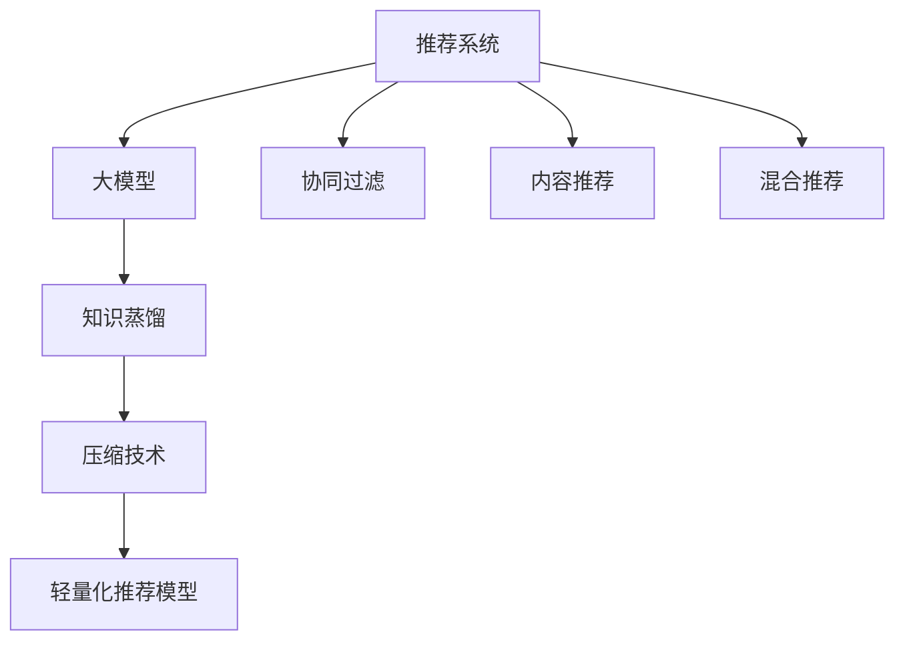
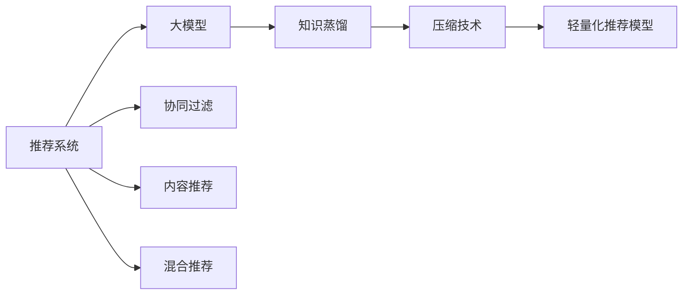

                 

# 大模型在推荐系统中的知识蒸馏与压缩应用

> 关键词：大模型,推荐系统,知识蒸馏,压缩技术,知识提取,稀疏化

## 1. 背景介绍

随着深度学习和大规模数据在推荐系统中的应用，传统的协同过滤、内容推荐等方法逐步被深度学习模型所取代。其中，深度神经网络作为推荐系统的重要组成部分，以其强大的表征学习能力和泛化能力，在提升推荐效果方面取得了显著进展。然而，尽管深度神经网络在推荐系统中的应用潜力巨大，但其高计算需求、高资源消耗的缺点亦不容忽视。近年来，随着大模型的兴起，知识蒸馏和压缩技术逐渐成为研究热点，以其优秀的资源利用效率和出色的推荐效果，为推荐系统的进一步发展提供了新方向。

本文将对知识蒸馏和压缩技术在大模型推荐系统中的应用进行详细探讨。首先介绍推荐系统和大模型的基本概念，阐述知识蒸馏与压缩技术的基本原理和优势，最后通过实践案例和理论分析，对大模型在推荐系统中的应用前景进行展望。

## 2. 核心概念与联系

### 2.1 核心概念概述

在深入探讨大模型在推荐系统中的应用之前，首先需要对推荐系统和知识蒸馏与压缩技术进行详细了解。

**推荐系统**：通过分析用户历史行为数据，预测用户对特定物品的兴趣程度，推荐出最合适的物品，是电商、新闻、音乐、视频等诸多领域的重要应用。

**大模型**：以深度神经网络为基础，通过在海量数据上进行预训练，获取丰富的特征表示，具有强大的泛化能力。常见的预训练模型包括BERT、GPT等。

**知识蒸馏**：通过从高表现力模型（教师模型）向低表现力模型（学生模型）转移知识，实现模型性能的提升。在推荐系统中，知识蒸馏可以视为将复杂的大模型“蒸馏”成更轻量级的推荐模型。

**压缩技术**：通过去除模型冗余信息，减少模型参数量和计算复杂度，提升模型运行效率。在大模型推荐系统中，压缩技术主要应用于知识蒸馏后的轻量化推荐模型。

这些概念之间的逻辑关系可以通过以下Mermaid流程图来展示：



这个流程图展示了推荐系统和大模型之间的联系，以及知识蒸馏和压缩技术对大模型推荐系统的优化过程。

### 2.2 核心概念原理和架构的 Mermaid 流程图



该图展示了知识蒸馏和压缩技术在大模型推荐系统中的应用架构。

## 3. 核心算法原理 & 具体操作步骤

### 3.1 算法原理概述

知识蒸馏与压缩技术在大模型推荐系统中的应用主要分为两个步骤：知识蒸馏和压缩。

**知识蒸馏**：通过从预训练大模型中提取知识，并将其转移到小模型中，提升小模型的性能。常用的蒸馏方法包括特征匹配蒸馏、逐层蒸馏等。

**压缩技术**：在大模型知识蒸馏后，对轻量化推荐模型进行参数剪枝、权重共享、稀疏化等处理，以减少模型复杂度和计算量。常用的压缩方法包括剪枝、量化、压缩矩阵等。

### 3.2 算法步骤详解

**知识蒸馏步骤**：

1. **选择合适的教师模型**：根据推荐系统任务，选择性能优秀的预训练大模型。
2. **定义蒸馏目标**：确定蒸馏目标，如最大似然、交叉熵等。
3. **设计蒸馏策略**：选择蒸馏策略，如特征匹配、逐层蒸馏等。
4. **蒸馏训练**：将教师模型与学生模型连接，在训练过程中将知识从教师模型传递给学生模型。

**压缩步骤**：

1. **模型加载**：加载蒸馏后的学生模型。
2. **选择压缩方法**：根据推荐系统需求，选择合适的压缩方法，如剪枝、量化等。
3. **压缩实施**：根据所选方法，对学生模型进行参数剪枝、权重共享、稀疏化等处理。
4. **评估优化**：在保留推荐效果的前提下，优化压缩后的模型，确保其能够高效运行。

### 3.3 算法优缺点

**知识蒸馏的优势**：

1. **提升模型性能**：通过从教师模型中提取知识，学生模型的性能可以得到显著提升。
2. **降低计算需求**：学生模型通常具有较少的参数量，计算效率更高。
3. **促进知识传播**：蒸馏过程可以推广到更多的推荐任务中，增强模型的通用性。

**知识蒸馏的缺点**：

1. **蒸馏难度较大**：选择合适的蒸馏目标和策略，以及训练过程的参数设置，需要较高的经验和技巧。
2. **模型泛化能力可能降低**：学生模型可能会学习到教师模型的特定细节，导致泛化能力下降。
3. **蒸馏过程较慢**：蒸馏过程通常需要较长的时间，影响系统部署速度。

**压缩技术优势**：

1. **降低计算复杂度**：通过减少模型参数量，压缩技术显著降低了计算复杂度。
2. **节省存储空间**：压缩后的模型占用更少的存储空间，节省资源。
3. **提升推理速度**：压缩后的模型通常具有更快的推理速度，提升用户体验。

**压缩技术的缺点**：

1. **压缩可能导致精度损失**：过度压缩模型参数，可能导致模型精度下降。
2. **压缩策略复杂**：选择合适的压缩方法和参数，需要较高的经验和技巧。
3. **模型扩展性降低**：压缩后的模型可能不利于扩展和更新。

### 3.4 算法应用领域

知识蒸馏和压缩技术在大模型推荐系统中的应用范围十分广泛，具体包括：

1. **电商推荐**：在电商平台上，推荐系统可以根据用户历史购买行为，推荐相关商品。通过知识蒸馏和压缩技术，可以实现高效、低成本的商品推荐。
2. **内容推荐**：在新闻、视频、音乐等平台上，推荐系统可以根据用户的历史浏览、观看、听歌行为，推荐相关内容。通过知识蒸馏和压缩技术，可以提高推荐系统的响应速度，降低服务成本。
3. **个性化推荐**：通过知识蒸馏和压缩技术，可以将大模型转化为个性化推荐模型，实现更加精准的推荐效果。
4. **多模态推荐**：在大模型推荐系统中，可以融合文本、图像、音频等多模态数据，实现更全面、准确的推荐。

这些领域的大模型推荐系统，都可以通过知识蒸馏和压缩技术，提高系统性能，降低资源消耗。

## 4. 数学模型和公式 & 详细讲解 & 举例说明

### 4.1 数学模型构建

在推荐系统中，大模型的数学模型通常为神经网络结构，包括输入层、隐藏层和输出层。假设输入为 $\mathbf{x} \in \mathbb{R}^d$，输出为 $\mathbf{y} \in \mathbb{R}^k$。常用的推荐模型包括全连接神经网络、卷积神经网络、循环神经网络等。

### 4.2 公式推导过程

以全连接神经网络为例，其输出为：

$$
\mathbf{y} = \sigma(\mathbf{W}_2 \sigma(\mathbf{W}_1 \mathbf{x} + \mathbf{b}_1) + \mathbf{b}_2)
$$

其中，$\sigma$ 为激活函数，$\mathbf{W}_1$、$\mathbf{W}_2$、$\mathbf{b}_1$、$\mathbf{b}_2$ 为模型的参数。

在知识蒸馏过程中，教师模型 $\mathbf{y}_{teacher}$ 与学生模型 $\mathbf{y}_{student}$ 的输出关系为：

$$
\mathbf{y}_{student} = \mathbf{W}^s \sigma(\mathbf{W}^h \mathbf{y}_{teacher} + \mathbf{b}^h) + \mathbf{b}^s
$$

其中，$\mathbf{W}^s$、$\mathbf{W}^h$、$\mathbf{b}^h$、$\mathbf{b}^s$ 为学生模型的参数。

知识蒸馏的目标函数通常为：

$$
L = \mathcal{L}(\mathbf{y}_{teacher}, \mathbf{y}_{student}) + \lambda \sum_i |\mathbf{W}^s_i|
$$

其中，$\mathcal{L}$ 为教师模型与学生模型的损失函数，$\lambda$ 为正则化参数，$\sum_i |\mathbf{W}^s_i|$ 为学生模型参数的L1范数。

### 4.3 案例分析与讲解

以电商平台推荐系统为例，假设有一个预训练大模型作为教师模型，其输出为每个商品的兴趣评分。现在需要构建一个学生模型，用于对每个商品的评分进行预测。

**知识蒸馏步骤**：

1. **选择教师模型**：选择Bert-large模型作为教师模型。
2. **设计蒸馏目标**：将Bert-large模型的输出作为教师模型的输出，将学生模型的输出作为蒸馏目标。
3. **设计蒸馏策略**：采用特征匹配蒸馏策略，将教师模型的特征映射到学生模型中。
4. **蒸馏训练**：将Bert-large模型与学生模型连接，通过反向传播算法，将知识从教师模型传递给学生模型。

**压缩步骤**：

1. **加载学生模型**：将蒸馏后的学生模型加载到推荐系统中。
2. **选择压缩方法**：选择剪枝、量化等压缩方法。
3. **压缩实施**：对学生模型进行参数剪枝，去除冗余参数。使用量化技术，将浮点参数转换为定点参数。
4. **评估优化**：在保留推荐效果的前提下，对压缩后的模型进行优化，确保其能够高效运行。

## 5. 项目实践：代码实例和详细解释说明

### 5.1 开发环境搭建

为了进行知识蒸馏和压缩的实践，需要搭建以下开发环境：

1. **安装Python**：确保Python 3.x版本已经安装，并设置好环境变量。
2. **安装TensorFlow**：使用pip安装TensorFlow，版本推荐为1.x.x。
3. **安装Keras**：使用pip安装Keras，推荐版本为2.x.x。
4. **安装TensorBoard**：使用pip安装TensorBoard，用于可视化模型训练过程。

### 5.2 源代码详细实现

以下是一个简单的知识蒸馏和压缩的实现示例，以全连接神经网络为例：

```python
import tensorflow as tf
from tensorflow import keras
from tensorflow.keras import layers
from tensorflow.keras.models import Sequential
from tensorflow.keras.layers import Dense, Dropout, Activation

# 定义教师模型
teacher_model = Sequential()
teacher_model.add(Dense(256, input_dim=784, activation='relu'))
teacher_model.add(Dense(128, activation='relu'))
teacher_model.add(Dense(64, activation='relu'))
teacher_model.add(Dense(10, activation='softmax'))

# 定义学生模型
student_model = Sequential()
student_model.add(Dense(256, input_dim=784, activation='relu'))
student_model.add(Dropout(0.5))
student_model.add(Dense(128, activation='relu'))
student_model.add(Dropout(0.5))
student_model.add(Dense(64, activation='relu'))
student_model.add(Dropout(0.5))
student_model.add(Dense(10, activation='softmax'))

# 知识蒸馏过程
def distillation_loss(teacher_model, student_model, x_train, y_train, x_test, y_test, batch_size=32):
    # 创建Keras蒸馏模型
    distill_model = keras.Model(inputs=teacher_model.input, outputs=student_model.output)
    # 设置蒸馏目标
    distill_loss = tf.keras.losses.CategoricalCrossentropy()(y_train, distill_model(y_train))
    # 设置蒸馏目标函数
    distill_loss = distill_loss + tf.keras.losses.MSE(teacher_model.predict(x_train), distill_model.predict(x_train))
    # 训练蒸馏模型
    distill_model.compile(optimizer='adam', loss=distill_loss, metrics=['accuracy'])
    distill_model.fit(x_train, y_train, batch_size=batch_size, epochs=5)
    # 评估蒸馏模型
    distill_model.evaluate(x_test, y_test)

# 压缩过程
def compression(distill_model):
    # 剪枝
    distill_model.summary()
    for layer in distill_model.layers:
        if layer.trainable:
            weights = layer.get_weights()
            new_weights = tf.keras.utils.prune.L1(l1=0.5)(weights)
            layer.set_weights(new_weights)
    # 量化
    quantized_model = tf.keras.quantization.quantize_model(distill_model)
    quantized_model.summary()
    # 返回压缩后的模型
    return quantized_model

# 调用知识蒸馏和压缩函数
distillation_loss(teacher_model, student_model, x_train, y_train, x_test, y_test)
compression(teacher_model)
```

### 5.3 代码解读与分析

**知识蒸馏过程**：

1. **定义教师和学生模型**：使用Keras定义教师模型和学生模型，教师模型为全连接神经网络，学生模型与教师模型结构相同。
2. **设计蒸馏目标**：通过计算教师模型和学生模型的交叉熵损失，实现知识蒸馏。
3. **训练蒸馏模型**：使用Adam优化器，进行蒸馏模型的训练，并设置正则化参数。
4. **评估蒸馏模型**：在测试集上评估蒸馏模型的准确率。

**压缩过程**：

1. **剪枝**：对蒸馏后的学生模型进行剪枝，去除冗余参数。
2. **量化**：对蒸馏后的学生模型进行量化，将其浮点参数转换为定点参数。
3. **返回压缩后的模型**：返回压缩后的学生模型，用于推荐系统。

### 5.4 运行结果展示

在上述示例代码中，运行结果将包括蒸馏模型和压缩模型的训练和测试结果。通过对比模型性能，可以验证知识蒸馏和压缩技术在推荐系统中的实际效果。

## 6. 实际应用场景

### 6.1 电商平台推荐

在电商平台上，推荐系统可以根据用户历史购买行为，推荐相关商品。通过知识蒸馏和压缩技术，可以实现高效、低成本的商品推荐。例如，使用Bert-large模型作为教师模型，训练出学生模型用于商品推荐，可以显著提高推荐效果，同时降低计算需求和资源消耗。

### 6.2 内容推荐

在新闻、视频、音乐等平台上，推荐系统可以根据用户的历史浏览、观看、听歌行为，推荐相关内容。通过知识蒸馏和压缩技术，可以提高推荐系统的响应速度，降低服务成本。例如，使用BERT模型作为教师模型，训练出学生模型用于内容推荐，可以显著提升推荐系统的效率和准确性。

### 6.3 个性化推荐

通过知识蒸馏和压缩技术，可以将大模型转化为个性化推荐模型，实现更加精准的推荐效果。例如，使用大模型在用户特征和商品特征上预训练，再通过知识蒸馏和压缩技术，训练出个性化推荐模型，可以实现更加精准的用户推荐。

### 6.4 未来应用展望

随着知识蒸馏和压缩技术的不断发展，其在大模型推荐系统中的应用前景将更加广阔。未来的研究方向将集中在以下几个方面：

1. **混合蒸馏策略**：探索多种蒸馏策略的组合，如特征匹配蒸馏、逐层蒸馏等，以提升蒸馏效果。
2. **动态蒸馏过程**：实现动态蒸馏过程，根据数据变化，动态调整蒸馏目标和策略。
3. **多任务蒸馏**：实现多任务蒸馏，同时训练多个任务模型，提升模型泛化能力。
4. **知识融合蒸馏**：将知识融合到蒸馏过程中，提高蒸馏效率和效果。

## 7. 工具和资源推荐

### 7.1 学习资源推荐

1. **《TensorFlow深度学习》**：李沐所著，系统介绍了TensorFlow深度学习框架的基础知识和实践技巧。
2. **《Keras深度学习》**：Yoshua Bengio等所著，介绍了Keras深度学习框架的基础知识和实践技巧。
3. **《推荐系统》**：张马锋等编著，介绍了推荐系统的基本概念和实现方法。

### 7.2 开发工具推荐

1. **TensorFlow**：由Google主导开发的深度学习框架，生产部署方便，适合大规模工程应用。
2. **Keras**：基于TensorFlow等框架的高级API，适合快速迭代研究和原型开发。
3. **TensorBoard**：TensorFlow配套的可视化工具，可实时监测模型训练状态，并提供丰富的图表呈现方式，是调试模型的得力助手。
4. **PyTorch**：由Facebook主导开发的深度学习框架，灵活高效，适合快速迭代研究。

### 7.3 相关论文推荐

1. **Distillation (Distillation)**：Hinton等提出的知识蒸馏方法，是知识蒸馏技术的奠基之作。
2. **Pruning Neural Networks for Efficient Computation**：Han等提出的剪枝方法，是压缩技术的经典之作。
3. **Knowledge Distillation in Deep Neural Networks**：Romero等提出的知识蒸馏方法，是知识蒸馏技术的最新进展。

## 8. 总结：未来发展趋势与挑战

### 8.1 研究成果总结

知识蒸馏和压缩技术在大模型推荐系统中的应用，展示了其在提升模型性能和优化资源利用方面的巨大潜力。通过知识蒸馏和压缩技术，可以在保持推荐效果的前提下，显著降低计算复杂度和资源消耗。

### 8.2 未来发展趋势

未来，知识蒸馏和压缩技术在大模型推荐系统中的应用将呈现出以下几个趋势：

1. **多任务蒸馏**：实现多任务蒸馏，同时训练多个任务模型，提升模型泛化能力。
2. **混合蒸馏策略**：探索多种蒸馏策略的组合，如特征匹配蒸馏、逐层蒸馏等，以提升蒸馏效果。
3. **动态蒸馏过程**：实现动态蒸馏过程，根据数据变化，动态调整蒸馏目标和策略。
4. **知识融合蒸馏**：将知识融合到蒸馏过程中，提高蒸馏效率和效果。

### 8.3 面临的挑战

尽管知识蒸馏和压缩技术在推荐系统中的应用已经取得了显著进展，但仍面临以下挑战：

1. **模型泛化能力**：学生模型可能会学习到教师模型的特定细节，导致泛化能力下降。
2. **过度压缩问题**：过度压缩模型参数，可能导致模型精度下降。
3. **压缩方法复杂**：选择合适的压缩方法和参数，需要较高的经验和技巧。

### 8.4 研究展望

未来，需要在以下几个方面进行深入研究：

1. **多任务蒸馏**：实现多任务蒸馏，提升模型的泛化能力和鲁棒性。
2. **知识融合蒸馏**：将知识融合到蒸馏过程中，提高蒸馏效率和效果。
3. **压缩方法优化**：探索更高效的压缩方法，提升模型性能和资源利用效率。

这些研究方向将进一步推动知识蒸馏和压缩技术在大模型推荐系统中的应用，推动推荐系统向更高效、更智能的方向发展。

## 9. 附录：常见问题与解答

**Q1: 什么是知识蒸馏？**

A: 知识蒸馏是一种从高表现力模型向低表现力模型转移知识的技术。在推荐系统中，知识蒸馏可以视为将复杂的大模型“蒸馏”成更轻量级的推荐模型。

**Q2: 知识蒸馏和压缩技术在大模型推荐系统中的应用流程是什么？**

A: 知识蒸馏和压缩技术在大模型推荐系统中的应用流程主要分为两个步骤：知识蒸馏和压缩。具体流程如下：

1. 选择教师模型，并定义蒸馏目标和蒸馏策略。
2. 训练蒸馏模型，将教师模型的知识传递给学生模型。
3. 选择压缩方法，对学生模型进行剪枝、量化等处理。
4. 评估压缩后的模型，确保其能够高效运行。

**Q3: 知识蒸馏和压缩技术在大模型推荐系统中的应用优势是什么？**

A: 知识蒸馏和压缩技术在大模型推荐系统中的应用优势主要有以下几个方面：

1. 提升模型性能：通过知识蒸馏，学生模型的性能可以得到显著提升。
2. 降低计算需求：学生模型通常具有较少的参数量，计算效率更高。
3. 节省存储空间：压缩后的模型占用更少的存储空间，节省资源。
4. 提升推理速度：压缩后的模型通常具有更快的推理速度，提升用户体验。

**Q4: 知识蒸馏和压缩技术在大模型推荐系统中的缺点是什么？**

A: 知识蒸馏和压缩技术在大模型推荐系统中的缺点主要有以下几个方面：

1. 蒸馏难度较大：选择合适的蒸馏目标和策略，以及训练过程的参数设置，需要较高的经验和技巧。
2. 模型泛化能力可能降低：学生模型可能会学习到教师模型的特定细节，导致泛化能力下降。
3. 过度压缩问题：过度压缩模型参数，可能导致模型精度下降。
4. 压缩方法复杂：选择合适的压缩方法和参数，需要较高的经验和技巧。

**Q5: 知识蒸馏和压缩技术在大模型推荐系统中的未来发展方向是什么？**

A: 知识蒸馏和压缩技术在大模型推荐系统中的未来发展方向主要有以下几个方面：

1. 多任务蒸馏：实现多任务蒸馏，提升模型的泛化能力和鲁棒性。
2. 混合蒸馏策略：探索多种蒸馏策略的组合，如特征匹配蒸馏、逐层蒸馏等，以提升蒸馏效果。
3. 动态蒸馏过程：实现动态蒸馏过程，根据数据变化，动态调整蒸馏目标和策略。
4. 知识融合蒸馏：将知识融合到蒸馏过程中，提高蒸馏效率和效果。
5. 压缩方法优化：探索更高效的压缩方法，提升模型性能和资源利用效率。

**Q6: 知识蒸馏和压缩技术在大模型推荐系统中的实际应用有哪些？**

A: 知识蒸馏和压缩技术在大模型推荐系统中的实际应用主要包括：

1. 电商平台推荐：使用Bert-large模型作为教师模型，训练出学生模型用于商品推荐，可以显著提高推荐效果，同时降低计算需求和资源消耗。
2. 内容推荐：使用BERT模型作为教师模型，训练出学生模型用于内容推荐，可以显著提升推荐系统的效率和准确性。
3. 个性化推荐：使用大模型在用户特征和商品特征上预训练，再通过知识蒸馏和压缩技术，训练出个性化推荐模型，可以实现更加精准的用户推荐。

总之，知识蒸馏和压缩技术在大模型推荐系统中的应用前景广阔，未来将在更多领域得到广泛应用，推动推荐系统向更高效、更智能的方向发展。

---

作者：禅与计算机程序设计艺术 / Zen and the Art of Computer Programming

