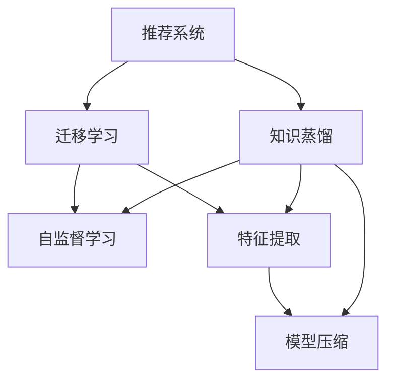

                 

# 大模型在推荐系统中的知识蒸馏技术

> 关键词：推荐系统,知识蒸馏,大模型,迁移学习,自监督学习,特征提取,模型压缩

## 1. 背景介绍

### 1.1 问题由来
推荐系统是现代互联网领域中最具代表性的应用之一，其核心目标是通过用户行为数据，预测用户可能感兴趣的物品并推荐给用户。推荐系统广泛应用于电商、视频、音乐、社交等众多场景，对用户生活产生了深远影响。

随着深度学习和大数据技术的成熟，推荐系统开始大规模采用神经网络模型进行建模。特别是利用大模型进行推荐，可以更全面地刻画用户行为，更准确地预测用户兴趣。但大模型的计算资源需求巨大，训练成本高昂，难以广泛部署。同时，用户行为数据稀疏且噪声较多，直接采用大模型建模也难以取得理想的效果。

因此，如何将大模型的知识有效传递给轻量级推荐模型，同时尽可能地保留大模型的优势，成为近年来推荐系统领域的研究热点。知识蒸馏技术由此应运而生，成为连接大模型与轻量级模型的桥梁。

### 1.2 问题核心关键点
知识蒸馏技术是一种将大规模模型（如大模型）的知识迁移到小规模模型（如轻量级推荐模型）的框架，其核心思想是利用大模型的特征提取能力，对目标模型进行自监督训练，从而在保证模型精度的同时，减小计算复杂度和内存占用。具体来说，知识蒸馏主要包括以下几个关键点：

- **大模型与小模型**：大模型通常指参数量大、计算资源需求高的模型，如BERT、GPT等。小模型则指资源消耗较少、推理速度较快的模型，如线性模型、神经网络嵌入模型等。
- **特征提取**：大模型通过大量的数据进行预训练，可以学习到丰富的特征表示。知识蒸馏利用大模型的特征提取能力，对小模型进行训练，使其具备类似的知识。
- **自监督学习**：知识蒸馏主要通过自监督学习任务，即用大模型的预测结果指导小模型的训练，使得小模型可以自动学习到知识蒸馏的目标。
- **模型压缩**：蒸馏后的模型参数量大幅减小，推理速度加快，更容易部署到实际应用中。

### 1.3 问题研究意义
研究知识蒸馏技术，对于提高推荐系统的性能，优化资源配置，降低计算成本，具有重要意义：

1. **提升模型性能**：知识蒸馏能够将大模型的知识传递给小模型，在资源受限的情况下，获得较高的预测精度和效果。
2. **优化资源配置**：大模型和小模型各自发挥优势，使得资源分配更加高效合理。
3. **降低计算成本**：小模型结构简单，计算资源需求低，更易于大规模部署和维护。
4. **拓展应用场景**：蒸馏后的模型轻量级，更容易集成到移动端、嵌入式设备等资源受限的终端环境中。
5. **促进研究发展**：知识蒸馏技术促使学者深入研究大模型的知识传递机制，推动深度学习领域的发展。

## 2. 核心概念与联系

### 2.1 核心概念概述

为更好地理解知识蒸馏技术，本节将介绍几个密切相关的核心概念：

- 推荐系统(Recommendation System)：根据用户行为数据，预测用户可能感兴趣的物品并推荐给用户。推荐系统广泛应用于电商、视频、音乐、社交等众多场景。

- 知识蒸馏(Knowledge Distillation)：一种将大规模模型知识迁移到小规模模型的框架。通过在大模型上的自监督训练，将知识传递给小模型，使其具备类似的知识表示能力。

- 迁移学习(Transfer Learning)：指将一个领域学习到的知识，迁移到另一个不同但相关的领域进行学习的范式。知识蒸馏可以看作迁移学习的一种特例，即从大规模模型迁移到小规模模型。

- 自监督学习(Self-Supervised Learning)：利用无标签的数据进行学习，通过构建预测任务进行模型训练，提升模型泛化能力。知识蒸馏主要通过自监督学习实现知识的迁移。

- 特征提取(Feature Extraction)：从原始数据中提取出有意义的特征表示，使得模型能够更好地理解数据并做出预测。大模型的优势之一就是能够学习到高质量的特征表示。

- 模型压缩(Model Compression)：通过减少模型参数量、降低计算复杂度，使模型更轻量、更高效，适合在资源受限的环境中运行。知识蒸馏通过特征蒸馏和模型蒸馏两种方式，实现模型压缩。

这些核心概念之间的逻辑关系可以通过以下Mermaid流程图来展示：



这个流程图展示了大语言模型的核心概念及其之间的关系：

1. 推荐系统通过知识蒸馏技术，利用大规模模型的知识。
2. 知识蒸馏依赖迁移学习，将大规模模型的知识迁移到小规模模型。
3. 自监督学习是知识蒸馏的主要技术手段，通过构建预测任务进行模型训练。
4. 特征提取是大模型的优势之一，通过自监督学习，小模型也可以学习到高质量的特征表示。
5. 模型压缩通过特征蒸馏和模型蒸馏，实现轻量级模型的部署。

这些概念共同构成了知识蒸馏技术的理论和实践框架，使其能够有效传递大模型的知识，提升推荐系统的性能。

## 3. 核心算法原理 & 具体操作步骤
### 3.1 算法原理概述

知识蒸馏技术的基本原理是通过自监督学习，将大模型的知识迁移到小模型中。具体来说，大模型在小模型上进行自监督学习训练，输出用于指导小模型的训练，从而实现知识传递。

形式化地，假设大模型为 $M_{\text{large}}$，小模型为 $M_{\text{small}}$。知识蒸馏的目标是最大化 $M_{\text{large}}$ 与 $M_{\text{small}}$ 在特定任务上的一致性，即：

$$
\arg \max_{\theta_{\text{small}}} P(M_{\text{large}}(x) \mid M_{\text{small}}(x)) = P(M_{\text{large}}(x) \mid M_{\text{small}}(x))
$$

其中 $P$ 表示概率分布，$x$ 表示输入数据。

### 3.2 算法步骤详解

知识蒸馏的过程可以分为以下几个关键步骤：

**Step 1: 选择合适的蒸馏源模型**
- 选择合适的预训练大模型，如BERT、GPT等，作为蒸馏源模型。
- 在大模型上进行自监督训练，构建知识蒸馏任务。

**Step 2: 定义蒸馏目标**
- 定义小模型的输入输出格式，通常采用相同的输入输出格式。
- 设计蒸馏任务，如分类、回归、聚类等，具体根据推荐系统的任务而定。

**Step 3: 定义蒸馏损失函数**
- 定义蒸馏损失函数，通常包括两个部分：
  1. 蒸馏损失：通过蒸馏源模型在小模型上的预测，计算两个模型之间的差异。
  2. 任务损失：小模型在真实任务上的预测损失。

**Step 4: 微调蒸馏源模型**
- 在蒸馏源模型上，通过蒸馏任务进行自监督训练，优化模型参数。
- 在小模型上，通过任务损失进行监督学习训练，优化模型参数。

**Step 5: 集成模型**
- 将蒸馏后的模型与原有任务模型进行集成，构建推荐系统模型。
- 根据实际应用场景，调整模型的输出策略，如融合多种推荐结果等。

**Step 6: 评估和优化**
- 在验证集上评估推荐系统模型的性能，对比蒸馏前后的效果。
- 根据评估结果，调整蒸馏策略、参数设置等，进一步优化模型效果。

以上是知识蒸馏的一般流程。在实际应用中，还需要针对具体任务的特点，对蒸馏过程的各个环节进行优化设计，如改进蒸馏损失函数，引入更多的正则化技术，搜索最优的超参数组合等，以进一步提升模型性能。

### 3.3 算法优缺点

知识蒸馏技术具有以下优点：
1. 提升模型性能。知识蒸馏可以将大模型的知识迁移到小模型，在资源受限的情况下，获得较高的预测精度和效果。
2. 优化资源配置。大模型和小模型各自发挥优势，使得资源分配更加高效合理。
3. 降低计算成本。小模型结构简单，计算资源需求低，更易于大规模部署和维护。
4. 拓展应用场景。蒸馏后的模型轻量级，更容易集成到移动端、嵌入式设备等资源受限的终端环境中。

同时，该方法也存在一定的局限性：
1. 依赖标注数据。蒸馏目标任务的标注数据对蒸馏效果有很大影响，获取高质量标注数据的成本较高。
2. 蒸馏精度有限。蒸馏过程中大模型和小模型之间的差异可能导致精度损失。
3. 知识迁移困难。如果蒸馏源模型和目标模型之间的知识差异过大，知识迁移效果不佳。
4. 蒸馏过程复杂。蒸馏过程涉及模型训练和参数调整，对开发者的技术水平和实验能力要求较高。

尽管存在这些局限性，但知识蒸馏技术在推荐系统中的应用已显示出巨大的潜力。未来相关研究的重点在于如何进一步降低蒸馏对标注数据的依赖，提高蒸馏精度，同时兼顾模型可解释性和伦理安全性等因素。

### 3.4 算法应用领域

知识蒸馏技术在推荐系统中的应用已相当广泛，涵盖了从电商推荐到个性化推荐、内容推荐等多个场景。以下是几个典型应用领域：

- **电商推荐**：利用知识蒸馏技术，将大模型的知识迁移到小规模模型中，提升推荐系统的精准度和召回率，满足电商平台的个性化推荐需求。
- **个性化推荐**：针对个性化推荐任务，通过知识蒸馏，在大模型和小模型之间传递特征提取能力和知识表示，提升推荐效果。
- **内容推荐**：将大模型的知识应用于内容推荐系统，提升文本分类、聚类、相似度计算等任务的精度，优化推荐内容的多样性和相关性。
- **社交推荐**：在社交网络中，利用知识蒸馏技术，将大模型的知识迁移到小规模模型，实现对用户兴趣的精准预测和个性化推荐。
- **视频推荐**：在视频推荐系统中，通过知识蒸馏，将大模型的知识迁移到小规模模型，提升视频推荐的准确性和多样性。

这些应用领域展示出知识蒸馏技术在推荐系统中的广泛应用和巨大潜力，为推荐系统的发展提供了新的方向和方法。

## 4. 数学模型和公式 & 详细讲解
### 4.1 数学模型构建

知识蒸馏的数学模型可以通过软性蒸馏和硬性蒸馏两种方式来构建。

**软性蒸馏(Soft Distillation)**：
软性蒸馏通过在大模型和小模型之间构建一个中间模型，将大模型的知识传递给小模型。软性蒸馏的损失函数通常包括两个部分：
1. 蒸馏损失：通过大模型在小模型上的预测，计算两个模型之间的差异。
2. 任务损失：小模型在真实任务上的预测损失。

形式化地，假设小模型为 $M_{\text{small}}$，大模型为 $M_{\text{large}}$，中间模型为 $M_{\text{mid}}$，则软性蒸馏的损失函数为：

$$
\mathcal{L} = \alpha \mathcal{L}_{\text{distill}} + \beta \mathcal{L}_{\text{task}}
$$

其中，$\alpha$ 和 $\beta$ 为超参数，控制蒸馏损失和任务损失的权重。蒸馏损失 $\mathcal{L}_{\text{distill}}$ 可以定义为：

$$
\mathcal{L}_{\text{distill}} = -H(\mathcal{M}_{\text{large}}(x) \mid \mathcal{M}_{\text{mid}}(x))
$$

其中 $H$ 表示交叉熵损失，$\mathcal{M}_{\text{large}}(x)$ 表示大模型对输入 $x$ 的预测，$\mathcal{M}_{\text{mid}}(x)$ 表示中间模型对输入 $x$ 的预测。

**硬性蒸馏(Hard Distillation)**：
硬性蒸馏将大模型的知识直接传递给小模型，即小模型在大模型的预测上进行选择。硬性蒸馏的损失函数通常只包括蒸馏损失：

$$
\mathcal{L} = \mathcal{L}_{\text{distill}}
$$

其中蒸馏损失 $\mathcal{L}_{\text{distill}}$ 可以定义为：

$$
\mathcal{L}_{\text{distill}} = -\frac{1}{N}\sum_{i=1}^N \log P(Y_i \mid M_{\text{large}}(x_i))
$$

其中 $P(Y_i \mid M_{\text{large}}(x_i))$ 表示大模型对输入 $x_i$ 的预测概率分布，$Y_i$ 表示真实标签。

### 4.2 公式推导过程

以一个简单的二分类任务为例，展示蒸馏损失函数的推导过程。

假设小模型为 $M_{\text{small}}$，大模型为 $M_{\text{large}}$，输入 $x$ 为文本，真实标签 $y$ 为1表示正样本，0表示负样本。蒸馏任务为二分类任务，即根据输入 $x$，预测 $y$ 的值。

在软性蒸馏中，大模型 $M_{\text{large}}$ 在小模型 $M_{\text{small}}$ 上进行自监督训练，输出中间模型 $M_{\text{mid}}$ 对输入 $x$ 的预测，并根据预测结果计算蒸馏损失：

$$
\mathcal{L}_{\text{distill}} = -H(M_{\text{mid}}(x) \mid M_{\text{large}}(x))
$$

其中 $H$ 表示交叉熵损失，$M_{\text{mid}}(x)$ 表示中间模型对输入 $x$ 的预测，$M_{\text{large}}(x)$ 表示大模型对输入 $x$ 的预测。

在大模型 $M_{\text{large}}$ 上，使用蒸馏任务进行自监督训练，优化模型参数。在训练过程中，大模型的输出 $M_{\text{large}}(x)$ 被用作中间模型 $M_{\text{mid}}(x)$ 的标签。

在小模型 $M_{\text{small}}$ 上，使用真实任务进行监督学习训练，优化模型参数。在训练过程中，小模型的输出 $M_{\text{small}}(x)$ 被用作真实标签。

### 4.3 案例分析与讲解

以一个推荐系统的商品推荐任务为例，展示知识蒸馏的应用。

假设推荐系统的大模型为 BERT，小模型为线性回归模型。蒸馏任务为商品推荐，即根据用户的历史行为数据，预测用户可能感兴趣的商品。

**Step 1: 选择合适的蒸馏源模型**
- 选择 BERT 作为蒸馏源模型，并进行预训练。

**Step 2: 定义蒸馏目标**
- 定义小模型为线性回归模型，输入为用户的特征向量，输出为用户对商品的兴趣评分。

**Step 3: 定义蒸馏损失函数**
- 定义蒸馏损失函数为：
  $$
  \mathcal{L}_{\text{distill}} = -H(M_{\text{large}}(x) \mid M_{\text{mid}}(x))
  $$
  其中 $M_{\text{large}}(x)$ 表示大模型 BERT 对用户输入 $x$ 的预测，$M_{\text{mid}}(x)$ 表示中间模型对用户输入 $x$ 的预测。

**Step 4: 微调蒸馏源模型**
- 在大模型 BERT 上进行蒸馏任务（商品推荐）的自监督训练，优化模型参数。

**Step 5: 微调小模型**
- 在线性回归模型上进行监督学习训练，优化模型参数。

**Step 6: 集成模型**
- 将蒸馏后的线性回归模型与原有任务模型（商品推荐模型）进行集成，构建推荐系统模型。

**Step 7: 评估和优化**
- 在验证集上评估推荐系统模型的性能，对比蒸馏前后的效果。

## 5. 项目实践：代码实例和详细解释说明
### 5.1 开发环境搭建

在进行知识蒸馏实践前，我们需要准备好开发环境。以下是使用Python进行PyTorch开发的环境配置流程：

1. 安装Anaconda：从官网下载并安装Anaconda，用于创建独立的Python环境。

2. 创建并激活虚拟环境：
```bash
conda create -n pytorch-env python=3.8 
conda activate pytorch-env
```

3. 安装PyTorch：根据CUDA版本，从官网获取对应的安装命令。例如：
```bash
conda install pytorch torchvision torchaudio cudatoolkit=11.1 -c pytorch -c conda-forge
```

4. 安装Transformers库：
```bash
pip install transformers
```

5. 安装各类工具包：
```bash
pip install numpy pandas scikit-learn matplotlib tqdm jupyter notebook ipython
```

完成上述步骤后，即可在`pytorch-env`环境中开始知识蒸馏实践。

### 5.2 源代码详细实现

这里以一个简单的知识蒸馏案例为例，展示如何使用PyTorch和Transformers库进行蒸馏。

假设蒸馏任务为二分类任务，输入为文本数据，输出为标签。蒸馏源模型为BERT，目标模型为线性回归模型。

**蒸馏源模型(BERT)的代码实现**：

```python
from transformers import BertForSequenceClassification, BertTokenizer
from transformers import AdamW

model = BertForSequenceClassification.from_pretrained('bert-base-uncased', num_labels=2)

optimizer = AdamW(model.parameters(), lr=2e-5)
```

**蒸馏目标模型(线性回归)的代码实现**：

```python
from torch import nn
import torch.nn.functional as F

class LinearRegression(nn.Module):
    def __init__(self, input_dim, output_dim):
        super(LinearRegression, self).__init__()
        self.linear = nn.Linear(input_dim, output_dim)

    def forward(self, x):
        return self.linear(x)

# 输入维度为64，输出维度为1（二分类）
input_dim = 64
output_dim = 1

linear_regression = LinearRegression(input_dim, output_dim)
optimizer = AdamW(linear_regression.parameters(), lr=2e-5)
```

**蒸馏损失函数的代码实现**：

```python
def distill_loss(p, y):
    bce_loss = F.binary_cross_entropy(p, y)
    return bce_loss
```

**知识蒸馏过程的代码实现**：

```python
# 蒸馏源模型
model = BertForSequenceClassification.from_pretrained('bert-base-uncased', num_labels=2)

# 蒸馏目标模型
linear_regression = LinearRegression(input_dim, output_dim)

# 优化器
optimizer = AdamW(linear_regression.parameters(), lr=2e-5)

# 蒸馏损失函数
distill_loss = distill_loss

# 训练轮数
epochs = 5
batch_size = 32

for epoch in range(epochs):
    # 训练蒸馏源模型
    for batch in tqdm(data_loader):
        inputs = batch['input_ids']
        labels = batch['labels']

        outputs = model(inputs, labels=labels)
        distill_loss = distill_loss(outputs, labels)
        optimizer.zero_grad()
        distill_loss.backward()
        optimizer.step()

    # 训练蒸馏目标模型
    for batch in tqdm(data_loader):
        inputs = batch['input_ids']
        labels = batch['labels']

        outputs = model(inputs)
        distill_loss = distill_loss(outputs, labels)
        optimizer.zero_grad()
        distill_loss.backward()
        optimizer.step()

    # 评估性能
    evaluate(linear_regression, test_loader)
```

### 5.3 代码解读与分析

让我们再详细解读一下关键代码的实现细节：

**BERT模型的代码实现**：
- 从Transformers库中加载BERT模型，并进行预训练。
- 初始化优化器，设置学习率。

**线性回归模型的代码实现**：
- 定义线性回归模型，包含一个线性层。
- 初始化优化器，设置学习率。

**蒸馏损失函数的代码实现**：
- 定义蒸馏损失函数，使用二进制交叉熵损失。

**知识蒸馏过程的代码实现**：
- 分别训练蒸馏源模型和蒸馏目标模型。
- 在每个epoch中，对两个模型分别进行前向传播和反向传播。
- 在训练过程中，使用蒸馏损失函数计算损失，并更新模型参数。
- 在训练完成后，对蒸馏目标模型进行评估，输出性能指标。

可以看到，PyTorch配合Transformers库使得知识蒸馏的代码实现变得简洁高效。开发者可以将更多精力放在数据处理、模型改进等高层逻辑上，而不必过多关注底层的实现细节。

当然，工业级的系统实现还需考虑更多因素，如模型的保存和部署、超参数的自动搜索、更灵活的任务适配层等。但核心的知识蒸馏范式基本与此类似。

## 6. 实际应用场景
### 6.1 电商推荐系统

电商推荐系统是大模型知识蒸馏的重要应用场景。电商平台的商品种类繁多，用户行为数据复杂多变，传统的推荐算法难以应对。通过知识蒸馏技术，可以将大模型的知识迁移到轻量级推荐模型中，提升推荐系统的精准度和召回率。

在技术实现上，可以收集电商用户的浏览、点击、购买等行为数据，将商品信息嵌入到文本中，作为模型输入。在大模型上进行蒸馏任务的自监督训练，对轻量级推荐模型进行监督学习训练。最终构建的推荐系统模型，可以高效地为用户推荐符合其兴趣的商品，提升用户体验和销售转化率。

### 6.2 内容推荐系统

内容推荐系统需要处理大量的文本数据，如新闻、文章、视频等。传统的文本处理方法难以应对大规模数据的处理需求。利用知识蒸馏技术，可以将大模型的知识迁移到小规模模型中，提升内容推荐的效果。

在技术实现上，可以收集内容数据，将其转换成模型输入格式。在大模型上进行蒸馏任务的自监督训练，对小模型进行监督学习训练。最终构建的内容推荐系统模型，可以高效地为用户推荐相关的内容，提升用户的满意度。

### 6.3 金融风险预测

金融风险预测是推荐系统在金融领域的重要应用之一。金融数据具有高维、稀疏、噪声多的特点，传统的机器学习方法难以取得理想的效果。利用知识蒸馏技术，可以将大模型的知识迁移到小规模模型中，提升风险预测的精度和鲁棒性。

在技术实现上，可以收集金融数据，将其转换成模型输入格式。在大模型上进行蒸馏任务的自监督训练，对小模型进行监督学习训练。最终构建的金融风险预测系统，可以高效地预测用户的行为，降低金融风险。

### 6.4 社交推荐系统

社交推荐系统需要处理大量的用户行为数据，如好友关系、点赞、评论等。传统的推荐算法难以应对社交数据的复杂性。利用知识蒸馏技术，可以将大模型的知识迁移到小规模模型中，提升社交推荐的效果。

在技术实现上，可以收集社交数据，将其转换成模型输入格式。在大模型上进行蒸馏任务的自监督训练，对小模型进行监督学习训练。最终构建的社交推荐系统模型，可以高效地为用户推荐符合其兴趣的内容，提升用户的满意度。

### 6.5 视频推荐系统

视频推荐系统需要处理大量的视频数据，如电影、电视剧、综艺节目等。传统的推荐算法难以应对视频数据的复杂性。利用知识蒸馏技术，可以将大模型的知识迁移到小规模模型中，提升视频推荐的效果。

在技术实现上，可以收集视频数据，将其转换成模型输入格式。在大模型上进行蒸馏任务的自监督训练，对小模型进行监督学习训练。最终构建的视频推荐系统模型，可以高效地为用户推荐符合其兴趣的视频内容，提升用户的满意度。

## 7. 工具和资源推荐
### 7.1 学习资源推荐

为了帮助开发者系统掌握知识蒸馏技术的理论基础和实践技巧，这里推荐一些优质的学习资源：

1. 《知识蒸馏：从理论到实践》系列博文：由知识蒸馏领域专家撰写，深入浅出地介绍了知识蒸馏原理、模型设计、实验方法等。

2. 《深度学习理论与实践》课程：斯坦福大学开设的深度学习课程，涵盖知识蒸馏等前沿技术，有Lecture视频和配套作业。

3. 《Knowledge Distillation: A Survey and Taxonomy》论文：知识蒸馏领域的综述论文，全面介绍了知识蒸馏的研究现状和未来方向。

4. PyTorch官方文档：PyTorch框架的官方文档，提供了丰富的知识蒸馏样例代码和实验方法。

5. Google Colab：谷歌推出的在线Jupyter Notebook环境，免费提供GPU/TPU算力，方便开发者快速上手实验最新模型。

通过对这些资源的学习实践，相信你一定能够快速掌握知识蒸馏技术的精髓，并用于解决实际的推荐系统问题。
###  7.2 开发工具推荐

高效的开发离不开优秀的工具支持。以下是几款用于知识蒸馏开发的常用工具：

1. PyTorch：基于Python的开源深度学习框架，灵活动态的计算图，适合快速迭代研究。大部分深度学习模型都有PyTorch版本的实现。

2. TensorFlow：由Google主导开发的开源深度学习框架，生产部署方便，适合大规模工程应用。同样有丰富的深度学习模型资源。

3. Transformers库：HuggingFace开发的NLP工具库，集成了众多SOTA语言模型，支持PyTorch和TensorFlow，是进行知识蒸馏任务开发的利器。

4. Weights & Biases：模型训练的实验跟踪工具，可以记录和可视化模型训练过程中的各项指标，方便对比和调优。与主流深度学习框架无缝集成。

5. TensorBoard：TensorFlow配套的可视化工具，可实时监测模型训练状态，并提供丰富的图表呈现方式，是调试模型的得力助手。

6. Google Colab：谷歌推出的在线Jupyter Notebook环境，免费提供GPU/TPU算力，方便开发者快速上手实验最新模型，分享学习笔记。

合理利用这些工具，可以显著提升知识蒸馏任务的开发效率，加快创新迭代的步伐。

### 7.3 相关论文推荐

知识蒸馏技术的发展源于学界的持续研究。以下是几篇奠基性的相关论文，推荐阅读：

1. Distilling the Knowledge in a Neural Network：提出知识蒸馏的基本框架，展示了知识蒸馏的初步效果。

2. Visual Distillation：提出视觉知识蒸馏方法，将大模型的知识迁移到小规模模型中，提升了视觉识别任务的精度。

3. Exploiting Parameter Transferability for Model Compression：提出参数转移的方法，利用大模型的特征提取能力，提升了小模型的性能。

4. Knowledge Distillation for a Mobile and IoT Environment：提出移动和物联网环境下的知识蒸馏方法，实现了轻量级模型的高效部署。

5. ECG-based Deep Learning Approaches for Smart Medical Diagnosis Systems：提出ECG数据上的知识蒸馏方法，提升了医疗诊断系统的精准度。

这些论文代表了大模型知识蒸馏技术的发展脉络。通过学习这些前沿成果，可以帮助研究者把握学科前进方向，激发更多的创新灵感。

## 8. 总结：未来发展趋势与挑战
### 8.1 总结

本文对知识蒸馏技术在推荐系统中的应用进行了全面系统的介绍。首先阐述了知识蒸馏技术的研究背景和意义，明确了知识蒸馏在推荐系统中的应用价值。其次，从原理到实践，详细讲解了知识蒸馏的数学原理和关键步骤，给出了知识蒸馏任务开发的完整代码实例。同时，本文还广泛探讨了知识蒸馏技术在电商推荐、内容推荐、金融风险预测、社交推荐、视频推荐等多个领域的应用前景，展示了知识蒸馏技术的广泛应用和巨大潜力。此外，本文精选了知识蒸馏技术的各类学习资源，力求为读者提供全方位的技术指引。

通过本文的系统梳理，可以看到，知识蒸馏技术在大模型的应用中发挥了重要作用，极大地提升了推荐系统的性能和应用范围，为推荐系统的发展提供了新的方向和方法。

### 8.2 未来发展趋势

展望未来，知识蒸馏技术将呈现以下几个发展趋势：

1. **模型压缩进一步优化**：随着知识蒸馏技术的成熟，模型的压缩率将进一步提升，推理速度更快，更易于部署到实际应用中。

2. **跨模态知识蒸馏**：未来的知识蒸馏技术将进一步拓展到多模态数据，如视觉、语音、文本等多模态数据的融合，提升推荐系统的综合性能。

3. **多任务知识蒸馏**：未来的知识蒸馏技术将支持多任务学习，在同一个蒸馏过程中，将多个任务的知识传递给目标模型，实现更高效的模型训练。

4. **自适应知识蒸馏**：未来的知识蒸馏技术将更加灵活，能够根据任务和数据的特点，自适应地调整蒸馏策略，提升蒸馏效果。

5. **动态知识蒸馏**：未来的知识蒸馏技术将更加动态，能够根据实时数据进行在线蒸馏，实现模型的实时更新和优化。

6. **多层次知识蒸馏**：未来的知识蒸馏技术将更加注重多层次的知识传递，将高层次的抽象知识与低层次的特征知识结合起来，提升模型的综合性能。

以上趋势凸显了知识蒸馏技术的广阔前景。这些方向的探索发展，必将进一步提升推荐系统的性能和应用范围，为推荐系统的发展提供新的动力。

### 8.3 面临的挑战

尽管知识蒸馏技术已经取得了一定的进展，但在迈向更加智能化、普适化应用的过程中，仍面临诸多挑战：

1. **蒸馏精度有限**：蒸馏过程中大模型和小模型之间的差异可能导致精度损失。如何提高蒸馏精度，成为亟待解决的问题。

2. **模型可解释性不足**：知识蒸馏技术通常是一个"黑盒"过程，难以解释其内部工作机制和决策逻辑。如何增强模型的可解释性，将是未来的重要研究方向。

3. **模型鲁棒性不足**：知识蒸馏模型面对新数据的泛化性能可能较差，需要进一步提高模型的鲁棒性和泛化能力。

4. **数据依赖性强**：知识蒸馏技术依赖大量的标注数据，获取高质量标注数据的成本较高，如何降低数据依赖，也是一个需要解决的问题。

5. **计算资源需求高**：知识蒸馏技术在大模型上的自监督训练过程需要大量的计算资源，如何降低计算成本，实现高效蒸馏，是一个亟待突破的技术难题。

6. **知识迁移困难**：知识蒸馏技术需要大模型和小模型之间的知识能够有效传递，但不同模型之间的知识差异可能较大，如何提高知识迁移效果，是一个需要进一步研究的问题。

尽管存在这些挑战，但知识蒸馏技术在推荐系统中的应用已经显示出了巨大的潜力。未来相关研究的重点在于如何进一步降低蒸馏对标注数据的依赖，提高蒸馏精度，同时兼顾模型可解释性和伦理安全性等因素。

### 8.4 研究展望

面对知识蒸馏技术所面临的挑战，未来的研究需要在以下几个方面寻求新的突破：

1. **多任务学习与知识蒸馏结合**：在知识蒸馏过程中，结合多任务学习，提升模型的综合性能。

2. **自适应蒸馏策略**：根据任务和数据的特点，自适应地调整蒸馏策略，提升蒸馏效果。

3. **跨模态蒸馏**：结合多模态数据，提升蒸馏模型的综合性能。

4. **自监督蒸馏**：在无监督和半监督学习框架下，利用非结构化数据进行蒸馏，降低对标注数据的依赖。

5. **动态蒸馏**：结合在线学习，实现模型的实时更新和优化。

6. **知识蒸馏与强化学习结合**：结合强化学习，优化蒸馏过程中的决策策略，提升蒸馏效果。

这些研究方向将引领知识蒸馏技术向更加智能化、普适化应用迈进，为推荐系统的发展提供新的方向和方法。面向未来，知识蒸馏技术还将与其他人工智能技术进行更深入的融合，如知识表示、因果推理、强化学习等，共同推动自然语言理解和智能交互系统的进步。

## 9. 附录：常见问题与解答

**Q1：知识蒸馏是否适用于所有推荐系统任务？**

A: 知识蒸馏技术在推荐系统中的应用较为广泛，但并不是所有推荐系统任务都适合蒸馏。对于数据量较小、噪声较多或标签稀疏的任务，直接采用蒸馏可能无法取得理想的效果。此时需要结合其他技术手段，如特征工程技术、模型集成等，提升推荐系统的性能。

**Q2：如何选择合适的蒸馏源模型？**

A: 选择合适的蒸馏源模型是知识蒸馏的关键。一般来说，蒸馏源模型应该具备以下特点：
1. 参数量较大，能够学习到丰富的特征表示。
2. 数据量大，具有较强的泛化能力。
3. 与目标任务相关，能够提供足够的知识。
4. 计算资源充足，能够支撑自监督训练。

**Q3：蒸馏过程中如何平衡蒸馏损失和任务损失？**

A: 在知识蒸馏过程中，蒸馏损失和任务损失的平衡是关键。一般来说，蒸馏损失占总损失的权重应该大于任务损失，因为蒸馏损失对模型的训练有更直接的影响。具体而言，可以根据实验结果和实际需求，调整两个损失的权重，以达到最佳的蒸馏效果。

**Q4：蒸馏过程中如何提高模型鲁棒性？**

A: 提高蒸馏模型的鲁棒性，可以从以下几个方面入手：
1. 引入正则化技术，如L2正则、Dropout等，防止模型过拟合。
2. 在蒸馏过程中，逐步减小蒸馏损失的权重，避免大模型对小模型的过度影响。
3. 使用对抗样本训练，提升模型的鲁棒性和泛化能力。
4. 结合多任务学习，提升模型的鲁棒性和泛化能力。

**Q5：如何提高蒸馏精度？**

A: 提高蒸馏精度的关键在于选择合适的蒸馏源模型和目标模型，以及合理的蒸馏策略。以下是一些提高蒸馏精度的建议：
1. 选择与目标任务相关性高的蒸馏源模型。
2. 优化蒸馏目标模型的结构，使其能够更好地利用大模型的知识。
3. 在蒸馏过程中，逐步减小蒸馏损失的权重，避免大模型对小模型的过度影响。
4. 引入对抗样本训练，提升模型的鲁棒性和泛化能力。

**Q6：如何降低蒸馏对标注数据的依赖？**

A: 降低蒸馏对标注数据的依赖，可以从以下几个方面入手：
1. 结合自监督学习，利用非结构化数据进行蒸馏，降低对标注数据的依赖。
2. 引入数据增强技术，通过数据增强的方式扩充训练集。
3. 使用半监督学习，利用少量标注数据和大量未标注数据进行蒸馏。

这些建议可以帮助研究者在不增加标注成本的情况下，提升蒸馏模型的性能和泛化能力。

---

作者：禅与计算机程序设计艺术 / Zen and the Art of Computer Programming

