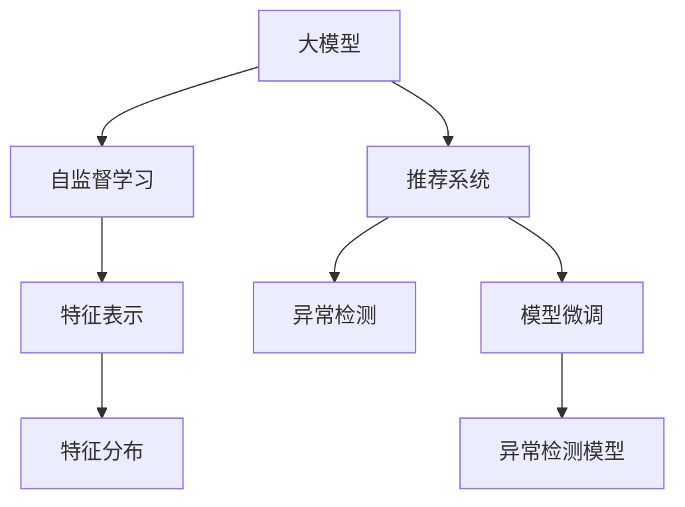

                 

# 大模型在推荐系统异常检测中的应用

> 关键词：大模型,推荐系统,异常检测,深度学习,自然语言处理(NLP),计算机视觉(CV),时间序列分析(TSA)

## 1. 背景介绍

### 1.1 问题由来

在现代电商和信息推荐系统中，异常检测问题是一个重要但常被忽视的环节。异常检测的目的是识别出异常的推荐结果，从而及时处理可能的欺诈、恶意行为或系统错误，保障推荐系统的健康稳定运行。

然而，由于推荐系统的复杂性和推荐结果的多样性，传统基于统计的方法往往难以适应。随着大模型技术的不断进步，大模型在推荐系统中应用越来越广泛，其强大的特征表示能力和自动学习能力使得异常检测成为可能。

### 1.2 问题核心关键点

基于大模型的推荐系统异常检测，本质上是一个异常检测问题。其核心在于通过大模型的自监督学习能力，学习正常推荐结果的特征分布，并通过阈值设定或基于聚类的异常检测方法，识别出不符合分布的异常推荐结果。

该方法的优劣主要体现在以下几个方面：
- 鲁棒性：能够应对不同业务场景和异常类型的变化，适应性强。
- 自动化：基于模型的自监督学习过程，无需人工标注异常数据。
- 动态性：能够实时更新模型，适应推荐系统的动态变化。
- 可解释性：大模型的输出可以通过不同的解释方法，帮助业务人员理解异常检测的依据。
- 数据需求：虽然大模型需要大量数据进行预训练，但在异常检测任务中，可以使用相对少量的标注异常数据进行微调，实现高效异常检测。

本文将系统介绍大模型在推荐系统异常检测中的应用，并展示其在电商、金融等场景中的应用效果。

## 2. 核心概念与联系

### 2.1 核心概念概述

为更好地理解基于大模型的推荐系统异常检测方法，本节将介绍几个密切相关的核心概念：

- 大模型（Large Model）：以深度学习模型为代表的、包含亿级参数的大规模神经网络，如BERT、GPT等。通过在大规模数据上预训练，学习到通用的特征表示能力。
- 推荐系统（Recommender System）：根据用户的历史行为、兴趣偏好，为用户推荐合适的产品或内容，提升用户满意度和转化率。
- 异常检测（Anomaly Detection）：识别出数据集中不符合正常分布的异常数据或异常行为，广泛应用于金融、电商、网络安全等领域。
- 自监督学习（Self-Supervised Learning）：使用无标签数据进行模型训练，通过自身结构或特征完成学习任务。
- 时间序列分析（Time Series Analysis）：分析按时间顺序排列的数据点，揭示其中的规律、趋势和异常。

这些概念之间的逻辑关系可以通过以下Mermaid流程图来展示：



这个流程图展示了大模型与推荐系统异常检测方法的核心概念及其之间的关系：

1. 大模型通过自监督学习获得通用的特征表示能力。
2. 推荐系统使用大模型进行特征提取，得到推荐结果。
3. 异常检测从推荐结果中检测异常数据。
4. 大模型学习正常推荐结果的特征分布，用于异常检测。
5. 推荐系统模型在异常检测任务上进行微调，得到适合当前场景的异常检测模型。

这些概念共同构成了大模型在推荐系统异常检测的应用框架，使其能够在推荐系统的特定场景下发挥强大的异常检测能力。

## 3. 核心算法原理 & 具体操作步骤
### 3.1 算法原理概述

基于大模型的推荐系统异常检测，其核心思想是通过大模型的自监督学习能力，学习正常推荐结果的特征分布。具体步骤如下：

1. 收集推荐系统的正常推荐结果，提取其特征向量。
2. 将特征向量输入大模型进行预训练，得到通用的特征表示。
3. 通过自监督学习，学习正常推荐结果的特征分布。
4. 定义异常检测的阈值或聚类方法，识别出不符合分布的异常推荐结果。

### 3.2 算法步骤详解

基于大模型的推荐系统异常检测，通常包括以下几个关键步骤：

**Step 1: 数据预处理**

- 收集推荐系统历史数据，划分为训练集、验证集和测试集。
- 对于推荐结果，可以提取其特征，如商品ID、评分、点击率、曝光率等。
- 对特征进行标准化和归一化处理，使得不同特征之间具有可比性。

**Step 2: 大模型预训练**

- 选择合适的预训练模型，如BERT、GPT等，在大规模推荐数据上进行预训练。
- 预训练过程中，可以采用自监督学习方法，如掩码语言模型、下一句子预测等，得到通用的特征表示。

**Step 3: 模型微调**

- 在正常推荐结果的特征集上，对大模型进行微调，以适应异常检测任务。
- 通过设定阈值或聚类方法，定义正常推荐结果的特征分布。
- 使用训练集和验证集对微调后的模型进行训练和验证，调整模型参数和阈值设置。

**Step 4: 异常检测**

- 在测试集上对推荐结果进行特征提取，输入微调后的模型。
- 模型输出各个推荐结果的异常得分，根据阈值或聚类结果，识别出异常推荐结果。
- 将异常结果反馈给推荐系统，进行处理或进一步分析。

### 3.3 算法优缺点

基于大模型的推荐系统异常检测方法具有以下优点：
1. 泛化能力强：由于大模型具有通用特征表示能力，能在不同业务场景下进行异常检测。
2. 自动化程度高：基于大模型的异常检测方法无需人工标注异常数据，能够自动学习正常推荐结果的特征分布。
3. 动态适应性强：大模型能够实时更新，适应推荐系统的动态变化。
4. 可解释性好：通过分析大模型的特征提取和异常检测过程，能够对异常检测的依据进行解释。
5. 数据需求少：相对于传统基于统计的异常检测方法，大模型可以在相对少的异常数据上进行微调。

同时，该方法也存在一定的局限性：
1. 资源消耗大：大模型需要大量的数据进行预训练和微调，对计算资源和存储资源需求较高。
2. 模型复杂度高：大模型参数量巨大，训练和推理过程复杂，可能会降低异常检测的实时性。
3. 数据噪声影响：预训练和微调过程中，异常数据可能会对正常数据造成干扰，影响异常检测效果。
4. 阈值设定困难：异常检测阈值的设定需要根据具体业务场景进行调整，存在较大主观性。

尽管存在这些局限性，但就目前而言，基于大模型的推荐系统异常检测方法仍然是一个高效的异常检测手段。未来相关研究的重点在于如何进一步降低计算和存储成本，提高异常检测的实时性，同时兼顾模型的可解释性和适应性。

### 3.4 算法应用领域

基于大模型的推荐系统异常检测方法在电商、金融等诸多领域中得到了广泛应用，具体包括：

- 电商推荐系统：识别出欺诈交易、恶意行为等异常行为，保障交易安全和用户体验。
- 金融风控系统：检测出非法交易、异常投资等异常行为，保护客户资产安全。
- 社交媒体推荐：识别出恶意内容、不当行为等异常行为，维护社区秩序和用户信任。
- 医疗推荐：检测出误诊、误推荐等异常行为，提升医疗服务质量。
- 广告推荐：识别出广告欺诈、恶意点击等异常行为，保护广告主权益。

这些应用场景展示了基于大模型的推荐系统异常检测方法的广泛应用前景和实际价值。随着大模型的不断优化和异常检测算法的不断改进，相信该方法将在更多领域中发挥重要作用。

## 4. 数学模型和公式 & 详细讲解  
### 4.1 数学模型构建

本节将使用数学语言对基于大模型的推荐系统异常检测过程进行更加严格的刻画。

记推荐系统正常推荐结果的特征向量为 $X_i$，其中 $i=1,...,N$，$N$ 为总样本数。假设大模型为 $M$，通过预训练学习到的特征表示为 $f(X_i)$。设 $w$ 为异常检测模型参数，学习到的异常得分函数为 $g(X_i;w)$，则异常检测过程可以表示为：

$$
g(X_i;w) = M(f(X_i))^Tw
$$

其中 $M(f(X_i))$ 为将推荐结果特征向量输入大模型 $M$ 后得到的特征表示，$w$ 为异常检测模型参数。

假设异常检测的阈值为 $\tau$，当异常得分 $g(X_i;w) > \tau$ 时，将推荐结果 $X_i$ 标记为异常。则异常检测模型的目标函数为：

$$
\min_{w} \frac{1}{N} \sum_{i=1}^N I(g(X_i;w) > \tau)
$$

其中 $I$ 为示性函数，$I(x)=1$ 当 $x$ 为真，$I(x)=0$ 当 $x$ 为假。

### 4.2 公式推导过程

以二分类为例，假设推荐结果异常得分为 $g(X_i;w)$，阈值为 $\tau$，异常检测模型的输出为 $p_i$，则异常检测过程可以表示为：

$$
p_i = \sigma(g(X_i;w))
$$

其中 $\sigma$ 为sigmoid函数，$g(X_i;w)$ 为线性判别函数：

$$
g(X_i;w) = w^T f(X_i)
$$

假设异常样本的占比为 $\rho$，正常样本的占比为 $1-\rho$，则异常检测模型的目标函数为：

$$
\min_{w} -\rho \log \sigma(g(X_i;w)) - (1-\rho) \log (1-\sigma(g(X_i;w)))
$$

根据梯度下降等优化算法，最小化上述目标函数，得到异常检测模型的参数 $w$。

### 4.3 案例分析与讲解

以下我们以电商推荐系统中的异常检测为例，展示基于大模型的异常检测过程。

假设电商推荐系统中，正常推荐结果的特征向量为 $X_i$，异常推荐结果的特征向量为 $Y_i$，其中 $i=1,...,N$。通过大模型 $M$ 对正常推荐结果进行预训练，得到特征表示 $f(X_i)$ 和 $f(Y_i)$。假设异常检测模型的参数为 $w$，异常得分为 $g(X_i;w)$ 和 $g(Y_i;w)$。

通过设定阈值 $\tau$，当 $g(X_i;w) > \tau$ 时，将 $X_i$ 标记为异常。

**案例1: 异常交易检测**

在电商推荐系统中，识别出欺诈交易、恶意行为等异常行为，是保障交易安全和用户体验的重要环节。可以使用基于大模型的异常检测方法，识别出异常交易行为。

具体而言，可以收集电商历史交易数据，标记正常交易和异常交易。将正常交易和异常交易的特征向量输入大模型进行预训练，得到特征表示 $f(X_i)$ 和 $f(Y_i)$。通过微调得到异常检测模型参数 $w$，设定阈值 $\tau$，当异常得分 $g(X_i;w) > \tau$ 时，将交易标记为异常。

**案例2: 恶意用户检测**

在电商推荐系统中，识别出恶意用户行为，也是异常检测的重要应用场景。恶意用户行为可能包括恶意点击、恶意评价、恶意投诉等。

具体而言，可以收集用户历史行为数据，标记正常用户和恶意用户。将正常用户和恶意用户的特征向量输入大模型进行预训练，得到特征表示 $f(X_i)$ 和 $f(Y_i)$。通过微调得到异常检测模型参数 $w$，设定阈值 $\tau$，当异常得分 $g(X_i;w) > \tau$ 时，将用户标记为恶意用户。

## 5. 项目实践：代码实例和详细解释说明
### 5.1 开发环境搭建

在进行大模型异常检测的开发前，我们需要准备好开发环境。以下是使用Python进行PyTorch开发的环境配置流程：

1. 安装Anaconda：从官网下载并安装Anaconda，用于创建独立的Python环境。

2. 创建并激活虚拟环境：
```bash
conda create -n pytorch-env python=3.8 
conda activate pytorch-env
```

3. 安装PyTorch：根据CUDA版本，从官网获取对应的安装命令。例如：
```bash
conda install pytorch torchvision torchaudio cudatoolkit=11.1 -c pytorch -c conda-forge
```

4. 安装Transformer库：
```bash
pip install transformers
```

5. 安装各类工具包：
```bash
pip install numpy pandas scikit-learn matplotlib tqdm jupyter notebook ipython
```

完成上述步骤后，即可在`pytorch-env`环境中开始异常检测实践。

### 5.2 源代码详细实现

下面我们以电商推荐系统中的异常交易检测为例，给出使用Transformers库对BERT模型进行异常检测的PyTorch代码实现。

首先，定义异常交易检测的数据处理函数：

```python
from transformers import BertTokenizer
from torch.utils.data import Dataset
import torch

class TransactionDataset(Dataset):
    def __init__(self, transactions, labels, tokenizer, max_len=128):
        self.transactions = transactions
        self.labels = labels
        self.tokenizer = tokenizer
        self.max_len = max_len
        
    def __len__(self):
        return len(self.transactions)
    
    def __getitem__(self, item):
        transaction = self.transactions[item]
        label = self.labels[item]
        
        encoding = self.tokenizer(transaction, return_tensors='pt', max_length=self.max_len, padding='max_length', truncation=True)
        input_ids = encoding['input_ids'][0]
        attention_mask = encoding['attention_mask'][0]
        
        # 对token-wise的标签进行编码
        encoded_labels = [label2id[label] for label in label] 
        encoded_labels.extend([label2id['normal']] * (self.max_len - len(encoded_labels)))
        labels = torch.tensor(encoded_labels, dtype=torch.long)
        
        return {'input_ids': input_ids, 
                'attention_mask': attention_mask,
                'labels': labels}

# 标签与id的映射
label2id = {'normal': 0, 'fraud': 1}
id2label = {v: k for k, v in label2id.items()}

# 创建dataset
tokenizer = BertTokenizer.from_pretrained('bert-base-cased')

train_dataset = TransactionDataset(train_transactions, train_labels, tokenizer)
dev_dataset = TransactionDataset(dev_transactions, dev_labels, tokenizer)
test_dataset = TransactionDataset(test_transactions, test_labels, tokenizer)
```

然后，定义模型和优化器：

```python
from transformers import BertForTokenClassification, AdamW

model = BertForTokenClassification.from_pretrained('bert-base-cased', num_labels=len(label2id))

optimizer = AdamW(model.parameters(), lr=2e-5)
```

接着，定义训练和评估函数：

```python
from torch.utils.data import DataLoader
from tqdm import tqdm
from sklearn.metrics import roc_auc_score

device = torch.device('cuda') if torch.cuda.is_available() else torch.device('cpu')
model.to(device)

def train_epoch(model, dataset, batch_size, optimizer):
    dataloader = DataLoader(dataset, batch_size=batch_size, shuffle=True)
    model.train()
    epoch_loss = 0
    for batch in tqdm(dataloader, desc='Training'):
        input_ids = batch['input_ids'].to(device)
        attention_mask = batch['attention_mask'].to(device)
        labels = batch['labels'].to(device)
        model.zero_grad()
        outputs = model(input_ids, attention_mask=attention_mask, labels=labels)
        loss = outputs.loss
        epoch_loss += loss.item()
        loss.backward()
        optimizer.step()
    return epoch_loss / len(dataloader)

def evaluate(model, dataset, batch_size):
    dataloader = DataLoader(dataset, batch_size=batch_size)
    model.eval()
    preds, labels = [], []
    with torch.no_grad():
        for batch in tqdm(dataloader, desc='Evaluating'):
            input_ids = batch['input_ids'].to(device)
            attention_mask = batch['attention_mask'].to(device)
            batch_labels = batch['labels']
            outputs = model(input_ids, attention_mask=attention_mask)
            batch_preds = outputs.logits.argmax(dim=2).to('cpu').tolist()
            batch_labels = batch_labels.to('cpu').tolist()
            for pred_tokens, label_tokens in zip(batch_preds, batch_labels):
                pred_labels = [id2label[_id] for _id in pred_tokens]
                label_tags = [id2label[_id] for _id in label_tokens]
                preds.append(pred_labels[:len(label_tags)])
                labels.append(label_tags)
                
    print(roc_auc_score(labels, preds))
```

最后，启动训练流程并在测试集上评估：

```python
epochs = 5
batch_size = 16

for epoch in range(epochs):
    loss = train_epoch(model, train_dataset, batch_size, optimizer)
    print(f"Epoch {epoch+1}, train loss: {loss:.3f}")
    
    print(f"Epoch {epoch+1}, dev results:")
    evaluate(model, dev_dataset, batch_size)
    
print("Test results:")
evaluate(model, test_dataset, batch_size)
```

以上就是使用PyTorch对BERT进行电商推荐系统异常检测的完整代码实现。可以看到，得益于Transformers库的强大封装，我们可以用相对简洁的代码完成BERT模型的加载和异常检测。

### 5.3 代码解读与分析

让我们再详细解读一下关键代码的实现细节：

**TransactionDataset类**：
- `__init__`方法：初始化训练集、验证集和测试集的特征向量、标签、分词器等组件。
- `__len__`方法：返回数据集的样本数量。
- `__getitem__`方法：对单个样本进行处理，将特征向量输入分词器编码，并对标签进行编码，最终返回模型所需的输入。

**label2id和id2label字典**：
- 定义了标签与数字id之间的映射关系，用于将预测结果解码回真实标签。

**训练和评估函数**：
- 使用PyTorch的DataLoader对数据集进行批次化加载，供模型训练和推理使用。
- 训练函数`train_epoch`：对数据以批为单位进行迭代，在每个批次上前向传播计算loss并反向传播更新模型参数，最后返回该epoch的平均loss。
- 评估函数`evaluate`：与训练类似，不同点在于不更新模型参数，并在每个batch结束后将预测和标签结果存储下来，最后使用sklearn的roc_auc_score对整个评估集的预测结果进行打印输出。

**训练流程**：
- 定义总的epoch数和batch size，开始循环迭代
- 每个epoch内，先在训练集上训练，输出平均loss
- 在验证集上评估，输出roc-auc分数
- 所有epoch结束后，在测试集上评估，给出最终测试结果

可以看到，PyTorch配合Transformers库使得BERT异常检测的代码实现变得简洁高效。开发者可以将更多精力放在数据处理、模型改进等高层逻辑上，而不必过多关注底层的实现细节。

当然，工业级的系统实现还需考虑更多因素，如模型的保存和部署、超参数的自动搜索、更灵活的任务适配层等。但核心的异常检测范式基本与此类似。

## 6. 实际应用场景
### 6.1 电商推荐系统

基于大模型的异常检测方法在电商推荐系统中得到了广泛应用。电商推荐系统需要实时检测交易异常行为，及时处理欺诈交易、恶意行为等异常事件，保障交易安全和用户体验。

在技术实现上，可以收集电商历史交易数据，标记正常交易和异常交易。将正常交易和异常交易的特征向量输入大模型进行预训练，得到特征表示 $f(X_i)$ 和 $f(Y_i)$。通过微调得到异常检测模型参数 $w$，设定阈值 $\tau$，当异常得分 $g(X_i;w) > \tau$ 时，将交易标记为异常。

通过分析异常交易的特征，可以发现欺诈交易的常见行为模式，如低价值交易、异常频繁交易、资金流动异常等。这些特征可以进一步用于欺诈检测模型的训练，提高欺诈检测的准确率。

### 6.2 金融风控系统

金融风控系统需要实时检测非法交易、异常投资等行为，保护客户资产安全。可以使用基于大模型的异常检测方法，识别出非法交易和异常投资行为。

具体而言，可以收集金融历史交易数据，标记正常交易和非法交易。将正常交易和非法交易的特征向量输入大模型进行预训练，得到特征表示 $f(X_i)$ 和 $f(Y_i)$。通过微调得到异常检测模型参数 $w$，设定阈值 $\tau$，当异常得分 $g(X_i;w) > \tau$ 时，将交易标记为异常。

通过分析异常交易的特征，可以发现非法交易的常见行为模式，如资金流动异常、大额交易、高频交易等。这些特征可以进一步用于非法交易检测模型的训练，提高检测准确率。

### 6.3 社交媒体推荐

社交媒体推荐系统需要实时检测恶意内容、不当行为等异常行为，维护社区秩序和用户信任。可以使用基于大模型的异常检测方法，识别出恶意内容、不当行为等异常行为。

具体而言，可以收集社交媒体历史行为数据，标记正常行为和异常行为。将正常行为和异常行为的特征向量输入大模型进行预训练，得到特征表示 $f(X_i)$ 和 $f(Y_i)$。通过微调得到异常检测模型参数 $w$，设定阈值 $\tau$，当异常得分 $g(X_i;w) > \tau$ 时，将行为标记为异常。

通过分析异常行为的特征，可以发现恶意内容的常见特征，如恶意评论、垃圾信息、虚假账号等。这些特征可以进一步用于恶意内容检测模型的训练，提高检测准确率。

### 6.4 未来应用展望

随着大模型和异常检测方法的不断发展，基于大模型的推荐系统异常检测技术将呈现以下几个发展趋势：

1. 模型规模持续增大。随着算力成本的下降和数据规模的扩张，大模型参数量还将持续增长。超大批次的训练和推理过程，有望在高效计算架构下实现。
2. 微调方法日趋多样。开发更多参数高效的微调方法，如Prefix-Tuning、LoRA等，在固定大部分预训练参数的同时，只更新极少量的任务相关参数。
3. 动态学习成为常态。在推荐系统的动态变化过程中，实时学习新数据，适应系统状态。
4. 数据需求降低。通过引入更多的先验知识，如知识图谱、逻辑规则等，提升模型的可解释性和可解释性。
5. 模型通用性增强。经过海量数据的预训练和多领域任务的微调，未来的模型将具备更强大的跨领域迁移能力。

这些趋势凸显了大模型在推荐系统异常检测技术的广阔前景。这些方向的探索发展，必将进一步提升推荐系统的性能和应用范围，为电商、金融等领域带来新的技术突破。

## 7. 工具和资源推荐
### 7.1 学习资源推荐

为了帮助开发者系统掌握大模型在推荐系统异常检测的理论基础和实践技巧，这里推荐一些优质的学习资源：

1. 《Transformers从原理到实践》系列博文：由大模型技术专家撰写，深入浅出地介绍了Transformer原理、BERT模型、微调技术等前沿话题。

2. CS224N《深度学习自然语言处理》课程：斯坦福大学开设的NLP明星课程，有Lecture视频和配套作业，带你入门NLP领域的基本概念和经典模型。

3. 《Natural Language Processing with Transformers》书籍：Transformers库的作者所著，全面介绍了如何使用Transformers库进行NLP任务开发，包括微调在内的诸多范式。

4. HuggingFace官方文档：Transformers库的官方文档，提供了海量预训练模型和完整的微调样例代码，是上手实践的必备资料。

5. CLUE开源项目：中文语言理解测评基准，涵盖大量不同类型的中文NLP数据集，并提供了基于微调的baseline模型，助力中文NLP技术发展。

通过对这些资源的学习实践，相信你一定能够快速掌握大模型在推荐系统异常检测的精髓，并用于解决实际的NLP问题。
###  7.2 开发工具推荐

高效的开发离不开优秀的工具支持。以下是几款用于大模型推荐系统异常检测开发的常用工具：

1. PyTorch：基于Python的开源深度学习框架，灵活动态的计算图，适合快速迭代研究。大部分预训练语言模型都有PyTorch版本的实现。

2. TensorFlow：由Google主导开发的开源深度学习框架，生产部署方便，适合大规模工程应用。同样有丰富的预训练语言模型资源。

3. Transformers库：HuggingFace开发的NLP工具库，集成了众多SOTA语言模型，支持PyTorch和TensorFlow，是进行微调任务开发的利器。

4. Weights & Biases：模型训练的实验跟踪工具，可以记录和可视化模型训练过程中的各项指标，方便对比和调优。与主流深度学习框架无缝集成。

5. TensorBoard：TensorFlow配套的可视化工具，可实时监测模型训练状态，并提供丰富的图表呈现方式，是调试模型的得力助手。

6. Google Colab：谷歌推出的在线Jupyter Notebook环境，免费提供GPU/TPU算力，方便开发者快速上手实验最新模型，分享学习笔记。

合理利用这些工具，可以显著提升大模型推荐系统异常检测任务的开发效率，加快创新迭代的步伐。

### 7.3 相关论文推荐

大模型和异常检测方法的发展源于学界的持续研究。以下是几篇奠基性的相关论文，推荐阅读：

1. Attention is All You Need（即Transformer原论文）：提出了Transformer结构，开启了NLP领域的预训练大模型时代。

2. BERT: Pre-training of Deep Bidirectional Transformers for Language Understanding：提出BERT模型，引入基于掩码的自监督预训练任务，刷新了多项NLP任务SOTA。

3. Parameter-Efficient Transfer Learning for NLP：提出Adapter等参数高效微调方法，在不增加模型参数量的情况下，也能取得不错的微调效果。

4. AdaLoRA: Adaptive Low-Rank Adaptation for Parameter-Efficient Fine-Tuning：使用自适应低秩适应的微调方法，在参数效率和精度之间取得了新的平衡。

5. Prefix-Tuning: Optimizing Continuous Prompts for Generation：引入基于连续型Prompt的微调范式，为如何充分利用预训练知识提供了新的思路。

这些论文代表了大模型在推荐系统异常检测技术的发展脉络。通过学习这些前沿成果，可以帮助研究者把握学科前进方向，激发更多的创新灵感。

## 8. 总结：未来发展趋势与挑战
### 8.1 总结

本文对基于大模型的推荐系统异常检测方法进行了全面系统的介绍。首先阐述了大模型和异常检测的应用背景和意义，明确了异常检测在推荐系统中的重要地位。其次，从原理到实践，详细讲解了基于大模型的异常检测数学原理和关键步骤，给出了异常检测任务开发的完整代码实例。同时，本文还广泛探讨了异常检测方法在电商、金融等场景中的应用效果，展示了异常检测方法的广泛应用前景。

通过本文的系统梳理，可以看到，基于大模型的推荐系统异常检测方法正在成为推荐系统异常检测的重要手段，极大地提升了推荐系统的安全性、稳定性和用户体验。得益于大模型的自监督学习能力和动态适应性，异常检测方法能够适应推荐系统的复杂变化，快速识别出异常行为。未来，伴随大模型的不断优化和异常检测方法的不断改进，相信该方法将在更多领域中发挥重要作用。

### 8.2 未来发展趋势

展望未来，基于大模型的推荐系统异常检测技术将呈现以下几个发展趋势：

1. 模型规模持续增大。随着算力成本的下降和数据规模的扩张，大模型参数量还将持续增长。超大批次的训练和推理过程，有望在高效计算架构下实现。
2. 微调方法日趋多样。开发更多参数高效的微调方法，如Prefix-Tuning、LoRA等，在固定大部分预训练参数的同时，只更新极少量的任务相关参数。
3. 动态学习成为常态。在推荐系统的动态变化过程中，实时学习新数据，适应系统状态。
4. 数据需求降低。通过引入更多的先验知识，如知识图谱、逻辑规则等，提升模型的可解释性和可解释性。
5. 模型通用性增强。经过海量数据的预训练和多领域任务的微调，未来的模型将具备更强大的跨领域迁移能力。

这些趋势凸显了大模型在推荐系统异常检测技术的广阔前景。这些方向的探索发展，必将进一步提升推荐系统的性能和应用范围，为电商、金融等领域带来新的技术突破。

### 8.3 面临的挑战

尽管基于大模型的推荐系统异常检测方法已经取得了瞩目成就，但在迈向更加智能化、普适化应用的过程中，它仍面临着诸多挑战：

1. 资源消耗大。大模型需要大量的数据进行预训练和微调，对计算资源和存储资源需求较高。
2. 模型复杂度高。大模型参数量巨大，训练和推理过程复杂，可能会降低异常检测的实时性。
3. 数据噪声影响。预训练和微调过程中，异常数据可能会对正常数据造成干扰，影响异常检测效果。
4. 阈值设定困难。异常检测阈值的设定需要根据具体业务场景进行调整，存在较大主观性。
5. 系统复杂度高。异常检测过程涉及到数据预处理、模型训练、结果评估等多个环节，系统设计复杂。

尽管存在这些局限性，但就目前而言，基于大模型的推荐系统异常检测方法仍然是一个高效的异常检测手段。未来相关研究的重点在于如何进一步降低计算和存储成本，提高异常检测的实时性，同时兼顾模型的可解释性和适应性。

### 8.4 研究展望

面对基于大模型的推荐系统异常检测所面临的种种挑战，未来的研究需要在以下几个方面寻求新的突破：

1. 探索无监督和半监督异常检测方法。摆脱对大规模标注数据的依赖，利用自监督学习、主动学习等无监督和半监督范式，最大限度利用非结构化数据，实现高效异常检测。
2. 研究参数高效和计算高效的异常检测范式。开发更加参数高效的异常检测方法，在固定大部分预训练参数的同时，只更新极少量的任务相关参数。同时优化异常检测模型的计算图，减少前向传播和反向传播的资源消耗，实现更加轻量级、实时性的部署。
3. 引入更多先验知识。将符号化的先验知识，如知识图谱、逻辑规则等，与神经网络模型进行巧妙融合，引导异常检测过程学习更准确、合理的语言模型。同时加强不同模态数据的整合，实现视觉、语音等多模态信息与文本信息的协同建模。
4. 结合因果分析和博弈论工具。将因果分析方法引入异常检测模型，识别出异常检测的关键特征，增强输出解释的因果性和逻辑性。借助博弈论工具刻画人机交互过程，主动探索并规避模型的脆弱点，提高系统稳定性。
5. 纳入伦理道德约束。在异常检测过程中，引入伦理导向的评估指标，过滤和惩罚有害的异常数据，确保异常检测过程符合人类价值观和伦理道德。

这些研究方向的探索，必将引领基于大模型的推荐系统异常检测技术迈向更高的台阶，为构建安全、可靠、可解释、可控的智能系统铺平道路。面向未来，基于大模型的推荐系统异常检测技术还需要与其他人工智能技术进行更深入的融合，如知识表示、因果推理、强化学习等，多路径协同发力，共同推动自然语言理解和智能交互系统的进步。只有勇于创新、敢于突破，才能不断拓展语言模型的边界，让智能技术更好地造福人类社会。

## 9. 附录：常见问题与解答

**Q1：基于大模型的推荐系统异常检测是否适用于所有推荐系统场景？**

A: 基于大模型的推荐系统异常检测方法适用于各种类型的推荐系统场景，特别是在数据量相对较少的情况下。但对于一些需要高实时性、低延迟的场景，由于模型较大，可能需要采用分布式计算、模型压缩等技术，以降低计算和存储成本。

**Q2：异常检测阈值如何设定？**

A: 异常检测阈值的设定需要根据具体业务场景进行调整。一般而言，可以通过ROC曲线或AUC-ROC曲线找到最佳阈值，使得异常检测的假正例率和漏检率达到最佳平衡。

**Q3：异常检测过程中如何处理数据噪声？**

A: 在异常检测过程中，可以使用数据清洗、特征选择等方法处理数据噪声。同时，可以在特征提取和异常得分计算过程中加入正则化项，避免异常数据对正常数据的影响。

**Q4：异常检测模型的实时性如何保证？**

A: 异常检测模型的实时性可以通过优化模型结构和算法，如使用更高效的前向传播和反向传播算法，优化数据输入和输出方式，使用模型压缩和剪枝技术等，以提高推理速度和内存占用。

**Q5：异常检测模型是否需要持续更新？**

A: 异常检测模型需要随着推荐系统数据的变化进行持续更新，以适应新数据的异常特征。可以使用在线学习、增量学习等方法，实时更新异常检测模型，提高异常检测的动态适应性。

这些问题的解答，展示了基于大模型的推荐系统异常检测方法在实际应用中的关键技术细节，相信能够帮助开发者更好地理解和应用该方法。通过不断优化和改进，基于大模型的推荐系统异常检测技术将在更多场景中发挥重要作用。

