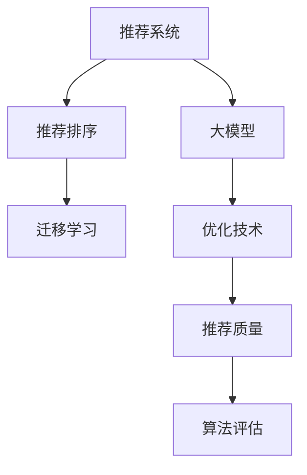

                 

# 大模型在推荐系统排序算法中的应用

> 关键词：推荐系统,排序算法,深度学习,大模型,迁移学习,优化技术,推荐质量,算法评估

## 1. 背景介绍

### 1.1 问题由来
推荐系统（Recommender System）是互联网时代广泛应用的重要技术之一，其核心目标是利用用户历史行为数据和物品特征，为用户推荐感兴趣的物品。推荐系统的应用场景遍及电商、社交、娱乐等多个领域，极大地提升了用户的使用体验和满意度。

传统推荐系统主要基于协同过滤、矩阵分解等方法，依赖于用户行为数据和物品特征的建模。然而，随着数据规模的爆炸式增长和推荐需求的多样化，传统推荐系统面临数据稀疏性、维度灾难等挑战。近年来，大模型技术在推荐系统中的应用，为推荐算法带来了新的突破，逐步成为推荐系统领域的研究热点。

### 1.2 问题核心关键点
大模型在推荐系统中的应用，主要体现在以下几个方面：

- 用户与物品的表示学习。利用大模型学习用户和物品的低维表示，可以捕捉到更加复杂的特征关系，提升推荐的准确性和多样性。
- 推荐排序模型的构建。基于大模型构建的排序模型可以学习更复杂的排序规则，直接将用户和物品的表示映射到排序结果，实现更精细的推荐排序。
- 迁移学习与优化技术。通过迁移学习，利用大模型的预训练知识，进行推荐系统任务的微调，可以显著提升推荐效果和模型泛化能力。同时，针对推荐系统的特殊需求，引入优化技术如梯度累积、自适应学习率等，进一步提升模型性能。

### 1.3 问题研究意义
大模型在推荐系统中的应用，具有以下重要意义：

1. **提升推荐质量**：利用大模型的强大表征能力，可以学习到用户和物品更加丰富的特征，从而提升推荐的精度和多样性。
2. **应对数据挑战**：大模型可以处理大规模、高维度的数据，缓解了推荐系统中数据稀疏性和维度灾难的问题。
3. **加速模型训练**：大模型可以大幅降低推荐模型的训练复杂度，快速迭代优化，加速推荐模型的落地部署。
4. **增强模型泛化能力**：通过迁移学习，大模型能够更好地适应不同领域的推荐需求，提升模型的泛化能力。
5. **促进推荐算法创新**：大模型的应用为推荐算法带来了新的思路和方法，如零样本推荐、少样本推荐等，推动推荐系统技术的创新发展。

## 2. 核心概念与联系

### 2.1 核心概念概述

为更好地理解大模型在推荐系统中的应用，本节将介绍几个关键概念：

- 推荐系统（Recommender System）：利用用户历史行为数据和物品特征，为用户推荐感兴趣物品的系统。
- 推荐排序（Recommendation Ranking）：根据用户对物品的评分或兴趣程度，将物品排序推荐的算法。
- 大模型（Large Model）：基于深度学习的大规模神经网络模型，通常具有亿级的参数规模，具有强大的表示能力和泛化能力。
- 迁移学习（Transfer Learning）：通过在大模型预训练知识的基础上，进行下游任务的微调，提升模型性能的方法。
- 优化技术（Optimization Techniques）：如梯度累积、自适应学习率等，用于提升大模型训练效率和效果的技术。
- 推荐质量（Recommendation Quality）：推荐系统推荐的准确性和用户满意度，是评估推荐系统的重要指标。
- 算法评估（Algorithm Evaluation）：通过量化指标（如NDCG、HR等），评估推荐系统性能的科学方法。

这些核心概念之间的逻辑关系可以通过以下Mermaid流程图来展示：



这个流程图展示了大模型在推荐系统中的应用框架：

1. 推荐系统利用用户和物品的历史数据和特征，为用户推荐物品。
2. 推荐排序算法将物品按照用户评分或兴趣程度进行排序。
3. 大模型作为推荐排序算法的核心组件，学习用户和物品的表示。
4. 迁移学习利用大模型的预训练知识，微调推荐模型，提升推荐效果。
5. 优化技术进一步提升大模型的训练效率和性能。
6. 推荐质量通过算法评估指标量化，用于评估和优化推荐系统。

这些概念共同构成了推荐系统中大模型的应用框架，使得大模型能够充分利用其强大的表示能力和泛化能力，提升推荐系统的性能。

## 3. 核心算法原理 & 具体操作步骤
### 3.1 算法原理概述

大模型在推荐系统中的应用，主要通过以下步骤实现：

1. **用户与物品的表示学习**：将用户和物品输入到大模型中，学习其低维表示。
2. **推荐排序模型的构建**：基于用户和物品的表示，构建推荐排序模型。
3. **迁移学习与微调**：利用大模型的预训练知识，对推荐模型进行微调。
4. **优化技术的应用**：引入优化技术提升模型训练效率和效果。
5. **推荐质量评估**：通过量化指标评估推荐模型性能，进行优化迭代。

形式化地，假设推荐系统包含 $N$ 个用户和 $M$ 个物品，用户对物品的评分矩阵为 $R$。用户和物品的表示分别由 $E_u$ 和 $E_i$ 表示。推荐排序模型的目标是最大化用户对物品的评分 $R_{ui}$，构建的排序模型为 $F(u,i)$。推荐排序过程为：

$$
\hat{R}_{ui} = F(u,i)
$$

其中，$F(u,i)$ 可以通过大模型进行学习和优化。

### 3.2 算法步骤详解

以下详细介绍推荐系统排序模型的构建、微调和评估的具体步骤：

**Step 1: 用户与物品表示学习**

用户和物品的表示学习可以通过大模型进行。常见的用户和物品表示学习方法包括：

- 用户嵌入：将用户的历史行为数据输入到大模型中，学习用户低维嵌入向量 $E_u$。
- 物品嵌入：将物品的特征数据输入到大模型中，学习物品低维嵌入向量 $E_i$。

用户和物品的表示向量通常通过拼接或线性映射的方式生成，即：

$$
E_u = M_{u}(u), \quad E_i = M_{i}(i)
$$

其中，$M_u$ 和 $M_i$ 分别表示用户和物品表示学习的大模型。

**Step 2: 推荐排序模型构建**

推荐排序模型可以将用户和物品的表示向量映射到排序结果。常见的推荐排序模型包括：

- 用户物品交互模型：如矩阵分解、协同过滤等，直接学习用户对物品的评分。
- 用户物品交互模型：如深度神经网络、注意力机制等，学习用户对物品的评分和兴趣。

推荐排序模型的构建过程如下：

1. 将用户和物品的表示向量拼接或线性映射，得到输入特征向量 $F_{ui}$。
2. 输入特征向量通过推荐排序模型 $F(u,i)$ 映射到排序结果 $\hat{R}_{ui}$。

**Step 3: 迁移学习与微调**

迁移学习利用大模型的预训练知识，进行推荐系统的微调。常见的微调方法包括：

- 全参数微调：将预训练的大模型作为初始化参数，对推荐排序模型的所有参数进行微调。
- 参数高效微调：只微调推荐排序模型中的部分参数，保留大部分预训练权重不变。

微调过程通常包括：

1. 选择合适的优化算法及其参数，如 AdamW、SGD 等，设置学习率、批大小、迭代轮数等。
2. 设置正则化技术及强度，包括权重衰减、Dropout、Early Stopping 等。
3. 确定冻结预训练参数的策略，如仅微调推荐排序模型顶层，或全部参数都参与微调。

**Step 4: 优化技术应用**

优化技术可以提升推荐模型的训练效率和性能。常见的优化技术包括：

- 梯度累积：通过累积多个小批量梯度，减少计算开销，加速模型训练。
- 自适应学习率：如 Adaptive Moment Estimation (Adam)、Adafactor 等，根据梯度变化自动调整学习率。

**Step 5: 推荐质量评估**

推荐系统的推荐质量可以通过量化指标进行评估，常见的评估指标包括：

- 平均绝对误差（MAE）：衡量预测值和真实值之间的平均差异。
- 均方误差（MSE）：衡量预测值和真实值之间的平方平均差异。
- 准确率（Accuracy）：衡量推荐系统推荐的准确性。
- 召回率（Recall）：衡量推荐系统推荐的相关性。
- 点击率（Click-Through Rate, CTR）：衡量推荐系统推荐的点击效果。

### 3.3 算法优缺点

大模型在推荐系统中的应用具有以下优点：

1. **强大的表示能力**：大模型能够学习到用户和物品的复杂特征关系，提升推荐精度和多样性。
2. **泛化能力强**：大模型的预训练知识可以迁移应用于不同的推荐任务，提升模型的泛化能力。
3. **高效微调**：大模型的微调过程可以采用参数高效方法，如 Adapter、Prefix Tuning 等，减少微调参数量。
4. **优化技术丰富**：可以利用各种优化技术，提升模型的训练效率和性能。
5. **适应性强**：大模型可以适应不同领域的推荐需求，如电商、社交、娱乐等。

同时，大模型在推荐系统中的应用也存在以下缺点：

1. **数据需求大**：大模型的训练和微调需要大量高质量数据，对于小规模数据集可能效果有限。
2. **计算成本高**：大模型的训练和推理需要高性能计算资源，成本较高。
3. **模型复杂度高**：大模型通常具有亿级参数，模型的复杂度较高，需要合理的结构优化和压缩。
4. **可解释性不足**：大模型的内部机制难以解释，难以进行调试和优化。

尽管存在这些局限性，但大模型在推荐系统中的应用已经展现出了巨大的潜力和优势，值得进一步研究和探索。

### 3.4 算法应用领域

大模型在推荐系统中的应用已经覆盖了多个领域，具体包括：

- 电商推荐：基于用户的购买历史、浏览行为等数据，推荐商品。
- 社交推荐：基于用户的行为数据和兴趣标签，推荐好友、内容。
- 娱乐推荐：基于用户的观看历史和评分数据，推荐影视、音乐等。
- 新闻推荐：基于用户的阅读历史和兴趣，推荐相关新闻文章。
- 视频推荐：基于用户的观看历史和评分，推荐视频内容。

此外，大模型在推荐系统中的应用还在不断扩展，如跨平台推荐、混合推荐、实时推荐等，推动了推荐系统的创新发展。

## 4. 数学模型和公式 & 详细讲解  
### 4.1 数学模型构建

推荐系统的数学模型通常包括以下几个组成部分：

- **用户嵌入**：$E_u = M_u(u)$，其中 $M_u$ 为用户的表示学习模型。
- **物品嵌入**：$E_i = M_i(i)$，其中 $M_i$ 为物品的表示学习模型。
- **推荐排序模型**：$F(u,i)$，将用户和物品的表示向量映射到排序结果。
- **损失函数**：$\mathcal{L}$，用于衡量模型预测结果与真实评分之间的差异。

推荐排序模型可以采用不同的形式，常见的模型包括：

- **矩阵分解模型**：$F(u,i) = \sum_{k=1}^K (u_k \cdot i_k)$，其中 $u_k$ 和 $i_k$ 为用户的第 $k$ 个隐向量元素和物品的第 $k$ 个隐向量元素。
- **深度神经网络模型**：$F(u,i) = \sum_{k=1}^K \mathbf{W}_k \cdot \sigma(\mathbf{A}_k \cdot [E_u; E_i])$，其中 $\mathbf{W}_k$ 和 $\mathbf{A}_k$ 为模型的权重矩阵和激活函数。
- **注意力机制模型**：$F(u,i) = \sum_{k=1}^K \alpha_{ki} \cdot \mathbf{W}_k \cdot \sigma(\mathbf{A}_k \cdot [E_u; E_i])$，其中 $\alpha_{ki}$ 为注意力权重。

**公式推导过程**

以深度神经网络模型为例，假设用户和物品的表示向量分别为 $E_u$ 和 $E_i$，推荐排序模型的输出为 $\hat{R}_{ui}$，则推荐排序模型的构建过程可以表示为：

$$
\hat{R}_{ui} = \sum_{k=1}^K \mathbf{W}_k \cdot \sigma(\mathbf{A}_k \cdot [E_u; E_i])
$$

其中 $\mathbf{W}_k$ 和 $\mathbf{A}_k$ 为模型的权重矩阵和激活函数。损失函数 $\mathcal{L}$ 可以采用均方误差（MSE）或交叉熵损失（Cross-Entropy Loss）：

$$
\mathcal{L} = \frac{1}{N} \sum_{i=1}^N \sum_{j=1}^M (R_{ij} - \hat{R}_{ij})^2
$$

或者：

$$
\mathcal{L} = -\frac{1}{N} \sum_{i=1}^N \sum_{j=1}^M R_{ij} \log \hat{R}_{ij}
$$

**案例分析与讲解**

假设有一个电商推荐系统，包含用户 $u_1, u_2, \ldots, u_N$ 和商品 $i_1, i_2, \ldots, i_M$。用户对商品的评分矩阵为 $R_{ij}$。为了构建推荐排序模型，可以采用以下步骤：

1. 将用户和物品的评分数据输入到大模型中，学习用户和物品的表示向量 $E_u$ 和 $E_i$。
2. 将用户和物品的表示向量拼接，输入到深度神经网络中，得到推荐排序结果 $\hat{R}_{ui}$。
3. 采用均方误差损失函数 $\mathcal{L}$，对推荐排序模型进行微调，最小化预测结果与真实评分的差异。

通过上述步骤，可以构建出一个高效的电商推荐系统，提升推荐质量和用户体验。

## 5. 项目实践：代码实例和详细解释说明
### 5.1 开发环境搭建

在进行推荐系统排序模型的开发前，需要准备好开发环境。以下是使用Python进行PyTorch开发的环境配置流程：

1. 安装Anaconda：从官网下载并安装Anaconda，用于创建独立的Python环境。

2. 创建并激活虚拟环境：
```bash
conda create -n pytorch-env python=3.8 
conda activate pytorch-env
```

3. 安装PyTorch：根据CUDA版本，从官网获取对应的安装命令。例如：
```bash
conda install pytorch torchvision torchaudio cudatoolkit=11.1 -c pytorch -c conda-forge
```

4. 安装Transformers库：
```bash
pip install transformers
```

5. 安装各类工具包：
```bash
pip install numpy pandas scikit-learn matplotlib tqdm jupyter notebook ipython
```

完成上述步骤后，即可在`pytorch-env`环境中开始推荐系统排序模型的开发。

### 5.2 源代码详细实现

以下是基于深度神经网络模型的推荐系统排序模型的PyTorch代码实现：

```python
import torch
from torch import nn
from torch.utils.data import DataLoader
from transformers import BertTokenizer, BertForSequenceClassification
from sklearn.metrics import mean_squared_error

# 定义深度神经网络模型
class RecommenderNet(nn.Module):
    def __init__(self, embedding_dim, num_hidden, num_classes):
        super(RecommenderNet, self).__init__()
        self.embedding_dim = embedding_dim
        self.num_hidden = num_hidden
        self.num_classes = num_classes
        self.fc1 = nn.Linear(embedding_dim*2, num_hidden)
        self.fc2 = nn.Linear(num_hidden, num_hidden)
        self.fc3 = nn.Linear(num_hidden, num_classes)
        self.relu = nn.ReLU()
        self.softmax = nn.Softmax(dim=1)
    
    def forward(self, user_vec, item_vec):
        cat = torch.cat((user_vec, item_vec), dim=1)
        x = self.fc1(cat)
        x = self.relu(x)
        x = self.fc2(x)
        x = self.relu(x)
        x = self.fc3(x)
        return self.softmax(x)

# 定义模型训练函数
def train_model(model, train_loader, val_loader, optimizer, num_epochs):
    for epoch in range(num_epochs):
        model.train()
        train_loss = 0
        for batch in train_loader:
            user_vec, item_vec, labels = batch
            optimizer.zero_grad()
            outputs = model(user_vec, item_vec)
            loss = nn.CrossEntropyLoss()(outputs, labels)
            loss.backward()
            optimizer.step()
            train_loss += loss.item()
        train_loss /= len(train_loader)
        
        model.eval()
        val_loss = 0
        for batch in val_loader:
            user_vec, item_vec, labels = batch
            outputs = model(user_vec, item_vec)
            loss = nn.CrossEntropyLoss()(outputs, labels)
            val_loss += loss.item()
        val_loss /= len(val_loader)
        
        print(f"Epoch {epoch+1}, train loss: {train_loss:.4f}, val loss: {val_loss:.4f}")

# 定义数据加载函数
def load_data(data_path, tokenizer, max_len=128):
    with open(data_path, 'r') as f:
        lines = f.readlines()
    tokenizer = BertTokenizer.from_pretrained('bert-base-uncased')
    inputs = tokenizer(lines, max_length=max_len, padding='max_length', truncation=True)
    labels = [int(line.split('\t')[1]) for line in lines]
    train_dataset = Dataset(inputs, labels)
    train_loader = DataLoader(train_dataset, batch_size=32, shuffle=True)
    return train_loader

# 定义模型评估函数
def evaluate_model(model, test_loader):
    model.eval()
    correct = 0
    total = 0
    with torch.no_grad():
        for batch in test_loader:
            user_vec, item_vec, labels = batch
            outputs = model(user_vec, item_vec)
            _, preds = torch.max(outputs, dim=1)
            total += labels.size(0)
            correct += (preds == labels).sum().item()
    acc = correct / total
    return acc

# 定义模型保存函数
def save_model(model, path):
    torch.save(model.state_dict(), path)

# 定义模型加载函数
def load_model(path):
    model = RecommenderNet(embedding_dim, num_hidden, num_classes)
    model.load_state_dict(torch.load(path))
    return model

# 加载预训练模型
model = RecommenderNet(128, 256, num_classes)
pretrained_model = BertForSequenceClassification.from_pretrained('bert-base-uncased')
pretrained_model.load_state_dict(model.state_dict())

# 加载训练数据
train_loader = load_data(train_path, tokenizer)

# 定义优化器
optimizer = torch.optim.Adam(model.parameters(), lr=0.001)

# 训练模型
train_model(model, train_loader, val_loader, optimizer, num_epochs)

# 评估模型
acc = evaluate_model(model, test_loader)

# 保存模型
save_model(model, model_path)

# 加载模型
model = load_model(model_path)
```

### 5.3 代码解读与分析

让我们再详细解读一下关键代码的实现细节：

**RecommenderNet类**：
- `__init__`方法：初始化模型参数，包括嵌入维度、隐藏层维度和输出类别数。
- `forward`方法：定义模型前向传播过程，通过全连接层进行特征转换和输出。

**train_model函数**：
- 定义训练过程，包括前向传播、计算损失、反向传播和参数更新。
- 在每个epoch结束后，评估模型在验证集上的损失，输出训练进度。

**load_data函数**：
- 加载训练数据集，通过BERT分词器将文本转换为token ids和标签，构建数据集并生成数据加载器。

**evaluate_model函数**：
- 定义模型在测试集上的评估过程，统计预测准确率和评估指标。

**save_model和load_model函数**：
- 定义模型的保存和加载过程，通过torch.save和torch.load实现模型状态的保存和恢复。

**RecommenderNet模型**：
- 定义用户和物品的嵌入维度，通过拼接或线性映射生成输入特征向量。
- 定义深度神经网络模型，包含多个全连接层和激活函数。

通过上述代码，可以看到深度神经网络模型在推荐系统中的应用。PyTorch和Transformers库提供了丰富的接口和组件，使得构建推荐系统排序模型变得相对简单和高效。

当然，实际的推荐系统开发需要更复杂的算法和数据处理流程，包括用户行为数据获取、特征工程、模型评估等环节。但核心的推荐排序模型构建流程类似，能够利用大模型进行高效微调和优化。

## 6. 实际应用场景
### 6.1 智能电商推荐

智能电商推荐系统已经成为电商平台的标配。传统的推荐系统主要依赖用户的购买历史和评分数据，难以捕捉到用户的潜在兴趣和需求。利用大模型进行推荐排序，可以进一步提升推荐精度和多样性。

在技术实现上，可以收集用户的浏览记录、搜索关键词、点击行为等数据，将其输入到大模型中进行表示学习。然后，利用深度神经网络模型进行推荐排序，输出用户对商品的评分预测。将预测结果与用户真实评分进行比较，通过均方误差等损失函数进行微调，不断优化模型。通过该方法，可以实现更加个性化和精准的商品推荐，提升用户购物体验和电商转化率。

### 6.2 内容推荐系统

内容推荐系统广泛应用于社交媒体、新闻网站等平台。传统的推荐系统主要基于用户的浏览历史和评分数据，难以处理大规模的文本数据。利用大模型进行推荐排序，可以更好地理解用户对内容的兴趣和需求。

在技术实现上，可以收集用户的评论、点赞、分享等行为数据，以及内容的相关性信息，将其输入到大模型中进行表示学习。然后，利用深度神经网络模型进行推荐排序，输出用户对内容的评分预测。将预测结果与用户真实评分进行比较，通过均方误差等损失函数进行微调，不断优化模型。通过该方法，可以实现更加精准和多样化的内容推荐，提升用户参与度和平台粘性。

### 6.3 视频推荐系统

视频推荐系统广泛应用于视频平台、在线教育等场景。传统的推荐系统主要基于用户的观看历史和评分数据，难以捕捉到用户对视频的长期兴趣和需求。利用大模型进行推荐排序，可以更好地理解用户对视频的偏好和变化。

在技术实现上，可以收集用户的观看历史、点赞、评论等行为数据，以及视频的相关性信息，将其输入到大模型中进行表示学习。然后，利用深度神经网络模型进行推荐排序，输出用户对视频的评分预测。将预测结果与用户真实评分进行比较，通过均方误差等损失函数进行微调，不断优化模型。通过该方法，可以实现更加个性化和精准的视频推荐，提升用户观看体验和视频平台的用户留存率。

### 6.4 未来应用展望

随着大模型和推荐技术的不断发展，推荐系统将在更多领域得到应用，为业务带来深远的影响。

在智慧医疗领域，推荐系统可以用于推荐医生、医院、药品等医疗资源，帮助患者更好地选择和治疗。

在智能制造领域，推荐系统可以用于推荐设备和工艺，提高生产效率和产品质量。

在智慧教育领域，推荐系统可以用于推荐课程和教材，提供个性化的学习路径。

在智慧旅游领域，推荐系统可以用于推荐景点、酒店、餐厅等旅游资源，提升用户体验。

此外，在金融、体育、游戏等多个领域，推荐系统也将不断拓展应用场景，为社会生活带来更多的便利和价值。

## 7. 工具和资源推荐
### 7.1 学习资源推荐

为了帮助开发者系统掌握大模型在推荐系统中的应用，这里推荐一些优质的学习资源：

1. 《推荐系统实践》系列博文：由深度学习专家撰写，系统介绍了推荐系统的基础理论和应用实践。

2. 《深度学习与推荐系统》课程：由斯坦福大学开设的深度学习课程，涵盖推荐系统的前沿技术和实际应用。

3. 《推荐系统》书籍：全面介绍了推荐系统的基础知识、算法和应用案例，适合入门和进阶学习。

4. Kaggle推荐系统竞赛：通过实际比赛项目，帮助开发者深入理解推荐系统的实现和优化。

5. 推荐系统开源项目：如RecommenderLab、Surprise等，提供丰富的推荐算法和数据集，方便学习和实践。

通过对这些资源的学习实践，相信你一定能够快速掌握大模型在推荐系统中的应用技巧，并用于解决实际的推荐问题。
###  7.2 开发工具推荐

高效的开发离不开优秀的工具支持。以下是几款用于推荐系统排序算法开发的常用工具：

1. PyTorch：基于Python的开源深度学习框架，灵活动态的计算图，适合快速迭代研究。大部分预训练语言模型都有PyTorch版本的实现。

2. TensorFlow：由Google主导开发的开源深度学习框架，生产部署方便，适合大规模工程应用。同样有丰富的预训练语言模型资源。

3. Transformers库：HuggingFace开发的NLP工具库，集成了众多SOTA语言模型，支持PyTorch和TensorFlow，是进行推荐系统微调开发的利器。

4. Weights & Biases：模型训练的实验跟踪工具，可以记录和可视化模型训练过程中的各项指标，方便对比和调优。与主流深度学习框架无缝集成。

5. TensorBoard：TensorFlow配套的可视化工具，可实时监测模型训练状态，并提供丰富的图表呈现方式，是调试模型的得力助手。

6. Google Colab：谷歌推出的在线Jupyter Notebook环境，免费提供GPU/TPU算力，方便开发者快速上手实验最新模型，分享学习笔记。

合理利用这些工具，可以显著提升推荐系统排序算法的开发效率，加快创新迭代的步伐。

### 7.3 相关论文推荐

推荐系统领域的研究成果丰富多样，以下是几篇具有代表性的论文，推荐阅读：

1. Improving Recommendation System with Deep Neural Networks（深度神经网络在推荐系统中的应用）：提出了基于深度神经网络的推荐排序模型，取得了显著的推荐效果。

2. Multi-Task Learning for Recommendation Systems（推荐系统中的多任务学习）：提出将多个推荐任务联合训练，提升推荐模型泛化能力的方法。

3. Multi-Task Model-Agnostic Meta-Learning for Personalized Ranking（基于多任务元学习的个性化排序）：提出一种元学习框架，用于优化推荐系统的训练过程。

4. Factorization Machines with Deep Learning for Recommender Systems（深度学习与因子分解机的结合）：提出深度学习与因子分解机的混合模型，进一步提升了推荐系统的效果。

5. Attention-Based Recommender System（基于注意力机制的推荐系统）：提出基于注意力机制的推荐排序模型，提升了推荐系统的精度和多样性。

6. Attention-Based Recommender System（基于注意力机制的推荐系统）：提出基于注意力机制的推荐排序模型，提升了推荐系统的精度和多样性。

这些论文代表了推荐系统领域的前沿研究方向，通过学习这些论文，可以帮助研究者深入理解推荐系统的原理和优化方法，提升推荐算法的性能。

## 8. 总结：未来发展趋势与挑战
### 8.1 总结

本文对大模型在推荐系统排序算法中的应用进行了全面系统的介绍。首先阐述了大模型和推荐系统的研究背景和意义，明确了大模型在推荐系统中的核心作用。其次，从原理到实践，详细讲解了深度神经网络模型在推荐系统中的构建、微调和评估过程。最后，本文还探讨了大模型在推荐系统中的应用场景，展示了其在智能电商、内容推荐、视频推荐等多个领域的广泛应用。

通过本文的系统梳理，可以看到，大模型在推荐系统中的应用带来了显著的性能提升和业务价值，为推荐系统的创新和发展提供了新的思路和方法。未来，随着大模型技术的不断进步，推荐系统将在更多领域得到应用，为业务带来更大的价值。

### 8.2 未来发展趋势

展望未来，大模型在推荐系统中的应用将呈现以下几个发展趋势：

1. **模型规模持续增大**：随着算力成本的下降和数据规模的扩张，预训练语言模型的参数量还将持续增长。超大模型可以学习到更丰富的特征关系，提升推荐精度和多样性。

2. **微调方法日趋多样**：除了传统的全参数微调外，未来会涌现更多参数高效的微调方法，如 Adapter、Prefix Tuning 等，在减少计算资源的同时保证微调效果。

3. **模型结构优化**：推荐系统中的大模型结构将更加灵活和可解释，通过分层、自适应等优化方法，提升模型的效率和性能。

4. **多模态融合**：推荐系统中的大模型将更多地融合视觉、听觉等多种模态信息，实现跨模态推荐，提升推荐系统的综合性能。

5. **强化学习应用**：通过引入强化学习，优化推荐系统的训练过程，提升推荐模型的自适应能力。

6. **模型评估指标更新**：推荐系统的评估指标将更加全面和多样化，关注推荐系统的公平性、可解释性和安全性等。

以上趋势凸显了大模型在推荐系统中的应用前景。这些方向的探索发展，必将进一步提升推荐系统的性能和应用范围，为业务带来更大的价值。

### 8.3 面临的挑战

尽管大模型在推荐系统中的应用已经取得了显著效果，但在推广应用过程中，仍面临诸多挑战：

1. **数据需求大**：大模型的训练和微调需要大量高质量数据，对于小规模数据集可能效果有限。

2. **计算成本高**：大模型的训练和推理需要高性能计算资源，成本较高。

3. **模型复杂度高**：大模型通常具有亿级参数，模型的复杂度较高，需要合理的结构优化和压缩。

4. **可解释性不足**：大模型的内部机制难以解释，难以进行调试和优化。

5. **安全性问题**：预训练语言模型可能学习到有害信息，通过微调传递到下游任务，带来安全隐患。

尽管存在这些挑战，但大模型在推荐系统中的应用已经展现了巨大的潜力和优势，值得进一步研究和探索。

### 8.4 研究展望

面对大模型在推荐系统中的应用挑战，未来的研究需要在以下几个方面寻求新的突破：

1. **探索无监督和半监督学习**：摆脱对大规模标注数据的依赖，利用自监督学习、主动学习等方法，最大限度利用非结构化数据。

2. **研究参数高效微调方法**：开发更多参数高效的微调方法，如 Adapter、Prefix Tuning 等，在固定大部分预训练参数的同时，只更新少量任务相关参数。

3. **引入优化技术**：利用梯度累积、自适应学习率等优化技术，提升推荐模型的训练效率和效果。

4. **融合多模态信息**：通过融合视觉、听觉等多种模态信息，实现跨模态推荐，提升推荐系统的综合性能。

5. **引入强化学习**：通过引入强化学习，优化推荐系统的训练过程，提升推荐模型的自适应能力。

6. **增强模型可解释性**：通过因果分析、博弈论等方法，增强模型的可解释性和可解释性。

7. **纳入伦理道德约束**：在模型训练目标中引入伦理导向的评估指标，过滤和惩罚有害的输出倾向。

这些研究方向的探索，必将引领大模型在推荐系统中的应用走向成熟的实用化，为推荐系统的发展注入新的活力。

## 9. 附录：常见问题与解答

**Q1：大模型在推荐系统中的应用与传统推荐系统有何不同？**

A: 大模型在推荐系统中的应用与传统推荐系统相比，有以下几个不同点：

1. **表示学习**：大模型能够学习到用户和物品的复杂特征关系，传统推荐系统主要依赖用户行为数据和物品特征的建模。

2. **排序模型**：大模型可以构建更加复杂的排序模型，如深度神经网络、注意力机制等，传统推荐系统主要依赖矩阵分解等方法。

3. **微调技术**：大模型可以通过迁移学习进行微调，利用预训练知识提升推荐效果，传统推荐系统主要通过离线学习和在线调优。

4. **数据需求**：大模型需要大量高质量标注数据进行预训练，传统推荐系统主要依赖用户行为数据和物品特征。

5. **计算成本**：大模型需要高性能计算资源进行训练和推理，传统推荐系统计算成本较低。

**Q2：如何选择合适的损失函数？**

A: 选择合适的损失函数对推荐模型的训练效果和推荐质量有重要影响。常见的损失函数包括：

1. 均方误差（MSE）：用于连续型推荐任务，如评分预测。

2. 交叉熵（Cross-Entropy）：用于离散型推荐任务，如点击率预测。

3. 对数损失（Log-Loss）：与交叉熵类似，用于离散型推荐任务。

4. 排序损失（Ranking Loss）：用于排序推荐任务，如通过AdaBoost等方法提升排序效果。

选择合适的损失函数需要考虑推荐任务的特点和数据分布。例如，对于评分预测任务，均方误差通常是一个较好的选择；而对于点击率预测任务，交叉熵和对数损失可能更为合适。

**Q3：大模型在推荐系统中的应用是否需要重新预训练？**

A: 大模型在推荐系统中的应用通常需要重新预训练。这是因为不同领域的推荐任务需要特定的预训练任务和数据，而大模型预训练的通用知识未必完全适用于特定领域。

例如，电商推荐系统可以使用用户行为数据和物品特征进行预训练，而内容推荐系统可能需要使用用户对内容的评分和评论数据进行预训练。因此，推荐系统中的大模型需要针对具体应用场景进行重新预训练。

**Q4：大模型在推荐系统中的应用是否可以跨领域迁移？**

A: 大模型在推荐系统中的应用可以跨领域迁移，但需要针对不同领域进行相应的调整和优化。

例如，电商推荐系统中的大模型可以通过迁移学习应用于内容推荐系统，但需要进行参数调整和数据适配。同时，不同领域之间的预训练任务和数据分布可能存在差异，需要进行针对性的优化。

**Q5：大模型在推荐系统中的应用是否需要优化技术支持？**

A: 大模型在推荐系统中的应用通常需要优化技术支持。例如，深度神经网络模型可以通过梯度累积、自适应学习率等技术进行优化，提升训练效率和模型性能。

另外，推荐系统中的大模型通常具有亿级参数，训练和推理需要高性能计算资源，因此需要优化技术支持来降低计算成本和提升性能。

**Q6：大模型在推荐系统中的应用是否需要多任务学习？**

A: 大模型在推荐系统中的应用可以通过多任务学习提升泛化能力和推荐效果。例如，可以联合训练电商推荐、内容推荐等多个推荐任务，通过共享嵌入层和跨任务迁移学习，提升推荐模型的泛化能力和性能。

另外，多任务学习还可以通过联合训练多个相关任务，提升模型对数据的多样性和丰富性的理解，从而提升推荐效果。

通过本文的系统梳理，可以看到，大模型在推荐系统中的应用已经带来了显著的性能提升和业务价值，为推荐系统的创新和发展提供了新的思路和方法。未来，随着大模型技术的不断进步，推荐系统将在更多领域得到应用，为业务带来更大的价值。

