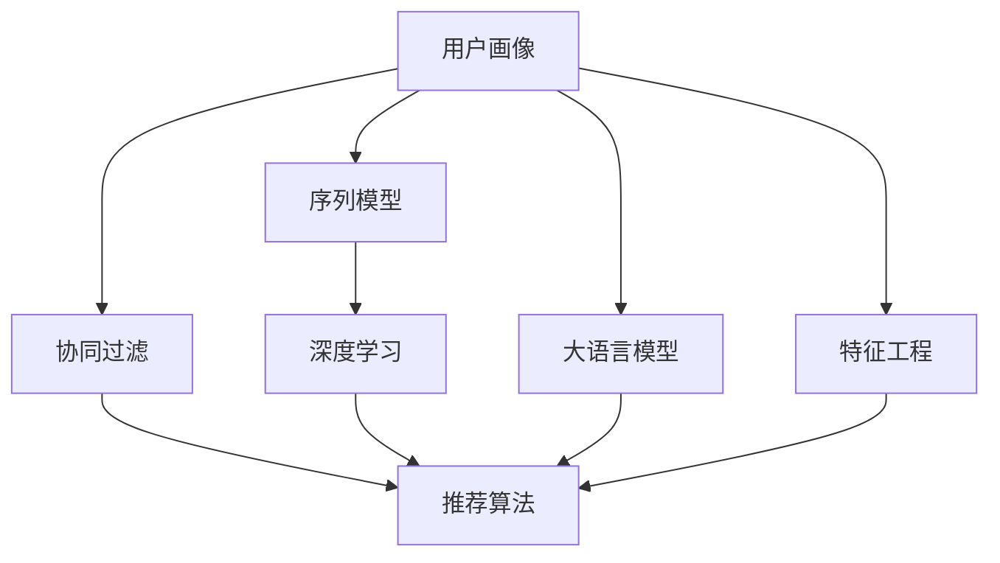

                 

# 大模型在推荐系统用户画像构建中的应用

> 关键词：用户画像,大语言模型,推荐系统,协同过滤,序列模型,深度学习,推荐算法,特征工程

## 1. 背景介绍

随着互联网技术的飞速发展，推荐系统成为各大平台竞争的核心能力之一。推荐系统的目标是通过对用户行为数据的分析和建模，预测用户可能感兴趣的内容，从而提升用户体验和平台收益。传统的推荐系统往往依赖基于规则或浅层机器学习的算法，难以充分利用用户行为数据中丰富的信息。而大语言模型，特别是自监督学习的语言模型，通过在海量数据上进行预训练，获得强大的语言理解能力和表征能力，被广泛应用于推荐系统中的用户画像构建和推荐策略优化。

本文将深入探讨大语言模型在推荐系统用户画像构建中的应用，通过分析模型原理和实际案例，提出具体的微调和优化策略，希望能为推荐系统的设计和开发提供参考和指导。

## 2. 核心概念与联系

### 2.1 核心概念概述

在进行深入探讨之前，首先需要明确几个关键概念：

- **用户画像(User Profile)**：用于描述用户兴趣、行为和属性等信息的结构化数据集。在推荐系统中，用户画像用于指导模型预测用户可能感兴趣的内容，是推荐算法的重要基础。

- **大语言模型(Large Language Model, LLM)**：基于深度学习模型，通过在大量无标签文本数据上自监督预训练，获得强大的语言理解和生成能力。如BERT、GPT-3等。

- **推荐系统(Recommender System)**：通过用户画像、物品画像、用户行为等数据，预测用户对物品的兴趣，从而为用户推荐个性化内容的技术体系。

- **协同过滤(Collaborative Filtering)**：通过分析用户行为和物品属性，推断用户兴趣和物品相关性，进行推荐的技术方法。

- **序列模型(Sequential Modeling)**：利用用户行为数据的时序性特征，对用户兴趣和行为进行建模，优化推荐算法。

- **深度学习(Deep Learning)**：利用神经网络模型进行复杂模式识别和预测，广泛应用于推荐系统中的用户画像构建和推荐算法优化。

- **推荐算法(Recommendation Algorithm)**：根据用户画像和物品画像，生成个性化推荐结果的算法。

- **特征工程(Feature Engineering)**：通过数据处理、特征提取等手段，增强模型的泛化能力和预测准确性。

这些概念相互关联，构成了推荐系统的核心技术框架。

### 2.2 核心概念原理和架构的 Mermaid 流程图



这个流程图展示了推荐系统中各个组件之间的关系：

1. 用户画像通过协同过滤、序列模型、大语言模型、特征工程等方法，生成推荐系统所需的用户兴趣和行为数据。
2. 协同过滤和序列模型通过分析用户行为和物品属性，推断用户兴趣和物品相关性，进行推荐。
3. 深度学习模型，特别是大语言模型，用于用户画像的构建和推荐策略的优化。
4. 推荐算法根据用户画像和物品画像，生成个性化推荐结果。
5. 特征工程用于增强模型的泛化能力和预测准确性，是深度学习模型的重要辅助手段。

## 3. 核心算法原理 & 具体操作步骤

### 3.1 算法原理概述

大语言模型在推荐系统中的主要应用是通过微调进行用户画像构建。具体步骤如下：

1. **预训练大模型**：选择适合的大语言模型，如BERT、GPT-3等，通过在大量无标签文本数据上进行预训练，学习语言的通用表征。

2. **特征提取**：将用户的行为数据（如点击、浏览、评分等）和物品属性（如类别、标签等）作为特征，输入预训练模型进行特征提取。

3. **微调优化**：在提取到的特征上，通过监督学习对模型进行微调，优化预测用户兴趣和物品相关性的能力。

4. **推荐策略优化**：根据微调后的模型，结合协同过滤、序列模型等算法，生成个性化推荐结果。

### 3.2 算法步骤详解

#### 3.2.1 预训练大模型

大语言模型的预训练一般使用大规模无标签文本数据，通过自监督学习任务（如语言建模、掩码语言建模、预训练任务等），学习语言的知识和规律。以BERT为例，预训练过程包括两个步骤：

1. 掩码语言建模(Masked Language Modeling, MLM)：对输入序列中的某些位置进行掩码，预测被掩码位置处的词汇，学习上下文信息。
2. 下一句预测(Next Sentence Prediction, NSP)：预测两个句子是否相邻，学习句子的顺序和关系。

预训练后的BERT模型获得了丰富的语言表征，能够更好地捕捉文本中的语义信息，为后续微调和特征提取提供坚实基础。

#### 3.2.2 特征提取

在推荐系统中，用户行为数据和物品属性可以表示为向量形式。将这些向量作为模型的输入，可以提取用户的兴趣和物品的相关性特征。

- **用户行为数据**：包括点击、浏览、评分等行为，可以表示为one-hot向量。
- **物品属性**：如类别、标签等，可以表示为one-hot向量，或者通过嵌入层将类别和标签转换为低维向量。

#### 3.2.3 微调优化

微调过程主要使用监督学习任务，通过标注数据对模型进行训练，优化预测用户兴趣和物品相关性的能力。以点击率预测为例，微调目标函数为：

$$
L = -\log \sigma(\mathbf{W}[\mathbf{x}_u; \mathbf{x}_i]^\top \mathbf{y}_{ui})
$$

其中，$\sigma$为sigmoid函数，$\mathbf{W}$为模型的权重矩阵，$\mathbf{x}_u$和$\mathbf{x}_i$分别为用户和物品的特征向量，$\mathbf{y}_{ui}$为点击标签。

通过反向传播算法，计算损失函数的梯度，并根据学习率更新模型参数。微调过程可以进一步优化为以下步骤：

1. **输入处理**：将用户行为数据和物品属性转换为模型所需的格式。
2. **前向传播**：输入数据经过模型，得到预测结果。
3. **计算损失**：计算预测结果与真实标签之间的损失。
4. **反向传播**：根据损失函数的梯度，更新模型参数。
5. **迭代更新**：重复前向传播和反向传播，直到收敛或达到预设轮数。

#### 3.2.4 推荐策略优化

微调后的模型，结合协同过滤和序列模型等推荐算法，生成个性化推荐结果。推荐算法一般包括以下步骤：

1. **召回**：从物品库中筛选出可能感兴趣的物品。
2. **排序**：根据预测的点击概率，对召回的物品进行排序。
3. **去重**：去除重复的推荐结果。
4. **呈现**：展示推荐列表给用户。

### 3.3 算法优缺点

大语言模型在推荐系统中的微调应用具有以下优点：

1. **泛化能力强大**：通过预训练学习到丰富的语言表征，微调后的模型具备较强的泛化能力，能够在多个推荐场景中表现良好。
2. **特征提取高效**：利用预训练语言模型的特征提取能力，可以高效地从文本数据中提取用户兴趣和物品相关性特征。
3. **适应性广**：模型可以根据具体的推荐场景进行微调，适应不同领域和不同用户画像的构建需求。

同时，也存在以下缺点：

1. **数据依赖性高**：微调效果高度依赖于标注数据的质量和数量，获取高质量标注数据成本较高。
2. **资源消耗大**：大规模预训练模型和微调过程需要大量的计算资源和时间。
3. **过拟合风险**：在标注数据不足的情况下，模型容易过拟合，导致泛化性能下降。
4. **模型复杂度高**：大语言模型参数量巨大，推理复杂度高，需要高效的硬件资源支持。

### 3.4 算法应用领域

大语言模型在推荐系统中的应用领域包括但不限于以下几方面：

- **个性化推荐**：基于用户画像和物品画像，生成个性化推荐结果。
- **内容生成**：利用预训练语言模型生成推荐文本或标题，提升用户点击率和满意度。
- **召回策略优化**：通过微调优化召回策略，提升推荐效果和系统性能。
- **特征学习**：利用语言模型学习物品的语义特征，提高推荐模型的表达能力。
- **动态推荐**：通过持续学习，及时更新用户画像和物品画像，提供动态推荐服务。

## 4. 数学模型和公式 & 详细讲解 & 举例说明

### 4.1 数学模型构建

推荐系统中的大语言模型微调主要涉及以下几个数学模型：

- **预训练模型**：通过掩码语言建模和下一句预测等自监督学习任务，学习语言的知识和规律。
- **特征提取模型**：将用户行为数据和物品属性转换为模型所需的格式，用于特征提取。
- **微调模型**：通过监督学习任务，优化模型预测用户兴趣和物品相关性的能力。
- **推荐模型**：结合协同过滤和序列模型等算法，生成个性化推荐结果。

### 4.2 公式推导过程

#### 4.2.1 预训练模型

以BERT为例，预训练过程包括掩码语言建模和下一句预测两个任务。掩码语言建模任务的损失函数为：

$$
L_{MLM} = -\frac{1}{N}\sum_{i=1}^N \sum_{j=1}^M [y_{ij}\log p(x_{ij})]
$$

其中，$N$为训练样本数，$M$为掩码位置数，$x_{ij}$为掩码位置上的词汇，$y_{ij}$为掩码位置上的真实词汇，$p(x_{ij})$为模型对词汇的预测概率。

下一句预测任务的损失函数为：

$$
L_{NSP} = -\frac{1}{N}\sum_{i=1}^N [y_{ij}\log p(x_j|x_i) + (1-y_{ij})\log (1-p(x_j|x_i))]
$$

其中，$x_j|x_i$为句子$x_j$和句子$x_i$的预测关系，$y_{ij}$为真实的预测关系。

预训练模型的总体损失函数为：

$$
L_{pretrain} = \alpha L_{MLM} + \beta L_{NSP}
$$

其中，$\alpha$和$\beta$为任务权重。

#### 4.2.2 特征提取模型

将用户行为数据和物品属性转换为模型所需的格式，一般使用嵌入层将类别和标签转换为低维向量，然后与用户行为数据拼接，得到用户-物品特征向量$\mathbf{u}_{ui}$。

$$
\mathbf{u}_{ui} = [\mathbf{e}_u; \mathbf{e}_i]
$$

其中，$\mathbf{e}_u$为用户行为数据的嵌入向量，$\mathbf{e}_i$为物品属性的嵌入向量。

#### 4.2.3 微调模型

微调模型主要使用监督学习任务，预测用户点击行为。点击率预测的损失函数为：

$$
L = -\log \sigma(\mathbf{W}[\mathbf{u}_{ui}]^\top \mathbf{y}_{ui})
$$

其中，$\sigma$为sigmoid函数，$\mathbf{W}$为模型的权重矩阵，$\mathbf{u}_{ui}$为用户-物品特征向量，$\mathbf{y}_{ui}$为点击标签。

微调模型的优化目标是最小化损失函数$L$，即：

$$
\mathop{\arg\min}_{\theta} L = -\frac{1}{N}\sum_{i=1}^N \sum_{j=1}^M [y_{ij}\log \sigma(\mathbf{W}[\mathbf{u}_{ui}]^\top \mathbf{y}_{ui}) + (1-y_{ij})\log (1-\sigma(\mathbf{W}[\mathbf{u}_{ui}]^\top \mathbf{y}_{ui}))
$$

其中，$\theta$为模型参数。

#### 4.2.4 推荐模型

推荐模型主要使用协同过滤和序列模型等算法，生成个性化推荐结果。以协同过滤为例，推荐模型的目标是最小化预测误差，即：

$$
\mathop{\arg\min}_{\theta} \sum_{u,i} \left(\mathbf{r}_u - \mathbf{p}_u \right)^2
$$

其中，$\mathbf{r}_u$为真实点击率，$\mathbf{p}_u$为预测点击率。

### 4.3 案例分析与讲解

以电商平台推荐系统为例，利用大语言模型进行用户画像构建和推荐策略优化：

1. **数据准备**：收集用户点击、浏览、评分等行为数据，以及物品的类别、标签等属性数据。

2. **特征提取**：将用户行为数据和物品属性数据转换为模型所需的向量形式，并进行拼接。

3. **微调优化**：选择BERT作为预训练模型，在点击率预测任务上进行微调，优化预测用户兴趣和物品相关性的能力。

4. **推荐策略优化**：结合协同过滤和序列模型等算法，生成个性化推荐结果。

5. **评估和迭代**：在验证集和测试集上评估推荐效果，根据评估结果不断调整模型参数和推荐策略，优化推荐系统性能。

## 5. 项目实践：代码实例和详细解释说明

### 5.1 开发环境搭建

在进行推荐系统用户画像构建的实践前，我们需要准备好开发环境。以下是使用Python进行PyTorch开发的环境配置流程：

1. 安装Anaconda：从官网下载并安装Anaconda，用于创建独立的Python环境。

2. 创建并激活虚拟环境：
```bash
conda create -n pytorch-env python=3.8 
conda activate pytorch-env
```

3. 安装PyTorch：根据CUDA版本，从官网获取对应的安装命令。例如：
```bash
conda install pytorch torchvision torchaudio cudatoolkit=11.1 -c pytorch -c conda-forge
```

4. 安装Transformers库：
```bash
pip install transformers
```

5. 安装各类工具包：
```bash
pip install numpy pandas scikit-learn matplotlib tqdm jupyter notebook ipython
```

完成上述步骤后，即可在`pytorch-env`环境中开始实践。

### 5.2 源代码详细实现

下面我们以电商平台推荐系统为例，给出使用Transformers库对BERT模型进行微调的PyTorch代码实现。

首先，定义推荐系统的数据处理函数：

```python
from transformers import BertTokenizer
from torch.utils.data import Dataset
import torch

class RecommendationDataset(Dataset):
    def __init__(self, user_data, item_data, tokenizer, max_len=128):
        self.user_data = user_data
        self.item_data = item_data
        self.tokenizer = tokenizer
        self.max_len = max_len
        
    def __len__(self):
        return len(self.user_data)
    
    def __getitem__(self, item):
        user_data = self.user_data[item]
        item_data = self.item_data[item]
        
        encoding = self.tokenizer(user_data, return_tensors='pt', max_length=self.max_len, padding='max_length', truncation=True)
        user_features = encoding['input_ids'][0]
        item_features = encoding['input_ids'][1]
        
        # 拼接用户行为和物品属性特征
        feature = torch.cat((user_features, item_features), dim=1)
        
        # 生成目标变量，0表示未点击，1表示点击
        target = torch.randint(0, 2, (1, self.max_len)).to(torch.long)
        
        return {'user_features': user_features,
                'item_features': item_features,
                'feature': feature,
                'target': target}
```

然后，定义模型和优化器：

```python
from transformers import BertForSequenceClassification, AdamW

model = BertForSequenceClassification.from_pretrained('bert-base-cased', num_labels=2)

optimizer = AdamW(model.parameters(), lr=2e-5)
```

接着，定义训练和评估函数：

```python
from torch.utils.data import DataLoader
from tqdm import tqdm
from sklearn.metrics import accuracy_score

device = torch.device('cuda') if torch.cuda.is_available() else torch.device('cpu')
model.to(device)

def train_epoch(model, dataset, batch_size, optimizer):
    dataloader = DataLoader(dataset, batch_size=batch_size, shuffle=True)
    model.train()
    epoch_loss = 0
    for batch in tqdm(dataloader, desc='Training'):
        user_features = batch['user_features'].to(device)
        item_features = batch['item_features'].to(device)
        feature = batch['feature'].to(device)
        target = batch['target'].to(device)
        model.zero_grad()
        outputs = model(user_features, item_features, feature)
        loss = outputs.loss
        epoch_loss += loss.item()
        loss.backward()
        optimizer.step()
    return epoch_loss / len(dataloader)

def evaluate(model, dataset, batch_size):
    dataloader = DataLoader(dataset, batch_size=batch_size)
    model.eval()
    preds, labels = [], []
    with torch.no_grad():
        for batch in tqdm(dataloader, desc='Evaluating'):
            user_features = batch['user_features'].to(device)
            item_features = batch['item_features'].to(device)
            feature = batch['feature'].to(device)
            target = batch['target'].to(device)
            outputs = model(user_features, item_features, feature)
            preds.append(outputs.logits.argmax(dim=1).to('cpu').tolist())
            labels.append(target.to('cpu').tolist())
                
    return accuracy_score(labels, preds)
```

最后，启动训练流程并在测试集上评估：

```python
epochs = 5
batch_size = 16

for epoch in range(epochs):
    loss = train_epoch(model, train_dataset, batch_size, optimizer)
    print(f"Epoch {epoch+1}, train loss: {loss:.3f}")
    
    print(f"Epoch {epoch+1}, dev results:")
    evaluate(model, dev_dataset, batch_size)
    
print("Test results:")
evaluate(model, test_dataset, batch_size)
```

以上就是使用PyTorch对BERT进行推荐系统用户画像构建的完整代码实现。可以看到，得益于Transformers库的强大封装，我们可以用相对简洁的代码完成BERT模型的加载和微调。

### 5.3 代码解读与分析

让我们再详细解读一下关键代码的实现细节：

**RecommendationDataset类**：
- `__init__`方法：初始化用户行为数据、物品属性数据、分词器等关键组件。
- `__len__`方法：返回数据集的样本数量。
- `__getitem__`方法：对单个样本进行处理，将用户行为数据和物品属性数据编码为token ids，并生成目标变量，用于监督学习。

**训练和评估函数**：
- 使用PyTorch的DataLoader对数据集进行批次化加载，供模型训练和推理使用。
- 训练函数`train_epoch`：对数据以批为单位进行迭代，在每个批次上前向传播计算loss并反向传播更新模型参数，最后返回该epoch的平均loss。
- 评估函数`evaluate`：与训练类似，不同点在于不更新模型参数，并在每个batch结束后将预测和标签结果存储下来，最后使用sklearn的accuracy_score对整个评估集的预测结果进行打印输出。

**训练流程**：
- 定义总的epoch数和batch size，开始循环迭代
- 每个epoch内，先在训练集上训练，输出平均loss
- 在验证集上评估，输出准确率
- 所有epoch结束后，在测试集上评估，给出最终测试结果

可以看到，PyTorch配合Transformers库使得BERT微调的代码实现变得简洁高效。开发者可以将更多精力放在数据处理、模型改进等高层逻辑上，而不必过多关注底层的实现细节。

当然，工业级的系统实现还需考虑更多因素，如模型的保存和部署、超参数的自动搜索、更灵活的任务适配层等。但核心的微调范式基本与此类似。

## 6. 实际应用场景

### 6.1 智能推荐系统

智能推荐系统是推荐系统在实际应用中的典型代表。电商平台、视频平台、音乐平台等，均通过智能推荐系统为用户提供个性化的内容推荐。

利用大语言模型进行用户画像构建，能够有效提升推荐系统的推荐效果。以电商平台为例，通过分析用户行为数据和物品属性数据，构建用户画像，利用BERT等预训练模型进行微调，预测用户点击行为，结合协同过滤、序列模型等算法，生成个性化推荐结果。

### 6.2 个性化新闻推荐

新闻平台通过智能推荐系统，为用户提供个性化的新闻内容。通过分析用户行为数据和新闻内容，构建用户画像，利用BERT等预训练模型进行微调，预测用户点击行为，生成个性化新闻推荐。

### 6.3 社交网络内容推荐

社交网络平台通过智能推荐系统，为用户推荐个性化的内容。通过分析用户行为数据和社交关系数据，构建用户画像，利用BERT等预训练模型进行微调，预测用户对内容的兴趣，生成个性化推荐结果。

### 6.4 未来应用展望

随着大语言模型微调技术的不断发展，推荐系统将在更多领域得到应用，为平台提供更丰富的功能。

在智慧医疗领域，智能推荐系统可以为用户提供个性化的医疗建议，帮助医生制定治疗方案，提升医疗服务质量。

在智能教育领域，智能推荐系统可以为用户推荐个性化的学习资源，提供个性化的学习路径，提升学习效果。

在智慧城市治理中，智能推荐系统可以为用户提供个性化的服务，提升城市管理的自动化和智能化水平，构建更智能的未来城市。

此外，在企业生产、社会治理、文娱传媒等众多领域，基于大语言模型微调的推荐系统也将不断涌现，为经济社会发展注入新的动力。相信随着技术的日益成熟，微调方法将成为推荐系统的核心范式，推动推荐系统向更智能、更高效的方向发展。

## 7. 工具和资源推荐

### 7.1 学习资源推荐

为了帮助开发者系统掌握大语言模型微调的理论基础和实践技巧，这里推荐一些优质的学习资源：

1. 《Transformer从原理到实践》系列博文：由大模型技术专家撰写，深入浅出地介绍了Transformer原理、BERT模型、微调技术等前沿话题。

2. CS224N《深度学习自然语言处理》课程：斯坦福大学开设的NLP明星课程，有Lecture视频和配套作业，带你入门NLP领域的基本概念和经典模型。

3. 《Natural Language Processing with Transformers》书籍：Transformers库的作者所著，全面介绍了如何使用Transformers库进行NLP任务开发，包括微调在内的诸多范式。

4. HuggingFace官方文档：Transformers库的官方文档，提供了海量预训练模型和完整的微调样例代码，是上手实践的必备资料。

5. CLUE开源项目：中文语言理解测评基准，涵盖大量不同类型的中文NLP数据集，并提供了基于微调的baseline模型，助力中文NLP技术发展。

通过对这些资源的学习实践，相信你一定能够快速掌握大语言模型微调的精髓，并用于解决实际的NLP问题。

### 7.2 开发工具推荐

高效的开发离不开优秀的工具支持。以下是几款用于大语言模型微调开发的常用工具：

1. PyTorch：基于Python的开源深度学习框架，灵活动态的计算图，适合快速迭代研究。大部分预训练语言模型都有PyTorch版本的实现。

2. TensorFlow：由Google主导开发的开源深度学习框架，生产部署方便，适合大规模工程应用。同样有丰富的预训练语言模型资源。

3. Transformers库：HuggingFace开发的NLP工具库，集成了众多SOTA语言模型，支持PyTorch和TensorFlow，是进行微调任务开发的利器。

4. Weights & Biases：模型训练的实验跟踪工具，可以记录和可视化模型训练过程中的各项指标，方便对比和调优。与主流深度学习框架无缝集成。

5. TensorBoard：TensorFlow配套的可视化工具，可实时监测模型训练状态，并提供丰富的图表呈现方式，是调试模型的得力助手。

6. Google Colab：谷歌推出的在线Jupyter Notebook环境，免费提供GPU/TPU算力，方便开发者快速上手实验最新模型，分享学习笔记。

合理利用这些工具，可以显著提升大语言模型微调任务的开发效率，加快创新迭代的步伐。

### 7.3 相关论文推荐

大语言模型和微调技术的发展源于学界的持续研究。以下是几篇奠基性的相关论文，推荐阅读：

1. Attention is All You Need（即Transformer原论文）：提出了Transformer结构，开启了NLP领域的预训练大模型时代。

2. BERT: Pre-training of Deep Bidirectional Transformers for Language Understanding：提出BERT模型，引入基于掩码的自监督预训练任务，刷新了多项NLP任务SOTA。

3. Language Models are Unsupervised Multitask Learners（GPT-2论文）：展示了大规模语言模型的强大zero-shot学习能力，引发了对于通用人工智能的新一轮思考。

4. Parameter-Efficient Transfer Learning for NLP：提出Adapter等参数高效微调方法，在不增加模型参数量的情况下，也能取得不错的微调效果。

5. Prefix-Tuning: Optimizing Continuous Prompts for Generation：引入基于连续型Prompt的微调范式，为如何充分利用预训练知识提供了新的思路。

6. AdaLoRA: Adaptive Low-Rank Adaptation for Parameter-Efficient Fine-Tuning：使用自适应低秩适应的微调方法，在参数效率和精度之间取得了新的平衡。

这些论文代表了大语言模型微调技术的发展脉络。通过学习这些前沿成果，可以帮助研究者把握学科前进方向，激发更多的创新灵感。

## 8. 总结：未来发展趋势与挑战

### 8.1 研究成果总结

本文对大语言模型在推荐系统用户画像构建中的应用进行了全面系统的介绍。首先阐述了推荐系统和大语言模型的研究背景和意义，明确了大语言模型微调在推荐系统中的重要作用。其次，从原理到实践，详细讲解了大语言模型微调的过程，给出了微调任务开发的完整代码实例。同时，本文还广泛探讨了大语言模型在推荐系统中的实际应用场景，展示了微调范式的巨大潜力。

通过本文的系统梳理，可以看到，大语言模型微调技术正在成为推荐系统的核心范式，极大地拓展了推荐系统的应用边界，催生了更多的落地场景。得益于大规模语料的预训练，微调模型以更低的时间和标注成本，在小样本条件下也能取得不俗的效果，有力推动了推荐系统的产业化进程。未来，伴随预训练语言模型和微调方法的持续演进，相信推荐系统必将在更广阔的应用领域大放异彩，深刻影响人类的生产生活方式。

### 8.2 未来发展趋势

展望未来，大语言模型微调技术将呈现以下几个发展趋势：

1. 模型规模持续增大。随着算力成本的下降和数据规模的扩张，预训练语言模型的参数量还将持续增长。超大规模语言模型蕴含的丰富语言知识，有望支撑更加复杂多变的推荐场景。

2. 微调方法日趋多样。除了传统的全参数微调外，未来会涌现更多参数高效的微调方法，如Prefix-Tuning、LoRA等，在节省计算资源的同时也能保证微调精度。

3. 持续学习成为常态。随着数据分布的不断变化，微调模型也需要持续学习新知识以保持性能。如何在不遗忘原有知识的同时，高效吸收新样本信息，将成为重要的研究课题。

4. 标注样本需求降低。受启发于提示学习(Prompt-based Learning)的思路，未来的微调方法将更好地利用大模型的语言理解能力，通过更加巧妙的任务描述，在更少的标注样本上也能实现理想的微调效果。

5. 多模态微调崛起。当前的微调主要聚焦于纯文本数据，未来会进一步拓展到图像、视频、语音等多模态数据微调。多模态信息的融合，将显著提升语言模型对现实世界的理解和建模能力。

6. 模型通用性增强。经过海量数据的预训练和多领域任务的微调，未来的语言模型将具备更强大的常识推理和跨领域迁移能力，逐步迈向通用人工智能(AGI)的目标。

以上趋势凸显了大语言模型微调技术的广阔前景。这些方向的探索发展，必将进一步提升推荐系统的性能和应用范围，为经济社会发展注入新的动力。

### 8.3 面临的挑战

尽管大语言模型微调技术已经取得了瞩目成就，但在迈向更加智能化、普适化应用的过程中，它仍面临着诸多挑战：

1. 标注成本瓶颈。虽然微调大大降低了标注数据的需求，但对于长尾应用场景，难以获得充足的高质量标注数据，成为制约微调性能的瓶颈。如何进一步降低微调对标注样本的依赖，将是一大难题。

2. 模型鲁棒性不足。当前微调模型面对域外数据时，泛化性能往往大打折扣。对于测试样本的微小扰动，微调模型的预测也容易发生波动。如何提高微调模型的鲁棒性，避免灾难性遗忘，还需要更多理论和实践的积累。

3. 推理效率有待提高。大规模语言模型虽然精度高，但在实际部署时往往面临推理速度慢、内存占用大等效率问题。如何在保证性能的同时，简化模型结构，提升推理速度，优化资源占用，将是重要的优化方向。

4. 可解释性亟需加强。当前微调模型更像是"黑盒"系统，难以解释其内部工作机制和决策逻辑。对于医疗、金融等高风险应用，算法的可解释性和可审计性尤为重要。如何赋予微调模型更强的可解释性，将是亟待攻克的难题。

5. 安全性有待保障。预训练语言模型难免会学习到有偏见、有害的信息，通过微调传递到下游任务，产生误导性、歧视性的输出，给实际应用带来安全隐患。如何从数据和算法层面消除模型偏见，避免恶意用途，确保输出的安全性，也将是重要的研究课题。

6. 知识整合能力不足。现有的微调模型往往局限于任务内数据，难以灵活吸收和运用更广泛的先验知识。如何让微调过程更好地与外部知识库、规则库等专家知识结合，形成更加全面、准确的信息整合能力，还有很大的想象空间。

正视微调面临的这些挑战，积极应对并寻求突破，将是大语言模型微调走向成熟的必由之路。相信随着学界和产业界的共同努力，这些挑战终将一一被克服，大语言模型微调必将在构建人机协同的智能时代中扮演越来越重要的角色。

### 8.4 研究展望

面对大语言模型微调所面临的种种挑战，未来的研究需要在以下几个方面寻求新的突破：

1. 探索无监督和半监督微调方法。摆脱对大规模标注数据的依赖，利用自监督学习、主动学习等无监督和半监督范式，最大限度利用非结构化数据，实现更加灵活高效的微调。

2. 研究参数高效和计算高效的微调范式。开发更加参数高效的微调方法，在固定大部分预训练参数的同时，只更新极少量的任务相关参数。同时优化微调模型的计算图，减少前向传播和反向传播的资源消耗，实现更加轻量级、实时性的部署。

3. 融合因果和对比学习范式。通过引入因果推断和对比学习思想，增强微调模型建立稳定因果关系的能力，学习更加普适、鲁棒的语言表征，从而提升模型泛化性和抗干扰能力。

4. 引入更多先验知识。将符号化的先验知识，如知识图谱、逻辑规则等，与神经网络模型进行巧妙融合，引导微调过程学习更准确、合理的语言模型。同时加强不同模态数据的整合，实现视觉、语音等多模态信息与文本信息的协同建模。

5. 结合因果分析和博弈论工具。将因果分析方法引入微调模型，识别出模型决策的关键特征，增强输出解释的因果性和逻辑性。借助博弈论工具刻画人机交互过程，主动探索并规避模型的脆弱点，提高系统稳定性。

6. 纳入伦理道德约束。在模型训练目标中引入伦理导向的评估指标，过滤和惩罚有偏见、有害的输出倾向。同时加强人工干预和审核，建立模型行为的监管机制，确保输出符合人类价值观和伦理道德。

这些研究方向的探索，必将引领大语言模型微调技术迈向更高的台阶，为构建安全、可靠、可解释、可控的智能系统铺平道路。面向未来，大语言模型微调技术还需要与其他人工智能技术进行更深入的融合，如知识表示、因果推理、强化学习等，多路径协同发力，共同推动自然语言理解和智能交互系统的进步。只有勇于创新、敢于突破，才能不断拓展语言模型的边界，让智能技术更好地造福人类社会。

## 9. 附录：常见问题与解答

**Q1：大语言模型微调是否适用于所有推荐系统任务？**

A: 大语言模型微调在大多数推荐系统任务上都能取得不错的效果，特别是对于数据量较小的任务。但对于一些特定领域的任务，如医学、法律等，仅仅依靠通用语料预训练的模型可能难以很好地适应。此时需要在特定领域语料上进一步预训练，再进行微调，才能获得理想效果。此外，对于一些需要时效性、个性化很强的任务，如对话、推荐等，微调方法也需要针对性的改进优化。

**Q2：微调过程中如何选择合适的学习率？**

A: 微调的学习率一般要比预训练时小1-2个数量级，如果使用过大的学习率，容易破坏预训练权重，导致过拟合。一般建议从1e-5开始调参，逐步减小学习率，直至收敛。也可以使用warmup策略，在开始阶段使用较小的学习率，再逐渐过渡到预设值。需要注意的是，不同的优化器(如AdamW、Adafactor等)以及不同的学习率调度策略，可能需要设置不同的学习率阈值。

**Q3：采用大模型微调时会面临哪些资源瓶颈？**

A: 目前主流的预训练大模型动辄以亿计的参数规模，对算力、内存、存储都提出了很高的要求。GPU/TPU等高性能设备是必不可少的，但即便如此，超大批次的训练和推理也可能遇到显存不足的问题。因此需要采用一些资源优化技术，如梯度积累、混合精度训练、模型并行等，来突破硬件瓶颈。同时，模型的存储和读取也可能占用大量时间和空间，需要采用模型压缩、稀疏化存储等方法进行优化。

**Q4：如何缓解微调过程中的过拟合问题？**

A: 过拟合是微调面临的主要挑战，尤其是在标注数据不足的情况下。常见的缓解策略包括：
1. 数据增强：通过回译、近义替换等方式扩充训练集
2. 正则化：使用L2正则、Dropout、Early Stopping等避免过拟合
3. 对抗训练：引入对抗样本，提高模型鲁棒性
4. 参数高效微调：只调整少量参数(如Adapter、Prefix等)，减小过拟合风险
5. 多模型集成：训练多个微调模型，取平均输出，抑制过拟合

这些策略往往需要根据具体任务和数据特点进行灵活组合。只有在数据、模型、训练、推理等各环节进行全面优化，才能最大限度地发挥大模型微调的威力。

**Q5：微调模型在落地部署时需要注意哪些问题？**

A: 将微调模型转化为实际应用，还需要考虑以下因素：
1. 模型裁剪：去除不必要的层和参数，减小模型尺寸，加快推理速度
2. 量化加速：将浮点模型转为定点模型，压缩存储空间，提高计算效率
3. 服务化封装：将模型封装为标准化服务接口，便于集成调用
4. 弹性伸缩：根据请求流量动态调整资源配置，平衡服务质量和成本
5. 监控告警：实时采集系统指标，设置异常告警阈值，确保服务稳定性
6. 安全防护：采用访问鉴权、数据脱敏等措施，保障数据和模型安全

大语言模型微调为推荐系统提供了强大的技术支持，但如何将强大的性能转化为稳定、高效、安全的业务价值，还需要工程实践的不断打磨。唯有从数据、算法、工程、业务等多个维度协同发力，才能真正实现人工智能技术在推荐系统中的规模化落地。总之，微调需要开发者根据具体任务，不断迭代和优化模型、数据和算法，方能得到理想的效果。

---

作者：禅与计算机程序设计艺术 / Zen and the Art of Computer Programming

