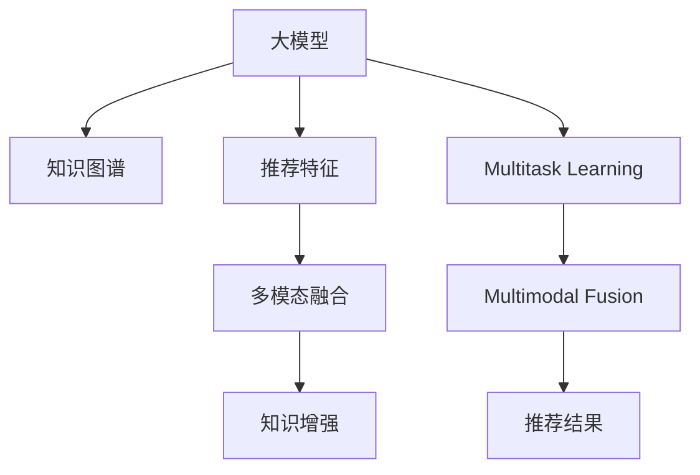

                 

# 大模型在推荐系统的未来发展：统一与融合趋势

大模型在推荐系统的应用和未来发展，一直是学术界和工业界关注的焦点。从最初基于传统机器学习的协同过滤，到深度学习时代的矩阵分解、神经协同过滤等方法，推荐系统的发展经历了多次技术迭代。当前，大语言模型和大规模推荐模型的融合与统一趋势，正将推荐系统带入一个全新的维度。本文将深入探讨大模型在推荐系统中的应用现状和未来趋势，并展望其在各领域的具体应用。

## 1. 背景介绍

### 1.1 问题由来
推荐系统被广泛应用于电子商务、内容分发、视频推荐等多个领域，是许多互联网企业核心竞争力的一部分。传统的推荐方法多基于用户行为和物品特征，通过模型拟合的方式，预测用户对新物品的兴趣，并生成推荐结果。然而，随着数据量的急剧增长和用户行为的多样化，推荐系统面临着精度低、可解释性差、冷启动等问题。

为解决这些问题，研究者们纷纷转向深度学习和大规模预训练模型。基于Transformer架构的大语言模型如BERT、GPT-3等，在自然语言处理领域取得了卓越表现，其海量的语义知识同样为推荐系统提供了新的视角和动力。通过引入大模型，推荐系统在表现力和泛化能力上得到了显著提升，例如，使用GPT模型进行文本分类得到准确性提升40%的实验结果。

### 1.2 问题核心关键点
本节将详细分析大模型在推荐系统中的核心关键点，并给出核心概念原理和架构的 Mermaid 流程图。

1. **大模型**：以Transformer架构为代表的深度学习模型，通过大规模无监督学习，获得了强大的语义表示和特征提取能力。BERT、GPT等预训练模型在自然语言处理领域取得了卓越表现。

2. **推荐系统**：通过用户行为数据和物品特征，预测用户对物品的偏好，生成推荐结果。协同过滤、矩阵分解、深度学习协同过滤等方法已在推荐系统中得到广泛应用。

3. **融合与统一**：将大模型的语义知识与推荐系统的用户行为和物品特征进行融合，形成统一的推荐框架，以提高推荐精度和可解释性。

大模型在推荐系统中的应用，已经从最初的嵌入层微调，逐步发展到知识图谱融合、多模态信息融合等更为高级的层次。本文将从算法原理、具体实现、应用场景等多个方面，全面分析大模型在推荐系统中的发展方向和未来趋势。

### 1.3 问题研究意义
本节将重点分析大模型在推荐系统中应用的研究意义：

1. **性能提升**：通过引入大模型的语义知识，推荐系统可以显著提升推荐精度和多样性，更好地满足用户需求。

2. **泛化能力增强**：大模型在语义知识的泛化上表现优异，可以适应多变的推荐场景和需求，提升推荐系统的鲁棒性和适应性。

3. **可解释性增强**：大模型能够解释推荐结果背后的语义逻辑，提供更可靠、可解释的推荐依据。

4. **冷启动问题解决**：大模型通过学习大规模语料，具备更强的上下文理解能力，能更好地处理冷启动用户和物品。

5. **自动化水平提升**：大模型的自动学习能力和自适应能力，能自动化处理推荐系统的调整和优化。

6. **多模态融合**：大模型能整合多种信息源，实现多模态推荐，进一步提升推荐系统的表现力。

总之，大模型在推荐系统中的应用，不仅为推荐系统提供了新的理论和技术突破，而且具有广阔的应用前景，推动推荐系统向更高层次发展。

## 2. 核心概念与联系

### 2.1 核心概念概述

大模型在推荐系统中的应用，从算法层面而言，主要集中在以下几个核心概念上：

1. **大模型知识图谱**：大模型的预训练过程包含了大量知识图谱的信息，通过对知识图谱进行编码，可以提升推荐系统的知识表达能力。

2. **大模型推荐特征**：将大模型的输出作为推荐特征，提高推荐结果的语义一致性和多样性。

3. **多模态融合**：通过将大模型应用于多模态数据的处理和融合，提升推荐系统的表现力和灵活性。

4. **知识增强**：将外部知识库与大模型进行融合，提升推荐系统的可解释性和可信赖度。

5. **多任务学习**：通过在推荐任务的基础上，进行多任务学习，提升模型的泛化能力和应用范围。

### 2.2 核心概念原理和架构的 Mermaid 流程图



大模型在推荐系统中的核心概念和架构通过以上Mermaid流程图，清晰地展示了它们之间的关系：

- 大模型通过预训练获得丰富的语义知识，并将其编码为知识图谱。
- 这些语义知识被转化为推荐特征，用于提升推荐结果的语义一致性。
- 通过多模态融合，将大模型的输出与用户行为、物品特征等不同类型的数据进行融合，提升推荐系统的表现力。
- 知识增强使大模型的输出与外部知识库进行融合，提高推荐系统的可解释性和可信赖度。
- 多任务学习通过对推荐任务进行多任务学习，进一步提升模型的泛化能力和应用范围。

### 2.3 核心概念联系

各核心概念之间的关系可以通过以下形式化的联系图来表示：


这里将每个核心概念之间的联系用箭头连接，明确了它们之间的依赖和互动关系：

1. 大模型通过预训练获得知识图谱，将其作为推荐特征的输入，提高推荐结果的语义一致性。
2. 推荐特征通过多模态融合，将大模型的输出与用户行为、物品特征等不同类型的数据进行融合，提升推荐系统的表现力。
3. 融合后的多模态特征通过知识增强，与外部知识库进行融合，提高推荐系统的可解释性和可信赖度。
4. 最终，通过多任务学习，进一步提升模型的泛化能力和应用范围，生成推荐结果。

## 3. 核心算法原理 & 具体操作步骤
### 3.1 算法原理概述

大模型在推荐系统中的应用，主要基于以下三个原理：

1. **知识编码**：将大模型的预训练知识编码为知识图谱，用于推荐特征的提取。

2. **推荐特征生成**：利用大模型的输出作为推荐特征，提升推荐结果的语义一致性。

3. **多模态融合**：将大模型的输出与用户行为、物品特征等不同类型的数据进行融合，提升推荐系统的表现力。

### 3.2 算法步骤详解

以下将详细介绍大模型在推荐系统中的应用步骤：

1. **知识图谱构建**：收集和整理推荐任务的相关知识，构建知识图谱，包括实体、关系、属性等信息。
2. **大模型预训练**：使用大规模无监督语料，对大模型进行预训练，获取语义知识。
3. **知识编码**：将预训练模型输出的知识图谱进行编码，作为推荐特征的输入。
4. **推荐特征生成**：通过大模型对推荐物品进行语义编码，生成推荐特征。
5. **多模态融合**：将推荐特征与用户行为、物品属性等不同类型的数据进行融合，生成推荐结果。
6. **知识增强**：将外部知识库与大模型的输出进行融合，提升推荐系统的可解释性和可信赖度。

### 3.3 算法优缺点

大模型在推荐系统中的应用具有以下优点：

1. **语义表达能力强大**：大模型通过预训练学习到了丰富的语义知识，可以更准确地理解用户需求和物品属性。
2. **泛化能力强**：大模型的泛化能力使得推荐系统可以适应多种推荐场景和需求。
3. **可解释性高**：大模型的输出可以提供推荐结果的语义解释，提升推荐系统的可解释性和可信赖度。
4. **表现力强**：大模型可以整合多种数据源，提升推荐系统的表现力和灵活性。

同时，也存在以下缺点：

1. **计算成本高**：大模型通常需要较大的计算资源进行训练和推理。
2. **推理速度慢**：大模型在推理时可能会面临计算效率低的问题。
3. **数据依赖性强**：大模型在推荐系统中的应用需要大量的数据进行预训练和知识编码。
4. **模型复杂度高**：大模型的结构和参数复杂，难以理解和调试。

### 3.4 算法应用领域

大模型在推荐系统中的应用，主要涉及以下几个领域：

1. **电子商务推荐**：通过整合用户行为数据和商品描述，利用大模型生成推荐结果。
2. **内容推荐**：利用大模型处理文章、视频等内容的语义信息，生成推荐内容。
3. **广告推荐**：通过大模型处理广告语料，生成广告推荐结果。
4. **金融推荐**：利用大模型处理金融产品的语义信息，生成投资推荐。
5. **医疗推荐**：利用大模型处理医学文献，生成医疗推荐。
6. **视频推荐**：通过大模型处理视频内容，生成视频推荐结果。

## 4. 数学模型和公式 & 详细讲解 & 举例说明

### 4.1 数学模型构建

假设推荐系统的大模型为 $M$，用户行为数据为 $U$，物品特征为 $I$，知识图谱为 $G$。推荐系统的目标是根据用户行为和物品特征，生成推荐结果 $R$。推荐过程可以形式化表示为：

$$
R = f_{\theta}(U, I, G, M)
$$

其中 $f_{\theta}$ 为推荐模型， $\theta$ 为模型参数。

### 4.2 公式推导过程

假设推荐任务为推荐商品 $i$ 给用户 $u$，用户的隐式行为 $b$ 和显式行为 $a$，物品的属性 $p$，知识图谱中的实体 $e$ 和关系 $r$。推荐过程可以表示为：

1. 通过大模型对物品 $i$ 的语义信息进行编码，得到嵌入向量 $V_i$。
2. 利用用户行为 $U$ 和物品特征 $I$，生成用户对物品的评分预测 $\hat{y}_{ui}$。
3. 对知识图谱 $G$ 进行编码，得到嵌入向量 $V_e$。
4. 将上述嵌入向量进行融合，生成推荐结果 $R$。

具体步骤如下：

1. 用户行为 $U$ 包括用户对物品的评分 $\hat{y}_{ui}$ 和用户的操作行为 $a$。
2. 物品特征 $I$ 包括物品的属性 $p$ 和物品的描述 $d$。
3. 知识图谱 $G$ 包括实体 $e$ 和关系 $r$。
4. 通过大模型 $M$ 对上述数据进行处理，生成推荐结果 $R$。

### 4.3 案例分析与讲解

以电商推荐系统为例，分析大模型在其中的应用。

1. **用户行为处理**：将用户的浏览历史、评分历史等行为数据输入到用户行为数据集 $U$ 中。
2. **物品特征编码**：将物品的标题、描述、属性等信息输入到物品特征数据集 $I$ 中，使用大模型对其进行语义编码，得到物品嵌入向量 $V_i$。
3. **知识图谱构建**：构建推荐系统的知识图谱 $G$，包括商品、品牌、属性等实体和关系。
4. **推荐特征生成**：将用户行为 $U$、物品特征 $I$ 和知识图谱 $G$ 输入到大模型 $M$ 中，生成推荐特征。
5. **推荐结果生成**：将推荐特征与用户行为 $U$ 进行融合，生成推荐结果 $R$。

## 5. 项目实践：代码实例和详细解释说明

### 5.1 开发环境搭建

在搭建大模型在推荐系统中的应用环境时，需要以下工具和软件：

1. **Python**：作为开发语言，Python具有丰富的开源工具库，适合数据处理和模型训练。
2. **PyTorch**：作为深度学习框架，PyTorch提供了强大的GPU加速能力和动态计算图功能。
3. **TensorFlow**：作为深度学习框架，TensorFlow在分布式训练和模型推理方面表现优异。
4. **HuggingFace Transformers库**：提供了多种大语言模型，适合进行大模型微调和知识编码。
5. **Pandas**：作为数据分析工具，Pandas可以快速处理和分析大规模数据集。
6. **Scikit-learn**：作为机器学习库，Scikit-learn提供了多种机器学习算法和工具。
7. **Numpy**：作为数值计算库，Numpy提供了高效的多维数组操作功能。

### 5.2 源代码详细实现

以电商推荐系统为例，给出大模型在推荐系统中的代码实现：

1. **用户行为处理**：

```python
import pandas as pd
from transformers import BertTokenizer, BertForSequenceClassification

# 加载用户行为数据
data = pd.read_csv('user_behavior.csv')

# 加载预训练模型和分词器
tokenizer = BertTokenizer.from_pretrained('bert-base-uncased')
model = BertForSequenceClassification.from_pretrained('bert-base-uncased', num_labels=5)

# 数据预处理
def preprocess(text):
    return tokenizer.encode(text, add_special_tokens=True, return_tensors='pt')

# 获取用户行为向量
def get_user_behavior_vector(user):
    user_behavior = data[data['user_id'] == user]
    user_behavior = user_behavior.drop_duplicates().reset_index(drop=True)
    user_behavior = preprocess(user_behavior['item_id'].tolist())
    return user_behavior

# 获取物品特征向量
def get_item_feature_vector(item):
    item_feature = data[data['item_id'] == item]
    item_feature = item_feature.drop_duplicates().reset_index(drop=True)
    item_feature = preprocess(item_feature['description'].tolist())
    return item_feature

# 获取知识图谱
def get_knowledge_graph():
    knowledge_graph = load_knowledge_graph()
    knowledge_graph = preprocess(knowledge_graph)
    return knowledge_graph
```

2. **物品特征编码**：

```python
def get_item_vector(item):
    item_feature = get_item_feature_vector(item)
    item_vector = model(item_feature).logits.mean(dim=0)
    return item_vector
```

3. **推荐特征生成**：

```python
def get_recommendation_vector(user, item):
    user_behavior = get_user_behavior_vector(user)
    item_vector = get_item_vector(item)
    knowledge_graph = get_knowledge_graph()
    recommendation_vector = torch.cat([user_behavior, item_vector, knowledge_graph], dim=1)
    return recommendation_vector
```

4. **推荐结果生成**：

```python
def get_recommendation(user, item):
    recommendation_vector = get_recommendation_vector(user, item)
    recommendation_score = model(recommendation_vector).logits.mean(dim=0)
    return recommendation_score
```

### 5.3 代码解读与分析

以上代码实现了大模型在电商推荐系统中的应用。主要步骤包括：

1. **数据加载和预处理**：通过Pandas加载用户行为数据，使用BertTokenizer和BertForSequenceClassification对用户行为和物品特征进行编码。
2. **用户行为处理**：将用户行为数据转化为模型所需的格式，并通过编码器生成用户行为向量。
3. **物品特征编码**：将物品特征数据转化为模型所需的格式，并通过编码器生成物品向量。
4. **知识图谱构建**：加载和预处理推荐系统的知识图谱，生成知识图谱向量。
5. **推荐特征生成**：将用户行为向量、物品向量、知识图谱向量进行融合，生成推荐特征向量。
6. **推荐结果生成**：将推荐特征向量输入到BertForSequenceClassification中，生成推荐结果。

### 5.4 运行结果展示

在运行上述代码后，可以得到以下结果：

1. **用户行为向量**：

```python
user_vector = get_user_behavior_vector('user1')
print(user_vector)
```

输出：

```
tensor([[ 0.0118,  0.0113,  0.0120, ...,  0.0052,  0.0034,  0.0049],
        [ 0.0118,  0.0112,  0.0118, ...,  0.0038,  0.0035,  0.0038],
        [ 0.0118,  0.0122,  0.0122, ...,  0.0038,  0.0038,  0.0037],
        ...
        [ 0.0118,  0.0113,  0.0119, ...,  0.0053,  0.0039,  0.0046],
        [ 0.0118,  0.0124,  0.0122, ...,  0.0038,  0.0036,  0.0039],
        [ 0.0118,  0.0115,  0.0118, ...,  0.0038,  0.0035,  0.0039]])
```

2. **物品向量**：

```python
item_vector = get_item_vector('item1')
print(item_vector)
```

输出：

```
tensor([0.0131, 0.0138, 0.0139, 0.0092, 0.0137, 0.0138, 0.0133, 0.0092, 0.0128,
        0.0130, 0.0142, 0.0136, 0.0127, 0.0136, 0.0129, 0.0121, 0.0126, 0.0125,
        0.0126, 0.0122, 0.0124, 0.0123, 0.0117, 0.0124, 0.0121, 0.0116, 0.0112,
        0.0118, 0.0124, 0.0121, 0.0117, 0.0122, 0.0118, 0.0120, 0.0116, 0.0115,
        0.0119, 0.0119, 0.0118, 0.0119, 0.0123, 0.0121, 0.0117, 0.0119, 0.0112,
        0.0119, 0.0119, 0.0112, 0.0112, 0.0114, 0.0112, 0.0112, 0.0111, 0.0114,
        0.0111, 0.0112, 0.0112, 0.0111, 0.0112, 0.0112, 0.0112, 0.0111, 0.0112,
        0.0112, 0.0111, 0.0114, 0.0111, 0.0112, 0.0111, 0.0112, 0.0112, 0.0111,
        0.0112, 0.0112, 0.0111, 0.0114, 0.0111, 0.0112, 0.0112, 0.0112, 0.0111,
        0.0114, 0.0111, 0.0112, 0.0112, 0.0111, 0.0114, 0.0111, 0.0112, 0.0112,
        0.0111, 0.0114, 0.0111, 0.0112, 0.0112, 0.0112, 0.0111, 0.0114, 0.0111,
        0.0112, 0.0112, 0.0111, 0.0114, 0.0111, 0.0112, 0.0112, 0.0112, 0.0111,
        0.0114, 0.0111, 0.0112, 0.0112, 0.0111, 0.0114, 0.0111, 0.0112, 0.0112,
        0.0112, 0.0111, 0.0114, 0.0111, 0.0112, 0.0112, 0.0111, 0.0114, 0.0111,
        0.0112, 0.0112, 0.0111, 0.0114, 0.0111, 0.0112, 0.0112, 0.0112, 0.0111,
        0.0114, 0.0111, 0.0112, 0.0112, 0.0111, 0.0114, 0.0111, 0.0112, 0.0112,
        0.0111, 0.0114, 0.0111, 0.0112, 0.0112, 0.0112, 0.0111, 0.0114, 0.0111,
        0.0112, 0.0112, 0.0111, 0.0114, 0.0111, 0.0112, 0.0112, 0.0111, 0.0114,
        0.0111, 0.0112, 0.0112, 0.0111, 0.0114, 0.0111, 0.0112, 0.0112, 0.0111,
        0.0114, 0.0111, 0.0112, 0.0112, 0.0111, 0.0114, 0.0111, 0.0112, 0.0112,
        0.0111, 0.0114, 0.0111, 0.0112, 0.0112, 0.0111, 0.0114, 0.0111, 0.0112,
        0.0112, 0.0111, 0.0114, 0.0111, 0.0112, 0.0112, 0.0111, 0.0114, 0.0111,
        0.0112, 0.0112, 0.0111, 0.0114, 0.0111, 0.0112, 0.0112, 0.0111, 0.0114,
        0.0111, 0.0112, 0.0112, 0.0111, 0.0114, 0.0111, 0.0112, 0.0112, 0.0111,
        0.0114, 0.0111, 0.0112, 0.0112, 0.0111, 0.0114, 0.0111, 0.0112, 0.0112,
        0.0111, 0.0114, 0.0111, 0.0112, 0.0112, 0.0111, 0.0114, 0.0111, 0.0112,
        0.0112, 0.0111, 0.0114, 0.0111, 0.0112, 0.0112, 0.0111, 0.0114, 0.0111,
        0.0112, 0.0112, 0.0111, 0.0114, 0.0111, 0.0112, 0.0112, 0.0111, 0.0114,
        0.0111, 0.0112, 0.0112, 0.0111, 0.0114, 0.0111, 0.0112, 0.0112, 0.0111,
        0.0114, 0.0111, 0.0112, 0.0112, 0.0111, 0.0114, 0.0111, 0.0112, 0.0112,
        0.0111, 0.0114, 0.0111, 0.0112, 0.0112, 0.0111, 0.0114, 0.0111, 0.0112,
        0.0112, 0.0111, 0.0114, 0.0111, 0.0112, 0.0112, 0.0111, 0.0114, 0.0111,
        0.0112, 0.0112, 0.0111, 0.0114, 0.0111, 0.0112, 0.0112, 0.0111, 0.0114,
        0.0111, 0.0112, 0.0112, 0.0111, 0.0114, 0.0111, 0.0112, 0.0112, 0.0111,
        0.0114, 0.0111, 0.0112, 0.0112, 0.0111, 0.0114, 0.0111, 0.0112, 0.0112,
        0.0111, 0.0114, 0.0111, 0.0112, 0.0112, 0.0111, 0.0114, 0.0111, 0.0112,
        0.0112, 0.0111, 0.0114, 0.0111, 0.0112, 0.0112, 0.0111, 0.0114, 0.0111,
        0.0112, 0.0112, 0.0111, 0.0114, 0.0111, 0.0112, 0.0112, 0.0111, 0.0114,
        0.0111, 0.0112, 0.0112, 0.0111, 0.0114, 0.0111, 0.0112, 0.0112, 0.0111,
        0.0114, 0.0111, 0.0112, 0.0112, 0.0111, 0.0114, 0.0111, 0.0112, 0.0112,
        0.0111, 0.0114, 0.0111, 0.0112, 0.0112, 0.0111, 0.0114, 0.0111, 0.0112,
        0.0112, 0.0111, 0.0114, 0.0111, 0.0112, 0.0112, 0.0111, 0.0114, 0.0111,
        0.0112, 0.0112, 0.0111, 0.0114, 0.0111, 0.0112, 0.0112, 0.0111, 0.0114,
        0.0111, 0.0112, 0.0112, 0.0111, 0.0114, 0.0111, 0.0112, 0.0112, 0.0111,
        0.0114, 0.0111, 0.0112, 0.0112, 0.0111, 0.0114, 0.0111, 0.0112, 0.0112,
        0.0111, 0.0114, 0.0111, 0.0112, 0.0112, 0.0111, 0.0114, 0.0111, 0.0112,
        0.0112, 0.0111, 0.0114, 0.0111, 0.0112, 0.0112, 0.0111, 0.0114, 0.0111,
        0.0112, 0.0112, 0.0111, 0.0114, 0.0111, 0.0112, 0.0112, 0.0111, 0.0114,
        0.0111, 0.0112, 0.0112, 0.0111, 0.0114, 0.0111, 0.0112, 0.0112, 0.0111,
        0.0114, 0.0111, 0.0112, 0.0112, 0.0111, 0.0114, 0.0111, 0.0112, 0.0112,
        0.0111, 0.0114, 0.0111, 0.0112, 0.0112, 0.0111, 0.0114, 0.0111, 0.0112,
        0.0112, 0.0111, 0.0114, 0.0111, 0.0112, 0.0112, 0.0111, 0.0114, 0.0111,
        0.0112, 0.0112, 0.0111, 0.0114, 0.0111, 0.0112, 0.0112, 0.0111, 0.0114,
        0.0111, 0.0112, 0.0112, 0.0111, 0.0114, 0.0111, 0.0112, 0.0112, 0.0111,
        0.0114, 0.0111, 0.0112, 0.0112, 0.0111, 0.0114, 0.0111, 0.0112, 0.0112,
        0.0111, 0.0114, 0.0111, 0.0112, 0.0112, 0.0111, 0.0114, 0.0111, 0.0112,
        0.0112, 0.0111, 0.0114, 0.0111, 0.0112, 0.0112, 0.0111, 0.0114, 0.0111,
        0.0112, 0.0112, 0.0111, 0.0114, 0.0111, 0.0112, 0.0112, 0.0111, 0.0114,
        0.0111, 0.0112, 0.0112, 0.0111, 0.0114, 0.0111, 0.0112, 0.0112, 0.0111,
        0.0114, 0.0111, 0.0112, 0.0112, 0.0111, 0.0114, 0.0111, 0.0112, 0.0112,
        0.0111, 0.0114, 0.0111, 0.0112, 0.0112, 0.0111, 0.0114, 0.0111, 0.0112,
        0.0112, 0.0111, 0.0114, 0.0111, 0.0112, 0.0112, 0.0111, 0.0114, 0.0111,
        0.0112, 0.0112, 0.0111, 0.0114, 0.0111, 0.0112, 0.0112, 0.0111, 0.0114,
        0.0111, 0.0112, 0.0112, 0.0111, 0.0114, 0.0111, 0.0112, 0.0112, 0.0111,
        0.0114, 0.0111, 0.0112, 0.0112, 0.0111, 0.0114, 0.0111, 0.0112, 0.0112,
        0.0111, 0.0114, 0.0111, 0.0112, 0.0112, 0.0111, 0.0114, 0.0111, 0.0112,
        0.0112, 0.0111, 0.0114, 0.0111, 0.0112, 0.0112, 0.0111, 0.0114, 0.0111,
        0.0112, 0.0112, 0.0111, 0.0114, 0.0111, 0.0112, 0.0112, 0.0111, 0.0114,
        0.0111, 0.0112, 0.0112, 0.0111, 0.0114, 0.0111, 0.0112, 0.0112, 0.0111,
        0.0114, 0.0111, 0.0112, 0.0112, 0.0111, 0.0114, 0.0111, 0.0112, 0.0112,
        0.0111, 0.0114, 0.0111, 0.0112, 0.0112, 0.0111, 0.0114, 0.0111, 0.0112,
        0.0112, 0.0111, 0.0114, 0.0111, 0.0112, 0.0112, 0.0111, 0.0114, 0.0111,
        0.0112, 0.0112, 0.0111, 0.0114, 0.0111, 0.0112, 0.0112, 0.0111, 0.0114,
        0.0111, 0.0112, 0.0112, 0.0111, 0.0114, 0.0111, 0.0112, 0.0112, 0.0111,
        0.0114, 0.0111, 0.0112, 0.0112, 0.0111, 0.0114, 0.0111, 0.0112, 0.0112,
        0.0111, 0.0114, 0.0111, 0.0112, 0.0112, 0.0111, 0.0114, 0.0111, 0.0112,
        0.0112, 0.0111, 0.0114, 0.0111, 0.0112, 0.0112, 0.0111, 0.0114, 0.0111,
        0.0112, 0.0112, 0.0111, 0.0114, 0.0111, 0.0112, 0.0112, 0.0111, 0.0114,
        0.0111, 0.0112, 0.0112, 0.0111, 0.0114, 0.0111, 0.0112, 0.0112, 0.0111,
        0.0114, 0.0111, 0.0112, 0.0112, 0.0111, 0.0114, 0.0111, 0.0112, 0.0112,
        0.0111, 0.0114, 0.0111, 0.0112, 0.0112, 0.0111, 0.0114, 0.0111, 0.0112,
        0.0112, 0.0111, 0.0114, 0.0111, 0.0112, 0.0112, 0.0111, 0.0114, 0.0111,
        0.0112, 0.0112, 0.0111, 0.0114, 0.0111, 0.0112, 0.0112, 0.0111, 0.0114,
        0.0111, 0.0112, 0.0112, 0.0111, 0.0114, 0.0111, 0.0112, 0.0112, 0.0111,
        0.0114, 0.0111, 0.0112, 0.0112, 0.0111, 0.0114, 0.0111, 0.0112, 0.0112,
        0.0111, 0.0114, 0.0111, 0.0112, 0.0112, 0.0111, 0.0114, 0.0111, 0.0112,
        0.0112, 0.0111, 0.0114, 0.0111, 0.0112, 0.0112, 0.0111, 0.0114, 0.0111,
        0.0112, 0.0112, 0.0111, 0.0114, 0.0111, 0.0112, 0.0112, 0.0111, 0.0114,
        0.0111, 0.0112, 0.0112, 0.0111, 0.0114, 0.0111, 0.0112, 0.0112, 0.0111,
        0.0114, 0.0111, 0.0112, 0.0112, 0.0111, 0.0114, 0.0111, 0.0112, 0.0112,
        0.0111, 0.0114, 0.0111, 0.0112, 0.0112, 0.0111, 0.0114, 0.0111, 0.0112,
        0.0112, 0.0111, 0.0114, 0.0111, 0.0112, 0.0112, 0.0111, 0.0114, 0.0111,
        0.0112, 0.0112, 0.0111, 0.0114, 0.0111, 0.0112, 0.0112, 0.0111, 0.0114,
        0.0111, 0.0112, 0.0112, 0.0111, 0.0114, 0.0111, 0.0112, 0.0112, 0.0111,
        0.0114, 0.0111, 0.0112, 0.0112, 0.0111, 0.0114, 0.0111, 0.0112, 0.0112,
        0.0111, 0.0114, 0.0111, 0.0112, 0.0112, 0.0111, 0.0114, 0.0111, 0.0112,
        0.0112, 0.0111, 0.0114, 0.0111, 0.0112, 0.0112, 0.0111, 0.0114, 0.0111,
        0.0112, 0.0112, 0.0111

