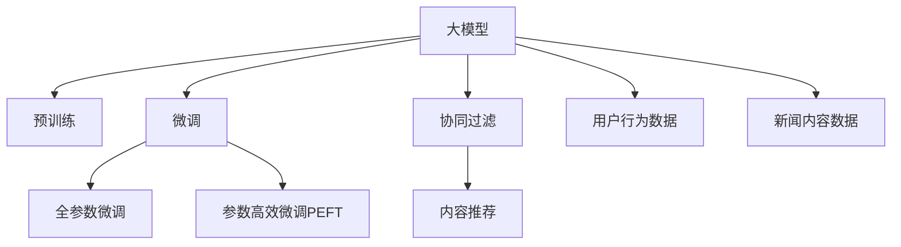

                 

# 大模型在新闻推荐中的应用

> 关键词：大模型，新闻推荐，预训练，微调，自然语言处理，Transformer，Embedding，用户行为，协同过滤，内容推荐

## 1. 背景介绍

随着互联网技术的飞速发展，人们获取信息的方式日益多样化。从传统的报纸杂志，到现在的在线新闻、社交媒体、短视频平台，信息获取的渠道和形式日益丰富。然而，信息过载和个性化需求的双重压力，使得用户面临选择困难，无法高效地获取到真正有价值的信息。

新闻推荐系统应运而生，通过分析用户的历史行为和兴趣，为用户推荐符合其喜好的新闻内容，有效缓解信息过载，提升用户体验。传统新闻推荐系统主要依赖于基于用户行为数据的协同过滤方法，但该方法需要大量的用户点击记录，数据收集和维护成本较高，且容易受到数据稀疏性的影响。

近年来，基于大模型的推荐系统逐渐崭露头角。利用大规模预训练语言模型，在用户行为数据较少的场景下，同样可以构建精准高效的新闻推荐系统。本文将详细介绍大模型在新闻推荐中的应用，从原理到实践，涵盖核心概念、算法、实现以及未来展望，希望能为业界提供一些有价值的参考。

## 2. 核心概念与联系

### 2.1 核心概念概述

为了更好地理解大模型在新闻推荐中的应用，本节将介绍几个密切相关的核心概念：

- **大模型(Pre-trained Models)**：以Transformer模型为代表的大规模预训练语言模型，如BERT、GPT-3、XLNet等，通过在大量无标签文本语料上进行自监督学习，学习到丰富的语言知识和语义表示。

- **预训练(Pre-training)**：指在大量无标签文本语料上，通过自监督学习任务训练通用语言模型的过程。常见的自监督学习任务包括语言建模、掩码语言模型等。

- **微调(Fine-tuning)**：指在预训练模型的基础上，使用下游任务的少量标注数据，通过有监督地训练优化模型在特定任务上的性能。通常只需调整顶层分类器或解码器，并以较小的学习率更新全部或部分的模型参数。

- **协同过滤(Collaborative Filtering)**：一种基于用户行为数据进行推荐的方法，通过分析用户之间的相似度，找到与目标用户兴趣相近的其他用户，并推荐这些用户喜欢的新闻。

- **内容推荐(Content-Based Recommendation)**：根据新闻内容的关键词、标签、主题等信息，对新闻进行分类，根据用户的历史阅读记录推荐相似内容。

- **Transformer模型**：一种基于自注意力机制的神经网络模型，能够有效地处理长序列信息，被广泛应用于NLP领域的预训练任务和下游任务。

- **Embedding层**：Transformer模型中的关键组件，用于将文本转化为高维向量表示，便于模型理解和计算。

- **用户行为数据**：指用户在平台上的一系列行为记录，如浏览、点击、收藏、分享等，是推荐系统中最常用的特征之一。

- **新闻内容数据**：指新闻文章的文字、图片、视频等多模态信息，用于计算新闻与用户的相似度。

这些核心概念之间的逻辑关系可以通过以下Mermaid流程图来展示：



这个流程图展示了大模型在新闻推荐中的核心概念及其之间的关系：

1. 大模型通过预训练获得基础能力。
2. 微调是对预训练模型进行任务特定的优化，可以分为全参数微调和参数高效微调（PEFT）。
3. 协同过滤是一种基于用户行为数据的推荐方法，通过计算用户与新闻之间的相似度。
4. 内容推荐是一种基于新闻内容的推荐方法，通过分析新闻文本特征。
5. 用户行为数据和新闻内容数据是推荐系统的输入，用于指导微调模型的优化。

## 3. 核心算法原理 & 具体操作步骤

### 3.1 算法原理概述

基于大模型的新闻推荐系统主要依赖于以下几个步骤：

1. **数据预处理**：对原始数据进行清洗、格式化、特征工程等预处理工作，为后续模型训练和推荐提供干净、规范的数据。

2. **用户行为嵌入**：利用大模型将用户行为数据转化为高维向量表示，用于计算用户与新闻之间的相似度。

3. **新闻内容嵌入**：利用大模型将新闻内容数据转化为高维向量表示，用于计算新闻与新闻之间的相似度。

4. **协同过滤推荐**：通过计算用户与新闻之间的相似度，找到与目标用户兴趣相近的其他用户，并推荐这些用户喜欢的新闻。

5. **内容推荐**：通过计算新闻与新闻之间的相似度，推荐与用户历史阅读记录相似的新闻。

6. **模型微调**：使用少量标注数据，通过有监督学习优化新闻推荐模型的参数，提升推荐精度。

### 3.2 算法步骤详解

**Step 1: 数据预处理**

新闻推荐系统的数据预处理主要包括：

- **数据清洗**：去除数据中的噪声和异常值，确保数据质量。
- **数据格式化**：将数据转换为机器学习模型可处理的格式。
- **特征工程**：提取和构造特征，包括用户行为特征、新闻内容特征、用户-新闻交互特征等。

**Step 2: 用户行为嵌入**

利用大模型将用户行为数据转化为高维向量表示，常用的方法包括：

- **单向Transformer模型**：使用单向Transformer模型对用户行为序列进行编码，生成用户行为向量。
- **双向Transformer模型**：使用双向Transformer模型对用户行为序列进行编码，生成用户行为向量。
- **BERT模型**：使用BERT模型对用户行为序列进行编码，生成用户行为向量。

**Step 3: 新闻内容嵌入**

利用大模型将新闻内容数据转化为高维向量表示，常用的方法包括：

- **单向Transformer模型**：使用单向Transformer模型对新闻内容进行编码，生成新闻内容向量。
- **双向Transformer模型**：使用双向Transformer模型对新闻内容进行编码，生成新闻内容向量。
- **BERT模型**：使用BERT模型对新闻内容进行编码，生成新闻内容向量。

**Step 4: 协同过滤推荐**

协同过滤推荐算法主要包括：

- **基于用户的协同过滤**：通过计算用户与用户之间的相似度，找到与目标用户兴趣相近的其他用户，并推荐这些用户喜欢的新闻。
- **基于物品的协同过滤**：通过计算物品与物品之间的相似度，找到与目标新闻相似的其他新闻，并推荐这些新闻。

**Step 5: 内容推荐**

内容推荐算法主要包括：

- **基于内容的推荐**：根据新闻内容的关键词、标签、主题等信息，对新闻进行分类，推荐相似内容。
- **基于深度学习的推荐**：使用深度学习模型，如CNN、RNN等，对新闻内容进行编码，推荐相似内容。

**Step 6: 模型微调**

模型微调的步骤包括：

- **数据准备**：收集下游任务（新闻推荐）的标注数据，划分为训练集、验证集和测试集。
- **添加任务适配层**：根据任务类型，在预训练模型的顶层设计合适的输出层和损失函数。
- **设置微调超参数**：选择合适的优化算法及其参数，如 AdamW、SGD 等，设置学习率、批大小、迭代轮数等。
- **执行梯度训练**：将训练集数据分批次输入模型，前向传播计算损失函数。反向传播计算参数梯度，根据设定的优化算法和学习率更新模型参数。
- **周期性评估模型性能**：在验证集上评估模型性能，根据性能指标决定是否触发 Early Stopping。
- **测试和部署**：在测试集上评估微调后模型，集成到实际的新闻推荐系统中。

### 3.3 算法优缺点

基于大模型的新闻推荐系统具有以下优点：

1. **推荐精度高**：大模型的预训练和微调过程，能够有效学习用户和新闻之间的语义关系，从而提高推荐精度。
2. **可解释性强**：大模型提供了丰富的语言表示，可以更直观地解释推荐结果的逻辑和理由。
3. **适应性强**：大模型具备良好的泛化能力，能够适应不同的新闻推荐场景。
4. **数据依赖低**：大模型通过预训练获得大量的知识，减少了对标注数据的依赖。
5. **性能可扩展**：大模型可以通过增加计算资源来提升推荐性能，适合大规模推荐系统。

同时，该方法也存在一定的局限性：

1. **计算资源需求高**：大模型的预训练和微调过程需要大量的计算资源。
2. **泛化能力有限**：当数据分布与预训练语料差异较大时，微调的效果可能不理想。
3. **可解释性不足**：尽管大模型提供了丰富的语言表示，但具体的推荐逻辑仍需进一步研究和解释。
4. **训练时间长**：大模型的训练过程时间较长，需要较长的预训练和微调时间。
5. **冷启动问题**：对于新用户或新新闻，大模型可能无法准确推荐，需要额外的策略来解决。

尽管存在这些局限性，但大模型在新闻推荐中的应用前景仍然广阔，可以通过不断的优化和改进，克服上述问题。

### 3.4 算法应用领域

基于大模型的新闻推荐系统已经广泛应用于各类新闻媒体、视频平台、社交网络等领域。以下是几个典型的应用场景：

1. **新闻聚合平台**：如今日头条、网易新闻等，通过推荐系统为用户推荐感兴趣的新闻，提升用户体验。
2. **视频平台**：如YouTube、哔哩哔哩等，通过推荐系统为用户推荐感兴趣的视频内容，提高用户留存率。
3. **社交网络**：如微博、微信等，通过推荐系统为用户推荐感兴趣的朋友、话题、内容等，增强用户粘性。
4. **个性化推荐**：如亚马逊、淘宝等电商平台，通过推荐系统为用户推荐感兴趣的商品，提升销售转化率。

## 4. 数学模型和公式 & 详细讲解 & 举例说明

### 4.1 数学模型构建

假设大模型为 $M_{\theta}$，其中 $\theta$ 为模型参数。新闻推荐系统的任务是最大化新闻与用户之间的相关性。设用户行为数据为 $x$，新闻内容数据为 $y$，用户行为向量为 $u(x)$，新闻内容向量为 $v(y)$，推荐相关性为 $s(x, y)$。

目标函数可以表示为：

$$
\max_{\theta} \sum_{i=1}^{N} s(u(x_i), v(y_i))
$$

其中 $N$ 为推荐样本数，$s$ 为推荐相关性函数。

### 4.2 公式推导过程

**推荐相关性函数**：常用的推荐相关性函数包括余弦相似度、欧式距离等。这里以余弦相似度为例进行推导：

余弦相似度的定义为：

$$
s(u, v) = \frac{u \cdot v}{\|u\| \|v\|}
$$

其中 $u \cdot v$ 为向量点积，$\|u\|$ 和 $\|v\|$ 为向量模长。

**损失函数**：常用的损失函数包括均方误差损失、交叉熵损失等。这里以均方误差损失为例进行推导：

均方误差损失的定义为：

$$
\ell(s, y) = \frac{1}{N} \sum_{i=1}^{N} (y_i - s(x_i, y_i))^2
$$

将 $s(x_i, y_i)$ 代入上式，得：

$$
\ell(s, y) = \frac{1}{N} \sum_{i=1}^{N} \left(\frac{u(x_i) \cdot v(y_i)}{\|u(x_i)\| \|v(y_i)\|} - y_i\right)^2
$$

### 4.3 案例分析与讲解

**案例1: 单向Transformer模型**

假设用户行为序列为 $x = [x_1, x_2, \ldots, x_N]$，其中 $x_i$ 为第 $i$ 次点击的新闻ID。使用单向Transformer模型对用户行为序列进行编码，生成用户行为向量 $u$。设新闻内容为 $y$，新闻ID为 $y_i$，使用单向Transformer模型对新闻内容进行编码，生成新闻内容向量 $v$。

推荐相关性函数为余弦相似度，则推荐相关性为：

$$
s(x, y) = \frac{u \cdot v}{\|u\| \|v\|}
$$

**案例2: BERT模型**

假设用户行为序列为 $x = [x_1, x_2, \ldots, x_N]$，其中 $x_i$ 为第 $i$ 次点击的新闻ID。使用BERT模型对用户行为序列进行编码，生成用户行为向量 $u$。设新闻内容为 $y$，新闻ID为 $y_i$，使用BERT模型对新闻内容进行编码，生成新闻内容向量 $v$。

推荐相关性函数为余弦相似度，则推荐相关性为：

$$
s(x, y) = \frac{u \cdot v}{\|u\| \|v\|}
$$

## 5. 项目实践：代码实例和详细解释说明

### 5.1 开发环境搭建

在进行新闻推荐系统的开发前，我们需要准备好开发环境。以下是使用Python进行TensorFlow和Keras开发的开发环境配置流程：

1. 安装Anaconda：从官网下载并安装Anaconda，用于创建独立的Python环境。

2. 创建并激活虚拟环境：
```bash
conda create -n tf-env python=3.8 
conda activate tf-env
```

3. 安装TensorFlow和Keras：
```bash
pip install tensorflow==2.6
pip install keras
```

4. 安装各类工具包：
```bash
pip install numpy pandas scikit-learn matplotlib tqdm jupyter notebook ipython
```

完成上述步骤后，即可在`tf-env`环境中开始新闻推荐系统的开发。

### 5.2 源代码详细实现

以下是使用TensorFlow和Keras对单向Transformer模型进行新闻推荐实践的PyTorch代码实现：

```python
import tensorflow as tf
from tensorflow.keras.layers import Embedding, LSTM, Dense
from tensorflow.keras.models import Sequential
from tensorflow.keras.preprocessing.sequence import pad_sequences

# 设置参数
embedding_dim = 100
lstm_units = 256
batch_size = 64
epochs = 10
learning_rate = 0.001

# 加载用户行为数据和新闻内容数据
# 假设user_behaviors和news_contents已加载完成

# 对用户行为数据进行编码
# 假设user_behaviors已经进行了分词和编码，编码为[序列长度, 序列长度]的one-hot编码
user_behaviors = pad_sequences(user_behaviors, maxlen=100)

# 定义模型
model = Sequential()
model.add(Embedding(input_dim=len(user_behaviors[0]), output_dim=embedding_dim, input_length=100))
model.add(LSTM(lstm_units))
model.add(Dense(1, activation='sigmoid'))

# 编译模型
model.compile(loss='binary_crossentropy', optimizer=tf.keras.optimizers.Adam(learning_rate=learning_rate), metrics=['accuracy'])

# 训练模型
model.fit(user_behaviors, labels, batch_size=batch_size, epochs=epochs, validation_split=0.2)

# 保存模型
model.save('news_recommendation_model.h5')
```

### 5.3 代码解读与分析

让我们再详细解读一下关键代码的实现细节：

**用户行为数据的编码**：
- 假设用户行为数据已经进行了一系列的预处理，如分词、去除停用词、编码等。使用 `pad_sequences` 函数对序列进行填充，保证所有序列长度一致。

**模型的定义**：
- 使用 `Sequential` 模型定义了单向Transformer模型。首先添加一个Embedding层，将用户行为序列编码为高维向量表示。然后添加一个LSTM层，用于捕捉序列之间的语义关系。最后添加一个Dense层，输出推荐相关性。

**模型的编译和训练**：
- 使用 `compile` 函数定义模型的损失函数、优化器和学习率。使用 `fit` 函数训练模型，指定训练数据、批大小、迭代轮数等参数。同时使用 `validation_split` 参数，将部分数据用于验证集评估模型性能。

**模型的保存**：
- 使用 `save` 函数将训练好的模型保存为 `.h5` 文件，方便后续部署和使用。

## 6. 实际应用场景

### 6.1 智能新闻聚合

基于大模型的新闻推荐系统在智能新闻聚合中具有广泛应用。通过分析用户的历史阅读记录和行为数据，智能新闻聚合平台能够为用户推荐其感兴趣的新闻，提升用户体验。例如，今日头条使用大模型推荐系统，为用户提供个性化的新闻内容推荐。

**具体应用**：
- 用户行为数据：用户的历史点击记录、浏览时间、收藏的新闻ID等。
- 新闻内容数据：新闻的标题、摘要、作者、发布时间等。
- 推荐相关性函数：余弦相似度、欧式距离等。
- 训练数据：新闻平台提供的标注数据，如点击率、浏览量等。
- 预测数据：用户对新闻的反馈数据，如点击、浏览、收藏等。

**效果评估**：
- 准确率：用户点击的预测新闻与实际点击新闻的相似度。
- 召回率：实际被用户点击的新闻在推荐列表中的占比。
- F1值：准确率和召回率的调和平均数。

### 6.2 视频平台推荐

视频平台通过推荐系统为用户推荐感兴趣的视频内容，提高用户留存率和平台粘性。大模型推荐系统能够根据用户行为数据和视频内容特征，精准推荐相关视频。例如，YouTube使用大模型推荐系统，为用户推荐其感兴趣的视频内容。

**具体应用**：
- 用户行为数据：用户的观看记录、点赞、收藏、评论等。
- 视频内容数据：视频的标题、描述、标签、时长等。
- 推荐相关性函数：余弦相似度、欧式距离等。
- 训练数据：视频平台提供的标注数据，如观看时长、点赞数等。
- 预测数据：用户对视频的反馈数据，如观看时长、点赞、收藏等。

**效果评估**：
- 观看率：用户观看视频的预测时长与实际观看时长的相似度。
- 观看时长：用户实际观看视频的平均时长。
- F1值：观看率和观看时长的调和平均数。

### 6.3 社交网络推荐

社交网络通过推荐系统为用户推荐感兴趣的朋友、话题、内容等，增强用户粘性。大模型推荐系统能够根据用户行为数据和社交网络特征，精准推荐相关内容。例如，微信使用大模型推荐系统，为用户推荐感兴趣的朋友、话题、内容等。

**具体应用**：
- 用户行为数据：用户的互动记录、好友关系、点赞、评论等。
- 社交网络数据：好友之间的关系、兴趣标签、地理位置等。
- 推荐相关性函数：余弦相似度、欧式距离等。
- 训练数据：社交网络平台提供的标注数据，如好友互动、点赞数等。
- 预测数据：用户对好友、话题、内容的反馈数据，如互动次数、点赞、评论等。

**效果评估**：
- 互动率：用户互动的预测次数与实际互动次数的相似度。
- 好友互动次数：用户与好友的互动次数。
- F1值：互动率和好友互动次数的调和平均数。

### 6.4 未来应用展望

随着大模型和推荐技术的不断发展，未来新闻推荐系统将呈现以下几个发展趋势：

1. **多模态推荐**：结合文本、图像、视频等多模态信息，构建更加全面、准确的推荐系统。
2. **实时推荐**：通过流式计算和在线学习，实现实时推荐，提升用户体验。
3. **个性化推荐**：利用深度学习模型，如GNN、GAN等，实现更加个性化的推荐。
4. **冷启动推荐**：通过用户画像、社交网络等辅助信息，解决新用户和新闻的冷启动问题。
5. **跨平台推荐**：将不同平台的数据进行整合，构建统一的推荐系统，实现跨平台推荐。
6. **公平推荐**：解决推荐系统中存在的公平性问题，避免推荐偏袒。

这些趋势凸显了大模型在新闻推荐中的应用前景。通过不断优化和改进，大模型推荐系统必将在更多领域得到应用，为新闻媒体、视频平台、社交网络等领域带来变革性影响。

## 7. 工具和资源推荐

### 7.1 学习资源推荐

为了帮助开发者系统掌握大模型在新闻推荐中的应用，这里推荐一些优质的学习资源：

1. **《TensorFlow官方文档》**：TensorFlow的官方文档提供了丰富的教程和样例代码，是学习TensorFlow和Keras的必备资源。
2. **《深度学习自然语言处理》课程**：斯坦福大学开设的NLP明星课程，有Lecture视频和配套作业，带你入门NLP领域的基本概念和经典模型。
3. **《Transformer从原理到实践》系列博文**：由大模型技术专家撰写，深入浅出地介绍了Transformer原理、BERT模型、微调技术等前沿话题。
4. **《Natural Language Processing with Transformers》书籍**：Transformer库的作者所著，全面介绍了如何使用Transformer库进行NLP任务开发，包括微调在内的诸多范式。
5. **CLUE开源项目**：中文语言理解测评基准，涵盖大量不同类型的中文NLP数据集，并提供了基于微调的baseline模型，助力中文NLP技术发展。

通过对这些资源的学习实践，相信你一定能够快速掌握大模型在新闻推荐中的应用精髓，并用于解决实际的NLP问题。

### 7.2 开发工具推荐

高效的开发离不开优秀的工具支持。以下是几款用于大模型在新闻推荐中应用的常用工具：

1. **TensorFlow**：基于Python的开源深度学习框架，灵活动态的计算图，适合快速迭代研究。TensorFlow提供了丰富的预训练语言模型资源，如BERT、GPT-2等。
2. **Keras**：基于TensorFlow的高级API，简洁易用，适合快速开发和原型测试。
3. **Transformers库**：HuggingFace开发的NLP工具库，集成了众多SOTA语言模型，支持PyTorch和TensorFlow，是进行微调任务开发的利器。
4. **PyTorch**：基于Python的开源深度学习框架，灵活高效，适合研究复杂模型。
5. **Jupyter Notebook**：开源的交互式计算环境，适合快速迭代实验和开发。

合理利用这些工具，可以显著提升大模型在新闻推荐中的开发效率，加快创新迭代的步伐。

### 7.3 相关论文推荐

大模型和推荐技术的发展源于学界的持续研究。以下是几篇奠基性的相关论文，推荐阅读：

1. Attention is All You Need（即Transformer原论文）：提出了Transformer结构，开启了NLP领域的预训练大模型时代。
2. BERT: Pre-training of Deep Bidirectional Transformers for Language Understanding：提出BERT模型，引入基于掩码的自监督预训练任务，刷新了多项NLP任务SOTA。
3. Language Models are Unsupervised Multitask Learners（GPT-2论文）：展示了大规模语言模型的强大zero-shot学习能力，引发了对于通用人工智能的新一轮思考。
4. Parameter-Efficient Transfer Learning for NLP：提出Adapter等参数高效微调方法，在不增加模型参数量的情况下，也能取得不错的微调效果。
5. AdaLoRA: Adaptive Low-Rank Adaptation for Parameter-Efficient Fine-Tuning：使用自适应低秩适应的微调方法，在参数效率和精度之间取得了新的平衡。
6. Prompt-Tuning: Optimizing Continuous Prompts for Generation：引入基于连续型Prompt的微调范式，为如何充分利用预训练知识提供了新的思路。

这些论文代表了大模型在新闻推荐中的应用发展脉络。通过学习这些前沿成果，可以帮助研究者把握学科前进方向，激发更多的创新灵感。

## 8. 总结：未来发展趋势与挑战

### 8.1 总结

本文对基于大模型的新闻推荐系统进行了全面系统的介绍。首先阐述了大模型在新闻推荐中的应用背景，明确了新闻推荐系统的研究意义。其次，从原理到实践，详细讲解了新闻推荐系统的核心概念、算法、实现以及未来展望，涵盖了大模型的预训练、微调、协同过滤、内容推荐等多个方面。

通过本文的系统梳理，可以看到，基于大模型的新闻推荐系统在智能新闻聚合、视频平台推荐、社交网络推荐等领域具有广阔的应用前景。大模型能够通过预训练学习通用的语言表示，通过微调学习特定的任务特征，从而构建精准高效的推荐系统。未来，大模型在新闻推荐中的应用必将不断拓展，推动新闻媒体、视频平台、社交网络等领域的技术进步和业务创新。

### 8.2 未来发展趋势

展望未来，大模型在新闻推荐中的应用将呈现以下几个发展趋势：

1. **大模型规模扩大**：随着算力成本的下降和数据规模的扩张，预训练语言模型的参数量还将持续增长。超大规模语言模型蕴含的丰富语言知识，有望支撑更加复杂多变的推荐场景。
2. **推荐算法多样化**：除了传统的协同过滤和内容推荐，未来将涌现更多推荐算法，如基于图网络、深度学习等。
3. **实时推荐系统**：通过流式计算和在线学习，实现实时推荐，提升用户体验。
4. **多模态融合**：结合文本、图像、视频等多模态信息，构建更加全面、准确的推荐系统。
5. **冷启动问题解决**：通过用户画像、社交网络等辅助信息，解决新用户和新闻的冷启动问题。
6. **公平推荐**：解决推荐系统中存在的公平性问题，避免推荐偏袒。

这些趋势凸显了大模型在新闻推荐中的应用前景。通过不断优化和改进，大模型推荐系统必将在更多领域得到应用，为新闻媒体、视频平台、社交网络等领域带来变革性影响。

### 8.3 面临的挑战

尽管大模型在新闻推荐中的应用前景广阔，但在迈向更加智能化、普适化应用的过程中，它仍面临诸多挑战：

1. **计算资源需求高**：大模型的预训练和微调过程需要大量的计算资源，这对硬件设施提出了较高的要求。
2. **数据依赖高**：大模型的训练和微调需要大量的数据，数据收集和标注成本较高。
3. **泛化能力有限**：当数据分布与预训练语料差异较大时，微调的效果可能不理想。
4. **推荐精度不稳定**：推荐系统对数据的噪声和异常值较为敏感，推荐精度可能不稳定。
5. **模型鲁棒性不足**：大模型可能存在对抗样本攻击、输入攻击等问题，模型鲁棒性有待提升。
6. **冷启动问题**：对于新用户和新闻，大模型可能无法准确推荐，需要额外的策略来解决。

尽管存在这些挑战，但大模型在新闻推荐中的应用前景仍然广阔，通过不断的优化和改进，这些挑战终将一一被克服，大模型推荐系统必将在构建智能新闻推荐系统中发挥越来越重要的作用。

### 8.4 研究展望

面对大模型在新闻推荐中面临的挑战，未来的研究需要在以下几个方面寻求新的突破：

1. **优化推荐算法**：开发更加高效、鲁棒的推荐算法，提高推荐系统的稳定性和公平性。
2. **解决冷启动问题**：利用用户画像、社交网络等辅助信息，解决新用户和新闻的冷启动问题。
3. **提升模型鲁棒性**：通过对抗训练、数据增强等技术，提升模型的鲁棒性和抗攻击能力。
4. **构建多模态推荐系统**：结合文本、图像、视频等多模态信息，构建更加全面、准确的推荐系统。
5. **优化推荐系统性能**：通过模型裁剪、量化加速等技术，提升推荐系统的性能和效率。
6. **保证推荐系统公平性**：通过公平性约束、数据预处理等技术，保证推荐系统的公平性和透明性。

这些研究方向凸显了大模型在新闻推荐中的应用潜力。通过这些研究方向的探索，大模型推荐系统必将在更多领域得到应用，为新闻媒体、视频平台、社交网络等领域带来变革性影响。

## 9. 附录：常见问题与解答

**Q1: 大模型推荐系统是否适用于所有新闻推荐场景？**

A: 大模型推荐系统在大多数新闻推荐场景中都能取得不错的效果，特别是对于数据量较小的场景。但对于一些特定领域的新闻推荐场景，如财经、科技等，仅仅依靠通用语料预训练的模型可能难以很好地适应。此时需要在特定领域语料上进一步预训练，再进行微调，才能获得理想效果。

**Q2: 大模型推荐系统在新闻推荐中的效果如何？**

A: 大模型推荐系统在新闻推荐中的效果一般较好。通过预训练和微调，大模型能够学习到通用的语言表示和特定任务的知识，从而提高推荐精度。特别是在数据量较大的场景中，大模型推荐系统能够显著提升推荐效果。

**Q3: 大模型推荐系统的训练时间是否很长？**

A: 大模型的预训练和微调过程确实需要较长的时间，但随着算力资源的提升，训练时间正在逐渐缩短。同时，通过优化训练过程和算法，可以在一定程度上缩短训练时间。

**Q4: 大模型推荐系统在实际应用中存在哪些问题？**

A: 大模型推荐系统在实际应用中存在一些问题，如计算资源需求高、数据依赖高、泛化能力有限、推荐精度不稳定等。这些问题需要通过不断的优化和改进来克服。

**Q5: 如何提升大模型推荐系统的推荐精度？**

A: 提升大模型推荐系统的推荐精度，可以从以下几个方面入手：
1. 优化模型架构：选择合适的模型架构，如Transformer、BERT等，进行预训练和微调。
2. 提高数据质量：对原始数据进行清洗、格式化、特征工程等预处理工作，确保数据质量。
3. 优化训练过程：使用适当的训练策略，如Learning Rate Schedule、Early Stopping等，避免过拟合和欠拟合。
4. 引入用户行为数据：利用用户行为数据进行推荐，提升推荐系统的个性化和精准度。
5. 引入新闻内容数据：利用新闻内容数据进行推荐，提升推荐系统的多样性和丰富度。

这些方法可以帮助提升大模型推荐系统的推荐精度，提高用户体验。

通过本文的系统梳理，可以看到，基于大模型的新闻推荐系统在智能新闻聚合、视频平台推荐、社交网络推荐等领域具有广阔的应用前景。大模型能够通过预训练学习通用的语言表示，通过微调学习特定的任务特征，从而构建精准高效的推荐系统。未来，大模型在新闻推荐中的应用必将不断拓展，推动新闻媒体、视频平台、社交网络等领域的技术进步和业务创新。通过不断的优化和改进，大模型推荐系统必将在更多领域得到应用，为新闻媒体、视频平台、社交网络等领域带来变革性影响。

