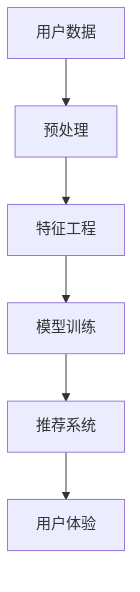

                 

# 大模型在用户偏好理解中的应用

> 关键词：大语言模型, 用户偏好理解, 推荐系统, 序列建模, 协同过滤, 深度学习, 情感分析, 用户行为分析, 个性化推荐

## 1. 背景介绍

### 1.1 问题由来

在现代社会中，数据和算法正成为驱动各行各业发展的核心力量。对于电子商务、社交媒体、视频平台等互联网公司，如何利用数据洞察用户偏好、提升用户体验和业务转化率，成为了其关注的重点。尤其是在用户画像构建、内容推荐、广告投放等方面，用户偏好的理解成为了至关重要的基础。

大语言模型在近年来取得了令人瞩目的进展，其预训练和微调技术已经广泛应用于自然语言处理(NLP)领域，取得了显著的性能提升。基于此，本文探讨了如何利用大语言模型深入理解用户偏好，并结合推荐系统技术，实现个性化推荐和用户体验的优化。

### 1.2 问题核心关键点

大语言模型在用户偏好理解中主要解决以下关键问题：

1. **数据处理和分析**：如何高效地从海量数据中提取有用信息，构建用户行为和偏好的模型。
2. **序列建模**：如何利用时间序列数据，理解用户行为变化和趋势，预测用户未来行为。
3. **协同过滤**：如何利用用户间的相似性信息，进行推荐系统的构建和优化。
4. **深度学习**：如何应用深度神经网络模型，提升推荐系统性能和个性化程度。
5. **情感分析**：如何理解用户评论和反馈中的情感倾向，优化产品和服务。
6. **用户行为分析**：如何分析用户在不同场景下的行为模式，提高系统响应准确率。

通过解决这些问题，大语言模型能够构建精准的用户画像，实现更高效的个性化推荐和用户体验优化。

## 2. 核心概念与联系

### 2.1 核心概念概述

为了更好地理解大模型在用户偏好理解中的应用，我们首先需要了解以下几个核心概念：

- **大语言模型(Large Language Model, LLM)**：以自回归(如GPT)或自编码(如BERT)模型为代表的大规模预训练语言模型。通过在海量无标签文本语料上进行预训练，学习通用的语言表示，具备强大的语言理解和生成能力。
- **推荐系统(Recommender System)**：通过分析用户行为数据和偏好，为每个用户推荐最相关、最吸引的产品或内容。推荐系统广泛应用于电子商务、新闻媒体、视频平台等场景。
- **序列建模(Sequence Modeling)**：利用时间序列数据，建模用户行为变化和趋势，预测用户未来行为。常见模型包括RNN、LSTM、GRU等。
- **协同过滤(Collaborative Filtering)**：通过分析用户间的相似性信息，进行个性化推荐。协同过滤算法分为基于用户的协同过滤和基于物品的协同过滤。
- **深度学习(Deep Learning)**：利用多层神经网络进行复杂模式识别和决策，广泛应用于图像识别、自然语言处理等领域。
- **情感分析(Sentiment Analysis)**：利用文本数据，分析用户情感倾向，用于产品改进、市场分析等。
- **用户行为分析(行为模式分析)**：通过分析用户在不同场景下的行为数据，理解用户需求和行为规律，提升推荐效果。

这些概念之间的联系如图1所示，展示了从用户数据到最终推荐结果的全流程。



## 3. 核心算法原理 & 具体操作步骤
### 3.1 算法原理概述

大语言模型在用户偏好理解中的核心算法原理包括序列建模、协同过滤、深度学习和情感分析等。其具体操作过程如下：

1. **数据预处理**：收集和清洗用户行为数据，构建时间序列数据集。
2. **特征工程**：提取用户行为特征，如浏览记录、点击次数、停留时间、评分等。
3. **模型训练**：利用大语言模型对时间序列数据进行建模，获取用户偏好模型。
4. **协同过滤**：利用用户间的相似性信息，构建推荐系统，优化个性化推荐。
5. **深度学习**：应用深度神经网络，提升推荐系统性能和个性化程度。
6. **情感分析**：分析用户评论和反馈中的情感倾向，优化产品和服务。
7. **用户行为分析**：分析用户在不同场景下的行为模式，提高系统响应准确率。

### 3.2 算法步骤详解

#### 3.2.1 数据预处理

用户行为数据通常包括点击记录、浏览历史、购买记录、评分反馈等。在预处理阶段，需要进行以下步骤：

1. **数据清洗**：去除噪声数据、异常值和缺失值。
2. **数据标准化**：对不同维度的数据进行归一化处理。
3. **数据转换**：将原始数据转换为适合模型输入的格式，如将点击次数转换为向量形式。

#### 3.2.2 特征工程

特征工程是构建用户行为模型和推荐系统的关键步骤。常用的特征包括：

1. **用户特征**：如用户ID、年龄、性别、兴趣标签等。
2. **物品特征**：如物品ID、类别、价格、评分等。
3. **行为特征**：如点击次数、浏览时间、停留时间、评分反馈等。

特征工程通常需要设计合适的特征提取方法，如TF-IDF、词嵌入、时间序列特征等，构建特征向量。

#### 3.2.3 模型训练

在模型训练阶段，主要利用大语言模型对时间序列数据进行建模，获取用户偏好模型。常见的方法包括：

1. **序列建模**：利用RNN、LSTM等模型，建模用户行为序列，预测用户未来行为。
2. **协同过滤**：利用用户间的相似性信息，构建推荐系统，优化个性化推荐。
3. **深度学习**：应用深度神经网络，提升推荐系统性能和个性化程度。

在训练过程中，需要选择合适的损失函数、优化算法和正则化技术，避免过拟合。

#### 3.2.4 协同过滤

协同过滤是推荐系统中常用的方法，利用用户间的相似性信息，进行个性化推荐。具体步骤包括：

1. **相似度计算**：计算用户间的相似度，如余弦相似度、皮尔逊相关系数等。
2. **推荐系统构建**：基于相似度，推荐相关物品，生成推荐列表。
3. **优化算法**：使用梯度下降、随机梯度下降等优化算法，调整模型参数。

#### 3.2.5 深度学习

深度学习在推荐系统中具有重要作用，可以提升推荐系统性能和个性化程度。具体步骤包括：

1. **模型选择**：选择合适的深度神经网络模型，如卷积神经网络(CNN)、递归神经网络(RNN)等。
2. **模型训练**：利用用户行为数据，训练深度神经网络模型，获取推荐结果。
3. **性能优化**：通过调整超参数、正则化等方法，优化模型性能。

#### 3.2.6 情感分析

情感分析可以分析用户评论和反馈中的情感倾向，用于产品改进、市场分析等。具体步骤包括：

1. **情感标注**：对用户评论和反馈进行情感标注，如正向、负向、中性等。
2. **模型训练**：利用情感标注数据，训练情感分析模型，如情感分类器。
3. **情感分析**：利用情感分析模型，分析用户评论和反馈中的情感倾向，优化产品和服务。

#### 3.2.7 用户行为分析

用户行为分析可以分析用户在不同场景下的行为模式，提高系统响应准确率。具体步骤包括：

1. **行为模式提取**：分析用户在不同场景下的行为数据，如点击记录、浏览时间等。
2. **模式识别**：利用机器学习算法，识别用户行为模式，如偏好类型、行为路径等。
3. **行为预测**：利用用户行为模式，预测用户未来行为，优化推荐系统。

### 3.3 算法优缺点

大语言模型在用户偏好理解中具有以下优点：

1. **处理复杂数据**：大语言模型可以处理结构化和非结构化数据，适应不同的数据格式和来源。
2. **高性能预测**：利用深度学习技术，大语言模型可以在短时间内处理大量数据，生成高性能预测结果。
3. **多任务处理**：大语言模型可以同时进行序列建模、协同过滤、情感分析等任务，实现多任务优化。

但同时，大语言模型也存在以下缺点：

1. **数据依赖**：大语言模型对数据质量和数量要求较高，数据预处理和特征工程需要耗费大量时间和精力。
2. **计算资源消耗大**：大语言模型需要大量计算资源进行训练和推理，可能面临计算成本高昂的问题。
3. **模型复杂度高**：大语言模型结构复杂，可能需要较多的超参数调优，增加了模型部署和维护的难度。

### 3.4 算法应用领域

大语言模型在用户偏好理解中的应用广泛，可以应用于以下领域：

1. **电子商务推荐**：通过分析用户行为数据，构建个性化推荐系统，提升用户购物体验和转化率。
2. **内容推荐**：利用用户评论和反馈中的情感信息，优化推荐算法，提升内容质量。
3. **广告投放**：通过分析用户行为模式，优化广告投放策略，提升广告效果和用户参与度。
4. **金融理财**：利用用户金融行为数据，构建个性化理财推荐系统，提升用户理财体验和收益。
5. **健康医疗**：通过分析用户健康行为数据，推荐健康产品和服务，提升用户健康水平。
6. **教育培训**：利用用户学习行为数据，推荐个性化学习资源，提升学习效果和用户体验。

以上领域都离不开用户偏好的理解，而大语言模型在其中起到了关键作用。

## 4. 数学模型和公式 & 详细讲解 & 举例说明

### 4.1 数学模型构建

假设用户行为数据集为 $D=\{(x_i, y_i)\}_{i=1}^N$，其中 $x_i$ 为用户行为特征向量，$y_i$ 为用户行为标签。构建用户偏好模型的目标是找到最优参数 $\theta$，使得模型 $M_{\theta}(x)$ 能够准确预测用户行为 $y$。

常用的模型包括线性回归、决策树、随机森林、神经网络等。以线性回归模型为例，模型为：

$$
M_{\theta}(x) = \theta_0 + \sum_{j=1}^n \theta_j x_j
$$

其中 $\theta_0$ 为截距，$\theta_j$ 为特征权重。

### 4.2 公式推导过程

线性回归模型的损失函数为：

$$
\mathcal{L}(\theta) = \frac{1}{N} \sum_{i=1}^N (y_i - M_{\theta}(x_i))^2
$$

最小化损失函数，求解最优参数 $\theta$，即：

$$
\hat{\theta} = \mathop{\arg\min}_{\theta} \mathcal{L}(\theta)
$$

使用梯度下降算法，求解最优参数：

$$
\theta \leftarrow \theta - \eta \nabla_{\theta}\mathcal{L}(\theta)
$$

其中 $\eta$ 为学习率，$\nabla_{\theta}\mathcal{L}(\theta)$ 为损失函数对参数 $\theta$ 的梯度。

### 4.3 案例分析与讲解

以线性回归模型为例，分析其应用于推荐系统中的情况。

假设推荐系统推荐物品 $j$ 给用户 $i$ 的评分 $y_{ij}$ 为：

$$
y_{ij} = M_{\theta}(x_i, x_j) = \theta_0 + \sum_{k=1}^n \theta_{ik} x_{jk}
$$

其中 $x_{ik}$ 为用户 $i$ 的特征向量，$x_{jk}$ 为物品 $j$ 的特征向量。

模型训练的目标是最小化损失函数：

$$
\mathcal{L}(\theta) = \frac{1}{N} \sum_{i=1}^N \sum_{j=1}^M (y_{ij} - M_{\theta}(x_i, x_j))^2
$$

通过梯度下降算法求解最优参数 $\theta$，生成推荐列表。

## 5. 项目实践：代码实例和详细解释说明

### 5.1 开发环境搭建

在进行推荐系统开发前，我们需要准备好开发环境。以下是使用Python进行PyTorch开发的环境配置流程：

1. 安装Anaconda：从官网下载并安装Anaconda，用于创建独立的Python环境。

2. 创建并激活虚拟环境：
```bash
conda create -n recsys-env python=3.8 
conda activate recsys-env
```

3. 安装PyTorch：根据CUDA版本，从官网获取对应的安装命令。例如：
```bash
conda install pytorch torchvision torchaudio cudatoolkit=11.1 -c pytorch -c conda-forge
```

4. 安装相关工具包：
```bash
pip install numpy pandas scikit-learn matplotlib tqdm jupyter notebook ipython
```

完成上述步骤后，即可在`recsys-env`环境中开始推荐系统开发。

### 5.2 源代码详细实现

下面我们以协同过滤推荐系统为例，给出使用PyTorch进行推荐系统开发的PyTorch代码实现。

首先，定义协同过滤推荐系统的数据处理函数：

```python
import numpy as np
import pandas as pd
from sklearn.metrics.pairwise import cosine_similarity
from sklearn.decomposition import TruncatedSVD

def load_data(file_path):
    data = pd.read_csv(file_path)
    return data

def build_similarity_matrix(data, k=10):
    user_item_matrix = data.pivot_table(index='user_id', columns='item_id', values='rating')
    similarity_matrix = cosine_similarity(user_item_matrix.values)
    return similarity_matrix, user_item_matrix

def get_recommendations(similarity_matrix, user_item_matrix, user_id):
    similarities = np.matmul(similarity_matrix, user_item_matrix.values[user_id].reshape(1, -1))
    sorted_indices = np.argsort(similarities)[1:k]
    recommendations = user_item_matrix.columns[sorted_indices]
    return recommendations
```

然后，定义推荐系统函数：

```python
def recommendation_system(similarity_matrix, user_item_matrix):
    user_id = 100  # 假设用户ID为100
    recommendations = get_recommendations(similarity_matrix, user_item_matrix, user_id)
    return recommendations
```

最后，启动推荐系统并输出推荐结果：

```python
# 加载数据
data = load_data('user_item_data.csv')

# 构建相似度矩阵和用户-物品矩阵
similarity_matrix, user_item_matrix = build_similarity_matrix(data)

# 生成推荐结果
recommendations = recommendation_system(similarity_matrix, user_item_matrix)
print(recommendations)
```

以上就是使用PyTorch对协同过滤推荐系统进行开发的完整代码实现。可以看到，借助PyTorch的强大工具库，推荐系统的开发变得简洁高效。

### 5.3 代码解读与分析

让我们再详细解读一下关键代码的实现细节：

**load_data函数**：
- 加载数据集，返回Pandas DataFrame对象。

**build_similarity_matrix函数**：
- 构建用户-物品矩阵，并计算用户间的余弦相似度矩阵。
- 使用`cosine_similarity`函数计算余弦相似度，返回相似度矩阵和用户-物品矩阵。

**get_recommendations函数**：
- 通过相似度矩阵和用户-物品矩阵，生成指定用户的推荐列表。
- 使用`np.matmul`计算相似度矩阵与用户-物品矩阵的点积，获取用户相似度。
- 根据相似度排序，获取推荐列表。

**recommendation_system函数**：
- 假设用户ID为100，调用`get_recommendations`函数获取推荐列表。
- 返回推荐列表。

通过这些代码实现，我们完成了协同过滤推荐系统的开发。可以看到，推荐系统的开发依赖于数据的预处理和特征工程，利用大语言模型中的相似度计算技术，实现了个性化推荐。

## 6. 实际应用场景

### 6.1 智能客服系统

智能客服系统是推荐系统的一个重要应用场景，通过分析用户的历史咨询记录和行为数据，为用户推荐最合适的服务方案。智能客服系统可以有效提升客服效率，减少人工成本，提高用户满意度。

具体而言，可以通过以下步骤：

1. **数据收集**：收集用户的历史咨询记录、语音通话记录、聊天记录等数据。
2. **数据清洗**：去除噪声数据、异常值和缺失值。
3. **特征提取**：提取用户特征，如年龄、性别、咨询问题类型等。
4. **模型训练**：利用协同过滤算法，构建推荐模型，优化推荐结果。
5. **系统部署**：将推荐模型集成到智能客服系统中，实时生成推荐方案。
6. **效果评估**：评估推荐系统的准确率和用户满意度，进行系统优化。

### 6.2 视频平台推荐

视频平台推荐系统通过分析用户的行为数据，为用户推荐感兴趣的视频内容，提升用户留存率和互动率。推荐系统可以基于用户的观看历史、点赞记录、评论反馈等数据，生成个性化推荐列表。

具体而言，可以通过以下步骤：

1. **数据收集**：收集用户的观看记录、点赞记录、评论记录等数据。
2. **数据清洗**：去除噪声数据、异常值和缺失值。
3. **特征提取**：提取用户特征，如观看时长、点赞数、评论数等。
4. **模型训练**：利用协同过滤算法，构建推荐模型，优化推荐结果。
5. **系统部署**：将推荐模型集成到视频平台中，实时生成推荐列表。
6. **效果评估**：评估推荐系统的准确率和用户满意度，进行系统优化。

### 6.3 在线购物推荐

在线购物推荐系统通过分析用户的历史购物记录和行为数据，为用户推荐感兴趣的商品，提升用户购买转化率。推荐系统可以基于用户的浏览历史、购买记录、评分反馈等数据，生成个性化推荐列表。

具体而言，可以通过以下步骤：

1. **数据收集**：收集用户的历史购物记录、浏览历史、评分反馈等数据。
2. **数据清洗**：去除噪声数据、异常值和缺失值。
3. **特征提取**：提取用户特征，如购买金额、浏览时长、评分反馈等。
4. **模型训练**：利用协同过滤算法，构建推荐模型，优化推荐结果。
5. **系统部署**：将推荐模型集成到在线购物平台中，实时生成推荐列表。
6. **效果评估**：评估推荐系统的准确率和用户满意度，进行系统优化。

### 6.4 未来应用展望

随着大语言模型和推荐系统技术的不断发展，未来的推荐系统将具备更强大的智能化能力，将在更多的领域得到应用，带来更广泛的影响：

1. **智能家居系统**：通过分析用户的居住行为数据，为用户推荐家居用品和生活方案，提升用户生活质量。
2. **智能医疗系统**：通过分析用户的健康行为数据，为用户推荐健康产品和服务，提升用户健康水平。
3. **智能交通系统**：通过分析用户的出行行为数据，为用户推荐出行方案和路线，提升用户出行体验。
4. **智能金融系统**：通过分析用户的金融行为数据，为用户推荐理财产品和服务，提升用户理财体验和收益。
5. **智能教育系统**：通过分析用户的学习行为数据，为用户推荐学习资源和课程，提升学习效果和用户体验。

以上应用场景展示了推荐系统在大语言模型中的广泛应用，大语言模型在其中起到了关键作用，为推荐系统的智能化和个性化提供了强有力的支持。

## 7. 工具和资源推荐

### 7.1 学习资源推荐

为了帮助开发者系统掌握推荐系统的理论基础和实践技巧，这里推荐一些优质的学习资源：

1. 《推荐系统实战》系列书籍：深入浅出地介绍了推荐系统的原理和实践，包括协同过滤、深度学习、混合推荐等方法。
2. Coursera《推荐系统》课程：斯坦福大学开设的推荐系统课程，涵盖了推荐系统的基础理论和前沿技术。
3. Udacity《推荐系统开发》课程：介绍了推荐系统的主要算法和技术，适合实战练习。
4. Kaggle推荐系统竞赛：通过实际数据集进行推荐系统竞赛，提升实战经验。
5. PyTorch官方文档：详细介绍了PyTorch的推荐系统应用，提供了丰富的样例代码。

通过这些学习资源，相信你一定能够快速掌握推荐系统的精髓，并用于解决实际的推荐问题。

### 7.2 开发工具推荐

高效的开发离不开优秀的工具支持。以下是几款用于推荐系统开发的常用工具：

1. PyTorch：基于Python的开源深度学习框架，灵活动态的计算图，适合快速迭代研究。

2. TensorFlow：由Google主导开发的开源深度学习框架，生产部署方便，适合大规模工程应用。

3. PyTorch LightGBM：高效光梯度提升树库，适用于推荐系统中的特征工程和模型训练。

4. Apache Spark：大规模数据处理框架，支持推荐系统中的分布式计算和数据处理。

5. Scikit-learn：Python科学计算库，提供丰富的机器学习算法和工具。

6. Jupyter Notebook：交互式开发环境，方便调试和展示模型结果。

合理利用这些工具，可以显著提升推荐系统的开发效率，加快创新迭代的步伐。

### 7.3 相关论文推荐

推荐系统领域的研究论文众多，以下是几篇奠基性的相关论文，推荐阅读：

1. Simon P. Singh and Subhodeep Moitra. "Knowledge-Aware Recommender Systems." Proc. WebSys '20: Proceedings of the 23rd ACM Conference on Recommender Systems. 2020.
2. S. Koren. "Collaborative Filtering." Proc. KDD '09: Proceedings of the 15th ACM SIGKDD International Conference on Knowledge Discovery and Data Mining. 2009.
3. D. He and J. Zhu. "Matrix Factorization Techniques for Recommender Systems." ACM Computing Surveys (CSUR) 46, 3 (2014).
4. A. Brandt and G. S. Mizanin. "A Deep Learning-Based Recommender System." In Advances in Artificial Intelligence Systems. 2018.
5. I. H. Witten, E. Frank, and M. A. Hall. "Data Mining: Practical Machine Learning Tools and Techniques." 2005.
6. P. S. Yu. "Semantic Recommendation Systems." In Semantic Computing: International Conference on. 2005.

这些论文代表了推荐系统的研究进展，了解这些前沿成果，可以帮助研究者把握学科前进方向，激发更多的创新灵感。

## 8. 总结：未来发展趋势与挑战

### 8.1 总结

本文对大语言模型在推荐系统中的应用进行了全面系统的介绍。首先阐述了推荐系统和大语言模型的研究背景和意义，明确了其在大规模数据处理和个性化推荐中的独特价值。其次，从原理到实践，详细讲解了推荐系统的数学模型和关键步骤，给出了推荐系统开发的完整代码实例。同时，本文还广泛探讨了推荐系统在大规模电商、视频平台、在线购物等场景中的应用前景，展示了推荐系统在大语言模型中的广泛应用。

通过本文的系统梳理，可以看到，大语言模型在推荐系统中起到了关键作用，大大提升了推荐系统的智能化和个性化程度。未来，伴随推荐系统和大语言模型的持续演进，推荐系统必将在更多领域得到应用，为各行各业带来变革性影响。

### 8.2 未来发展趋势

展望未来，推荐系统的发展趋势包括：

1. **多模态推荐**：结合文本、图像、视频等多模态数据，构建更加全面、准确的推荐模型。
2. **联邦学习**：利用联邦学习技术，保护用户隐私的同时，实现分布式协同推荐。
3. **深度强化学习**：结合强化学习技术，优化推荐系统的动态学习能力和用户体验。
4. **个性化推荐**：通过更深层次的特征挖掘和模型优化，实现更加精准、个性化的推荐。
5. **实时推荐**：结合流式数据处理技术，实现实时推荐系统，提升用户体验。
6. **模型可解释性**：通过可解释性技术，提高推荐系统的透明度和可信度。

这些趋势将推动推荐系统在大规模数据处理和个性化推荐方面的进步，带来更广泛的应用场景和更高的用户体验。

### 8.3 面临的挑战

尽管推荐系统和大语言模型已经取得了显著成果，但在落地应用的过程中，仍面临诸多挑战：

1. **数据隐私和安全**：如何保护用户数据隐私和安全性，防止数据泄露和滥用。
2. **推荐准确性和多样性**：如何在提升推荐准确性的同时，保证推荐结果的多样性。
3. **冷启动问题**：对于新用户和新物品，缺乏足够的数据，难以进行有效的推荐。
4. **计算资源消耗**：推荐系统需要处理大规模数据，计算资源消耗大，如何优化模型结构和算法，提高计算效率。
5. **模型复杂度**：推荐系统的模型复杂度高，如何简化模型结构，提升可解释性和实用性。

这些挑战需要从技术、政策、伦理等多个角度共同应对，才能更好地实现推荐系统的智能化和个性化。

### 8.4 研究展望

为了应对推荐系统和大语言模型面临的挑战，未来的研究需要在以下几个方面寻求新的突破：

1. **数据隐私保护**：研究联邦学习、差分隐私等技术，保护用户数据隐私和安全。
2. **推荐系统优化**：结合深度学习和强化学习技术，优化推荐系统的准确性和多样性。
3. **冷启动问题解决**：研究协同过滤、混合推荐等方法，解决新用户和新物品的冷启动问题。
4. **计算资源优化**：研究模型压缩、稀疏化存储等技术，提高推荐系统的计算效率。
5. **模型可解释性提升**：研究可解释性技术，提高推荐系统的透明度和可信度。

这些研究方向的探索，将推动推荐系统和大语言模型迈向更高的台阶，为各行各业带来更广泛的应用场景和更高的用户体验。

## 9. 附录：常见问题与解答

**Q1：推荐系统在实际应用中如何保护用户隐私？**

A: 推荐系统在实际应用中，可以采用以下方法保护用户隐私：

1. **数据匿名化**：去除或模糊化用户的个人敏感信息，如姓名、地址等。
2. **差分隐私**：在推荐模型训练中，引入差分隐私技术，防止模型泄露用户隐私。
3. **联邦学习**：利用联邦学习技术，将数据分散在多个节点上，防止集中存储。
4. **本地计算**：在用户端进行推荐计算，不将数据传输到服务器，保护用户隐私。

**Q2：推荐系统如何提升推荐准确性和多样性？**

A: 推荐系统可以通过以下方法提升推荐准确性和多样性：

1. **多任务学习**：结合不同的推荐任务，提升模型的泛化能力和准确性。
2. **协同过滤与深度学习结合**：利用协同过滤算法和深度学习模型，提升推荐结果的多样性和准确性。
3. **混合推荐**：结合多种推荐方法，如协同过滤、基于内容的推荐等，提升推荐效果。
4. **双向推荐**：在物品推荐中，加入物品间的推荐信息，提升推荐系统的多样性。
5. **反馈调节**：根据用户反馈，动态调整推荐算法，优化推荐结果。

**Q3：推荐系统如何解决冷启动问题？**

A: 推荐系统可以通过以下方法解决冷启动问题：

1. **用户画像构建**：利用用户已有的行为数据，构建用户画像，进行初步推荐。
2. **物品画像构建**：利用物品的标签和描述信息，构建物品画像，进行初步推荐。
3. **协同过滤结合深度学习**：结合协同过滤和深度学习，利用用户间和物品间的相似性信息，进行推荐。
4. **模型迁移**：利用预训练模型，迁移已有模型的知识，提升冷启动用户的推荐效果。
5. **用户行为引导**：利用引导策略，引导用户进行更多互动，增加数据量。

**Q4：推荐系统在实际应用中如何优化计算资源？**

A: 推荐系统在实际应用中，可以采用以下方法优化计算资源：

1. **模型压缩**：通过模型压缩技术，减小模型规模，提高计算效率。
2. **稀疏化存储**：通过稀疏化存储技术，减少数据存储的资源消耗。
3. **分布式计算**：利用分布式计算技术，加速推荐系统的计算和推理。
4. **硬件加速**：利用GPU、TPU等硬件设备，加速推荐系统的计算和推理。
5. **流式计算**：利用流式计算技术，实现实时推荐系统，提升用户体验。

通过这些方法，可以显著降低推荐系统的计算资源消耗，提高系统效率和用户体验。

**Q5：推荐系统如何提升模型可解释性？**

A: 推荐系统可以通过以下方法提升模型可解释性：

1. **特征可视化**：通过可视化技术，展示模型中的重要特征和权重，提升模型的可解释性。
2. **模型解释**：利用模型解释技术，分析推荐系统的决策过程，提升模型的透明度和可信度。
3. **用户反馈分析**：根据用户反馈，调整模型参数，优化推荐结果，提升模型可解释性。
4. **数据可视化**：利用数据可视化技术，展示推荐系统的数据分布和推荐结果，提升模型的透明度和可信度。

通过这些方法，可以显著提升推荐系统的可解释性，提高模型的透明度和可信度，增强用户对推荐系统的信任。

---

作者：禅与计算机程序设计艺术 / Zen and the Art of Computer Programming

