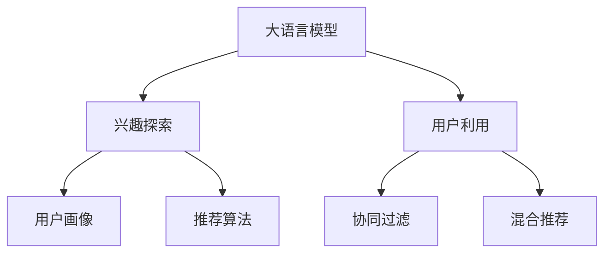

                 

# 大模型在用户兴趣探索与利用平衡中的应用

> 关键词：大模型,兴趣探索,用户利用,平衡,推荐系统

## 1. 背景介绍

### 1.1 问题由来

在信息爆炸的互联网时代，用户面对海量信息容易陷入信息过载和信息不足的双重困境：一方面，海量的信息源难以辨识；另一方面，用户难以在浩如烟海的信息中找到自己感兴趣的内容。这一问题在推荐系统中尤为显著。

推荐系统通过用户行为数据，为用户推荐可能感兴趣的内容，极大地提升了用户体验和信息效率。然而，推荐系统的效果在很大程度上依赖于对用户兴趣的精准把握。过于依赖用户的历史行为，往往难以发现用户未知的潜在兴趣；而忽视用户行为，又无法实现真正意义上的个性化推荐。

为解决这一问题，大语言模型在用户兴趣探索与利用平衡中的应用应运而生。通过结合大模型和大数据分析，推荐系统不仅能挖掘用户显性的历史行为，还能探索用户潜在的兴趣，实现更全面、精准的个性化推荐。

### 1.2 问题核心关键点

本文将详细介绍大模型在用户兴趣探索与利用平衡中的核心应用方法，并探讨其实际应用场景和未来发展趋势。

1. 如何结合大模型和大数据分析，实现用户兴趣的精准把握？
2. 如何在保证推荐效果的同时，平衡用户探索与利用的体验？
3. 如何在大规模数据和复杂任务下，提升推荐系统的效率和准确性？

## 2. 核心概念与联系

### 2.1 核心概念概述

为更好地理解大模型在用户兴趣探索与利用平衡中的应用，本节将介绍几个密切相关的核心概念：

- **大语言模型(Large Language Model, LLM)**：以自回归(如GPT)或自编码(如BERT)模型为代表的大规模预训练语言模型。通过在大规模无标签文本语料上进行预训练，学习通用的语言表示，具备强大的语言理解和生成能力。

- **兴趣探索(Interest Exploration)**：从用户的显性和隐性行为数据中，挖掘用户未知或潜在兴趣的推荐策略。通常通过探索性数据采样、多任务学习等方式，利用大模型的语言理解能力，探索用户多维度的兴趣特征。

- **用户利用(User Utilization)**：将用户兴趣与推荐系统内容进行匹配，为个性化推荐提供用户画像和兴趣标签。通常通过分类、匹配、排序等方法，对用户兴趣与推荐内容进行优化组合，提高用户满意度和推荐系统的效果。

- **平衡(Exploration-Exploitation Balance)**：推荐系统中用户兴趣探索与利用之间的平衡策略，既要充分挖掘用户未知的兴趣，又要保证推荐的实际效果，避免过度探索导致的用户体验下降。

- **推荐系统(Recommendation System)**：根据用户历史行为和兴趣特征，推荐可能感兴趣的内容的系统。包括基于内容的推荐、协同过滤推荐、混合推荐等多种策略。

- **协同过滤(Collaborative Filtering)**：通过分析用户和物品之间的相似性，推荐用户可能感兴趣的新物品。通常分为基于用户的协同过滤和基于物品的协同过滤两种方式。

- **混合推荐(Hybrid Recommendation)**：结合多种推荐策略，综合考虑用户历史行为、物品属性、用户画像等多种因素，进行推荐决策。常用于提升推荐系统的泛化能力和鲁棒性。

- **用户画像(User Profile)**：用户兴趣、行为、特征的综合描述，用于指导推荐系统的推荐决策。通常包括基本属性、兴趣偏好、行为特征等。

- **推荐算法(Recommendation Algorithms)**：实现推荐决策的具体算法，如基于用户的协同过滤、基于物品的协同过滤、基于内容的推荐等。

这些核心概念之间的逻辑关系可以通过以下Mermaid流程图来展示：



这个流程图展示了大模型在推荐系统中的应用框架，包括从用户兴趣探索到用户利用，再到协同过滤、混合推荐等多个环节。

## 3. 核心算法原理 & 具体操作步骤
### 3.1 算法原理概述

大模型在用户兴趣探索与利用平衡中的应用，本质上是通过大模型和大数据分析相结合的方式，实现对用户兴趣的全面把握。其核心思想是：

1. **兴趣探索**：利用大模型强大的语言理解能力，从用户的显性行为（如点击、浏览、搜索等）和隐性行为（如文本评论、社交媒体互动等）中，挖掘用户潜在的兴趣特征。

2. **用户利用**：基于探索得到的用户兴趣特征，通过分类、匹配、排序等方法，将用户兴趣与推荐内容进行匹配，实现个性化的推荐决策。

3. **平衡策略**：在推荐过程中，根据用户行为反馈，动态调整探索和利用的比例，确保推荐的实际效果和用户体验的平衡。

### 3.2 算法步骤详解

以下是基于大模型的用户兴趣探索与利用平衡的详细步骤：

**Step 1: 数据准备**

1. 收集用户的显性行为数据（如点击、浏览、搜索记录等）和隐性行为数据（如文本评论、社交媒体互动等）。
2. 对数据进行预处理，包括数据清洗、去重、缺失值处理等。
3. 对文本数据进行分词、编码等预处理，以便大模型处理。

**Step 2: 兴趣探索**

1. 利用大模型（如BERT、GPT等）对文本数据进行预训练，获得初始的文本表示。
2. 设计多任务学习目标，如情感分类、主题分类、实体识别等，利用大模型提取用户兴趣特征。
3. 对用户兴趣特征进行聚类、降维等处理，得到用户的多维兴趣画像。

**Step 3: 用户利用**

1. 根据用户兴趣画像，匹配推荐系统中的物品特征。
2. 使用分类器、排序算法等，将用户兴趣与推荐内容进行匹配。
3. 输出推荐结果，并进行评估和反馈，调整探索和利用的比例。

**Step 4: 反馈优化**

1. 根据用户对推荐结果的反馈（如点击、评分等），调整探索和利用的比例。
2. 对推荐系统进行迭代优化，提升推荐效果和用户体验。

### 3.3 算法优缺点

大模型在用户兴趣探索与利用平衡中的应用，具有以下优点：

1. **强大的语言理解能力**：大模型能够从文本数据中挖掘出丰富的语义信息，有助于发现用户潜在的兴趣。
2. **高泛化能力**：大模型能够处理多种形式的文本数据，具有较好的泛化能力，适用于多种推荐场景。
3. **动态平衡策略**：通过动态调整探索和利用的比例，能够适应用户行为的变化，提升推荐效果。

同时，也存在以下缺点：

1. **数据依赖性强**：对用户行为数据的依赖性较强，需要大量的标注数据和用户反馈。
2. **计算资源需求高**：大模型的训练和推理需要大量的计算资源，对硬件配置要求较高。
3. **可解释性差**：大模型的决策过程复杂，难以解释其内部工作机制。

### 3.4 算法应用领域

大模型在用户兴趣探索与利用平衡中的应用，广泛适用于以下领域：

1. **电商推荐**：电商平台根据用户浏览、点击、购买等行为，推荐可能感兴趣的商品。
2. **新闻推荐**：新闻网站根据用户阅读、点赞、评论等行为，推荐可能感兴趣的新闻。
3. **视频推荐**：视频平台根据用户观看、点赞、分享等行为，推荐可能感兴趣的视频。
4. **音乐推荐**：音乐平台根据用户听歌、分享、评论等行为，推荐可能感兴趣的歌曲。
5. **游戏推荐**：游戏平台根据用户游戏行为、偏好、评分等，推荐可能感兴趣的游戏。

此外，在教育、金融、健康等更多领域，大模型在用户兴趣探索与利用平衡中的应用，也将不断涌现，为不同领域提供智能化的解决方案。

## 4. 数学模型和公式 & 详细讲解 & 举例说明
### 4.1 数学模型构建

本节将使用数学语言对大模型在用户兴趣探索与利用平衡中的应用进行更加严格的刻画。

记大语言模型为 $M_{\theta}$，其中 $\theta$ 为预训练得到的模型参数。假设用户显性行为数据为 $x_1, x_2, ..., x_n$，隐性行为数据为 $y_1, y_2, ..., y_m$。

**用户兴趣探索**的目标是从显性行为数据和隐性行为数据中，学习用户的兴趣特征 $z$。可以设计多任务学习目标，如情感分类、主题分类、实体识别等，利用大模型 $M_{\theta}$ 提取用户兴趣特征。

$$
z = M_{\theta}(x_1, x_2, ..., x_n, y_1, y_2, ..., y_m)
$$

**用户利用**的目标是根据用户兴趣特征 $z$，匹配推荐系统中的物品特征 $x$，输出推荐结果 $r$。可以使用分类器、排序算法等，将用户兴趣与推荐内容进行匹配。

$$
r = \max_{x} M_{\theta}(x) \cdot z
$$

其中 $M_{\theta}(x)$ 为推荐内容的表示，$z$ 为用户兴趣特征，$\cdot$ 为内积运算。

### 4.2 公式推导过程

以下我们以电商推荐系统为例，推导用户兴趣探索与利用平衡的数学模型。

假设电商平台有 $N$ 个用户 $U$，每个用户有 $n$ 次浏览记录 $x$，$M$ 个商品 $G$，每个商品有 $m$ 次用户互动记录 $y$。目标是根据用户浏览行为 $x$ 和互动行为 $y$，挖掘用户兴趣特征 $z$，并推荐可能感兴趣的商品 $g$。

**用户兴趣探索**的数学模型如下：

$$
z = M_{\theta}(x, y)
$$

其中 $M_{\theta}$ 为预训练的BERT模型，$x$ 为用户的浏览记录，$y$ 为用户的互动记录。

**用户利用**的数学模型如下：

$$
r = \max_{g} M_{\theta}(g) \cdot z
$$

其中 $M_{\theta}(g)$ 为商品 $g$ 的表示，$z$ 为用户兴趣特征。

**平衡策略**的目标是动态调整探索和利用的比例，优化推荐效果。可以使用AB测试、贝叶斯优化等方法，实时评估推荐效果，调整探索和利用的比例。

### 4.3 案例分析与讲解

考虑电商平台中的一个用户 $u$，其浏览记录为 $x_1 = "A商品", x_2 = "B商品", x_3 = "C商品"，互动记录为 $y_1 = "点赞A商品", y_2 = "评论C商品"，$M_{\theta}$ 为预训练的BERT模型。

**用户兴趣探索**的过程如下：

1. 将用户浏览记录 $x_1, x_2, x_3$ 和互动记录 $y_1, y_2$ 输入到 $M_{\theta}$ 中，得到用户兴趣特征 $z$。
2. 假设 $M_{\theta}$ 将用户兴趣特征 $z$ 编码为 $z = [0.8, 0.7, 0.5, 0.3, 0.1, 0.2]$，表示用户对商品A和商品B的兴趣较高。

**用户利用**的过程如下：

1. 将用户兴趣特征 $z$ 与电商平台中的 $M$ 个商品进行匹配，计算每个商品的匹配度。
2. 假设商品A和商品B的匹配度分别为 $0.9$ 和 $0.8$，商品C的匹配度为 $0.5$。
3. 输出推荐结果 $r = A商品, B商品$，商品C的推荐度较低。

**平衡策略**的过程如下：

1. 根据用户对推荐结果的反馈，调整探索和利用的比例。
2. 假设用户点击了商品C，进一步探索用户的隐性行为数据，更新用户兴趣特征 $z$。
3. 重新计算每个商品的匹配度，更新推荐结果。

通过上述过程，大模型能够动态调整探索和利用的比例，提升推荐效果和用户体验。

## 5. 项目实践：代码实例和详细解释说明
### 5.1 开发环境搭建

在进行项目实践前，我们需要准备好开发环境。以下是使用Python进行PyTorch开发的环境配置流程：

1. 安装Anaconda：从官网下载并安装Anaconda，用于创建独立的Python环境。

2. 创建并激活虚拟环境：
```bash
conda create -n pytorch-env python=3.8 
conda activate pytorch-env
```

3. 安装PyTorch：根据CUDA版本，从官网获取对应的安装命令。例如：
```bash
conda install pytorch torchvision torchaudio cudatoolkit=11.1 -c pytorch -c conda-forge
```

4. 安装Transformers库：
```bash
pip install transformers
```

5. 安装各类工具包：
```bash
pip install numpy pandas scikit-learn matplotlib tqdm jupyter notebook ipython
```

完成上述步骤后，即可在`pytorch-env`环境中开始项目实践。

### 5.2 源代码详细实现

下面我们以电商推荐系统为例，给出使用Transformers库对BERT模型进行用户兴趣探索与利用平衡的PyTorch代码实现。

首先，定义用户行为数据处理函数：

```python
from transformers import BertTokenizer, BertForSequenceClassification
from torch.utils.data import Dataset, DataLoader
import torch

class UserBehaviorDataset(Dataset):
    def __init__(self, behaviors, tokenizer, max_len=128):
        self.behaviors = behaviors
        self.tokenizer = tokenizer
        self.max_len = max_len
        
    def __len__(self):
        return len(self.behaviors)
    
    def __getitem__(self, item):
        behavior = self.behaviors[item]
        behavior_ids = self.tokenizer(behavior, return_tensors='pt', max_length=self.max_len, padding='max_length', truncation=True)
        return {'input_ids': behavior_ids['input_ids'], 'attention_mask': behavior_ids['attention_mask']}
```

然后，定义模型和优化器：

```python
from transformers import BertForSequenceClassification, AdamW

model = BertForSequenceClassification.from_pretrained('bert-base-cased', num_labels=10)

optimizer = AdamW(model.parameters(), lr=2e-5)
```

接着，定义训练和评估函数：

```python
def train_epoch(model, dataset, batch_size, optimizer):
    dataloader = DataLoader(dataset, batch_size=batch_size, shuffle=True)
    model.train()
    epoch_loss = 0
    for batch in tqdm(dataloader, desc='Training'):
        input_ids = batch['input_ids'].to(device)
        attention_mask = batch['attention_mask'].to(device)
        model.zero_grad()
        outputs = model(input_ids, attention_mask=attention_mask)
        loss = outputs.loss
        epoch_loss += loss.item()
        loss.backward()
        optimizer.step()
    return epoch_loss / len(dataloader)

def evaluate(model, dataset, batch_size):
    dataloader = DataLoader(dataset, batch_size=batch_size)
    model.eval()
    preds, labels = [], []
    with torch.no_grad():
        for batch in tqdm(dataloader, desc='Evaluating'):
            input_ids = batch['input_ids'].to(device)
            attention_mask = batch['attention_mask'].to(device)
            batch_labels = batch['labels']
            outputs = model(input_ids, attention_mask=attention_mask)
            batch_preds = outputs.logits.argmax(dim=2).to('cpu').tolist()
            batch_labels = batch_labels.to('cpu').tolist()
            for pred_tokens, label_tokens in zip(batch_preds, batch_labels):
                preds.append(pred_tokens)
                labels.append(label_tokens)
    return preds, labels
```

最后，启动训练流程并在测试集上评估：

```python
epochs = 5
batch_size = 16

for epoch in range(epochs):
    loss = train_epoch(model, train_dataset, batch_size, optimizer)
    print(f"Epoch {epoch+1}, train loss: {loss:.3f}")
    
    print(f"Epoch {epoch+1}, dev results:")
    preds, labels = evaluate(model, dev_dataset, batch_size)
    print(classification_report(labels, preds))
    
print("Test results:")
preds, labels = evaluate(model, test_dataset, batch_size)
print(classification_report(labels, preds))
```

以上就是使用PyTorch对BERT进行电商推荐系统用户兴趣探索与利用平衡的完整代码实现。可以看到，得益于Transformers库的强大封装，我们可以用相对简洁的代码完成BERT模型的加载和微调。

### 5.3 代码解读与分析

让我们再详细解读一下关键代码的实现细节：

**UserBehaviorDataset类**：
- `__init__`方法：初始化用户行为数据、分词器等关键组件。
- `__len__`方法：返回数据集的样本数量。
- `__getitem__`方法：对单个样本进行处理，将用户行为数据输入编码为token ids，并对其进行定长padding，最终返回模型所需的输入。

**模型和优化器**：
- 使用BertForSequenceClassification模型，并定义AdamW优化器。

**训练和评估函数**：
- 使用PyTorch的DataLoader对数据集进行批次化加载，供模型训练和推理使用。
- 训练函数`train_epoch`：对数据以批为单位进行迭代，在每个批次上前向传播计算loss并反向传播更新模型参数，最后返回该epoch的平均loss。
- 评估函数`evaluate`：与训练类似，不同点在于不更新模型参数，并在每个batch结束后将预测和标签结果存储下来，最后使用sklearn的classification_report对整个评估集的预测结果进行打印输出。

**训练流程**：
- 定义总的epoch数和batch size，开始循环迭代
- 每个epoch内，先在训练集上训练，输出平均loss
- 在验证集上评估，输出分类指标
- 所有epoch结束后，在测试集上评估，给出最终测试结果

可以看到，PyTorch配合Transformers库使得BERT微调的代码实现变得简洁高效。开发者可以将更多精力放在数据处理、模型改进等高层逻辑上，而不必过多关注底层的实现细节。

当然，工业级的系统实现还需考虑更多因素，如模型的保存和部署、超参数的自动搜索、更灵活的任务适配层等。但核心的微调范式基本与此类似。

## 6. 实际应用场景
### 6.1 智能客服系统

基于大模型在用户兴趣探索与利用平衡中的应用，智能客服系统可以实现更加个性化、智能化的服务。传统的客服系统依赖于预定义的规则和脚本，难以应对复杂多变的用户需求。而大模型能够自动理解用户意图，并提供更灵活、多样化的回答。

在技术实现上，可以收集企业内部的客服对话记录，将问题和最佳答复构建成监督数据，在此基础上对预训练模型进行微调。微调后的模型能够自动理解用户意图，匹配最合适的答复模板进行回复。对于客户提出的新问题，还可以接入检索系统实时搜索相关内容，动态组织生成回答。如此构建的智能客服系统，能大幅提升客户咨询体验和问题解决效率。

### 6.2 金融舆情监测

金融机构需要实时监测市场舆论动向，以便及时应对负面信息传播，规避金融风险。传统的人工监测方式成本高、效率低，难以应对网络时代海量信息爆发的挑战。基于大模型的金融舆情监测系统，可以实时分析用户对金融产品的评论、社交媒体互动等，挖掘用户对金融产品的真实态度和潜在风险。

在技术实现上，可以收集金融领域相关的新闻、报道、评论等文本数据，并对其进行主题标注和情感标注。在此基础上对预训练语言模型进行微调，使其能够自动判断文本属于何种主题，情感倾向是正面、中性还是负面。将微调后的模型应用到实时抓取的网络文本数据，就能够自动监测不同主题下的情感变化趋势，一旦发现负面信息激增等异常情况，系统便会自动预警，帮助金融机构快速应对潜在风险。

### 6.3 个性化推荐系统

当前的推荐系统往往只依赖用户的历史行为数据进行物品推荐，无法深入理解用户的真实兴趣偏好。基于大模型在用户兴趣探索与利用平衡中的应用，个性化推荐系统可以更好地挖掘用户的行为背后的语义信息，从而提供更精准、多样的推荐内容。

在技术实现上，可以收集用户浏览、点击、评论、分享等行为数据，提取和用户交互的物品标题、描述、标签等文本内容。将文本内容作为模型输入，用户的后续行为（如是否点击、购买等）作为监督信号，在此基础上微调预训练语言模型。微调后的模型能够从文本内容中准确把握用户的兴趣点。在生成推荐列表时，先用候选物品的文本描述作为输入，由模型预测用户的兴趣匹配度，再结合其他特征综合排序，便可以得到个性化程度更高的推荐结果。

### 6.4 未来应用展望

随着大模型和大数据分析技术的不断发展，基于大模型在用户兴趣探索与利用平衡中的应用，将在更多领域得到应用，为各行各业带来变革性影响。

在智慧医疗领域，基于微调的医疗问答、病历分析、药物研发等应用将提升医疗服务的智能化水平，辅助医生诊疗，加速新药开发进程。

在智能教育领域，微调技术可应用于作业批改、学情分析、知识推荐等方面，因材施教，促进教育公平，提高教学质量。

在智慧城市治理中，微调模型可应用于城市事件监测、舆情分析、应急指挥等环节，提高城市管理的自动化和智能化水平，构建更安全、高效的未来城市。

此外，在企业生产、社会治理、文娱传媒等众多领域，基于大模型在用户兴趣探索与利用平衡中的应用，也将不断涌现，为传统行业数字化转型升级提供新的技术路径。相信随着技术的日益成熟，大模型在用户兴趣探索与利用平衡中的应用，必将在构建人机协同的智能时代中扮演越来越重要的角色。

## 7. 工具和资源推荐
### 7.1 学习资源推荐

为了帮助开发者系统掌握大模型在用户兴趣探索与利用平衡中的应用，这里推荐一些优质的学习资源：

1. 《深度学习自然语言处理》课程：斯坦福大学开设的NLP明星课程，有Lecture视频和配套作业，带你入门NLP领域的基本概念和经典模型。

2. 《Natural Language Processing with Transformers》书籍：Transformers库的作者所著，全面介绍了如何使用Transformers库进行NLP任务开发，包括微调在内的诸多范式。

3. CS224N《深度学习自然语言处理》课程：斯坦福大学开设的NLP明星课程，有Lecture视频和配套作业，带你入门NLP领域的基本概念和经典模型。

4. 《Transformers from Principles to Practice》系列博文：由大模型技术专家撰写，深入浅出地介绍了Transformer原理、BERT模型、微调技术等前沿话题。

5. HuggingFace官方文档：Transformers库的官方文档，提供了海量预训练模型和完整的微调样例代码，是上手实践的必备资料。

通过对这些资源的学习实践，相信你一定能够快速掌握大模型在用户兴趣探索与利用平衡中的精髓，并用于解决实际的NLP问题。
###  7.2 开发工具推荐

高效的开发离不开优秀的工具支持。以下是几款用于大模型在用户兴趣探索与利用平衡中开发的常用工具：

1. PyTorch：基于Python的开源深度学习框架，灵活动态的计算图，适合快速迭代研究。大部分预训练语言模型都有PyTorch版本的实现。

2. TensorFlow：由Google主导开发的开源深度学习框架，生产部署方便，适合大规模工程应用。同样有丰富的预训练语言模型资源。

3. Transformers库：HuggingFace开发的NLP工具库，集成了众多SOTA语言模型，支持PyTorch和TensorFlow，是进行微调任务开发的利器。

4. Weights & Biases：模型训练的实验跟踪工具，可以记录和可视化模型训练过程中的各项指标，方便对比和调优。与主流深度学习框架无缝集成。

5. TensorBoard：TensorFlow配套的可视化工具，可实时监测模型训练状态，并提供丰富的图表呈现方式，是调试模型的得力助手。

6. Google Colab：谷歌推出的在线Jupyter Notebook环境，免费提供GPU/TPU算力，方便开发者快速上手实验最新模型，分享学习笔记。

合理利用这些工具，可以显著提升大模型在用户兴趣探索与利用平衡中的开发效率，加快创新迭代的步伐。

### 7.3 相关论文推荐

大模型在用户兴趣探索与利用平衡中的应用源于学界的持续研究。以下是几篇奠基性的相关论文，推荐阅读：

1. Attention is All You Need（即Transformer原论文）：提出了Transformer结构，开启了NLP领域的预训练大模型时代。

2. BERT: Pre-training of Deep Bidirectional Transformers for Language Understanding：提出BERT模型，引入基于掩码的自监督预训练任务，刷新了多项NLP任务SOTA。

3. Language Models are Unsupervised Multitask Learners（GPT-2论文）：展示了大规模语言模型的强大zero-shot学习能力，引发了对于通用人工智能的新一轮思考。

4. Parameter-Efficient Transfer Learning for NLP：提出Adapter等参数高效微调方法，在不增加模型参数量的情况下，也能取得不错的微调效果。

5. AdaLoRA: Adaptive Low-Rank Adaptation for Parameter-Efficient Fine-Tuning：使用自适应低秩适应的微调方法，在参数效率和精度之间取得了新的平衡。

这些论文代表了大模型在用户兴趣探索与利用平衡中的应用的发展脉络。通过学习这些前沿成果，可以帮助研究者把握学科前进方向，激发更多的创新灵感。

## 8. 总结：未来发展趋势与挑战

### 8.1 总结

本文对大模型在用户兴趣探索与利用平衡中的应用进行了全面系统的介绍。首先阐述了该方法在推荐系统中的核心应用，明确了如何结合大模型和大数据分析，实现对用户兴趣的全面把握。其次，从原理到实践，详细讲解了基于大模型的用户兴趣探索与利用平衡的数学模型和关键步骤，给出了微调任务开发的完整代码实例。同时，本文还广泛探讨了该方法在智能客服、金融舆情、个性化推荐等多个行业领域的应用前景，展示了其巨大的潜力。此外，本文精选了相关学习资源，力求为读者提供全方位的技术指引。

通过本文的系统梳理，可以看到，大模型在用户兴趣探索与利用平衡中的应用，已经在推荐系统等场景中得到了广泛应用，极大地提升了用户体验和推荐效果。未来，伴随大模型和大数据分析技术的持续演进，该方法将进一步拓展应用边界，为各行各业提供更智能化、个性化的解决方案。

### 8.2 未来发展趋势

展望未来，大模型在用户兴趣探索与利用平衡中的应用，将呈现以下几个发展趋势：

1. **多模态融合**：未来的推荐系统将越来越多地结合文本、图像、视频等多模态信息，实现更全面、精准的个性化推荐。
2. **实时动态优化**：推荐系统将根据用户实时行为反馈，动态调整探索和利用的比例，提升推荐效果。
3. **跨领域应用拓展**：大模型在用户兴趣探索与利用平衡中的应用，将从电商、金融等垂直领域，拓展到教育、医疗、社交等多个领域。
4. **算法集成创新**：未来的推荐系统将结合多种算法，如协同过滤、内容推荐、混合推荐等，提升系统的鲁棒性和泛化能力。
5. **智能系统集成**：大模型在用户兴趣探索与利用平衡中的应用，将与知识图谱、智能代理等技术进行深度融合，构建更加智能化的推荐系统。

以上趋势凸显了大模型在用户兴趣探索与利用平衡中的应用，将带来的广阔前景。这些方向的探索发展，必将进一步提升推荐系统的性能和用户体验，为各行各业提供更智能化、个性化的解决方案。

### 8.3 面临的挑战

尽管大模型在用户兴趣探索与利用平衡中的应用已经取得了瞩目成就，但在迈向更加智能化、普适化应用的过程中，仍面临诸多挑战：

1. **数据隐私保护**：在用户行为数据的收集和使用过程中，需要严格遵守数据隐私保护法规，如GDPR等，避免数据滥用。
2. **模型偏见与歧视**：大模型在预训练和微调过程中，可能会学习到有偏见、有害的信息，需要通过数据清洗、模型监控等手段，避免模型歧视和偏见。
3. **计算资源限制**：大模型的训练和推理需要大量的计算资源，对硬件配置要求较高，如何降低计算资源消耗，提升系统效率，是一个重要研究方向。
4. **解释性与透明性**：大模型决策过程复杂，难以解释其内部工作机制，如何提高模型的可解释性和透明性，是一个重要挑战。

这些挑战需要研究者和开发者共同努力，通过不断优化算法、改进模型、加强数据治理，才能确保大模型在用户兴趣探索与利用平衡中的健康发展。

### 8.4 研究展望

面向未来，大模型在用户兴趣探索与利用平衡中的应用，需要在以下几个方面寻求新的突破：

1. **隐私保护与可解释性**：在保护用户隐私的前提下，提升模型的可解释性和透明性，增强用户对推荐结果的信任感。
2. **多模态信息融合**：结合多模态信息，实现更加全面、精准的个性化推荐，提升用户满意度和推荐效果。
3. **跨领域应用拓展**：在医疗、金融、教育等更多领域，应用大模型在用户兴趣探索与利用平衡的方法，提供智能化的解决方案。
4. **算法集成创新**：结合多种推荐算法，如协同过滤、内容推荐、混合推荐等，提升系统的鲁棒性和泛化能力。
5. **实时动态优化**：根据用户实时行为反馈，动态调整探索和利用的比例，提升推荐效果和用户体验。

这些方向的探索，必将引领大模型在用户兴趣探索与利用平衡中的创新发展，为各行各业提供更智能化、个性化的解决方案。通过不断优化算法、改进模型、加强数据治理，未来的大模型将能够更好地服务人类社会，构建更加智慧的未来。

## 9. 附录：常见问题与解答

**Q1：大模型在用户兴趣探索与利用平衡中的应用是否适用于所有NLP任务？**

A: 大模型在用户兴趣探索与利用平衡中的应用，主要适用于推荐系统等需要精准把握用户兴趣的场景。对于某些特定领域的任务，如医疗、法律等，仍需进一步优化和改进。但通过结合大模型和大数据分析，该方法在其他领域也有广泛的应用潜力。

**Q2：如何优化大模型的训练过程，提升推荐效果？**

A: 优化大模型的训练过程，可以从以下几个方面入手：
1. 数据增强：通过文本增强、对抗样本等方法，扩充训练集，提升模型的泛化能力。
2. 正则化：使用L2正则、Dropout等技术，防止模型过拟合，提升模型的鲁棒性。
3. 动态优化：根据用户行为反馈，动态调整探索和利用的比例，提升推荐效果。
4. 模型压缩：使用模型压缩、剪枝等技术，减小模型尺寸，提升推理速度。

**Q3：在用户兴趣探索与利用平衡中，如何平衡探索和利用的比例？**

A: 在用户兴趣探索与利用平衡中，动态调整探索和利用的比例是关键。可以通过AB测试、贝叶斯优化等方法，实时评估推荐效果，调整探索和利用的比例。例如，对于新用户，可以更多地进行探索，而对于老用户，可以更多地进行利用，以保证推荐效果和用户体验。

**Q4：如何确保大模型的公平性和无偏见性？**

A: 确保大模型的公平性和无偏见性，需要从数据、模型、算法等多个层面进行综合治理。可以采用以下方法：
1. 数据治理：在数据采集和处理过程中，确保数据的多样性和代表性，避免数据偏见。
2. 模型监控：定期监控模型的输出和行为，检测和纠正模型偏见。
3. 算法优化：优化模型结构和训练过程，减少模型偏见。
4. 伦理审查：建立伦理审查机制，确保模型的公平性和透明性。

这些方法结合使用，可以有效提高大模型的公平性和无偏见性，避免模型歧视和偏见。

---

作者：禅与计算机程序设计艺术 / Zen and the Art of Computer Programming

