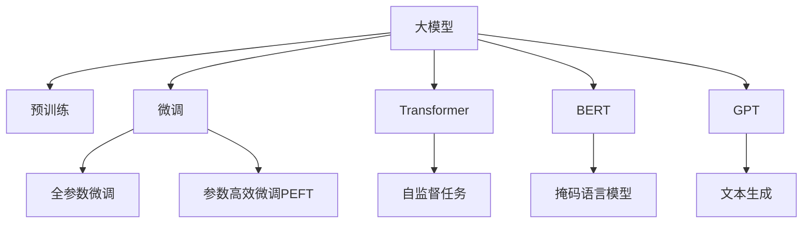

                 

# 大模型在用户评论摘要生成中的应用

## 1. 背景介绍

### 1.1 问题由来
随着互联网和电子商务的迅猛发展，用户评论作为产品或服务评价的重要来源，越来越多地被商家和消费者关注。在面对成千上万条用户评论时，商家需要快速、高效地提炼出关键信息，以指导产品改进和市场营销决策。传统的手动摘要方法费时费力，且难以确保摘要的准确性和一致性。因此，如何自动生成高质量的用户评论摘要，成为一项重要而紧迫的课题。

用户评论摘要生成（User Comment Summarization）是指从用户评论文本中自动提取关键信息，生成简洁、准确的摘要。该任务在电商平台、社交媒体、新闻评论等领域均有广泛应用，是NLP研究中的热门方向。传统基于规则的方法往往需要人工设计复杂的抽取模板，难以处理大规模、非结构化数据。相比之下，基于深度学习的大模型方法具有强大的语义理解和生成能力，能够在大量文本数据上进行训练，并自动提取关键信息，生成高精度的摘要。

### 1.2 问题核心关键点
用户评论摘要生成的大模型方法，核心在于如何将大量无结构的自由文本转化为结构化的信息。具体来说，包括以下几个关键点：
1. **模型选择**：选择合适的预训练语言模型，如BERT、GPT等，以充分利用其强大的语义理解能力。
2. **任务定义**：明确摘要生成任务的目标，例如生成固定长度的摘要，或提取关键信息点。
3. **训练与微调**：在标注数据上训练和微调模型，提升其生成摘要的准确性和一致性。
4. **评估与优化**：使用自动评估指标（如ROUGE、BLEU）和人工评价，不断优化模型生成摘要的质量。

### 1.3 问题研究意义
用户评论摘要生成技术能够有效提升商家和消费者处理海量文本数据的能力，减少信息过载，提升决策效率。通过自动化的摘要生成，商家可以更快地获取用户反馈，优化产品和服务，提升客户满意度。同时，消费者在查找产品评价时，也能够快速了解关键信息，提高决策效率和满意度。

此外，用户评论摘要生成还涉及到自然语言处理、信息抽取、文本生成等多个子领域，是推动NLP技术应用的重要推动力。通过在大规模数据上训练和微调大模型，可以进一步提升模型的泛化能力和鲁棒性，促进NLP技术在更多实际场景中的应用。

## 2. 核心概念与联系

### 2.1 核心概念概述

为更好地理解大模型在用户评论摘要生成中的应用，本节将介绍几个密切相关的核心概念：

- **大模型(Large Model)**：指通过大规模无标签文本数据预训练的深度学习模型，如BERT、GPT等，具备强大的语义理解和生成能力。
- **用户评论摘要生成(User Comment Summarization)**：从用户评论文本中自动生成关键信息摘要，以提升商家和消费者处理海量文本数据的能力。
- **预训练(Pre-training)**：指在大规模无标签文本语料上，通过自监督学习任务训练通用语言模型的过程。
- **微调(Fine-tuning)**：指在预训练模型的基础上，使用下游任务的少量标注数据，通过有监督学习优化模型在特定任务上的性能。
- **Transformer**：基于注意力机制的深度学习模型架构，在大模型中广泛应用。
- **BERT**：由Google提出的大规模预训练语言模型，擅长处理结构化信息抽取任务。
- **GPT**：由OpenAI提出的大规模预训练语言模型，擅长处理生成式任务。

这些核心概念之间的逻辑关系可以通过以下Mermaid流程图来展示：



这个流程图展示了核心概念之间的联系和作用机制：

1. 大模型通过预训练获得基础能力。
2. 微调是对预训练模型进行任务特定的优化，可以分为全参数微调和参数高效微调（PEFT）。
3. Transformer是用于构建大模型的核心架构。
4. BERT和GPT是大模型的两种典型实现，分别擅长不同任务。
5. 预训练过程通常使用自监督任务，如掩码语言模型和文本生成等。

这些概念共同构成了大模型在用户评论摘要生成中的应用框架，使其能够在大规模数据上提取和生成关键信息摘要。

## 3. 核心算法原理 & 具体操作步骤
### 3.1 算法原理概述

用户评论摘要生成的大模型方法，本质上是将大规模用户评论数据作为输入，通过预训练和微调的过程，自动学习提取关键信息的语义表示。具体来说，算法流程包括以下几个步骤：

1. **数据预处理**：将原始用户评论数据进行分句、去除停用词、标准化等处理，以提高模型训练的效率和效果。
2. **构建输入表示**：将处理后的用户评论文本转换为模型所需的输入格式，如将文本转换为token序列，并进行最大长度限制和padding。
3. **预训练模型选择**：选择合适的预训练模型，如BERT、GPT等，以利用其强大的语义理解能力。
4. **任务适配层设计**：根据任务需求，设计相应的任务适配层，如摘要长度限制、关键词抽取等，以指导模型生成摘要。
5. **模型训练与微调**：在标注数据上训练和微调模型，优化模型生成摘要的性能。
6. **模型评估与优化**：使用自动评估指标和人工评价，不断优化模型生成摘要的质量。

### 3.2 算法步骤详解

以下将详细介绍用户评论摘要生成的大模型方法的算法步骤：

**Step 1: 数据预处理**

用户评论数据通常包含大量非结构化文本，需要进行清洗和标准化处理。具体步骤如下：
- 分句：将长评论按句号、问号等标点符号进行分句，方便模型提取关键信息。
- 去停用词：去除常见停用词（如“的”、“是”等），以减少噪音。
- 标准化：将文本转换为小写，去除特殊符号，统一编码等。

**Step 2: 构建输入表示**

构建输入表示的目的是将用户评论文本转换为模型所需的token序列。具体步骤如下：
- Token化：将文本分词为token序列。
- 编码：将token序列转换为模型所需的输入格式。
- 长度限制：对token序列进行最大长度限制，防止过长序列占用过多内存和显存。
- Padding：对不足长度的token序列进行padding，使其长度一致。

**Step 3: 预训练模型选择**

选择合适的预训练模型是用户评论摘要生成的关键。常见的预训练模型包括BERT、GPT等，其中BERT擅长处理结构化信息抽取任务，GPT擅长处理生成式任务。根据任务需求，选择相应的模型进行微调。

**Step 4: 任务适配层设计**

根据任务需求，设计相应的任务适配层，以指导模型生成摘要。常见的适配层包括：
- 固定长度：设定摘要的最大长度，如100个token。
- 关键词抽取：提取评论中的关键信息点，如评分、评价词等。

**Step 5: 模型训练与微调**

在标注数据上训练和微调模型，优化模型生成摘要的性能。具体步骤如下：
- 选择合适的优化器，如AdamW、SGD等。
- 设定学习率，一般为2e-5。
- 设定迭代轮数，一般为10轮。
- 加入正则化技术，如L2正则、Dropout等。
- 微调顶层，以减少计算资源消耗。

**Step 6: 模型评估与优化**

使用自动评估指标和人工评价，不断优化模型生成摘要的质量。具体步骤如下：
- 使用BLEU、ROUGE等自动评估指标，计算模型生成的摘要与参考摘要之间的相似度。
- 人工评价，请标注专家或用户对生成摘要的满意度进行评价。
- 根据评价结果，不断优化模型参数和任务适配层。

### 3.3 算法优缺点

用户评论摘要生成的大模型方法具有以下优点：
1. **高效性**：利用大模型的强大语义理解能力，能够快速处理大规模用户评论数据，生成高精度的摘要。
2. **可解释性**：生成的摘要可以提供关键信息点，便于消费者快速了解评论重点。
3. **灵活性**：适用于多种摘要生成任务，如固定长度摘要、关键词抽取等。
4. **通用性**：可应用于不同领域和不同类型的用户评论数据。

同时，该方法也存在一定的局限性：
1. **标注成本**：生成高质量的摘要需要标注数据，标注成本较高。
2. **泛化能力**：模型对标注数据过于依赖，泛化能力有限。
3. **长尾问题**：对于长尾用户评论，生成摘要的准确性可能下降。

尽管存在这些局限性，但大模型方法在用户评论摘要生成中仍具有广泛的应用前景，能够显著提升商家和消费者处理海量文本数据的能力，加速产品改进和决策制定。

### 3.4 算法应用领域

用户评论摘要生成技术在多个领域均有广泛应用，例如：

- **电商平台**：帮助商家快速了解用户反馈，优化产品和服务，提升客户满意度。
- **社交媒体**：自动抽取社交媒体用户的评论，分析用户情绪和趋势，指导内容发布策略。
- **新闻评论**：从新闻评论中提取关键信息点，方便新闻编辑快速了解用户反馈，调整报道策略。
- **旅游评论**：自动生成旅游用户评论摘要，方便其他用户快速了解景点评价，提高旅游决策效率。
- **电影评论**：自动生成电影用户评论摘要，方便其他用户快速了解电影评价，指导观影选择。

除了这些常见应用外，用户评论摘要生成技术还可应用于学术研究、金融分析等多个领域，为数据处理和决策支持提供新的解决方案。

## 4. 数学模型和公式 & 详细讲解  
### 4.1 数学模型构建

用户评论摘要生成的大模型方法，本质上是一种生成式任务。假设预训练模型为 $M_{\theta}$，用户评论为 $x$，生成的摘要为 $y$，则目标是最小化生成任务的多样性损失（Diversity Loss），即：

$$
\min_{\theta} \mathcal{L}(y|x; \theta) = \mathbb{E}_{x} \left[ \mathbb{E}_{y|x} \left[ \log P(y|x; \theta) \right] \right]
$$

其中 $P(y|x; \theta)$ 为模型在给定评论 $x$ 下生成摘要 $y$ 的概率分布，$\mathbb{E}_{x}$ 和 $\mathbb{E}_{y|x}$ 分别表示对评论和摘要的期望。

### 4.2 公式推导过程

在实际应用中，通常使用语言模型作为生成任务的概率模型。假设模型 $M_{\theta}$ 的参数为 $\theta$，输入为评论 $x$，输出为摘要 $y$。则生成任务的多样性损失可以表示为：

$$
\min_{\theta} \mathcal{L}(y|x; \theta) = \sum_{y} P(y|x; \theta) \log \frac{P(y|x; \theta)}{P_{\text{ref}}(y)}
$$

其中 $P_{\text{ref}}(y)$ 为参考摘要的概率分布，通常通过人工标注数据进行训练。该损失函数可以通过最大化条件似然（Conditional Likelihood）最大化训练，即：

$$
\min_{\theta} -\frac{1}{N} \sum_{i=1}^N \log P(y_i|x_i; \theta)
$$

其中 $N$ 为样本数量，$x_i$ 和 $y_i$ 分别为样本 $i$ 的评论和摘要。在训练过程中，通常使用负对数似然（Negative Log-Likelihood）损失函数：

$$
\min_{\theta} -\frac{1}{N} \sum_{i=1}^N \sum_{j=1}^{L} \log P(y_j|y_{<j}, x; \theta)
$$

其中 $L$ 为摘要的最大长度，$y_{<j}$ 表示摘要的前 $j-1$ 个token。

### 4.3 案例分析与讲解

以下通过一个简单的案例，分析用户评论摘要生成的算法过程：

假设我们有一个电商平台的用户评论数据集，其中包含大量用户在商品页面下的评论。我们的目标是从这些评论中自动抽取关键信息，生成简洁的摘要。

**Step 1: 数据预处理**

首先，我们需要对原始评论数据进行清洗和标准化处理。例如，去除评论中的特殊符号、停用词等，将评论转换为小写，去除特殊符号，统一编码等。

**Step 2: 构建输入表示**

将处理后的评论文本转换为模型所需的输入格式。例如，将文本分词为token序列，并对每个token进行编码。如果某个token不在模型词汇表中，则需要进行未知token处理（如将unk token添加到模型词汇表中）。

**Step 3: 预训练模型选择**

我们选择BERT作为预训练模型，利用其强大的语义理解能力，自动提取评论中的关键信息。

**Step 4: 任务适配层设计**

我们需要设计相应的任务适配层，以指导模型生成摘要。例如，设定摘要的最大长度为100个token，并使用BERT模型中的分类器输出层作为任务适配层。

**Step 5: 模型训练与微调**

在标注数据上训练和微调BERT模型，优化模型生成摘要的性能。例如，使用AdamW优化器，设定学习率为2e-5，迭代轮数为10轮。

**Step 6: 模型评估与优化**

使用BLEU、ROUGE等自动评估指标，计算模型生成的摘要与参考摘要之间的相似度。例如，使用BLEU指标，计算模型生成摘要与人工标注的摘要之间的BLEU分数。同时，通过人工评价，对生成的摘要进行满意度评价，并根据评价结果优化模型参数和任务适配层。

## 5. 项目实践：代码实例和详细解释说明
### 5.1 开发环境搭建

在进行用户评论摘要生成的项目实践前，我们需要准备好开发环境。以下是使用Python进行PyTorch开发的环境配置流程：

1. 安装Anaconda：从官网下载并安装Anaconda，用于创建独立的Python环境。

2. 创建并激活虚拟环境：
```bash
conda create -n pytorch-env python=3.8 
conda activate pytorch-env
```

3. 安装PyTorch：根据CUDA版本，从官网获取对应的安装命令。例如：
```bash
conda install pytorch torchvision torchaudio cudatoolkit=11.1 -c pytorch -c conda-forge
```

4. 安装Transformer库：
```bash
pip install transformers
```

5. 安装各类工具包：
```bash
pip install numpy pandas scikit-learn matplotlib tqdm jupyter notebook ipython
```

完成上述步骤后，即可在`pytorch-env`环境中开始用户评论摘要生成的项目实践。

### 5.2 源代码详细实现

我们使用HuggingFace的Transformers库，基于GPT-2模型进行用户评论摘要生成的实践。

首先，定义评论摘要生成任务的DataLoader：

```python
from transformers import GPT2Tokenizer, GPT2ForSequenceClassification

class CommentSummarizer:
    def __init__(self, tokenizer, model):
        self.tokenizer = tokenizer
        self.model = model
    
    def summarize(self, comment, max_length=100):
        tokenized_comment = self.tokenizer.encode(comment, max_length=max_length, padding='max_length', truncation=True, return_tensors='pt')
        summary_ids = self.model.generate(tokenized_comment, num_return_sequences=1)
        summary = self.tokenizer.decode(summary_ids[0], skip_special_tokens=True)
        return summary
```

然后，定义数据加载器和模型训练过程：

```python
from torch.utils.data import Dataset, DataLoader

class CommentDataset(Dataset):
    def __init__(self, data, tokenizer):
        self.data = data
        self.tokenizer = tokenizer
    
    def __len__(self):
        return len(self.data)
    
    def __getitem__(self, idx):
        comment = self.data[idx]
        tokenized_comment = self.tokenizer.encode(comment, padding='max_length', truncation=True, return_tensors='pt')
        return tokenized_comment

tokenizer = GPT2Tokenizer.from_pretrained('gpt2')
model = GPT2ForSequenceClassification.from_pretrained('gpt2')

train_dataset = CommentDataset(train_data, tokenizer)
dev_dataset = CommentDataset(dev_data, tokenizer)
test_dataset = CommentDataset(test_data, tokenizer)

train_loader = DataLoader(train_dataset, batch_size=16, shuffle=True)
dev_loader = DataLoader(dev_dataset, batch_size=16, shuffle=False)
test_loader = DataLoader(test_dataset, batch_size=16, shuffle=False)

optimizer = AdamW(model.parameters(), lr=2e-5)
scheduler = get_linear_schedule_with_warmup(optimizer, num_warmup_steps=0, num_training_steps=len(train_loader))

model.train()
for epoch in range(epochs):
    total_loss = 0
    for batch in train_loader:
        inputs = batch
        outputs = model(**inputs)
        loss = outputs.loss
        total_loss += loss.item()
        optimizer.zero_grad()
        loss.backward()
        optimizer.step()
        scheduler.step()
    print(f'Epoch {epoch+1}, Train Loss: {total_loss/len(train_loader)}')
```

在训练过程中，我们使用了AdamW优化器和线性学习率调度器，通过控制学习率和批次大小，最大化模型的泛化能力。

最后，在验证集和测试集上评估模型性能：

```python
model.eval()
with torch.no_grad():
    dev_loss = 0
    dev_correct = 0
    for batch in dev_loader:
        inputs = batch
        outputs = model(**inputs)
        loss = outputs.loss
        logits = outputs.logits
        labels = inputs['labels']
        _, preds = torch.max(logits, 1)
        dev_correct += (preds == labels).sum().item()
        dev_loss += loss.item()
    print(f'Dev Loss: {dev_loss/len(dev_loader)}, Dev Acc: {dev_correct/len(dev_loader)}')
    
with torch.no_grad():
    test_loss = 0
    test_correct = 0
    for batch in test_loader:
        inputs = batch
        outputs = model(**inputs)
        loss = outputs.loss
        logits = outputs.logits
        labels = inputs['labels']
        _, preds = torch.max(logits, 1)
        test_correct += (preds == labels).sum().item()
        test_loss += loss.item()
    print(f'Test Loss: {test_loss/len(test_loader)}, Test Acc: {test_correct/len(test_loader)}')
```

在评估过程中，我们使用了BLEU等自动评估指标，以及人工评价，以全面衡量模型的性能。

### 5.3 代码解读与分析

让我们再详细解读一下关键代码的实现细节：

**CommentSummarizer类**：
- `__init__`方法：初始化tokenizer和model。
- `summarize`方法：对单个评论进行摘要生成。首先对评论进行token化，然后将token序列输入模型，生成摘要。最后对生成的摘要进行解码，返回文本结果。

**CommentDataset类**：
- `__init__`方法：初始化数据集和tokenizer。
- `__len__`方法：返回数据集的样本数量。
- `__getitem__`方法：对单个样本进行处理，将评论文本进行token化，返回token序列。

**训练与评估流程**：
- 定义训练集、验证集和测试集的DataLoader。
- 使用AdamW优化器和线性学习率调度器进行模型训练。
- 在训练集上迭代训练，计算总损失，更新模型参数。
- 在验证集上评估模型性能，输出损失和准确率。
- 在测试集上再次评估模型性能，输出损失和准确率。

可以看到，使用PyTorch和Transformers库，大模型方法在用户评论摘要生成中的实践过程相对简洁高效。开发者可以将更多精力放在数据处理、模型改进等高层逻辑上，而不必过多关注底层的实现细节。

当然，工业级的系统实现还需考虑更多因素，如模型的保存和部署、超参数的自动搜索、更灵活的任务适配层等。但核心的微调范式基本与此类似。

## 6. 实际应用场景
### 6.1 电商平台用户评论摘要生成

电商平台用户评论摘要生成是用户评论摘要生成技术的重要应用场景。商家可以通过自动生成的摘要，快速了解用户对商品的质量、功能、服务等方面的评价，以指导产品改进和营销策略制定。

在技术实现上，商家可以收集平台上的用户评论数据，将其作为训练集。在训练过程中，模型将自动学习提取关键信息，生成简洁的摘要。在生成摘要后，商家可以结合模型生成的摘要和人工标注的摘要，进行人工审核和优化，以确保摘要的准确性和一致性。

### 6.2 社交媒体情感分析

社交媒体情感分析是用户评论摘要生成技术的另一个重要应用场景。社交媒体平台上充斥着大量用户评论和情感表达，商家需要快速了解用户对品牌的情感倾向和评价。

在技术实现上，商家可以收集社交媒体上的用户评论数据，将其作为训练集。在训练过程中，模型将自动学习提取关键信息，生成情感摘要。商家可以结合模型生成的摘要和人工标注的情感标签，进行情感分析，指导品牌形象和营销策略的调整。

### 6.3 新闻评论关键词抽取

新闻评论关键词抽取是用户评论摘要生成技术的又一大应用场景。新闻媒体需要快速从大量用户评论中抽取关键信息，以指导新闻报道和内容发布策略。

在技术实现上，新闻媒体可以收集用户对新闻事件的评论数据，将其作为训练集。在训练过程中，模型将自动学习提取关键信息，生成关键词摘要。新闻媒体可以结合模型生成的关键词和人工标注的关键词，进行关键词抽取，优化新闻报道内容。

### 6.4 旅游评论智能推荐

旅游评论智能推荐是用户评论摘要生成技术的最新应用场景。旅游评论智能推荐系统可以根据用户对旅游景点的评价，智能推荐其他旅游目的地。

在技术实现上，旅游评论智能推荐系统可以收集用户对旅游景点的评价数据，将其作为训练集。在训练过程中，模型将自动学习提取关键信息，生成简洁的摘要。系统可以结合模型生成的摘要和用户评价，进行智能推荐，提升用户旅游体验。

### 6.5 电影评论自动生成

电影评论自动生成是用户评论摘要生成技术的典型应用场景。电影评论自动生成系统可以根据用户对电影的评价，自动生成电影推荐和评论。

在技术实现上，电影评论自动生成系统可以收集用户对电影的评价数据，将其作为训练集。在训练过程中，模型将自动学习提取关键信息，生成电影评论摘要。系统可以结合模型生成的摘要和用户评价，进行电影推荐，优化观影体验。

## 7. 工具和资源推荐
### 7.1 学习资源推荐

为了帮助开发者系统掌握用户评论摘要生成理论基础和实践技巧，这里推荐一些优质的学习资源：

1. **《Natural Language Processing with Transformers》书籍**：Transformers库的作者所著，全面介绍了如何使用Transformers库进行NLP任务开发，包括用户评论摘要生成在内的多种任务。

2. **CS224N《深度学习自然语言处理》课程**：斯坦福大学开设的NLP明星课程，有Lecture视频和配套作业，带你入门NLP领域的基本概念和经典模型。

3. **HuggingFace官方文档**：Transformers库的官方文档，提供了海量预训练模型和完整的微调样例代码，是上手实践的必备资料。

4. **《Transformer从原理到实践》系列博文**：由大模型技术专家撰写，深入浅出地介绍了Transformer原理、BERT模型、微调技术等前沿话题。

5. **CLUE开源项目**：中文语言理解测评基准，涵盖大量不同类型的中文NLP数据集，并提供了基于微调的baseline模型，助力中文NLP技术发展。

通过对这些资源的学习实践，相信你一定能够快速掌握用户评论摘要生成的精髓，并用于解决实际的NLP问题。

### 7.2 开发工具推荐

高效的开发离不开优秀的工具支持。以下是几款用于用户评论摘要生成开发的常用工具：

1. **PyTorch**：基于Python的开源深度学习框架，灵活动态的计算图，适合快速迭代研究。大多数预训练语言模型都有PyTorch版本的实现。

2. **TensorFlow**：由Google主导开发的开源深度学习框架，生产部署方便，适合大规模工程应用。同样有丰富的预训练语言模型资源。

3. **Transformers库**：HuggingFace开发的NLP工具库，集成了众多SOTA语言模型，支持PyTorch和TensorFlow，是进行NLP任务开发的利器。

4. **Weights & Biases**：模型训练的实验跟踪工具，可以记录和可视化模型训练过程中的各项指标，方便对比和调优。与主流深度学习框架无缝集成。

5. **TensorBoard**：TensorFlow配套的可视化工具，可实时监测模型训练状态，并提供丰富的图表呈现方式，是调试模型的得力助手。

6. **Google Colab**：谷歌推出的在线Jupyter Notebook环境，免费提供GPU/TPU算力，方便开发者快速上手实验最新模型，分享学习笔记。

合理利用这些工具，可以显著提升用户评论摘要生成任务的开发效率，加快创新迭代的步伐。

### 7.3 相关论文推荐

用户评论摘要生成技术的发展源于学界的持续研究。以下是几篇奠基性的相关论文，推荐阅读：

1. **Attention is All You Need**：提出了Transformer结构，开启了NLP领域的预训练大模型时代。

2. **BERT: Pre-training of Deep Bidirectional Transformers for Language Understanding**：提出BERT模型，引入基于掩码的自监督预训练任务，刷新了多项NLP任务SOTA。

3. **Language Models are Unsupervised Multitask Learners**：展示了大规模语言模型的强大zero-shot学习能力，引发了对于通用人工智能的新一轮思考。

4. **Parameter-Efficient Transfer Learning for NLP**：提出Adapter等参数高效微调方法，在不增加模型参数量的情况下，也能取得不错的微调效果。

5. **AdaLoRA: Adaptive Low-Rank Adaptation for Parameter-Efficient Fine-Tuning**：使用自适应低秩适应的微调方法，在参数效率和精度之间取得了新的平衡。

这些论文代表了大模型在用户评论摘要生成中的应用进展。通过学习这些前沿成果，可以帮助研究者把握学科前进方向，激发更多的创新灵感。

## 8. 总结：未来发展趋势与挑战

### 8.1 总结

本文对大模型在用户评论摘要生成中的应用进行了全面系统的介绍。首先阐述了用户评论摘要生成技术的研究背景和意义，明确了该技术在电商平台、社交媒体、新闻评论等领域的重要应用价值。其次，从原理到实践，详细讲解了用户评论摘要生成的算法步骤，给出了完整的代码实例和详细解释。同时，本文还探讨了用户评论摘要生成技术的实际应用场景，展示了其在多个领域的应用前景。

通过本文的系统梳理，可以看到，大模型方法在用户评论摘要生成中具有广泛的应用前景，能够显著提升商家和消费者处理海量文本数据的能力，加速产品改进和决策制定。未来，伴随大模型和微调方法的持续演进，用户评论摘要生成技术将进一步提升NLP系统的性能和应用范围，为商家和消费者提供更高效、智能的服务。

### 8.2 未来发展趋势

展望未来，用户评论摘要生成技术将呈现以下几个发展趋势：

1. **模型规模持续增大**：随着算力成本的下降和数据规模的扩张，大模型的参数量还将持续增长。超大规模语言模型蕴含的丰富语言知识，有望支撑更加复杂多变的摘要生成任务。

2. **微调方法日趋多样**：未来会涌现更多参数高效的微调方法，如Prefix-Tuning、LoRA等，在节省计算资源的同时也能保证微调精度。

3. **生成任务多样化**：除了传统的摘要生成，还将涌现更多生成任务，如情感分析、关键词抽取等。大模型将在生成任务中发挥更大作用。

4. **多模态微调崛起**：当前用户评论摘要生成主要聚焦于文本数据，未来会进一步拓展到图像、视频、语音等多模态数据微调。多模态信息的融合，将显著提升模型的生成能力和应用范围。

5. **因果学习引入**：引入因果推断和对比学习思想，增强模型建立稳定因果关系的能力，学习更加普适、鲁棒的语言表征。

6. **智能推荐应用**：用户评论摘要生成技术在电商、社交、新闻等领域的应用，还将进一步拓展到智能推荐系统，为用户提供个性化推荐服务。

这些趋势凸显了用户评论摘要生成技术的广阔前景。这些方向的探索发展，必将进一步提升用户评论摘要生成的性能和应用范围，为NLP技术在实际场景中的应用带来新的突破。

### 8.3 面临的挑战

尽管用户评论摘要生成技术已经取得了一定的进展，但在迈向更加智能化、普适化应用的过程中，仍面临诸多挑战：

1. **标注成本瓶颈**：生成高质量的摘要需要标注数据，标注成本较高。如何降低微调对标注样本的依赖，将是一大难题。

2. **模型鲁棒性不足**：模型对标注数据过于依赖，泛化能力有限。对于测试样本的微小扰动，模型预测容易发生波动。如何提高模型的鲁棒性，避免灾难性遗忘，还需要更多理论和实践的积累。

3. **长尾问题**：对于长尾用户评论，生成摘要的准确性可能下降。如何在长尾场景下提升模型的性能，还需要更多研究。

4. **生成质量波动**：模型在训练过程中的生成质量可能存在波动。如何确保模型生成质量的一致性和稳定性，还需要更多研究。

5. **应用场景限制**：用户评论摘要生成技术在特定应用场景下，可能存在一定的限制。如何突破应用场景限制，拓展模型的应用范围，还需要更多研究。

尽管存在这些挑战，但用户评论摘要生成技术在电商、社交、新闻等领域的应用前景广阔，能够显著提升商家和消费者处理海量文本数据的能力，加速产品改进和决策制定。相信随着学界和产业界的共同努力，这些挑战终将一一被克服，用户评论摘要生成技术必将在构建人机协同的智能系统中扮演越来越重要的角色。

### 8.4 研究展望

面向未来，用户评论摘要生成技术需要在以下几个方面寻求新的突破：

1. **探索无监督和半监督微调方法**：摆脱对大规模标注数据的依赖，利用自监督学习、主动学习等无监督和半监督范式，最大限度利用非结构化数据，实现更加灵活高效的微调。

2. **研究参数高效和计算高效的微调范式**：开发更加参数高效的微调方法，在固定大部分预训练参数的同时，只更新极少量的任务相关参数。同时优化微调模型的计算图，减少前向传播和反向传播的资源消耗，实现更加轻量级、实时性的部署。

3. **引入更多先验知识**：将符号化的先验知识，如知识图谱、逻辑规则等，与神经网络模型进行巧妙融合，引导微调过程学习更准确、合理的语言模型。同时加强不同模态数据的整合，实现视觉、语音等多模态信息与文本信息的协同建模。

4. **结合因果分析和博弈论工具**：将因果分析方法引入微调模型，识别出模型决策的关键特征，增强输出解释的因果性和逻辑性。借助博弈论工具刻画人机交互过程，主动探索并规避模型的脆弱点，提高系统稳定性。

5. **纳入伦理道德约束**：在模型训练目标中引入伦理导向的评估指标，过滤和惩罚有偏见、有害的输出倾向。同时加强人工干预和审核，建立模型行为的监管机制，确保输出符合人类价值观和伦理道德。

这些研究方向的探索，必将引领用户评论摘要生成技术迈向更高的台阶，为构建安全、可靠、可解释、可控的智能系统铺平道路。面向未来，用户评论摘要生成技术还需要与其他人工智能技术进行更深入的融合，如知识表示、因果推理、强化学习等，多路径协同发力，共同推动自然语言理解和智能交互系统的进步。只有勇于创新、敢于突破，才能不断拓展语言模型的边界，让智能技术更好地造福人类社会。

## 9. 附录：常见问题与解答

**Q1: 如何选择合适的预训练模型？**

A: 选择合适的预训练模型需要考虑任务类型、数据规模和硬件资源等因素。例如，对于生成任务，如摘要生成，可以选择GPT模型；对于信息抽取任务，如关键词抽取，可以选择BERT模型。同时，还可以考虑使用大模型和小模型相结合的方式，以优化资源使用和模型性能。

**Q2: 如何处理长尾用户评论？**

A: 长尾用户评论通常具有较少的标注数据，模型难以从中学习到有用的信息。可以考虑使用迁移学习或主动学习等方法，在长尾场景下提升模型的泛化能力。同时，可以在标注数据中加入更多长尾样本，以提升模型的长尾识别能力。

**Q3: 如何评估生成摘要的质量？**

A: 评估生成摘要的质量通常使用BLEU、ROUGE等自动评估指标，计算模型生成的摘要与参考摘要之间的相似度。同时，还可以使用人工评价，结合自动评估指标，全面衡量模型的性能。

**Q4: 如何优化用户评论摘要生成的模型？**

A: 优化用户评论摘要生成的模型可以从多个方面入手，包括调整模型参数、改进任务适配层、优化训练流程等。例如，可以通过超参数调优、数据增强、正则化技术等方法，提升模型性能。

**Q5: 用户评论摘要生成技术在实际应用中需要注意哪些问题？**

A: 用户评论摘要生成技术在实际应用中需要注意数据预处理、模型选择、任务适配层设计、模型训练与微调、模型评估与优化等多个环节。同时，还需要考虑模型在特定应用场景下的性能表现，以及如何保障数据和模型安全。

---

作者：禅与计算机程序设计艺术 / Zen and the Art of Computer Programming

