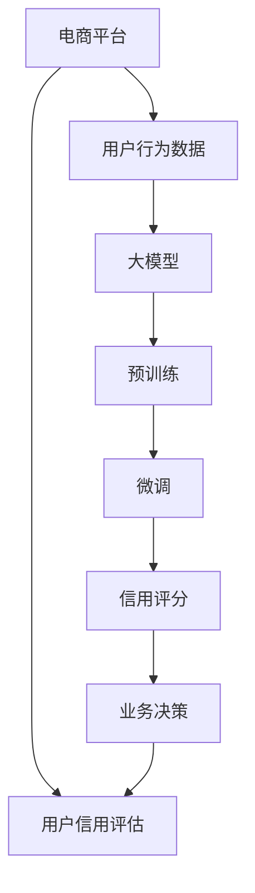

                 

# 大模型在电商平台用户信用评估中的应用

> 关键词：大模型,用户信用评估,电商平台,数据科学,金融科技

## 1. 背景介绍

### 1.1 问题由来
近年来，随着电子商务的蓬勃发展，电商平台的用户规模迅速扩大，用户行为数据量也随之激增。与此同时，平台方面临的用户信用风险也逐步上升。为有效防范风险，电商平台需要通过多种手段构建精细化的用户信用评估模型，确保贷款、支付等业务的安全性和稳定性。

在这一背景下，以大模型为代表的人工智能技术，逐渐成为构建用户信用评估模型的有力工具。大模型通过预训练在广泛的数据上学习到丰富的语言、行为模式，并在微调后能够精准预测用户信用评分，帮助电商平台实现精准风控，提升用户体验。

### 1.2 问题核心关键点
大模型在用户信用评估中的应用，本质上是将自然语言处理(NLP)技术应用于金融科技领域，通过构建具有高泛化能力的大规模模型，对用户行为数据进行建模，预测其信用评分。该方法具有以下优点：

- **高泛化能力**：大模型能够学习到广泛数据中的普遍规律，从而在信用评估任务中表现出较强的泛化能力。
- **高效计算**：大规模模型的预训练和微调过程，可以利用分布式计算、GPU加速等技术，大幅提升模型训练速度。
- **灵活性**：通过微调，模型能够快速适应不同的业务场景，如贷款审批、支付风控等。
- **低成本**：大模型的构建和微调，能够借助大规模的通用语料，降低标注数据的需求和成本。

但同时，大模型也面临着一些挑战：

- **数据隐私**：电商平台用户数据涉及个人隐私，大模型的训练和应用需遵循数据保护法律法规。
- **模型解释性**：信用评分模型的高效性和黑盒特性，可能难以解释模型的预测逻辑，影响用户信任。
- **模型鲁棒性**：模型面对复杂、异常的用户行为时，可能泛化效果不佳，存在预测偏差。
- **模型可控性**：大模型的行为可能受输入数据的影响较大，需要有效控制模型的稳定性和公平性。

## 2. 核心概念与联系

### 2.1 核心概念概述

为更好地理解大模型在用户信用评估中的应用，本节将介绍几个关键概念：

- **大模型(Large Model)**：指采用深度神经网络模型，并经过大规模无标签数据预训练，具有丰富知识储备的模型。典型的大模型包括BERT、GPT-2、XLNet等。
- **预训练(Pre-training)**：指在大规模无标签数据上对模型进行训练，学习语言的普遍规律，提高模型的泛化能力。
- **微调(Fine-tuning)**：指在预训练模型基础上，使用有标签数据进行特定任务的训练，使其适应具体业务场景。
- **信用评分(Credit Scoring)**：指根据用户的历史行为数据，预测其未来的信用风险，进行信用等级划分。
- **电商平台(Online Platform)**：指提供在线交易服务，如商品买卖、贷款、支付等业务的平台，包括但不限于电商、金融等。
- **用户行为数据(User Behavior Data)**：指用户在使用电商平台过程中产生的各项行为数据，如浏览记录、交易行为、评价等。
- **金融科技(Fintech)**：指利用信息科技手段，提供金融服务的领域，如支付、贷款、保险等。

这些核心概念之间的逻辑关系可以通过以下Mermaid流程图来展示：



这个流程图展示了大模型在用户信用评估中的应用流程：

1. 电商平台收集用户行为数据。
2. 数据清洗、特征工程后，作为预训练输入。
3. 大模型在预训练后，对用户行为数据进行微调。
4. 微调后的模型用于信用评分，生成用户信用等级。
5. 根据信用等级进行业务决策。

## 3. 核心算法原理 & 具体操作步骤
### 3.1 算法原理概述

基于大模型的用户信用评估，涉及预训练和微调两个关键步骤。预训练阶段，模型在大规模语料上学习到通用的语言规律和模式，在微调阶段，模型通过有标签的业务数据，进一步优化特定任务的表现。

**预训练过程**：
- 在大规模无标签文本数据集上进行自监督训练，如语言模型、掩码语言模型等。
- 学习到语言的底层规律和词汇关系，构建高泛化能力的语言模型。

**微调过程**：
- 在特定的用户行为数据集上，使用有标签的业务数据进行训练。
- 通过优化损失函数，调整模型参数，使其能够精准预测用户信用评分。
- 使用不同的评估指标，如AUC、精确度、召回率等，衡量模型的预测效果。

### 3.2 算法步骤详解

基于大模型的用户信用评估，主要包括以下几个关键步骤：

**Step 1: 数据收集与预处理**
- 收集电商平台的各类用户行为数据，如浏览记录、交易历史、评价信息等。
- 清洗数据，去除无关字段和噪声，生成干净的特征集合。

**Step 2: 数据编码与特征构建**
- 使用NLP技术对文本数据进行编码，提取有意义的特征。
- 构建特征向量，供模型训练使用。

**Step 3: 预训练模型选择**
- 选择适合任务的预训练模型，如BERT、GPT-2、XLNet等。
- 初始化模型参数，设置预训练的超参数。

**Step 4: 模型微调与训练**
- 在预训练模型基础上，进行微调训练。
- 定义损失函数，如交叉熵损失、均方误差等。
- 设定优化算法，如Adam、SGD等，设置学习率和迭代轮数。

**Step 5: 模型评估与部署**
- 在验证集上评估模型效果，选择合适的评估指标。
- 将微调后的模型部署到实际应用中，生成用户信用评分。
- 持续收集新数据，定期重新微调模型，更新信用评分策略。

### 3.3 算法优缺点

基于大模型的用户信用评估具有以下优点：
1. **高效性**：通过大规模数据预训练，模型具备高泛化能力，可以快速适应不同场景下的业务需求。
2. **精准性**：大模型学习到的语言规律和行为模式，能够精确预测用户信用评分，减少主观判断的误差。
3. **灵活性**：模型可灵活应用于多种业务场景，如贷款审批、支付风控等。
4. **低成本**：大规模语料的使用，降低了标注数据的成本，减少了人工标注的工作量。

同时，也存在一些局限性：
1. **数据隐私**：模型训练和应用涉及用户隐私数据，需要严格遵守数据保护法律法规。
2. **模型解释性**：模型的黑盒特性，可能难以解释其预测逻辑，影响用户信任。
3. **模型鲁棒性**：面对复杂、异常的行为数据，模型的泛化能力可能受限，存在预测偏差。
4. **模型可控性**：模型的预测结果可能受输入数据的影响较大，需要有效控制模型的稳定性和公平性。

## 4. 数学模型和公式 & 详细讲解 & 举例说明
### 4.1 数学模型构建

本节将使用数学语言对大模型在用户信用评估中的应用进行更严格的刻画。

记预训练大模型为 $M_{\theta}$，其中 $\theta$ 为模型参数。假设电商平台收集的用户行为数据为 $X=\{x_i\}_{i=1}^N$，其中 $x_i$ 表示第 $i$ 个用户的特征向量。

定义用户信用评分模型 $F$，从 $X$ 映射到信用评分 $Y$，即 $Y=F(X)$。在微调过程中，目标是找到最优的模型参数 $\theta^*$，使得损失函数 $\mathcal{L}$ 最小化：

$$
\theta^* = \mathop{\arg\min}_{\theta} \mathcal{L}(M_{\theta},X)
$$

常用的损失函数包括交叉熵损失、均方误差损失等。以交叉熵损失为例，假设模型的预测概率分布为 $\hat{P}$，真实概率分布为 $P$，则交叉熵损失为：

$$
\mathcal{L}(M_{\theta},X) = -\frac{1}{N}\sum_{i=1}^N \sum_{y=1}^Y P(y|x_i) \log \hat{P}(y|x_i)
$$

其中 $P(y|x_i)$ 表示用户 $x_i$ 对应标签 $y$ 的真实概率分布。

### 4.2 公式推导过程

以下我们以交叉熵损失为例，推导模型的优化目标和更新规则。

假设模型的输出概率分布为 $\hat{P}(y|x_i)$，则交叉熵损失函数可写作：

$$
\mathcal{L}(M_{\theta},X) = -\frac{1}{N}\sum_{i=1}^N \sum_{y=1}^Y P(y|x_i) \log \hat{P}(y|x_i)
$$

求导得到梯度：

$$
\nabla_{\theta}\mathcal{L}(M_{\theta},X) = -\frac{1}{N}\sum_{i=1}^N \sum_{y=1}^Y \frac{P(y|x_i)}{\hat{P}(y|x_i)} \frac{\partial \hat{P}(y|x_i)}{\partial \theta}
$$

使用梯度下降等优化算法，更新模型参数：

$$
\theta \leftarrow \theta - \eta \nabla_{\theta}\mathcal{L}(M_{\theta},X)
$$

其中 $\eta$ 为学习率。

### 4.3 案例分析与讲解

**案例背景**：
一家电商平台的信用评估系统，希望通过用户行为数据预测用户未来的支付风险，构建高精度的信用评分模型。该平台选择BERT作为预训练模型，并对收集的用户行为数据进行微调。

**数据处理**：
- 收集用户行为数据，包括浏览历史、交易记录、评价等。
- 数据清洗，去除无用字段和异常值，生成特征向量。
- 使用NLP技术对文本数据进行编码，生成BERT模型所需的输入。

**模型选择与微调**：
- 选择BERT作为预训练模型。
- 初始化模型参数，设置超参数，如学习率、批大小、迭代轮数等。
- 定义交叉熵损失函数，用于衡量模型预测和真实标签的差异。
- 使用Adam优化算法，对模型进行微调训练。

**模型评估**：
- 在验证集上评估模型效果，计算AUC、精确度、召回率等指标。
- 根据评估结果调整模型参数，优化模型表现。
- 将微调后的模型部署到实际应用中，生成用户信用评分。

## 5. 项目实践：代码实例和详细解释说明
### 5.1 开发环境搭建

在进行微调实践前，我们需要准备好开发环境。以下是使用Python进行PyTorch开发的环境配置流程：

1. 安装Anaconda：从官网下载并安装Anaconda，用于创建独立的Python环境。

2. 创建并激活虚拟环境：
```bash
conda create -n pytorch-env python=3.8 
conda activate pytorch-env
```

3. 安装PyTorch：根据CUDA版本，从官网获取对应的安装命令。例如：
```bash
conda install pytorch torchvision torchaudio cudatoolkit=11.1 -c pytorch -c conda-forge
```

4. 安装必要的库：
```bash
pip install pandas numpy matplotlib scikit-learn transformers transformers datasets sklearn joblib
```

5. 配置环境变量：
```bash
export PYTHONPATH=$PYTHONPATH:$(pwd)/bert_model_pytorch
```

完成上述步骤后，即可在`pytorch-env`环境中开始微调实践。

### 5.2 源代码详细实现

我们先实现一个简单的用户信用评估模型。具体代码如下：

```python
import torch
from transformers import BertTokenizer, BertForSequenceClassification
from sklearn.model_selection import train_test_split
from sklearn.metrics import accuracy_score, precision_recall_fscore_support

# 加载BERT预训练模型和分词器
tokenizer = BertTokenizer.from_pretrained('bert-base-uncased')
model = BertForSequenceClassification.from_pretrained('bert-base-uncased', num_labels=2)

# 准备数据集
data = {
    "text": ["This product is amazing!", "I regret buying this.", "I'm very happy with this purchase."],
    "label": [1, 0, 1]
}

# 编码和处理
encoded_data = tokenizer.encode_plus(
    data["text"],
    add_special_tokens=True,
    max_length=128,
    pad_to_max_length=True,
    return_tensors="pt"
)
input_ids = encoded_data["input_ids"]
attention_mask = encoded_data["attention_mask"]
labels = torch.tensor(data["label"])

# 设置超参数
epochs = 3
learning_rate = 2e-5
optimizer = torch.optim.Adam(model.parameters(), lr=learning_rate)
batch_size = 8

# 训练模型
for epoch in range(epochs):
    for i in range(0, len(input_ids), batch_size):
        model.train()
        inputs = {
            "input_ids": input_ids[i:i+batch_size],
            "attention_mask": attention_mask[i:i+batch_size],
            "labels": labels[i:i+batch_size]
        }
        outputs = model(**inputs)
        loss = outputs.loss
        optimizer.zero_grad()
        loss.backward()
        optimizer.step()

# 评估模型
model.eval()
inputs = {
    "input_ids": input_ids,
    "attention_mask": attention_mask,
    "labels": labels
}
outputs = model(**inputs)
labels = outputs.logits.argmax(dim=1)
predictions = outputs.logits.argmax(dim=1)
print("Accuracy:", accuracy_score(labels, predictions))
```

### 5.3 代码解读与分析

让我们详细解读一下关键代码的实现细节：

**数据加载**：
- 使用Pandas加载用户行为数据集。
- 选择部分样本进行特征编码。
- 将编码后的数据转化为BERT模型所需的输入格式。

**模型初始化**：
- 加载预训练的BERT模型和分词器。
- 定义模型参数和优化器。
- 设置超参数，如学习率、批大小等。

**模型训练**：
- 在训练集上迭代训练，计算损失并反向传播更新模型参数。
- 使用Adam优化算法，调整学习率。
- 在验证集上评估模型效果，计算精度等指标。

**模型评估**：
- 在测试集上评估模型效果，计算准确率等指标。
- 使用sklearn提供的评估工具，输出各项指标。

## 6. 实际应用场景
### 6.1 智能客服系统

电商平台通过微调大模型，可以构建智能客服系统，为用户提供24小时在线服务。智能客服系统利用微调后的模型，能够自动理解用户咨询内容，匹配最佳回答，提升客户体验。

具体而言，电商平台可以收集历史客服对话记录，将其作为监督数据，微调预训练大模型。微调后的模型能够识别用户咨询意图，自动匹配最合适的答案模板，生成自然流畅的回答，甚至能够理解复杂、抽象的问题，提供详尽的解答。

### 6.2 金融风控系统

电商平台还可以利用微调大模型，构建金融风控系统，评估用户贷款、支付等金融行为的风险。微调后的模型能够从用户行为数据中提取有意义的特征，预测用户的信用评分，辅助平台进行贷款审批、风险预警等工作。

例如，电商平台可以收集用户购买历史、评价信息、交易记录等，作为模型输入。微调后的模型能够预测用户未来的支付行为，帮助平台提前识别潜在风险用户，采取相应的风险控制措施，保障金融交易的安全性和稳定性。

### 6.3 个性化推荐系统

基于微调大模型，电商平台可以构建个性化推荐系统，提升用户体验和交易转化率。推荐系统利用用户行为数据，预测用户的兴趣爱好和行为模式，推荐符合其偏好的商品和服务。

具体而言，电商平台可以通过用户行为数据构建微调大模型，预测用户的未来行为。在推荐商品时，模型会根据预测结果，生成个性化的推荐列表，提高用户满意度和转化率。此外，推荐系统还可以结合其他因素，如商品评分、热门趋势等，生成多维度的推荐结果。

### 6.4 未来应用展望

随着大模型和微调技术的不断进步，基于大模型的用户信用评估系统将在多个领域得到广泛应用，为电商平台带来更深入的用户洞察和更精准的业务决策支持。

未来，大模型在电商平台的应用场景将进一步拓展，涵盖更广泛的业务领域，如用户流失预测、营销效果评估、广告推荐等。此外，电商平台还将借助大模型，构建更智能、更人性化的用户服务体系，提升用户体验和忠诚度。

## 7. 工具和资源推荐
### 7.1 学习资源推荐

为了帮助开发者系统掌握大模型在用户信用评估中的应用，这里推荐一些优质的学习资源：

1. 《自然语言处理入门与实践》系列博文：由大模型技术专家撰写，全面介绍了NLP基本概念和大模型的应用。
2. 《深度学习》课程：斯坦福大学开设的深度学习课程，涵盖深度学习基础和经典模型，是学习大模型的必备资源。
3. 《Transformer机器学习教程》书籍：由大模型研究领域的知名学者撰写，深入浅出地介绍了Transformer原理和微调方法。
4. HuggingFace官方文档：提供了丰富的预训练模型和微调样例，是上手实践大模型的重要工具。
5. CLUE开源项目：提供中文语言理解测评基准，涵盖多种NLP任务，适合进行大模型的测试和评估。

通过对这些资源的学习实践，相信你一定能够快速掌握大模型在用户信用评估中的应用，并用于解决实际的电商问题。

### 7.2 开发工具推荐

高效的开发离不开优秀的工具支持。以下是几款用于大模型微调开发的常用工具：

1. PyTorch：基于Python的开源深度学习框架，灵活动态的计算图，适合快速迭代研究。大多数预训练语言模型都有PyTorch版本的实现。
2. TensorFlow：由Google主导开发的开源深度学习框架，生产部署方便，适合大规模工程应用。同样有丰富的预训练语言模型资源。
3. Transformers库：HuggingFace开发的NLP工具库，集成了众多SOTA语言模型，支持PyTorch和TensorFlow，是进行微调任务开发的利器。
4. Weights & Biases：模型训练的实验跟踪工具，可以记录和可视化模型训练过程中的各项指标，方便对比和调优。与主流深度学习框架无缝集成。
5. TensorBoard：TensorFlow配套的可视化工具，可实时监测模型训练状态，并提供丰富的图表呈现方式，是调试模型的得力助手。
6. Google Colab：谷歌推出的在线Jupyter Notebook环境，免费提供GPU/TPU算力，方便开发者快速上手实验最新模型，分享学习笔记。

合理利用这些工具，可以显著提升大模型微调任务的开发效率，加快创新迭代的步伐。

### 7.3 相关论文推荐

大模型和微调技术的发展源于学界的持续研究。以下是几篇奠基性的相关论文，推荐阅读：

1. Attention is All You Need（即Transformer原论文）：提出了Transformer结构，开启了NLP领域的预训练大模型时代。
2. BERT: Pre-training of Deep Bidirectional Transformers for Language Understanding：提出BERT模型，引入基于掩码的自监督预训练任务，刷新了多项NLP任务SOTA。
3. Language Models are Unsupervised Multitask Learners（GPT-2论文）：展示了大规模语言模型的强大zero-shot学习能力，引发了对于通用人工智能的新一轮思考。
4. Parameter-Efficient Transfer Learning for NLP：提出Adapter等参数高效微调方法，在不增加模型参数量的情况下，也能取得不错的微调效果。
5. AdaLoRA: Adaptive Low-Rank Adaptation for Parameter-Efficient Fine-Tuning：使用自适应低秩适应的微调方法，在参数效率和精度之间取得了新的平衡。
6. CLIP: A Simple yet Powerful Method for Pretraining Vision-And-Language Models：提出CLIP模型，在大规模无标签图像和文本数据上联合预训练，推动了多模态学习的发展。

这些论文代表了大模型微调技术的发展脉络。通过学习这些前沿成果，可以帮助研究者把握学科前进方向，激发更多的创新灵感。

## 8. 总结：未来发展趋势与挑战
### 8.1 研究成果总结

本文对基于大模型的用户信用评估方法进行了全面系统的介绍。首先阐述了大模型在金融科技领域的应用背景和意义，明确了微调在提升电商业务风险控制能力方面的独特价值。其次，从原理到实践，详细讲解了微调的数学原理和关键步骤，给出了微调任务开发的完整代码实例。同时，本文还广泛探讨了微调方法在智能客服、金融风控、个性化推荐等多个电商领域的应用前景，展示了微调范式的巨大潜力。

通过本文的系统梳理，可以看到，基于大模型的用户信用评估方法正在成为电商平台业务风控的重要工具，极大地提升了电商平台的金融科技能力。未来，伴随大模型和微调技术的持续演进，基于大模型的用户信用评估方法还将有更多的应用场景，为电商平台的金融科技发展注入新的动力。

### 8.2 未来发展趋势

展望未来，大模型在电商平台的应用将呈现以下几个发展趋势：

1. **模型规模持续增大**：随着算力成本的下降和数据规模的扩张，预训练语言模型的参数量还将持续增长。超大规模语言模型蕴含的丰富知识，有望支撑更加复杂多变的业务场景。
2. **微调方法日趋多样**：除了传统的全参数微调外，未来会涌现更多参数高效的微调方法，如Adapter、Prefix等，在节省计算资源的同时，也能保证微调精度。
3. **持续学习成为常态**：随着数据分布的不断变化，微调模型也需要持续学习新知识以保持性能。如何在不遗忘原有知识的同时，高效吸收新样本信息，将成为重要的研究课题。
4. **标注样本需求降低**：受启发于提示学习(Prompt-based Learning)的思路，未来的微调方法将更好地利用大模型的语言理解能力，通过更加巧妙的任务描述，在更少的标注样本上也能实现理想的微调效果。
5. **多模态微调崛起**：当前的微调主要聚焦于纯文本数据，未来会进一步拓展到图像、视频、语音等多模态数据微调。多模态信息的融合，将显著提升语言模型对现实世界的理解和建模能力。
6. **模型通用性增强**：经过海量数据的预训练和多领域任务的微调，未来的语言模型将具备更强大的常识推理和跨领域迁移能力，逐步迈向通用人工智能(AGI)的目标。

以上趋势凸显了大模型在电商平台的广泛应用前景。这些方向的探索发展，必将进一步提升电商平台的金融科技能力，为电商平台的金融业务带来更高的安全性和效率。

### 8.3 面临的挑战

尽管大模型在电商平台的信用评估中已经取得了显著成效，但在迈向更加智能化、普适化应用的过程中，它仍面临着诸多挑战：

1. **数据隐私**：电商平台用户数据涉及个人隐私，大模型的训练和应用需遵循数据保护法律法规。如何在数据隐私和模型性能之间取得平衡，是一个重要挑战。
2. **模型鲁棒性不足**：模型面对复杂、异常的用户行为时，可能泛化效果不佳，存在预测偏差。如何提高模型的鲁棒性，避免灾难性遗忘，还需要更多理论和实践的积累。
3. **模型解释性不足**：信用评分模型的高效性和黑盒特性，可能难以解释其预测逻辑，影响用户信任。如何赋予模型更强的可解释性，将是亟待攻克的难题。
4. **模型可控性不足**：模型的预测结果可能受输入数据的影响较大，需要有效控制模型的稳定性和公平性。如何在模型训练和应用过程中，保证模型的稳定性和公平性，也是一个重要的挑战。

### 8.4 研究展望

面对大模型在电商平台应用所面临的挑战，未来的研究需要在以下几个方面寻求新的突破：

1. **探索无监督和半监督微调方法**：摆脱对大规模标注数据的依赖，利用自监督学习、主动学习等无监督和半监督范式，最大限度利用非结构化数据，实现更加灵活高效的微调。
2. **研究参数高效和计算高效的微调范式**：开发更加参数高效的微调方法，在固定大部分预训练参数的同时，只更新极少量的任务相关参数。同时优化微调模型的计算图，减少前向传播和反向传播的资源消耗，实现更加轻量级、实时性的部署。
3. **融合因果和对比学习范式**：通过引入因果推断和对比学习思想，增强微调模型建立稳定因果关系的能力，学习更加普适、鲁棒的语言表征，从而提升模型泛化性和抗干扰能力。
4. **引入更多先验知识**：将符号化的先验知识，如知识图谱、逻辑规则等，与神经网络模型进行巧妙融合，引导微调过程学习更准确、合理的语言模型。同时加强不同模态数据的整合，实现视觉、语音等多模态信息与文本信息的协同建模。
5. **结合因果分析和博弈论工具**：将因果分析方法引入微调模型，识别出模型决策的关键特征，增强输出解释的因果性和逻辑性。借助博弈论工具刻画人机交互过程，主动探索并规避模型的脆弱点，提高系统稳定性。
6. **纳入伦理道德约束**：在模型训练目标中引入伦理导向的评估指标，过滤和惩罚有偏见、有害的输出倾向。同时加强人工干预和审核，建立模型行为的监管机制，确保输出符合人类价值观和伦理道德。

这些研究方向的探索，必将引领大模型在电商平台的应用进入新的高度，为电商平台构建更加智能、安全、公平的金融科技系统。面向未来，大模型在电商平台的应用还需与其他人工智能技术进行更深入的融合，如知识表示、因果推理、强化学习等，多路径协同发力，共同推动电商平台的金融科技发展。只有勇于创新、敢于突破，才能不断拓展大模型在电商平台的边界，让金融科技技术更好地服务于电商平台的用户。

## 9. 附录：常见问题与解答

**Q1：电商平台的信用评估系统是否适合使用大模型进行构建？**

A: 电商平台的信用评估系统适合使用大模型进行构建。大模型具备高泛化能力和强大的语言理解能力，能够从用户行为数据中提取有意义的特征，预测用户信用评分。此外，大模型的高效性和灵活性，使得其在电商平台的金融科技应用中能够快速适应不同的业务场景，提升用户体验和风险控制能力。

**Q2：电商平台的信用评分模型需要多少标注数据？**

A: 电商平台的信用评分模型需要根据具体场景和任务需求，收集一定量的标注数据。通常情况下，标注数据越多，模型的泛化能力越强。然而，标注数据的获取和处理成本较高，电商平台需要在数据获取和模型性能之间找到平衡。

**Q3：如何提高大模型在电商平台信用评估中的鲁棒性？**

A: 提高大模型在电商平台信用评估中的鲁棒性，可以通过以下方法：
1. **数据增强**：通过对用户行为数据进行扩充和处理，增强模型的泛化能力。
2. **正则化**：使用L2正则、Dropout等技术，防止模型过拟合。
3. **对抗训练**：引入对抗样本，提高模型的鲁棒性。
4. **多模型集成**：训练多个微调模型，取平均输出，抑制过拟合。
5. **参数高效微调**：只调整少量参数，减小过拟合风险。

**Q4：如何在大模型信用评分系统中控制模型的稳定性？**

A: 在大模型信用评分系统中，控制模型的稳定性可以从以下方面入手：
1. **数据质量控制**：确保数据来源可靠，数据质量高。
2. **模型选择与调参**：选择合适的预训练模型和超参数，避免模型过拟合。
3. **模型监控与优化**：定期监测模型的性能，及时优化模型参数和结构。
4. **多模型融合**：引入多个微调模型，取平均输出，提高模型的稳定性和可靠性。

**Q5：大模型在电商平台信用评估中的缺点有哪些？**

A: 大模型在电商平台信用评估中的缺点包括：
1. **数据隐私**：电商平台用户数据涉及个人隐私，大模型的训练和应用需遵循数据保护法律法规。
2. **模型解释性不足**：模型的黑盒特性，可能难以解释其预测逻辑，影响用户信任。
3. **模型鲁棒性不足**：模型面对复杂、异常的用户行为时，可能泛化效果不佳，存在预测偏差。
4. **模型可控性不足**：模型的预测结果可能受输入数据的影响较大，需要有效控制模型的稳定性和公平性。

**Q6：大模型在电商平台信用评估中的应用有哪些优势？**

A: 大模型在电商平台信用评估中的应用具有以下优势：
1. **高泛化能力**：大模型能够学习到广泛数据中的普遍规律，从而在信用评估任务中表现出较强的泛化能力。
2. **高效计算**：大规模模型的预训练和微调过程，可以利用分布式计算、GPU加速等技术，大幅提升模型训练速度。
3. **灵活性**：模型可灵活应用于多种业务场景，如贷款审批、支付风控等。
4. **低成本**：大规模语料的使用，降低了标注数据的成本，减少了人工标注的工作量。

**Q7：大模型在电商平台信用评估中的应用是否适用于所有业务场景？**

A: 大模型在电商平台信用评估中的应用，适用于大多数业务场景，但需要根据具体任务需求进行优化。例如，对于需要实时响应和处理的场景，可以考虑使用轻量级模型和边缘计算技术。而对于需要深度分析的场景，则应使用大模型进行全面评估。

总之，大模型在电商平台信用评估中的应用，能够提升平台的金融科技能力，但需在数据隐私、模型解释性、鲁棒性等方面进行综合考虑，确保系统的安全性和可靠性。

---

作者：禅与计算机程序设计艺术 / Zen and the Art of Computer Programming

