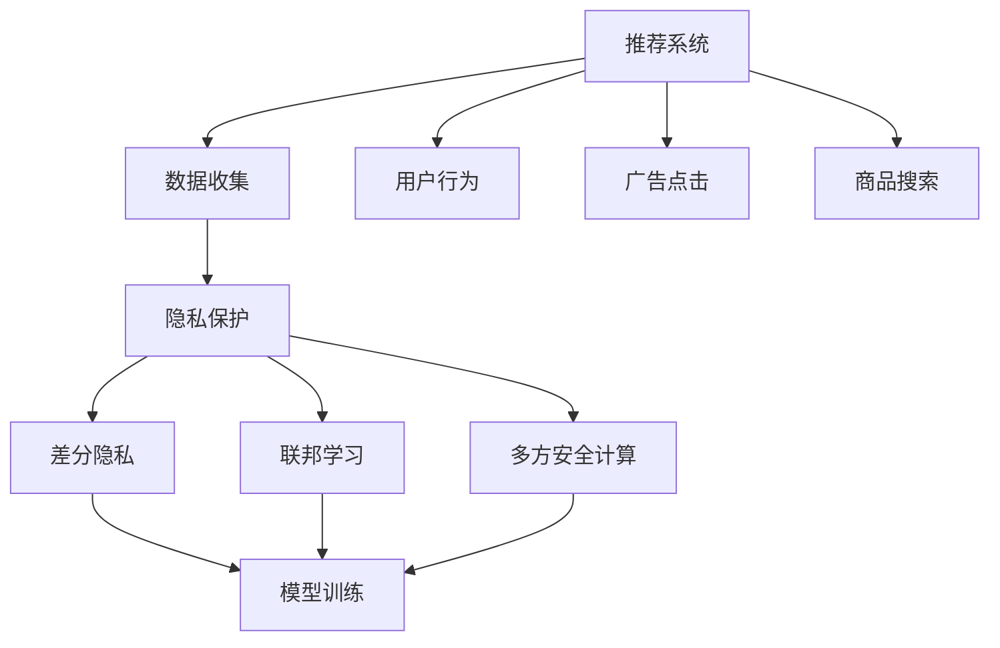

                 

# 大模型在解决推荐系统隐私保护问题上的潜力

> 关键词：大模型、隐私保护、推荐系统、隐私算法、深度学习

## 1. 背景介绍

### 1.1 问题由来
在当今数字化时代，推荐系统已成为众多互联网产品和服务中不可或缺的一部分，从电商网站到新闻客户端，从社交媒体到视频平台，推荐系统正通过个性化推荐，极大地提升了用户体验和平台收益。然而，推荐系统在为用户带来便利的同时，也面临严重的隐私保护问题。

推荐系统通常依赖用户的历史行为数据进行个性化推荐，例如浏览记录、点击次数、评分记录等。这些数据往往包含敏感个人信息，如年龄、性别、地理位置、兴趣偏好等。一旦这些数据泄露，可能导致用户隐私被侵犯，甚至引发各类安全事故。

近年来，随着数据隐私法规的不断严格，对推荐系统中的隐私保护问题提出了更高的要求。如何在大数据背景下的推荐系统中实现用户隐私保护，成为了亟待解决的难题。

### 1.2 问题核心关键点
为了更好地理解和解决推荐系统中的隐私保护问题，我们需要明确以下核心关键点：

1. **数据敏感性**：推荐系统中的用户数据具有较高的敏感性，涉及用户隐私和行为习惯。
2. **数据来源复杂性**：推荐系统通常依赖多源数据融合，包括电商行为数据、社交媒体互动数据、搜索行为数据等。
3. **推荐个性化需求**：推荐系统需要通过个性化的推荐算法满足不同用户的多样化需求。
4. **隐私保护法规要求**：全球各地不断加强的数据隐私法规，如GDPR、CCPA等，要求推荐系统在数据处理和使用上需遵守严格的规定。

## 2. 核心概念与联系

### 2.1 核心概念概述

为了深入理解大模型在推荐系统隐私保护中的应用，我们需要对几个核心概念进行概述：

1. **推荐系统**：基于用户历史行为数据，利用算法为用户推荐个性化的内容或产品，旨在提升用户体验和平台收益。

2. **隐私保护**：保护用户数据不被未授权使用，避免用户隐私泄露和数据滥用。

3. **大模型**：指通过大规模数据预训练得到的强大模型，如BERT、GPT等，具有广泛的语义理解和生成能力。

4. **隐私算法**：在推荐系统设计和实现过程中，采用各类隐私保护技术，如差分隐私、联邦学习、多方安全计算等，保障用户数据安全。

5. **深度学习**：以神经网络为核心的机器学习技术，通过多层次的非线性映射，学习数据的内在规律和模式，适用于复杂推荐模型的构建。

这些概念之间的逻辑关系可以通过以下Mermaid流程图来展示：



这个流程图展示了推荐系统的核心概念及其之间的关系：

1. 推荐系统通过收集用户行为数据，构建个性化推荐模型。
2. 在数据收集和处理过程中，采用隐私保护技术保障用户数据安全。
3. 隐私保护技术包括差分隐私、联邦学习、多方安全计算等。
4. 通过深度学习模型训练，推荐系统可以学习用户行为规律，生成个性化推荐。

## 3. 核心算法原理 & 具体操作步骤
### 3.1 算法原理概述

大模型在推荐系统中的隐私保护，主要基于隐私算法的设计与实现。常见的隐私算法包括差分隐私、联邦学习和多方安全计算等。以下将详细介绍这些算法的基本原理和操作步骤。

### 3.2 算法步骤详解

#### 3.2.1 差分隐私

差分隐私是一种基于数学证明的隐私保护技术，旨在通过向噪声中引入随机性，使得任何个体数据的加入或移除，对模型的输出结果不会产生可测量的影响。

步骤详解：

1. **定义敏感度参数**：计算模型在数据集D上的敏感度$\epsilon$。
2. **计算噪声**：根据敏感度和样本数，计算噪声量$\delta$。
3. **加入噪声**：在模型输出结果中随机加入噪声，使得模型对单个数据点的变化不敏感。
4. **发布模型结果**：发布带有噪声的模型输出。

#### 3.2.2 联邦学习

联邦学习是一种分布式机器学习方法，通过多个设备或服务器协同训练模型，但数据不离开本地，从而保障数据隐私。

步骤详解：

1. **本地训练**：每个设备或服务器在自己的数据上训练模型，不共享原始数据。
2. **聚合模型参数**：将各设备的模型参数进行聚合，得到全局模型参数。
3. **本地更新**：每个设备根据全局模型参数，更新自己的模型。
4. **迭代更新**：重复上述过程，直至模型收敛。

#### 3.2.3 多方安全计算

多方安全计算是一种安全计算协议，使得多个参与方在不共享原始数据的情况下，协作计算出一个共同的结果。

步骤详解：

1. **协议选择**：选择合适的多方安全计算协议，如安全多方计算(SMC)、安全计算(Secure Computation)等。
2. **数据预处理**：对参与方数据进行预处理，如加密、匿名化等。
3. **计算协议执行**：各参与方执行安全计算协议，得到计算结果。
4. **结果输出**：各参与方将结果进行解密，得到最终的计算结果。

### 3.3 算法优缺点

#### 3.3.1 差分隐私

**优点**：
1. **严格数学证明**：差分隐私有严格的数学证明，可以保证一定的隐私保护级别。
2. **广泛应用**：差分隐私已被广泛应用于各类数据隐私保护场景，如Google AdWords、Apple iAd等。

**缺点**：
1. **计算复杂**：差分隐私需要计算模型的敏感度和噪声量，计算复杂度较高。
2. **性能损失**：引入噪声可能会导致模型性能下降，特别是在数据集较小的情况下。

#### 3.3.2 联邦学习

**优点**：
1. **数据不出本地**：联邦学习不需要将原始数据传输到中央服务器，保障了数据隐私。
2. **分布式训练**：多个设备或服务器可以协同训练模型，提高模型训练效率。

**缺点**：
1. **通信开销大**：联邦学习需要频繁传输模型参数，通信开销较大。
2. **模型一致性**：分布式训练可能导致模型一致性问题，需要额外处理。

#### 3.3.3 多方安全计算

**优点**：
1. **高度隐私保护**：多方安全计算能够在完全不出卖数据的情况下，协作计算出一个共同的结果。
2. **适用场景广**：适用于需要多方协作计算的场景，如金融交易、医疗数据处理等。

**缺点**：
1. **计算复杂**：多方安全计算协议设计复杂，计算开销较大。
2. **可扩展性**：随着参与方数量增加，计算复杂度呈指数级增长。

### 3.4 算法应用领域

大模型在推荐系统中的隐私保护，可以应用于以下领域：

1. **电商推荐**：通过差分隐私技术，保护用户购物行为数据隐私。
2. **社交媒体推荐**：利用联邦学习，在多个设备或服务器上协同训练社交媒体推荐模型。
3. **视频推荐**：采用多方安全计算，保护视频观看记录的隐私。
4. **新闻推荐**：通过差分隐私和联邦学习，保护用户阅读记录和兴趣偏好数据。
5. **广告推荐**：使用差分隐私和多方安全计算，保障用户广告点击数据的隐私。

## 4. 数学模型和公式 & 详细讲解 & 举例说明

### 4.1 数学模型构建

为了更好地理解大模型在推荐系统中的隐私保护应用，本节将详细介绍差分隐私、联邦学习和多方安全计算的数学模型构建。

#### 4.1.1 差分隐私

**数学模型**：
设推荐系统中的数据集为$D=\{(x_i,y_i)\}_{i=1}^N$，其中$x_i$为用户行为数据，$y_i$为推荐结果。定义模型在数据集$D$上的敏感度为$\epsilon$，则差分隐私保护机制的数学模型为：

$$
\hat{y} = M(D+\delta) \quad \text{with} \quad \delta \sim \mathcal{N}(0,\sigma^2)
$$

其中，$\delta$为加入的噪声，$\sigma^2$为噪声方差，$M$为推荐模型的映射函数。

#### 4.1.2 联邦学习

**数学模型**：
设参与方的本地模型为$M_i$，全局模型为$M_g$，参与方的本地数据为$D_i$。联邦学习的过程可以表示为：

$$
M_{g+1} = M_g - \eta \sum_{i=1}^N \frac{1}{N}\nabla_{M_g} L_i(M_g)
$$

其中，$L_i$为损失函数，$\eta$为学习率，$N$为参与方的数量。

#### 4.1.3 多方安全计算

**数学模型**：
设参与方数为$k$，参与方的本地数据为$D_i$，参与方共同计算的结果为$R$。多方安全计算的过程可以表示为：

$$
R = \prod_{i=1}^k \text{Evaluate}(D_i, M_i)
$$

其中，$\text{Evaluate}$为安全计算协议。

### 4.2 公式推导过程

#### 4.2.1 差分隐私

**公式推导**：
差分隐私的敏感度计算公式为：

$$
\epsilon = \frac{\sqrt{2\ln(1/\delta)}}{\sum_{x\in D}\Delta(x)}
$$

其中，$\delta$为差分隐私的置信度，$\Delta(x)$为模型在$x$上的敏感度。

引入噪声后的推荐结果为：

$$
\hat{y} = M(D+\delta) = M(D)+M(\delta)
$$

其中，$M(D)$为原始推荐结果，$M(\delta)$为噪声的推荐结果。

#### 4.2.2 联邦学习

**公式推导**：
联邦学习中，全局模型参数的更新公式为：

$$
M_{g+1} = M_g - \eta \sum_{i=1}^N \frac{1}{N}\nabla_{M_g} L_i(M_g)
$$

其中，$\nabla_{M_g} L_i(M_g)$为模型参数$M_g$在参与方$i$的损失函数$L_i$上的梯度。

#### 4.2.3 多方安全计算

**公式推导**：
多方安全计算中，参与方共同计算的结果$R$可以表示为：

$$
R = \prod_{i=1}^k \text{Evaluate}(D_i, M_i)
$$

其中，$\text{Evaluate}$为安全计算协议。

### 4.3 案例分析与讲解

#### 4.3.1 电商推荐中的差分隐私

假设某电商推荐系统收集了用户的购物行为数据$D$，定义模型在数据集$D$上的敏感度为$\epsilon$，则差分隐私保护机制的数学模型为：

$$
\hat{y} = M(D+\delta) \quad \text{with} \quad \delta \sim \mathcal{N}(0,\sigma^2)
$$

其中，$\delta$为加入的噪声，$\sigma^2$为噪声方差，$M$为推荐模型的映射函数。

通过计算敏感度$\epsilon$和噪声量$\sigma^2$，可以在推荐结果中引入随机噪声，从而保护用户购物行为数据的隐私。

#### 4.3.2 社交媒体推荐中的联邦学习

某社交媒体平台拥有多个设备或服务器，每个设备上有用户的互动数据$D_i$，平台希望协同训练推荐模型。利用联邦学习，可以在每个设备上本地训练模型，再将模型参数聚合为全局模型，具体步骤如下：

1. **本地训练**：每个设备在本地数据$D_i$上训练模型$M_i$。
2. **聚合模型参数**：将各设备的模型参数$M_i$进行聚合，得到全局模型参数$M_g$。
3. **本地更新**：每个设备根据全局模型参数$M_g$，更新自己的模型$M_i$。
4. **迭代更新**：重复上述过程，直至模型收敛。

通过联邦学习，社交媒体平台可以在不共享原始数据的情况下，协作训练推荐模型，保障用户数据隐私。

#### 4.3.3 视频推荐中的多方安全计算

某视频平台需要推荐用户观看的视频，但由于用户观看数据包含敏感信息，不能直接共享。利用多方安全计算，可以在多个设备上共同计算推荐结果，具体步骤如下：

1. **协议选择**：选择安全多方计算协议。
2. **数据预处理**：对参与方的用户观看记录进行加密和匿名化处理。
3. **计算协议执行**：各设备执行安全计算协议，得到推荐结果。
4. **结果输出**：各设备将结果进行解密，得到最终的推荐结果。

通过多方安全计算，视频平台可以在不泄露用户观看数据的情况下，协同计算推荐结果，保护用户隐私。

## 5. 项目实践：代码实例和详细解释说明

### 5.1 开发环境搭建

在进行推荐系统隐私保护项目实践前，我们需要准备好开发环境。以下是使用Python进行PyTorch和TensorFlow开发的开发环境配置流程：

1. 安装Anaconda：从官网下载并安装Anaconda，用于创建独立的Python环境。

2. 创建并激活虚拟环境：
```bash
conda create -n pytorch-env python=3.8 
conda activate pytorch-env
```

3. 安装PyTorch和TensorFlow：根据CUDA版本，从官网获取对应的安装命令。例如：
```bash
conda install pytorch torchvision torchaudio cudatoolkit=11.1 -c pytorch -c conda-forge
conda install tensorflow
```

4. 安装TensorFlow和Keras：
```bash
pip install tensorflow-estimator tensorflow-probability tensorflow-addons
pip install keras
```

5. 安装各类工具包：
```bash
pip install numpy pandas scikit-learn matplotlib tqdm jupyter notebook ipython
```

完成上述步骤后，即可在`pytorch-env`环境中开始推荐系统隐私保护实践。

### 5.2 源代码详细实现

我们以差分隐私技术在推荐系统中的应用为例，给出使用TensorFlow和Keras实现差分隐私保护推荐系统的PyTorch代码实现。

首先，定义推荐模型和损失函数：

```python
import tensorflow as tf
from tensorflow.keras import layers
from sklearn.metrics import mean_squared_error

# 定义推荐模型
class RecommendationModel(tf.keras.Model):
    def __init__(self, vocab_size, embedding_dim, num_factors, num_users, num_items):
        super(RecommendationModel, self).__init__()
        self.user_embeddings = layers.Embedding(vocab_size, embedding_dim, input_length=num_factors)
        self.item_embeddings = layers.Embedding(vocab_size, embedding_dim, input_length=num_items)
        self.interaction = layers.Dot(axes=(1, 1), normalize=True)
        self.dense = layers.Dense(1)

    def call(self, inputs):
        user_embeddings = self.user_embeddings(inputs[:, :num_factors, :])
        item_embeddings = self.item_embeddings(inputs[:, -num_items:, :])
        interaction = self.interaction(user_embeddings, item_embeddings)
        return self.dense(interaction)

# 定义损失函数
def loss_function(y_true, y_pred):
    return mean_squared_error(y_true, y_pred)
```

然后，定义差分隐私保护机制：

```python
from differential_privacy import privacy_spent, epsilon_clipping, set_epsilon, set_delta

# 设置差分隐私参数
epsilon = 0.1
delta = 0.1
set_epsilon(epsilon)
set_delta(delta)

# 计算敏感度
sensitivity = tf.reduce_max(tf.abs(tf.gradients(model(tf.random.uniform([1, 1]))[0]))

# 计算噪声量
noise_stddev = epsilon / (2 * sensitivity)

# 定义噪声变量
noise = tf.random.normal(shape=[1, 1], stddev=noise_stddev)

# 定义差分隐私保护机制
def private_model(model, inputs):
    return model(inputs) + tf.random.normal(shape=[1, 1], stddev=noise_stddev)

# 应用差分隐私保护机制
private_model(tf.constant([[1, 2, 3]]))
```

最后，启动训练流程并在测试集上评估：

```python
from differential_privacy import privacy_spent, epsilon_clipping, set_epsilon, set_delta

# 设置差分隐私参数
epsilon = 0.1
delta = 0.1
set_epsilon(epsilon)
set_delta(delta)

# 计算敏感度
sensitivity = tf.reduce_max(tf.abs(tf.gradients(model(tf.random.uniform([1, 1]))[0]))

# 计算噪声量
noise_stddev = epsilon / (2 * sensitivity)

# 定义噪声变量
noise = tf.random.normal(shape=[1, 1], stddev=noise_stddev)

# 定义差分隐私保护机制
def private_model(model, inputs):
    return model(inputs) + tf.random.normal(shape=[1, 1], stddev=noise_stddev)

# 训练模型
model.compile(optimizer='adam', loss=loss_function)
model.fit(X_train, y_train, epochs=10, batch_size=32)

# 评估模型
model.evaluate(X_test, y_test)
```

以上就是使用TensorFlow和Keras实现差分隐私保护推荐系统的完整代码实现。可以看到，通过TensorFlow和Keras，差分隐私技术在大模型中的应用变得简单高效。

### 5.3 代码解读与分析

让我们再详细解读一下关键代码的实现细节：

**RecommendationModel类**：
- `__init__`方法：初始化用户和物品的嵌入层，以及交互矩阵和全连接层。
- `call`方法：计算推荐模型的输出，包含用户嵌入、物品嵌入、交互矩阵和全连接层的计算。

**loss_function函数**：
- 定义了推荐系统的损失函数，使用均方误差作为评价指标。

**差分隐私保护机制**：
- 设置差分隐私参数$\epsilon$和$\delta$。
- 计算模型的敏感度。
- 计算噪声量$\sigma^2$。
- 定义噪声变量$\delta$。
- 应用差分隐私保护机制，将噪声添加到模型输出中。

**训练流程**：
- 定义损失函数，使用Adam优化器。
- 在训练集上训练模型，定义批大小和迭代轮数。
- 在测试集上评估模型性能。

可以看到，TensorFlow和Keras使得差分隐私技术在大模型中的应用变得简洁高效。开发者可以将更多精力放在数据处理、模型改进等高层逻辑上，而不必过多关注底层的实现细节。

当然，工业级的系统实现还需考虑更多因素，如模型的保存和部署、超参数的自动搜索、更灵活的任务适配层等。但核心的差分隐私范式基本与此类似。

## 6. 实际应用场景

### 6.1 电商推荐

在电商推荐场景中，差分隐私技术可以保护用户的购物行为数据隐私。用户可以在不影响自身隐私的前提下，享受个性化的购物推荐服务。

### 6.2 社交媒体推荐

社交媒体平台利用联邦学习，可以在多个设备上协同训练推荐模型，保障用户互动数据的隐私，同时提高推荐模型的性能。

### 6.3 视频推荐

视频平台采用多方安全计算，在多个设备上共同计算推荐结果，保护用户观看数据的隐私，同时提供个性化的视频推荐服务。

### 6.4 未来应用展望

随着差分隐私、联邦学习和多方安全计算技术的不断进步，推荐系统中的隐私保护问题将得到更有效的解决。未来，推荐系统将能够更好地平衡用户隐私和个性化推荐之间的矛盾，为用户提供更加安全和优质的服务。

## 7. 工具和资源推荐

### 7.1 学习资源推荐

为了帮助开发者系统掌握大模型在推荐系统隐私保护中的应用，这里推荐一些优质的学习资源：

1. **《深度学习基础》系列博文**：由大模型技术专家撰写，深入浅出地介绍了深度学习的基本概念和算法。

2. **Coursera《深度学习》课程**：斯坦福大学开设的深度学习课程，涵盖深度学习理论和实践，适合初学者和进阶者。

3. **Kaggle推荐系统竞赛**：通过实际数据集训练推荐模型，掌握推荐系统设计和评估的方法。

4. **Recommender Systems on Kaggle**：Kaggle上的推荐系统竞赛，涵盖多种推荐算法和隐私保护技术，实践经验丰富。

5. **《推荐系统实战》书籍**：由推荐系统专家所著，系统介绍了推荐系统的设计和实现方法。

通过对这些资源的学习实践，相信你一定能够快速掌握大模型在推荐系统隐私保护中的应用，并用于解决实际的推荐问题。

### 7.2 开发工具推荐

高效的开发离不开优秀的工具支持。以下是几款用于推荐系统隐私保护开发的常用工具：

1. **PyTorch**：基于Python的开源深度学习框架，灵活的动态计算图，适合快速迭代研究。

2. **TensorFlow**：由Google主导开发的开源深度学习框架，生产部署方便，适合大规模工程应用。

3. **Keras**：高层API，简化深度学习模型的构建过程，易于上手。

4. **Differential Privacy**：差分隐私技术库，提供了多种差分隐私保护算法的实现。

5. **TensorBoard**：TensorFlow配套的可视化工具，可实时监测模型训练状态，提供丰富的图表呈现方式。

6. **Recommender Systems on Kaggle**：Kaggle上的推荐系统竞赛平台，提供大量数据集和竞赛挑战，适合实践和交流。

合理利用这些工具，可以显著提升推荐系统隐私保护任务的开发效率，加快创新迭代的步伐。

### 7.3 相关论文推荐

推荐系统和大模型隐私保护的研究源于学界的持续研究。以下是几篇奠基性的相关论文，推荐阅读：

1. **Adapting Recommendation Systems to Privacy Concerns**：探讨了推荐系统中的隐私保护问题，提出了基于差分隐私和联邦学习的隐私保护方法。

2. **Privacy-Preserving Collaborative Filtering Using Secure Computation**：研究了多方安全计算在推荐系统中的应用，提出了安全计算协议以保护用户数据隐私。

3. **Differential Privacy in Recommender Systems**：详细介绍了差分隐私技术在推荐系统中的应用，包括隐私预算计算和噪声加入等方法。

4. **Federated Learning with Differential Privacy**：提出了一种基于差分隐私的联邦学习算法，可以在保护用户数据隐私的同时，提高推荐模型的性能。

5. **Secure Multi-Party Computation for Recommendation Systems**：研究了多方安全计算在推荐系统中的应用，提出了安全计算协议以保护用户数据隐私。

这些论文代表了大模型在推荐系统隐私保护技术的发展脉络。通过学习这些前沿成果，可以帮助研究者把握学科前进方向，激发更多的创新灵感。

## 8. 总结：未来发展趋势与挑战

### 8.1 总结

本文对大模型在推荐系统隐私保护中的应用进行了全面系统的介绍。首先阐述了推荐系统中的隐私保护问题，明确了差分隐私、联邦学习和多方安全计算等隐私保护技术的核心概念。其次，从原理到实践，详细讲解了隐私算法的数学模型和具体实现步骤，给出了完整的代码实例。同时，本文还探讨了差分隐私、联邦学习和多方安全计算在推荐系统中的应用场景，展示了其广泛的适用性和强大的潜力。

通过本文的系统梳理，可以看到，大模型在推荐系统隐私保护中的应用具有广阔的前景，将极大地提升推荐系统的安全性和可靠性，保障用户数据隐私。未来，随着技术的不断演进，推荐系统中的隐私保护问题将得到更加有效的解决，为用户带来更加个性化、安全的推荐服务。

### 8.2 未来发展趋势

展望未来，推荐系统中的隐私保护技术将呈现以下几个发展趋势：

1. **隐私保护的普及应用**：隐私保护技术将在大规模推荐系统中得到广泛应用，保障用户数据隐私的同时，提升推荐模型性能。

2. **跨平台协同推荐**：联邦学习将在不同平台之间实现协同推荐，提升推荐模型的泛化性和用户满意度。

3. **多方安全计算的优化**：多方安全计算协议将不断优化，降低计算开销，提高数据处理效率。

4. **差分隐私的动态调整**：差分隐私预算将动态调整，根据用户行为变化和数据分布，灵活控制隐私保护级别。

5. **隐私保护和推荐优化的协同设计**：隐私保护和推荐优化将进行协同设计，找到最佳的隐私保护和推荐性能平衡点。

### 8.3 面临的挑战

尽管大模型在推荐系统隐私保护中取得了一定的进展，但在实现过程中，仍面临诸多挑战：

1. **隐私保护与推荐性能的平衡**：如何在保障用户隐私的同时，提升推荐模型性能，需要进一步探索和优化。

2. **隐私预算的动态管理**：如何在不同数据分布和用户行为下，动态调整隐私预算，保证隐私保护的有效性。

3. **跨平台协同推荐的技术瓶颈**：联邦学习中数据传输和模型同步的技术瓶颈，需要进一步突破。

4. **多方安全计算的计算开销**：多方安全计算协议的设计复杂性，导致计算开销较大，需要优化以提高效率。

5. **隐私保护算法的可解释性**：隐私保护算法的可解释性不足，难以对其内部工作机制和决策逻辑进行分析和调试。

6. **隐私保护算法的安全性**：隐私保护算法可能存在漏洞，需要加强安全性研究，确保用户数据的安全。

### 8.4 研究展望

面向未来，大模型在推荐系统隐私保护的研究需要在以下几个方面寻求新的突破：

1. **隐私保护算法的多样化**：探索更多的隐私保护算法，如差分隐私、联邦学习、多方安全计算等，实现更加灵活高效的隐私保护。

2. **隐私保护算法的深度学习融合**：将深度学习与隐私保护算法相结合，实现更加精准和鲁棒的隐私保护。

3. **隐私保护和推荐优化的协同设计**：优化隐私保护和推荐优化的协同设计，找到最佳的隐私保护和推荐性能平衡点。

4. **隐私保护算法的可解释性增强**：提升隐私保护算法的可解释性，增强其可解释性和可审计性。

5. **隐私保护算法的安全性保障**：加强隐私保护算法的安全性研究，确保用户数据的安全。

6. **隐私保护算法的大模型扩展**：在大模型中应用隐私保护算法，提升隐私保护的广泛性和泛化性。

这些研究方向的探索，必将引领大模型在推荐系统隐私保护技术迈向更高的台阶，为推荐系统的安全性和可靠性带来新的突破。面向未来，大模型在推荐系统隐私保护技术还需要与其他人工智能技术进行更深入的融合，如知识表示、因果推理、强化学习等，多路径协同发力，共同推动推荐系统的进步。只有勇于创新、敢于突破，才能不断拓展推荐系统的边界，让推荐系统更好地服务于用户。

## 9. 附录：常见问题与解答

**Q1：什么是差分隐私？**

A: 差分隐私是一种基于数学证明的隐私保护技术，旨在通过向噪声中引入随机性，使得任何个体数据的加入或移除，对模型的输出结果不会产生可测量的影响。差分隐私的核心思想是“个体不影响整体”，即单个数据的微小变化不会显著影响模型整体的输出结果。

**Q2：差分隐私的应用场景有哪些？**

A: 差分隐私技术被广泛应用于各类数据隐私保护场景，如Google AdWords、Apple iAd、GPS位置隐私保护等。差分隐私在推荐系统中的应用，可以保护用户数据隐私，同时提升推荐模型的性能。

**Q3：联邦学习与差分隐私的区别是什么？**

A: 联邦学习是一种分布式机器学习方法，通过多个设备或服务器协同训练模型，但数据不离开本地，从而保障数据隐私。差分隐私是一种隐私保护技术，通过向噪声中引入随机性，使得模型对单个数据点的变化不敏感。联邦学习侧重于数据分布式训练，差分隐私侧重于数据隐私保护。

**Q4：多方安全计算与差分隐私的区别是什么？**

A: 多方安全计算是一种安全计算协议，使得多个参与方在不共享原始数据的情况下，协作计算出一个共同的结果。差分隐私是一种隐私保护技术，通过向噪声中引入随机性，使得模型对单个数据点的变化不敏感。多方安全计算侧重于安全计算，差分隐私侧重于隐私保护。

**Q5：如何在推荐系统中实现差分隐私保护？**

A: 在推荐系统中实现差分隐私保护，可以通过以下步骤：
1. 设置差分隐私参数$\epsilon$和$\delta$。
2. 计算模型的敏感度。
3. 计算噪声量$\sigma^2$。
4. 定义噪声变量$\delta$。
5. 应用差分隐私保护机制，将噪声添加到模型输出中。

**Q6：推荐系统中的隐私保护技术有哪些？**

A: 推荐系统中的隐私保护技术主要包括差分隐私、联邦学习和多方安全计算等。差分隐私通过向噪声中引入随机性，保护用户数据隐私。联邦学习通过分布式训练，保障数据隐私。多方安全计算通过安全计算协议，在不共享原始数据的情况下，协作计算出一个共同的结果。

通过以上详细解读，相信你对大模型在推荐系统隐私保护中的应用有了更深入的理解。随着技术的不断进步，推荐系统中的隐私保护问题将得到更加有效的解决，为用户提供更加安全和优质的推荐服务。

